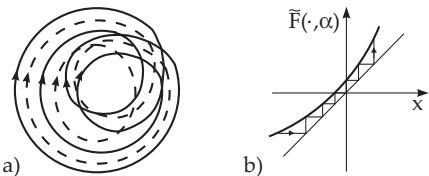
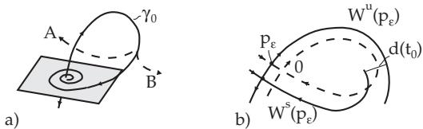
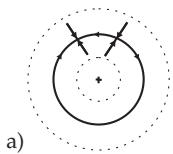
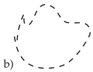
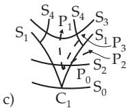
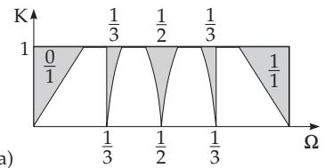
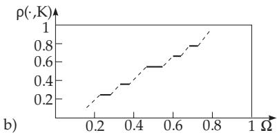

#### 17.3.2 Transitions to Chaos

Often a strange attractor does not arise suddenly but as the result of a sequence of bifurcations, from which the typical ones are represented in Section 17.3.1. The most important ways to create strange attractors or strange invariant sets are described in the following.

##### 17.3.2.1 Cascade of Period Doublings

Analogously to the logistic equation (17.84), a cascade of period doublings can also occur in timecontinuous systems in the following way. Suppose system (17.67) has the stable periodic orbit $\gamma _ { \varepsilon } ^ { ( 1 ) }$ for $\varepsilon < \varepsilon _ { 1 }$ . For $\varepsilon = \varepsilon _ { 1 }$ a period doubling occurs near $\gamma _ { \varepsilon _ { 1 } } ^ { ( 1 ) }$ , at which the periodic orbit $\gamma _ { \varepsilon } ^ { ( 1 ) }$ loses its stability for $\varepsilon > \varepsilon _ { 1 }$ . A periodic orbit $\gamma _ { \varepsilon _ { 1 } } ^ { ( 2 ) }$ with approximately double period splits from it. $\mathrm { A t } \ \varepsilon = \varepsilon _ { 2 }$ , there is a new period doubling, where $\gamma _ { \varepsilon _ { 2 } } ^ { ( 2 ) }$ loses its stability and a stable orbit $\gamma _ { \varepsilon _ { 2 } } ^ { ( 4 ) }$ with an approximately double period arises. For important classes of systems (17.67) this procedure of period doubling continues, so a sequence of parameter values $\left\{ \varepsilon _ { j } \right\}$ arises.

Numerical calculations for certain diferential equations (17.67), e.g., for hydrodynamical diferential equations such as the Lorenz system, show the existence of the limit

$$
\operatorname* { l i m } _ { j  + \infty } \frac { \varepsilon _ { j + 1 } - \varepsilon _ { j } } { \varepsilon _ { j + 2 } - \varepsilon _ { j + 1 } } = \delta , \mathrm { w h e r e } \delta\tag{17.89}
$$

is again the Feigenbaum constant. g

For $\varepsilon _ { * } = \operatorname* { l i m } _ { j \to \infty } \varepsilon _ { j }$ , the cycle with infinite period loses its stability, and a strange attractor appears.

The geometric background for this strange attractor in (17.67) by a cascade of period doubling is shown in Fig. 17.34a. The Poincar´e section shows approximately a baker mapping, which suggests that a Cantor set-like structure is created.

  
Figure 17.34

##### 17.3.2.2 Intermittency

Consider a stable periodic orbit of (17.67), which loses its stability for $\varepsilon ~ = ~ 0$ when exactly one of the multipliers, for $\varepsilon < 0$ inside the unit circle takes the value +1. According to the center manifold theorem, the corresponding saddle-node bifurcation of the Poincar´e mapping can be described by a one-dimensional mapping in the normal form $x \mapsto { \tilde { F } } ( x , \alpha ) = \alpha + x + x ^ { 2 } + \cdot \cdot \cdot$ . Here α is a parameter depending on ε, i.e., $\alpha = \alpha ( \varepsilon )$ with $\alpha ( 0 ) = 0$ . The graph of $\tilde { F } ( \cdot , \alpha )$ for positive α is represented in Fig. 17.34b.

As can be seen in Fig. 17.34b, the iterates of $\tilde { F } ( \cdot , \alpha )$ stay for a relatively long time in the tunnel zone for $\alpha \gtrsim 0$ . For equation (17.67), this means that the corresponding orbits stay relatively long in the neighborhood of the original periodic orbit. During this time, the behavior of (17.68) is approximately periodic (laminar phase). After getting through the tunnel zone the considered orbit escapes, which results in irregular motion (turbulent phase). After a certain time the orbit is recovered and a new laminar phase begins. A strange attractor arises in this situation if the periodic orbit vanishes and its stability goes over to the chaotic set. The saddle-node bifurcation is only one of the typical local bifurcations playing a role in the intermittence scenario. Two further ones are period doubling and the creation of a torus.

##### 17.3.2.3 Global Homoclinic Bifurcations

1. Smale’s Theorem

Let the invariant manifolds of the Poincar´e mapping of the diferential equation (17.67) in $\mathbb { R } ^ { 3 }$ near the periodic orbit $\gamma$ be as in Fig. 17.11b, p. 873. The transversal homoclinic points $P ^ { j } ( x _ { 0 } )$ correspond to a homoclinic orbit of (17.67) to γ. The existence of such a homoclinic orbit in (17.67) leads to a sensitive dependence on initial conditions. In connection with the considered Poincar´e mapping, horseshoe mappings, introduced by Smale, can be constructed. This leads to the following statements: a) In every neighborhood of a transversal homoclinic point of the Poincar´e mapping (17.80) there exists a periodic point of this mapping (Smale’s theorem). Hence, in every neighborhood of a transversal homoclinic point there exists an invariant set of $P ^ { m } ( m \in \mathbb { N } )$ , Λ, which is of Cantor type. The restriction $P ^ { m }$ to Λ is topologically conjugate to a Bernoulli shift, i.e., to a mixing system.

b) The invariant set of the diferential equation (17.67) close to the homoclinic orbit is like a product of a Cantor set with the unit circle. If this invariant set is attracting, then it represents a strange attractor of (17.67).

2. Shilnikov’s Theorem

Consider the diferential equation (17.67) in $\mathbb { R } ^ { 3 }$ with scalar parameter $\varepsilon .$ Suppose that the system (17.67) has a saddle-node type hyperbolic steady state 0 at $\varepsilon = 0$ , which exists so long as $| \varepsilon |$ remains small. Suppose, that the Jacobian matrix $D _ { x } f ( 0 , 0 )$ has the eigenvalue $\lambda _ { 3 } > 0$ and a pair of conjugate complex eigenvalues $\lambda _ { 1 , 2 } = a \pm \mathrm { i } \omega$ with $a < 0$ . Suppose, additionally, that (17.67) has a separatrix loop $\gamma _ { 0 }$ for $\varepsilon = 0 , \mathrm { i . e . }$ , a homoclinic orbit which tends to 0 for $t \to - \infty$ and $t \to + \infty$ (Fig. 17.35a).

Then, in a neighborhood of a separatrix loop (17.67) has the following phase portrait :

a) Let $\lambda _ { 3 } + a < 0$ . If the separatrix loop breaks at $\varepsilon \neq 0$ according to the variant denoted by A in (Fig. 17.35a), then there is exactly one periodic orbit of (17.67) for $\varepsilon = 0$ . If the separatrix loop breaks at $\varepsilon \neq 0$ according to the variant denoted by B in (Fig. 17.35a), then there is no periodic orbit.

b) Let $\lambda _ { 3 } + a > 0$ . Then there exist countably many saddle-type periodic orbits at $\varepsilon = 0$ (respectively, for small $| \varepsilon | )$ close to the separatrix loop $\gamma _ { 0 }$ (respectively, close to the destructed loop $\gamma _ { 0 } )$ . The Poincar´e mapping with respect to a transversal to the $\gamma _ { 0 }$ plane generates a countable set of horseshoe mappings at $\varepsilon = 0$ , from which there remain finitely many for small $\vert \varepsilon \vert \neq 0$

  
Figure 17.35

3. Melnikov’s Method

Consider the planar diferential equation

$$
{ \dot { x } } = f ( x ) + \varepsilon g ( t , x ) ,\tag{17.90}
$$

where $\varepsilon$ is a small parameter. For $\varepsilon = 0$ , let (17.90) be a Hamiltonian system (see 17.1.4.3, 2., p. 875), i.e., for $f = \left( f _ { 1 } , f _ { 2 } \right) f _ { 1 } = \frac { \partial H } { \partial x _ { 2 } }$ and $f _ { 2 } = - \frac { \partial H } { \partial x _ { 1 } }$ hold, where H : $U \subset \mathbb { R } ^ { 2 } \to \mathbb { R }$ is supposed to be a $C ^ { 3 } \mathrm { _ { - } }$ function. Suppose the time-dependent vector field $g \colon  { \mathbb { R } } \times U \to  { \mathbb { R } } ^ { 2 }$ is twice continuously diferentiable, and $T \mathrm { - }$ -periodic with respect to the first argument. Furthermore, let $f$ and $g$ be bounded on bounded sets. Suppose that for $\varepsilon = 0$ there exists a homoclinic orbit with respect to the saddle point 0, and the Poincar´e section $\textstyle \sum _ { t _ { 0 } }$ of $( 1 7 . 9 0 )$ in the phase space $\{ ( x _ { 1 } , x _ { 2 } , t ) \}$ for $t = t _ { 0 }$ looks as in $\mathbf { F i g }$ . 17.35b. The Poincar´e mapping $\begin{array} { r } { \dot { P } _ { \varepsilon , t _ { 0 } } \colon \sum _ { t _ { 0 } }  \sum _ { t _ { 0 } } , } \end{array}$ for small $| \varepsilon | ,$ , has a saddle point $p _ { \varepsilon }$ close to $x = 0$ with the invariant manifolds $W ^ { s } ( p _ { \varepsilon } )$ and $W ^ { u } ( p _ { \varepsilon } )$ . If the homoclinic orbit of the unperturbed system is given by $\varphi ( t - t _ { 0 } )$ , then the distance between the manifold $W ^ { s } ( p _ { \varepsilon } )$ and $W ^ { u } ( p _ { \varepsilon } )$ , measured along the line passing through $\varphi ( 0 )$ and perpendicular to $f ( \varphi ( 0 ) )$ , can be calculated by the formula

$$
d ( t _ { 0 } ) = \varepsilon \frac { M ( t _ { 0 } ) } { \parallel f ( \varphi ( 0 ) ) \parallel } + O ( \varepsilon ^ { 2 } ) .\tag{17.91a}
$$

Here, M( ) is the Melnikov function which is defined by

$$
M ( t _ { 0 } ) = \intop _ { - \infty } ^ { + \infty } f ( \varphi ( t - t _ { 0 } ) ) \wedge g ( t , \varphi ( t - t _ { 0 } ) ) d t .\tag{17.91b}
$$

(For $a = ( a _ { 1 } , a _ { 2 } )$ and $\boldsymbol { b } = \left( b _ { 1 } , b _ { 2 } \right)$ , means a $\wedge b = a _ { 1 } b _ { 2 } - a _ { 2 } b _ { 1 } . )$ If the Melnikov function M has a simple root at $t _ { 0 } , \mathrm { i . e . , } M ( t _ { 0 } ) = 0$ and $M ^ { \prime } ( t _ { 0 } ) \neq 0$ hold, then the manifolds $W ^ { s } ( p _ { \varepsilon } )$ and $W ^ { u } ( p _ { \varepsilon } )$ intersect each other transversally for suficiently small $\varepsilon > 0$ . If M has no root, then $W ^ { s } ( p _ { \varepsilon } ) \cap W ^ { u } ( p _ { \varepsilon } ) = \emptyset , \mathrm { i . e . }$ , there is no homoclinic point.

Remark: Suppose the unperturbed system (17.90) has a heteroclinic orbit given by $\varphi ( t - t _ { 0 } )$ , running from a saddle point $0 _ { 1 }$ in a saddle $0 _ { 2 }$ . Let $p _ { \varepsilon } ^ { 1 }$ and $p _ { \varepsilon } ^ { 2 }$ be the saddle points of the Poincar´e mapping $P _ { \varepsilon , t _ { 0 } }$ for small ε . If M, calculated as above, has a simple root at $t _ { 0 }$ , then $W ^ { s } ( p _ { \varepsilon } ^ { 1 } )$ and $W ^ { u } ( p _ { \varepsilon } ^ { 2 } )$ intersect each other transversally for small $\varepsilon > 0$

Consider the periodically perturbed pendulum equation $\ddot { x } +$ sin x = ε sin ωt, i.e., the system ${ \dot { x } } = y , { \dot { y } } = - \sin { x } + \varepsilon \sin { \omega t }$ , in which ε is a small parameter and ω is a further parameter. The unperturbed system ˙x = y, $\dot { y } = - \sin x$ is a Hamiltonian system with $H ( x , y ) = { \frac { 1 } { 2 } } y ^ { 2 } - \cos x$ . It has (among others) a pair of heteroclinic orbits through $( - \pi , 0 )$ and $( \pi , 0 )$ (in the cylindrical phase space $S ^ { 1 } \times \mathbb { R }$ these are homoclinic orbits) given by $\varphi ^ { \pm } ( t ) = \left( \pm 2 \arctan ( \sinh t ) , \pm 2 { \frac { 1 } { \cosh t } } \right) ( t \in \mathbb { R } )$ . The direct calculation of the Melnikov function yields $M ( t _ { 0 } ) = \mp \frac { 2 \pi \sin \omega t _ { 0 } } { \cosh ( \pi \omega / 2 ) }$ . Since M has a simple root at $t _ { 0 } = 0$ , the Poincar´e mapping of the perturbed system has transversal homoclinic points for small $\varepsilon > 0$

##### 17.3.2.4 Destruction of a Torus

1. From Torus to Chaos

1. Hopf-Landau Model of Turbulence The problem of transition from regular (laminar) behavior to irregular (turbulent) behavior is especially interesting for systems with distributed parameters, which are described, e.g., by partial diferential equations. From this viewpoint, chaos can be interpreted as behavior irregular in time but ordered in space.

On the other hand, turbulence is the behavior of the system, that is irregular in time and in space. The Hopf-Landau model explains the arising of turbulence by an infinite cascade of Hopf bifurcations: For $\varepsilon = \varepsilon _ { 1 }$ a steady state bifurcates in a limit cycle, which becomes unstable for $\varepsilon _ { 2 } > \varepsilon _ { 1 }$ and leads to a torus $T ^ { 2 }$ . At the k-th bifurcation of this type a k-dimensional torus arises, generated by non-closed orbits which wind on it. The Hopf-Landau model does not lead in general to an attractor which is characterized by sensitive dependence on the initial conditions and mixing.

2. Ruelle-Takens-Newhouse Scenario Suppose that in system $( 1 7 . 6 7 ) \ n \ \geq 4$ and $l = 1$ hold. Suppose also that changing the parameter $\varepsilon ,$ the bifurcation sequence “equilibrium point periodic orbit torus $T ^ { 2 }  \mathrm { t o r u s } \ : T ^ { 3 } { \mathrm { " } }$ is achieved by three consecutive Hopf bifurcations. Let the quasiperiodic flow on $T ^ { 3 }$ be structurally unstable. Then, certain small perturbation of (17.67) can lead to the destruction of $T ^ { 3 }$ and to the creation of a structurally stable strange attractor.

3. Theorem of Afraimovich and Shilnikov on the Loss of Smoothness and the

Destruction of the Torus $\mathbf { \delta } \mathbf { T ^ { 2 } }$ Let the suficiently smooth system (17.67) be given with $n \geq 3$ and $l = 2 ,$ . Suppose that for the parameter value $\varepsilon _ { 0 } .$ the system (17.67) has an attracting smooth torus $T ^ { 2 } ( \varepsilon _ { 0 } )$ spanned by a stable periodic orbit $\gamma _ { s } ,$ a saddle-type periodic orbit $\gamma _ { u }$ and its unstable manifold $W ^ { u } ( \gamma _ { u } )$ (resonance torus).

The invariant manifolds of the equilibrium points of the Poincar´e mapping computed with respect to a surface transversal to the torus in the longitudinal direction, are represented in Fig. 17.36a. The multiplier $\rho$ of the orbit $\gamma _ { s } ,$ which is the nearest to the unit circle, is assumed to be real and simple. Furthermore, let $\varepsilon ( \cdot ) : [ 0 , 1 ] \to V$ be an arbitrary continuous curve in parameter space, for which $\varepsilon ( 0 ) = \varepsilon _ { 0 }$ and for which system (17.67) has no invariant resonance torus for $\varepsilon ~ = ~ \varepsilon ( 1 )$ Then the following statements are true:

a) There exists a value $s _ { * } \in ( 0 , 1 )$ for which $T ^ { 2 } ( \varepsilon ( s _ { * } ) )$ loses its smoothness. Here, either the multiplier $\rho ( s _ { * } )$ is complex or the unstable manifold $W ^ { u } ( \dot { \gamma } _ { u } )$ loses its smoothness close to $\gamma _ { s }$

b) There exists a further parameter value $s _ { * * } \in ( s _ { * } , 1 )$ such that system (17.67) has no resonance torus for $s \in ( s _ { * * } , 1 ]$ . The torus is destroyed in the following way:

α) The periodic orbit $\gamma _ { s }$ loses its stability for $\varepsilon = \varepsilon ( s _ { * * } )$ . A local bifurcation arises as period doubling or the formation of a torus.

$\beta )$ The periodic orbits $\gamma _ { u }$ and $\gamma _ { s }$ coincide for $\varepsilon = \varepsilon ( s _ { * * } )$ (saddle-node bifurcation) and so they vanish. $\gamma )$ The stable and unstable manifolds of $\gamma _ { u }$ intersect each other non-transversally for $\varepsilon = \varepsilon ( s _ { * * } )$ (see the bifurcation diagram in Fig. 17.36c). The points of the beak-shaped curve ${ \dot { S } } _ { 1 }$ correspond to the fused $\gamma _ { s }$ and $\gamma _ { u }$ (saddle-node bifurcation). The tip $C _ { 1 }$ of the beak-shaped curve is on a curve $S _ { 0 }$ , which corresponds to a splitting of the torus.

  
Figure 17.36

The parameter points where the smoothness is lost, are on the curve $S _ { 2 }$ , while the points on $S _ { 3 }$ characterize the dissolving of a $T ^ { 2 }$ torus. The parameter points for which the stable and unstable manifolds of $\gamma _ { u }$ intersect each other non-transversally, are on the curve $S _ { 4 }$ . Let $P _ { 0 }$ be an arbitrary point in the beaked shaped tip of the beak such that for this parameter value a resonance torus $T ^ { 2 }$ arises. The transition from $P _ { 0 }$ to $P _ { 1 }$ corresponds to the case $\alpha )$ of the theorem. If the multiplier $\rho$ becomes 1 on $S _ { 2 }$ , then there is a period doubling. A cascade of further period doublings can lead to a strange attractor. If a pair of complex conjugate multipliers $\rho _ { 1 , 2 }$ arises on the unit circle passing through $S _ { 2 }$ , then it can result in the splitting of a further torus, for which the Afraimovich-Shilnikov theorem can be used again.

The transition from $P _ { 0 }$ to $P _ { 2 }$ represents the case $\beta )$ of the theorem: The torus loses its smoothness, and on passing through on $S _ { 1 }$ , there is a saddle-node bifurcation. The torus is destroyed, and a transition to chaos through intermittence can happen. The transition from $P _ { 0 }$ to $P _ { 3 }$ , finally, corresponds to the case $\gamma )$ : After the loss of smoothness, a non-robust homoclinic curve forms on passing through on $S _ { 4 }$ The stable cycle $\gamma _ { s }$ remains and a hyperbolic set arises which is not attracting for the present. If $\gamma _ { s }$ vanishes, then a strange attractor arises from this set.

2. Mappings on the Unit Circle and Rotation Number

1. Equivalent and Lifted Mappings The properties of the invariant curves of the Poincar´e mapping play an important role in the loss of smoothness and destruction of a torus. If the Poincar´e mapping is represented in polar coordinates, then, under certain assumptions, one gets decoupled mappings of the angular variables as informative auxiliary mappings on the unit circle. These are invertible in the case of smooth invariant curves (Fig. 17.36a) and in the case of non-smooth curves (Fig. 17.36b) they are not invertible. A mapping F : IR IR with $F ( \Theta + 1 ) = F ( \Theta ) + 1$ for all $\boldsymbol { \Theta } \in \mathbb { R }$ , which generates the dynamical system

$$
\Theta _ { n + 1 } = F ( \Theta _ { n } ) ,\tag{17.92}
$$

is called equivariant. For every such mapping, an associated mapping of the unit circle $f \colon S ^ { 1 } \to S ^ { 1 }$ can be assigned where $S ^ { 1 } = \bar { \mathbb { R } } \backslash \mathbb { Z } = \{ \theta ^ { * }$ mod $1 , \theta \in \mathbb { R } \}$ . Here ${ \dot { f } } ( x ) : = F ( \theta )$ if the relation $x = [ \Theta ]$ holds for the equivalence class $[ \Theta ]$ . F is called a lifted mapping off. Obviously, this construction is not unique. In contrast to (17.92)

$$
x _ { t + 1 } = f ( x _ { t } )\tag{17.93}
$$

is a dynamical system on $S ^ { 1 }$

For two parameters ω and K let the mapping $\tilde { F } ( \cdot ; \omega , K )$ be defined by $\tilde { F } ( \sigma ; \omega , K ) = \sigma + \omega - K$ sin σ

for all $\tau \in \mathbb { R }$ . The corresponding dynamical system

$$
\sigma _ { n + 1 } = \sigma _ { n } + \omega - K \sin \sigma _ { n }\tag{17.94}
$$

can be transformed by the transformation $\sigma _ { n } = 2 \pi \Theta _ { n }$ into the system

$$
\Theta _ { n + 1 } = \Theta _ { n } + \Omega - \frac { K } { 2 \pi } \sin { 2 \pi } \Theta _ { n }\tag{17.95}
$$

where $\Omega = \frac { \omega } { 2 \pi }$ . With $F ( \Theta ; \Omega , K ) = \Theta + \Omega - \frac { K } { 2 \pi }$ sin $2 \pi \Theta$ an equivariant mapping arises, which generates the canonical form ofthe circle mapping.

2. Rotation Number The orbit $\gamma ( \theta ) = \{ F ^ { n } ( \theta ) \}$ of (17.92) is a q-periodic orbit of (17.93) in $S ^ { 1 }$ if and only if it is a $\frac { p } { q }$ cycle of (17.92), i.e., if there exists an integer $p$ such that $\Theta _ { n + q } = \Theta _ { n } + p , ( n \in \mathbb { Z } )$

holds. The mapping $f \colon S ^ { 1 } \to S ^ { 1 }$ is called orientation preserving if there exists a corresponding lifted mapping $F ,$ which is monotone increasing. If F from (17.92) is a monotone increasing homeomorphism,

then there exists the limit $\operatorname* { l i m } _ { | n |  \infty } { \frac { F ^ { n } ( x ) } { n } }$ for every $x \in \mathbb { R }$ , and this limit does not depend on x. Hence,

the expression $\rho ( F ) : = \operatorname* { l i m } _ { | n | \to \infty } { \frac { F ^ { n } ( x ) } { n } }$ can be defined. If $f \colon S ^ { 1 } \to S ^ { 1 }$ is a homeomorphism and F and

$\tilde { F }$ are two lifted mappings of $f ,$ then $\rho ( F ) = \rho ( \tilde { F } ) + k$ holds, where k is an integer. Based on this last property, the rotation number $\rho ( f )$ of an orientation-preserving homeomorphism $f \colon S ^ { 1 } \to S ^ { 1 }$ can be defined as $\rho ( f ) = \rho ( F )$ mod 1, where $F$ is an arbitrary lifted mapping of $f .$

If $f \colon S ^ { 1 } \to S ^ { 1 }$ in (17.93) is an orientation-preserving homeomorphism, then the rotation number has the following properties (see [17.4]):

a) If (17.93) has a q-periodic orbit, then there exists an integer $p$ such that $\rho ( f ) = { \frac { p } { q } } { \mathrm { h o l d s } }$

b) If $\rho ( f ) = 0$ , then (17.93) has an equilibrium point.

c) If $\rho ( f ) = { \frac { p } { q } }$ , where $p \neq 0$ is an integer and $q$ is a natural number $( p$ and $q$ are co-primes), then (17.93) has a q-periodic orbit.

d) $\rho ( f )$ is irrational if and only if (17.93) has neither a periodic orbit nor an equilibrium point.

Theorem ofDenjoy: If $f \colon S ^ { 1 } \to S ^ { 1 }$ is an orientation-preserving $C ^ { 2 } .$ -difeomorphism and the rotation number $\alpha = \rho ( f )$ is irrational, then f is topologically conjugate to a pure rotation whose lifted mapping is $F ( x ) = x + { \overset { } { \alpha } }$

3. Diferential Equations on the Torus $\mathbf { \delta } \mathbf { T ^ { 2 } }$

$$
\begin{array} { r } { \dot { \theta } _ { 1 } = f _ { 1 } ( \theta _ { 1 } , \theta _ { 2 } ) , \quad \dot { \theta } _ { 2 } = f _ { 2 } ( \theta _ { 1 } , \theta _ { 2 } ) } \end{array}\tag{17.96}
$$

be a planar diferential equation, where $f _ { 1 }$ and $f _ { 2 }$ are diferentiable and 1-periodic functions in both arguments. In this case (17.96) defines a flow, which can also be interpreted as a flow on the torus $T ^ { 2 } = S ^ { 1 } \times S ^ { 1 }$ with respect to $\Theta _ { 1 }$ and $\Theta _ { 2 }$ . If $f _ { 1 } ( \theta _ { 1 } , \theta _ { 2 } ) ~ > ~ 0$ for all $( \Theta _ { 1 } , \Theta _ { 2 } )$ , then (17.96) has no equilibrium points and it is equivalent to the scalar first-order diferential equation

$$
\frac { d \theta _ { 2 } } { d \theta _ { 1 } } = \frac { f _ { 2 } ( \theta _ { 1 } , \theta _ { 2 } ) } { f _ { 1 } ( \theta _ { 1 } , \theta _ { 2 } ) } .\tag{17.97}
$$

With the relations $\varTheta _ { 1 } = t , \theta _ { 2 } = x$ and $f = { \frac { f _ { 2 } } { f _ { 1 } } }$ , (17.97) can be written as a non-autonomous diferential equation

$$
{ \dot { x } } = f ( t , x )\tag{17.98}
$$

a)

whose right-hand side has a period of 1 with respect to t and x.

Let $\varphi ( \cdot , x _ { 0 } )$ be the solution of (17.98) with initial state $x _ { 0 }$ at time $t = 0$ . So, a mapping $\varphi ^ { 1 } ( \cdot ) = \varphi ( 1 , \cdot )$ can be defined for (17.98), which can be considered as the lifted mapping of a mapping $\dot { f } \colon \dot { S } ^ { 1 } \to \dot { S } ^ { 1 }$

Let $\omega _ { 1 } , \omega _ { 2 } \in \mathbb { R }$ be constants and $\dot { \theta } _ { 1 } = \omega _ { 1 } , \dot { \theta } _ { 2 } = \omega _ { 2 }$ a diferential equation on the torus, which is equivalent to the scalar diferential equation $\dot { x } = \frac { \omega _ { 2 } } { \omega _ { 1 } }$ for $\omega _ { 1 } \neq 0$ . Thus, $\varphi ( t , x _ { 0 } ) = \frac { \omega _ { 2 } } { \omega _ { 1 } } t + x _ { 0 }$ and $\varphi ^ { 1 } ( x ) = \frac { \omega _ { 2 } } { \omega _ { 1 } } + x .$

4. Canonical Form of a Circle Mapping

1. Canonical Form The mapping F from (17.95) is an orientation-preserving difeomorphism for $0 \leq K < 1$ , because $\frac { \partial F } { \partial \vartheta } = 1 - K \cos 2 \pi \vartheta > 0$ holds. For $K = 1$ , F is no-longer a difeomorphism, but it is still a homeomorphism, while for $K > 1$ , the mapping is not invertible, and hence no-longer a homeomorphism. In the parameter domain $0 \leq K \leq 1$ , the rotation number $\rho ( \Omega , K ) : = \rho ( F ( \cdot , \Omega , K ) )$ is defined for $F ( \cdot , \Omega , K )$ . Let $K \in ( 0 , 1 )$ be fixed. Then $\rho ( \cdot , K )$ has the following properties on [0,1]: a) The function $\rho ( \cdot , K )$ is not decreasing, it is continuous, but it is not diferentiable.

b) For every rational number $\frac { p } { q } \in [ 0 , 1 )$ there exists an interval $I _ { p / q }$ , whose interior is not empty and for which $\rho ( \Omega , K ) = \frac { p } { q }$ holds for all $\Omega \in I _ { p / q }$

c) For every irrational number $\alpha \in ( 0 , 1 )$ there exists exactly one Ω with $\rho ( \Omega , K ) = \alpha$

2. Devil’s Staircase and Arnold Tongues For every $K \in ( 0 , 1 ) , \rho ( \cdot , K )$ is a Cantor function. The graph of $\rho ( \cdot , K )$ , which is represented in Fig. 17.37b, is called the devil’s staircase. The bifurcation diagram of (17.95) is represented in Fig. 17.37a. At every rational number on the Ω-axis, a beakshaped region (Arnold tongue) with a non-empty interior starts, where the rotation number is constant and equal to the rational number.

  
Figure 17.37

The reason for the formation of the tongue is a synchronization of the frequencies (frequency locking). a) For $0 \leq K < 1$ , these regions are not overlapping. At every irrational number of the Ω-axis, a continuous curve starts which always reaches the line ${ \bar { \boldsymbol { K } } } = 1$ . In the first Arnold tongue with $\rho = 0 ,$ the dynamical system (17.95) has equilibrium points. If K is fixed and Ω increases, then two of these equilibrium points fuse on the boundary of the first Arnold tongue and vanish at the same time. As a result of such a saddle-node bifurcation, a dense orbit arises on $\breve { S } ^ { 1 }$ . Similar phenomena can be observed when leaving other Arnold tongues.

b) For $K > 1$ the theory of the rotation numbers is no-longer applicable. The dynamics become more complicated, and the transition to chaos takes place. Here, similarly to the case of Feigenbaum constants, further constants arise, which are equal for certain classes of mappings to which also the standard circle mapping belongs. One of them is described below.

3. Golden Mean, Fibonacci Numbers The irrational number $\frac { { \sqrt { 5 } } - 1 } { 2 }$ is called the golden mean and it has a simple continued fraction representation ${ \frac { { \sqrt { 5 } } - 1 } { 2 } } = { \frac { 1 } { 1 + { \frac { 1 } { 1 + { \frac { 1 } { 1 + \cdots } } } } } } = [ 1 ; 1 , 1 , \ldots ]$ (see 1.1.1.4, $\mathrm { 3 . , p . 4 ) }$ . By successive evaluation of the continued fraction a sequence $\left\{ r _ { n } \right\}$ of rational numbers is got, which converges to $\frac { { \sqrt { 5 } } - 1 } { 2 }$ . The numbers $r _ { n }$ can be represented in the form $r _ { n } = { \frac { F _ { n } } { F _ { n + 1 } } }$ , where $F _ { n }$ are Fibonacci numbers (see 5.4.1.5, p. 375), which are determined by the iteration $F _ { n + 1 } = F _ { n } + F _ { n - 1 } \ ( n =$ $1 , 2 , \cdot \cdot \cdot )$ with initial values $F _ { 0 } = 0$ and $F _ { 1 } = 1$ . Now, let $\Omega _ { \infty }$ be the parameter value of (17.95), for which $\rho ( \Omega _ { \infty } , 1 ) = \frac { \sqrt { 5 } - 1 } { 2 }$ and let $\Omega _ { n }$ be the closest value to $\Omega _ { \infty }$ , for which $\rho ( \Omega _ { n } , 1 ) = r _ { n }$ holds. Numerical calculation gives the limit lim $\frac { \Omega _ { n } - \Omega _ { n - 1 } } { \Omega _ { n + 1 } - \Omega _ { n } } = - 2 . 8 3 3 6$   
n→∞
