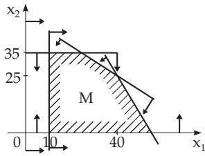
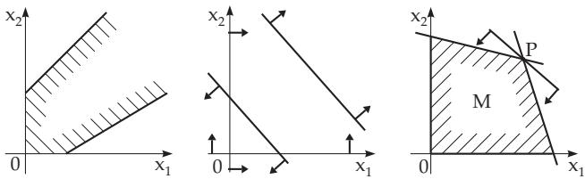

#### 18.1.1 Formulation of the Problem and Geometrical Representation

##### 18.1.1.1 The Form of a Linear Programming Problem

1. The Subject

of linearprogramming is the minimization or maximization of a linearobjective function (OF) of finitely many variables subject to a finite number of constraints (CT), which are given as linear equations or inequalities.

Many practical problems can be directly formulated as a linear programming problem, or they can be modeled approximately by a linear programming problem.

2. General Form

A linear programming problem has the following general form:

OF:

$$
f ( \underline { { \mathbf { x } } } ) = c _ { 1 } x _ { 1 } + \cdots + c _ { r } x _ { r } + c _ { r + 1 } x _ { r + 1 } + \cdots + c _ { n } x _ { n } = \operatorname* { m a x } !\tag{18.1a}
$$

CT:

$$
\left. { \begin{array} { c } { a _ { 1 , 1 } x _ { 1 } \ + \cdot \cdot \cdot + \ a _ { 1 , r } x _ { r } \ + \ a _ { 1 , r + 1 } x _ { r + 1 } \ + \cdot \cdot \cdot + \ a _ { 1 , n } x _ { n } \ \leq \ b _ { 1 } , } \\ { \vdots \qquad \vdots \qquad \vdots \qquad \vdots \qquad \vdots \qquad \vdots \qquad \vdots } \\ { a _ { s , 1 } x _ { 1 } \ + \cdot \cdot \cdot + \ a _ { s , r } x _ { r } \ + \ a _ { s , r + 1 } x _ { r + 1 } \ + \cdot \cdot \cdot + \ a _ { s , n } x _ { n } \ \leq \ b _ { s } , } \\ { a _ { s + 1 , 1 } x _ { 1 } + \cdot \cdot \cdot + a _ { s + 1 , r } x _ { r } + a _ { s + 1 , r + 1 } x _ { r + 1 } + \cdot \cdot \cdot + a _ { s + 1 , n } x _ { n } = b _ { s + 1 } , } \\ { \vdots \qquad \vdots \qquad \vdots \qquad \vdots \qquad \vdots \qquad \vdots \qquad \vdots } \\ { a _ { m , 1 } x _ { 1 } \ + \cdot \cdot \cdot + \ a _ { m , r } x _ { r } \ + \ a _ { m , r + 1 } x _ { r + 1 } \ + \cdot \cdot + \ a _ { m , n } x _ { n } \ = \ b _ { m } , } \\ { \vdots \qquad \quad x _ { 1 } \geq 0 , \ldots , x _ { r } \geq 0 ; \qquad x _ { r + 1 , \ \cdot \cdot } , x _ { n } \ { \mathrm { ~ f r e e } } . } \end{array} } \right\}\tag{18.1b}
$$

In a more compact vector notation this problem becomes:

$$
\begin{array} { r l } { \mathbf { O F } { : } } & { { } f ( \underline { { \mathbf { x } } } ) = \underline { { \mathbf { c } } } ^ { 1 ^ { \mathrm { T } } } \underline { { \mathbf { x } } } ^ { 1 } + \underline { { \mathbf { c } } } ^ { 2 ^ { \mathrm { T } } } \underline { { \mathbf { x } } } ^ { 2 } = \operatorname* { m a x } ! } \end{array}
$$

(18.2a)

$$
\left. \begin{array} { l l } { { \mathrm { C T : } } } & { { { \bf A } _ { 1 1 } { \bf x } ^ { 1 } + { \bf A } _ { 1 2 } { \bf x } ^ { 2 } \leq { \bf b } ^ { 1 } , } } \\ { { } } & { { { \bf A } _ { 2 1 } { \bf x } ^ { 1 } + { \bf A } _ { 2 2 } { \bf x } ^ { 2 } = { \bf b } ^ { 2 } , } } \\ { { } } & { { { \bf x } ^ { 1 } \geq 0 , { \bf x } ^ { 2 } \mathrm { f r e e } . } } \end{array} \right\}\tag{18.2b}
$$

Here, the following notations are used:

$$
\begin{array} { r } { \underline { { \mathbf { c } } } ^ { 1 } = \left( \begin{array} { c } { c _ { 1 } } \\ { c _ { 2 } } \\ { \vdots } \\ { c _ { r } } \end{array} \right) , \underline { { \mathbf { c } } } ^ { 2 } = \left( \begin{array} { c } { c _ { r + 1 } } \\ { c _ { r + 2 } } \\ { \vdots } \\ { c _ { n } } \end{array} \right) , \qquad \underline { { \mathbf { x } } } ^ { 1 } = \left( \begin{array} { c } { x _ { 1 } } \\ { x _ { 2 } } \\ { \vdots } \\ { x _ { r } } \end{array} \right) , \underline { { \mathbf { x } } } ^ { 2 } = \left( \begin{array} { c } { x _ { r + 1 } } \\ { x _ { r + 2 } } \\ { \vdots } \\ { x _ { n } } \end{array} \right) , } \end{array}\tag{18.2c}
$$

$$
\mathbf { A } _ { 1 1 } = \left( \begin{array} { l l l } { a _ { 1 1 } } & { a _ { 1 2 } } & { \cdots } & { a _ { 1 , r } } \\ { a _ { 2 1 } } & { a _ { 2 2 } } & { \cdots } & { a _ { 2 , r } } \\ { \vdots } & { } & { } \\ { a _ { s , 1 } } & { a _ { s , 2 } } & { \cdots } & { a _ { s , r } } \end{array} \right) , \qquad \mathbf { A } _ { 1 2 } = \left( \begin{array} { l l l } { a _ { 1 , r + 1 } } & { a _ { 1 , r + 2 } } & { \cdots } & { a _ { 1 , n } } \\ { a _ { 2 , r + 1 } } & { a _ { 2 , r + 2 } } & { \cdots } & { a _ { 2 , n } } \\ { \vdots } & { } & { } \\ { a _ { s , r + 1 } } & { a _ { s , r + 2 } } & { \cdots } & { a _ { s , n } } \end{array} \right) ,\tag{18.2d}
$$

$$
\mathbf { A } _ { 2 1 } = \left( { \begin{array} { l } { a _ { s + 1 , 1 } \ a _ { s + 1 , 2 } \ \cdots \ a _ { s + 1 , r } } \\ { a _ { s + 2 , 1 } \ a _ { s + 2 , 2 } \ \cdots \ a _ { s + 2 , r } } \\ { \vdots } \\ { a _ { m , 1 } \ a _ { m , 2 } \ \cdots \ a _ { m , r } } \end{array} } \right) , \qquad \mathbf { A } _ { 2 2 } = \left( { \begin{array} { l } { a _ { s + 1 , r + 1 } \ a _ { s + 1 , r + 2 } \ \cdots \ a _ { s + 1 , n } } \\ { a _ { s + 2 , r + 1 } \ a _ { s + 2 , r + 2 } \ \cdots \ a _ { s + 2 , n } } \\ { \vdots } \\ { a _ { m , r + 1 } \ a _ { m , r + 2 } \ \cdots \ a _ { m , n } } \end{array} } \right) .\tag{18.2e}
$$

3. Constraints

with the inequality sign $" \geq "$ will have the above form if they are multiplied by ( 1).

\- Springer-Verlag Berlin Heidelberg 2015

909

I.N. Bronshtein et al., Handbook of Mathematics,

DOI 10.1007/978-3-662-46221-8\_18

4. Minimum Problem

A minimum problem f(x) = min! becomes an equivalent maximum problem by multiplying the objective function by ( 1)

$$
- f ( \underline { { \mathbf { x } } } ) = \operatorname* { m a x } !\tag{18.3}
$$

5. Integer Programming

Sometimes certain variables are restricted to be only integers. This discrete problem is not discussed here.

6. Formulation with only Non-Negative Variables and Slack Variables

In applying certain solution methods, only non-negative variables are considered, and constraints (18.1b),

(18.2b) given in equality form.

$$
\mathbf { O F } \colon f ( \mathbf { x } ) = c _ { 1 } x _ { 1 } + \cdots + c _ { n } x _ { n } = \operatorname* { m a x } !\tag{18.4a}
$$

Every free variable $x _ { k }$ must be decomposed into the diference of two non-negative variables $x _ { k } = x _ { k } ^ { 1 } -$ $x _ { k } ^ { 2 }$ . The inequalities become equalities by adding non-negative variables; they are called slack variables. That is, the problem is considered in the form as given in (18.4a,b), where n is the increased number of variables. In vector form:

$$
\begin{array}{c} \mathbf { C T } \colon \quad a _ { 1 , 1 } x _ { 1 } + \cdots + a _ { 1 , n } x _ { n } = b _ { 1 } ,  \end{array}
$$

$$
a _ { m , 1 } x _ { 1 } + \cdot \cdot \cdot + a _ { m , n } x _ { n } = b _ { m } , \Biggr \}\tag{18.4b}
$$

$$
x _ { 1 } \geq 0 , \ldots , x _ { n } \geq 0 .
$$

OF: f(x) = cTx = max!

(18.5a)

$$
\mathbf { C T : } \qquad \mathbf { A \underline { { x } } = \underline { { b } } ~ , } \quad \underline { { \mathbf { x } } } \geq \underline { { \mathbf { 0 } } } .\tag{18.5b}
$$

The relation m n can be supposed, otherwise the system of equations contains linearly dependent or contradictory equations.

7. Feasible Set

The set of all vectors x satisfying constraints (18.2b) is called the feasible set of the original problem. If the free variables are rewritten as above, and every inequality of the form $^ { 6 6 } < ^ { 9 9 }$ into an equation as in (18.4a) and (18.4b), then the set of all non-negative vectors $\underline { { \mathbf { x } } } \geq \underline { { \mathbf { 0 } } }$ satisfying the constraints is called the feasible set M:

$$
M = \{ \underline { { \mathbf { x } } } \in \mathbb { R } ^ { n } : \underline { { \mathbf { x } } } \geq \underline { { \mathbf { 0 } } } , ~ \mathbf { A } \underline { { \mathbf { x } } } = \underline { { \mathbf { b } } } \} .\tag{18.6a}
$$

A point $\underline { { \mathbf { x } } } ^ { * } \in M$ with the property

$$
f ( \underline { { \mathbf { x } } } ^ { * } ) \geq f ( \underline { { \mathbf { x } } } ) \quad \mathrm { f o r ~ e v e r y ~ } \underline { { \mathbf { x } } } \in M\tag{18.6b}
$$

is called the maximum point or the solution point of the linear programming problem. Obviously, the components of x not belonging to slack variables form the solution of the original problem.

##### 18.1.1.2 Examples and Graphical Solutions

1. Example of the Production of Two Products

Suppose primary materials $R _ { 1 } , R _ { 2 }$ , and $R _ { 3 }$ are needed to produce two products $E _ { 1 }$ and $E _ { 2 }$ . Scheme 18.1 shows how many units of primary materials are needed to produce each unit of the products $E _ { 1 }$ and $E _ { 2 }$ , and there are given also the available amount of the primary materials.

Selling one unit of the products $E _ { 1 }$ or $E _ { 2 }$ results

in 20 or 60 units of profit, respectively $( P R )$

Determine a production program which yields maximum profit, if at least 10 units must be produced from product $E _ { 1 }$

Denoting by $x _ { 1 }$ and $x _ { 2 }$ the number of units produced from $E _ { 1 }$ and $E _ { 2 }$ , the problem is:

OF: $f ( \mathbf { x } ) = 2 0 x _ { 1 } + 6 0 x _ { 2 } = \mathrm { { m a x } ! }$

CT:

$$
\begin{array} { r } { 1 2 x _ { 1 } + 6 x _ { 2 } \leq 6 3 0 , } \\ { 8 x _ { 1 } + 1 2 x _ { 2 } \leq 6 2 0 , } \\ { 1 0 x _ { 2 } \leq 3 5 0 , } \end{array}
$$

$$
x _ { 1 } \qquad \geq \quad 1 0 .
$$

<table><tr><td rowspan=1 colspan=1>Scheme 18.1</td><td rowspan=1 colspan=1> $R _ { 1 } ~ / ~ E _ { i }$ </td><td rowspan=1 colspan=1> $R _ { 2 } / E _ { i }$ </td><td rowspan=1 colspan=1> $R _ { 3 } ~ / E _ { i }$ </td></tr><tr><td rowspan=1 colspan=1> $E _ { 1 }$  $E _ { 2 }$ </td><td rowspan=1 colspan=1>126</td><td rowspan=1 colspan=1>812</td><td rowspan=1 colspan=1>010</td></tr><tr><td rowspan=1 colspan=1>Amount</td><td rowspan=1 colspan=1>630</td><td rowspan=1 colspan=1>620</td><td rowspan=1 colspan=1>350</td></tr></table>

Introducing the slack variables $x _ { 3 } , x _ { 4 } , x _ { 5 } , x _ { 6 }$ , one gets:

OF:

CT:

$$
\begin{array} { r l r } { f ( \underline { { \mathbf { x } } } ) = 2 0 x _ { 1 } + 6 0 x _ { 2 } + 0 \cdot x _ { 3 } + 0 \cdot x _ { 4 } + 0 \cdot x _ { 5 } + 0 \cdot x _ { 6 } = \operatorname* { m a x } ! } & { } & \\ { 1 2 x _ { 1 } + \ 6 x _ { 2 } + \ x _ { 3 } } & { } & { = \ 6 3 0 , } & { } \\ { 8 x _ { 1 } + 1 2 x _ { 2 } } & { + \quad x _ { 4 } } & { = \ 6 2 0 , } & { } \\ { 1 0 x _ { 2 } } & { + \quad x _ { 5 } } & { = \ 3 5 0 , } & { } \\ { - x _ { 1 } } & { } & { + \quad x _ { 6 } = - 1 0 . } \end{array}
$$

2. Properties of a Linear Programming Problem

On the basis of this example, some properties of the linear pro gramming problem can be demonstrated by graphical representation. Here the slack variables are not considered; only the original two variables are used.

a) A line $a _ { 1 } x _ { 1 } + a _ { 2 } x _ { 2 } = b$ divides the $x _ { 1 } , x _ { 2 }$ plane into two half-planes. The points $( x _ { 1 } , x _ { 2 } )$ satisfying the inequality $a _ { 1 } x _ { 1 } + a _ { 2 } x _ { 2 } \leq b$ are in one of these half-planes. The graphical representation of this set of points in a Cartesian coordinate system can be made by a line, and the halfplane containing the solutions of the inequalities is denoted by an arrow. The set of feasible solutions M, i.e., the set of points satisfying all inequalities is the intersection of these half-planes (Fig. 18.1).

  
Figure 18.1

In this example the points of M form a polygonal domain. It may happen that M is unbounded or empty. If more then two boundary lines $_ \mathrm { g o }$ through a vertex of the polygon, this vertex is called a degenerate vertex (Fig. 18.2).

  
Figure 18.2

b) Every point in the $x _ { 1 } , x _ { 2 }$ plane satisfying the equality $f ( x ) = 2 0 x _ { 1 } + 6 0 x _ { 2 } = c _ { 0 }$ is on one line, on the level line associated to the value $c _ { 0 }$ . With diferent choices of $c _ { 0 } ,$ a family of parallel lines is defined, on each of which the value of the objective function is constant. Geometrically, those points are the solutions of the programming problem, which belong to the feasible set M and also to the level line $2 0 x _ { 1 } + 6 0 x _ { 2 } = c _ { 0 }$ with maximal value of $c _ { 0 } .$ . In this example, the solution point is $( x _ { 1 } , x _ { 2 } ) = ( 2 5 , 3 5 )$ on the line $2 0 x _ { 1 } + 6 0 x _ { 2 } = 2 6 0 0$ . The level lines are represented in Fig. 18.3, where the arrows point in the direction of increasing values of the objective function.

Obviously, if the feasible set M is bounded, then there is at least one vertex such that the objective function takes its maximum. If the feasible set M is unbounded, it is possible that the objective function is unbounded, as well.
