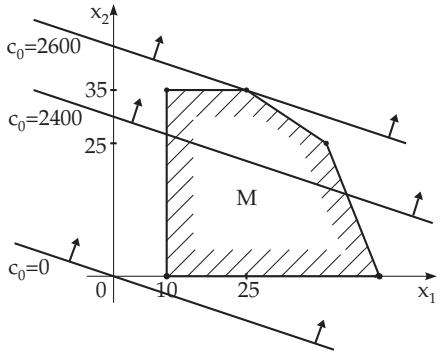
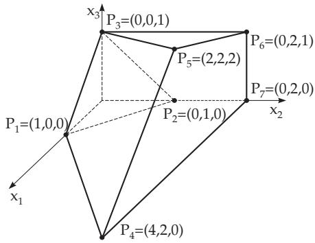

#### 18.1.2 Basic Notions of Linear Programming, Normal Form

Now, the problem (18.5a,b) is considered with the feasible set $M$

##### 18.1.2.1 Extreme Points and Basis

1. Definition of the Extreme Point

A point $\mathbf { x } \in M$ is called an extreme point or vertex of M, if for all $\underline { { \mathbf { x } } } _ { 1 } , \underline { { \mathbf { x } } } _ { 2 } \in M$ with $\underline { { \mathbf { x } } } _ { 1 } \neq \underline { { \mathbf { x } } } _ { 2 }$

$$
\underline { { \mathbf { x } } } \neq \lambda \underline { { \mathbf { x } } } _ { 1 } + ( 1 - \lambda ) \underline { { \mathbf { x } } } _ { 2 } , \quad 0 < \lambda < 1 ,\tag{18.7}
$$

i.e., x is not on any line segment connecting two diferent points of M.

2. Theorem about Extreme Points

The point $\underline { { \mathbf { x } } } ~ \in ~ M$ is an extreme point of M if the columns of matrix A associated to the positive components of x are linearly independent.

If the rank of A is m, then the maximal number of independent columns in A is $m , \ \mathrm { S o }$ , an extreme point can have at most m positive components. The other components, at least $n - m$ , are equal to zero. In the usual case, there are exactly m positive components. If the number of positive components is less then m, it is called a degenerate extreme point.

  
Figure 18.3

  
Figure 18.4

3. Basis

To every extreme point m linearly independent column vectors of the matrix A can be assigned, the columns belonging to the positive components. This system of linearly independent column vectors is called the basis ofthe extreme point. Usually, exactly one basis belongs to every extreme point. However several bases can be assigned to a degenerate extreme point. There are at most $\binom { n } { m }$ possibilities to choose m linearly independent vectors from n columns of A. Consequently, the number of diferent bases, and therefore the number of diferent extreme points is $\binom { n } { m }$ . If M is not empty, then M has at

least one extreme point.

$$
{ \overline { { \mathbf { O } } } } \mathbf { F } \colon f ( \underline { { \mathbf { x } } } ) = 2 x _ { 1 } + 3 x _ { 2 } + 4 x _ { 3 } = \operatorname* { m a x } !
$$

CT:

$$
\begin{array} { r } { x _ { 1 } + \ x _ { 2 } + \ x _ { 3 } \geq 1 , } \\ { \ x _ { 2 } \qquad \leq 2 , } \\ { - x _ { 1 } \qquad \quad + 2 x _ { 3 } \leq 2 , } \\ { 2 x _ { 1 } - 3 x _ { 2 } + 2 x _ { 3 } \leq 2 . } \end{array}\tag{18.8}
$$

The feasible set M determined by the constraints is represented in Fig. 18.4. Introduction of slack variables $x _ { 4 } , x _ { 5 } , x _ { 6 } , x _ { 7 }$ leads to:

CT:

$$
\begin{array} { r l r } { x _ { 1 } + } & { x _ { 2 } + } & { x _ { 3 } - x _ { 4 } \quad \quad \quad = 1 , } \\ & { x _ { 2 } \quad \quad \quad \quad + x _ { 5 } \quad \quad \quad \quad = 2 , } \\ { - x _ { 1 } \quad \quad \quad \quad + 2 x _ { 3 } \quad \quad \quad \quad \quad \quad + x _ { 6 } \quad \quad = 2 , } \\ { 2 x _ { 1 } - 3 x _ { 2 } + 2 x _ { 3 } \quad \quad \quad \quad \quad \quad + x _ { 7 } = 2 . } \end{array}
$$

The extreme point $P _ { 2 } = ( 0 , 1 , 0 )$ of the polyhedron corresponds to the point $\underline { { \mathbf { x } } } = ( x _ { 1 } , x _ { 2 } , x _ { 3 } , x _ { 4 } , x _ { 5 } , x _ { 6 }$ $x _ { 7 } ) = ( 0 , 1 , 0 , \overset { \cdot } { 0 } , 1 , 2 , 5 )$ of the extended system. The columns 2, 5, 6 and 7 of A form the corresponding basis. The degenerated extreme point $P _ { 1 }$ corresponds to (1, 0, 0, 0, 2, 3, 0). A basis of this extreme point contains the columns 1, 5, 6 and one of the columns 2, 4 or 7.

Remark: Here, the first inequality was a $\geq \frac { , 5 } { 2 }$ inequality and $x _ { 4 }$ was not added but subtracted. Frequently these types of additional variables both with a negative sign and a corresponding $b _ { i } > 0$ are called surplus variables, rather than slack variables. As will be seen in 18.1.3.3, p. 916, the occurrence of surplus variables requires additional efort in the solution procedure.

4. Extreme Point with a Maximal Value of the Objective Function

Theorem: If M is not empty, and the objective function $f ( \underline { { \mathbf { x } } } ) = \underline { { \mathbf { c } } } ^ { \mathrm { T } } \underline { { \mathbf { x } } }$ is bounded from above on M, then there is at least one extreme point of M where it has its maximum.

A linear programming problem can be solved by determining at least one of the extreme points with maximum value of the objective function. Usually, the number of extreme points of M is very large in practical problems, so a method is needed by which the solution can be found in a reasonable time. Such a method is the simplex method which is also called the simplex algorithm or simplex procedure.

##### 18.1.2.2 Normal Form of the Linear Programming Problem

1. Normal Form and Basic Solution

The linear programming problem (18.4a,b) can always be transformed to the following form with a suitable renumbering of the variables:

OF:

CT:

$$
\left. \begin{array} { c c } { f ( \underline { { \mathbf x } } ) = c _ { 1 } x _ { 1 } + \dots + c _ { n - m } x _ { n - m } + c _ { 0 } = \operatorname* { m a x } ! } & \\ { a _ { 1 , 1 } x _ { 1 } + \dots + a _ { 1 , n - m } x _ { n - m } + x _ { n - m + 1 } } & { = b _ { 1 } , } \\ { \vdots } & { \vdots } \\ { a _ { m , 1 } x _ { 1 } + \dots + a _ { m , n - m } x _ { n - m } } & { + x _ { n } = b _ { m } , } \\ { x _ { 1 } , \dots , x _ { n - m } , x _ { n - m + 1 } , \dots , x _ { n } \geq 0 . } & \end{array} \right\}\tag{18.9a}
$$

(18.9b)

The last m columns of the coeficient matrix are obviously independent, and they form a basis. The basic solution $( x _ { 1 } , x _ { 2 } , \ldots , x _ { n - m } , x _ { n - m + 1 } , \ldots , x _ { n } ) = ( 0 , \ldots , 0 , b _ { 1 } , \ldots , b _ { m } ) $ can be determined directl from the system of equations, but if $\underline { { \mathbf { b } } } \geq \underline { { \mathbf { 0 } } }$ does not hold, it is not a feasible solution.

$\mathrm { I f } \ \mathbf { \underline { { b } } } \geq \ \underline { { \mathbf { 0 } } }$ , then (18.9a,b) is called a normal form or canonical form of the linear programming problem.   
In this case, the basic solution is a feasible solution, as well, $\mathrm { i . e . , } \underline { { \mathbf { x } } } \geq 0$ , and it is an extreme point of M.   
The variables $x _ { 1 } , \ldots , x _ { n - m }$ are called non-basic variables and $x _ { n - m + 1 } , \ldots , x _ { n }$ are called basic variables.   
The objective function has the value $c _ { 0 }$ at this extreme point, since the non-basic variables are equal to zero.

2. Determination of the Normal Form

If an extreme point of M is known, then a normal form of the linear programming problem (18.5a,b) can be obtained in the following way. A basis is chosen from the columns of A corresponding to the extreme point. Usually, these columns are determined by the positive components of the extreme point. Suppose the basic variables are collected into the vector $\underline { { \mathbf { x } } } _ { B }$ and the non-basic variables are in $\underline { { \mathbf { x } } } _ { N }$ . The columns associated to the basis form the basis matrix $\mathbf { A } _ { B }$ , the other columns form the matrix ${ \bf A } _ { N }$ Then,

$$
\mathbf { A } \underline { { \mathbf { x } } } = \mathbf { A } _ { N } \underline { { \mathbf { x } } } _ { N } + \mathbf { A } _ { B } \underline { { \mathbf { x } } } _ { B } = \underline { { \mathbf { b } } } .\tag{18.10}
$$

The matrix $\mathbf { A } _ { B }$ is non-singular and it has an inverse $\mathbf { A } _ { B } ^ { - 1 }$ , the so-called basis inverse. Multiplying (18.10) by $\mathbf { A } _ { B } ^ { - 1 }$ and changing the objective function according to the non-basic variables results in the canonical form of the linear programming problem:

OF: $f ( \underline { { \mathbf { x } } } ) = \underline { { \mathbf { c } } } _ { N } ^ { \mathrm { T } } \underline { { \mathbf { x } } } _ { N } + c _ { 0 } ,$

(18.11a)

$$
\begin{array} { r } { { \bf { C } } { \bf { T } } \colon \mathrm { \bf { A } } _ { B } ^ { - 1 } \mathbf { A } _ { N } \underline { { \bf { x } } } _ { N } + \underline { { \bf { x } } } _ { B } = { \bf { A } } _ { B } ^ { - 1 } \underline { { \bf { b } } } \quad \mathrm { w i t h } \quad \underline { { \bf { x } } } _ { N } \geq \underline { { \bf { 0 } } } , ~ \underline { { \bf { x } } } _ { B } \geq \underline { { \bf { 0 } } } . } \end{array}\tag{18.11b}
$$

Remark: If the original system (18.1b) has only constraints of type $\stackrel { 6 6 } { \leq } \underline { { { \stackrel { \triangledown } { \cdot } } } }$ and simultaneously $b \geq \underline { { \mathbf { 0 } } } .$ then the extended system (18.4b) contains no surplus variables (see 18.1.2.1, p. 911). In this case a normal form is immediately known. Selecting all slack variables as basic variables $\underline { { \mathbf { x } } } _ { B }$ the result is $\mathbf { A } _ { B } = \mathbf { I } { \mathrm { ~ a n d } } \mathbf { x } _ { B } = \mathbf { \underline { { b } } } { \mathrm { ~ a n d } } \mathbf { \underline { { x } } } _ { N } = \mathbf { \underline { { 0 } } }$ is a feasible extreme point.

<table><tr><td></td><td> $x _ { 1 } \cdots x _ { n - m }$ </td><td></td><td>or briefly</td></tr><tr><td> $x _ { n - m + 1 }$ </td><td></td><td> $a _ { 1 , 1 } \cdot \cdot \cdot a _ { 1 , n - m }$ </td><td> $b _ { 1 }$ </td></tr><tr><td></td><td></td><td></td><td></td></tr><tr><td>·</td><td>·</td><td>…</td><td></td></tr><tr><td></td><td></td><td></td><td></td></tr><tr><td> $x _ { n }$ </td><td></td><td></td><td> $b _ { m }$ </td></tr><tr><td></td><td></td><td> $| a _ { m , 1 } \cdot \cdot \cdot a _ { m , n - m }$ </td><td></td></tr><tr><td></td><td>C1</td><td>Cn−m</td><td> $- c _ { 0 }$ </td></tr></table>

In the above example x = (0, 1, 0, 0, 1, 2, 5) is an extreme point. Consequently:

$$
\mathbf { A } _ { B } = \left( \begin{array} { c c c c } { 1 } & { 0 } & { 0 } & { 0 } \\ { 1 } & { 1 } & { 0 } & { 0 } \\ { 0 } & { 0 } & { 1 } & { 0 } \\ { - 3 } & { 0 } & { 0 } & { 1 } \end{array} \right) , \qquad \mathbf { A } _ { B } ^ { - 1 } = \left( \begin{array} { c c c c } { 1 } & { 0 } & { 0 } & { 0 } \\ { - 1 } & { 1 } & { 0 } & { 0 } \\ { 0 } & { 0 } & { 1 } & { 0 } \\ { 3 } & { 0 } & { 0 } & { 1 } \end{array} \right) , \qquad \mathbf { A } _ { N } = \left( \begin{array} { c c c c } { 1 } & { 1 } & { - 1 } \\ { 0 } & { 0 } & { 0 } \\ { - 1 } & { 2 } & { 0 } \\ { 2 } & { 2 } & { 0 } \\ { x _ { 1 } } & { x _ { 3 } } & { x _ { 4 } } \end{array} \right) ,\tag{18.12a}
$$

$$
\mathbf { A } _ { B } ^ { - 1 } \mathbf { A } _ { N } = \left( \begin{array} { c c c } { 1 } & { 1 } & { - 1 } \\ { - 1 } & { - 1 } & { 1 } \\ { - 1 } & { 2 } & { 0 } \\ { 5 } & { 5 } & { - 3 } \\ { x _ { 1 } } & { x _ { 3 } } & { x _ { 4 } } \end{array} \right) , \qquad \mathbf { A } _ { B } ^ { - 1 } \mathbf { \mathbf { \mathbf { b } } } = \left( \begin{array} { c } { 1 } \\ { 1 } \\ { 2 } \\ { 5 } \end{array} \right) .\tag{18.12b}
$$

$$
\begin{array} { r l r } { x _ { 1 } + x _ { 2 } + } & { { } x _ { 3 } - } & { x _ { 4 } \qquad } & { = 1 , } \\ { - x _ { 1 } \qquad - } & { { } x _ { 3 } + } & { x _ { 4 } + x _ { 5 } \qquad } & { = 1 , } \\ { - x _ { 1 } \qquad + 2 x _ { 3 } \qquad } & { + x _ { 6 } \qquad = 2 , } \\ { 5 x _ { 1 } \qquad + 5 x _ { 3 } - 3 x _ { 4 } \qquad } & { + x _ { 7 } = 5 . } \end{array}\tag{18.13}
$$

From $f ( \underline { { \mathbf { x } } } ) = 2 x _ { 1 } + 3 x _ { 2 } + 4 x _ { 3 }$ the transformed objective function

$$
f ( { \underline { { \mathbf { x } } } } ) = - x _ { 1 } + x _ { 3 } + 3 x _ { 4 } + 3\tag{18.14}
$$

is obtained, if the triple of the first constraint is subtracted.
