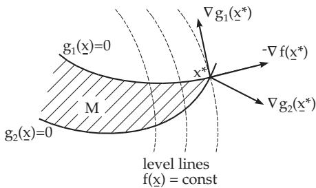

#### 18.2.1 Formulation of the Problem, Theoretical Basis

##### 18.2.1.1 Formulation of the Problem

1. Non-linear Optimization Problem

A non-linear optimization problem has the general form

$$
f ( \mathbf { x } ) = \mathrm { m i n } ! \quad \mathrm { s u b j e c t ~ t o } \quad \underline { { \mathbf { x } } } \in \mathbb { R } ^ { n } \quad \mathrm { w i t h } \quad\tag{18.32a}
$$

$$
g _ { i } ( \underline { { \mathbf { x } } } ) \leq 0 , \qquad i \in I = \{ 1 , \dots , m \} , \quad h _ { j } ( \underline { { \mathbf { x } } } ) = 0 , \quad j \in J = \{ 1 , \dots , r \}\tag{18.32b}
$$

where at least one of the functions $f , g _ { i } , h _ { j }$ is non-linear. The set of feasible solutions is denoted by

$$
M = \{ \underline { { \mathbf { x } } } \in \mathbb { R } ^ { n } : \ g _ { i } ( \underline { { \mathbf { x } } } ) \leq 0 , \quad i \in I , \quad h _ { j } ( \underline { { \mathbf { x } } } ) = 0 , \quad j \in J \} .\tag{18.33}
$$

The problem is to determine the minimum points.

2. Minimum Points

A point $\underline { { \mathbf { x } } } ^ { * } \in M$ is called the global minimum point if $f ( \underline { { \mathbf { x } } } ^ { * } ) \leq f ( \underline { { \mathbf { x } } } )$ holds for every $\mathbf { x } \in M$ . If this relation holds for only the points x of a neighborhood $U \ \mathrm { o f } \ \underline { { \mathbf { x } } } ^ { * }$ , then $\underline { { \mathbf { x } } } ^ { * }$ is called a local minimum point. Since the equality constraints $h _ { j } ( \underline { { \mathbf { x } } } ) = 0$ can be expressed by two inequalities,

$$
- h _ { j } ( \underline { { \mathbf { x } } } ) \leq 0 , \quad h _ { j } ( \underline { { \mathbf { x } } } ) \leq 0 ,\tag{18.34}
$$

it can be supposed that the set J is empty, $J = \emptyset$

##### 18.2.1.2 Optimality Conditions

1. Special Directions

a) The Cone of the Feasible Directions at $\underline { { \mathbf { x } } } \in M$ is defined by

$$
{ \cal Z } ( { \bf { \underline { { x } } } } ) = \{ { \bf { \underline { { d } } } } \in { \bf R } ^ { n } : \ { \bf { \bar { 2 } } } \bar { \alpha } > 0 : \ { \bf { \underline { { x } } } } + \alpha { \bf { \underline { { d } } } } \in M , \quad 0 \leq \alpha \leq \bar { \alpha } \} , \quad { \bf { \underline { { x } } } } \in M ,\tag{18.35}
$$

where the directions are denoted by d. If $\underline { { \mathbf { d } } } \in Z ( \underline { { \mathbf { x } } } )$ , then every point of the ray $\underline { { \mathbf { x } } } +$ αd belongs to M for suficient small values of α.

b) A Descent Direction at a point x is a vector $\mathbf { d } \in \mathbb { R } ^ { n }$ for which there exists an $\bar { \alpha } > 0$ such that

$$
f ( \underline { { \mathbf { x } } } + \alpha \underline { { \mathbf { d } } } ) < f ( \underline { { \mathbf { x } } } ) \quad \forall \alpha \in ( 0 , \bar { \alpha } ) .\tag{18.36}
$$

There exists no feasible descent direction at a minimum point.

If f is diferentiable, then d is a descent direction when $\nabla f ( \underline { { \mathbf { x } } } ) ^ { \mathrm { T } } \underline { { \mathbf { d } } } ~ < ~ 0$ . Here, denotes the nabla operator, so $\nabla f ( \underline { { \mathbf { x } } } )$ represents the gradient of the scalar-valued function f at x.

2. Necessary Optimality Conditions

If f is diferentiable and $\underline { { \mathbf { x } } } ^ { * }$ is a local minimum point, then

$$
\nabla f ( \underline { { \mathbf { x } } } ^ { * } ) ^ { \mathrm { T } } \underline { { \mathbf { d } } } \geq 0 \quad \mathrm { f o r ~ e v e r y } \quad \underline { { \mathbf { d } } } \in \overline { { Z } } ( \underline { { \mathbf { x } } } ^ { * } ) .\tag{18.37a}
$$

In particular, if $\underline { { \mathbf { x } } } ^ { * }$ is an interior point of M, then

$$
\nabla f ( \underline { { \mathbf { x } } } ^ { * } ) = \underline { { \mathbf { 0 } } } .\tag{18.37b}
$$

3. Lagrange Function and Saddle Point

Optimality conditions (18.37a,b) should be transformed into a more practical form including the constraints. The so-called Lagrange function or Lagrangian is constructed:

$$
L ( \underline { { \mathbf { x } } } , \underline { { \mathbf { u } } } ) = f ( \underline { { \mathbf { x } } } ) + \sum _ { i = 1 } ^ { m } u _ { i } g _ { i } ( \underline { { \mathbf { x } } } ) = f ( \underline { { \mathbf { x } } } ) + \underline { { \mathbf { u } } } ^ { \mathrm { T } } g ( \underline { { \mathbf { x } } } ) , \quad \underline { { \mathbf { x } } } \in \mathbb { R } , \underline { { \mathbf { u } } } \in \mathbb { R } _ { + } ^ { m } ,\tag{18.38}
$$

according to the Lagrange multiplier method (see 6.2.5.6, p. 456) for problems with equality constraints. A point $( \underline { { \mathbf { x } } } ^ { * } , \underline { { \mathbf { u } } } ^ { * } ) \in \bar { \mathbb { R } } ^ { n } \times \mathbb { R } _ { + } ^ { m }$ is called a saddle point of L, if

L(x∗, u)  L(x∗, u∗)  L(x, u∗) for every $\underline { { \mathbf { x } } } \in \mathbb { R } ^ { n } , \ \underline { { \mathbf { u } } } \in \mathbb { R } _ { + } ^ { m }$

(18.39)

4. Global Kuhn-Tucker Conditions

A point $\underline { { \mathbf { x } } } ^ { * } \in \mathbb { R } ^ { n }$ satisfies the global Kuhn-Tucker conditions if there is an $\underline { { \mathbf { u } } } ^ { * } \in \mathbb { R } _ { + } ^ { m }$ , i.e., $\mathbf { \underline { { u } } } ^ { * } \geq 0$ such that $\left( \underline { { \mathbf { x } } } ^ { * } , \underline { { \mathbf { u } } } ^ { * } \right)$ is a saddle point of L.

For the proof of the Kuhn-Tucker conditions see 12.5.6, p. 683.

5. Suficient Optimality Condition

If $( \underline { { \mathbf { x } } } ^ { * } , \underline { { \mathbf { u } } } ^ { * } ) \in \mathbb { R } ^ { n } \times \mathbb { R } _ { + } ^ { m }$ is a saddle point of $L$ , then $\underline { { \mathbf { x } } } ^ { * }$ is a global minimum point of (18.32a,b).

If the functions f and $g _ { i }$ are diferentiable, then local optimality conditions can be deduced.

6. Local Kuhn-Tucker Conditions

A point $\mathbf { x } ^ { * } \in M$ satisfies the local Kuhn–Tucker conditions if there are numbers $u _ { i } \ge 0 , i \in I _ { 0 } ( \underline { { \mathbf { x } } } ^ { * } )$ such that

$$
- \nabla f ( \underline { { \mathbf { x } } } ^ { * } ) = \sum _ { i \in I _ { 0 } ( \underline { { \mathbf { x } } } ^ { * } ) } u _ { i } \nabla g _ { i } ( \underline { { \mathbf { x } } } ^ { * } ) , \quad \mathrm { w h e r e }\tag{18.40a}
$$

$$
I _ { 0 } ( \underline { { \mathbf { x } } } ) = \{ i \in \{ 1 , . . . , m \} \ : \ g _ { i } ( \underline { { \mathbf { x } } } ) = 0 \}\tag{18.40b}
$$

is the index set of the active constraints at x. The point $\underline { { \mathbf { x } } } ^ { * }$ is also called a Kuhn-Tucker stationary point.

This means geometrically that a point ${ \underline { { \mathbf { x } } } } ^ { * } \in$ M satisfies the local Kuhn-Tucker conditions, if the negative gradient $- \nabla f ( \mathbf { x } ^ { * } )$ lies in the cone spanned by the gradients $\nabla g _ { i } ( \underline { { \mathbf { x } } } ^ { * } )$ $i \in I _ { 0 } ( \underline { { \mathbf { x } } } ^ { * } )$ of the constraints active at $\underline { { \mathbf { x } } } ^ { * }$ (Fig. 18.5).

The following equivalent formulation for (18.40a,b) is also often used: $\mathbf { x } ^ { * } \in \mathbb { R } ^ { n }$ satisfies the local Kuhn-Tucker conditions, if there is a $\underline { { \mathbf { u } } } ^ { * } \in \mathbb { R } _ { + } ^ { m }$ such that

$$
g ( \underline { { \mathbf { x } } } ^ { * } ) \leq 0 ,\tag{18.41a}
$$

$$
u _ { i } g _ { i } ( \underline { { \mathbf { x } } } ^ { * } ) = 0 , \quad i = 1 , \dots , m ,
$$

$$
\nabla f ( \underline { { \mathbf { x } } } ^ { * } ) + \sum _ { i = 1 } ^ { m } u _ { i } \nabla g _ { i } ( \underline { { \mathbf { x } } } ^ { * } ) = 0 .\tag{18.41b}
$$

(18.41c)

Figure 18.5

7. Necessary Optimality Conditions and Kuhn-Tucker Conditions

If $\underline { { \mathbf { x } } } ^ { * } \in M$ is a local minimum point of (18.32a,b) and the feasible set satisfies the regularity condition at $\underline { { \mathbf { x } } } ^ { * } : \exists \underline { { \mathbf { d } } } \in \mathbb { R } ^ { n }$ such that $\nabla g _ { i } ( \mathbf { \underline { { \hat { x } } } ^ { * } } ) ^ { \mathrm { T } } \mathbf { \underline { { d } } } < \mathrm { 0 }$ for every $i \in I _ { 0 } ( \underline { { \mathbf { x } } } ^ { * } )$ , then $\underline { { \mathbf { x } } } ^ { * }$ satisfies the local Kuhn-Tucker conditions.

##### 18.2.1.3 Duality in Optimization

1. Dual Problem

With the associated Lagrangian (18.38) the maximum problem is formed, the so-called dual of (18.32a,b):

$$
L ( \underline { { \mathbf { x } } } , \underline { { \mathbf { u } } } ) = \operatorname* { m a x } ! \quad \mathrm { s u b j e c t ~ t o } \quad ( \underline { { \mathbf { x } } } , \underline { { \mathbf { u } } } ) \in M ^ { * } \quad \mathrm { w i t h }\tag{18.42a}
$$

$$
M ^ { \ast } = \{ ( \underline { { \mathbf { x } } } , \underline { { \mathbf { u } } } ) \in \mathbb { R } ^ { n } \times \mathbb { R } _ { + } ^ { m } : L ( \underline { { \mathbf { x } } } , \underline { { \mathbf { u } } } ) = \operatorname* { m i n } _ { \underline { { \mathbf { z } } } \in \mathbb { R } ^ { n } } L ( \underline { { \mathbf { z } } } , \underline { { \mathbf { u } } } ) \} .\tag{18.42b}
$$

2. Duality Theorems

If $\underline { { \mathbf { x } } } _ { 1 } \in M$ and $( \underline { { \mathbf { x } } } _ { 2 } , \underline { { \mathbf { u } } } _ { 2 } ) \in M ^ { * }$ , then

a) $L ( \underline { { \mathbf { x } } } _ { 2 } , \underline { { \mathbf { u } } } _ { 2 } ) \le f ( \underline { { \mathbf { x } } } _ { 1 } )$

b) If $L ( \underline { { \mathbf { x } } } _ { 2 } , \underline { { \mathbf { u } } } _ { 2 } ) = f ( \underline { { \mathbf { x } } } _ { 1 } )$ , then $\underline { { \mathbf { X } } } _ { 1 }$ is a minimum point of (18.32a,b) and $\left( \underline { { \mathbf { x } } } _ { 2 } , \underline { { \mathbf { u } } } _ { 2 } \right)$ is a maximum point of (18.42a,b).
