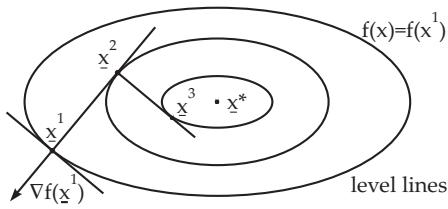

#### 18.2.5 Methods for Unconstrained Problems

The general optimization problem

$$
f ( \mathbf { x } ) = \operatorname* { m i n } ! \quad { \mathrm { f o r } } \quad \mathbf { \underline { { x } } } \in \mathbb { R } ^ { n }\tag{18.72}
$$

is considered with a continuously diferentiable function $f .$ Each method described in this section constructs, in general, an infinite sequence of points $\{ \underline { { \mathbf { x } } } ^ { k } \} \in \mathrm { \mathbb { R } } ^ { n }$ , whose accumulation point is a stationary point. The sequence of points will be determined starting with a point $\underline { { \mathbf { x } } } ^ { 1 } \in \mathbb { R } ^ { n }$ and according to the formula

$$
\underline { { { \mathbf { x } } } } ^ { k + 1 } = \underline { { { \mathbf { x } } } } ^ { k } + \alpha _ { k } \underline { { { \mathbf { d } } } } ^ { k } \quad ( k = 1 , 2 , \ldots ) ,\tag{18.73}
$$

i.e., first a direction $\mathbf { d } ^ { k } \in \mathbb { R } ^ { n }$ is determined at $\underline { { \mathbf { x } } } ^ { k }$ and the step size $\alpha _ { k } \in \mathbb { R }$ indicates how far $\underline { { \mathbf { x } } } ^ { k + 1 }$ is from $\underline { { \mathbf { x } } } ^ { k }$ in the direction $\mathbf { d } ^ { k }$ . Such a method is called a descent method, if

$$
f ( { \underline { { \mathbf { x } } } } ^ { k + 1 } ) < f ( { \underline { { \mathbf { x } } } } ^ { k } ) \quad ( k = 1 , 2 , . . . ) .\tag{18.74}
$$

The equality $\nabla f ( \underline { { \mathbf { x } } } ) = 0$ , where is the nabla operator (see 13.2.6.1, p. 715), characterizes a stationary point and can be used as a stopping rule for the iteration method.

##### 18.2.5.1 Method of Steepest Descent

Starting from an actual point $\underline { { \mathbf { x } } } ^ { k }$ , the direction $\mathbf { d } ^ { k }$ in which the function has its steepest descent is

$$
\underline { { \mathbf { d } } } ^ { k } = - \nabla f ( \underline { { \mathbf { x } } } ^ { k } )
$$

$$
( 1 8 . 7 5 \mathrm { a } ) \qquad \mathrm { a n d \ c o n s e q u e n t l y } \quad \underline { { \mathbf { x } } } ^ { k + 1 } = \underline { { \mathbf { x } } } ^ { k } - \alpha _ { k } \nabla f ( \underline { { \mathbf { x } } } ^ { k } ) .\tag{18.75b}
$$

A schematic representation of the steepest descent method with level lines $f ( \underline { { \mathbf { x } } } ) = f ( \underline { { \mathbf { x } } } ^ { i } )$ is shown in Fig. 18.6.

  
Figure 18.6

The step size $\alpha _ { k }$ is determined by a line search, i.e., $\alpha _ { k }$ is the solution of the one-dimensional problem:

$$
f ( \underline { { \mathbf { x } } } ^ { k } + \alpha \underline { { \mathbf { d } } } ^ { k } ) = \operatorname* { m i n } ! , \quad \alpha \geq 0 .\tag{18.76}
$$

This problem can be solved by the methods given in 18.2.4, p. 930.

The steepest descent method (18.75b) converges relatively slowly. For every accumulation point $\underline { { \mathbf { x } } } ^ { * }$ of the sequence $\{ \underline { { \mathbf { x } } } ^ { k } \} , \nabla f ( \underline { { \mathbf { x } } } ^ { * } ) = 0$ . In the case of a quadratic objective function, i.e., $f ( { \underline { { \mathbf { x } } } } ) = { \underline { { \mathbf { x } } } } ^ { \mathrm { T } } \mathbf { C } { \underline { { \mathbf { x } } } } +$ $\bar { \mathbf { p } } ^ { \mathrm { T } } \underline { { \mathbf { x } } }$ , the method has the special form:

$$
\mathbf { x } ^ { k + 1 } = \mathbf { x } ^ { k } + \alpha _ { k } \mathbf { d } ^ { k } \qquad \quad ( 1 8 . 7 7 \mathrm { a } ) \mathrm { w i t h } \ \mathbf { d } ^ { k } = - ( 2 \mathbf { C } \mathbf { x } ^ { k } + \mathbf { p } ) \mathrm { a n d } \ \alpha _ { k } = { \frac { \mathbf { d } ^ { k ^ { \mathrm { T } } } \mathbf { d } ^ { k } } { 2 \mathbf { d } ^ { k ^ { \mathrm { T } } } \mathbf { C } \mathbf { d } ^ { k } } } .\tag{18.77b}
$$

##### 18.2.5.2 Application of the Newton Method

Suppose that at the actual approximation point $\underline { { \mathbf { x } } } ^ { k }$ the function f is approximated by a quadratic function:

$$
q ( \underline { { \mathbf { x } } } ) = f ( \underline { { \mathbf { x } } } ^ { k } ) + ( \underline { { \mathbf { x } } } - \underline { { \mathbf { x } } } ^ { k } ) ^ { \mathrm { T } } \nabla f ( \underline { { \mathbf { x } } } ^ { k } ) + \frac { 1 } { 2 } ( \underline { { \mathbf { x } } } - \underline { { \mathbf { x } } } ^ { k } ) ^ { \mathrm { T } } \mathbf { H } ( \underline { { \mathbf { x } } } ^ { k } ) ( \underline { { \mathbf { x } } } - \underline { { \mathbf { x } } } ^ { k } ) .\tag{18.78}
$$

Here $\mathbf { H } ( \underline { { \mathbf { x } } } ^ { k } )$ is the Hessian matrix, i.e., the matrix of second partial derivatives of f at the point $\underline { { \mathbf { x } } } ^ { k }$ . If $\mathbf { H } ( \underline { { \mathbf { x } } } ^ { k } )$ is positive definite, then $q ( \underline { { \mathbf { x } } } )$ has an absolute minimum at $\underline { { \mathbf { x } } } ^ { k + 1 }$ with $\nabla q ( \underline { { \mathbf { \dot { x } } } } ^ { k + 1 } ) = \dot { 0 }$ , therefore one gets the Newton method:

$$
\underline { { \mathbf { x } } } ^ { k + 1 } = \underline { { \mathbf { x } } } ^ { k } - \mathbf { H } ^ { - 1 } ( \underline { { \mathbf { x } } } ^ { k } ) \nabla f ( \underline { { \mathbf { x } } } ^ { k } ) \quad ( k = 1 , 2 , \dots ) , \quad \mathrm { i . e . , }\tag{18.79a}
$$

$$
\underline { { \mathbf { d } } } ^ { k } = - \mathbf { H } ^ { - 1 } ( \underline { { \mathbf { x } } } ^ { k } ) \nabla f ( \underline { { \mathbf { x } } } ^ { k } ) \quad \mathrm { a n d } \quad \alpha _ { k } \mathrm { i n } ( 1 8 . 7 3 ) .\tag{18.79b}
$$

The Newton method converges fast but it has the following disadvantages:

a) The matrix $\mathbf { H } ( \mathbf { x } ^ { k } )$ must be positive definite.

b) The method converges only for suficiently good initial points.

c) The step size can not influenced.

d) The method is not a descent method.

e) The computational cost of computing the inverse of $\mathbf { H } ^ { - 1 } ( \underline { { \mathbf { x } } } ^ { k } )$ is fairly high.

Some of these disadvantages can be reduced by the following version of the damped Newton method (see also 19.2.2.2, p. 962):

$$
\underline { { \mathbf { x } } } ^ { k + 1 } = \underline { { \mathbf { x } } } ^ { k } - \alpha _ { k } \mathbf { H } ^ { - 1 } ( \underline { { \mathbf { x } } } ^ { k } ) \nabla f ( \underline { { \mathbf { x } } } ^ { k } ) \quad ( k = 1 , 2 , \dots ) .\tag{18.80}
$$

The relaxation factor $\alpha _ { k }$ can be determined, for example, by the principle given earlier (see 18.2.5.1, p. 931).

##### 18.2.5.3 Conjugate Gradient Methods

Two vectors $\underline { { \mathbf { d } } } ^ { 1 } , \underline { { \mathbf { d } } } ^ { 2 } \in \mathbb { R } ^ { n }$ are called conjugate vectors with respect to a symmetric, positive definite matrix C, if

$$
\underline { { \mathbf { d } } } ^ { 1 \mathrm { T } } \mathbf { C } \underline { { \mathbf { d } } } ^ { 2 } = 0 .\tag{18.81}
$$

If $\underline { { \mathbf { d } } } ^ { 1 } , \underline { { \mathbf { d } } } ^ { 2 } , \dots , \underline { { \mathbf { d } } } ^ { n }$ are pairwise conjugate vectors with respect to a matrix C, then the convex quadratic problem $q ( \underline { { \mathbf { x } } } ) = \underline { { \mathbf { x } } } ^ { \mathrm { T } } \mathbf { C } \underline { { \mathbf { x } } } + \underline { { \mathbf { p } } } ^ { \mathrm { T } } \underline { { \mathbf { x } } } , \ \underline { { \mathbf { x } } } \in \mathbb { R } ^ { n }$ , can be solved in n steps if a sequence $\underline { { \mathbf { x } } } ^ { k + 1 } = \underline { { \mathbf { x } } } ^ { k } + \alpha _ { k } \underline { { \mathbf { d } } } ^ { k }$ starting from $\underline { { \mathbf { x } } } ^ { 1 }$ is constructed, where $\alpha _ { k }$ is the optimal step size. Under the assumption that $f ( \underline { { \mathbf { x } } } )$ is approximately quadratic in the neighborhood of $\underline { { \mathbf { x } } } ^ { * }$ , i.e., $\mathbf { C } \approx \frac { 1 } { 2 } \mathbf { H } ( \mathbf { \underline { { x } } } ^ { * } )$ , the method developed for quadratic objective functions can also be applied for more general functions $f ( \underline { { \mathbf { x } } } )$ , without the explicit use of the matrix $\mathbf { H } ( \underline { { \mathbf { x } } } ^ { * } )$

The conjugate gradient method has the following steps:

$$
\begin{array} { r l } { \mathbf { a } ) } & { { } \underline { { \mathbf { x } } } ^ { 1 } \in \mathbb { R } ^ { n } , ~ \underline { { \mathbf { d } } } ^ { 1 } = - \nabla f ( \underline { { \mathbf { x } } } ^ { 1 } ) , } \end{array}\tag{18.82}
$$

where $\underline { { \mathbf { x } } } ^ { 1 }$ is an appropriate initial approximation for $\underline { { \mathbf { x } } } ^ { * }$

$$
\mathbf { b } ) \mathbf { \Sigma } \mathbf { \Sigma } \mathbf { \Sigma } \mathbf { \Sigma } \mathbf { \mathbf { z } } ^ { k + 1 } = \mathbf { \Sigma } \mathbf { \mathbf { z } } ^ { k } + \alpha _ { k } \mathbf { \underline { { d } } } ^ { k } \mathbf { \Sigma } \left( k = 1 , \ldots , n \right) \mathrm { ~ w i t h ~ } \alpha _ { k } \geq 0 \mathrm { ~ s o ~ t h a t ~ } f ( \mathbf { \underline { { x } } } ^ { k } + \alpha \mathbf { \underline { { d } } } ^ { k } ) \mathrm { ~ w i l l ~ b e ~ m i n i m i z e d . }\tag{18.83a}
$$

$$
\underline { { \mathbf { d } } } ^ { k + 1 } = - \nabla f ( \underline { { \mathbf { x } } } ^ { k + 1 } ) + \mu _ { k } \underline { { \mathbf { d } } } ^ { k } \ ( k = 1 , \dots , n - 1 ) \ \mathrm { w i t h }\tag{18.83b}
$$

$$
\mu _ { k } = \frac { \nabla f ( \underline { { \mathbf { x } } } ^ { k + 1 } ) ^ { \mathrm { T } } \nabla f ( \underline { { \mathbf { x } } } ^ { k + 1 } ) } { \nabla f ( \underline { { \mathbf { x } } } ^ { k } ) ^ { \mathrm { T } } \nabla f ( \underline { { \mathbf { x } } } ^ { k } ) } \quad \mathrm { a n d } \quad \underline { { \mathbf { d } } } ^ { n + 1 } = - \nabla f ( \underline { { \mathbf { x } } } ^ { n + 1 } ) .\tag{18.83c}
$$

c) Repeating steps b) with $ { \mathbf { x } } ^ { n + 1 }$ and $\mathbf { d } ^ { n + 1 }$ instead of $\underline { { \mathbf { x } } } ^ { 1 }$ and ${ \bf d } ^ { 1 }$

##### 18.2.5.4 Method of Davidon, Fletcher and Powell (DFP)

With the DFP method, a sequence of points starting from $\mathbf { x } ^ { 1 } \in \mathbb { R } ^ { n }$ is determined according to the formula

$$
\underline { { \mathbf { x } } } ^ { k + 1 } = \underline { { \mathbf { x } } } ^ { k } - \alpha _ { k } \mathbf { M } _ { k } \nabla f ( \underline { { \mathbf { x } } } ^ { k } ) \quad ( k = 1 , 2 , \ldots ) .\tag{18.84}
$$

Here, ${ { \bf { M } } _ { k } }$ is a symmetric, positive definite matrix. The idea of the method is a stepwise approximation of the inverse Hessian matrix by matrices ${ { \bf { M } } _ { k } }$ in the case when $f ( \underline { { \mathbf { x } } } )$ is a quadratic function. Starting

with a symmetric, positive definite matrix $\mathbf { M } _ { \mathrm { 1 } } , \mathbf { e . g . , M _ { \mathrm { 1 } } = I }$ (I is the unit matrix), the matrix $\mathbf { M } _ { k }$ i determined from $\mathbf { M } _ { k - 1 }$ by adding a correction matrix of rank two

$$
\mathbf { M } _ { k } = \mathbf { M } _ { k - 1 } + { \frac { \mathbf { v } ^ { k } \mathbf { \mathbf { \mathbf { \mathbf { \mathbf { v } } } } } ^ { k ^ { \mathrm { T } } } } { { \mathbf { \mathbf { \mathbf { \mathbf { v } } } } } ^ { k ^ { \mathrm { T } } } { \mathbf { \mathbf { \mathbf { \mathbf { v } } } } } ^ { k } } } - { \frac { { \bigl ( } \mathbf { M } _ { k - 1 } { \mathbf { \mathbf { \mathbf { w } } } } ^ { k } { \bigr ) } { \bigl ( } \mathbf { M } _ { k - 1 } { \mathbf { \mathbf { w } } } ^ { k } { \bigr ) } ^ { \mathrm { T } } } { { \mathbf { \mathbf { \mathbf { w } } } } ^ { k ^ { \mathrm { T } } } \mathbf { M } _ { k } { \mathbf { \mathbf { \mathbf { \mathbf { w } } } } } ^ { k } } }\tag{18.85}
$$

with $\underline { { \mathbf { v } } } ^ { k } = \underline { { \mathbf { x } } } ^ { k } - \underline { { \mathbf { x } } } ^ { k - 1 }$ and $\underline { { \mathbf { w } } } ^ { k } = \nabla f ( \underline { { \mathbf { x } } } ^ { k } ) - \nabla f ( \underline { { \mathbf { x } } } ^ { k - 1 } ) \ ( k = 2 , 3 , . . . )$ . The step size $\alpha _ { k }$ is obtained from

$$
f ( \underline { { \mathbf { x } } } ^ { k } - \alpha \mathbf { M } _ { k } \nabla f ( \underline { { \mathbf { x } } } ^ { k } ) ) = \operatorname* { m i n } ! , \quad \alpha \geq 0 .\tag{18.86}
$$

$\operatorname { I f } \ f ( \mathbf { x } )$ is a quadratic function, then the DFP method becomes the conjugate gradient method with $\mathbf { M } _ { 1 } = \mathbf { I }$
