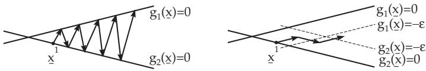
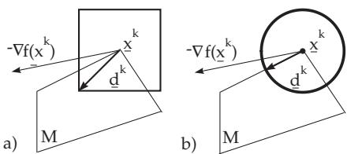
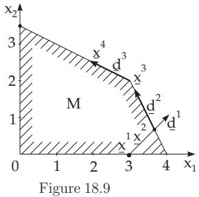
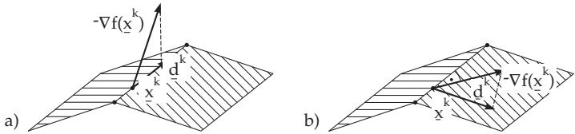

#### 18.2.7 Gradient Method for Problems with Inequality Type Constraints

If the problem

$$
f ( \underline { { { \mathbf x } } } ) = \operatorname* { m i n } ! \quad \mathrm { s u b j e c t ~ t o ~ t h e ~ c o n s t r a i n t s } \quad g _ { i } ( \underline { { { \mathbf x } } } ) \leq 0 \quad ( i = 1 , \dots , m )\tag{18.95}
$$

has to be solved by an iteration method of the type

$$
\underline { { \mathbf { x } } } ^ { k + 1 } = \underline { { \mathbf { x } } } ^ { k } + \alpha _ { k } \underline { { \mathbf { d } } } ^ { k } \quad ( k = 1 , 2 , \ldots )\tag{18.96}
$$

then two additional rules must be considered because of the bounded feasible set:

1. The direction $\mathbf { d } ^ { k }$ must be a feasible descent direction at $\underline { { \mathbf { x } } } ^ { k }$

2. The step size $\alpha _ { k }$ must be determined so that $\underline { { \mathbf { x } } } ^ { k + 1 }$ is in $M$

The diferent methods based on the formula (18.96) difer from each other only in the construction of the direction $\mathbf { d } ^ { k }$ . To ensure the feasibility of the sequence $\{ \underline { { \mathbf { x } } } ^ { k } \} \subset M , \alpha _ { k } ^ { \prime }$ and $\alpha _ { k } ^ { \prime \prime }$ are determined in the following way:

$$
\alpha _ { k } ^ { \prime } \mathrm { f r o m } f ( { \underline { { \mathbf { x } } } } ^ { k } + \alpha { \underline { { \mathbf { d } } } } ^ { k } ) = \mathrm { m i n ! } , \alpha \geq 0
$$

$$
\alpha _ { k } ^ { \prime \prime } = \operatorname* { m a x } \{ \alpha \in \mathbb { R } : \underline { { \mathbf { x } } } ^ { k } + \alpha \underline { { \mathbf { d } } } ^ { k } \in M \} .\tag{18.97}
$$

Then

$$
\alpha _ { k } = \operatorname* { m i n } \{ \alpha _ { k } ^ { \prime } , \alpha _ { k } ^ { \prime \prime } \} .\tag{18.98}
$$

If there is no feasible descent direction $\mathbf { d } ^ { k }$ in a certain step k, then $\underline { { \mathbf { x } } } ^ { k }$ is a stationary point.

##### 18.2.7.1 Method of Feasible Directions

1. Direction Search Program

A feasible descent direction $\mathbf { d } ^ { k }$ at point $\underline { { \mathbf { x } } } ^ { k }$ can be determined by the solution of the following optimization problem:

(18.99)

$$
\nabla g _ { i } ( { \underline { { \mathbf { x } } } } ^ { k } ) ^ { \mathrm { T } } \underline { { \mathbf { d } } } \leq \sigma , i \in I _ { 0 } ( { \underline { { \mathbf { x } } } } ^ { k } ) , ( 1 8 . 1 0 0 \mathrm { a } ) \qquad \nabla f ( { \underline { { \mathbf { x } } } } ^ { k } ) ^ { \mathrm { T } } \underline { { \mathbf { d } } } \leq \sigma , ( 1 8 . 1 0 0 \mathrm { b } ) \qquad | | \underline { { \mathbf { d } } } | | \leq 1 .\tag{18.100c}
$$

If $\sigma < 0$ for the result $\mathbf { d } = \mathbf { d } ^ { k }$ of this direction search program, then (18.100a) ensures feasibility and (18.100b) ensures the descending property of $\mathbf { d } ^ { k }$ . The feasible set for the direction search program is bounded by the normalizing condition (18.100c). If $\sigma = 0$ , then $\mathbf { x } ^ { k }$ is a stationary point, since there is no feasible descent direction at $\underline { { \mathbf { x } } } ^ { k }$

A direction search program, defined by (18.100a,b,c), can result in a zig-zag behavior of the sequence $\underline { { \mathbf { x } } } ^ { k }$ , which can be avoided if the index set $I _ { 0 } ( \underline { { \mathbf { x } } } ^ { k } )$ is replaced by the index set

$$
I _ { \varepsilon _ { k } } ( \underline { { \mathbf { x } } } ^ { k } ) = \{ i \in \{ 1 , \dots , m \} : - \varepsilon _ { k } \leq g _ { i } ( \underline { { \mathbf { x } } } ^ { k } ) \leq 0 \} , \quad \varepsilon _ { k } \geq 0\tag{18.101}
$$

which are the so-called $\varepsilon _ { k }$ active constraints in $\mathbf { x } ^ { k }$ . Thus, local directions of descent are excluded which are going from $\underline { { \mathbf { x } } } ^ { k }$ and lead closer to the boundaries of M consisting of the $\varepsilon _ { k }$ active constraints (Fig. 18.7).

  
Figure 18.7

$\mathrm { ~ I f ~ } \sigma = 0$ is a solution of $\left( 1 8 . 1 0 0 \mathrm { a } , \mathrm { b } , \mathrm { c } \right)$ after these modifications, then $\underline { { \mathbf { x } } } ^ { k }$ is a stationary point only if $I _ { 0 } ( \underline { { \mathbf { x } } } ^ { k } ) = I _ { \varepsilon _ { k } } ( \underline { { \mathbf { x } } } ^ { k } )$ . Otherwise $\varepsilon _ { k }$ must be decreased and the direction search program must be repeated.

  
Figure 18.8

2. Special Case of Linear Constraints If the functions $g _ { i } ( \underline { { \mathbf { x } } } )$ are linear, i.e., $g _ { i } ( \underline { { \mathbf { x } } } )$ = $\underline { { \mathbf { a } } } _ { i } ^ { \mathrm { T } } \underline { { \mathbf { x } } } - b _ { i }$ , then a simpler direction search method can be established:

$$
\sigma = \nabla f { ( { \underline { { \mathbf { x } } } } ^ { k } ) } ^ { \mathrm { T } } \underline { { \mathbf { d } } } = \operatorname* { m i n } ! \quad \mathrm { w i t h }\tag{18.102}
$$

$$
\underline { { \mathbf { a } } } _ { i } ^ { \mathrm { { T } } } \underline { { \mathbf { d } } } \le 0 , \quad i \in I _ { 0 } ( \underline { { \mathbf { x } } } ^ { k } ) \mathrm { ~ o r ~ } i \in I _ { \varepsilon _ { k } } ( \underline { { \mathbf { x } } } ^ { k } ) , ( 1 8 . 1 0 3 \mathrm { a } )
$$

$$
| | \mathbf { d } | | \leq 1 .\tag{18.103b}
$$

The efect of the choice of diferent norms $| | \underline { { \mathbf { d } } } | | =$ max $\{ | d _ { i } | \} \le 1$ or $| | \underline { { \mathbf { d } } } | | = \sqrt { \underline { { \mathbf { d } } } ^ { \mathrm { T } } \underline { { \mathbf { d } } } } \leq 1$ is shown in Fig. 18.8a,b.

In a certain sense, the best choice is the norm $| | \underline { { \mathbf { d } } } | | = | | \underline { { \mathbf { d } } } | | _ { 2 } = \sqrt { \underline { { \mathbf { d } } } ^ { \mathrm { T } } \underline { { \mathbf { d } } } }$ , since by the direction search program the direction $\mathbf { \underline { { d } } } ^ { k }$ is obtained, which forms the smallest angle with $- \nabla f ( \underline { { \mathbf { x } } } ^ { k } )$ . In this case the direction search program is not linear and requires higher computational costs. With the choice $| | \underline { { \mathbf { d } } } | | =$ $| | \underline { { \mathbf { d } } } | | _ { \infty } = \operatorname* { m a x } \{ | \hat { d } _ { i } | \} \leq 1$ a system of linear constraints $- 1 \leq \hat { d } _ { i } \leq 1 , ( i = 1 , \dots , n )$ is obtained, so the direction search program can be solved, $\mathrm { e . g . }$ ., by the simplex method.

In order to ensure that the method of feasible directions for a quadratic optimization problem $f ( \underline { { \mathbf { x } } } ) =$ $\underline { { \mathbf { x } } } ^ { \mathrm { T } } \mathbf { C } \underline { { \mathbf { x } } } + \underline { { \mathbf { p } } } ^ { \mathrm { T } } \underline { { \mathbf { x } } } =$ min! with $\mathbf { A } \underline { { \mathbf { x } } } \le$ b results in a solution in finitely many steps, the direction search program is completed by the following conjugate requirements: If $\alpha _ { k - 1 } = \alpha _ { k - 1 } ^ { \prime }$ holds in a step, i.e., $\underline { { \mathbf { x } } } ^ { k }$ is an “interior” point, then the condition

$$
\underline { { \mathbf { d } } } ^ { k - 1 ^ { \mathrm { T } } } \mathbf { C } \underline { { \mathbf { d } } } = 0\tag{18.104}
$$

is added to the direction search program. Furthermore the corresponding conditions are kept from the previous steps. If in a later step $\alpha _ { k } = \alpha _ { k } ^ { \prime \prime }$ then the condition (18.104) is removed.

$$
f ( \underline { { \mathbf { x } } } ) = x _ { 1 } ^ { 2 } + 4 x _ { 2 } ^ { 2 } - 1 0 x _ { 1 } - 3 2 x _ { 2 } = \operatorname* { m i n } ! \quad g _ { 1 } ( \underline { { \mathbf { x } } } ) = - x _ { 1 } \leq 0 , \ g _ { 2 } ( \underline { { \mathbf { x } } } ) = - x _ { 2 } \leq 0 ,
$$

$$
g _ { 3 } ( { \underline { { \mathbf { x } } } } ) = x _ { 1 } + 2 x _ { 2 } - 7 \leq 0 , g _ { 4 } ( { \underline { { \mathbf { x } } } } ) = 2 x _ { 1 } + x _ { 2 } - 8 \leq 0 .
$$

Step 1: Starting with $\underline { { \mathbf { x } } } ^ { 1 } = ( 3 , 0 ) ^ { \mathrm { T } } , \nabla f ( \underline { { \mathbf { x } } } ^ { 1 } ) = ( - 4 , - 3 2 ) ^ { \mathrm { T } } , I _ { 0 } ( \underline { { \mathbf { x } } } ^ { 1 } ) = \{ 2 \}$

Direction search program: $\left\{ \begin{array} { l l } { - 4 d _ { 1 } - 3 2 d _ { 2 } = \operatorname* { m i n } ! } \\ { - d _ { 2 } \leq 0 , \ \vert \vert \underline { { \mathbf { d } } } \vert \vert _ { \infty } \leq 1 } \end{array} \right\} \Longrightarrow \underline { { \mathbf { d } } } ^ { 1 } = ( 1 , 1 ) ^ { \mathrm { T } } .$

Minimizing constant: $\alpha _ { k } ^ { \prime } = - \frac { \underline { { \mathbf { d } } } ^ { k ^ { \mathrm { T } } } \nabla f ( \underline { { \mathbf { x } } } ^ { k } ) } { 2 \underline { { \mathbf { d } } } ^ { k ^ { \mathrm { T } } } \mathbf { C } \underline { { \mathbf { d } } } ^ { k } } \mathrm { ~ w i t h ~ } \mathbf { C } = \left( \begin{array} { l l } { 1 } & { 0 } \\ { 0 } & { 4 } \end{array} \right)$

Maximal feasible step size: $\alpha _ { k } ^ { \prime \prime } = \operatorname* { m i n } \left\{ \frac { - g _ { i } ( \underline { { \mathbf { x } } } ^ { k } ) } { \underline { { \mathbf { a } } } _ { i } ^ { \mathrm { T } } \underline { { \mathbf { d } } } ^ { k } } \right.$ : for i such that $\underline { { { \bf a } } } _ { i } ^ { \mathrm { ~ T } } \underline { { { \bf d } } } ^ { k } > 0 \} , \alpha _ { 1 } ^ { \prime } = \frac { 1 8 } { 5 } , \alpha _ { 1 } ^ { \prime \prime } = \frac { 2 } { 3 } \implies$

$$
\alpha _ { 1 } = \operatorname* { m i n } \left\{ { \frac { 1 8 } { 5 } } , { \frac { 2 } { 3 } } \right\} = { \frac { 2 } { 3 } } , \ \mathbf { { x } } ^ { 2 } = { \bigg ( } { \frac { 1 1 } { 3 } } , { \frac { 2 } { 3 } } { \bigg ) } ^ { \mathrm { T } } .
$$

Step 2: $\nabla f ( { \underline { { \mathbf { x } } } } ^ { 2 } ) = \left( - { \frac { 8 } { 3 } } , - { \frac { 8 0 } { 3 } } \right) ^ { \mathrm { T } } , \quad I _ { 0 } ( { \underline { { \mathbf { x } } } } ^ { 2 } ) = \{ 4 \}$

Direction search program: $\left\{ \begin{array} { l } { { - { \frac { 8 } { 3 } } d _ { 1 } - { \frac { 8 0 } { 3 } } d _ { 2 } = \operatorname* { m i n } ! } } \\ { { 2 \dot { d } _ { 1 } + d _ { 2 } \leq 0 , ~ | | \mathbf { { d } } | | _ { \infty } \leq 1 } } \end{array} \right\} \Longrightarrow \mathbf { d } ^ { 2 } = \left( - { \frac { 1 } { 2 } } , 1 \right) ^ { \mathrm { T } } , \alpha _ { 2 } ^ { \prime } = { \frac { 1 5 2 } { 5 1 } } , ~ \alpha _ { 2 } ^ { \prime \prime } = { \frac { 4 } { 3 } } \Longrightarrow$

$$
\alpha _ { 2 } = \frac { 4 } { 3 } , \ \underline { { \mathbf { x } } } ^ { 3 } = \left( 3 , 2 \right) ^ { \mathrm { T } } .
$$

Step 3: $\nabla f ( { \underline { { \mathbf { x } } } } ^ { 3 } ) = ( - 4 , - 1 6 ) ^ { \mathrm { T } } , \quad I _ { 0 } = ( { \underline { { \mathbf { x } } } } ^ { 3 } ) = \{ 3 , 4 \} \mathrm { , }$

Direction search program:

$$
\left\{ \begin{array} { l c l } { { - 4 d _ { 1 } - 1 6 d _ { 2 } = \operatorname* { m i n } ! } } & { { } } & { { } } \\ { { d _ { 1 } + 2 d _ { 2 } \leq 0 , ~ 2 d _ { 1 } + d _ { 2 } \leq 0 , ~ | | \underline { { { \bf d } } } | | _ { \infty } \leq 1 } } & { { \Longrightarrow } } & { { { \bf d } ^ { 3 } = } } \end{array} \right.
$$

$$
{ \left( - 1 , \frac 1 2 \right) } ^ { \mathrm { T } } , { \alpha } _ { 3 } ^ { \prime } = 1 , { \alpha } _ { 3 } ^ { \prime \prime } = 3 \Longrightarrow { \alpha } ^ { 3 } = 1 , \underline { { \mathbf { x } } } ^ { 4 } = { \left( 2 , \frac { 5 } { 2 } \right) } ^ { \mathrm { T } } .
$$

The next direction search program results in $\sigma = 0$ . Here the minimum point is $\underline { { \mathbf { x } } } ^ { * } = \underline { { \mathbf { \hat { x } } } } ^ { 4 } \left( \mathbf { F i g } . \ 1 8 . 9 \right)$

##### 18.2.7.2 Gradient Projection Method

1. Formulation of the Problem and Solution Principle

Suppose the convex optimization problem

f(x) = min! with $\mathbf { a } _ { i } ^ { \mathrm { ~ T } } \mathbf { \underline { { x } } } \leq b _ { i }$

(18.105)

for $i = 1 , \ldots , m$ is given. A feasible descent direction $\mathbf { d } ^ { k }$ at the point $\underline { { \mathbf { x } } } ^ { k } \in M$ is determined in the following way:

$\operatorname { I f } - \nabla f ( \underline { { \mathbf { x } } } ^ { k } )$ is a feasible direction, then $\underline { { \mathbf { d } } } ^ { k } = - \nabla f ( \underline { { \mathbf { x } } } ^ { k } )$ is selected. Otherwise $\underline { { \mathbf { x } } } ^ { k }$ is on the boundary of M and $- \nabla f ( \underline { { \mathbf { x } } } ^ { k } )$ points outward from M. The vector $- \nabla f ( \underline { { \mathbf { x } } } ^ { k } )$ is projected by a linear mapping $\mathbf { P } _ { k }$ into a linear submanifold of the boundary of M defined by a subset of active constraints of $\underline { { \mathbf { x } } } ^ { k }$ Fig. 18.10a shows a projection into an edge, Fig. 18.10b shows a projection into a face. Supposing non-degeneracy, i.e., if the vectors $\underline { { \mathbf { a } } } _ { i } , i \in I _ { 0 } ( \underline { { \mathbf { x } } } )$ are linearly independent for every $\underline { { \mathbf { x } } } \in \mathbb { R } ^ { n }$ , such a projection is given by

  
Figure 18.10

$$
\underline { { \mathbf { d } } } ^ { k } = - \mathbf { P } _ { k } \nabla f ( \underline { { \mathbf { x } } } ^ { k } ) = - \left( \mathbf { I } - \mathbf { A } _ { k } ^ { \top } \big ( \mathbf { A } _ { k } \mathbf { A } _ { k } ^ { \top } \big ) ^ { - 1 } \mathbf { A } _ { k } \right) \nabla f ( \underline { { \mathbf { x } } } ^ { k } ) .\tag{18.106}
$$

Here, $\mathbf { A } _ { k }$ consists of all vectors $\underline { { \mathbf { a } } } _ { i } ^ { \mathrm { ~ T ~ } }$ , whose corresponding constraints form the sub-manifold, into which $- \nabla f ( \underline { { \mathbf { x } } } _ { k } )$ should be projected.

2. Algorithm

The gradient projection method consists of the following steps, starting with $\underline { { \mathbf { x } } } ^ { 1 } \in M$ and substituting $k = \bar { 1 }$ and proceeding in accordance to the following scheme:

I: If $- \nabla f ( \underline { { \mathbf { x } } } ^ { k } )$ is a feasible direction, then $\underline { { \mathbf { d } } } ^ { k } \ = \ - \nabla f ( \underline { { \mathbf { x } } } ^ { k } )$ is substituted. and continued with III Otherwise $\mathbf { A } _ { k }$ is constructed from the vectors $\underline { { \mathbf { a } } } _ { i } ^ { \mathrm { ~ T ~ } }$ with $i \in I _ { 0 } ( \underline { { \mathbf { x } } } ^ { k } )$ and continued with II.

II: $\mathbf { \underline { { d } } } ^ { k } = - \left( \mathbf { I } - \mathbf { A _ { \boldsymbol { k } } } ^ { \mathrm { T } } \big ( \mathbf { A _ { \boldsymbol { k } } } \mathbf { A _ { \boldsymbol { k } } } ^ { \mathrm { T } } \big ) ^ { - 1 } \mathbf { A } _ { \boldsymbol { k } } \right) \nabla f \big ( \mathbf { \underline { { x } } } ^ { k } \big )$ is sunstituted. If $\mathbf { d } ^ { k } \neq \underline { { \mathbf { 0 } } }$ , then continued with III. If $\mathbf { d } ^ { k } = 0$ and $\underline { { \mathbf { u } } } = - { ( \mathbf { A } _ { k } \mathbf { A } _ { k } } ^ { \mathrm { T } } ) ^ { - 1 } \mathbf { A } _ { k } \nabla f ( \underline { { \mathbf { x } } } ^ { k } ) \geq 0$ , then $\underline { { \mathbf { x } } } ^ { k }$ is a minimum point. The local Kuhn-Tucker conditions $- \nabla f ( \underline { { \mathbf { x } } } ^ { k } ) = \sum _ { i \in I _ { 0 } ( \underline { { \mathbf { x } } } ^ { k } ) } u _ { i } \underline { { \mathbf { a } } } _ { i } = \mathbf { A } _ { k } ^ { \mathrm { ~ T ~ } }$ u are obviously satisfied.

If $\underline { { \mathbf { u } } } \not \geq \underline { { \mathbf { 0 } } }$ , then an i with $u _ { i } < 0$ is chosen, the i-th row from $\mathbf { A } _ { k }$ is deleted and II is repeated.

III: Calculation of $\alpha _ { k }$ and $\underline { { \mathbf { x } } } ^ { k + 1 } = \underline { { \mathbf { x } } } ^ { k } + \alpha _ { k } \underline { { \mathbf { d } } } ^ { k }$ and returning to I with $k = k + 1$

3. Remarks on the Algorithm

If $\mathbf { \nabla } \cdot \nabla f ( \mathbf { \underline { { x } } } ^ { k } )$ is not feasible, then this vector is mapped onto the sub-manifold of the smallest dimension which contains $\underline { { \mathbf { x } } } ^ { k }$ . If $\mathbf { d } ^ { k } = \underline { { \mathbf { 0 } } }$ , then $- \nabla f ( \mathbf { \underline { { x } } } ^ { k } )$ is perpendicular to this sub-manifold. If $\underline { { \mathbf { u } } } \geq \underline { { \mathbf { 0 } } }$ does not hold, then the dimension of the sub-manifold is increased by one by omitting one of the active constraints, so maybe $\mathbf { d } ^ { k } \neq \underline { { \mathbf { 0 } } }$ can occur (Fig. 18.10b) (with projection onto a (lateral) face). Since $\mathbf { A } _ { k }$ is often obtained from ${ \bf A } _ { k - 1 }$ by adding or erasing a row, the calculation of $\left( \mathbf { A } _ { k } \mathbf { A } _ { k } ^ { \mathrm { ~ T ~ } } \right) ^ { - 1 }$ can be simplified by the use of $\left( { \bf A } _ { k - 1 } { \bf A } _ { k - 1 } ^ { \top } \right) ^ { - 1 }$

Solution of the problem of the previous example on p. 938.

Step 1: $\underline { { \mathbf { x } } } ^ { 1 } = \left( 3 , 0 \right) ^ { \mathrm { T } }$

I: $\nabla f ( \underline { { \mathbf { x } } } ^ { 1 } ) = ( - 4 , - 3 2 ) ^ { \mathrm { T } } , \mathbf { \nabla } - \nabla f ( \underline { { \mathbf { x } } } ^ { 1 } )$ is feasible, $\underline { { \mathbf { d } } } ^ { 1 } = ( 4 , 3 2 ) ^ { \mathrm { T } }$

III: The step size is determined as in the previous example: $\alpha _ { 1 } = \frac { 1 } { 2 0 } , \ \underline { { \mathbf { x } } } ^ { 2 } = \left( \frac { 1 6 } { 5 } , \frac { 8 } { 5 } \right) ^ { \mathrm { T } }$ Step 2:

I: $\nabla f ( { \underline { { \mathbf { x } } } } ^ { 2 } ) = \left( - { \frac { 1 8 } { 5 } } , - { \frac { 9 6 } { 5 } } \right) ^ { \mathrm { T } }$ (not feasible), $I _ { 0 } ( \underline { { \mathbf { x } } } ^ { 2 } ) = \{ 4 \}$ , A2 = (2 1).

II: $\mathbf { P } _ { 2 } = { \frac { 1 } { 5 } } { \left( \begin{array} { l l } { 1 } & { - 2 } \\ { - 2 } & { 4 } \end{array} \right) } , \ \mathbf { { d } } ^ { 2 } = \left( - { \frac { 8 } { 2 5 } } , { \frac { 1 6 } { 2 5 } } \right) ^ { \mathrm { T } } \neq \mathbf { { 0 } } .$

III: $\alpha _ { 2 } = \frac { 5 } { 8 } , \ \underline { { \mathbf { x } } } ^ { 3 } = \left( 3 , 2 \right) ^ { \mathrm { T } } .$

Step 3:

$$
\mathrm { I } \colon \ \nabla f ( \underline { { \mathbf { x } } } ^ { 3 } ) = ( - 4 , - 1 6 ) ^ { \mathrm { T } } \ ( \mathrm { n o t ~ f e a s i b l e } ) , \ I _ { 0 } ( \underline { { \mathbf { x } } } ^ { 3 } ) = \{ 3 , 4 \} , \ \textup { } \textup { } \textup { } \textup { } \textup { } \textup { } \textup { } \textup { } \textup { } \textup { } \textup { } \textup { } \textup { } \textup { } \textup { } \textup { } \textup { } \textup { } \textup { } \textup { } \textup { } \textup { } \textup { } \textup { } \textup { } \textup { } \textup { } \textup { } \textup { }
$$

$$
\mathrm { I I } { \boldsymbol { : } } ~ \mathbf { P } _ { 3 } = { \left( \begin{array} { l l } { 0 } & { 0 } \\ { 0 } & { 0 } \end{array} \right) } , \quad \mathbf { d } ^ { 3 } = ( 0 , 0 ) ^ { \mathrm { T } } , \mathbf { \underline { { u } } } = \left( { \frac { 2 8 } { 3 } } , - { \frac { 8 } { 3 } } \right) ^ { \mathrm { T } } u _ { 2 } < 0 : ~ \mathbf { A } _ { 3 } = ( 1 ~ 2 ) .
$$

$$
{ \mathrm { I I } } { \mathrm { : ~ } } { \mathbf { P } } _ { 3 } = { \frac { 1 } { 5 } } { \left( \begin{array} { l l } { 4 } & { - 2 } \\ { - 2 } & { 1 } \end{array} \right) } , { \mathbf { d } } ^ { 3 } = { \left( - { \frac { 1 6 } { 5 } } , { \frac { 8 } { 5 } } \right) } ^ { \mathrm { T } } .
$$

III: $\alpha _ { 3 } = \frac { 5 } { 1 6 } , \quad \underline { { \mathbf { x } } } ^ { 4 } = \Big ( 2 , \frac { 5 } { 2 } \Big ) ^ { \mathrm { T } } .$

Step 4:

I: f(x4) = ( 6, 12)T (not feasible), I0(x4) = 3 , A4 = A3.

II: $\mathbf P _ { 4 } = \mathbf P _ { 3 } , \ \underline { { \mathbf d } } ^ { 4 } = \left( 0 , 0 \right) ^ { \mathrm T } , \ u = 6 \ge 0 .$

It follows that $\underline { { \mathbf { x } } } ^ { 4 }$ is a minimum point.
