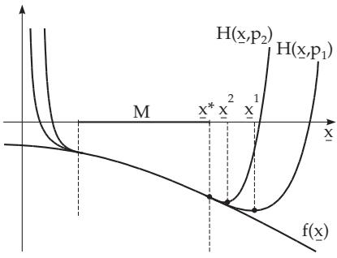
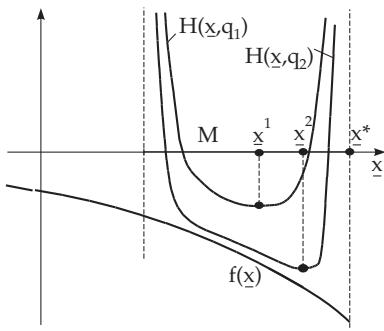

#### 18.2.8 Penalty Function and Barrier Methods

The basic principle of these methods is that a constrained optimization problem is transformed into a sequence of optimization problems without constraints by modifying the objective function. The modified problem can be solved, $\mathrm { e . g . }$ , by the methods given in Section 18.2.5. With an appropriate construction of the modified objective functions, every accumulation point of the sequence of the solution points of this modified problem is a solution of the original problem.

##### 18.2.8.1 Penalty Function Method

The problem

$$
f ( \underline { { \mathbf { x } } } ) = \mathrm { m i n } ! \mathrm { \ s u b j e c t { \ t o } } g _ { i } ( \underline { { \mathbf { x } } } ) \leq 0 ( i = 1 , 2 , \dots , m )\tag{18.107}
$$

is replaced by the sequence of unconstrained problems

$$
H ( \mathbf { x } , p _ { k } ) = f ( \mathbf { x } ) + p _ { k } S ( \mathbf { x } ) = \operatorname* { m i n } ! { \mathrm { ~ w i t h ~ } } \mathbf { x } \in \mathbb { R } ^ { n } , { \mathrm { ~ } } p _ { k } > 0 { \mathrm { ~ } } ( k = 1 , 2 , \ldots ) .\tag{18.108}
$$

Here, $p _ { k }$ is a positive parameter, and for S(x)

$$
\begin{array} { r } { S ( \underline { { \mathbf { x } } } ) = \left\{ \begin{array} { l l } { = 0 } & { \ \underline { { \mathbf { x } } } \in M , } \\ { > 0 } & { \ \underline { { \mathbf { x } } } \notin M , } \end{array} \right. } \end{array}\tag{18.109}
$$

holds, i.e., leaving the feasible set M is punished with a “penalty” term $p _ { k } S ( \underline { { \mathbf { x } } } )$ . The problem (18.108) is solved with a sequence of penalty parameters $p _ { k }$ tending to . Then

$$
\operatorname* { l i m } _ { k \to \infty } H ( \underline { { \mathbf { x } } } , p _ { k } ) = f ( \underline { { \mathbf { x } } } ) , \quad \underline { { \mathbf { x } } } \in M .\tag{18.110}
$$

If $\underline { { \mathbf { x } } } ^ { k }$ is the solution of the k-th penalty problem, then:

$$
H ( \underline { { \mathbf { x } } } ^ { k } , p _ { k } ) \geq H ( \underline { { \mathbf { x } } } ^ { k - 1 } , p _ { k - 1 } ) , \quad f ( \underline { { \mathbf { x } } } ^ { k } ) \geq f ( \underline { { \mathbf { x } } } ^ { k - 1 } ) ,\tag{18.111}
$$

and every accumulation point $\underline { { \mathbf { x } } } ^ { * }$ of the sequence $\{ \underline { { \mathbf { x } } } ^ { k } \}$ is a solution of (18.107). ${ \mathrm { I f } } \underline { { \mathbf { x } } } ^ { k } \in M$ , then $\underline { { \mathbf { x } } } ^ { k }$ is a solution of the original problem.

For instance, the following functions are appropriate realizations of $S ( \underline { { \mathbf { x } } } )$

$$
S ( \underline { { \mathbf { x } } } ) = \operatorname* { m a x } ^ { r } \{ 0 , g _ { 1 } ( \underline { { \mathbf { x } } } ) , \dots , g _ { m } ( \underline { { \mathbf { x } } } ) \} \ ( r = 1 , 2 , \dots ) \ \mathrm { o r }\tag{18.112a}
$$

$$
S ( \underline { { { \bf x } } } ) = \sum _ { i = 1 } ^ { m } \mathrm { m a x } ^ { r } \{ 0 , g _ { i } ( \underline { { { \bf x } } } ) \} ( r = 1 , 2 , \ldots ) .\tag{18.112b}
$$

If functions $f ( \underline { { \mathbf { x } } } )$ and $g _ { i } ( \underline { { \mathbf { x } } } )$ are diferentiable, then in the case $r > 1$ , the penalty function $H ( \underline { { \mathbf { x } } } , p _ { k } )$ is also diferentiable on the boundary of M, so analytic solutions can be used to solve the auxiliary problem (18.108).

Fig. 18.11 shows a representation of the penalty function method.

  
Figure 18.11  
Figure 18.12

$f ( \underline { { \mathbf { x } } } ) = x _ { 1 } ^ { 2 } + x _ { 2 } ^ { 2 } =$ min! for $x _ { 1 } + x _ { 2 } \geq 1 , \ H ( \underline { { { \bf x } } } , p _ { k } ) = x _ { 1 } ^ { 2 } + x _ { 2 } ^ { 2 } + p _ { k } \operatorname* { m a x } ^ { 2 } \{ 0 , 1 - x _ { 1 } - x _ { 2 } \}$ The necessary optimality condition is:

$$
\nabla H ( \underline { { { \bf x } } } , p _ { k } ) = { \binom { 2 x _ { 1 } - 2 p _ { k } \operatorname* { m a x } \{ 0 , 1 - x _ { 1 } - x _ { 2 } \} } { 2 x _ { 2 } - 2 p _ { k } \operatorname* { m a x } \{ 0 , 1 - x _ { 1 } - x _ { 2 } \} } } = { \binom { 0 } { 0 } } .
$$

The gradient of H is evaluated here with respect to x. By subtracting the equations we have $x _ { 1 } = x _ { 2 }$ The equation $2 x _ { 1 } - 2 p _ { k } \operatorname* { m a x } \{ 0 , 1 - 2 x _ { 1 } \} = 0$ has a unique solution $x _ { 1 } ^ { k } = x _ { 2 } ^ { k } = { \frac { p _ { k } } { 1 + 2 p _ { k } } }$ . We get the

solution $x _ { 1 } ^ { * } = x _ { 2 } ^ { * } = \operatorname* { l i m } _ { k \to \infty } \frac { p _ { k } } { 1 + 2 p _ { k } } = \frac { 1 } { 2 }$ by letting $k \to \infty$

##### 18.2.8.2 Barrier Method

A sequence of modified problems is considered in the form

$$
H ( \underline { { { \bf x } } } , q _ { k } ) = f ( \underline { { { \bf x } } } ) + q _ { k } B ( \underline { { { \bf x } } } ) = \operatorname* { m i n } ! , \quad q _ { k } > 0 .\tag{18.113}
$$

The term $q _ { k } B ( \underline { { \mathbf { x } } } )$ prevents the solution leaving the feasible set $M ,$ since the objective function increases unboundedly on approaching the boundary of M. The regularity condition

$$
M ^ { 0 } = \{ \underline { { \mathbf { x } } } \in M \ : \ g _ { i } ( \underline { { \mathbf { x } } } ) < 0 \ \left( i = 1 , 2 , \dots , m \right) \} \neq \emptyset \quad \mathrm { a n d } \quad \overline { { M ^ { 0 } } } = M\tag{18.114}
$$

must be satisfied, i.e., the interior of M must be non-empty and it is possible to get to any boundary point by approaching it from the interior, i.e., the closure of $M ^ { 0 }$ is $M$

The function $B ( \underline { { \mathbf { x } } } )$ is defined to be continuous on $M ^ { 0 }$ . It increases to at the boundary of M. The modified problem (18.113) is solved by a sequence of barrier parameters $q _ { k }$ tending to zero. For the solution $\bar { \mathbf { \underline { { x } } } ^ { k } }$ of the k-th problem (18.113)

$$
f ( \underline { { \mathbf { x } } } ^ { k } ) \leq f ( \underline { { \mathbf { x } } } ^ { k - 1 } ) ,\tag{18.115}
$$

holds and every accumulation point $\underline { { \mathbf { x } } } ^ { * }$ of the sequence $\{ \underline { { \mathbf { x } } } ^ { k } \}$ is a solution of (18.107).   
Fig. 18.12 shows a representation of the barrier method.

The functions, e.g.,

$$
B ( \underline { { \mathbf { x } } } ) = - \sum _ { i = 1 } ^ { m } - \ln ( - g _ { i } ( \underline { { \mathbf { x } } } ) ) , \quad \underline { { \mathbf { x } } } \in M ^ { 0 } \quad \mathrm { o r }\tag{18.116a}
$$

$$
B ( \underline { { { \mathbf x } } } ) = \sum _ { i = 1 } ^ { m } \frac { 1 } { [ - g _ { i } ( \underline { { { \mathbf x } } } ) ] ^ { r } } \quad ( r = 1 , 2 , \ldots ) , \quad \underline { { { \mathbf x } } } \in M ^ { 0 }\tag{18.116b}
$$

are appropriate realizations of $B ( \underline { { \mathbf { x } } } )$

■ $f ( \underline { { \mathbf { x } } } ) = x _ { 1 } ^ { 2 } + x _ { 2 } ^ { 2 } =$ min! subject to $x _ { 1 } + x _ { 2 } \geq 1 , H ( \underline { { { \bf x } } } , q _ { k } ) = x _ { 1 } ^ { 2 } + x _ { 2 } ^ { 2 } + q _ { k } ( - \ln ( x _ { 1 } + x _ { 2 } - 1 ) )$

$$
x _ { 1 } + x _ { 2 } > 1 , \nabla H ( { \bf x } , q _ { k } ) = \left( \begin{array} { l } { 2 x _ { 1 } - q _ { k } \frac { 1 } { x _ { 1 } - x _ { 2 } - 1 } } \\ { 2 x _ { 2 } - q _ { k } \frac { 1 } { x _ { 1 } + x _ { 2 } - 1 } } \end{array} \right) = \left( \begin{array} { l } { 0 } \\ { 0 } \end{array} \right) , \quad x _ { 1 } + x _ { 2 } > 1 . \mathrm { T h e ~ g r a d i e n t ~ o f ~ } H \mathrm { ~ i s ~ g i v e n } .
$$

with respect to $\underline { { \mathbf { x } } } .$

Subtracting the equations results in $x _ { 1 } = x _ { 2 } , 2 x _ { 1 } - q _ { k } { \frac { 1 } { 2 x _ { 1 } - 1 } } = 0 , x _ { 1 } > { \frac { 1 } { 2 } } , \implies x _ { 1 } ^ { 2 } - { \frac { x _ { 1 } } { 2 } } - { \frac { q _ { k } } { 4 } } =$

$$
0 , \ x _ { 1 } > \frac { 1 } { 2 } , \ x _ { 1 } ^ { k } = x _ { 2 } ^ { k } = \frac { 1 } { 4 } + \sqrt { \frac { 1 } { 1 6 } + \frac { 1 } { 4 } q _ { k } } , \ k \to \infty , \ q _ { k } \to 0 \colon \ x _ { 1 } ^ { * } = x _ { 2 } ^ { * } = \frac { 1 } { 2 } .
$$

The solutions of problems (18.108) and (18.113) at the k-th step do not depend on the solutions of the previous steps. The application of higher penalty or smaller barrier parameters often leads to convergence problems with numerical solutions of (18.108) and (18.113), e.g., in the method of (18.2.4), in particular, if no good initial approximation is available. Using the result of the k-th problem as the initial solution for the $( k + 1 )$ -th problem the convergence behavior can be improved.
