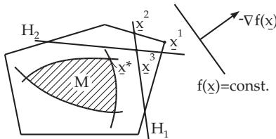

#### 18.2.9 Cutting Plane Methods

1. Formulation of the Problem and Principle of Solution

Let consider the problem

$$
f ( \underline { { \mathbf { x } } } ) = \underline { { \mathbf { c } } } ^ { \mathrm { T } } \underline { { \mathbf { x } } } = \mathrm { m i n } ! , \quad \underline { { \mathbf { c } } } \in \mathbb { R } ^ { n }\tag{18.117}
$$

over the bounded region $M \subset \mathbb { R } ^ { n }$ given by convex functions $g _ { i } ( \underline { { { \bf x } } } ) { \bf \nabla } ( i = 1 , 2 , \dots , m )$ in the form $g _ { i } ( \underline { { \mathbf { x } } } ) \leq$ 0. A problem with a non-linear but convex objective function $f ( \underline { { \mathbf { x } } } )$ is transformed into this form, if

$$
f ( \mathbf { x } ) - x _ { n + 1 } \leq 0 , \quad x _ { n + 1 } \in \mathbb { R }\tag{18.118}
$$

is considered as a further constraint and

$$
\overline { { f } } ( \overline { { \underline { { \mathbf { x } } } } } ) = x _ { n + 1 } = \operatorname* { m i n } ! \quad \mathrm { f o r ~ a l l } \quad \underline { { \underline { { \mathbf { x } } } } } = ( \underline { { \mathbf { x } } } , x _ { n + 1 } ) \in \mathbf { R } ^ { n + 1 }\tag{18.119}
$$

is solved with $\overline { { { g } } } _ { i } ( \underline { { { \bf x } } } ) = g _ { i } ( \underline { { { \bf x } } } ) \leq 0 .$

The basic idea of the method is the iterative linear approximation of M by a convex polyhedron in the

  
Figure 18.13

neighborhood of the minimum point $\underline { { \mathbf { x } } } ^ { * }$ , and therefore the original program is reduced to a sequence of linear programming problems.

First, a polyhedron is determined:

$$
P _ { 1 } = \{ \underline { { \mathbf { x } } } \in \mathbb { R } ^ { n } : \underline { { \mathbf { a } } } _ { i } ^ { \mathrm { ~ T } } \underline { { \mathbf { x } } } \leq b _ { i } , i = 1 , \ldots , s \} .\tag{18.120}
$$

From the linear program

$$
f ( \underline { { \mathbf { x } } } ) = \mathrm { m i n } ! \quad \mathrm { w i t h } \quad \underline { { \mathbf { x } } } \in P _ { 1 }\tag{18.121}
$$

an optimal extreme point $\underline { { \mathbf { x } } } ^ { 1 }$ of $P _ { 1 }$ is determined with respect to $f ( \underline { { \mathbf { x } } } )$ . If $\underline { { \mathbf { x } } } ^ { 1 ^ { \widehat { } } } \in M$ holds, then the optimal solution of the original problem is found. Otherwise, a hyperplane is determined:

$H _ { 1 } = \{ \underline { { \mathbf { x } } } : \ \underline { { \mathbf { a } } } _ { s + 1 } ^ { } \mathrm { \bf ^ { T } } \underline { { \mathbf { x } } } = b _ { s + 1 } , \ \underline { { \mathbf { a } } } _ { s + 1 } ^ { } \mathrm { \bf ^ { T } } x ^ { 1 } > b _ { s + 1 } \}$ , which separates the point $\underline { { \mathbf { x } } } ^ { 1 }$ from M, so the new polyhedron contains

$$
P _ { 2 } = \{ { \underline { { \mathbf { x } } } } \in P _ { 1 } : \ { \underline { { \mathbf { a } } } } _ { s + 1 } ^ { \mathrm { ~ T } } { \underline { { \mathbf { x } } } } \leq b _ { s + 1 } \} .\tag{18.122}
$$

Fig. 18.13 shows a schematic representation of the cutting plane method.

2. Kelley Method

The diferent methods difer from each other in the choice of the separating planes $H _ { k }$ . In the case of the Kelley method $H _ { k }$ is chosen in the following way: $\mathrm { ~ A ~ } j _ { k }$ is chosen so that

$$
g _ { j _ { k } } ( \underline { { \mathbf { x } } } ^ { k } ) = \operatorname* { m a x } \{ g _ { i } ( \underline { { \mathbf { x } } } ^ { k } ) \ ( i = 1 , \dots , m ) \} .\tag{18.123}
$$

At the point $\underline { { \mathbf { x } } } = \underline { { \mathbf { x } } } ^ { k }$ , the function $g _ { j k } ( \underline { { \mathbf { x } } } )$ has the tangent plane

$$
T ( \underline { { \mathbf { x } } } ) = g _ { j _ { k } } ( \underline { { \mathbf { x } } } ^ { k } ) + { ( \underline { { \mathbf { x } } } - \underline { { \mathbf { x } } } ^ { k } ) } ^ { \mathrm { T } } \nabla g _ { j _ { k } } ( \underline { { \mathbf { x } } } ^ { k } ) .\tag{18.124}
$$

The hyperplane $H _ { k } = \{ \mathbf { x } \in \mathbb { R } ^ { n } ~ : ~ T ( \mathbf { x } ) = 0  \}$ separates the point $\underline { { \mathbf { x } } } ^ { k }$ from all points x with $g _ { j _ { k } } ( \underline { { \mathbf { x } } } ) \leq 0$ ${ \mathrm { S o } } ,$ for the $( k + 1 ) \AA$ linear program, $T ( \underline { { \mathbf { x } } } ) \leq 0$ is added as a further constraint. Every accumulation point $\underline { { \mathbf { x } } } ^ { * }$ of the sequence $\{ \underline { { \mathbf { x } } } ^ { k } \}$ is a minimum point of the original problem.

In practical applications this method shows a low speed of convergence. Furthermore, the number of constraints is always increasing.
