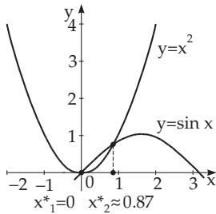
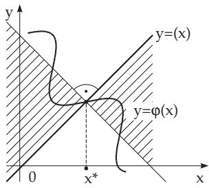
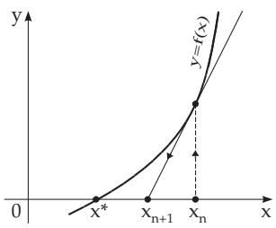
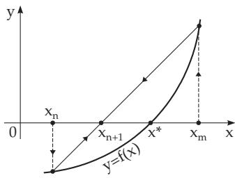

### 19.1 Numerical Solution of Non-Linear Equations in a Single Unknown

Every equation with one unknown can be transformed into one of the normal forms:

Zero form:

$$
f ( x ) = 0 .\tag{19.1}
$$

Fixed point form: $x = \varphi ( x )$

(19.2)

Suppose equations (19.1) and (19.2) can be solved. The solutions are denoted by $x ^ { * }$ . To get a first approximation of $x ^ { * }$ , we can try to transfom the equation into the form $f _ { 1 } ( x ) \ = \ f _ { 2 } ( x )$ , where the curves of the functions $y = f _ { 1 } ( x )$ and $y = f _ { 2 } ( x )$ are more or less simple to sketch.

■ $f ( x ) = x ^ { 2 } - \sin x = 0$ . From the shapes of the curves $y = x ^ { 2 }$ and $y = \sin x$ it can be seen that $x _ { 1 } ^ { * } = 0$ and $x _ { 2 } ^ { * } \approx 0 . 8 7$ are roots (Fig. 19.1).

  
Figure 19.1

  
Figure 19.2

#### 19.1.1 Iteration Method

The general idea of iterative methods is that starting with known initial approximations $x _ { k } \ ( k \ =$ $0 , 1 , \ldots , n )$ a sequence of further and better approximations is formed, step by step, hence the solution of the given equation is approached by iteration, by a convergent sequence. A sequence is tried to be created with convergence as fast as possible.

##### 19.1.1.1 Ordinary Iteration Method

To solve an equation given in or transformed into the fixed point form $x = \varphi ( x )$ , the iteration rule

$$
x _ { n + 1 } = \varphi ( x _ { n } ) \quad ( n = 0 , 1 , 2 , \ldots ; x _ { 0 } { \mathrm { ~ g i v e n } } )\tag{19.3}
$$

is used which is called the ordinary iteration method. It converges to a solution $x ^ { * }$ if there is a neighborhood of $x ^ { * }$ (Fig. 19.2) such that

$$
\left| { \frac { \varphi ( x ) - \varphi ( x ^ { * } ) } { x - x ^ { * } } } \right| \leq K < 1 \quad ( K { \mathrm { ~ } } \mathrm { c o n s t } )\tag{19.4}
$$

949

holds, and the initial approximation $x _ { 0 }$ is in this neighborhood. If $\varphi ( x )$ is diferentiable, then the corresponding condition is

$$
| \varphi ^ { \prime } ( x ) | \leq K < 1 .\tag{19.5}
$$

The convergence of the ordinary iteration method becomes faster with smaller values of K.

<table><tr><td rowspan=3 colspan=1> $x ^ { 2 } = \sin x , { \mathrm { i . e . , } }$ xn+1 = √sin xn.</td><td rowspan=1 colspan=1>n</td><td rowspan=1 colspan=1>0</td><td rowspan=1 colspan=1>1</td><td rowspan=1 colspan=1>2</td><td rowspan=1 colspan=1>3</td><td rowspan=1 colspan=1>4</td><td rowspan=1 colspan=1>5</td></tr><tr><td rowspan=1 colspan=1> $x _ { n }$ </td><td rowspan=1 colspan=1>0.87</td><td rowspan=1 colspan=1>0.8742</td><td rowspan=1 colspan=1>0.8758</td><td rowspan=1 colspan=1>0.8764</td><td rowspan=1 colspan=1>0.8766</td><td rowspan=1 colspan=1>0.8767</td></tr><tr><td rowspan=1 colspan=1>sin $x _ { n }$ </td><td rowspan=1 colspan=1>0.7643</td><td rowspan=1 colspan=1>0.7670</td><td rowspan=1 colspan=1>0.7681</td><td rowspan=1 colspan=1>0.7684</td><td rowspan=1 colspan=1>0.7686</td><td rowspan=1 colspan=1>0.7686</td></tr></table>

Remark 1: In the case of complex solutions, $x = u + \mathrm { i }$ v is substituted. Separating the real and the imaginary part, a system of two equations is obtained for the real unknowns u and v.

Remark 2: The iterative solution of non-linear equation systems can be found in 19.2.2, p. 961.

##### 19.1.1.2 Newton’s Method

1. Formula of the Newton Method

To solve an equation given in the form $f ( x ) = 0$ , mostly the Newton method is used which has the formula

$$
x _ { n + 1 } = x _ { n } - { \frac { f ( x _ { n } ) } { f ^ { \prime } ( x _ { n } ) } } \quad ( n = 0 , 1 , 2 , \ldots ; x _ { 0 } { \mathrm { ~ i s ~ g i v e n } } ) ,\tag{19.6}
$$

i.e., to get a new approximation $x _ { n + 1 }$ , the values of the function $f ( x )$ and its first derivative $f ^ { \prime } ( x )$ at $x _ { n }$ are needed.

2. Convergence of the Newton Method

The condition

$$
f ^ { \prime } ( x ) \neq 0\tag{19.7a}
$$

is necessary for convergence of the Newton method, and the condition

$$
\left| { \frac { f ( x ) f ^ { \prime \prime } ( x ) } { f ^ { \prime 2 } ( x ) } } \right| \le K < 1 \quad ( K { \mathrm { ~ } } \mathrm { c o n s t } )\tag{19.7b}
$$

is suficient. The conditions $^ { ( 1 9 . 7 \mathrm { a } , \mathrm { b } ) }$ must be fulfilled in a neighborhood of $x ^ { * }$ such that it contains all the points $x _ { n }$ and $x ^ { * }$ itself. If the Newton method is convergent, it converges very fast. It has quadratic convergence, which means that the error of the $( n + 1 )$ -st approximation is less than a constant multiple of the square of the error of the n-th approximation. In the decimal system, this means that after a while the number of exact digits will double step by step.

The solution of the equation $f ( x ) = x ^ { 2 } - a = 0 \qquad $ , i.e., the calculation of $x = { \sqrt { a } } \ ( a > 0 \ { \mathrm { i s ~ g i v e n } } )$ with the Newton method results in the iteration formula

$$
x _ { n + 1 } = { \frac { 1 } { 2 } } \left( x _ { n } + { \frac { a } { x _ { n } } } \right) .\tag{19.8}
$$

<table><tr><td rowspan=2 colspan=2>We get for a = 2:xn</td><td rowspan=1 colspan=1></td><td rowspan=1 colspan=1>0</td><td rowspan=1 colspan=1>1</td><td rowspan=1 colspan=1>2</td></tr><tr><td rowspan=1 colspan=1>1.5</td><td rowspan=1 colspan=1>1.416 666 6</td><td rowspan=1 colspan=1>1.4142157</td><td rowspan=1 colspan=1>1.4142136</td></tr></table>

3. Geometric Interpretation

The geometric interpretation of the Newton method is represented in Fig. 19.3. The basic idea of the Newton method is the local approximation of the curve $y = f ( x )$ by its tangent line.

4. Modified Newton Method

If the values of $f ^ { \prime } ( x _ { n } )$ barely change during the iteration, it can be kept as constant for a while, and the so-called modified Newton method can be used:

$$
x _ { n + 1 } = x _ { n } - { \frac { f ( x _ { n } ) } { f ^ { \prime } ( x _ { m } ) } } { \pmod { , } } m < n ) .\tag{19.9}
$$

  
Figure 19.3  
Figure 19.4  
The goodness of the convergence is hardly modified by this simplification.  
5. Diferentiable Functions with Complex Argument  
The Newton method also works for diferentiable functions with complex arguments.

##### 19.1.1.3 Regula Falsi

1. Formula for Regula Falsi

To solve the equation $f ( x ) = 0$ , the regula falsi method has the rule:

$$
x _ { n + 1 } = x _ { n } - { \frac { x _ { n } - x _ { m } } { f ( x _ { n } ) - f ( x _ { m } ) } } f ( x _ { n } ) \quad ( n = 1 , 2 , \ldots ; \ m < n ; \ x _ { 0 } , x _ { 1 } \ \mathrm { a r e \ g i v e n } ) .\tag{19.10}
$$

Only the function values are calculated. The method follows from the Newton method (19.6) by approximating the derivative $f ^ { \prime } ( x _ { n } )$ by the finite diference of $f ( x )$ between $x _ { n }$ and a previous approximation $x _ { m } \ ( m < n )$

2. Geometric Interpretation

The geometric interpretation of the regula falsi method is represented in Fig. 19.4. The basic idea of the regula falsi method is the local approximation of the curve $y = f ( x )$ by a secant line.

3. Convergence

The method (19.10) is convergent if m is chosen so that $f ( x _ { m } )$ and $f ( x _ { n } )$ always have diferent signs. If the convergence already seems to be fast enough during the process, it will speed up if one ignores the change of sign, and substitutes $x _ { m } = x _ { n - 1 }$

■ $f ( x ) = x ^ { 2 } - \sin x = 0 .$
<table><tr><td rowspan=1 colspan=1>n</td><td rowspan=1 colspan=3> $\Delta x _ { n } = x _ { n } - x _ { n - 1 }$ </td><td rowspan=1 colspan=1> $x _ { n }$ </td><td rowspan=1 colspan=2> $f ( x _ { n } )$ </td><td rowspan=1 colspan=1> $\Delta y _ { n } = f ( x _ { n } ) - f ( x _ { n - 1 } )$ </td><td rowspan=1 colspan=1> $\frac { \Delta x _ { n } } { \Delta y _ { n } }$ </td></tr><tr><td rowspan=1 colspan=1>0</td><td rowspan=1 colspan=3></td><td rowspan=1 colspan=1>0.9</td><td rowspan=2 colspan=2>0.0267-0.0074</td><td rowspan=5 colspan=1>-0.03410.0071480.000255</td><td rowspan=5 colspan=1>0.87980.90930.8980</td></tr><tr><td rowspan=1 colspan=1>1</td><td rowspan=1 colspan=3>-0.3</td><td rowspan=1 colspan=1>0.87</td></tr><tr><td rowspan=1 colspan=1>2</td><td rowspan=1 colspan=1>0.00</td><td rowspan=1 colspan=2>65</td><td rowspan=1 colspan=1>0.8765</td><td rowspan=3 colspan=2>-0.0002520.000003</td><td rowspan=1 colspan=1>0.000252</td></tr><tr><td rowspan=1 colspan=1>3</td><td rowspan=1 colspan=2>10.0003</td><td rowspan=2 colspan=2>0.000229-0.000003</td><td rowspan=1 colspan=2>0.876729</td></tr><tr><td rowspan=1 colspan=1>4</td><td></td><td></td><td rowspan=1 colspan=1>0.876726</td></tr></table>

If during the process the value of $\Delta x _ { n } / \Delta y _ { n }$ only barely changes, one does not need to recalculate it again and again.

4. Stefensen Method

Applying the regula falsi method with $x _ { m } = x _ { n - 1 }$ for the equation $f ( x ) = x - \varphi ( x ) = 0$ the convergence often can be sped up, especially in the case $\varphi ^ { \prime } ( x ) < - 1$ . This algorithm is known as the Stefensen method.

To solve the equation $x ^ { 2 } = \sin { x }$ with the Stefensen method, the form $f ( x ) = x - { \sqrt { \sin x } } = 0$ should be used.

<table><tr><td rowspan=2 colspan=1>n</td><td rowspan=2 colspan=2> $\Delta x _ { n } = x _ { n } - x _ { n - 1 }$ </td><td rowspan=2 colspan=1> $x _ { n }$ </td><td rowspan=2 colspan=1> $f ( x _ { n } )$ </td><td rowspan=2 colspan=1> $\Delta y = f ( x _ { n } ) - f ( x _ { n - 1 } )$ </td><td></td></tr><tr><td rowspan=1 colspan=1> $\frac { \Delta x _ { n } } { \Delta y _ { n } }$ </td></tr><tr><td rowspan=3 colspan=1>0123</td><td rowspan=3 colspan=2>-0.030.006654</td><td rowspan=3 colspan=1>0.90.870.8766540.876727</td><td rowspan=3 colspan=1>0.014942-0.004259-0.0000460.000001</td><td rowspan=3 colspan=1>-0.0192010.004213</td><td rowspan=3 colspan=1>1.5624191.579397</td></tr><tr><td rowspan=1 colspan=1></td></tr><tr><td rowspan=1 colspan=1>0.876727</td></tr></table>

#### 19.1.2 Solution of Polynomial Equations

Polynomial equations of n-th degree have the form

$$
f ( x ) = p _ { n } ( x ) = a _ { n } x ^ { n } + a _ { n - 1 } x ^ { n - 1 } + \cdots + a _ { 1 } x + a _ { 0 } = 0 .\tag{19.11}
$$

For their efective solution eficient methods are needed to calculate the function values and the derivative values of the function $p _ { n } ( x )$ and an initial estimate of the positions of the roots.

##### 19.1.2.1 Horner’s Scheme

1. Real Arguments

To determine the value of a polynomial $p _ { n } ( x )$ of n-th degree at the point $x = x _ { 0 }$ from its coeficients, first the decomposition

$$
p _ { n } ( x ) = a _ { n } x ^ { n } + a _ { n - 1 } x ^ { n - 1 } + \cdot \cdot \cdot + a _ { 2 } x ^ { 2 } + a _ { 1 } x + a _ { 0 } = ( x - x _ { 0 } ) p _ { n - 1 } ( x ) + p _ { n } ( x _ { 0 } )\tag{19.12}
$$

is considered where $p _ { n - 1 } ( x )$ is a polynomial of (n 1)-st degree:

$$
p _ { n - 1 } ( x ) = a _ { n - 1 } ^ { \prime } x ^ { n - 1 } + a _ { n - 2 } ^ { \prime } x ^ { n - 2 } + \cdot \cdot \cdot + a _ { 1 } ^ { \prime } x + a _ { 0 } ^ { \prime } .\tag{19.13}
$$

The recursion formula

$$
a _ { k - 1 } ^ { \prime } = x _ { 0 } a _ { k } ^ { \prime } + a _ { k } , \quad ( k = n , n - 1 , \ldots , 0 ; ~ a _ { n } ^ { \prime } = 0 , ~ a _ { - 1 } ^ { \prime } = p _ { n } ( x _ { 0 } ) )\tag{19.14}
$$

is obtained by coeficient comparison in (19.12) with respect to $x ^ { k }$ . (Note that $a _ { n - 1 } ^ { \prime } = a _ { n } . )$ In this way, the coeficients $a _ { k } ^ { \prime } \operatorname { o f } p _ { n - 1 } ( x )$ and the value $p _ { n } ( x _ { 0 } )$ are determined from the coeficients $a _ { k }$ of $p _ { n } ( x )$ Furthermore fewer multiplications are required than by the “traditional” way. By repeating this procedure, a decomposition of the polynomial $p _ { n - 1 } ( x )$ with the polynomial $p _ { n - 2 } ( x )$ is obtained,

$$
p _ { n - 1 } ( x ) = ( x - x _ { 0 } ) p _ { n - 2 } ( x ) + p _ { n - 1 } ( x _ { 0 } )\tag{19.15}
$$

etc., and a sequence of polynomials $p _ { n } ( x ) , p _ { n - 1 } ( x ) \ldots , p _ { 1 } ( x ) , p _ { 0 } ( x )$ is resulted. The calculations of the coeficients and the values of the polynomial is represented in (19.16).

$$
\begin{array} { r l } & { \frac { \chi _ { 0 } } { \pi } | \begin{array} { l l l l l l } { a _ { n } } & { a _ { n - 1 } } & { a _ { n - 2 } } & { \dots } & { a _ { 3 } } & { a _ { 2 } } & { a _ { 1 } } & { a _ { 0 } } \\ & { x _ { 0 } a _ { n - 1 } ^ { \alpha } } & { x _ { 0 } a _ { n - 2 } ^ { \alpha } } & { \dots } & { x _ { 0 } a _ { n } ^ { \alpha } } & { x _ { 0 } a _ { 2 } ^ { \alpha } } & { x _ { 0 } a _ { 1 } ^ { \alpha } } & { x _ { 0 } a _ { 0 } ^ { \alpha } } \\ & { a _ { n - 1 } ^ { \prime } } & { a _ { n - 2 } ^ { \prime } } & { a _ { n - 3 } ^ { \prime } } & { \dots } & { a _ { 2 } ^ { \prime } } & { a _ { 1 } ^ { \prime } } & { a _ { 0 } ^ { \prime } } \\ & { x _ { 0 } a _ { n - 2 } ^ { \prime } } & { x _ { 0 } a _ { n - 3 } ^ { \alpha } } & { \dots } & { x _ { 0 } a _ { n } ^ { \alpha } } & { x _ { 0 } a _ { 1 } ^ { \prime } } & { x _ { 0 } a _ { 0 } ^ { \prime } } \\ & { \dots } & { x _ { 0 } a _ { n - 2 } ^ { \alpha } } & { x _ { 0 } a _ { n - 3 } ^ { \alpha } } & { \dots } & { x _ { 0 } a _ { n } ^ { \alpha } } & { x _ { 0 } a _ { 0 } ^ { \alpha } } \end{array} | \frac { p _ { n } ( x _ { 0 } ) } { p _ { n - 1 } ( x _ { 0 } ) } } \\ &  \frac { \chi _ { 0 } } { \pi } | \begin{array} { l l l l l l } { a _ { n - 2 } ^ { \prime } } & { \dots } & { x _ { 0 } a _ { n - 3 } ^ { \alpha } } & { \dots } & { \dots } & { a _ { 1 } ^ { \alpha } } & { a _ { 0 } ^ { \prime } } & \end{array} \end{array}\tag{19.16}
$$

From scheme (19.16) the value $p _ { n } ( x _ { 0 } )$ , and derivatives $p _ { n } ^ { ( k ) } ( x _ { 0 } )$ are as:

$$
p _ { n } ^ { \prime } ( x _ { 0 } ) = 1 ! p _ { n - 1 } ( x _ { 0 } ) , p _ { n } ^ { \prime \prime } ( x _ { 0 } ) = 2 ! p _ { n - 2 } ( x _ { 0 } ) , \ldots , p _ { n } ^ { ( n ) } ( x _ { 0 } ) = n ! p _ { 0 } ( x _ { 0 } ) .\tag{19.17}
$$

$p _ { 4 } ( x ) = x ^ { 4 } + 2 x ^ { 3 } - 3 x ^ { 2 } - 7 .$ The substitution value and derivatives of $p _ { 4 } ( x )$ are calculated at $x _ { 0 } = 2$ according to (19.16).

$$
\begin{array} { r l r l } & { \frac { 2 } { 3 } \left| \begin{array} { l l l l l l l } { 1 } & { 2 } & { - 3 } & { 0 } & { - 7 } & & { \mathrm { W e s e e : } } \\ { 2 } & { 8 } & { 1 0 } & { 2 0 } & & & { p _ { 4 } ( 2 ) } & { - 1 3 , } \\ { 1 } & { 4 } & { 5 } & { 1 0 } & { \left| 1 3 \right| } & & { p _ { 4 } ^ { \prime } ( 2 ) } & { 4 4 , } \end{array} \right. } \\ & { \frac { 2 } { 3 } \left| \begin{array} { l l l l l l } { 2 } & { 1 2 } & { 3 4 } & & & { p _ { 4 } ^ { \prime \prime } ( 2 ) } & { - 6 6 , } \\ { 1 6 } & { 1 7 } & { \left| 4 4 \right| } & & & { p _ { 4 } ^ { \prime \prime } ( 2 ) } & { 6 6 , } \end{array} \right. } \\ & { \frac { 2 } { 1 } \left| \begin{array} { l l l l l l } { 2 } & { 1 6 } & & & { p _ { 4 } ^ { \prime \prime } ( 2 ) } & { - 6 0 , } \\ { 1 8 } & { \left| 3 3 } & & & { p _ { 4 } ^ { \prime } ( 2 ) \right| } & { 2 4 , } \end{array} \right. } \\ & { \frac { 2 } { 3 } \left| \begin{array} { l } { 1 0 } \\ { 1 } \end{array} \right| } & & & { } \\ { 1 } \end{array}
$$

Remarks:

1. The polynomial $p _ { n } ( x )$ can be rearranged with respect to the powers of $x - x _ { 0 } , \mathrm { e . g . }$ , in the example above there is $p _ { 4 } ( x ) \overset {  } { = } ( x - 2 ) ^ { 4 } + 1 0 ( x - 2 ) ^ { 3 } + 3 3 ( x - 2 ) ^ { 2 } + 4 4 ( \overset {  } { x } - 2 ) + 1 3$

2. The Horner scheme can also be used for complex coeficients $a _ { k }$ . In this case for every coeficient we have to compute a real and an imaginary column according to (19.16).

2. Complex Arguments

If the coeficients $a _ { k }$ in (19.11) are real, then the calculation of $p _ { n } ( x _ { 0 } )$ for complex values $x _ { 0 } = u _ { 0 } + \mathrm { i } v _ { 0 }$ can be made real. In order to show this, $p _ { n } ( x )$ is decomposed as follows:

$$
{ \begin{array} { r l } & { p _ { n } ( x ) = a _ { n } x ^ { n } + a _ { n - 1 } x ^ { n - 1 } + \cdot \cdot \cdot + a _ { 1 } x + a _ { 0 } } \\ & { \qquad = ( x ^ { 2 } - p x - q ) ( a _ { n - 2 } ^ { \prime } x ^ { n - 2 } + \cdot \cdot \cdot + a _ { 0 } ^ { \prime } ) + r _ { 1 } x + r _ { 0 } \quad { \mathrm { w i t h } } } \end{array} }\tag{19.18a}
$$

$$
x ^ { 2 } - p x - q = ( x - x _ { 0 } ) ( x - \overline { { { x } } } _ { 0 } ) , \mathrm { i . e . , } \ p = 2 u _ { 0 } , q = - ( { u _ { 0 } } ^ { 2 } + { v _ { 0 } } ^ { 2 } ) .\tag{19.18b}
$$

Then,

$$
p _ { n } ( x _ { 0 } ) = r _ { 1 } x + r _ { 0 } = ( r _ { 1 } u _ { 0 } + r _ { 0 } ) + \mathrm { i } r _ { 1 } v _ { 0 } .\tag{19.18c}
$$

To find (19.18a) the so-called two-row Horner scheme introduced by Collatz can be constructed:

$$
\frac { q }  \mathbf { \frac { \Gamma } { \rho } } \left| \begin{array} { l l l l l } { a _ { n } } & { a _ { n - 1 } } & { a _ { n - 2 } } & { \dots a _ { 3 } } & { a _ { 2 } } & { a _ { 1 } } & { a _ { 0 } } \\ & { q a _ { n - 2 } ^ { \prime } \dots q a _ { 3 } ^ { \prime } \ q a _ { 2 } ^ { \prime } \ q a _ { 1 } ^ { \prime } \ q a _ { 0 } ^ { \prime } } \\ & { p a _ { n - 2 } ^ { \prime } \ p a _ { n - 3 } ^ { \prime } \dots p a _ { 2 } ^ { \prime } \ p a _ { 1 } ^ { \prime } \ p a _ { 0 } ^ { \prime } } \\ { a _ { n - 2 } ^ { \prime } \ a _ { n - 3 } ^ { \prime } } & { a _ { n - 4 } ^ { \prime } } & { \dots a _ { 1 } ^ { \prime } } & { a _ { 0 } ^ { \prime } \ \underbrace { \left[ r _ { 1 } \quad r _ { 0 } \right. } _ { \mathrm { ( } \mathrm { ~ } } } \\ { = a _ { n } } & & & \end{array} \right.\tag{19.18d}
$$

■ $p _ { 4 } ( x ) = x ^ { 4 } + 2 x ^ { 3 } - 3 x ^ { 2 } - 7$ . Calculate the value of $p _ { 4 }$ at $x _ { 0 } = 2 - \mathrm { i , i . e }$ ., for p = 4 and $q = - 5$

$$
{ \frac { - 5 } { 4 } } { \frac { 1 \ 2 \ - 3 \ - \ 0 \ - 7 } { - 5 \ - 3 0 \ - 8 0 } } \qquad { \mathrm { I t ~ r e s u l t s ~ i n } } \cdot
$$

##### 19.1.2.2 Positions of the Roots

1. Real Roots, Sturm Sequence

The Cartesian rule ofsigns gives a first idea of whether the polynomial equation (19.11) has a real root, or not.

a) The number of positive roots is equal to the number of sign changes in the sequence of the cooeficients

$$
a _ { n } , a _ { n - 1 } , \ldots , a _ { 1 } , a _ { 0 }\tag{19.19a}
$$

or it is less by an even number.

b) The number of negative roots is equal to the number of sign changes in the coeficient sequence

$$
a _ { 0 } , - a _ { 1 } , a _ { 2 } , \ldots , ( - 1 ) ^ { n } a _ { n }\tag{19.19b}
$$

or it is less by an even number.

■ $p _ { 5 } ( x ) = x ^ { 5 } - 6 x ^ { 4 } + 1 0 x ^ { 3 } + 1 3 x ^ { 2 } - 1 5 x -$ 16 has 1 or 3 positive roots and 0 or 2 negative roots.

To determine the number of real roots in any given interval $( a , b )$ , Sturm sequences are used (see 1.6.3.2, $2 . , \mathrm { p . 4 4 ) }$

After computing the function values $y _ { \nu } = p _ { n } ( x _ { \nu } )$ at a uniformly distributed set of nodes $x _ { \nu } = x _ { 0 } + \nu \cdot h$ (h constant, $\nu = 0 , 1 , \ldots )$ (which can be easily performed by using the Horner scheme) a good guess of the graph of the function and the locations of roots are obtained. If $p _ { n } ( c )$ and $p _ { n } ( d )$ have diferent signs, there is at least one real root between c and d.

2. Complex Roots

In order to localize the real or complex roots into a bounded region of the complex plane the following polynomial equation is considered which is a simple consequence of (19.11):

$$
f ^ { * } ( x ) = | a _ { n - 1 } | r ^ { n - 1 } + | a _ { n - 2 } | r ^ { n - 2 } + \cdot \cdot \cdot + | a _ { 1 } | r + | a _ { 0 } | = | a _ { n } | r ^ { n }\tag{19.20}
$$

and an upper bound $r _ { 0 }$ is determined for the positive roots of (19.20), e.g., by systematic repeated trial and error. Then, for all roots $x _ { k } ^ { * } \ ( k = 1 , 2 , \ldots , n )$ of (19.11),

$$
| x _ { k } ^ { * } | \leq r _ { 0 } .\tag{19.21}
$$

$$
{ \begin{array} { r l } & { f ( x ) = p _ { 4 } ( x ) = x ^ { 4 } + 4 . 4 x ^ { 3 } - 2 0 . 0 1 x ^ { 2 } - 5 0 . 1 2 x + 2 9 . 4 5 = 0 , f ^ { * } ( x ) = 4 . 4 r ^ { 3 } + 2 0 . 0 1 r ^ { 2 } + 5 0 . 1 2 r + 2 9 . 4 5 = 0 } \\ & { * ^ { 4 } { \mathrm { ~ C o n n o - } } * * * { \mathrm { ~ a n c ~ } } \quad } \end{array} }
$$

$$
r ^ { 4 }
$$

$$
\begin{array} { c c c } { r = 6 ; } & { f ^ { * } ( 6 ) = 2 0 0 0 . 9 3 > 1 2 9 6 = r ^ { 4 } , } \\ { r = 7 ; } & { f ^ { * } ( 7 ) = 2 8 6 9 . 9 8 > 2 4 0 1 = r ^ { 4 } , } \\ { r = 8 ; } & { f ^ { * } ( 8 ) = 3 9 6 3 . 8 5 < 4 0 9 6 = r ^ { 4 } . } \end{array}
$$

From this it follows that $| x _ { k } ^ { * } | < 8 \ ( k = 1 , 2 , 3 , 4 )$ . Actually, for the root $x _ { 1 } ^ { * }$ with maximal absolute value $- 7 < x _ { 1 } ^ { * } < - 6$ holds.

Remark: A special method has been developed in electrotechnics in the so-called root locus theory for the determination of the number of complex roots with negative real parts. It is used to examine stability (see [19.11], [19.31]).

##### 19.1.2.3 Numerical Methods

1. General Methods

The methods discussed in Section 19.1.1, p. 949, can be used to find real roots of polynomial equations. The Newton method is well suited for polynomial equations because of its fast convergence, and the fact that the values of $f ( x _ { n } )$ and $f ^ { \prime } ( x _ { n } )$ can be easily computed by using Horner’s rule. By assuming that an approximation $x _ { n }$ of the root $x ^ { * }$ of a polynomial equation $f ( x ) = 0$ is suficiently good, then the correction term $\delta = x ^ { * } - x _ { n }$ can be iteratively improved by using the fixed-point equation

$$
\delta = - { \frac { 1 } { f ^ { \prime } ( x _ { n } ) } } \left[ f ( x _ { n } ) + { \frac { 1 } { 2 ! } } f ^ { \prime \prime } ( x _ { n } ) \delta ^ { 2 } + \cdot \cdot \cdot \right] = \varphi ( \delta ) .\tag{19.22}
$$

2. Special Methods

The Bairstow method is well applicable to find root pairs, especially complex conjugate pairs of roots. It starts with finding a quadratic factor of the given polynomial like the Horner scheme (19.18a–d) by determinung the coeficients p and q which make the coeficients of the linear remainder $r _ { 0 }$ and $r _ { 1 }$ equal to zero (see [19.30], [19.11], [19.31]).

If the computation of the root with largest or smallest absolute value is required, then the Bernoulli method is the choice (see [19.19]).

The Graefe method has some historical importance. It gives all roots simultaneously including complex conjugate roots; however the computation costs are tremendous (see [19.11], [19.31]).
