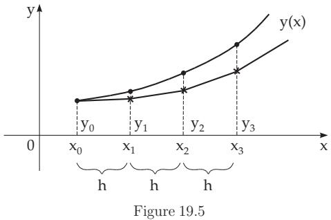

### 19.4 Approximate Integration of Ordinary Differential Equations

In many cases, the solution of an ordinary diferential equation cannot be given in closed form as an expression of known elementary functions. The solution, which still exists under rather general circumstances (see 9.1.1.1, p. 540), must be determined by numerical methods. These result only in particular solutions, but it is possible to reach high accuracy. Since diferential equations of higher order than one can be either initial value problems or boundary value problems, numerical methods were developed for both types of problems.

#### 19.4.1 Initial Value Problems

The principle of the methods presented in the following discussion to solve initial value problems

$$
y ^ { \prime } = f ( x , y ) , \quad y ( x _ { 0 } ) = y _ { 0 }\tag{19.93}
$$

is to give approximate values $y _ { i }$ for the unknown function $y ( x )$ at a chosen set of interpolation points $x _ { i }$ . Usually, equidistant interpolation nodes are considered with a previously given step size h:

$$
x _ { i } = x _ { 0 } + i h \quad ( i = 0 , 1 , 2 , . . . ) .\tag{19.94}
$$

##### 19.4.1.1 Euler Polygonal Method

An integral representation of the initial value problem (19.93) is given by integration

$$
y ( x ) = y _ { 0 } + \intop _ { x _ { 0 } } ^ { x } f ( x , y ( x ) ) d x .\tag{19.95}
$$

This is the starting point for the approximation

$$
y ( x _ { 1 } ) = y _ { 0 } + \intop _ { x _ { 0 } } ^ { x _ { 0 } + h } f ( x , y ( x ) ) d x \approx y _ { 0 } + h f ( x _ { 0 } , y _ { 0 } ) = y _ { 1 } ,\tag{19.96}
$$

which is generalized as the Euler broken line method or Euler polygonal method:

$$
y _ { i + 1 } = y _ { i } + h f ( x _ { i } , y _ { i } ) \quad ( i = 0 , 1 , 2 , \ldots ; y ( x _ { 0 } ) = y _ { 0 } ) .\tag{19.97}
$$

For a geometric interpretation see Fig. 19.5. Comparison of (19.96) with the Taylor expansion

$$
\begin{array} { l } { { y ( x _ { 1 } ) = y ( x _ { 0 } + h ) } } \\ { { \qquad = y _ { 0 } + f ( x _ { 0 } , y _ { 0 } ) h + { \frac { y ^ { \prime \prime } ( \xi ) } { 2 } } h ^ { 2 } } } \end{array}\tag{19.98}
$$

with $x _ { 0 } < \xi < x _ { 0 } + h$ shows that the approximation $y _ { 1 }$ has an error of order $h ^ { 2 }$ . The accuracy can be improved by reducing the step size h. Practical calculations show that halving the step size h results in halving the error of the approximations $y _ { i }$

A quick overview of the approximate shape of the solution curve can be got by using the Euler method.

##### 19.4.1.2 Runge-Kutta Methods

1. Calculation Scheme

The equation $y ^ { \prime } ( x ) = f ( x , y )$ determines at every point $( x _ { 0 } , y _ { 0 } )$ a direction, the direction of the tangent line of the solution curve passing through the point $( x _ { 0 } , y _ { 0 } )$ . The Euler method follows this direction until the next interpolation node. The Runge-Kutta methods consider more points “between” $( x _ { 0 } , y _ { 0 } )$

and the possible next point $( x _ { 0 } + h , y _ { 1 } )$ of the curve, and depending on the appropriate choice of these additional points more accurate values are obtained for $y _ { 1 }$ . There exist Runge-Kutta methods of diferent orders depending on the number and the arrangements of these ”auxiliary” points. Here a fourth-order method (see 19.4.1.5, 1., p. 972) is shown. (The Euler method is a first-order Runge-Kutta method.)

for the step from $x _ { 0 }$ to $x _ { 1 } ~ = ~ x _ { 0 } + h$ to get an approximate value for $y _ { 1 }$ of (19.93) is given in (19.99). The further steps follow the same scheme.

The error of this Runge-Kutta method has order $h ^ { 5 }$ (at every step) according to (19.99), so with an appropriate choice of the step size high accuracy can be obtained.

<table><tr><td>x</td><td>y</td><td> $k = h \cdot f ( x , y )$ </td></tr><tr><td> $x _ { 0 }$ </td><td>y0</td><td> $k _ { 1 }$ </td></tr><tr><td> $x _ { 0 } + h / 2$ </td><td> $y _ { 0 } + k _ { 1 } / 2$ </td><td> $k _ { 2 }$ </td></tr><tr><td> $x _ { 0 } + h / 2$ </td><td> $y _ { 0 } + k _ { 2 } / 2$ </td><td> $k _ { 3 }$ </td></tr><tr><td> $x _ { 0 } + h$ </td><td> $y _ { 0 } + k _ { 3 }$ </td><td> $k _ { 4 }$ </td></tr><tr><td> $x _ { 1 } = x _ { 0 } + h$ </td><td colspan="3"> $y _ { 1 } = y _ { 0 } + { \frac { 1 } { 6 } } ( k _ { 1 } + 2 k _ { 2 } + 2 k _ { 3 } + k _ { 4 } )$ </td></tr></table>

■ $y ^ { \prime } = \frac { 1 } { 4 } ( x ^ { 2 } + y ^ { 2 } )$ with $y ( 0 ) = 0 , \ y ( 0 . 5 )$ is determined in one step, i.e. $h = 0 . 5$ (see the table on the right). The exact value for 8 digits is 0.01041860.

(19.99)

1. For the special diferential equation $y ^ { \prime } = f ( x )$ , this Runge-Kutta method becomes the Simpson formula (see 19.3.2.3, p. 965).

2. Remarks

<table><tr><td>x</td><td>y</td><td> $k = { \frac { 1 } { 8 } } ( x ^ { 2 } + y ^ { 2 } )$ </td></tr><tr><td>0 0.25 0.25 0.5</td><td>0 0 0.00390625 0.00781441</td><td>0 0.00781250 0.00781441 0.03125763</td></tr><tr><td>0.5</td><td>0.01041858</td><td></td></tr></table>

2. For a large number of integration steps, a change of step size is possible or sometimes necessary. The change of step size can be decided by checking the accuracy so that the step is repeated with a double step size 2h. If, e.g., the approximate value is $y _ { 2 } ( h )$ for $y ( x _ { 0 } + 2 h )$ (calculated by the single step size) and $y _ { 2 } ( 2 h )$ (calculated by the doubled step size), then the estimation for the error $\breve { R } _ { 2 } ( h ) = \breve { y } ( x _ { 0 } + \dot { 2 } h ) - \breve { y } _ { 2 } ( h )$ is

$$
R _ { 2 } ( h ) \approx \frac { 1 } { 1 5 } [ y _ { 2 } ( h ) - y _ { 2 } ( 2 h ) ] .\tag{19.100}
$$

Information about the implementation of the step size changes can be found in the literature (see [19.24]).

3. Runge-Kutta methods can easily be used also for higher-order diferential equations, see [19.24]. Higher-order diferential equations can be rewritten in a first-order diferential equation system (see p. 550). Then, the approximation methods are performed as parallel calculations according to (19.99), as the diferential equations are connected to each other.

##### 19.4.1.3 Multi-Step Methods

The Euler method (19.97) and the Runge-Kutta method (19.99) are so-called single-step methods, since we start only from $y _ { i }$ in the calculation of $y _ { i + 1 }$ . In general, linear multi-step methods have the form

$$
\begin{array} { l } { y _ { i + k } + \alpha _ { k - 1 } y _ { i + k - 1 } + \alpha _ { k - 2 } y _ { i + k - 2 } + \cdot \cdot \cdot + \alpha _ { 1 } y _ { i + 1 } + \alpha _ { 0 } y _ { i } } \\ { = h ( \beta _ { k } f _ { i + k } + \beta _ { k - 1 } f _ { i + k - 1 } + \cdot \cdot \cdot + \beta _ { 1 } f _ { i + 1 } + \beta _ { 0 } f _ { i } ) } \end{array}\tag{19.101}
$$

with appropriately chosen constants $\alpha _ { j }$ and $\beta _ { j } \ ( j = 0 , 1 , \ldots , k ; \alpha _ { k } = 1 )$ . The formula (19.101) is called a k-step method if $| \alpha _ { 0 } | + | \beta _ { 0 } | \ne \mathrm { ~ \bar { ~ } { 0 } ~ }$ . It is called explicit, if $\beta _ { k } = 0$ , since in this case the values $f _ { i + j } = f ( x _ { i + j } , y _ { i + j } )$ on the right-hand side of (19.101) only contain the already known approximation values $y _ { i } , y _ { i + 1 } , \ldots , y _ { i + k - 1 } . \mathrm { ~ I f ~ } \beta _ { k } \neq 0$ holds, the method is called implicit, since then the required new value $y _ { i + k }$ occurs on both sides of (19.101).

The k initial values $y _ { 0 } , y _ { 1 } , \ldots , y _ { k - 1 }$ must be known in the application of a k-step method. These initial values can be got, e.g., by one-step methods.

A special multi-step method to solve the initial value problem (19.93) can be derived if the derivative $y ^ { \prime } ( x _ { i } )$ in (19.93) is replaced by a diference formula (see 9.1.1.5, 1., p. 549) or if the integral in (19.95) is approximated by a quadrature formula (see 19.3.1, p. 963).

Examples of special multi-step methods are:

1. Midpoint Rule The derivative $y ^ { \prime } ( x _ { i + 1 } )$ in (19.93) is replaced by the slope of the secant line between the interpolation nodes $x _ { i }$ and $x _ { i + 2 } , { \mathrm { i . e . } }$

$$
y _ { i + 2 } - y _ { i } = 2 h f _ { i + 1 } .\tag{19.102}
$$

2. Rule of Milne The integral in (19.95) is approximated by the Simpson formula:

$$
y _ { i + 2 } - y _ { i } = { \frac { h } { 3 } } ( f _ { i } + 4 f _ { i + 1 } + f _ { i + 2 } ) .\tag{19.103}
$$

3. Rule of Adams and Bashforth The integrand in (19.95) is replaced by the interpolation polynomial of Lagrange (see 19.6.1.2, p. 983) based on the k interpolation nodes $x _ { i } , x _ { i + 1 } , \dotsc , x _ { i + k - 1 }$ . Integrating between $x _ { i + k - 1 }$ and $x _ { i + k }$ results in

$$
y _ { i + k } - y _ { i + k - 1 } = \sum _ { j = 0 } ^ { k - 1 } \left[ \int _ { x _ { i + k - 1 } } ^ { x _ { i + k } } L _ { j } ( x ) d x \right] f ( x _ { i + j } , y _ { i + j } ) = h \sum _ { j = 0 } ^ { k - 1 } \beta _ { j } f ( x _ { i + j } , y _ { i + j } ) .\tag{19.104}
$$

The method (19.104) is explicit for $y _ { i + k }$ . For the calculation of the coeficients $\beta _ { j }$ see [19.2].

##### 19.4.1.4 Predictor-Corrector Method

In practice, implicit multi-step methods have a great advantage compared to explicit ones in that they allow much larger step sizes with the same accuracy. But, an implicit multi-step method usually requires the solution of a non-linear equation to get the approximation value $y _ { i + k }$ . This follows from (19.101) and has the form

$$
y _ { i + k } = h \sum _ { j = 0 } ^ { k } \beta _ { j } f _ { i + j } - \sum _ { j = 0 } ^ { k - 1 } \alpha _ { j } y _ { i + j } = F ( y _ { i + k } ) .\tag{19.105}
$$

The solution of (19.105) is an iterative one. The procedure is the following: An initial value $y _ { i + k } ^ { ( 0 ) }$ is determined by an explicit formula, the so-called predictor. Then it will be corrected by an iteration rule

$$
y _ { i + k } ^ { ( \mu + 1 ) } = F ( y _ { i + k } ^ { ( \mu ) } ) \quad ( \mu = 0 , 1 , 2 , \ldots ) ,\tag{19.106}
$$

which is called the corrector coming from the implicit method. Special predictor–corrector formulas are:

$$
\mathbf { 1 . } \quad y _ { i + 1 } ^ { ( 0 ) } = y _ { i } + { \frac { h } { 1 2 } } ( 5 f _ { i - 2 } - 1 6 f _ { i - 1 } + 2 3 f _ { i } ) ,\tag{19.107a}
$$

$$
y _ { i + 1 } ^ { ( \mu + 1 ) } = y _ { i } + { \frac { h } { 1 2 } } ( - f _ { i - 1 } + 8 f _ { i } + 5 f _ { i + 1 } ^ { ( \mu ) } ) \quad ( \mu = 0 , 1 , . . . ) ;\tag{19.107b}
$$

$$
{ \sf 2 . } \quad y _ { i + 1 } ^ { ( 0 ) } = y _ { i - 2 } + 9 y _ { i - 1 } - 9 y _ { i } + 6 h ( f _ { i - 1 } + f _ { i } ) ,\tag{19.108a}
$$

$$
y _ { i + 1 } ^ { ( \mu + 1 ) } = y _ { i - 1 } + { \frac { h } { 3 } } ( f _ { i - 1 } + 4 f _ { i } + f _ { i + 1 } ^ { ( \mu ) } ) \quad ( \mu = 0 , 1 , \ldots ) .\tag{19.108b}
$$

The Simpson formula as the corrector in (19.108b) is numerically unstable and it can be replaced, e.g., by

$$
y _ { i + 1 } ^ { ( \mu + 1 ) } = 0 . 9 y _ { i - 1 } + 0 . 1 y _ { i } + { \frac { h } { 2 4 } } ( 0 . 1 f _ { i - 2 } + 6 . 7 f _ { i - 1 } + 3 0 . 7 f _ { i } + 8 . 1 f _ { i + 1 } ^ { ( \mu ) } ) .\tag{19.109}
$$

##### 19.4.1.5 Convergence, Consistency, Stability

1. Global Discretization Error and Convergence Single-step methods can be written generally in the form:

$$
y _ { i + 1 } = y _ { i } + h F ( x _ { i } , y _ { i } , h ) \quad ( i = 0 , 1 , 2 , . . . ; y _ { 0 } { \mathrm { ~ g i v e n } } ) .\tag{19.110}
$$

Here $F ( x , y , h )$ is called the increment function or progressive direction of the single-step method. The approximating solution obtained by (19.110) depends on the step size h and it should be denoted by $y ( x , h )$ . Its diference from the exact solution $y ( x )$ of the initial value problem (19.93) is called the global discretization error $g ( x , h )$ (see (19.111)), and we say: The single-step method (19.110) is convergent with order $p$ if $p$ is the largest natural number such that

$$
g ( x , h ) = y ( x , h ) - y ( x ) = O ( h ^ { p } )\tag{19.111}
$$

holds. Formula (19.111) says that the approximation $y ( x , h )$ determined with the step size $h = { \frac { x - x _ { 0 } } { n } }$ converges to the exact solution $y ( x )$ for every x from the domain of the initial value problem if $h  0 .$ The Euler method (19.97) has order of convergence $p = 1$ . For the Runge-Kutta method (19.99) $p = 4 ~ \mathrm { h o l d s }$

2. Local Discretization Error and Consistency

The order of convergence according to (19.111) shows how well the approximating solution $y ( x , h )$ approximates the exact solution $y ( x )$ . Beside this, it is an interesting question of how well the increment function $F ( x , y , h )$ approximates the derivative $y ^ { \prime } = f ( x , y )$ . For this purpose the so-called local discretization error $l ( x , h )$ (see (19.112)) is introduced. The single-step method (19.110) is consistent with order $p ,$ if $p$ is the largest natural number with

$$
l ( x , h ) = \frac { y ( x + h ) - y ( x ) } { h } - F ( x , y , h ) = O ( h ^ { p } ) .\tag{19.112}
$$

It follows directly from (19.112) that for a consistent single-step method

$$
\operatorname* { l i m } _ { h \to 0 } F ( x , y , h ) = f ( x , y ) .\tag{19.113}
$$

The Euler method has order of consistency $p = 1$ , the Runge-Kutta method in (19.99) has order of consistency $p = 4$

3. Stability with Respect to Perturbation of the Initial Values

In the practical performance of a single-step method, a rounding error $O ( 1 / h )$ adds to the global discretization error $O ( h ^ { p } )$ . Consequently, we have to select a not too small, finite step size $h > 0$ . It is also an important question of how the numerical solution $y _ { i }$ behaves under perturbations of the initial values or in the case $x _ { i } \to \infty$

In the theory of ordinary diferential equations, an initial value problem (19.93) is called stable with respect to perturbations $o f$ its initial values if:

$$
| \tilde { y } ( x ) - y ( x ) | \leq | \tilde { y } _ { 0 } - y _ { 0 } | .\tag{19.114}
$$

Here $\tilde { y } ( x )$ is the solution of (19.93) with the perturbed initial value $\tilde { y } ( x _ { 0 } ) = \tilde { y } _ { 0 }$ instead of $y _ { 0 }$ . Estimation (19.114) tells that the absolute value of the diference of the solutions is not larger than the perturbation of the initial values.

In general, it is hard to check (19.114). Therefore the linear test problem

$$
y ^ { \prime } = \lambda y \mathrm { w i t h } y ( x _ { 0 } ) = y _ { 0 } ( \lambda \mathrm { c o n s t a n t } , \lambda \leq 0 )\tag{19.115}
$$

is considered which is stable, and a single-step method is applied to this special initial value problem. A consistent method is called absolutely stable with step size $h > 0$ with respect to perturbed initia values if the approximating solution $y _ { i }$ of the above linear test problem (19.115) obtained by using the method satisfies the condition

$$
| y _ { i } | \leq | y _ { 0 } | .\tag{19.116}
$$

Applying the Euler polygon method for equation (19.115) results in the solution $y _ { i + 1 } = ( 1 + \lambda h ) y _ { i }$ $( i = \bar { 0 , 1 , \ldots } )$ . Obviously, (19.116) holds if $| 1 + \lambda h | \le \mathrm { \dot { 1 } }$ , and so the step size must satisfy $- 2 \leq \lambda h \leq 0$

4. Stif Diferential Equations

Many application problems, including those in chemical kinetics, can be modeled by diferential equations whose solutions consist of terms converging to zero exponentially but in a high diferent kind of exponential decreasing. These equations are called stif diferential equations. For example:

$$
y ( x ) = C _ { 1 } e ^ { \lambda _ { 1 } x } + C _ { 2 } e ^ { \lambda _ { 2 } x } \quad ( C _ { 1 } , C _ { 2 } , \lambda _ { 1 } , \lambda _ { 2 } \mathrm { c o n s t } )\tag{19.117}
$$

with $\lambda _ { 1 } < 0 , \lambda _ { 2 } < 0$ and $| \lambda _ { 1 } | \ll | \lambda _ { 2 } | , \mathrm { e . g . , } \lambda _ { 1 } = - 1 , \lambda _ { 2 } = - 1 0 0 0$ . The term with $\lambda _ { 2 }$ does not have a significant afect on the solution function, but it does in selecting the step size h for a numerical method. In such cases the choice of the most appropriate numerical method has special importance (see [19.23]).

#### 19.4.2 Boundary Value Problems

The most important methods for solving boundary value problems of ordinary diferential equations will be demonstrated on the following simple linear boundary value problem for a diferential equation of the second order:

$$
y ^ { \prime \prime } ( x ) + p ( x ) y ^ { \prime } ( x ) + q ( x ) y ( x ) = f ( x ) \quad ( a \leq x \leq b ) { \mathrm { ~ w i t h ~ } } y ( a ) = \alpha , y ( b ) = \beta .\tag{19.118}
$$

The functions $p ( x ) , q ( x )$ and $f ( x )$ and also the constants α and $\beta$ are given.

The given method can also be adapted for boundary value problems of higher-order diferential equations.

##### 19.4.2.1 Difference Method

The interval $[ a , b ]$ is subdivided by equidistant interpolation points $x _ { \nu } = x _ { 0 } + \nu h \left( \nu = 0 , 1 , 2 , \dots , n ; \right.$ $x _ { 0 } = a , x _ { n } = b )$ and the values of the derivatives are substituted into the diferential equation at the interior interpolation points

$$
y ^ { \prime \prime } ( x _ { \nu } ) + p ( x _ { \nu } ) y ^ { \prime } ( x _ { \nu } ) + q ( x _ { \nu } ) y ( x _ { \nu } ) = f ( x _ { \nu } ) \quad ( \nu = 1 , 2 , \ldots , n - 1 )\tag{19.119}
$$

by so-called finite divided diferences, e.g.:

$$
\begin{array} { l } { { y ^ { \prime } ( x _ { \nu } ) \approx y _ { \nu } ^ { \prime } = \frac { y _ { \nu + 1 } - y _ { \nu - 1 } } { 2 h } , } } \\ { { y ^ { \prime \prime } ( x _ { \nu } ) \approx y _ { \nu } ^ { \prime \prime } = \frac { y _ { \nu + 1 } - 2 y _ { \nu } + y _ { \nu - 1 } } { h ^ { 2 } } . } } \end{array}\tag{19.120a}
$$

(19.120b)

In this way $n - 1$ linear equations are obtained for the $n - 1$ approximation values $y _ { \nu } \approx y ( x _ { \nu } )$ in the interior of the integration interval [a, b], considering the conditions y = α and $y _ { n } = \beta$ . If the boundary conditions also contain derivatives, they must also be replaced by finite expressions.

Eigenvalue problems of diferential equations (see 9.1.3.2, p. 569) are handled analogously. The application of the diference method, described by (19.119) and (19.120a,b), leads to a matrix eigenvalue problem (see 4.6, p. 314).

The solution of the homogeneous diferential equation $y ^ { \prime \prime } + \lambda ^ { 2 } y ~ = ~ 0$ with boundary conditions $y ( 0 ) = y ( 1 ) = 0$ leads to a matrix eigenvalue problem. The diference method transforms the differential equation into the diference equation $y _ { \nu + 1 } - 2 y _ { \nu } + y _ { \nu - 1 } + h ^ { 2 } \lambda ^ { 2 } y _ { \nu } = 0$ . If three interior points are chosen, hence $h = 1 / 4$ , then considering $y _ { 0 } = y ( 0 ) = 0 , y _ { 4 } = y ( 1 ) = 0$ the discrete system is

$$
\begin{array} { r l r } { \left( - 2 + \displaystyle \frac { \lambda ^ { 2 } } { 1 6 } \right) y _ { 1 } + } & { } & { y _ { 2 } } \\ { y _ { 1 } + \left( - 2 + \displaystyle \frac { \lambda ^ { 2 } } { 1 6 } \right) y _ { 2 } + } & { } & { y _ { 3 } = 0 , } \\ { y _ { 2 } + \left( - 2 + \displaystyle \frac { \lambda ^ { 2 } } { 1 6 } \right) y _ { 3 } = 0 . } \end{array}
$$

This homogeneous system of equations has a non-trivial solution only when the coeficient determinant

is zero. This condition results in the eigenvalues ${ \lambda _ { 1 } } ^ { 2 } = 9 . 3 7 , { \lambda _ { 2 } } ^ { 2 } = 3 2$ and ${ \lambda _ { 3 } } ^ { 2 } = 5 4 . 6 3$ . Among them only the smallest one is close to its corresponding true value 9.87.

Remark: The accuracy of the diference method can be improved by

1. decreasing the step size $h ,$

2. application of a derivative approximation of higher order (approximations as (19.120a,b) have an error of order $O ( h ^ { 2 } ) )$ ,

3. application of multi-step methods (see 19.4.1.3, p. 970).

If the problem is a non-linear boundary value problem, then the diference method leads to a system of non-linear equations of the unknown approximation values $y _ { \nu }$ (see 19.2.2, p. 961).

##### 19.4.2.2 Approximation by Using Given Functions

The approximate solution of the boundary value problem (19.118) is a linear combination of suitably chosen functions $g _ { i } ( x )$ , which are linearly independent and each one satisfies the boundary value conditions:

$$
y ( x ) \approx g ( x ) = \sum _ { i = 1 } ^ { n } a _ { i } g _ { i } ( x ) .\tag{19.121}
$$

Substituting $g ( x )$ into the diferential equation (19.118) results in an error, the so-called defect

$$
\varepsilon ( x ; a _ { 1 } , a _ { 2 } , \ldots , a _ { n } ) = g ^ { \prime \prime } ( x ) + p ( x ) g ^ { \prime } ( x ) + q ( x ) g ( x ) - f ( x ) .\tag{19.122}
$$

To determine the coeficients $a _ { i }$ the following principles (see also p. 978) can be used:

1. Collocation Method The defect has to be zero at n given points $x _ { \nu } ,$ the so-called collocation points. The conditions

$$
\varepsilon ( x _ { \nu } ; a _ { 1 } , a _ { 2 } , \ldots , a _ { n } ) = 0 \quad ( \nu = 1 , 2 , \ldots , n ) , \quad a < x _ { 1 } < x _ { 2 } < \ldots < x _ { n } < b\tag{19.123}
$$

result in a linear system of equations for the unknown coeficients.

2. Least Squares Method The integral

$$
F ( a _ { 1 } , a _ { 2 } , \ldots , a _ { n } ) = \int _ { a } ^ { b } { \varepsilon } ^ { 2 } ( x ; a _ { 1 } , a _ { 2 } , \ldots , a _ { n } ) d x ,\tag{19.124}
$$

depending on the coeficients, should be minimal. The necessary conditions

$$
\frac { \partial F } { \partial a _ { i } } = 0 \quad ( i = 1 , 2 , \ldots , n )\tag{19.125}
$$

give a linear system of equations for the coeficients $a _ { i }$

3. Galerkin Method The requirement is that the so-called error orthogonality is satisfied, i.e.,

$$
\int _ { a } ^ { b } \varepsilon ( x ; a _ { 1 } , a _ { 2 } , \ldots , a _ { n } ) g _ { i } ( x ) d x = 0 \quad ( i = 1 , 2 , \ldots , n ) ,\tag{19.126}
$$

and in this way a linear system of equations is obtained for the unknown coeficients.

4. Ritz Method The solution $y ( x )$ often has the property that it minimizes the variational integral,

$$
I [ y ] = \int _ { a } ^ { b } H ( x , y , y ^ { \prime } ) d x\tag{19.127}
$$

(see (10.4), p. 610). If the function $H ( x , y , y ^ { \prime } )$ is known, then $y ( x )$ is replaced by the approximation $g ( x )$ as in (19.121) and $I [ y ] = I ( a _ { 1 } , a _ { 2 } , . . . , a _ { n } )$ is minimized. The necessary conditions

$$
\frac { \partial I } { \partial a _ { i } } = 0 \quad ( i = 1 , 2 , \ldots , n )\tag{19.128}
$$

result in n equation for the coeficients $a _ { i }$

Under certain conditions on the functions $p , q ,$ f and $y ,$ the boundary value problem

$$
- [ p ( x ) y ^ { \prime } ( x ) ] ^ { \prime } + q ( x ) y ( x ) = f ( x ) \ { \mathrm { ~ w i t h ~ } } \ y ( a ) = \alpha , \ y ( b ) = \beta\tag{19.129}
$$

and the variational problem

$$
I [ y ] = \int _ { a } ^ { b } [ p ( x ) y ^ { \prime 2 } ( x ) + q ( x ) y ^ { 2 } ( x ) - 2 f ( x ) y ( x ) ] d x = \mathrm { m i n ! } \mathrm { w i t h } y ( a ) = \alpha , y ( b ) = \beta\tag{19.130}
$$

are equivalent, so $H ( x , y , y ^ { \prime } )$ can be got immediately from (19.130) for the boundary value problem of the form (19.129).

Instead of the approximation (19.121), one often considers

$$
g ( x ) = g _ { 0 } ( x ) + \sum _ { i = 1 } ^ { n } a _ { i } g _ { i } ( x ) ,\tag{19.131}
$$

where $g _ { 0 } ( x )$ satisfies the boundary values and the functions $g _ { i } ( x )$ satisfy the conditions

$$
g _ { i } ( a ) = g _ { i } ( b ) = 0 \quad ( i = 1 , 2 , \ldots , n ) .\tag{19.132}
$$

For the problem (19.118), an appropriate choice is, e.g.,

$$
g _ { 0 } ( x ) = \alpha + \frac { \beta - \alpha } { b - a } ( x - a ) .\tag{19.133}
$$

Remark: In a linear boundary value problem, the forms (19.121) and (19.131) result in a linear system of equations for the coeficients. In the case of non-linear boundary value problems non-linear systems of equations are obtained, which can be solved by the methods given in Section 19.2.2, p. 961.

##### 19.4.2.3 Shooting Method

With the shooting method, the solution of a boundary value problem is reduced to the solution of an initial value problem. The basic idea of the method is described below as the single-target method.

1. Single-Target Method

The initial value problem

$$
y ^ { \prime \prime } + p ( x ) y ^ { \prime } + q ( x ) y = f ( x ) { \mathrm { ~ w i t h ~ } } y ( a ) = \alpha , y ^ { \prime } ( a ) = s\tag{19.134}
$$

is associated to the boundary value problem (19.118). Here s is a parameter, from which the solution y of the initial-value problem (19.134) depends on, $\mathrm { i . e . , } y = y ( x , s )$ holds. The function $y ( x , s )$ satisfies the first boundary condition $y ( a , s ) = c$ α according to (19.134). The parameter s should be determined so that $y ( x , s )$ satisfies the second boundary condition $y ( b , s ) = \beta$ . Therefore, one has to solve the equation

$$
F ( s ) = y ( b , s ) - \beta ,\tag{19.135}
$$

and the regula falsi (or secant) method is an appropriate method to do this. It needs only the values of the function $F ( s )$ , but the computation of every function value requires the solution of an initial value problem (19.134) until $x = b$ for the special parameter value s with one of the methods given in 19.4.1.

2. Multiple-Target Method

In a so-called multiple-target method, the integration interval $[ a , b ]$ is divided into subintervals, and we use the single-target method on every subinterval. Then, the required solution is composed from the solutions of the subintervals, where the continuous transition at the endpoints of the subintervals must be ensured.

This requirement results in further conditions. For the numerical implementation of the multiple-target method, which is used mostly for non-linear boundary value problems, see. [19.24].
