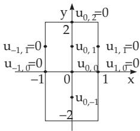

#### 19.5.1 Difference Method

A regular grid is considered on the integration domain by the chosen points $( x _ { \mu } , y _ { \nu } )$ . Usually, this grid is chosen to be rectangular and equally spaced:

$$
x _ { \mu } = x _ { 0 } + \mu h , y _ { \nu } = y _ { 0 } + \nu l \quad ( \mu , \nu = 1 , 2 , . . . ) .\tag{19.136}
$$

It results in squares for $l = h$ . If the required solution is denoted by $u ( x , y )$ , then the partial derivatives occurring in the diferential equation and in the boundary or initial conditions are replaced by finite divided diferences in the following way, where $u _ { \mu \nu }$ denotes an approximate value for the function value $u ( x _ { \mu } , y _ { \nu } )$

<table><tr><td>Partial Derivative</td><td>Finite Divided Difference</td><td>Order of Error</td></tr><tr><td> ${ \frac { \partial u } { \partial x } } ( x _ { \mu } , y _ { \nu } )$ </td><td> $\frac { 1 } { h } ( u _ { \mu + 1 , \nu } - u _ { \mu , \nu } ) \mathrm { o r } \frac { 1 } { 2 h } ( u _ { \mu + 1 , \nu } - u _ { \mu - 1 , \nu } )$ </td><td> ${ \cal O } ( h ) \ \mathrm { o r } \ { \cal O } ( h ^ { 2 } )$ </td></tr><tr><td> ${ \frac { \partial u } { \partial y } } ( x _ { \mu } , y _ { \nu } )$ </td><td> $\frac { 1 } { l } ( u _ { \mu , \nu + 1 } - u _ { \mu , \nu } ) \mathrm { o r } \frac { 1 } { 2 l } ( u _ { \mu , \nu + 1 } - u _ { \mu , \nu - 1 } )$ </td><td> $O ( l ) \ \mathrm { o r } \ O ( l ^ { 2 } )$ </td></tr><tr><td> ${ \frac { \partial ^ { 2 } u } { \partial x \partial y } } ( x _ { \mu } , y _ { \nu } )$   $\frac { \partial ^ { 2 } u } { \partial x ^ { 2 } } ( x _ { \mu } , y _ { \nu } )$ </td><td> $\frac { 1 } { 4 h l } ( u _ { \mu + 1 , \nu + 1 } - u _ { \mu + 1 , \nu - 1 } - u _ { \mu - 1 , \nu + 1 } + u _ { \mu - 1 , \nu - 1 } )$ </td><td>O(hl)</td></tr></table>

(19.137)

The error order in (19.137) is given by using the Landau symbol O.

In some cases, it is more practical to apply the approximation

$$
\frac { \partial ^ { 2 } u } { \partial x ^ { 2 } } ( x _ { \mu } , y _ { \nu } ) \approx \sigma \frac { u _ { \mu + 1 , \nu + 1 } - 2 u _ { \mu , \nu + 1 } + u _ { \mu - 1 , \nu + 1 } } { h ^ { 2 } } + ( 1 - \sigma ) \frac { u _ { \mu + 1 , \nu } - 2 u _ { \mu , \nu } + u _ { \mu - 1 , \nu } } { h ^ { 2 } }\tag{19.138}
$$

with a fixed parameter σ $( 0 \leq \sigma \leq 1 )$ . Formula (19.138) represents a convex linear combination of two finite expressions obtained from the corresponding formula (19.137) for the values $y = y _ { \nu }$ and $y = y _ { \nu + 1 }$ A partial diferential equation can be rewritten as a diference equation at every interior point of the grid by the formulas (19.137), where the boundary and initial conditions are considered, as well. This system of equations for the approximation values $u _ { \mu , \nu }$ has a large dimension for small step sizes h and l, so usually, it is solved by an iteration method (see 19.2.1.4, p. 960).

  
Figure 19.6

A: The function $u ( x , y )$ should be the solution of the diferential equation $\Delta u = u _ { x x } + u _ { y y } = - 1$ for the points $( x , y )$ with $| x | < 1 , | y | < 2$ $\mathrm { i . e . , }$ in the interior of a rectangle, and it should satisfy the boundary conditions $u = 0$ for $| x | = 1$ and $| y | = 2$ . The diference equation corresponding to the diferential equation for a square grid with step size h is: $4 u _ { \mu , \nu } = u _ { \mu + 1 , \nu } + u _ { \mu , \nu + 1 } + u _ { \mu - 1 , \nu } + u _ { \mu , \nu - 1 } + h ^ { 2 }$ . The step size $h = 1$ (Fig. 19.6) results in a first rough approximation for the function values at the three interior points: $4 u _ { 0 , 1 } = 0 + 0 + 0 + u _ { 0 , 0 } + 1 , ~ 4 u _ { 0 , 0 } =$ $0 + u _ { 0 , 1 } + 0 + u _ { 0 , - 1 } + 1 , \ 4 u _ { 0 , - 1 } = 0 + u _ { 0 , 0 } + 0 + 0 + 1 .$ The solution is $u _ { 0 , 0 } = { \frac { 3 } { 7 } } \approx 0 . 4 2 9 , u _ { 0 , 1 } = u _ { 0 , - 1 } = { \frac { 5 } { 1 4 } } \approx 0 . 3 5 7 .$

B: The system of equations arising in the application of the diference method for partial diferential equations has a very special structure. It is demonstrated by the following example which is a more general boundary value problem. The integration domain is the square $\bar { G \colon 0 } \leq \bar { x } \leq 1 , 0 \leq y \leq 1$ $\mathrm { \bar { A } }$ function $u ( x , \dot { y } )$ should be determined for which $\Delta u = u _ { x x } + u _ { y y } = f ( x , y )$ in the interior of $G ,$ $u ( x , y ) = g ( x , y )$ on the boundary of $G .$ The functions $f$ and $g$ are given. The diference equation associated to this diferential equation is, for $h = l = 1 / n \colon$

$$
u _ { \mu + 1 , \nu } + u _ { \mu , \nu + 1 } + u _ { \mu - 1 , \nu } + u _ { \mu , \nu - 1 } - 4 u _ { \mu , \nu } = { \frac { 1 } { n ^ { 2 } } } f ( x _ { \mu } , y _ { \nu } ) \quad ( \mu , \nu = 1 , 2 , \ldots , n - 1 ) .
$$

In the case of $n = 5 .$ the left-hand side of this system of diference equations for the approximation values $u _ { \mu , \nu }$ in the 4 4 interior points has the form (19.139)

$$
\{ \begin{array} { l l } { [ \begin{array} { l l l l } { 4 } & { 1 } & { 0 } & { 0 } \\ { 1 } & { - 4 } & { 1 } & { 0 } \\ { 0 } & { 0 } & { 1 } & { 4 } \end{array} ] [ \begin{array} { l l l l } { 1 } & { 0 } & { 0 } & { 0 } \\ { 0 } & { 1 } & { 0 } & { 0 } \\ { 1 } & { 0 } & { 1 } & { 0 } \\ { 0 } & { 0 } & { 1 } & { - 4 } \end{array} ] } & { 0 } \\ { [ \begin{array} { l l l l } { 0 } & { 0 } & { 1 } & { - 4 } \\ { 1 } & { 0 } & { 0 } & { 0 } \\ { 0 } & { 1 } & { 0 } & { 0 } \\ { 0 } & { 0 } & { 1 } & { 0 } \\ { 0 } & { 0 } & { 1 } & { 0 } \end{array} ] [ \begin{array} { l l l l } { 0 } & { 0 } & { 0 } & { 1 } \\ { - 4 } & { 1 } & { 0 } & { 0 } \\ { 0 } & { 1 } & { 0 } & { 0 } \\ { 1 } & { 0 } & { 0 } & { 1 } \end{array} ] } & { 0 } \\  [ \begin{array} { l l l l } { 0 } & { 0 } & { 0 } & { 0 } \\ { 0 } & { 1 } & { 0 } & { 0 } \\ { 0 } & { 0 } & { 1 } & { 1 } \end{array} ] [ \begin{array} { l l l l } { 1 } & { 0 } & { 0 } & { 0 } \\ { - 4 } & { 1 } & { 0 } \\ { 0 } & { 0 } & { 1 } & { 0 } \\ { 0 } & { 0 } & { 1 } & { 0 } \\ { 1 } & { 0 } & { 0 } & { 0 } \\ { 0 } & { 1 } & { 0 } & { 0 } \end{array} ] [ \begin{array} { l l l l } { 1 } & { 0 } & { 0 } & { 0 } \\ { 0 } & { 1 } & { 0 } & { 0 } \\ { 0 } & { 0 } & { 0 } & { 1 } \\ { 1 } & { 0 } & { 0 } & { 0 } \\  \end{array} \end{array}\tag{19.139}
$$

if the grid is considered row-wise from left to right, and considering that the values of the function are given on the boundary. The coeficient matrix is symmetric and is a sparse matrix. This form is called block-tridiagonal. It is obvious that the form of the matrix depends on how the grid-points are selected. For diferent classes of partial diferential equations of second order, such as elliptic, parabolic and hyperbolic diferential equations, more efective methods have been developed, and also the convergence and stability conditions have been investigated. There is a huge number of books about this topic (see, e.g., [19.22], [19.24]).
