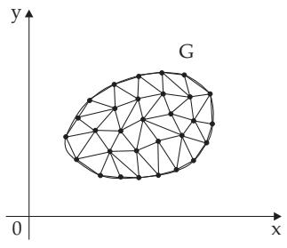
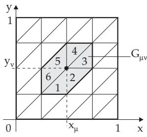
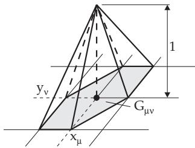
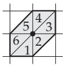

#### 19.5.3 Finite Element Method (FEM)

After the appearance of modern computers the finite element methods became the most important technique for solving partial diferential equations. These powerful methods give results which are easy to interpret.

Depending on the types of various applications, the FEM is implemented in very diferent ways, so here only the basic idea is given. It is similar to those used in the Ritz method (see 19.4.2.2, p. 974) for numerical solution of boundary value problems for ordinary diferential equations and is related to spline approximations (see 19.7, p. 996).

The finite element method has the following steps:

1. Defining a Variational Problem A variational problem is formulated to the given boundary value problem. The process is demonstrated on the following boundary value problem:

$\Delta u = u _ { x x } + u _ { y y } = f$ in the interior of $G , \ u = 0$ on the boundary of $G .$

(19.144)

The diferential equation in (19.144) is multiplied by an appropriate smooth function $v ( x , y )$ vanishing on the boundary of $G _ { \ast }$ , and it is integrated over the entire $G$ to get

$$
\iint { \left( { \frac { \partial ^ { 2 } u } { \partial x ^ { 2 } } } + { \frac { \partial ^ { 2 } u } { \partial y ^ { 2 } } } \right) v d x d y } = \iint _ { ( G ) } f v d x d y .\tag{19.145}
$$

Applying the Gauss integral formula (see 13.3.3.1, 2., p. 725), where $P ( x , y ) = - v u _ { y }$ and $Q ( x , y ) = v u _ { x }$ are substituted in (13.121), the variational equation from (19.145)

$$
a ( u , v ) = b ( v )\tag{19.146a}
$$

is obtained with

$$
a ( u , v ) = - \iint _ { ( G ) } \left( \frac { \partial u } { \partial x } \frac { \partial v } { \partial x } + \frac { \partial u } { \partial y } \frac { \partial v } { \partial y } \right) d x d y , \quad b ( v ) = \iint _ { ( G ) } f v d x d y .\tag{19.146b}
$$

  
Figure 19.7

  
Figure 19.8

2. Triangularization The domain of integration G is decomposed into simple subdomains. Usually, a triangularization is used, where G is covered by triangles so that the neighboring triangles have a complete side or only a single vertex in common. Every domain bounded by curves can be approximated quite well by a union of triangles (Fig. 19.7).

Remark: To avoid numerical dificulties, the triangularization should not contain obtuse-angled triangles.

A triangularization of the unit square could be performed as shown in Fig. 19.8. Here one starts from the grid points with coordinates $x _ { \mu } = \mu h , y _ { \nu } = \nu h ( \mu , \nu = 0 , 1 , 2 , \ldots , \bar { N } ; h = 1 / N )$ . There are $( N - 1 ) ^ { 2 }$ interior points. Considering the choice of the solution functions, it is always useful to consider the surface elements $G _ { \mu \nu }$ composed of the six triangles having the common point $( x _ { \mu } , y _ { \nu } )$ . (In other cases, the number of triangles may difer from six. These surface elements are obviously not mutually exclusive.)

3. Solution A supposed approximating solution is defined for the required function $u ( x , y )$ in every triangle. A triangle with the corresponding supposed solution is called a finite element. Polynomials in x and y are the most suitable choices. In many cases, the linear approximation

$$
\tilde { u } ( x , y ) = a _ { 1 } + a _ { 2 } x + a _ { 3 } y\tag{19.147}
$$

is suficient. The supposed approximating function must be continuous under the transition from one triangle to neighboring ones, so a continuous final solution arises.

The coeficients $a _ { 1 } , \ a _ { 2 }$ and $a _ { 3 }$ in (19.147) are uniquely defined by the values of the functions $u _ { 1 }$ , u2 and $u _ { 3 }$ at the three vertices of the triangle. The continuous transition to the neighboring triangles is

ensured by this at the same time. The supposed solution (19.147) contains the approximating values $u _ { i }$ of the required function as unknown parameters. For the supposed solution, which is applied as an approximation in the entire domain G for the required solution $u ( x , y )$

$$
\tilde { u } ( x , y ) = \sum _ { \mu = 1 } ^ { N - 1 } \sum _ { \nu = 1 } ^ { N - 1 } \alpha _ { \mu \nu } u _ { \mu \nu } ( x , y ) .\tag{19.148}
$$

is chosen. The appropriate coeficients $\alpha _ { \mu \nu }$ are determined. The following must be valid for the functions $u _ { \mu \nu } ( x , y )$ : They represent a linear function over every triangle of $G _ { \mu \nu }$ according to (19.147) with the following conditions:

$$
\mathbf { 1 . } \quad u _ { \mu \nu } ( x _ { k } , y _ { l } ) = \left\{ { \begin{array} { l l } { 1 } & { { \mathrm { f o r ~ } } k = \mu , l = \nu , } \\ { 0 } & { { \mathrm { a t ~ a n y ~ o t h e r ~ g r i d ~ p o i n t ~ o f ~ } } G _ { \mu \nu } . } \end{array} } \right.\tag{19.149a}
$$

$$
{ \bf 2 . } \quad u _ { \mu \nu } ( x , y ) \equiv 0 \quad \mathrm { f o r } ( x , y ) \notin G _ { \mu \nu } .\tag{19.149b}
$$

  
Figure 19.9

The representation of $u _ { \mu \nu } ( x , y )$ over $G _ { \mu \nu }$ is shown in Fig. 19.9.

The calculation of $u _ { \mu \nu }$ over $G _ { \mu \nu } , \mathrm { i . e . }$ , over all triangles 1 to 6 in Fig. 19.8 is shown here only for triangle 1:

$$
u _ { \mu \nu } ( x , y ) = a _ { 1 } + a _ { 2 } x + a _ { 3 } \mathrm { { \ w i t h } }\tag{19.150}
$$

$$
u _ { \mu \nu } ( x , y ) = \left\{ \begin{array} { l l } { { 1 \mathrm { f o r } x = x _ { \mu } , y = y _ { \nu } , } } \\ { { 0 \mathrm { f o r } x = x _ { \mu - 1 } , y = y _ { \nu - 1 } , } } \\ { { 0 \mathrm { f o r } x = x _ { \mu } , y = y _ { \nu - 1 } . } } \end{array} \right.\tag{19.151}
$$

From (19.151) $a _ { 1 } = 1 - \nu , a _ { 2 } = 0 , a _ { 3 } = 1 / h$ , follow and so for triangle 1

$$
u _ { \mu \nu } ( x , y ) = 1 + \left( \frac { y } { h } - \nu \right) .\tag{19.152}
$$

Analogously, there is:

$$
u _ { \mu \nu } ( x , y ) = \left\{ \begin{array} { l l } { { 1 - \left( \frac { x } { h } - \mu \right) + \left( \frac { y } { h } - \nu \right) } } & { { \mathrm { f o r ~ t r i a n g l e ~ 2 , } } } \\ { { 1 - \left( \frac { x } { h } - \mu \right) } } & { { \mathrm { f o r ~ t r i a n g l e ~ 3 , } } } \\ { { 1 - \left( \frac { y } { h } - \nu \right) } } & { { \mathrm { f o r ~ t r i a n g l e ~ 4 , } } } \\ { { 1 + \left( \frac { x } { h } - \mu \right) + \left( \frac { y } { h } - \nu \right) } } & { { \mathrm { f o r ~ t r i a n g l e ~ 5 , } } } \\ { { 1 + \left( \frac { x } { h } - \mu \right) } } & { { \mathrm { f o r ~ t r i a n g l e ~ 6 . } } } \end{array} \right.\tag{19.153}
$$

4. Calculation of the Solution Coeficients The solution coeficients $\alpha _ { \mu \nu }$ are determined by the requirements that the solution (19.148) satisfies the variational problem (19.146a) for every solution function $u _ { \mu \nu } , \mathrm { i . e . , } \tilde { u } ( x , y )$ is substituted for $u ( x , y )$ and $u _ { \mu \nu } ( x , y )$ for $v ( x , y )$ in (19.146a). In this way, a linear system of equations

$$
\sum _ { \mu = 1 } ^ { N - 1 } \sum _ { \nu = 1 } ^ { N - 1 } \alpha _ { \mu \nu } a ( u _ { \mu \nu } , u _ { k l } ) = b ( u _ { k l } ) \quad ( k , l = 1 , 2 , \ldots , N - 1 )\tag{19.154}
$$

is obtained for the unknown coeficients, where

$$
a ( u _ { \mu \nu } , u _ { k l } ) = \iint \left( \frac { \partial u _ { \mu \nu } } { \partial x } \frac { \partial u _ { k l } } { \partial x } + \frac { \partial u _ { \mu \nu } } { \partial y } \frac { \partial u _ { k l } } { \partial y } \right) d x d y , \quad b ( u _ { k l } ) = \iint \int f u _ { k l } d x d y .\tag{19.155}
$$

In the calculation of $a ( u _ { \mu \nu } , u _ { k l } )$ the fact must be kept in mind that integration is needed only in the cases of domains $G _ { \mu \nu }$ and $G _ { k l }$ with non-empty intersection. These domains are denoted by shadowing in Table 19.1.

Table 19.1 Auxiliary table for FEM
<table><tr><td rowspan=1 colspan=1>Surfaceregion</td><td rowspan=1 colspan=4>Graphicalrepresentation</td><td rowspan=1 colspan=1>Triangle of $G _ { k l } \ G _ { \mu \nu }$ </td><td rowspan=1 colspan=1> $\partial { u _ { k l } }$  $\partial x$ </td><td rowspan=1 colspan=1> $\partial u _ { \mu \nu }$  $\scriptstyle \partial x$ </td><td rowspan=1 colspan=1> $\Sigma \frac { \partial u _ { k l } } { \partial x } \frac { \partial u _ { \mu \nu } } { \partial x }$ </td></tr><tr><td rowspan=1 colspan=1>1. $\begin{array} { c } { \mu = k } \\ { \nu = l } \end{array}$ </td><td rowspan=1 colspan=4></td><td rowspan=1 colspan=1>112 23 34 45 56 6</td><td rowspan=1 colspan=1>0 $\begin{array} { c } { { - 1 / h } } \\ { { - 1 / h } } \end{array}$ 01/h1/h</td><td rowspan=1 colspan=1>0 $\begin{array} { c } { { - 1 / h } } \\ { { - 1 / h } } \end{array}$ 0 $1 / h$  $1 / h$ </td><td rowspan=1 colspan=1> $\frac { 4 } { h ^ { 2 } }$ </td></tr><tr><td rowspan=1 colspan=1>2. $\begin{array} { l } { \mu = k } \\ { \nu = l - 1 } \end{array}$ </td><td rowspan=1 colspan=1></td><td rowspan=1 colspan=1></td><td rowspan=1 colspan=1></td><td rowspan=1 colspan=1>1524</td><td rowspan=1 colspan=1> $\begin{array} { r } { 0 } \\ { - 1 / h } \end{array}$ </td><td rowspan=1 colspan=1> $\mathbf { \Sigma } _ { 0 } ^ { 1 / h }$ </td><td rowspan=1 colspan=1>0</td></tr><tr><td rowspan=1 colspan=1>3. $\begin{array} { l } { \mu = k + 1 } \\ { \nu = l } \end{array}$ </td><td rowspan=1 colspan=1></td><td rowspan=1 colspan=1><img src="data:image/jpg;base64,/9j/4AAQSkZJRgABAQAAAQABAAD/2wBDAAIBAQEBAQIBAQECAgICAgQDAgICAgUEBAMEBgUGBgYFBgYGBwkIBgcJBwYGCAsICQoKCgoKBggLDAsKDAkKCgr/2wBDAQICAgICAgUDAwUKBwYHCgoKCgoKCgoKCgoKCgoKCgoKCgoKCgoKCgoKCgoKCgoKCgoKCgoKCgoKCgoKCgoKCgr/wAARCABnAG4DASIAAhEBAxEB/8QAHwAAAQUBAQEBAQEAAAAAAAAAAAECAwQFBgcICQoL/8QAtRAAAgEDAwIEAwUFBAQAAAF9AQIDAAQRBRIhMUEGE1FhByJxFDKBkaEII0KxwRVS0fAkM2JyggkKFhcYGRolJicoKSo0NTY3ODk6Q0RFRkdISUpTVFVWV1hZWmNkZWZnaGlqc3R1dnd4eXqDhIWGh4iJipKTlJWWl5iZmqKjpKWmp6ipqrKztLW2t7i5usLDxMXGx8jJytLT1NXW19jZ2uHi4+Tl5ufo6erx8vP09fb3+Pn6/8QAHwEAAwEBAQEBAQEBAQAAAAAAAAECAwQFBgcICQoL/8QAtREAAgECBAQDBAcFBAQAAQJ3AAECAxEEBSExBhJBUQdhcRMiMoEIFEKRobHBCSMzUvAVYnLRChYkNOEl8RcYGRomJygpKjU2Nzg5OkNERUZHSElKU1RVVldYWVpjZGVmZ2hpanN0dXZ3eHl6goOEhYaHiImKkpOUlZaXmJmaoqOkpaanqKmqsrO0tba3uLm6wsPExcbHyMnK0tPU1dbX2Nna4uPk5ebn6Onq8vP09fb3+Pn6/9oADAMBAAIRAxEAPwD9/KK4n40eIP2idBsrCT9nv4U+DvFNxJK41OLxf48utCS3QAbGja30y+MpJ3AhljwADls4HAf8LF/4KV/9Gh/BP/xIPVv/AJlaAE/4Jn/8mP8AgX/rhff+nC5r3aviP/gnv48/4KCWf7Hvgy28GfsufCLUNMWG8+y3mpfHLU7SeQfbbgtuiTw1MqYbIGJGyADxnA9n/wCFi/8ABSv/AKND+Cf/AIkHq3/zK0Da1PdaK8K/4WL/AMFK/wDo0P4J/wDiQerf/MrR/wALF/4KV/8ARofwT/8AEg9W/wDmVoCxv/t4f8mO/Gb/ALJR4i/9NlxXbfCb/klfhn/sX7L/ANEJX5t/8FYP+Cp/7VfwY8C6/wDsXX37Knw31fx98QvAWrxyaV4J+Leo63c6DpTWU32jU7y3k0KzWOFIRKw3TqTsLYKqa6/4f+L/APg5SXwHoi6B8LP2RmsRpFsLJrq41/zTD5S7C+LrG7bjOOM0DtoforRXwD/wmP8Awc0f9Ep/Y/8A/AnxB/8AJVH/AAmP/BzR/wBEp/Y//wDAnxB/8lUCsff1eE/8FIP+TXP+6leBf/Ut0ivnf/hMf+Dmj/olP7H/AP4E+IP/AJKr5J/4KI/8FHv+Cxnwtew+Av7Rnw4/Zz1G3/4TPwxPr5+H6a3I+kXSapb3+n291cTXLRwPO9nnywkkvkh32KGRyDS1P20orwr/AIWL/wAFK/8Ao0P4J/8AiQerf/MrXpPwc1r44674auLv4/fDjwt4Y1hb5ktbDwl4yuNctpLbYhWVp7jT7FkkLmRTGImACq28liqhJ1lFFFAHhP8AwTP/AOTH/Av/AFwvv/Thc17tXhP/AATP/wCTH/Av/XC+/wDThc17tQN7hXyN/wAFLP8AgpJqv7Ml7ov7LH7K/g9PH37Q/wAQ18jwR4Lt8PHp0bZB1S/OQIraMKzDcV3+WxJVEkdZ/wDgpZ/wUlm/ZNXRP2dP2cvBo8f/ALQPxEzbfD7wFaHeIN24HUr7BHk2se1m+Yrv8tvmVEkkjm/4Jqf8E2of2PbLWvjr8d/GX/Cf/Hv4ht9q+I/xDvRvYs2G+wWeQPJtI8KoChd/lqSqqkUcYC7nl/gX/gm3pX7Ff7APx++LHxb8YP4++OXxB+FniK8+JfxI1DLy3MzabOxs7UsAYrSMgBVAXfsUlVCxxx/bnwm/5JX4Z/7F+y/9EJXE/t4f8mO/Gb/slHiL/wBNlxXbfCb/AJJX4Z/7F+y/9EJQD1Ogoor5+/af/ac8Znxk/wCyx+yzcWs/xCubSObxH4jubcT2PgawlB23dyv3ZryRQfs1mTlyPNk2wqS4Ib+07+0340ufGkv7Kv7K93bSeP5rWObxR4ouLcT2PgWwlHy3M6H5Zr6Rcm2syfmx5suIl/efCf8AwWU+DXgv4F/sK+AvBXguK5kEnx68P3mq6rqVyZ77Vr6WSdp727nb5p7iVvmZz7AAKqqPuH4L/B3wR8DfB/8AwhPgxrieSS6kvda1bU7o3F/q99Kd017dzH5pp5G5ZzxgBVCqqqPkn/gvz/yaV4F/7Lj4a/8AQp6q1kJO8kfqJRRRUjCiiigDwn/gmf8A8mP+Bf8Arhff+nC5riv+Clf/AAUktv2OtO0X4IfA3wafH/x5+IbG0+G/w7sfndnbK/b7zaR5VpGQzEkrv8tgGVUkkj8Rg/4KR6P+xR+wB8LPhb8KfB7+Pfjf8QEvrL4Z/DbT8vNdztqF0ou7kKQYrSMglmJXfsZQVCySR+v/APBNT/gm5rH7NOo61+1Z+1d4wTx7+0P8Ql87xr4xnw8elxNgjS9PGAIreMBVJULv2KAFRERQrzJ/+Caf/BNq5/ZSbW/2kf2k/GQ8f/tBfET/AEjx/wCPLobxbBtpGm2OQPJtY9qL8oXf5a/KqJHHH9Z0UUEnlP7eH/Jjvxm/7JR4i/8ATZcV23wm/wCSV+Gf+xfsv/RCV5p/wUe8deCfh/8AsG/F/VvHnjHStEtbr4b65ZW1zq+oR20c1zNp86QwK0jANI7kKqD5mJAAJrznV/21ovG3w38I/A79h7xhoHinxlrPhOynv/F1jcx6ho/g7T2iCfb7lomKT3DFHW3sw26V0LPtiR2oH0Oy/ag/ae8Y2/jA/st/suy2lz8Rbu0SfXteuoPPsPA+ny523t0ucS3UgDfZrPIMpHmPthRi3MeG/wBnfSvhz8ENa+FHwt8UX+narrdtdyX3jO/kN1qV5qlwhEmqXMuVae4LENnKgbVVQqKqjY+C3wX8IfAzwe3hbwvJeXlxd3cl9r2vatP59/rWoS4M17dzEAyzOQMnhVUKiBURVEvxt8beKPht8KNd+IHg3wVdeI9R0awa8h0KxiZ7i+WMhpIoVUEvKUDBFHVto71aViG77H55/GX4A/sGfCL9qv4M+DP2LfipoXhj4xaf8R4Y/F2sDxu7XF9p0Ib+0LbUXmnIubmVtiLAcys0h+UIGI9R/wCC/P8AyaV4F/7Lj4a/9Cnq9+3U/hb/AIKYfsx2fwH/AGevB2vXeu6z4j0y6h1nXPB1/pkfhQQ3CSz3c0t3BGI5ljEiCJCZHZ8AFdzDK/4Ly2T6d+xv8PNPkunnaD41eF42mkPzSFTMNx9zjNLoyluj9S6KKKkDifjT4d/aH8Q2NhH+z78WvCXhO4ilc6lN4s8B3OupcIQNixrBqViYiDkklpM5AwuMnzbWPAf/AAUo0rSLrVB+2D8HH+zWzy7P+GftTG7apOM/8JQcdK9/rO8X/wDIpap/2Dp//RbUAfkV/wAEDP2Jf2hfGPwIsv8AgpR4L/aG8AR+NviML+zNz44+Et5rd1otna39xam1tJ4dctEihkMHmELCp+YKWIXn9EP+Faf8FJ/+jxvg3/4j5qf/AM1FeGf8G2n/AChu+FH/AF9eIP8A0+39fdNBUnqeE/8ACtP+Ck//AEeN8G//ABHzU/8A5qKP+Faf8FJ/+jxvg3/4j5qf/wA1Fe7V4n+0L+0F43k8bR/st/suQ2WofEvUrJLnU9UvYTNp3grTZCVGpX4UjfI21xbWYIe4dSSUiSWRAR+Mn/Bzv4a/bP13xx4N0T4kfGPRfiPovg7Qpb3X7T4eeAb3SrXwvLdShYZtSje+vlR7hIyIXeVMrBIAg5Z93/g3L+An7f2hfBnx1408D+ONI8CeDfEGp2Muix+OfAV1q0eqTpHKJrm0jj1GyMSbWhRpf3iylVUYMLV+rPxu/Z98Efs5f8E4/jT4R8Jz3uoXt/8ADTxLqHiXxLrEwm1HX9Rk0ufzr67lwPMlfAAAASNFSONUjREXg/in8Kfiv8a/gl4B+HXw6+LOt+CdNvBZP4w17wvepbamunJZM3k2szIxieSbyVMigMq7sGmtwlL3bD/+Fef8FCP+jsfhN/4YrUf/AJpKP+Fef8FCP+jsfhN/4YrUf/mkrwv9n7SPjd+yp/wU1j/ZH0b9ofxz8Sfh34j+GU3iS7t/iFrTatf+G7qO58lCt24D+VKcgI3fP93Nfb1UiHoeK/8ACvP+ChH/AEdj8Jv/AAxWo/8AzSV+dn7efxj/AGr/ANtn4qWX7H3w8+KHgnx54U+HvxF8OXfxH+I/hr4aXWm6f4b1KbVItPtLXzJdYuVvn827+eGPy2+RgH+SUp9LfH79oj46/wDBSL45ap/wTw/4JyeJ30vRNKkEHxt+ONqC1t4ft2JV9PsHUgS3jgOmUYEEMFKhZJI/oL4xfsgfAn9hv/gnTpP7Pv7PfhFNL0TTPiP4FeeeTD3WpXTeLNHEl3cyYBlmcgZbgABVUKiqoTZUVbVnp/8AwrT/AIKT/wDR43wb/wDEfNT/APmor0n4OaH8cPD/AIZuLP4+fEvwz4p1dr5nttQ8K+DZ9Et47bYgWJoJ7+9Z3DiRjIJFBDquwFSzdbRUgFZ3i/8A5FLVP+wdP/6LatGs7xf/AMilqn/YOn/9FtQB8T/8G2n/AChu+FH/AF9eIP8A0</td><td rowspan=1 colspan=1>+39fdNfC3/Btp/yhu+FH/X14g/9Pt/X0B+0R+0N4ztPGNv+zH+zJZWWq/E/V7Jbm5ur6My6d4P012K/2rqIUgnJVhBagrJcyIQCkaTSxg3uJ+0N+0J41j8aQ/sv/swWtlqfxN1WyW5vr++iMuneDNNclRqmoBSNzEq4t7QFXuZEPKRJLLH137PX7Pfgr9nLwRJ4W8MXV7qWo6levqPijxRrEol1HX9SkAEt7dygDfI21VCgBI0VI41SNEQJ+zx+zz4M/Zz8FzeHPDt7e6rquq3raj4r8V6zIJdR8Qak4AkvLqQABnIVVVFCxxRokcapGiqO9oEeUft4/wDJjnxm/wCyUeIv/TZcV85ftJftvfB79hX9lbw58Sfilr1pDd6jplnY+G9Mubgxm/vGgTAJAYpEgO+STadiA4BYqp+jf28f+THPjN/2SjxF/wCmy4rl/hlFFJ8NPDhkjVtuhWmNwzj9ylNCdtD5G/Yb/bp/4J6a/wDFBvDPh79rHS/HXxl+Jl6r63qFpoOoRrdyxRs0dlbGSAJBaQRh1jRmH8TMS7sTm/HX4/fHP/gpz8btV/4J9f8ABO7xVJo/hPSJfs/xt+OdoC1vpMBJD6bpzqQJrpwGUsp7MAVVXkEfxs+N3xs/4KpfG3Vf2CP+CffiiTRvAmiTfZvjZ8dLNN0NlCch9L0yQECW4cBlLKeecEIGdv0J/ZV/ZU+B/wCxd8EdH/Z+/Z88GxaN4e0eL5VGGnvJyB5lzcSYBlmcjLOfYABVVQNjslqRfslfslfAz9iT4HaR+z7+z34Pj0jQdJjyzNhri/uGA8y6uZMAyzOQCzHjACqFVVUcn/wUg/5Nc/7qV4F/9S3SK92rwn/gpB/ya5/3UrwL/wCpbpFIa3PdqKKKBBWd4v8A+RS1T/sHT/8Aotq5r40/B/W/i7Y2Fnovx28beBmspXeSfwXc2UT3YYABZftVrcAhcZG0Kck5Jrzq8/Yi8aX1pLZXP7f/AMdmjmjZJF/tXQ+VIwR/yCfSgZ8Vf8EPv2h/GGmf8Enfg/8Asz/s06dZax8Udbj1+6eW+RpNO8Jaa2v6gn9ralsIOzKusFsCsl1IhVSqJNLF+iP7O/7O/g/9nTwdcaDoeoXusazq962o+LfFususmo+INRdQJLu5cAAsQqqkahY4o0SONURFUfmt/wAE/P8Ag39/Z/8AEH7MGg/EPwv+2d+0h4Om8RNc3Gpab4K+Itrp1m8sdzLAr+WlgSW2RrksSfwwB7X/AMQ+3wv/AOklX7YH/h5If/kCgbtc+/aK+Av+Ifb4X/8ASSr9sD/w8kP/AMgUf8Q+3wv/AOklX7YH/h5If/kCgVkfU37eX/Jjnxm/7JR4i/8ATZcV+der/GL46f8ABVzxHb/sEfsH+J7rw98NvD+mWll8cfjfaodka+Sok0jTG4EszgMrOp5GeRGCZOu/ax/4IR/DLwB+yz8S/HkX/BQn9qzV20TwBrOoLpWufFmG4sr0w2M0ghuIvsQ8yF9u10yNykjIzmvoD9kv/gmH4e+AX7PXhf4efBL9rv4w+FdCj0qG5TStGvNCji86aNXkkOdKLO7MSS7FmPcmgdke+/sv/svfBP8AY5+CmjfAD9n7wXBonhzRYdsMKfNLcynHmXE8nWWZyMs55PQYAAHoFeE/8MWeO/8ApIF8d/8Awa6H/wDKmj/hizx3/wBJAvjv/wCDXQ//AJU0CPdq8J/4KQf8muf91K8C/wDqW6RR/wAMWeO/+kgXx3/8Guh//KmvGP2+v2SPGfh39nL+07r9t/4z6qn/AAsDwbD9j1PUtGaLMvifS4xJiPTEbfGXEic4Dou4MuVICtc+3aK8J/4Ys8d/9JAvjv8A+DXQ/wD5U16T8HPhfq3wm8M3Hh3WfjF4t8bSz3zXK6p4yuLSS5iUoi+ShtbeBPLBQsAVLbnb5iMAAHW0UUUCPCf+CaAI/Yg8Cg/88L7/ANL7mvdqKKBvcKKKKBHlP7eHP7Dvxm/7JT4i/wDTZcV23wm/5JX4Z/7F+y/9EJRRQPodBRRRQIK8J/4KQAn9l3A/6KV4F/8AUt0iiiga3PdqKKKBH//Z"/></td><td rowspan=1 colspan=1></td><td rowspan=1 colspan=1> $_ { \mathrm { ~ 3 ~ 5 ~ } } ^ { \mathrm { ~ 2 ~ 6 ~ } }$ </td><td rowspan=1 colspan=1> $\begin{array} { c } { { - 1 / h } } \\ { { - 1 / h } } \end{array}$ </td><td rowspan=1 colspan=1> $\mathbf { \Pi } _ { 1 / h } ^ { 1 / h }$ </td><td rowspan=1 colspan=1> $- { \frac { 2 } { h ^ { 2 } } }$ </td></tr><tr><td rowspan=1 colspan=1>4. $\begin{array} { c } { { \mu = k + 1 } } \\ { { \nu = l + 1 } } \end{array}$ </td><td rowspan=1 colspan=1></td><td rowspan=1 colspan=1></td><td rowspan=1 colspan=1></td><td rowspan=1 colspan=1>3 146</td><td rowspan=1 colspan=1> $^ { - 1 / h } _ { 0 }$ </td><td rowspan=1 colspan=1>01/h</td><td rowspan=1 colspan=1>0</td></tr><tr><td rowspan=1 colspan=1>5. $\begin{array} { l } { \mu = k } \\ { \nu = l + 1 } \end{array}$ </td><td rowspan=1 colspan=1></td><td rowspan=1 colspan=1></td><td rowspan=1 colspan=1></td><td rowspan=1 colspan=1>4251</td><td rowspan=1 colspan=1> $\begin{array} { r } { 0 } \\ { - 1 / h } \end{array}$ </td><td rowspan=1 colspan=1> $\mathbf { \Sigma } _ { 0 } ^ { 1 / h }$ </td><td rowspan=1 colspan=1>0</td></tr><tr><td rowspan=1 colspan=1>6. $\begin{array} { l } { \mu = k - 1 } \\ { \nu = l } \end{array}$ </td><td rowspan=1 colspan=1></td><td rowspan=1 colspan=1><img src="data:image/jpg;base64,/9j/4AAQSkZJRgABAQAAAQABAAD/2wBDAAIBAQEBAQIBAQECAgICAgQDAgICAgUEBAMEBgUGBgYFBgYGBwkIBgcJBwYGCAsICQoKCgoKBggLDAsKDAkKCgr/2wBDAQICAgICAgUDAwUKBwYHCgoKCgoKCgoKCgoKCgoKCgoKCgoKCgoKCgoKCgoKCgoKCgoKCgoKCgoKCgoKCgoKCgr/wAARCABgAG4DASIAAhEBAxEB/8QAHwAAAQUBAQEBAQEAAAAAAAAAAAECAwQFBgcICQoL/8QAtRAAAgEDAwIEAwUFBAQAAAF9AQIDAAQRBRIhMUEGE1FhByJxFDKBkaEII0KxwRVS0fAkM2JyggkKFhcYGRolJicoKSo0NTY3ODk6Q0RFRkdISUpTVFVWV1hZWmNkZWZnaGlqc3R1dnd4eXqDhIWGh4iJipKTlJWWl5iZmqKjpKWmp6ipqrKztLW2t7i5usLDxMXGx8jJytLT1NXW19jZ2uHi4+Tl5ufo6erx8vP09fb3+Pn6/8QAHwEAAwEBAQEBAQEBAQAAAAAAAAECAwQFBgcICQoL/8QAtREAAgECBAQDBAcFBAQAAQJ3AAECAxEEBSExBhJBUQdhcRMiMoEIFEKRobHBCSMzUvAVYnLRChYkNOEl8RcYGRomJygpKjU2Nzg5OkNERUZHSElKU1RVVldYWVpjZGVmZ2hpanN0dXZ3eHl6goOEhYaHiImKkpOUlZaXmJmaoqOkpaanqKmqsrO0tba3uLm6wsPExcbHyMnK0tPU1dbX2Nna4uPk5ebn6Onq8vP09fb3+Pn6/9oADAMBAAIRAxEAPwD9/KK4n40fAXwj8drGwsPFnirxtpSadK8kL+C/iDq3h95CwAIlfTbmBpgMDCuWCnJAGTXn/wDw7z+DX/RXfjt/4kf4x/8AlnQGgf8ABM//AJMf8C/9cL7/ANOFzXu1fEf/AAT3/YX+FHi79j3wZ4i1H4o/Ga3muYbwvDpfx88VWcC4vbhRshg1FI04AJ2qMnJPJJr2b/h3n8Gv+iu/Hb/xI/xj/wDLOgbtc92orwn/AId5/Br/AKK78dv/ABI/xj/8s6ju/wDgn98ELC1lv7/4zfHKCCCNpJppv2kvGCpGgGSzE6pgAAZJNAaHSft4f8mO/Gb/ALJR4i/9NlxXbfCb/klfhn/sX7L/ANEJX4mftdnxB/wUGk+Jfhf9hX4x/Fux+AHwu8MavN4/+IviP4x+JNYtfG99bWkkw0qxt76+kgltsou+Uocg78hTGs31z8P/APg2o/4JY694D0TXdR8BeMWuL3SLaedl8dXigu8SsxADcck8UD0P0aor8/P+IZL/AIJSf9E/8Z/+F7e//FUf8QyX/BKT/on/AIz/APC9vf8A4qgWh+gdeE/8FIP+TXP+6leBf/Ut0ivmfXf+Da//AIJFeF9EvPEviXwv4p0/TtPtZLm/v734iXcUNtCilnkkdnCoiqCSxIAAJNfnl+39/wAEvP2cvhZ8J/DH7Yv7NHgjxN4P8AXnxP0LQfB51vX72TU/FEFxK7yauVlcNY2pESi2UATSBjOxRTGhBpK5/Q3RXhP/AA7z+DX/AEV347f+JH+Mf/lnXpPwc+DXhn4H+Gbjwp4V8R+LdTt7m+a7efxl421LXrlXZEQqlxqM80qR4jBEasEDFmC5ZiQnQ62iiigDwn/gmf8A8mP+Bf8Arhff+nC5r3avCf8Agmf/AMmP+Bf+uF9/6cLmvdZJEiRpZXCqoJZmOAB6mgb3EnnhtoXubmZY441LSSOwCqoGSST0Ar8t/wBpf9o34n/8Fpfi3q37Gv7Ifi6+0D9nTwzf/ZPjB8WtMba/iyVcF9G0t+jQkf6yUZVlO45jKJcy/tVftO/FL/gsT8XNZ/Yb/Yq8Y3ehfAfw5efZPjV8Y9LbB19h9/RNKk6OjDiSUZV1OTmLatzH8CP+Chfwt+CHwk0f4Wfs2/8ABLT9pL/hDdER7PQ5vDXw5triyuESRkadZlvSZi7hmaRss7EsxJJppA7r1PePjv8ACH4bfAT/AIJ2fEP4QfCHwjaaF4c0H4Ta7baZplkmEiQafOSSTy7sSWZ2JZmYsxJJNfWPwm/5JX4Z/wCxfsv/AEQlfNf7YN82p/sRfFLUmsp7Y3Hwq1uU21ym2SLdpsx2OOzDOCPUV9KfCb/klfhn/sX7L/0QlORKOgqtrWtaP4c0e78Q+IdVtrDT7C2kuL6+vJ1iht4UUs8juxCoqqCSxIAAJNLq2raVoGlXWu67qdvZWNlbvPeXl3MscUESKWeR3YgKqqCSxIAAJNfNWk6XrH/BRzW7bxj4u065sfgBp10lx4d8P3kLRTfEaeNg0d/eRsAV0hWAeC2YZuyFmlHkiNJJGLomj6z/AMFGNdtPHXjXS7mw+Aem3aXXhjw1fQNFN8Q542DRalfRsAy6UrAPb2rgG5IWaUeWI428W/4OQwF/Yl8BqoAA+PPhjAH+9cV+giqqKERQABgADgCvz8/4ORP+TJ/An/ZevDH/AKFcUDW6P0EooooEFFIWVfvMB9TSeZH/AM9F/OgDwv8A4JoEL+w94FZiABb32Sf+v+5r44/a5/ar+K//AAVr+MGs/sBfsJ+M7nRPg7oNz9j+OPxq0xuNRH/LTRNLk6SbxlZJRkMCf+WXFx5B4B/aR+Pf/BRL4N6B/wAEzP2LtcvfC/gTQoLiL48/GK3GNsE13PJ/Y2nN0eSSNwHcdQSOIw3mfoN+z1+z/wDCD9lr4RaP8D/gj4Vt9G8PaJb+Xa20Ry8rnl5pX6ySu2WZzyxNNK4SfKTfAr4D/Cv9mn4TaR8E/gp4RttE8O6Ha+TYWVuOp6tJIx5kkdiWd2yzMSSea+MfjJ4Z/wCCnX7An7Jn/C6vBv7QPgDXdL+HNo13rHw0i8EMtvdaaspaUrqLzee84Ri5ISJScgLwA33T438PJ4z8G6r4RGt3WnHU9OmtVv7C4Mc9sZEKiWNlIKupO4EEcivE9Q/Z2/aS+Nfw3PwS/aq+MPg/U/CtxFHb+IP+ES8OXNpe+ILdCpMU0k11Ilssu0CURoxYMwVo85qmSma/7Qnjm2+J/wDwTp8cfEuysZLaHxF8FdT1OK2lPzRLPpEkoQ+4D4P0r6j+HWqaZofwZ0LWta1GCzs7Pwxaz3d3dTLHFBElsrM7sxAVQASSTgAEmvzn/wCCz/8AwUZ+C37DH7N158B7rwxPq/iT4ieEdR0jQdD02ZIIrC0e3a2N1K5B2RqZAEQKS5RgNoUsNj/gnJ+2V4U/4LieFF8L6/pq+Fvh/wDC6y0qLxj8Mn1A3Nz4p1BkYwNeTCNEbSkMDEW4G64lQiYLEgjmTKina59E6bp2rf8ABSDWYPE/iWxuLL9n3T7pJ9D0W6iaKX4kzxsGS9ukbBXR1YBoYGAN4QJZB5ARJfp1ESJBHGgVVGFVRgAelNi+zwxrDDsREUKiLgBQOgA7U7zI/wDnov51IC1+ff8Awcif8mT+BP8AsvXhj/0K4r9A/Mj/AOei/nX59f8AByJJGf2J/AYDjJ+PXhjHP+1cUDW5+g1FJ5kf/PRfzoDKwypB+lAji/jN+zb+zx+0bZWGm/tB/Ajwd45t9LleXTIPF/hq11JLR3ADtGtxG4QsFUErjIAz0rzHxT/wTF/4JuW/hjUbi3/YA+CySR2EzI6fC/SgVIQkEEW/Br6DrO8X/wDIpap/2Dp//RbUBdn5J/8ABDj9i39jv4uf8Ex/h58Qvix+yr8OPE2u3txrIvdb8QeCrG8u5xHq15Gm+aWJnbaiqoyeFUAcCvWvh38AP2Bvjn46nsPgN/wTT+D2ueDdK1KWx1rx/qHg7S7OylniYpLFp6LZyvfNG4Ks5EUOQQsrEED50/Y/+JHjD4Sf8Gxt74+8A3EsGrWfhjxIlpcwHDwebrd3C0insVWRmB7YzXc+MNS/bK/4J4/sM/DH9oPwH8cdB1Xwn4Z0/wAP2viD4WxeDbeKzmsLowwsbe8y10bgNKGLl9rszNsUfJVA03Jn1d/w7i/4J7/9GL/B/wD8Ntpn/wAYqK9/4J3/APBOrTLKbUdR/Yi+Ddvb28TSTzz/AA60pEjRRlmZjBgAAEkngAV7ReXlpp9pLf391HBBBG0k00zhUjRRksxPAAAJJPSvHfAngXUv+CiuqxeIvEVtPafACxuA9jZSq0cnxKmRsiWQHBXRVYZVTzfEBj/owAuW7IlXZ+fH/BQb/gkH4N/bk+C3iD9sr9jX4Y+BvhJ4I+Hfhi+vNFkg8ODT1+INtAj3E99HFaxgQQKsZS2mdGa63s3yQiGR/qD/AIJB/wDBv5+zr+y58D7zxH+1z4E8A/Fzxb4zSzvMa34Tg1Cw0O2WJmSC1+2RFi7GVmkl2pu2xrt/d7m+1P26beC1/YW+MdrawpHFH8JvEKRxxqAqKNMuAAAOgA7V3Pwm/wCSV+Gf+xfsv/RCVBpd2seV/wDDr/8A4Jr/APSPv4Kf+Gu0n/5Ho/4df/8ABNf/AKR9/BT/AMNdpP8A8j17pXDftIftI/Bn9kr4Na18e/j541ttB8M6FbebeXlwctIx4SGJB80srthUjXLMTgUCuzw/9of9kb/gjr+yr8H9a+O/x4/Yx+BWgeGdAtTNf3918L9Jyx6JFGgt90srthUjUFmYgAV+bFz/AME/NA/bStbT/gpZ45/ZG8F/Bj</td><td rowspan=1 colspan=1>4S2PjXwrYfCL4TaF4JsNPufEOn3viPTbSbU9Z8mJfNSaCZ/LhOVIYFcRjfc/U/7PX7OPxp/wCCyHxi0X9u/wDb68GXXh74KaBdfbfgf8CtS6aiP+WetavH0lLrgpEcqynH+qybj6x/4KOokf7LIjjQKq/EjwKFVRgAf8JbpHFA72ZJ/wAOv/8Agmv/ANI+/gp/4a7Sf/kevSPg98Bvgf8As8+Gp/BnwD+DvhbwRpF1fNe3OleEtAt9Ot5rlkSNpmjt0RWkKRxqWIyQijOAK6yigm7Cs7xf/wAilqn/AGDp/wD0W1aNZ3i//kUtU/7B0/8A6LagD8yP+CGngHwj8VP+CL/gn4a+PtFi1LRNet/EVjqthPnbPBLq98jqccjIJ5HI6ivZNM/YP0Cy8E+Gfhl8Vfjn4h8U/D7wHd217oXhrXIbONP9D+a1F9cxxK91HBtUqDsBMamTzMV5h/wb9XEFr/wSS+Gt1dTJHFHNrzySSMAqKNZviSSegA717b4M8Gaj/wAFF9VGo6ik9p+z/Y3HC8xyfEqZG6DoV0VWHJ63xGB/owP2mtLCd+dh4I8Eal/wUW1ZNa1qGa0/Z/sbjdb27AxyfEqZG4ZuhXRVYcD/AJfiP+fYf6T9h21tbWVtHZ2dukUMSBIookCqigYCgDgADjFJaWlpYWsVhYW0cEEEaxwwwoFSNAMBVA4AAGABUlTuM8p/bw/5Md+M3/ZKPEX/AKbLiu2+E3/JK/DP/Yv2X/ohK4n9vD/kx34zf9ko8Rf+my4qn8S/2pPgj+xr+x/ZftAftBeM4dE8OaL4ZsjJK/zTXUxgXy7aCPOZZnIwqDryThQSAZ0v7TX7TXwV/ZA+C+s/H74/+NbfQvDeiQb7i4lOZJ5D9y3hjHMszn5VReSfQAkfC/7OH7M3xr/4K9fGbRf2/f8AgoV4MuNB+EuhXP2z4GfAbUeUmQ/6vWdWjPEruuGSJhhgRx5XE0n7M37Lfxu/4KxfGnRv+ChX/BRjwZPofw20Sf7X8C/gLqGWijiPMesarGRiWZxhljYYIxkCMBZP0hAAGAKA2EVVVQqqAAMAAdK8K/4KQf8AJrn/AHUrwL/6lukV7tXhP/BSD/k1z/upXgX/ANS3SKAW57tRRRQI4n40/tJfAP8AZysbDUvjx8XtA8JW+qSvFp02vailuty6AFlQuRuIDAn615f4p/4Kc/8ABPS48MajbwftlfDx3ksJlRF8SwZYlCAPvV9DUUBofzuf8ExP+CmP7E/hr9kfwR+yJ+2Z8X77wp4G8IvqFx4o8P2Hh+/vLjxpPcalc3UdpLJbRMsOmpHLH5se7zLl8xMEhVxcfpRZf8HKf/BHDTbOHTtO+Pmp29vbxLHBBB8P9VRI0UYVVUW2AAAAAOABX0F/wTQtrdv2IPApaBCfIvuSo/5/7mvdvstt/wA+8f8A3wKCm1c+DP8AiJh/4I+f9HEax/4QWrf/ACPR/wARMP8AwR8/6OI1j/wgtW/+R6+8/stt/wA+8f8A3wKPstt/z7x/98CgWh+Zf7Wf/BxR/wAEpPid+yv8S/hr4I+O2r3uteIfh/rOmaRZnwTqcfn3U9jNFEm+SBVXLuo3MQBnJIFeOfsjfFz9nf8Ab++K3hv9tL/gqH+038P9E8LeCYoovgv8Ar7xPA0GnCNVUarqkZbEty+wMI3HpuCqqx1+oH7d9tbj9h74ykQICPhT4iwQo/6BlxXdfCb/AJJX4Z/7F+y/9EJQO6SPKP8Ah5//AME7/wDo874d/wDhTQf/ABVH/Dz/AP4J3/8AR53w7/8ACmg/+Kr3eigWh4R/w8//AOCd/wD0ed8O/wDwpoP/AIqvGP2+v+Civ7CfjT9nL+wvCf7WfgTUbz/hYHg25+zWniGF38mDxPpc8z4B+6kUcjseyoT2r7erwn/gpB/ya5/3UrwL/wCpbpFAK1xP+Hn/APwTv/6PO+Hf/hTQf/FV6V8G/jz8GP2hvDNx4z+BvxO0XxXpNrftZXOoaFfJcRR3CokjRFlJAYJJG2PRx611tFAtD//Z"/></td><td rowspan=1 colspan=1></td><td rowspan=1 colspan=1>5 36 2</td><td rowspan=1 colspan=1> $\mathbf { \Pi } _ { 1 / h } ^ { 1 / h }$ </td><td rowspan=1 colspan=1> $\begin{array} { c } { { - 1 / h } } \\ { { - 1 / h } } \end{array}$ </td><td rowspan=1 colspan=1> $- { \frac { 2 } { h ^ { 2 } } }$ </td></tr><tr><td rowspan=1 colspan=1>7. $\begin{array} { l } { \mu = k - 1 } \\ { \nu = l - 1 } \end{array}$ </td><td rowspan=1 colspan=1></td><td rowspan=1 colspan=1></td><td rowspan=1 colspan=1></td><td rowspan=1 colspan=1>6 41 3</td><td rowspan=1 colspan=1> $^ { 1 / h } _ { 0 }$ </td><td rowspan=1 colspan=1> $- 1 / h$ </td><td rowspan=1 colspan=1>0</td></tr></table>

The integration is always performed over a triangle with an area $h ^ { 2 } / 2 ,$ so for the partial derivatives with respect to x :

$$
\frac { 1 } { h ^ { 2 } } \left( 4 \alpha _ { k l } - 2 \alpha _ { k + 1 , l } - 2 \alpha _ { k - 1 , l } \right) \frac { h ^ { 2 } } { 2 }\tag{19.156a}
$$

is obtained. Analogously, for the partial derivatives with respect to y the corresponding term is

$$
\frac { 1 } { h ^ { 2 } } \left( 4 \alpha _ { k l } - 2 \alpha _ { k , l + 1 } - 2 \alpha _ { k , l - 1 } \right) \frac { h ^ { 2 } } { 2 } .\tag{19.156b}
$$

The calculation of the right-hand side $b ( u _ { k l } )$ of (19.154) gives:

$$
b ( u _ { k l } ) = \iint f ( x , y ) u _ { k l } ( x , y ) d x d y \approx f _ { k l } V _ { P } ,\tag{19.157a}
$$

where $V _ { P }$ is the volume of the pyramid over $G _ { k l }$ with height 1, determined by $u _ { k l } ( x , y )$ (Fig. 19.9). Since

$$
V _ { P } = { \frac { 1 } { 3 } } \cdot 6 \cdot { \frac { 1 } { 2 } } h ^ { 2 } , \quad { \mathrm { t h e ~ a p p r o x i m a t i o n ~ i s } } \quad b ( u _ { k l } ) \approx f _ { k l } h ^ { 2 } .\tag{19.157b}
$$

So, the variational equations (19.154) result in the linear system of equations

$$
4 \alpha _ { k l } - \alpha _ { k + 1 , l } - \alpha _ { k - 1 , l } - \alpha _ { k , l + 1 } - \alpha _ { k , l - 1 } = h ^ { 2 } f _ { k l } \quad ( k , l = 1 , 2 , \ldots , N - 1 )\tag{19.158}
$$

for the determination of the solution coeficients.

Remarks:

1. If the solution coeficients are determined by (19.158), then $\tilde { u } ( x , y )$ from (19.148) represents an explicit approximating solution, whose values can be calculated for an arbitrary point $( x , y )$ from G.

2. If the integration domain must be covered by an irregular triangular grid then it is useful to introduce triangular coordinates (also called barycentric coordinates). In this way, the position of a point can be easily determined with respect to the triangular grid, and the calculation of the multidimensional integral is made easier as in (19.155), because every triangle can be easily transformed into the unit triangle with vertices (0, 0), (0, 1), (1, 0).

3. If accuracy must be improved or also the diferentiability of the solution is required, then piecewise quadratic or cubic functions must be applied to obtain the supposed approximation (see, e.g., [19.22]).

4. In practical applications, usually systems of huge dimensions are obtained. This is the reason why so many special methods have been developed, $\mathrm { e . g . }$ , for automatic triangularization and for practical enumeration of the elements (the structure of the system of equations depends on it). For detailed discussion of FEM see [19.13], [19.7], [19.22].
