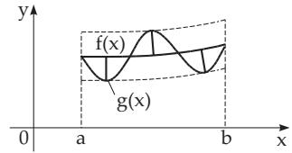
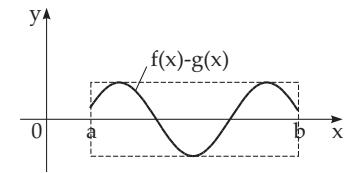
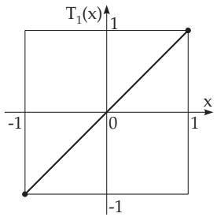
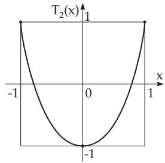
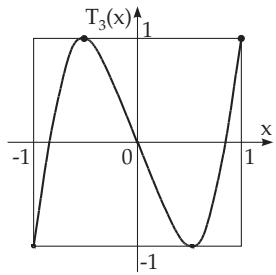
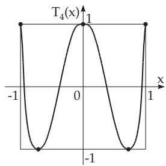
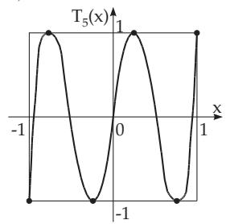
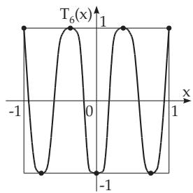

#### 19.6.3 Chebyshev Approximation

##### 19.6.3.1 Problem Definition and the Alternating Point Theorem

1. Principle of Chebyshev Approximation

Chebyshev approximation or uniform approximation in the continuous case is the following: The function $f ( x )$ has to be approximated in an interval $a \leq x \leq b$ by the approximation function $g ( x ) =$ $g ( x ; a _ { 0 } , a _ { 1 } , \ldots , a _ { n } )$ so that the error defined by

$$
\operatorname* { m a x } _ { a \leq x \leq b } | f ( x ) - g ( x ; a _ { 0 } , a _ { 1 } , \ldots , a _ { n } ) | = \varPhi ( a _ { 0 } , a _ { 1 } , \ldots , a _ { n } )\tag{19.195}
$$

should be as small as possible for the appropriate choice of the unknown parameters $a _ { i } \ ( i = 0 , 1 , \ldots , n )$ If there exists such an approximating function for $f ( x )$ , then the maximum of the absolute error value will be taken at least at $n { \ + 2 }$ points $x _ { \nu }$ of the interval, at the so-called alternating points, with changing signs (Fig. 19.10). This is actually the meaning of the alternating point theorem for the characterization of the solution of a Chebyshev approximation problem.

  
a)

  
b)  
Figure 19.10

If the function $f ( x ) = x ^ { n }$ is approximated on the interval $[ - 1 , 1 ]$ by a polynomial of degree $\leq n - 1$ in the Chebyshev sense, then the Chebyshev polynomial $T _ { n } ( { \dot { x } } )$ is obtained as an error function whose maximum is normed to one. The alternating points, being at the endpoints and at exactly $n - 1$ points in the interior of the interval, correspond to the extreme points of $T _ { n } ( x )$ (Fig. 19.11a–f).

a)  

b)  
c)  
  
d)  
e)  
Figure 19.11

  
f)

##### 19.6.3.2 Properties of the Chebyshev Polynomials

1. Representation

$$
T _ { n } ( x ) = \cos ( n \operatorname { a r c c o s } x ) ,\tag{19.196a}
$$

$$
T _ { n } ( x ) = { \frac { 1 } { 2 } } \left[ \left( x + { \sqrt { x ^ { 2 } - 1 } } \right) ^ { n } + \left( x - { \sqrt { x ^ { 2 } - 1 } } \right) ^ { n } \right] ,\tag{19.196b}
$$

$$
T _ { n } ( x ) = { \left\{ \begin{array} { l l } { \cos n t , x = \cos t } & { { \mathrm { f o r ~ } } | x | < 1 , } \\ { \cosh n t , x = \cosh t } & { { \mathrm { f o r ~ } } | x | > 1 } \end{array} \right. } \quad ( n = 1 , 2 , \ldots ) .\tag{19.196c}
$$

2. Roots of ${ \cal T } _ { n } ( x )$

$$
x _ { \mu } = \cos \frac { ( 2 \mu - 1 ) \pi } { 2 n } \quad ( \mu = 1 , 2 , \ldots , n ) .\tag{19.197}
$$

3. Position of the extreme values of ${ \cal T } _ { n } ( x )$ for $x \in [ - 1 , 1 ]$

$$
x _ { \nu } = \cos \frac { \nu \pi } { n } \quad ( \nu = 0 , 1 , 2 , \ldots , n ) .\tag{19.198}
$$

4. Recursion Formula

$$
T _ { n + 1 } = 2 x T _ { n } ( x ) - T _ { n - 1 } ( x ) \quad ( n = 1 , 2 , \ldots ; T _ { 0 } ( x ) = 1 , T _ { 1 } ( x ) = x ) .\tag{19.199}
$$

This recursion results in e.g.

$$
T _ { 2 } ( x ) = 2 x ^ { 2 } - 1 , \quad T _ { 3 } ( x ) = 4 x ^ { 3 } - 3 x ,\tag{19.200a}
$$

$$
T _ { 4 } ( x ) = 8 x ^ { 4 } - 8 x ^ { 2 } + 1 , \quad T _ { 5 } ( x ) = 1 6 x ^ { 5 } - 2 0 x ^ { 3 } + 5 x ,
$$

$$
T _ { 6 } ( x ) = 3 2 x ^ { 6 } - 4 8 x ^ { 4 } + 1 8 x ^ { 2 } - 1 ,\tag{19.200b}
$$

(19.200c)

$$
T _ { 7 } ( x ) = 6 4 x ^ { 7 } - 1 1 2 x ^ { 5 } + 5 6 x ^ { 3 } - 7 x ,\tag{19.200d}
$$

$$
T _ { 8 } ( x ) = 1 2 8 x ^ { 8 } - 2 5 6 x ^ { 6 } + 1 6 0 x ^ { 4 } - 3 2 x ^ { 2 } + 1 ,\tag{19.200e}
$$

$$
T _ { 9 } ( x ) = 2 5 6 x ^ { 9 } - 5 7 6 x ^ { 7 } + 4 3 2 x ^ { 5 } - 1 2 0 x ^ { 3 } + 9 x ,\tag{19.200f}
$$

$$
T _ { 1 0 } ( x ) = 5 1 2 x ^ { 1 0 } - 1 2 8 0 x ^ { 8 } + 1 1 2 0 x ^ { 6 } - 4 0 0 x ^ { 4 } + 5 0 x ^ { 2 } - 1 .\tag{19.200g}
$$

##### 19.6.3.3 Remes Algorithm

1. Consequences of the Alternating Point Theorem

The numerical solution of the continuous Chebyshev approximation problem originates from the alternating point theorem. The approximating function is chosen as

$$
g ( x ) = \sum _ { i = 0 } ^ { n } a _ { i } g _ { i } ( x )\tag{19.201}
$$

with $n + 1$ linearly independent known functions, and the coeficients of the solution of the Chebyshev problem are denoted by ${ a _ { i } } ^ { * } ( i = 0 , 1 , \ldots , n )$ and the minimal deviation according to (19.195) by $\varrho =$ $\varPhi ( { a _ { 0 } } ^ { * } , { a _ { 1 } } ^ { * } , \ldots , { a _ { n } } ^ { * } )$ . In the case when the functions $f$ and $g _ { i } \ ( i = 0 , 1 , \ldots , n )$ are diferentiable, from the alternating point theorem one has

$$
\sum _ { i = 0 } ^ { n } a _ { i } { ^ { * } g _ { i } } ( x _ { \nu } ) + ( - 1 ) ^ { \nu } \varrho = f ( x _ { \nu } ) , \quad \sum _ { i = 0 } ^ { n } a _ { i } { ^ { * } g _ { i } ^ { \prime } } ( x _ { \nu } ) = f ^ { \prime } ( x _ { \nu } ) \quad ( \nu = 1 , 2 , \ldots , n + 2 ) .\tag{19.202}
$$

The nodes $x _ { \nu }$ are the alternating points with

$$
a \leq x _ { 1 } < x _ { 2 } < . . . < x _ { n + 2 } \leq b .\tag{19.203}
$$

The equations (19.202) give 2n + 4 conditions for the $2 n + 4$ unknown quantities of the Chebyshev approximation problem: $n + 1$ coeficients, $n + 2$ alternating points and the minimal deviation $\varrho .$ If the endpoints of the interval belong to the alternating points, then the conditions for the derivatives are not necessarily valid there

2. Determination of the Minimal Solution according to Remes

According to Remes, one proceeds with the numerical determination of the minimal solution as follows: 1. An approximation of the alternating points $x _ { \nu } ^ { ( 0 ) } ( \nu = 1 , 2 , \dots , n + 2 )$ are determined according to (19.203), e.g., equidistant or as the positions of the extrema of $T _ { n + 1 } ( x )$ (see 19.6.3.2, p. 988).

2. The linear system of equations

$$
\sum _ { i = 0 } ^ { n } a _ { i } g _ { i } ( x _ { \nu } { } ^ { ( 0 ) } ) + ( - 1 ) ^ { \nu } \varrho = f ( x _ { \nu } { } ^ { ( 0 ) } ) \quad ( \nu = 1 , 2 , \ldots , n + 2 )
$$

is solved and the solutions are the approximations $a _ { i } ^ { ( 0 ) } ( i = 0 , 1 , \dots , n )$ and $\varrho _ { \mathrm { 0 } }$

3. A new approximation of the alternating points $x _ { \nu } ^ { ( 1 ) } \ ( \nu = 1 , 2 , \ldots , n + 2 )$ is determined, $\mathrm { e . g . }$ , as positions of the extrema of the error function $f ( x ) - \sum _ { i = 0 } ^ { n } { a _ { i } } ^ { ( 0 ) } g _ { i } ( x )$ . Now, it is suficient to apply only approximations of these points.

By repeating steps 2 and 3 with $\boldsymbol { x } _ { \nu } ^ { \mathrm { ~ \tiny ~ ( 1 ) ~ } }$ and ${ a _ { i } } ^ { ( 1 ) }$ instead of $\boldsymbol { x } _ { \nu } ^ { \mathrm { ~ \tiny ~ ( 0 ) ~ } }$ and ${ a _ { i } } ^ { ( 0 ) }$ , etc. a sequence of approximations is obtained for the coeficients and the alternating points, whose convergence is guaranteed under certain conditions, which can be given (see [19.25]). The calculations are stopped if, e.g., from a certain iteration index $\mu$

$$
| \varrho _ { \mu } | = \operatorname* { m a x } _ { a \leq x \leq b } \left| f ( x ) - \sum _ { i = 0 } ^ { n } a _ { i } { } ^ { ( \mu ) } g _ { i } ( x ) \right|\tag{19.204}
$$

holds with a suficient accuracy.

##### 19.6.3.4 Discrete Chebyshev Approximation and Optimization

From the continuous Chebyshev approximation problem

$$
\operatorname* { m a x } _ { a \leq x \leq b } \left| f ( x ) - \sum _ { i = 0 } ^ { n } a _ { i } g _ { i } ( x ) \right| = \operatorname* { m i n } !\tag{19.205}
$$

the corresponding discrete problem can be got, if requiring N nodes $x _ { \nu } \ ( \nu = 1 , 2 , \ldots , N ; N \geq n + 2 )$ are chosen with the property $a \leq x _ { 1 } < x _ { 2 } \cdot \cdot \cdot < x _ { N } \leq b$ and requiring

$$
\operatorname* { m a x } _ { \nu = 1 , 2 , \ldots , N } \left| f ( x _ { \nu } ) - \sum _ { i = 0 } ^ { n } a _ { i } g _ { i } ( x _ { \nu } ) \right| = \mathrm { m i n ! } .\tag{19.206}
$$

The substitution

$$
\gamma = \operatorname* { m a x } _ { \nu = 1 , 2 , \ldots , N } \left| f ( x _ { \nu } ) - \sum _ { i = 0 } ^ { n } a _ { i } g _ { i } ( x _ { \nu } ) \right| ,\tag{19.207}
$$

has obviously the consequence

$$
\left| f ( x _ { \nu } ) - \sum _ { i = 0 } ^ { n } a _ { i } g _ { i } ( x _ { \nu } ) \right| \leq \gamma \quad ( \nu = 1 , 2 , \ldots , N ) .\tag{19.208}
$$

Eliminating the absolute values from (19.208) a linear system of inequalities is obtained for the coeficients $a _ { i }$ and $\gamma _ { : }$ , so the problem (19.206) becomes a linear programming problem (see 18.1.1.1, p. 909):

$$
\begin{array} { r l } { \gamma = \operatorname* { m i n } ! \quad \mathrm { s u b j e c t ~ t o } } & { \left\{ \begin{array} { l l } { \gamma + \displaystyle \sum _ { i = 0 } ^ { n } a _ { i } g _ { i } ( x _ { \nu } ) \geq \quad f ( x _ { \nu } ) , } & { } \\ { \gamma - \displaystyle \sum _ { i = 0 } ^ { n } a _ { i } g _ { i } ( x _ { \nu } ) \geq - f ( x _ { \nu } ) } & { } \end{array} \right. \quad ( \nu = 1 , 2 , \ldots , N ) . } \end{array}\tag{19.209}
$$

Equation (19.209) has a minimal solution with $\gamma > 0$ . For a suficiently large number N of nodes and with some further conditions the solution of the discrete problem can be considered as the solution of the continuous problem.

If instead of the linear approximation function $g ( x ) = \sum _ { i = 0 } ^ { n } a _ { i } g _ { i } ( x )$ a non-linear approximation function $g ( x ) = g ( x ; a _ { 0 } , a _ { 1 } , . . . , a _ { n } )$ is used, which does not depend linearly on the parameters $a _ { 0 } , a _ { 1 } , \ldots , a _ { n }$ then analogously a non-linear optimization problem is obtained. It is usually non-convex even in the cases of simple function forms. This essentially reduces the number of numerical solution methods for non-linear optimization problems (see 18.2.2.1, p. 926).
