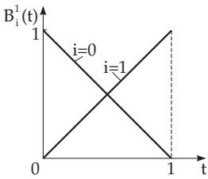
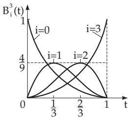
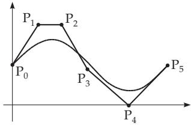

### 19.7 Representation of Curves and Surfaces with Splines

#### 19.7.1 Cubic Splines

Since interpolation and approximation polynomials of higher degree usually have unwanted oscillations, it is useful to divide the approximation interval into subintervals by the so-called nodes and to consider a relatively simple approximation function on every subinterval. In practice, cubic polynomials are mostly used. A smooth transition is required at the nodes of this piecewise approximation.

##### 19.7.1.1 Interpolation Splines

1. Definition of the Cubic Interpolation Splines, Properties

Suppose there are given N interpolation points $( x _ { i } , f _ { i } ) \left( i = 1 , 2 , \ldots , N ; x _ { 1 } < x _ { 2 } < \ldots x _ { N } \right)$ . The cubic interpolation spline S(x) is determined uniquely by the following properties:

1. S(x) satisfies the interpolation conditions $S ( x _ { i } ) = f _ { i } ~ ( i = 1 , 2 , \ldots , N )$

2. S(x) is a polynomial of degree $\leq 3$ in any subinterval $\left[ x _ { i } , x _ { i + 1 } \right] { \mathrm { ~ } } ( i = 1 , 2 , \ldots , N - 1 )$

3. S(x) is twice continuously diferentiable in the entire approximation interval $[ x _ { 1 } , x _ { N } ]$

4. S(x) satisfies the special boundary conditions:

a) $S ^ { \prime \prime } ( x _ { 1 } ) = S ^ { \prime \prime } ( x _ { N } ) = 0$ (we call them natural splines) or

b) $S ^ { \prime } ( x _ { 1 } ) = f _ { 1 } ^ { \prime } , S ^ { \prime } ( x _ { N } ) = f _ { N } ^ { \prime } \left( f _ { 1 } ^ { \prime } \right.$ and $f _ { N } { ' }$ are given values) or

c) $S ( x _ { 1 } ) = S ( x _ { N } )$ , in the case of $f _ { 1 } = f _ { N } , S ^ { \prime } ( x _ { 1 } ) = S ^ { \prime } ( x _ { N } )$ and $S ^ { \prime \prime } ( x _ { 1 } ) = S ^ { \prime \prime } ( x _ { N } )$ (they are called periodic splines).

It follows from these properties that for all twice continuously diferentiable functions $g ( x )$ satisfying the interpolation conditions $g ( x _ { i } ) = f _ { i } ~ ( i = 1 , 2 , \ldots , N )$

$$
\int _ { x _ { 1 } } ^ { x _ { N } } [ S ^ { \prime \prime } ( x ) ] ^ { 2 } d x \leq \int _ { x _ { 1 } } ^ { x _ { N } } [ g ^ { \prime \prime } ( x ) ] ^ { 2 } d x\tag{19.235}
$$

is valid (Holladay’s Theorem). Based on (19.235) one can say that $S ( x )$ has minimal total curvature, since for the curvature κ of a given curve, in a first approximation, $\kappa \approx S ^ { \prime \prime }$ (see 3.6.1.2, 4., p. 246). It can be shown that if a thin elastic ruler (its name is spline) is led through the points $\begin{array} { l l } { \left( x _ { i } , f _ { i } \right) } & { ( i = } \end{array}$ $1 , 2 , \ldots , N )$ , its bending line follows the cubic spline $S ( x )$

2. Determination of the Spline Coeficients

The cubic interpolation spline $S ( x )$ for $x \in [ x _ { i } , x _ { i + 1 } ]$ has the form:

$$
S ( x ) = S _ { i } ( x ) = a _ { i } + b _ { i } ( x - x _ { i } ) + c _ { i } ( x - x _ { i } ) ^ { 2 } + d _ { i } ( x - x _ { i } ) ^ { 3 } \quad ( i = 1 , 2 , \ldots , N - 1 ) .\tag{19.236}
$$

The length of the subinterval is denoted by $h _ { i } = x _ { i + 1 } - x _ { i }$ . The coeficients of the natural spline can be determined in the following way:

1. From the interpolation conditions we get

$$
a _ { i } = f _ { i } \quad ( i = 1 , 2 , \ldots , N - 1 ) .\tag{19.237}
$$

It is reasonable to introduce the additional coeficient $a _ { N } = f _ { N }$ , which does not occur in the polynomials.

2. The continuity of $S ^ { \prime \prime } ( x )$ at the interior nodes requires that

$$
d _ { i - 1 } = \frac { c _ { i } - c _ { i - 1 } } { 3 h _ { i - 1 } } \quad ( i = 2 , 3 , \ldots , N - 1 ) .\tag{19.238}
$$

The natural conditions result in $c _ { 1 } = 0$ , and (19.238) still holds for $i = N$ , if $c _ { N } = 0$ is introduced.

3. The continuity of $S ( x )$ at the interior nodes results in the relation

$$
b _ { i - 1 } = \frac { a _ { i } - a _ { i - 1 } } { h _ { i - 1 } } - \frac { 2 c _ { i - 1 } + c _ { i } } 3 h _ { i - 1 } \quad ( i = 2 , 3 , \ldots , N ) .\tag{19.239}
$$

4. The continuity of $S ^ { \prime } ( x )$ at the interior nodes requires that

$$
c _ { i - 1 } h _ { i - 1 } + 2 ( h _ { i - 1 } + h _ { i } ) c _ { i } + c _ { i + 1 } h _ { i } = 3 \left( { \frac { a _ { i + 1 } - a _ { i } } { h _ { i } } } - { \frac { a _ { i } - a _ { i - 1 } } { h _ { i - 1 } } } \right) \quad ( i = 2 , 3 , \dots , N - 1 ) .\tag{19.240}
$$

Because of (19.237), the right-hand side of the linear equation system (19.240) to determine the coefficients $\textit { c } _ { i } \left( i = 2 , 3 , \ldots , N - 1 ; \ c _ { 1 } = c _ { N } = 0 \right)$ is known. The left hand-side has the following form:

$$
\begin{array} { r l } & { \left( \begin{array} { c c c c c } { 2 ( h _ { 1 } + h _ { 2 } ) } & { h _ { 2 } } & & & & \\ { h _ { 2 } } & { 2 ( h _ { 2 } + h _ { 3 } ) } & { h _ { 3 } } & { \mathbf { O } } & & \\ { h _ { 3 } } & { 2 ( h _ { 3 } + h _ { 4 } ) } & { h _ { 4 } } & & \\ & { \ddots } & { \ddots } & { \ddots } & \\ & { \mathbf { O } } & & & { h _ { N - 2 } } \end{array} \right) \left( \begin{array} { c } { c _ { 2 } } \\ { c _ { 3 } } \\ { c _ { 4 } } \\ { \vdots } \\ { c _ { N - 1 } } \end{array} \right) . } \end{array}\tag{19.241}
$$

The coeficient matrix is tridiagonal, so the system of equations (19.240) can be solved numerically very easily by an LR decomposition (see 19.2.1.1, 2., p. 956). Then all other coeficients in (19.239) and (19.238) can be determined with these values $c _ { i }$

##### 19.7.1.2 Smoothing Splines

The given function values $f _ { i }$ are usually measured values in practical applications so they have some error. In this case, the interpolation requirement is not reasonable. This is the reason why cubic smoothing splines are introduced. This spline is obtained if in the cubic interpolation splines the interpolation

requirements are replaced by

$$
\sum _ { i = 1 } ^ { N } \left[ { \frac { f _ { i } - S ( x _ { i } ) } { \sigma _ { i } } } \right] ^ { 2 } + \lambda \int _ { x _ { 1 } } ^ { x _ { N } } [ S ^ { \prime \prime } ( x ) ] ^ { 2 } \ d x = \operatorname* { m i n } ! .\tag{19.242}
$$

The requirements of continuity of $S , S ^ { \prime }$ and $S ^ { \prime \prime }$ are kept, so the determination of the coeficients is a constrained optimization problem with conditions given in equation form. The solution can be obtained by using a Lagrange function (see 6.2.5.6, p. 456). For details see [19.26].

In $( 1 9 . 2 4 2 ) \lambda ( \lambda \geq 0 )$ represents a smoothing parameter , which must be given previously. For $\lambda = 0$ the result is the cubic interpolation spline, as a special case. For “large” λ the result is a smooth approximation curve, but it returns the measured values inaccurately, and for $\lambda = \infty$ the result is the approximating regression line as another special case. A suitable choice of λ can be made, $\mathrm { e . g . }$ , by computer-screen dialog. The parameter $\sigma _ { i } \ \left( \sigma _ { i } > 0 \right)$ in (19.242) represents the standard deviation (see 16.4.1.3, 2., p. 851) of the measurement errors, of the values $f _ { i } \ { ( i = 1 , 2 , \dots , N ) }$

Until now, the abscissae of the interpolation points and the measurement points were the same as the nodes of the spline function. For large N this method results in a spline containing a large number of cubic functions (19.236). A possible solution is to choose the number and the position of the nodes freely, because in many practical applications only a few spline segments are satisfactory. It is reasonable also from a numerical viewpoint to replace (19.236) by a spline of the form

$$
S ( x ) = \sum _ { i = 1 } ^ { r + 2 } a _ { i } N _ { i , 4 } ( x ) .\tag{19.243}
$$

Here $r$ is the number of freely chosen nodes, and the functions $N _ { i , 4 } ( x )$ are the so-called normalized Bsplines (basis splines) of order 4, i.e., polynomials of degree three, with respect to the i-th node. For details see [19.5].

#### 19.7.2 Bicubic Splines

##### 19.7.2.1 Use of Bicubic Splines

Bicubic splines are used for the following problem: A rectangle R of the x, y plane, given by $a \leq x \leq b _ { \mathrm { { i } } }$ $c \leq y \leq \bar { d } .$ , is decomposed by the grid $p o i n t s \left( x _ { i } , y _ { j } \right) \ ( i = 0 , 1 , . . . , n ; \ j = 0 , 1 , . . . , \bar { m } )$ with

$$
a = x _ { 0 } < x _ { 1 } < \cdot \cdot \cdot < x _ { n } = b , \quad c = y _ { 0 } < y _ { 1 } < \cdot \cdot \cdot < y _ { m } = d\tag{19.244}
$$

into subdomains $R _ { i j }$ , where the subdomain $R _ { i j }$ contains the points $( x , y )$ with $x _ { i } \leq x \leq x _ { i + 1 } , y _ { j } \leq y \leq$ $y _ { j + 1 } ( i = 0 , 1 , \ldots , \bar { n } - 1 ; \ j = 0 , 1 , \ldots , m - 1 )$ . The values of the function $f ( x , y )$ are given at the grid points

$$
f ( x _ { i } , y _ { j } ) = f _ { i j } \quad ( i = 0 , 1 , \ldots , n ; \ j = 0 , 1 , \ldots , m ) .\tag{19.245}
$$

A possible simple, smooth surface over R is required which approximates the points (19.245).

##### 19.7.2.2 Bicubic Interpolation Splines

1. Properties

The bicubic interpolation spline $S ( x , y )$ is defined uniquely by the following properties:

1. $S ( x , y )$ satisfies the interpolation conditions

$$
S ( x _ { i } , y _ { j } ) = f _ { i j } \quad ( i = 0 , 1 , \ldots , n ; \ j = 0 , 1 , \ldots , m ) .\tag{19.246}
$$

2. $S ( x , y )$ is identical to a bicubic polynomial on every $R _ { i j }$ of the rectangle R, that is,

$$
S ( x , y ) = S _ { i j } ( x , y ) = \sum _ { k = 0 } ^ { 3 } \sum _ { l = 0 } ^ { 3 } a _ { i j k l } ( x - x _ { i } ) ^ { k } ( y - y _ { j } ) ^ { l }\tag{19.247}
$$

on $R _ { i j } . \mathrm { ~ S o } , S _ { i j } ( x , y )$ is determined by 16 coeficients, and for the determination of $S ( x , y ) \ 1 6 \cdot m \cdot n$ coeficients are needed.

3. The derivatives

$$
{ \frac { \partial S } { \partial x } } , \quad { \frac { \partial S } { \partial y } } , \quad { \frac { \partial ^ { 2 } S } { \partial x \partial y } }\tag{19.248}
$$

are continuous on $R .$ . So, a certain smoothness is ensured for the entire surface.

4. $S ( x , y )$ satisfies the special boundary conditions:

$$
{ \frac { \partial S } { \partial x } } ( x _ { i } , y _ { j } ) = p _ { i j } \quad { \mathrm { f o r } } \quad i = 0 , n ; ~ j = 0 , 1 , \ldots , m ,
$$

$$
{ \frac { \partial S } { \partial y } } ( x _ { i } , y _ { j } ) = q _ { i j } \quad { \mathrm { f o r } } \quad i = 0 , 1 , \dots , n ; \ j = 0 , m ,\tag{19.249}
$$

$$
{ \frac { \partial ^ { 2 } S } { \partial x \partial y } } ( x _ { i } , y _ { j } ) = r _ { i j } \quad { \mathrm { f o r } } \quad i = 0 , n ; \ j = 0 , m .
$$

Here $p _ { i j } , q _ { i j }$ and $r _ { i j }$ are previously given values.

The results of one-dimensional cubic spline interpolation can be used for the determination of the coeficients $a _ { i j k l }$

1. There is a very large number $( 2 n + m + 3 )$ of linear systems of equations but only with tridiagonal coeficient matrices.

2. The linear systems of equations difer from each other only on their right-hand sides.

In general, it can be said that bicubic interpolation splines are useful with respect to computation cost and accuracy, and so they are appropriate procedures for practical applications. For practical methods of computing the coeficients see the literature.

2. Tensor Product Approach

The bicubic spline approach (19.247) is an example of the so-called tensor product approach having the form

$$
S ( x , y ) = \sum _ { i = 0 } ^ { n } \sum _ { j = 0 } ^ { m } a _ { i j } g _ { i } ( x ) h _ { j } ( y )\tag{19.250}
$$

and which is especially suitable for approximations over a rectangular grid. The functions $g _ { i } ( x ) \textit { } ( i =$ $0 , 1 , \ldots , n )$ and $h _ { j } ( y ) { \overset { \cdot } { ( } } j = 0 , 1 , \ldots , { \overset { \cdot } { m } } )$ form two linearly independent function systems. The tensor product approach has the big advantage, from numerical viewpoint, that, e.g., the solution of a twodimensional interpolation problem (19.246) can be reduced to a one-dimensional one. Furthermore, the two-dimensional interpolation problem (19.246) is uniquely solvable with the approach (19.250) if 1. the one-dimensional interpolation problem with functions $g _ { i } ( x )$ with respect to the interpolation nodes $x _ { 0 } , x _ { 1 } , \ldots , x _ { n }$ and

2. the one-dimensional interpolation problem with functions $h _ { j } ( y )$ with respect to the interpolation nodes $y _ { 0 } , y _ { 1 } , \ldots , y _ { m }$

are uniquely solvable.

An important tensor product approach is that with the cubic B-splines:

$$
S ( x , y ) = \sum _ { i = 1 } ^ { r + 2 } \sum _ { j = 1 } ^ { p + 2 } a _ { i j } N _ { i , 4 } ( x ) N _ { j , 4 } ( y ) .\tag{19.251}
$$

Here, the functions $N _ { i , 4 } ( x )$ and $N _ { j , 4 } ( y )$ are normalized B-splines of order four. Here $r$ denotes the number of nodes with respect to x, p denotes the number of nodes with respect to y. The nodes can be chosen freely but their positions must satisfy certain conditions for the solvability of the interpolation problem.

The B-spline approach results in a system of equations with a band structured coeficient matrix, which is a numerically useful structure.

For solutions of diferent interpolation problems using bicubic B-splines see the literature.

##### 19.7.2.3 Bicubic Smoothing Splines

The one-dimensional cubic approximation spline is mainly characterized by the optimality condition (19.242). For the two-dimensional case there could be determined a whole sequence of corresponding optimality conditions, however only a few special cases make the existence of a unique solution possible. For appropriate optimality conditions and algorithms for solution of the approximation problem with bicubic B-splines see the literature.

#### 19.7.3 Bernstein–B´ezier Representation of Curves and Surfaces

1. Bernstein Basis Polynomials

The Bernstein–B´ezier representation (briefly B–B representation) of curves and surfaces applies the Bernstein polynomials

$$
B _ { i , n } ( t ) = \binom { n } { i } t ^ { i } ( 1 - t ) ^ { n - i } \quad ( i = 0 , 1 , \ldots , n )\tag{19.252}
$$

and uses the following fundamental properties:

1. $0 \leq B _ { i , n } ( t ) \leq 1$ for $0 \leq t \leq 1$

(19.253)

2. $\sum _ { i = 0 } ^ { n } B _ { i , n } ( t ) = 1 .$

(19.254)

Formula (19.254) follows directly from the binomial theorem (see 1.1.6.4, p. 12).

A: $B _ { 0 1 } ( t ) = 1 - t , B _ { 1 , 1 } ( t ) = t ( { \bf F i g . 1 9 . 1 2 } ) .$

B: $B _ { 0 3 } ( t ) = ( 1 - t ) ^ { 3 } , B _ { 1 , 3 } ( t ) = 3 t ( 1 - t ) ^ { 2 } , B _ { 2 , 3 } ( t ) = 3 t ^ { 2 } ( 1 - t ) B _ { 3 , 3 } ( t ) = t ^ { 3 }$ (Fig. 19.13).

  
Figure 19.12

  
Figure 19.13

2. Vector Representation

Now, a space curve, whose parametric representation is $\begin{array} { r } { x = x ( t ) , y = y ( t ) , z = z ( t ) } \end{array}$ , will be denoted in vector form by

$$
\vec { \bf r } = \vec { \bf r } ( t ) = x ( t ) \vec { \bf e } _ { x } + y ( t ) \vec { \bf e } _ { y } + z ( t ) \vec { \bf e } _ { z } .\tag{19.255}
$$

Here t is the parameter of the curve. The corresponding representation of a surface is

$$
\vec { \mathbf { r } } = \vec { \mathbf { r } } ( u , v ) = x ( u , v ) \vec { \mathbf { e } } _ { x } + y ( u , v ) \vec { \mathbf { e } } _ { y } + z ( u , v ) \vec { \mathbf { e } } _ { z } .\tag{19.256}
$$

Here, u and v are the surface parameters.

##### 19.7.3.1 Principle of the B–B Curve Representation

Suppose there are given $n + 1$ vertices $P _ { i } ~ ( i = 0 , 1 , \dots , n )$ of a three-dimensional polygon with the position vectors $\vec { \mathbf { P } } _ { i }$ . Introducing the vector-valued function

$$
\vec { \mathbf { r } } ( t ) = \sum _ { i = 0 } ^ { n } B _ { i , n } ( t ) \vec { \mathbf { P } } _ { i }\tag{19.257}
$$

a space curve is assigned to these points, which is called the B–B curve. Because of (19.254) formula (19.257) can be considered as a “variable convex combination” of the given points. The threedimensional curve (19.257) has the following important properties:

  
Figure 19.14

1. The points $P _ { 0 }$ and $P _ { n }$ are interpolated.

2. Vectors $P _ { 0 } \dot { P } _ { 1 }$ and $P _ { n - 1 } P _ { n }$ are tangents to $\vec { \bf r } ( t )$ at points $P _ { 0 }$ and $P _ { n }$

The relation between a polygon and a B–B curve is shown in Fig. 19.14.

The B–B representation is considered as a design of the curve, since it is easy to influence the shape of the curve by changing the polygon vertices.

Often normalized B-splines are used instead of Bernstein polynomials.

The corresponding space curves are called the B-spline curves. Their shape corresponds basically to the B–B curves with the following advantages:

1. The polygon is better approximated.

2. The B-spline curve changes only locally if the polygon vertices are changed.

3. In addition to the local changes of the shape of the curve the diferentiability can also be influenced.   
So, it is possible to produce break points and line segments for example.

##### 19.7.3.2 B–B Surface Representation

Suppose there are given the points $P _ { i j } \ ( i = 0 , 1 , \ldots , n ; \ j = 0 , 1 , \ldots , m )$ with the position vectors $\vec { \mathbf { P } } _ { i j }$ which can be considered as the nodes of a grid along the parameter curves of a surface. Analogously to the B–B curves (19.257), a surface is assigned to the grid points by

$$
\vec { \mathbf { r } } ( u , v ) = \sum _ { i = 0 } ^ { n } \sum _ { j = 0 } ^ { m } B _ { i , n } ( u ) B _ { j , m } ( v ) \vec { \mathbf { P } } _ { i j } .\tag{19.258}
$$

Representation (19.258) is useful for surface design, since by changing the grid points the surface can be changed. Anyway, the influence of every grid point is global, so one should change from the Bernstein polynomials to the B-splines in (19.258).
