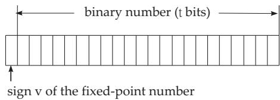
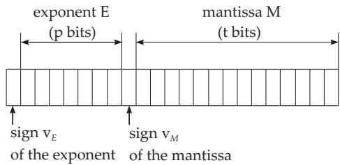
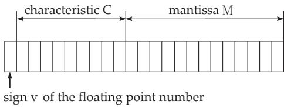

#### 19.8.1 Internal Symbol Representation

Computers are machines that work with symbols. The interpretation and processing of these symbols is determined and controlled by the software. The external symbols, letters, cyphers and special symbols are internally represented in binary code by a form of bit sequence. A bit (binary digit) is the smallest representable information unit with values 0 and 1. Eight bits form the next unit, the byte. In a byte one can distinguish between $2 ^ { 8 }$ bit combinations, so 256 symbols can be assigned to them. Such an assignment is called a code. There are diferent codes; one of the most widespread is ASCII (American Standard Code for Information Interchange).

##### 19.8.1.1 Number Systems

1. Law of Representation

Numbers are represented in computers in a sequence of consecutive bytes. The basis for the internal representation is the binary system, which belongs to the polyadic systems, similarly to the decimal system.

The law of representation for a polyadic number system is

$$
a = \sum _ { i = - m } ^ { n } z _ { i } B ^ { i } \quad ( m > 0 , n \geq 0 ; m , n \mathrm { i n t e g e r } )\tag{19.259}
$$

with B as basis and $z _ { i } ~ ( 0 \leq z _ { i } < B )$ as a digit of the number system. The positions $i \geq 0$ form the integers, those with $i < 0$ the fractional part of the number.

The decimal number representation, i.e., $B = 1 0$ of the decimal number 139.8125 has the form $1 3 9 . 8 1 2 5 = 1 \cdot 1 0 ^ { 2 } + 3 \cdot 1 0 ^ { 1 ^ { \circ } } + 9 \cdot 1 0 ^ { 0 } + \mathring { 8 } \cdot 1 0 ^ { - 1 } + 1 \cdot 1 0 ^ { - 2 } + 2 \cdot 1 0 ^ { - 3 } + 5 \cdot 1 0 ^ { - 4 } .$

The number systems occurring most often in computers are shown in Table 19.3.

Table 19.3 Number systems
<table><tr><td>Number system</td><td>Basis</td><td>Corresponding digits</td></tr><tr><td>Binary system</td><td>2</td><td>0,1</td></tr><tr><td>Octal system</td><td>8</td><td>0,1, 2,3,4, 5, 6, 7</td></tr><tr><td>Hexadecimal system</td><td>16</td><td>0, 1, 2, 3, 4, 5, 6, 7, 8, 9, A,B,C,D,E,F (The letters A-F are for the values 10–15.)</td></tr><tr><td>Decimal system</td><td>10</td><td>0, 1, 2, 3, 4, 5, 6, 7, 8, 9</td></tr></table>

2. Conversion

The transition from one number system to another is called conversion. If diferent number systems are used in the same time, in order to avoid confusion the basis is denoted as an index.

The decimal number 139.8125 is in diferent systems: $1 3 9 . 8 1 2 5 _ { 1 0 } = 1 0 0 0 1 0 1 1 . 1 1 0 1 _ { 2 } = 2 1 3 . 6 4 _ { 8 } =$ $8 \mathrm { B } . \mathrm { D } _ { 1 6 }$

1. Conversion of Binary Numbers into Octal or Hexadecimal Numbers The conversion of binary numbers into octal or hexadecimal numbers is simple. Groups of three or four bits are formed starting at the binary point to the left and to the right, and their values are determined. These values are the digits of the octal or hexadecimal systems.

2. Conversion of Decimal Numbers into Binary, Octal or Hexadecimal Numbers For the conversion of a decimal numbers into another system, the following rules are applied for the integer and for the fractional part separately:

a) Integer Part: If G is an integer in the decimal system, then for the number system with basis B the law of formation (19.259) is:

$$
G = \sum _ { i = 0 } ^ { n } z _ { i } B ^ { i } \quad ( n \geq 0 ) .\tag{19.260}
$$

If G is divided by B, then an integer part (the sum) is obtained and a residue:

$$
{ \frac { G } { B } } = \sum _ { i = 1 } ^ { n } z _ { i } B ^ { i - 1 } + { \frac { z _ { 0 } } { B } } .\tag{19.261}
$$

Here, $z _ { 0 }$ can have the values $0 , 1 , \ldots , B - 1$ , and it is the lowest valued digit of the required number. If this method is repeated for the quotients, further digits can be got.

b) Fractional Part: If g is a proper fraction, then the method to convert it into the number system with basis B is

$$
g B = z _ { - 1 } + \sum _ { i = 2 } ^ { m } z _ { - i } B ^ { - i + 1 } ,\tag{19.262}
$$

i.e., the next digit is obtained as the integer part of the product $g B .$ The values $z _ { - 2 } , z _ { - 3 } , . . .$ . can be obtained in the same way.

A: Conversion of the decimal number 139 into a binary number.

139 : 2 = 69 residue 1 (1 = z )   
69 : 2 = 34 residue 1 (1 = z )   
34 : 2 = 17 residue 0 (0 = z )   
17 : 2 = 8 residue 1 :   
8 : 2 = 4 residue 0   
4 : 2 = 2 residue 0   
2 : 2 = 1 residue 0   
1 : 2 = 0 residue 1 (1 = z )

B: Conversion of a decimal fraction 0.8125 into a binary fraction.

$$
\begin{array} { l l l } { 0 . 8 1 2 5 \cdot 2 = 1 . 6 2 5 } & { ( 1 = z _ { - 1 } ) } \\ { 0 . 6 2 5 \cdot 2 = 1 . 2 5 } & { ( 1 = z _ { - 2 } ) } \\ { 0 . 2 5 } & { \cdot 2 = 0 . 5 } & { ( 0 = z _ { - 3 } ) } \\ { 0 . 5 } & { \cdot 2 = 1 . 0 } & { ( 1 = z _ { - 4 } ) } \\ { 0 . 0 } & { \cdot 2 = 0 . 0 } & { } \end{array}
$$

$$
0 . 8 1 2 5 _ { 1 0 } = 0 . 1 1 0 1 _ { 2 }
$$

$$
1 3 9 _ { 1 0 } = 1 0 0 0 1 0 1 1 _ { 2 }
$$

3. Conversion of Binary, Octal, and Hexadecimal Numbers into a Decimal Number The algorithm for the conversion of a value from the binary, octal, or hexadecimal system into the decimal system is the following, where the decimal point is after $z _ { \mathrm { 0 } } \mathrm { : }$

$$
a = \sum _ { i = - m } ^ { n } z _ { i } B ^ { i } \quad ( m > 0 , n \geq 0 , \mathrm { i n t e g e r } ) .\tag{19.263}
$$

The calculation is convenient with the Horner rule (see 19.1.2.1, p. 952).

$$
\mid L L L O L = 1 \cdot 2 ^ { 4 } + 1 \cdot 2 ^ { 3 } + 1 \cdot 2 ^ { 2 } + 0 \cdot 2 ^ { 1 } + 1 \cdot 2 ^ { 0 } = 2 9 .
$$

The corresponding Horner scheme is shown on the right.

##### 19.8.1.2 Internal Number Representation INR

$$
\frac { 2 }  \left| \begin{array} { l l l l } { 1 } & { 1 } & { 1 } & { 0 } & { 1 } \\ { 2 } & { 6 } & { 1 4 } & { 2 8 } \\ { 1 } & { 3 } & { 7 } & { 1 4 } & { \left| 2 9 \right. } \end{array} \right.
$$

Binary numbers are represented in computers in one or more bytes. Two types of form of representation are distinguished, the fixed-point numbers and the floating-point numbers. In the first case, the decimal point is at a fixed place, in the second case it is “floating” with the change of the exponent.

1. Fixed-Point Numbers

The range for fixed-point numbers with the given parameters is

$$
0 \leq | a | \leq 2 ^ { t } - 1 .\tag{19.264}
$$

Fixed-point numbers can be represented in the form of Fig. 19.15.

2. Floating-Point Numbers

Figure 19.15

Basically, two diferent forms are in

use for the representation of floating-point numbers, where the internal implementation can vary in detail.

  
Figure 19.16

1. Normalized Semilogarithmic Form In the first form, the signs of the exponent E and the mantissa M of the number a are stored separately

$$
a = \pm M B ^ { \pm E } .\tag{19.265a}
$$

Here the exponent E is chosen so that for the mantissa

$$
1 / B \le M < 1\tag{19.265b}
$$

holds. It is called the normalized semilogarithmic form (Fig. 19.16).

The range of the absolute value of the floating-point numbers with the given parameters is:

$$
2 ^ { - 2 ^ { p } } \leq \left| \textit { a } \right| \leq \left( 1 - 2 ^ { - t } \right) \cdot 2 ^ { ( 2 ^ { p } - 1 ) } .\tag{19.266}
$$

2. IEEE Standard The second (nowadays used) form of floating-point numbers corresponds to the IEEE (Institute of Electrical and Electronics Engineers) standard accepted in 1985. It deals with the requirements of computer arithmetic, roundof behavior, arithmetical operators, conversion of numbers, comparison operators and handling of exceptional cases such as over- and underflow.

The floating-point number representations are shown in Fig. 19.17.

The characteristic C comes from the exponent E by addition of a suitable constant K. This is chosen so that only positive numbers occur in the characteristic. The representable number is

$$
\begin{array} { c } { { a = ( - 1 ) ^ { v } \cdot 2 ^ { E } \cdot 1 . b _ { 1 } b _ { 2 } \cdot \cdot \cdot b _ { t - 1 } } } \\ { { \mathrm { w i t h } ~ E = C - K . } } \end{array}
$$

(19.267)

Here: $C _ { m i n } = 1 , C _ { m a x } = 2 5 4$ , since C = 0 and C = 255 are reserved.

The standard gives two basic forms of representation (single-precision and double-precision floatingpoint numbers), but other representations are also possible. Table 19.4 contains the parameters for the basic forms.

Table 19.4 Parameters for the basic forms
<table><tr><td>Parameter</td><td>Single precision</td><td>Double precision</td></tr><tr><td>Word length in bits Maximal exponent  $E _ { m a x }$  Minimal exponent  $E _ { m i n }$  Constant K Number of bits in exponent</td><td>32 +127 -126 +127 8</td><td>64 +1023 -1022 +1023</td></tr></table>
