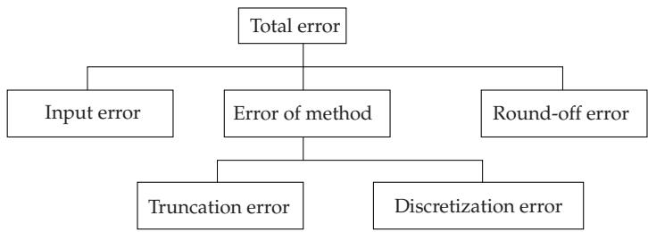

#### 19.8.2 Numerical Problems in Calculations with Computers

##### 19.8.2.1 Introduction, Error Types

The general properties of calculations with a computer are basically the same as those of calculations done by hand, however some of them need special attention, because the accuracy comes from the representation of the numbers, and from the missing judgement with respect to the errors of the computer. Furthermore, computers perform many more calculation steps than human can do manually.

So, there is the problem of how to influence and control the errors, e.g., by choosing the most appropriate numerical method among the mathematically equivalent methods.

In further discussions, the following notation is used, where x denotes the exact value of a quantity, which is mostly unknown, and ˜x is an approximation value of x:

$$
\mathrm { A b s o l u t e \ e r r o r : \quad } | \Delta x | = | x - \tilde { x } | . \quad \ ( 1 9 . 2 6 8 )
$$

$$
\mathrm { R e l a t i v e \ e r r o r : } \quad \left| { \frac { \Delta x } { x } } \right| = \left| { \frac { x - \tilde { x } } { x } } \right| .\tag{19.269}
$$

The notations

$$
\epsilon ( x ) = x - \tilde { x } \quad \mathrm { a n d } \quad \epsilon _ { r e l } ( x ) = \frac { x - \tilde { x } } { x }\tag{19.270}
$$

are also often used.

##### 19.8.2.2 Normalized Decimal Numbers and Round-Off

1. Normalized Decimal Numbers

Every real number $x \neq 0$ can be expressed as a decimal number in the form

$$
x = \pm 0 . b _ { 1 } b _ { 2 } \ldots \cdot 1 0 ^ { E } \quad ( b _ { 1 } \neq 0 ) .\tag{19.271}
$$

Here $0 , b _ { 1 } b _ { 2 } \dots$ is called the mantissa formed with the digits $b _ { i } \in \{ 0 , 1 , 2 , \ldots , 9 \}$ . The number E is an integer, the so-called exponent with respect to the base 10. Since $b _ { 1 } \neq 0 , ( 1 9 . 2 7 1 )$ is called a normalized decimal number.

Since only finitely many digits can be handled by a real computer, one has to restrict himself to a fixed number t of mantissa digits and to a fixed range of the exponent E. So, from the number x given in (19.271) the number

$$
\tilde { x } = \left\{ \begin{array} { l l } { \pm 0 . b _ { 1 } b _ { 2 } \cdot \cdot \cdot b _ { t } \cdot 1 0 ^ { E } } & { \mathrm { ~ f o r } \quad b _ { t + 1 } \leq 5 \mathrm { ~ ( r o u n d - d o w n ) } , } \\ { \pm ( 0 . b _ { 1 } b _ { 2 } \cdot \cdot \cdot b _ { t } + 1 0 ^ { - t } ) 1 0 ^ { E } } & { \mathrm { ~ f o r } \quad b _ { t + 1 } > 5 \mathrm { ~ ( r o u n d - u p ) } , } \end{array} \right.\tag{19.272}
$$

is obtained by round-of (as it is usual in practical calculations). The absolute error caused by round-of

$$
| \Delta x | = | x - \tilde { x } | \leq 0 . 5 \cdot 1 0 ^ { - t } 1 0 ^ { E } .\tag{19.273}
$$

2. Basic Operations and Numerical Calculations

Every numerical process is a sequence of basic calculation operations. Problems arise especially with the finite number of positions in the floating-point representation. Here a short overview is given. It is supposed that x and y are normalized error-free floating-point numbers with the same sign and with a non-zero value:

$$
x = m _ { 1 } B ^ { E _ { 1 } } , \quad y = m _ { 2 } B ^ { E _ { 2 } } \quad \mathrm { w i t h }\tag{19.274a}
$$

$$
m _ { i } = \sum _ { k = 1 } ^ { t } a _ { - k } ^ { ( i ) } B ^ { - k } , \quad a _ { - 1 } ^ { ( i ) } \ne 0 , \quad \mathrm { a n d }\tag{19.274b}
$$

$$
a _ { - k } ^ { ( i ) } = 0 \mathrm { o r } 1 \mathrm { o r } \dots \mathrm { o r } B - 1 \mathrm { f o r } k > 1 ( i = 1 , 2 ) .\tag{19.274c}
$$

1. Addition If $E _ { 1 } > E _ { 2 }$ , then the common exponent becomes $E _ { 1 }$ , since normalization allows us to make only a left-shift. The mantissas are then added.

$$
\mathrm { I f } \quad B ^ { - 1 } \leq | m _ { 1 } + m _ { 2 } B ^ { - ( E _ { 1 } - E _ { 2 } ) } | < 2 \qquad ( 1 9 . 2 7 5 \mathrm { a } ) \qquad \mathrm { a n d } \quad | m _ { 1 } + m _ { 2 } B ^ { - ( E _ { 1 } - E _ { 2 } ) } | \geq 1 ,\tag{19.275b}
$$

then shifting the decimal point by one position to the left results in an increase of the exponent by one. $0 . 9 6 0 4 \cdot 1 0 ^ { 3 } + 0 . 5 8 7 3 \cdot 1 0 ^ { 2 } = 0 . 9 6 0 4 \cdot 1 0 ^ { 3 } + 0 . 0 5 8 7 3 \cdot 1 0 ^ { 3 } = 1 . 0 1 9 1 3 \cdot 1 0 ^ { 3 } = 0 . 1 0 1 9 \cdot 1 0 ^ { 4 }$

2. Subtraction The exponents are equalized as in the case of addition, the mantissas are then subtracted. If

$$
\mid m _ { 1 } - m _ { 2 } B ^ { - ( E _ { 1 } - E _ { 2 } ) } \mid < 1 - B ^ { - t } \ ( 1 9 . 2 7 6 \mathrm { a } ) \qquad \mathrm { a n d } \quad \mid m _ { 1 } - m _ { 2 } B ^ { - ( E _ { 1 } - E _ { 2 } ) } \mid < B ^ { - 1 } ,\tag{19.276b}
$$

shifting the decimal point to the right by a maximum of t positions results in the corresponding decrease of the exponent.

$0 . 1 0 0 4 \cdot 1 0 ^ { 3 } - 0 . 9 9 8 8 \cdot 1 0 ^ { 2 } = 0 . 1 0 0 4 \cdot 1 0 ^ { 3 } - 0 . 0 9 9 8 8 \cdot 1 0 ^ { 3 } = 0 . 0 0 0 5 2 \cdot 1 0 ^ { 3 } = 0 . 5 2 0 0 \cdot 1 0 ^ { 9 }$ . This example shows the critical case of subtractive cancellation. Because of the limited number of positions (here four), zeros are carried in from the right instead of the correct characters.

3. Multiplication The exponents are added and the mantissas are multiplied. If

$$
m _ { 1 } m _ { 2 } < B ^ { - 1 } ,\tag{19.277}
$$

then the decimal point is shifted to the right by one position, and the exponent is decreased by one. $( 0 . 3 1 7 6 \cdot 1 0 ^ { 3 } ) \cdot ( 0 . 2 5 0 4 \cdot 1 0 ^ { 5 } ) = 0 . 0 7 9 5 2 7 0 4 \cdot 1 0 ^ { 8 } = 0 . 7 9 5 3 \cdot 1 0 ^ { 7 } .$

4. Division The exponents are subtracted and the mantissas are divided. If

$$
\frac { m _ { 1 } } { m _ { 2 } } \geq B ^ { - 1 } ,\tag{19.278}
$$

then the decimal point is shifted to the left by one position, and the exponent is increased by one. $( 0 . 3 1 7 6 \cdot 1 0 ^ { 3 } ) / ( 0 . 2 5 0 4 \cdot 1 0 ^ { 5 } ) = 1 . 2 6 8 3 7 0 6 \ldots 1 0 ^ { - 2 } = 0 . 1 2 6 8 \cdot 1 0 ^ { - 1 } .$

5. Error of the Result The error of the result in the four basic operations with terms that are supposed to be error-free is a consequence of round-of. For the relative error with number of positions t and the base B, the limit is

$$
{ \frac { B } { 2 } } B ^ { - t } .\tag{19.279}
$$

6. Subtractive cancelation As it was mentioned above, the critical operation is the subtraction of nearly equal floating-point numbers. If it is possible, one should avoid this by changing the order of operations, or by using certain identities.

$$
\begin{array} { r l } & { \quad \quad \quad x = \sqrt { 1 9 8 5 } - \sqrt { 1 9 8 4 } = 0 . 4 4 5 5 \cdot 1 0 ^ { 2 } - 0 . 4 4 5 4 \cdot 1 0 ^ { 2 } = 0 . 1 \cdot 1 0 ^ { - 1 } \mathrm { ~ o r ~ } x = \sqrt { 1 9 8 5 } - \sqrt { 1 9 8 4 } = 0 } \\ & { \quad \quad \quad \quad \frac { 1 9 8 5 } { \sqrt { 1 9 8 5 } + \sqrt { 1 9 8 4 } } = 0 . 1 1 2 2 \cdot 1 0 ^ { - 1 } } \end{array}
$$

##### 19.8.2.3 Accuracy in Numerical Calculations

1. Types of Errors

Numerical methods have errors. There are several types of errors, from which the total error of the final result is accumulated (Fig. 19.18).

  
Figure 19.18

2. Input Error

1. Notion of Input Error Input error is the error of the result caused by inaccurate input data. Slight inaccuracies of input data are also called perturbations. The determination of the error of the input data is called the direct problem of error calculus. The inverse problem is the following: How large an error the input data may have such that the final input error does not exceed an acceptable tolerance value. The estimation of the input error in rather complex problems is very dificult and is usually hardly possible. In general, for a real-valued function $y = f ( \underline { { \mathbf { x } } } )$ with $\mathbf { x } = ( x _ { 1 } , x _ { 2 } , \ldots , x _ { n } ) ^ { \mathrm { T } }$ the absolute value of the input error is

$$
\begin{array} { r l r } {  { | \Delta y | = | f ( x _ { 1 } , x _ { 2 } , \ldots , x _ { n } ) - f ( \tilde { x } _ { 1 } , \tilde { x } _ { 2 } , \ldots , \tilde { x } _ { n } ) | } } \\ & { } & { = | \displaystyle \sum _ { i = 1 } ^ { n } \frac { \partial f } { \partial x _ { i } } ( \xi _ { 1 } , \xi _ { 2 } , \ldots , \xi _ { n } ) ( x _ { i } - \tilde { x } _ { i } ) | \leq \sum _ { i = 1 } ^ { n } ( \operatorname* { m a x } _ { x } | \frac { \partial f } { \partial x _ { i } } ( { \bf x } ) | ) | \Delta x _ { i } | , } \end{array}\tag{19.280}
$$

if the Taylor formula $( \sec 7 . 3 . 3 . 3 , \mathrm { p . ~ } 4 7 1 )$ is used for $y = f ( x ) = f ( x _ { 1 } , x _ { 2 } , \ldots , x _ { n } )$ with a linear residue. $\xi _ { 1 } , \xi _ { 2 } , \ldots , \xi _ { n }$ denote the intermediate values, $\tilde { x } _ { 1 } , \tilde { x } _ { 2 } , \ldots , \tilde { x } _ { n }$ denote the approximating values of $x _ { 1 } , x _ { 2 }$ $\cdots , x _ { n }$ . The approximating values are the perturbed input data. Here, also the Gauss error propagation law (see 16.4.2.1, p. 855) is considered.

2. Input Error of Simple Arithmetic Operations The input error is known for simple arithmetical operations. With the notation of (19.268)–(19.270) for the four basic operations:

$$
\epsilon ( x \pm y ) = \epsilon ( x ) \pm \epsilon ( y ) , \qquad \mathrm { ( 1 9 . 2 8 1 ) } \epsilon ( x y ) = y \epsilon ( x ) + x \epsilon ( y ) + \epsilon ( x ) \epsilon ( y ) ,\tag{19.282}
$$

$$
\epsilon \left( \frac { x } { y } \right) = \frac { 1 } { y } \epsilon ( x ) - \frac { x } { y ^ { 2 } } \epsilon ( y ) + \mathrm { \ t e r m s \ o f \ h i g h e r \ o r d e r \ i n } \varepsilon ,\tag{19.283}
$$

$$
\epsilon _ { r e l } ( x \pm y ) = \frac { x \epsilon _ { r e l } ( x ) \pm y \epsilon _ { r e l } ( y ) } { x \pm y } , \quad ( 1 9 . 2 8 4 ) \ \epsilon _ { r e l } ( x y ) = \epsilon _ { r e l } ( x ) + \epsilon _ { r e l } ( y ) + \epsilon _ { r e l } ( x ) \epsilon _ { r e l } ( y ) ,\tag{19.285}
$$

$$
\epsilon _ { r e l } \left( \frac { x } { y } \right) = \epsilon _ { r e l } ( x ) - \epsilon _ { r e l } ( y ) + ~ \mathrm { t e r m s  o f } \mathrm { h i g h e r ~ o r d e r ~ i n } \varepsilon .\tag{19.286}
$$

The formulas show: Small relative errors of the input data result in small relative errors of the result on multiplication and division. For addition and subtraction, the relative error can be very large if $| x \pm y | \ll | x | + | y |$

3. Error of the Method

1. Notion of the Error of the Method The error ofthe method comes from the fact that theoretically continuous phenomena are numerically approximated in many diferent ways as limits. Hence, there are truncation errors in limiting processes (as, e.g., in iteration methods) and discretization errors in the approximation of continuous phenomena by a finite discrete system (as, e.g., in numerical integration). Errors of methods exist independently of the input and round-of errors; consequently, they can be investigated only in connection with the applied solution methodology.

2. Applying Iteration Methods If an iteration method is used, then both cases may occur: A correct solution or also a false solution of the problem can be obtained. It is also possible that no solution is obtained by an iteration method although there exists one.

To make an iteration method clearer and safer, the following advices should be considered:

a) To avoid “infinite” iterations, count the number of steps and stop the process if this number exceeds a previously given value (i.e., stop without reaching the required accuracy).

b) The location of the intermediate result should be tracked on the screen by a numerical or a graphical representation of the intermediate results.

c) All known properties of the solution should be used such as gradient, monotonicity, etc.

d) The possibilities of scaling the variables and functions should be investigated.

e) Several tests should be performed by varying the step size, truncation conditions, initial values, etc.

4. Round-of Errors

Round-oferrors occur because the intermediate results should be rounded. So, they have an essential importance in judging mathematical methods with respect to the required accuracy. They determine together with the errors of input and the error of the method, whether a given numerical method is strongly stable, weakly stable or unstable. Strong stability, weak stability, or instability occur if the total error, at an increasing number of steps, decreases, has the same order, or increases, respectively. At the instability one distinguishes between the sensitivity with respect to round-of errors and discretization errors (numerical instability) and with respect to the error in the initial data at a theoretically exact calculation (natural instability). A calculation process is appropriate if the numerical instability is not greater than the natural instability.

For the local error propagation of round-of errors, i.e., errors at the transition from a calculation step to the next one, the same estimation process can be used as the one applied at the input error.

5. Examples of Numerical Calculations

Some of the problems mentioned above are illustrated by numerical examples.

A: Roots of a Quadratic Equation:

$a x ^ { 2 } + b x + c = 0$ with real coeficients a, b, c and $D = b ^ { 2 } - 4 a c \geq 0$ (real roots). Critical situations are the cases a) 4ac $\big | \ll b ^ { 2 }$ and b) 4ac $\approx b ^ { 2 }$ . Recommended proceeding:

a) $x _ { 1 } = - \frac { b + \mathrm { s i g n } ( b ) \sqrt { D } } { 2 a } , x _ { 2 } = \frac { c } { a x _ { 1 } }$ (Vieta root theorem, see 1.6.3.1, 3., p. 44).

b) The vanishing of D cannot be avoided by a direct method. Subtractive cancellation occurs but the error in $( b + \mathrm { s i g n } ( b \sqrt { D } )$ is not too large since $| b | \gg \sqrt { D }$ holds.

B: Volume of a Thin Conical Shell for $h \ll r$

$V = 4 \pi { \frac { ( r + h ) ^ { 3 } - r ^ { 3 } } { 3 } }$ because of $( r + h ) \approx r$ there is a case of subtractive cancellation. However in the equation $V = 4 \pi \frac { 3 r ^ { 2 } h + 3 r h ^ { 2 } + h ^ { 3 } } { 3 }$ there is no such problem.

C: Determining the Sum $S = \sum _ { k = 1 } ^ { \infty } { \frac { 1 } { k ^ { 2 } + 1 } } \quad ( S = 1 . 0 7 6 6 7 \dots )$ with an accuracy of three significant digits. Performing the calculations with 8 digits, about 6000 terms should be added. After the identical transformation ${ \frac { 1 } { k ^ { 2 } + 1 } } = { \frac { 1 } { k ^ { 2 } } } - { \frac { 1 } { k ^ { 2 } ( k ^ { 2 } + 1 ) } }$

$S = \sum _ { k = 1 } ^ { \infty } { \frac { 1 } { k ^ { 2 } } } - \sum _ { k = 1 } ^ { \infty } { \frac { 1 } { k ^ { 2 } ( k ^ { 2 } + 1 ) } }$ and $S = { \frac { \pi ^ { 2 } } { 6 } } - \sum _ { k = 1 } ^ { \infty } { \frac { 1 } { k ^ { 2 } ( k ^ { 2 } + 1 ) } }$ hold. By this transformation only

eight terms are considered.

D: Avoiding the $\frac { 0 } { 0 }$ Situation in the function $z = ( 1 - \sqrt { 1 + x ^ { 2 } + y ^ { 2 } } ) \frac { x ^ { 2 } - y ^ { 2 } } { x ^ { 2 } + y ^ { 2 } }$ for $x = y = 0$

Multiplying the numerator and the denominator by $( 1 + { \sqrt { 1 + x ^ { 2 } + y ^ { 2 } } } )$ one avoids this situation.

E: Example for an Unstable Recursive Process. Algorithms with the general form $y _ { n + 1 } =$ $a y _ { n } + b y _ { n - 1 } \ ( n = 1 , 2 , . . . )$ are stable if the condition $\left| { \frac { a } { 2 } } \pm { \sqrt { { \frac { a ^ { 2 } } { 4 } } + b } } \right| < 1$ is satisfied. The special case $y _ { n + 1 } = - 3 y _ { n } + 4 y _ { n - 1 } \ ( n = 1 , 2 , . . . )$ is unstable. If $y _ { 0 }$ and $y _ { 1 }$ have errors $\varepsilon$ and $- \varepsilon ,$ , then for $y _ { 2 } , y _ { 3 } , y _ { 4 } , y _ { 5 } , y _ { 6 } , . . .$ . the errors are $7 \varepsilon , - 2 5 \varepsilon$ , 103ε, 409ε, 1639ε, . . .. The process is instable for the parameters $a = - 3$ and $b = 4$

F: Numerical Integration of a Diferential Equation. The numerical solution for the firstorder ordinary diferential equation

$$
y ^ { \prime } = f ( x , y ) \mathrm { ~ w i t h ~ } f ( x , y ) = a y\tag{19.287}
$$

and the initial value $y ( x _ { 0 } ) = y _ { 0 }$ will be represented.

a) Natural Instability. Together with the exact solution $y ( x )$ for the exact initial values $y ( x _ { 0 } ) = y _ { 0 }$ let $u ( x )$ be the solution for a perturbed initial value. Without loss of generality, it may be assumed that the perturbed solution has the form

$$
u ( x ) = y ( x ) + \varepsilon \eta ( x ) ,\tag{19.288a}
$$

where ε is a parameter with $0 < \varepsilon < 1$ and $\eta ( x )$ is the so-called perturbation function. Considering that $u ^ { \prime } ( x ) = \bar { f } ( x , u )$ one gets from the Taylor expansion (see 7.3.3.3, p. 471)

$$
u ^ { \prime } ( x ) = f ( x , y ( x ) + \varepsilon \eta ( x ) ) = f ( x , y ) + \varepsilon \eta ( x ) f _ { y } ( x , y ) + { \mathrm { t e r m s ~ o f ~ h i g h e r ~ o r d e r } }\tag{19.288b}
$$

which implies the so-called diferential variation equation

$$
\eta ^ { \prime } ( x ) = f _ { y } ( x , y ) \eta ( x ) .\tag{19.288c}
$$

The solution of the problem with $f ( x , y ) = a y$ is

$$
\eta ( x ) = \eta _ { 0 } e ^ { a ( x - x _ { 0 } ) } \mathrm { w i t h } \eta _ { 0 } = \eta ( x _ { 0 } ) .\tag{19.288d}
$$

For $a > 0$ even a small initial perturbation $\eta _ { 0 }$ results in an unboundedly increasing perturbation η(x).   
$\mathrm { S o } .$ there is a natural instability.

b) Investigation of the Error of the Method in the Trapezoidal Rule. With $a = - 1$ , the stable diferential equation $y ^ { \prime } ( x ) = - y ( x )$ has the exact solution

$$
y ( x ) = y _ { 0 } e ^ { - ( x - x _ { 0 } ) } , { \mathrm { w h e r e } } y _ { 0 } = y ( x _ { 0 } ) .\tag{19.289a}
$$

The trapezoidal rule is

$$
\int _ { x _ { 1 } } ^ { x _ { i + 1 } } y ( x ) d x \approx { \frac { y _ { i } + y _ { i + 1 } } { 2 } } h { \mathrm { ~ w i t h ~ } } h = x _ { i + 1 } - x _ { i } .\tag{19.289b}
$$

By using this formula for the given diferential equation

$$
\begin{array} { c c c } { { \displaystyle { \tilde { y } _ { i + 1 } = \tilde { y } _ { i } + \int _ { x _ { i } } ^ { x _ { i + 1 } } ( - y ) d x = \tilde { y } _ { i } - \frac { \tilde { y } _ { i } + \tilde { y } _ { i + 1 } } { 2 } h \mathrm { o r } } } } & { { \mathrm { { o r } } } } & { { \tilde { y } _ { i + 1 } = \frac { 2 - h } { 2 + h } \tilde { y } _ { i } \mathrm { o r } } } \\ { { } } & { { } } & { { } } \\ { { \tilde { y } _ { i } = \left( \displaystyle { \frac { 2 - h } { 2 + h } } \right) ^ { i } \tilde { y } _ { 0 } } } & { { } } & { { } } \end{array}\tag{19.289c}
$$

is valid. With $x _ { i } = x _ { 0 } + i h$ , i.e., with $i = ( x _ { i } - x _ { 0 } / h \mathrm { f o r } 0 \le h < 2$

$$
\tilde { y } _ { i } = \left( \frac { 2 - h } { 2 + h } \right) ^ { ( x _ { i } - x _ { 0 } ) / h } \tilde { y } _ { 0 } = \tilde { y } _ { 0 } e ^ { c ( h ) ( x _ { i } - x _ { 0 } ) } \quad \mathrm { w i t h } \quad c ( h ) = \frac { \ln \left( \displaystyle \frac { 2 - h } { 2 + h } \right) } { h } = - 1 - \frac { h ^ { 2 } } { 1 2 } - \frac { h ^ { 4 } } { 8 0 } - \cdots .\tag{19.289d}
$$

is obtained. $\mathrm { ~ I f ~ } \tilde { y } _ { 0 } = y _ { 0 }$ , then $\tilde { y } _ { i } < y _ { i }$ , and so for $h  0 , \tilde { y } _ { i }$ also tends to the exact solution $y _ { 0 } e ^ { - ( x _ { i } - x _ { 0 } ) }$ c) Input Error In b) it is supposed that the exact and the approximate initial values coincide. Now, the behavior is investigated when $y _ { 0 } \ne \tilde { y } _ { 0 }$ with $\mid \tilde { y } _ { 0 } - y _ { 0 } \mid < \varepsilon _ { 0 }$

$$
\mathrm { S i n c e ~ } \left( \tilde { y } _ { i + 1 } - y _ { i + 1 } \right) \leq \frac { 2 - h } { 2 + h } ( \tilde { y } _ { i } - y _ { i } ) \mathrm { ~ t h e r e ~ i s ~ } \left( \tilde { y } _ { i + 1 } - y _ { i + 1 } \right) \leq \left( \frac { 2 - h } { 2 + h } \right) ^ { i + 1 } ( \tilde { y } _ { 0 } - y _ { 0 } ) .\tag{19.290a}
$$

$\mathrm { S o } , \varepsilon _ { i + 1 }$ is at most of the same order as $\varepsilon _ { 0 } .$ , and the method is stable with respect to the initial values. It has to be mentioned that in solving the above diferential equation with the Simpson method an artificial instability is introduced. In this case, for $h \to 0$ , the general solution is obtained as

$$
\tilde { y } _ { i } = C _ { 1 } e ^ { - x _ { i } } + C _ { 2 } ( - 1 ) ^ { i } e ^ { x _ { i } / 3 } .\tag{19.290b}
$$

The problem is that the numerical solution method uses higher-order diferences than those to which the order of the diferential equation corresponds.
