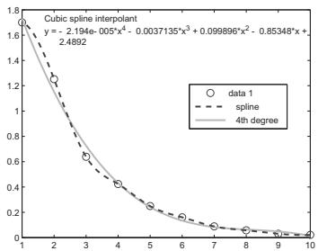
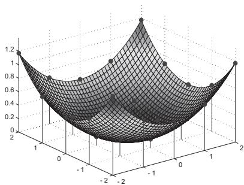
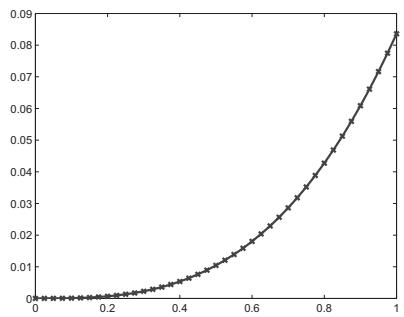
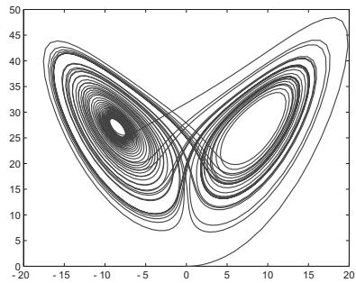

##### 19.8.4.1 Matlab

The commercial program system Matlab Matlab (Matrix Laboratory) is an interactive environment for solving mathematically formulated problems and in the same time it is a high level script language for scientific technical computations. The set up priorities are the problems and algorithms of linear algebra. Matlab unifies the convenient well developed implementations of numerical procedures with advanced graphical representation of the results and data. The computations are processed mostly with double precision floating point numbers according to IEEE–standards (see Table19.4, p. 1004). As further alternatives which are compatible to Matlab are the systems Scilab and Octave with free downloads.

1. Functions Survey

There is a short survey of the procedures and functions available in Matlab:

General Mathematical Functions

1. Trigonometry

5. Coordinate transformations

2. Exponential functions, Logarithms

6. Round-of and fractions

3. Special functions

7. Discrete mathematics

4. Complex arithmetic

8. Mathematical constants

Numerical Linear Algebra

1. Manipulation of fields and matrices

2. Special matrices

5. Eigenvalues and singular values

3. Matrix analyzes (norms, condition)

6. Matrix factorization

4. Systems of linear equations

7. Matrix functions

8. Methods for sparse matrices

Numerical Methods

1. Calculation of statistical data

2. Correlation and regression

7. Determination of the convex closures

8. Numerical integration

3. Discrete Fourier transformation

9. Ordinary diferential equations

4. Polynomials and splines

10. Partial diferential equations

5. One- and more-dimensional interpolation

11. Non-linear equations

6. Triangulations and decompositions

12. Minimization of functions

In addition there are several program packages of Matlab, the so called toolbooxes, which can be applied in the cases of special mathematical classis of problems. As some examples can be mentioned here the curve fitting, filtering, business mathematics, time series analysis, signal and pattern processing, neural networks, optimization, partial diferential equations, splines, statistics and wavelets.

In the following paragraphs the possibilities of Matlab are demonstrated by simple examples. The same problems are partially discussed here as in the paragraphs of numerical applications of Mathematica and Maple.

2. Numerical Linear Algebra

After starting with Matlab the command prompt >> appears in the command window to indicate the readiness to accept commands. If a command is not closed by a semicolon, then the result appears in the command window. The basic command to solve a system of linear equations $\mathbf { A } \underline { { \mathbf { x } } } = \underline { { \mathbf { b } } }$ (see 19.2.1, p. 955) is the backslash operator .

Given matrix $\mathbf { A } = { \left( \begin{array} { l } { 1 \mathrm { ~ 0 ~ 3 ~ } } \\ { 2 \mathrm { ~ 1 ~ 1 ~ } } \\ { 1 \mathrm { ~ 2 ~ 3 ~ } } \end{array} \right) }$ and vector $\underline { { \mathbf { b } } } = ( - 2 , 3 , 2 ) ^ { T }$ . For the input

$$
\begin{array} { r l } { > > } & { { } \mathrm { ~ \mathsf { A } = [ 1 ~ 0 ~ 3 ; 2 ~ 1 ~ 1 ; 1 ~ 2 ~ 3 ] , ~ } \mathrm { ~ \mathsf { b } = [ - 2 ; 3 ; 2 ] , ~ } \mathrm { ~ \mathsf { x } = A \backslash b , ~ } \quad \mathtt { n o r m ( A * x - b ) } } \end{array}
$$

the output is

$$
\begin{array} { r l r } { 1 \ 0 \ 3 } & { } & { - 2 } \\ { { \tt A } = 2 \ 1 \ 1 } &  { \tt b } =  \begin{array} { r l r } { 3 } & { } & { 1 . 0 0 0 0 } \\ { 3 } & { } & { { \tt x } = { \begin{array} { r l r } { 2 . 0 0 0 0 } & { } & { \mathrm { a n s } = 8 . 8 8 1 8 \mathrm { e } - 0 1 6 } \\ { - 1 . 0 0 0 0 } & { } & { } \end{array} } } \end{array} \end{array}
$$

As the Euclidean norm of the residual shows the obtained solution x (for which not all the digits are shown) satisfies the system of equations with an accuracy allowed by the mashine floating point representation.

If the matrix A is quadratic and nonsingular, then the linear system has a unique solution. By the backslash operator ordinary the Gaussian elimination is used with column pivoting, i.e., a triangle decomposition $\mathbf { P A } = \mathbf { L R }$ is obtained (see 19.2.1.1, p. 955).

The triangle decomposition of A can be realized also with the input

$$
\begin{array} { r l r } { \mathrm { > > } } & { { } } & { [ \mathrm { L } , \mathrm { R } , \mathrm { P } ] = \mathrm { 1 u } ( \mathrm { A } ) } \end{array}
$$

giving the output

$$
\begin{array} { r l } { \mathsf { L } = \left( \begin{array} { c c c } { 1 . 0 0 0 0 } & { 0 } & { 0 } \\ { 0 . 5 0 0 0 } & { 1 . 0 0 0 0 } & { 0 } \\ { 0 . 5 0 0 0 } & { - 0 . 3 3 3 3 } & { 1 . 0 0 0 0 } \end{array} \right) } & { { } \mathsf { R } = \left( \begin{array} { c c c } { 2 . 0 0 0 0 1 . 0 0 0 0 1 . 0 0 0 0 } & { 1 . 0 0 0 0 } \\ { 0 } & { 1 . 5 0 0 0 2 . 5 0 0 0 } \\ { 0 } & { 0 } & { 3 . 3 3 3 3 } \end{array} \right) } & { { } \mathsf { P } = \left( \begin{array} { l } { 0 \mathrm { ~ 1 ~ } 0 } \\ { 0 \mathrm { ~ } 0 \mathrm { ~ 1 ~ } } \\ { 1 \mathrm { ~ } 0 \mathrm { ~ 0 ~ } } \end{array} \right) } \end{array}
$$

(Here the matrices are given in brackets in order to avoid confusion).

The backslash operator first tests the properties of the coeficient matrix A. If A is a permutation of a triangle matrix, then the corresponding echelon form is solved. For a symmetric A the Cholesky method is applied (see 19.2.1.2, p. 958).

If the condition number of the coeficient matrix A is too high, then numerical problems can occure during the solution. Because of this problem, during the procedure Matlab calculates an estimation of the reciprocal value of the condition number, and gives a warning if it is too small.

The Hilbert matrix $\mathbf { H } = \left( h _ { i k } \right)$ of order $n = 1 3$ can serve as an example, where $h _ { i k } = 1 / ( i + k - 1 )$

$$
> > \mathbf { x } = \mathrm { { h i } } 1 \mathrm { { b } } ( 1 3 ) \backslash \mathrm { { o n e s } } ( 1 3 , 1 ) ;
$$

Warning: Matrix is close to singular or badly scaled.

Results may be inaccurate. $\mathrm { R C O N D } = 2 . 4 0 9 3 \dot { 2 } 0 { \bf e } { \bf - } 0 1 7 .$

In the case of overdetermined linear systems the corresponding linear fitting problem is handled by an orthogonalization procedure, i.e. by orthogonal transformations into a QR-decomposition $\mathbf { A } = \mathbf { Q R }$

$$
 \begin{array} { r l } & { { \mathrm { ( s e e ~ 1 9 2 . 1 . 3 , p . 9 5 B ) } } . } \\ & { \leq \quad 5 \quad \quad \quad \quad \quad \quad \quad \quad \quad \quad \quad \quad \quad \quad \quad \quad \quad \quad \quad \quad \quad \quad \quad \quad \quad \quad \quad \quad \quad \quad \quad \quad \quad \quad \quad \quad \quad \quad \quad \quad \quad \quad \quad \quad \quad \quad \quad \quad \quad \quad \quad \quad \quad \quad \quad \quad \quad \quad \quad \quad \quad \quad \quad \quad \quad \quad \quad \quad \quad \quad \quad \quad \quad \quad \quad \quad \quad \quad \quad \quad \quad \quad \quad \quad \quad \quad \quad \quad \quad \quad \quad \quad \quad \quad \quad \quad \quad } \\ & { \quad \quad \quad \quad \quad \quad \quad \quad \quad \quad \quad \quad \quad \quad \quad \quad \quad \quad \quad \quad \quad \quad \quad \quad \quad \quad \quad \quad \quad \quad \quad \quad \quad \quad \quad \quad \quad \quad \quad \quad \quad \quad \quad \quad \quad \quad \quad \quad \quad \quad \quad \quad \quad \quad \quad \quad \quad \quad \quad \quad \quad \quad \quad \quad \quad \quad \quad \quad } \\ & { \quad \quad \quad \quad \quad \quad \quad \quad \quad \quad \quad \quad \quad \quad \quad \quad \quad \quad \quad \quad \quad \quad \quad \quad \quad \quad \quad \quad \quad \quad \quad \quad \quad \quad \quad \quad \quad \quad \quad \quad \quad \quad \quad \quad \quad \quad \quad \quad \quad \quad \quad \quad \quad \quad \quad \quad \quad \quad \quad \quad \quad \quad } \\ & { \quad \quad \quad \quad \quad \quad \quad \quad \quad \quad \quad \quad \quad \quad \quad \quad \quad \quad \quad \quad \quad \quad \quad \quad \quad \quad \quad \quad \quad \quad \quad \quad \quad \quad \quad \quad \quad \quad \quad \quad \quad \quad \quad \quad \quad \quad \quad \quad \quad \quad \quad \quad \quad \quad \quad \quad \quad \quad \quad \quad \quad \quad \quad \quad \quad \quad \quad } \\ &  \leq \quad \quad \quad \quad \quad \quad \quad \quad \quad \quad \quad \quad \quad \quad \quad \quad \quad \quad \quad \quad \quad \quad \quad \quad \quad \quad \quad \quad \quad \quad \quad \quad \quad \quad \quad \quad \quad \quad \quad \quad \quad \quad \quad \quad \quad \quad \quad \quad \quad \quad \quad \ \end{array}
$$

The backslash operator also gives meaningful results in the cases of underdetermined and rank deficient linear systems of equations. The details of these cases with the ways how to handle large sparse matrices can be found in the corresponding documentation of Matlab and in the introductions [19.20], [19.29].

3. Numerical Solution of Equations

A polynomial

$$
p ( x ) = a _ { n } x ^ { n } + a _ { n - 1 } x ^ { n - 1 } + \cdot \cdot \cdot + a _ { 1 } x + a _ { 0 }
$$

is in Matlab represented by the row vector $( a _ { n } , a _ { n - 1 } , \ldots , a _ { 1 } , a _ { 0 } )$ of the coeficients. Several functions are available to handle polynomials.

As an example the polynomial value at 1, the derivative (i.e. the coeficient vector of the derivative polynomial) and the roots are determined for the polynomial $p ( x ) = x ^ { 6 } + 3 x ^ { 2 } - 5$

$$
\begin{array} { r l } { > { } } & { { } { \mathsf { p } } = [ 1 \ 0 \ 0 \ 0 \ 3 \ 0 \ - 5 ] ; } \\ { \gg { } } & { { } { \mathsf { p o l y v a l } } ( { \mathsf { p } } , 1 ) { \quad \quad \mathrm { a n s } = - 1 } } \\ { \gg { } } & { { } { \mathsf { p o l y d e r } } ( { \mathsf { p } } ) { \quad \quad \mathrm { a n s } = 6 \ 0 \ 0 \ 6 \ 0 \ } } \\ { \gg { } } & { { } { \mathsf { r o o t s } } ( { \mathsf { p } } ) { \quad \mathrm { a n s } = 0 . 8 6 7 3 + 1 . 1 5 2 9 \mathrm { i } , 0 . 8 6 7 3 - 1 . 1 5 2 9 \mathrm { i } , 1 . 0 7 4 3 , } } \\ { { } } & { { } { \qquad - 0 . 8 6 7 3 + 1 . 1 5 2 9 \mathrm { i } , - 0 . 8 6 7 3 - 1 . 1 5 2 9 \mathrm { i } , - 1 . 0 7 4 3 } } \end{array}
$$

The roots are determined as the eigenvalues of the corresponding companion matrix.

The command fzero is used to find the approximate solutions of nonlinear scalar equations.

Calculation of three solutions of equation $e ^ { - x ^ { 3 } } - 4 x ^ { 2 } = 0 .$

$$
\begin{array} { r l r l } { > > } & { { } \operatorname { f } z \in \Upsilon \circ ( \ @ ( \mathbf { x } ) \in \mathbf { x } \mathbb { P } ( - \mathbf { x } ^ { \wedge } 3 ) - 4 * \mathbf { x } ^ { \wedge } 2 , 1 ) } & { } & { { } \mathrm { a n s } = 0 . 4 7 4 1 } \\ { > > } & { { } \operatorname { f } z \in \Upsilon \circ ( \ @ ( \mathbf { x } ) \in \mathbf { x } \mathbb { P } ( - \mathbf { x } ^ { \wedge } 3 ) - 4 * \mathbf { x } ^ { \wedge } 2 , 0 ) } & { } & { { } \mathrm { a n s } = - 0 . 5 4 1 3 } \\ { > > } & { { } \operatorname { f } z \in \Upsilon \circ ( \ @ ( \mathbf { x } ) \in \mathbf { x } \mathbb { P } ( - \mathbf { x } ^ { \wedge } 3 ) - 4 * \mathbf { x } ^ { \wedge } 2 , - 1 ) } & { } & { { } \mathrm { a n s } = - 1 . 2 0 8 5 } \end{array}
$$

The input of the equation for the command fzero is made as an unnamed function. As it is obvious, it depends on the given initial value in the second argument, which solution is approximated. A combination of the bisection method with regula falsi (see 19.1.1.3, p. 951) is used for the iteration process.

4. Interpolation

Function fitting based on a given data set can be done either by interpolation (see 19.6.1, p. 982 or 19.7.1.1, p. 996) or by best approximating functions (see 19.6.2.2, p. 985). In Matlab the command plot is the most simple way to represent the data set graphically. The menu in the selfopening graphical window contains tools for editing the figure (linetypes, symbols, titles and legends), for exporting and printing Basic Fitting under Tools.

The Basic Fitting is a subroutine of Tools by which a variety of interpolation methods and best approximating polynomials of diferent degrees are ofered. It is realized by the functions interp1 and polyfit.

By the input

>> plot([1.70045, 1.2523, 0.638803, 0.423479, 0.249091, 0.160321, 0.0883432, 0.0570776, 0.0302744, 0.0212794]);

the data values are located at the data positions 1, 2, . . . , 10 and are graphically represented. Fig.19.19a shows the data set, the corresponding cubic interpolation spline and the best approximating polynomial of degree four.

  
Figure 19.19 a) and b)

The Function interp2 ofers appropriate methods to interpolate the data given over a two dimensional rectangular grid (see 19.7.2.1, p. 998). To interpolate irregularly distributed data is served by calling griddata.

The command sequence

$$
\begin{array} { r l } { \gg \ } & { { } [ \mathtt { X } , \mathtt { Y } ] = \mathtt { m e s h g r i d } ( - 2 : 1 : 2 ) ; \quad \mathtt { F } = 4 - \mathtt { s q r t } ( 1 6 - \mathtt { X } . ^ { \wedge } 2 - \mathtt { Y } . ^ { \wedge } 2 ) ; } \end{array}
$$

$$
\begin{array} { r l r } { \mathrm { > > ~ } } & { [ \mathrm { X e , Y e } ] = \tt m e s h g r i d ( - 2 : 0 . 1 : 2 ) ; } & { { } \mathrm { S = i n t e r p 2 ( X , Y , F , X e , Y e , ' s p l i n e ' ) ; } } \end{array}
$$

>> surf(Xe, Ye, S)

>> hold on; stem3(X, Y, F, fill)

realizes the bivariable cubic spline interpolation of the function $f ( x , y ) = \sqrt { 1 6 - x ^ { 2 } - y ^ { 2 } }$ given on a grid. The interpolation spline is evaluated on a finer rectangular grid. Fig.19.19b represents the interpolation function where the data points are also shown.

5. Numerical Integration

Numerical integration is available in Matlab by the procedures quad and quadl. Both procedures are based on the recursive application of interpolation quadratures with adaptive step-size selection. quad is based on the Simpson formula, and in quadl the Lobatto formulas of higher order are applied (see 19.3.2, p. 964). In the case of suficiently smooth integrand and higher accuracy requirements quadl works more efectively than quad.

As the first example the approximation of the definite integral $I = \int _ { 0 } ^ { 1 } { \frac { \sin { x } } { x } } $ dx (Integral sine see 8.2.5,1. p. 513) is considered.

$$
\begin{array} { r l } { > > } & { { } \mathrm { ~ f o r m a t ~ \mathrm { 1 o n g } ; ~ ~ \tau [ \mathrm { I , ~ f u e r t e } ] = \mathrm { q u a d } ( \mathbb { O } ( \mathbf { x } ) ( \mathrm { s i n } ( \mathbf { x } ) . / \mathbf { x } ) , 0 , 1 ) } } \end{array}
$$

Warning: Divide by zero. > In @(x)(sin(x)./x) In quadl at 64

Warning: Divide by zero. > In @(x)(sin(x)./x) In quad at 62

I = 0.94608307007653 fwerte = 14

$$
\begin{array} { r l r } { \gg } & { { } \mathrm { ~ f o r m a t ~ l o n g ; ~ } } & { [ \mathrm { I , f w e r t e } ] = \mathtt { q u a d l } ( \ @ ( \mathbf { x } ) ( \mathtt { s i n } ( \mathbf { x } ) . / \mathbf { x } ) , 0 , 1 ) } \end{array}
$$

I = 0.94608307036718 fwerte = 19

Both procedures obviously recognize the discontinuity of the integrand at the left endpoint of the interval, but the approximated value of the integral can be obtained without any dificulty. Based on the results of the same example in 19.3.4.2, p. 968 the number of function evaluations seems to be high but it is determined for the adaptive recursion.

$$
\begin{array} { r l } { > > { } } & { { } { \mathrm { ~ f ~ o r m a t ~ } } 1 \mathrm { o n g } ; \quad [ \mathrm { I } , \mathbf { f } { \mathrm { ~ w e r t e } } ] = { \mathrm { q u a d } } ( \mathbb { G } ( \mathbf { x } ) ( \mathbf { s i n } ( \mathbf { x } ) . / \mathbf { x } ) , 0 , 1 , 1 \in - 1 4 ) } \end{array}
$$

$$
\mathrm { I } = 0 . 9 4 6 0 8 3 0 7 0 3 6 7 1 8 \quad \mathrm { f w e r t e } = 2 5 8
$$

$$
\begin{array} { r l } { > > { } } & { { } { \mathrm { f o r m a t ~ 1 o n g } } ; \quad [ { \mathrm { I } } , { \mathrm { f } } { \mathrm { w e r t e } } ] = { \mathrm { q u a d l } } ( \ @ ( { \mathbf x } ) ( { \mathbf s i n } ( { \mathbf x } ) . / { \mathbf x } ) , 0 , 1 , 1 { \mathbf e } - 1 4 ) } \end{array}
$$

$$
\mathrm { I } = 0 . 9 4 6 0 8 3 0 7 0 3 6 7 1 8 \quad \mathrm { f w e r t e } = 1 9
$$

(The warning messages are not repeated here.) The determination of the accuracy of $1 0 ^ { - 1 4 }$ , which is given as a further argument (the default is a $1 0 ^ { - 6 }$ tolerance), makes the advantages of quadl obvious in this case.

The definite integral $I = \int _ { - 1 0 0 0 } ^ { 1 0 0 0 } e ^ { - x ^ { 2 } } d x \mathrm { i s } \mathrm { t o b e } \mathrm { d e t e r m i n e d } .$

$$
\begin{array} { r l } { \gg { } } & { { } { \mathrm { \ f o r m a t \ 1 o n g ; } } \quad [ { \mathrm { I } } , { \mathrm { \ f u e r t e } } ] = { \mathrm { q u a d } } ( \mathbb { G } ( \mathbf { x } ) ( \exp ( - \mathbf { x } . { \hat { \mathbf { \xi } } } ^ { { \hat { } } } 2 ) ) , - 1 0 0 0 , 1 0 0 0 , 1 \in - 1 0 ) } \end{array}
$$

I = 1.77245385094233 fwerte = 585

$$
\begin{array} { r l } { \gg { } } & { { } \mathrm { \ f o r m a t \ 1 o n g ; ~ } \quad [ \mathrm { I } , \mathrm { f } \mathrm { w e r t e } ] = \mathrm { q u a d l } \left( \mathbb { Q } ( \mathrm { x } ) { \left( \exp ( - \mathrm { x } \cdot ^ { \wedge } 2 ) \right) } , - \ 1 0 0 0 , 1 0 0 0 , 1 \mathrm { e } - 1 0 \right) } \end{array}
$$

I = 1.77245385090571 fwerte = 768

The flat shape of the integrand in a very wide part of the integration interval and the relatively steep peak at $x = 0$ make quad better in this case.

6. Numerical Solution of Diferential Equations

Matlab ofers several procedures to determine the numerical solutions of initial value problems of systems of first order ordinary diferential equations. A standard procedure is ode45, in which Runge-Kutta methods of 4-th and 5-th order are applied with adaptive step-size selection (see 19.4.1.2, p. 969). To achieve higher accuracy the program ode113 is more efective with implemented linear multi-step methods of predictor-corrector type (see 19.4.1.4, p. 971). Besides there are procedures which are especially efective for stif systems of diferential equations (see 19.4.1.5,4., p. 973).

To solve the problem $y ^ { \prime } = { \frac { 1 } { 4 } } ( x ^ { 2 } + y ^ { 2 } ) , \ y ( 0 ) = 0$ , by the Runge-Kutta method (see 19.4.1.2, p. 970) in the interval [0, 1] the input is

$$
\begin{array} { r l } { \gg } & { { } [ \mathbf { x } , \mathbf { y } ] = { \mathsf { o d e } } 4 5 ( \mathbb { G } ( \mathbf { x } , \mathbf { y } ) ( ( \mathbf { x } . ^ { 2 } + \mathbf { y } . ^ { 2 } ) . / 4 ) , [ 0 \mathbf { \xi } ] , 0 ) ; \quad \mathsf { p l o t } ( \mathbf { x } , \mathbf { y } ) } \end{array}
$$

The shape of the resulted solution is represented in Fig.19.20a.

To solve the special Lorenz-system (see in 17.2.4.3, p. 887)

$$
x _ { 1 } ^ { \prime } = 1 0 ( x _ { 2 } - x _ { 1 } ) , \quad x _ { 2 } ^ { \prime } = 2 8 x _ { 1 } - x _ { 2 } - x _ { 1 } x _ { 3 } , \quad x _ { 3 } ^ { \prime } = x _ { 1 } x _ { 2 } - { \frac { 8 } { 3 } } x _ { 3 }
$$

in the interval $0 \leq t \leq 5 0$ with initial conditions $x ( 0 ) = ( 0 , 1 , 0 ) ^ { T }$ the following commands are used:

$$
\begin{array} { r l } { > > } & { { } [ \mathbf { t } , \mathbf { x } ] = { \mathsf { o d e } } 4 5 ( \mathbb { G } ( \mathbf { t } , \mathbf { x } ) ( \left[ 1 0 * ( \mathbf { x } ( 2 ) - \mathbf { x } ( 1 ) \right] ) ; } \end{array}
$$

$$
2 8 * \mathbf { x } ( 1 ) - \mathbf { x } ( 2 ) - \mathbf { x } ( 1 ) * \mathbf { x } ( 3 ) ; \mathbf { x } ( 1 ) * \mathbf { x } ( 2 ) - 8 * \mathbf { x } ( 3 ) / 3 ] ) , [ 0 \ 5 0 ] , [ 0 ; 1 ; 0 ] ) ;
$$

$$
\begin{array} { r l } { > > } & { { } \mathtt { p l o t } ( \mathbf { x } ( : , 1 ) , \mathbf { x } ( : , 3 ) ) } \end{array}
$$

  
Figure 19.20 a) and b)  
The last command creates a phase-diagram in the $x _ { 1 } , x _ { 3 }$ plane (see Fig.19.20b).
