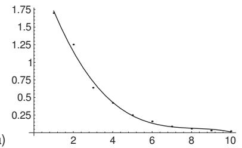
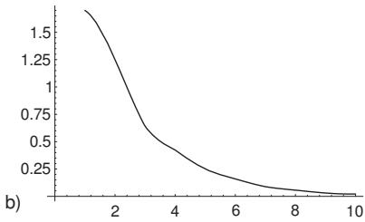

##### 19.8.4.2 Mathematica

1. Tools for the Solution of Numerical Problems

The computer algebra system Mathematica ofers a very efective tool that can be used to solve a large variety of numerical mathematical problems. The numerical procedures of Mathematica are totally different from symbolic calculations. Mathematica determines a table of values of the considered function according to certain previously given principles, similarly to the case of graphical representations, and it determines the solution using these values. Since the number of points must be finite, this could be a problem with “ badly ” behaving functions. Although Mathematica tries to choose more nodes in problematic regions, we have to suppose a certain continuity on the considered domain. This can be the cause of errors in the final result. It is advised to use as much information as possible about the problem under consideration, and if it is possible, then to perform calculations in symbolic form, even if this is possible only for subproblems.

In Table 19.5, we represent the operations for numerical computations:

Table 19.5 Numerical operations
<table><tr><td>NIntegrate</td><td>calculates definite integrals</td></tr><tr><td>NSum</td><td> $\sum _ { i = 1 } ^ { n } f ( i )$  calculates sums</td></tr><tr><td>NProduct</td><td>calculates products</td></tr><tr><td>NSolve</td><td>numerically solves algebraic equations</td></tr><tr><td>NDSolve</td><td>numerically solves differential equations</td></tr></table>

After starting Mathematica the “ Prompt ” In[1] := is shown; it indicates that the system is ready to except an input. Mathematica denotes the output of the corresponding result by Out[1]. In general: The text in the rows denoted by In[n] := is the input. The rows with the sign Out[n] are given back by Mathematica as answers. The arrow > in the expressions means, e.g., replace x by the value a.

2. Curve Fitting and Interpolation

1. Curve Fitting Mathematica can perform the fitting of chosen functions to a set of data using the least squares method (see 6.2.5, p. 454f.) and the approximation in mean to discrete problems (see 19.6.2.2, p. 986). The general instruction is:

$$
\mathbb { F } \mathrm { i } \mathrm { t } [ \{ y _ { 1 } , y _ { 2 } , \underline { { \tau } } \cdot \cdot \cdot \} , f u n k t , x ] .\tag{19.291}
$$

Here the values $y _ { i }$ form the list of data, funkt is the list of the chosen functions, by which the fitting should be performed, and x denotes the corresponding domain of the independent variables. If funkt is chosen, $\mathrm { e . g . }$ , as Tabl $\mathsf { \Omega } \cdot \mathsf { e } [ x ^ { \wedge } i , \{ i , 0 , n \} ]$ , then the fitting will be made by a polynomial of degree n.

Let the following list of data be given:

$$
I n [ t ] : = l = \{ 1 . 7 0 0 4 5 , 1 . 2 5 2 3 , 0 . 6 3 8 8 0 3 , 0 . 4 2 3 4 7 9 , 0 . 2 4 9 0 9 1 , 0 . 1 6 0 3 2 1 , 0 . 0 8 8 3 4 3 2 , 0 . 0 5 7 0 7 7 6 , 0 . 1 4 2 4 0 9 1 , 0 . 1 5 7 7 9 9 9 1 \} .
$$

0.0302744, 0.0212794

With the input

$$
I n [ 2 ] : = f 1 = \mathrm { F i t } [ l , \{ 1 , x , x ^ { \wedge } 2 , x ^ { \wedge } 3 , x ^ { \wedge } 4 \} , x ]
$$

it is supposed that the elements of l are assigned to the values 1, 2, . . . , 10 of x. The result is the following approximation polynomial of degree four:

$$
O u t \ : [ 2 7 = 2 . 4 8 9 1 8 - 0 . 8 5 3 4 8 7 x + 0 . 0 9 9 8 9 9 6 x ^ { 2 } - 0 . 0 0 3 7 1 3 9 3 x ^ { 3 } - 0 . 0 0 0 0 2 1 9 2 2 4 x ^ { 4 }
$$

With the command

$$
I n [ 3 ] : = \mathrm { P l o t } [ \mathrm { L i s t P l o t } [ l , \{ x , 1 0 \} ] , f 1 , \{ x , 1 , 1 0 \} , \mathrm { A x e s 0 r i g i n { \to } \{ 0 , 0 \} } ]
$$

a representation of the data and the approximation curve given in Fig. 19.21a can be obtained.



  
Figure 19.21

For the given data this is completely satisfactory. The terms are the first four terms of the series expansion of $e ^ { 1 - 0 . 5 x }$

2. Interpolation Mathematica ofers special algorithms for the determination of interpolation functions. They are represented as so-called interpolating function objects, which are formed similarly to pure functions. The directions for using them are in Table 19.6. Instead of the single function values $y _ { i }$ a list of function values and values of specified derivatives can be given at the given points.

With In[3] := Plot[Interpolation[l][x], x, 1, 10 ] one gets Fig. 19.21b. Obviously Mathematica gives a precise correspondence to the data list.

Table 19.6 Commands for interpolation
<table><tr><td>Interpolation  $\left[ \{ y _ { 1 } , y _ { 2 } , . . . \} \right]$ </td><td>gives an approximation function with the values  $y _ { i }$  for the values as integers</td></tr><tr><td>Interpolation  $[ \{ \{ x _ { 1 } , y _ { 1 } \} , \{ x _ { 2 } , y _ { 2 } \} , . . . \} ]$ </td><td> $x _ { i } = i$  gives an approximation function for the point-sequence  $( x _ { i } , y _ { i } )$ </td></tr></table>

3. Numerical Solution of Polynomial Equations

As shown in 20.3.2.1, p. 1038 Mathematica can determine the roots of polynomials numerically. The command is NSolve $[ p [ x ] = = 0 , x , n ]$ ], where n prescribes the accuracy by which the calculations should be done. If n is omitted, then the calculations are made to machine accuracy. The complete solution is got, i.e., m roots, if the input polynomial is of degree m.

$$
\mathtt { I n } [ 1 ] : = \mathtt { N S o l v e } [ x ^ { \wedge } 6 + 3 x ^ { \wedge } 2 - 5 = = 0 ]
$$

$$
0 u t [ t ] = \{ x  - 1 . 0 7 4 3 2 \} , \{ x  - 0 . 8 6 7 2 6 2 - 1 . 1 5 2 9 2 \} , \{ x  - 0 . 8 6 7 2 6 2 + 1 . 1 5 2 9 2 \} ,
$$

```javascript
x > 0.867262 1.15292I , x > 0.867262 + 1.15292I , x > 1.07432 .
```

4. Numerical Integration

For numerical integration Mathematica ofers the procedure NIntegrate. Diferently from the symbolical method, here it works with a table of values of the integrand. Two improper integrals are considered (see 8.2.3, p. 506) as examples.

A: In[1] := NIntegrate[Exp[ x∧2], x, Infinity, Infinity ] Out[1] = 1.77245.

B: In[2] := NIntegrate[1/x∧2, x, 1, 1 ]

Power::infy: Infinite expression $\frac { 1 } { 0 }$ encountered.

NIntegrate::inum: Integrand ComplexInfinity is not numerical $\mathrm { a t } \{ x \} = \{ 0 \}$

Mathematica recognizes the discontinuity of the integrand at $x = 0$ in example B and gives a warning. Mathematica applies a table of values with a higher number of nodes in the problematic domain, and it recognizes the pole. However, the answer can be still wrong.

Mathematica applies certain previously specified options for numerical integration, and in some special cases they are not suficient. The minimal and the maximal number of recursion steps, by which Mathematica works in a problematic domain, can be determined with parameters MinRecursion and MaxRecursion. The default options are always 0 and 6. If these values are increased, then although Mathematica works slower, it gives a better result.

In[3] := NIntegrate[Exp[ x∧2], x, 1000, 1000 ] Mathematica cannot find the peak at $x = 0$ since the integration domain is too large, and the answers is:

NIntegrate::ploss:

Numerical integration stopping due to loss of precision. Achieved neither the requested PrecisionGoal nor AccuracyGoal; suspect one of the following: highly oscillatory integrand or the true value of the integral is 0.

Out[3] = 1.34946 10−<sup>26</sup>

If the requirement is

$$
I n [ 4 ] : = \mathrm { N I n t e g r a t e } \big [ \mathrm { E x p } \big [ - \mathrm { x } ^ { \wedge } 2 \big ] , \{ x , - 1 0 0 0 , 1 0 0 0 \} , \mathtt { M i n R e c u r s i o n } \to 3 , \mathtt { M a x R e c u r s i o n } \to 1 0 \big ] ,
$$

then the result is

```python
Out[4] = 1.77245
```

Similarly, a result closer to the actual value of the integral can be got with the command:

```prolog
NIntegrate[fun, x, x<sub>a</sub>, x<sub>1</sub>, x<sub>2</sub>, . . . , x<sub>e</sub> ].
```

(19.292)

One can give the points of singularities $x _ { i }$ between the lower and upper limit of the integral to force Mathematica to evaluate more accurately.

5. Numerical Solution of Diferential Equations

In the numerical solution of ordinary diferential equations and also in the solution of systems of diferential equations Mathematica represents the result by an InterpolatingFunction. It allows us to get the numerical values of the solution at any point of the given interval and also to sketch the graphical representation of the solution function. The most often used commands are represented in Table 19.7.

Table 19.7 Commands for numerical solution of diferential equations
<table><tr><td> $\mathtt { N D S o l v e } [ d g l , y , \{ x , x _ { a } , x _ { e } \} ]$ </td><td>computes the numerical solution of the differential equation</td></tr><tr><td>InterpolatingFunction[liste][x]</td><td>in the domain between  $x _ { a }$  and  $x _ { e }$  gives the solution at the point  $x$ </td></tr><tr><td>Plot[Evaluate[y[x]/. lös]],  $\{ x , \stackrel { \cdot } { x _ { a } } , x _ { e } \} ]$ </td><td>scetches the graphical representation</td></tr></table>

Solution of a diferential equation describing the motion of a heavy object in a medium with friction. The equations of motion in two dimensions are

$$
\ddot { x } = - \gamma \sqrt { \dot { x } ^ { 2 } + \dot { y } ^ { 2 } } \cdot \dot { x } , \quad \ddot { y } = - g - \gamma \sqrt { \dot { x } ^ { 2 } + \dot { y } ^ { 2 } } \cdot \dot { y } .
$$

The friction is supposed to be proportional to the velocity. If $g = 1 0 , \gamma = 0 . 1$ are substituted, then the following command can be given to solve the equations of motion with initial values $x ( 0 ) = y ( 0 ) = 0$ and $\dot { x } ( 0 ) \bar { = } 1 0 0 , \dot { y } ( 0 ) = 2 0 0 \mathrm { : }$

$$
\begin{array} { r } { I n [ t ] : = d g = \mathbb { N } \mathsf { D } \mathsf { S } \circ \mathsf { 1 v e } [ \{ x ^ { \prime \prime } [ t ] = = - 0 . 1 \mathsf { S q r t } [ x ^ { \prime } [ t ] ^ { \wedge } 2 + y ^ { \prime } [ t ] ^ { \wedge } 2 ] \ x ^ { \prime } [ t ] , y ^ { \prime \prime } [ t ] = = - 1 0 } \end{array}
$$

$$
- 0 . 1 8 \mathbf { q } \thinspace \mathbf { r } \mathbf { t } \lbrack x ^ { \prime } [ t ] ^ { \wedge } 2 + y ^ { \prime } [ t ] ^ { \wedge } 2 \rbrack \ y ^ { \prime } [ t ] , x [ 0 ] = = y [ 0 ] = = 0 , x ^ { \prime } [ 0 ] = = 1 0 0 , y ^ { \prime } [ 0 ] = = 2 0 0 \} ,
$$

$$
\{ x , y \} , \{ t , 1 5 \} ]
$$

Mathematica gives the answer by the interpolating function:

Out[1] = x > InterpolatingFunction[ 0., 15. , <>],

y > InterpolatingFunction[ 0., 15. , <>]

The solution

$$
I n [ 2 ] : = \mathrm { P a r a m e t r i c P l o t } [ \{ x [ t ] , y [ t ] \} / . d g , \{ t , 0 , 2 \} , \mathrm { P l o t R a n g e } \to \mathrm { A l 1 } ]
$$

is represented as a parametric curve (Fig. 19.22a).

NDSolve accepts several options which afect the accuracy of the result.

The accuracy of the calculations can be given by the command AccuracyGoal. The command PrecisionGoal works similarly. During calculations, Mathematica works according to the so-called WorkingPre cision, which should be increased by five units in calculations requiring higher accuracy.

The numbers of steps by which Mathematica works in the considered domain is prescribed as 500. In general, Mathematica increases the number of nodes in the neighborhood of the problematic domain. In the neighborhood of singularities it can exhaust the step limit. In such cases, it is possible to increase the number of steps by MaxSteps. It is also possible the prescribe Infinity for MaxSteps.

The equations for the Foucault pendulum are:

$$
\begin{array} { r } { \ddot { x } ( t ) + \omega ^ { 2 } x ( t ) = 2 \Omega \dot { y } ( t ) , \quad \ddot { y } ( t ) + \omega ^ { 2 } y ( t ) = - 2 \Omega \dot { x } ( t ) . } \end{array}
$$

With $\omega = 1 , \Omega = 0 . 0 2 5$ and the initial conditions $x ( 0 ) = 0 , y ( 0 ) = 1 0 , \dot { x } ( 0 ) = \dot { y } ( 0 ) = 0$ the solution is:

$$
\begin{array} { r } { T n / 3 \bar { \jmath } : = d g 3 = \mathbb { N } \mathsf { D } \mathsf { S } \circ \mathrm { 1 v e } \big [ \{ x ^ { \prime \prime } [ t ] = = - x [ t ] + 0 . 0 5 y ^ { \prime } [ t ] , y ^ { \prime \prime } [ t ] = = - y [ t ] - 0 . 0 5 x ^ { \prime } [ t ] , } \end{array}
$$

$$
x [ 0 ] = = 0 , y [ 0 ] = = 1 0 , x ^ { \prime } [ 0 ] = = y ^ { \prime } [ 0 ] = = 0 \} , \{ x , y \} , \{ t , 0 , 4 0 \} \}
$$

Out[3] = x > InterpolatingFunction[ 0., 40. , <>],

y > InterpolatingFunction[ 0., 40. , <>]

With

$$
\begin{array} { r } { I n [ 4 ] : = \mathrm { P a r a m e t r i c P l o t } [ \{ x [ t ] , y [ t ] \} / . d g 3 , \{ t , 0 , 4 0 \} , \mathrm { A s p e c t R a t i o - }  1 ] } \end{array}
$$

one gets Fig. 19.22b.
