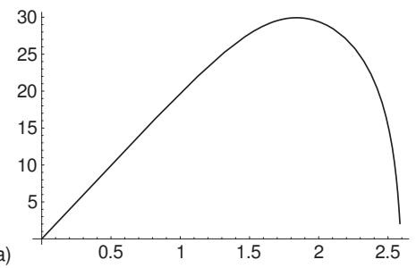
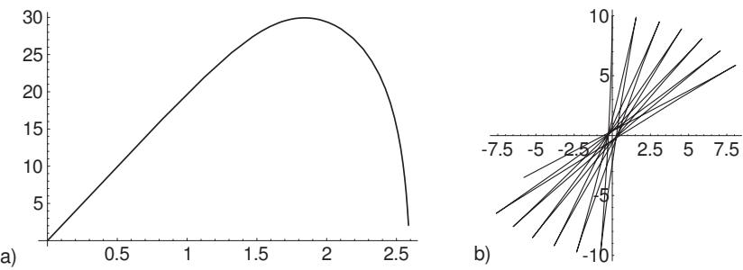

##### 19.8.4.3 Maple

The computer algebra system Maple can solve several problems of numerical mathematics with the use of built-in approximation methods. The number of nodes, which is required by the calculations, can be determined by specifying the value of the global variable Digits as an arbitrary n. But it should be kept in mind that selecting a higher n than the prescribed value results in a lower speed of calculation.

1. Numerical Calculation of Expressions and Functions

After starting Maple, the symbol “ Prompt ” > is shown, which denotes the readyness for input. Connected in- and outputs are often represented in one row, separated by the arrow operator .

a)

  
Figure 19.22

1. Operator evalf Numerical values of expressions containing built-in and user-defined functions which can be evaluated as a real number, can be calculated with the command

$$
\mathtt { e v a l f } ( e x p r , n )\tag{19.293}
$$

expr is the expression whose value should be determined; the argument n is optional, it is for evaluation to n digits accuracy. Default accuracy is set by the global variable Digits.

Prepare a table of values of the function $y = f ( x ) = { \sqrt { x } } + \ln x$

First, the function is defined by the arrow operator:

$$
> f : = z  \mathbf { s q r t } ( z ) + \ln ( z ) ; \longrightarrow f : = z  { \sqrt { x } } + \ln x .
$$

Then the required values of the function can be got with the command evalf $( f ( x ) ) ;$ , where a numerical value should be substituted for x.

A table of values of the function with steps size 0.2 between 1 and 4 can be obtained by

$$
> { \mathrm { f o r ~ } } x { \mathrm { ~ f r o m ~ 1 ~ b y ~ 0 . 2 ~ t o ~ 4 ~ d o ~ p r i n t } } ( f [ x ] = { \mathrm { e v a l f } } \left( f ( x ) , 1 2 \right) ) { \mathrm { ~ o d } } ;
$$

Here, it is required to work with twelve digits.

Maple gives the result in the form of a one-column table with elements in the form $f _ { [ 3 . 2 ] } = 2 . 9 5 2 0 0 5 1 9 1 8 1$

2. Operator evalhf(expr): Beside evalf there is the operator evalhf. It can be used in a similar way to evalf. Its argument is also an expression which has a real value. It evaluates the symbolic expression numerically, using the hardware floating-point double-precision calculations available on the computer. A Maple floating-point value is returned. Using evalhf speeds up your calculations in most cases, but you lose the definiable accuracy of using evalf and Digits together. For instance in the problem in 19.8.2, p. 1004, it can produce a considerable error.

2. Numerical Solution of Equations

By using Maple equations or systems of equations can be solved numerically in many cases.

The command to do this is fsolve. It has the syntax

$$
\mathtt { f s o l v e ( e q n , v a r , o p t i o n ) . }\tag{19.294}
$$

This command determines real solutions. If eqn is in polynomial form, the result is all the real roots. If eqn is not in polynomial form, it is likely that fsolve will return only one solution. The available options are given in Table 19.8.

Table 19.8 Options for the command fsolve
<table><tr><td>complex</td><td>determines a complex root (or all roots of a polynomial)</td></tr><tr><td>maxsols = n</td><td>determines at least the n roots (only for polynomial equations)</td></tr><tr><td>fulldigits</td><td>ensures that fsolve does not lower the number of digits used during computations</td></tr><tr><td>intervall</td><td>looks for roots in the given interval</td></tr></table>

A: Determination of all solutions of a polynomial equation $x ^ { 6 } + 3 x ^ { 2 } - 5 = 0$ . With

$$
> ~ e q : = x ^ { \wedge } 6 + 3 * x ^ { \wedge } 2 - 5 = 0 :
$$

the result is

$$
> \ \mathbf { f s o l v e } ( e q , x ) ; \longrightarrow - 1 . 0 7 4 3 2 3 7 3 9 , 1 . 0 7 4 3 2 3 7 3 9
$$

Maple determined only the two real roots. With the option complex, also the complex roots are obtained:

$$
\begin{array} { r l } & { > \mathrm { ~ f ~ s _ 0 2 v e } ( e q , x , \mathrm { c o m p 1 e x } ) ; } \\ & { - 1 . 0 7 4 3 2 3 7 3 9 , - 0 . 8 6 7 2 6 2 0 2 4 4 - 1 . 1 5 2 9 2 2 0 1 2 \mathrm { I } , - 0 . 8 6 7 2 6 2 0 2 4 4 + 1 . 1 5 2 9 2 2 0 1 2 \mathrm { I } , } \\ & { \phantom { = } 0 . 8 6 7 2 6 2 0 2 4 4 - 1 . 1 5 2 9 2 2 0 1 2 \mathrm { I } , 0 . 8 6 7 2 6 2 0 2 4 4 + 1 . 1 5 2 9 2 2 0 1 2 \mathrm { I } , 1 . 0 7 4 3 2 3 7 3 9 } \end{array}
$$

B: Determination of both solutions of the transcendental equation $e ^ { - x ^ { 3 } } - 4 x ^ { 2 } = 0 .$ After defining the equation

$$
> ~ e q : = { \exp ( - x ^ { \wedge } 3 ) - 4 * x ^ { \wedge } 2 = 0 }
$$

the result is

$$
> { \bf { f s o l v e } } ( e q , x ) ; \longrightarrow 0 . 4 7 4 0 6 2 3 5 7 2
$$

as the positive solution. With

$$
> \ \mathbf { f s o l v e } ( e q , x , x = - 2 . . 0 ) ; \longrightarrow - 0 . 5 4 1 2 5 4 8 5 4 4
$$

Maple also determines the second (negative) root.

3. Numerical Integration

The determination of definite integrals is often possible only numerically. This is the case when the integrand is too complicated, or if the primitive function cannot be expressed by elementary functions. The command to determine a definite integral in Maple is evalf:

$$
\mathsf { e v a l f } ( \mathrm { i n t } ( f ( x ) , x = a . . b ) , n ) .\tag{19.295}
$$

Maple calculates the integral by using an approximation formula.

Calculation of the definite integral $\int _ { - 2 } ^ { 2 } \mathrm { e } ^ { - x ^ { 3 } } d x$ . Since the primitive function is not known, for the integral command the following answer is got

$$
> \ \mathrm { i n t } ( \exp ( - x ^ { \wedge } 3 ) , x = - 2 . . 2 ) ; \longrightarrow \int _ { - 2 } ^ { 2 } e ^ { - x ^ { 3 } } d x .
$$

If

$$
> \mathrm { \ e v a l f { ( i n t { ( e x p { ( - { x \mathord { / { \vphantom { { x ( { x \mathord { ( { { x ( { x \vphantom { x ) } } } } ) } } }  \kern - delimiterspace } { { x ( { { \mathrm { x } } } ) } }  \kern - delimiterspace } { { x } } } } } } } }  
$$

is typed,then the answer is 277.745841695583.

Maple used the built-in approximation method for numerical integration with 15 digits.

In certain cases this method fails, especially if the integration interval is too large. Then, another approximation procedure can be tried with the call to a library

$$
\mathtt { r e a d l i b ( \bar { \ e v a l f / i n t { \bar { \ } } } ) } ;
$$

which applies an adaptive Newton method.

The input

$$
> \ \mathsf { e v a l f } \left( \mathrm { i n t } ( \mathsf { e x p } ( - x ^ { \wedge } 2 ) , x = - 1 0 0 0 . . 1 0 0 0 ) \right) ;
$$

results in an error message. With

the correct result is obtained. The third argument specifies the accuracy and the last one specifies the internal notation of the approximation method.

4. Numerical Solution of Diferential Equations

Ordinary diferential equations can be solved with the Maple operation dsolve. However, in most cases it is not possible to determine the solution in closed form. In these cases, it can be solved numerically, where the corresponding initial conditions have to be given.

In order to do this, the command dsolve is used in the form

$$
\mathtt { d s o l v e } ( d e q n , v a r , \mathtt { n u m e r i c } )\tag{19.296}
$$

with the option numeric as a third argument. Here, the argument deqn contains the actual diferential equation and the initial conditions. The result of this operation is a procedure, and if it is denoted, e.g., by $f$ , for using the command $f ( t )$ , the value of the solution function at the value t of the independent variable is returned.

Maple applies the Runge-Kutta method to get this result (see 19.4.1.2, p. 969). The default accuracy for the relative and for the absolute error is $1 0 ^ { - } \mathrm { { D i g i t s } \mathrm { { + } 3 } }$ . The user can modify these default error tolerances with the global symbols RELERR and ABSERR. If there are some problems during calculations, then Maple gives diferent error messages.

At solving the problem given in the Runge-Kutta methods in 19.4.1.2, p. 970, Maple gives:

$$
\begin{array} { r l } & { > r : = \mathtt { d s o l v e } ( \{ \mathtt { d i f f } ( y ( x ) , x ) = ( 1 / 4 ) * ( x ^ { \wedge } 2 + y ( x ) ^ { \wedge } 2 ) , y ( 0 ) = 0 \} , y ( x ) , \mathtt { n u m e r i c } ) ; } \\ & { \ r : = \mathtt { p r o c } \ \mathtt { d s o l v e } / \mathtt { n u m e r i c } / \mathtt { r e s u l t 2 } ^ { \sim } ( x , 1 5 9 2 3 9 2 , [ 1 ] ) \mathrm { e n d } } \end{array}
$$

With

$$
> \ \mathbf { r } ( 0 . 5 ) ; \longrightarrow \{ x ( . 5 ) = 0 . 5 0 0 0 0 0 0 0 0 , y ( x ) ( . 5 ) = 0 . 0 1 0 4 1 8 6 0 4 7 2 \}
$$

we can determine the value of the solution, e.g., at x = 0.5.
