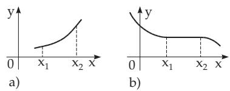
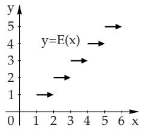
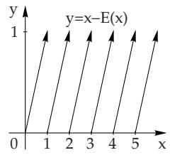
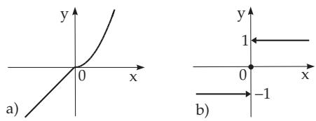

#### 2.1.2 Methods for Defining a Real Function

##### 2.1.2.1 Defining a Function

A function can be defined in several diferent ways, for instance by a table of values, by graphical representation, i.e., by a curve, by a formula, which is called an analytic expression, or piece by piece with diferent formulas. Only such values of the independent variable can belong to the domain of an analytic expression for which the function makes sense, i.e., it takes a unique, finite real value. If the domain is not otherwise defined, the domain is considered as the maximal set for which the definition makes sense.

##### 2.1.2.2 Analytic Representation of a Function

Usually the following three forms are in use:

1. Explicit Form:

$$
y = f ( x ) .\tag{2.4}
$$

■ $y = \sqrt { 1 - x ^ { 2 } } , \quad - 1 \leq x \leq 1 , \quad y \geq 0$ . Here the graph is the upper half of the unit circle centered at the origin.

2. Implicit Form:

$$
F ( x , y ) = 0 ,\tag{2.5}
$$

in the case when there is a unique y which satisfies this equation, or it can be told which solution is considered to be the value of the function.

$x ^ { 2 } + y ^ { 2 } - 1 = 0 , \quad - 1 \leq x \leq + 1 , \quad y \geq 0$ . Here the graph is again the upper half of the unit

circle centered at the origin. It should be emphasized that $x ^ { 2 } + y ^ { 2 } + 1 = 0$ itself does not define a real function.

3. Parametric Form:

$$
x = \varphi ( t ) , \quad y = \psi ( t ) .\tag{2.6}
$$

The corresponding values of x and y are given as functions of an auxiliary variable t, which is called a parameter. The functions $\varphi ( t )$ and $\psi ( t )$ must have the same domain. This representation defines a real function only if $x = \varphi ( t )$ defines a one-to-one correspondence between x and t.

$x = \varphi ( t ) , \quad y = \psi ( t )$ with $\varphi ( t ) = \cos t$ and $\psi ( t ) = \sin t$ $0 \leq t \leq \pi$ . Here the graph is again the upper half of the unit circle centered at the origin.

Remark: Functions given in parametric form sometimes do not have any explicit or implicit parameterfree equation.

x = t + 2 sin t = ϕ(t), y = t  cos t = ψ(t).

Examples for Functions Given Piece by Piece:

  
a)

  
b)  
Figure 2.1

$$
y = E ( x ) = \operatorname { i n t } ( x ) = [ x ] = n
$$

$$
n \leq x < n + 1 , n { \mathrm { ~ i n t e g e r } } .
$$

The function $E ( x )$ or int(x) (read “integer part $o f x ^ { \prime \prime } )$ means the greatest integer less than or equal to x.

B: The function $y = \operatorname { f r a c } ( x ) = x - [ x ]$ (read “fractional part $o f x ^ { \prime } )$ gives the diference of x and [x] (Fig. 2.1b). Fig. 2.1a,b shows the corresponding graphical representations, where the arrow-heads mean that the endpoints do not belong to the curves.

  
Figure 2.2

$$
\mathbf { \mathbb { C } } \colon \ : y = \left\{ \begin{array} { l } { x \mathrm { ~ f o r ~ } x \leq 0 , } \\ { x ^ { 2 } \mathrm { ~ f o r ~ } x \geq 0 , } \end{array} \right. \left( \mathrm { F i g . ~ 2 . 2 a } \right) .
$$

$$
\mathbf { D } \colon y \ = \ \mathrm { s i g n } ( x ) \ = \ \left\{ { \begin{array} { l } { - 1 \ \mathrm { f o r } \ x < 0 , } \\ { 0 \ \mathrm { f o r } \ x = 0 , } \\ { + 1 \ \mathrm { f o r } \ x > 0 , } \end{array} } \right.
$$

⎩(Fig. 2.2b). By sign(x) (read “signum $x ^ { , , } )$ , the sign function is denoted.
