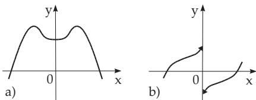
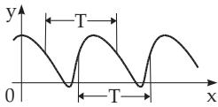
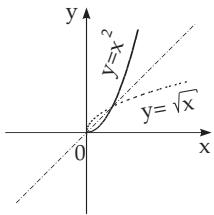
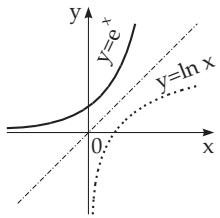
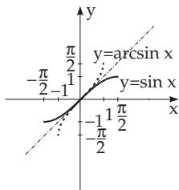

#### 2.1.3 CertainTypes of Functions

##### 2.1.3.1 Monotone Functions

If a function satisfies the relations

$$
f ( x _ { 2 } ) \geq f ( x _ { 1 } ) \quad { \mathrm { o r } } \quad f ( x _ { 2 } ) \leq f ( x _ { 1 } ) ,
$$

for arbitrary arguments $x _ { 1 }$ and $x _ { 2 }$ with $x _ { 2 } > x _ { 1 }$ in its domain, then it is called monotonically increasing or monotonically decreasing (Fig. 2.3a,b).

(2.7a)

Figure 2.3

If one of the above relations (2.7a) does not hold for every x in the domain of the function, but it is valid, $\mathrm { e . g . }$ , in an interval or on a half-axis, then the function is called monotonic in this domain. Functions satisfying the relations

$$
f ( x _ { 2 } ) > f ( x _ { 1 } ) \quad { \mathrm { o r } } \quad f ( x _ { 2 } ) < f ( x _ { 1 } ) ,\tag{2.2}
$$

i.e., when the equality never holds in (2.7a), are called strictly monotonically increasing or strictly monotonically decreasing. In Fig. 2.3a there is a representation of a strictly monotonically increasing function; in Fig. 2.3b there is the graph of a monotonically decreasing function being constant between $x _ { 1 }$ and $x _ { 2 }$

■ $y = e ^ { - x }$ is strictly monotonically decreasing, y = ln x is strictly monotonically increasing.

##### 2.1.3.2 Bounded Functions

A function is called bounded above if there is a number (called an upper bound) such that the values of the function never exceed it. A function is called bounded below if there is a number (called a lower bound) such that the values of the function are never less than this number. If a function is bounded above and below, it simply is called bounded.

A: $y = 1 - x ^ { 2 }$ is bounded above $( y \leq 1 )$ B: $y = e ^ { x }$ is bounded below $( y > 0 )$

C: $y = \sin x$ is bounded $( - 1 \leq y \leq + 1 )$ D: $y = { \frac { 4 } { 1 + x ^ { 2 } } }$ is bounded $( 0 < y \le 4 )$

##### 2.1.3.3 Extreme Values of Functions

The function f(x) with domain D has an absolute or global maximum at the point a, if for all $x \in D$

$$
f ( a ) \geq f ( x )\tag{2.8a}
$$

holds. The function $f ( x )$ has a relative or local maximum at the point a, if the inequality (2.8a) holds only in an environment of the point a, i.e. for all x with $a - \varepsilon < x < a + \varepsilon , \varepsilon > 0 , x \in D$

In analogy the definition of an absolute or global minimum as well as for a relative or local minimum can be given, but the inequality (2.8a) is to be replaced by

$$
f ( a ) \leq f ( x ) .\tag{2.8b}
$$

Remarks:

a) The notions maximum and minimum, are called the extreme values, they are not coupled to the diferentiability of functions, i.e., they hold also for functions which are not diferentiable in some points of the domain. Examples are discontinuities of curves (see Figs.2.9, p. 58 and 6.10b,c, p. 443).

b) Criterions for the determination of extreme values of diferentiable functions see in 6.1.5.2, p. 443.

##### 2.1.3.4 Even Functions

Even functions (Fig. 2.4a) satisfy the relation

$$
f ( - x ) = f ( x ) .
$$

If D is the domain of $f ,$ , then

$$
( x \in D ) \Rightarrow ( - x \in D )\tag{2.9a}
$$

should hold.

$$
\begin{array} { r } { \textbf { \textsf { A : } } y = \cos x , \ : \ : \ : \textbf { \textsf { B : } } y = x ^ { 4 } - 3 x ^ { 2 } + 1 . } \end{array}\tag{2.9b}
$$

##### 2.1.3.5 Odd Functions

Odd functions (Fig. 2.4b) satisfy the relation

  
Figure 2.4

$$
f ( - x ) = - f ( x ) .
$$

If D is the domain of $f ,$ then

(2.10a)

$$
( x \in D ) \Rightarrow ( - x \in D )\tag{2.10b}
$$

should hold.

A: y = sin x, B: $y = x ^ { 3 } - x$

##### 2.1.3.6 Representation with Even and Odd Functions

If for the domain D of a function f the condition “from $x \in D$ it follows that $- x \in D ^ { \ast }$ holds, then f can be written as a sum of an even function g and an odd function u:

$$
f ( x ) = g ( x ) + u ( x ) \quad \mathrm { w i t h } \quad g ( x ) = \frac { 1 } { 2 } [ f ( x ) + f ( - x ) ] , \quad u ( x ) = \frac { 1 } { 2 } [ f ( x ) - f ( - x ) ] .\tag{2.11}
$$

$$
f ( x ) = e ^ { x } = \frac { 1 } { 2 } \left( e ^ { x } + e ^ { - x } \right) + \frac { 1 } { 2 } \left( e ^ { x } - e ^ { - x } \right) = \cosh x + \sinh x \ ( \mathrm { s e e } \ 2 . 9 . 1 , \mathrm { p } . \ 8 9 ) .
$$

##### 2.1.3.7 Periodic Functions

Periodic functions satisfy the relation

$$
f ( x + T ) = f ( x ) , \quad T \mathrm { c o n s t } , T \neq 0 .\tag{2.12}
$$

Obviously, if the above equality holds for some $T ,$ it holds for any integer multiple of $T ,$ . The smallest positive number $T$ satisfying the relation is called the period (Fig. 2.5).

Figure 2.5

##### 2.1.3.8 Inverse Functions

A function $y = f ( x )$ with domain D and range $W$ assigns a unique $y \in W$ to every $x \in D$ . If reversed, to every $y \in W$ there belongs only one $x \in D$ , then the inverse function of $f$ can be defined. It is denoted by ϕ or by $f ^ { - 1 }$ . Here $f ^ { - 1 }$ is a symbol for a function, not a power of $f .$

To find the inverse function of $f ,$ the variables x and y are interchanged in the formula of $f ,$ then $y$ is expressed from $x = f ( x )$ in order to get $y = \varphi ( x )$ . The representations $y = f ( x )$ and $x = \varphi ( y )$ are equivalent. The following important formulas come from this relation

$$
f ( \varphi ( y ) ) = y \quad { \mathrm { a n d } } \quad \varphi ( f ( x ) ) = x .\tag{2.13}
$$

The graph of an inverse function $y = \varphi ( x )$ is obtained by reflection of the graph of $y = f ( x )$ with respect to the line $y = x \ ( \mathrm { F i g . \ 2 . 6 } )$

The function $y = f ( x ) = e ^ { x } \ ( D : - \infty < x < \infty , W : y > 0 )$ is equivalent Obviously, every strictly monotonic function has an inverse function.

  
a)

  
b)

  
c)  
Figure 2.6

Examples of Inverse Functions:

A: $y = f ( x ) = x ^ { 2 }$ with D : $x \geq 0 ,$ W: $y \geq 0 ;$

$y = \varphi ( x ) = { \sqrt { x } }$ with D : $x \geq 0 ,$ W: $y \geq 0 ,$

B: $y = f ( x ) = e ^ { x }$ with D : $- \infty < x < \infty$ W: $y > 0 ;$

$y = \varphi ( x ) = \ln x$ with D : $x > 0 ,$ $W \colon - \infty < y < \infty .$

C: $y = f ( x ) = \sin { x }$ with D : $- \pi / 2 \leq x \leq \pi / 2 .$ $W \colon - 1 \leq y \leq 1 ;$

$y = \varphi ( x ) = \arcsin x$ with D : $- 1 \leq x \leq 1 ,$ $W \colon - \pi / 2 \leq y \leq \pi / 2 .$

Remarks:

1. If a function $f$ is strictly monotone in an interval $I \subset D$ , then there is an inverse $f ^ { - 1 }$ for this interval. 2. If a non-monotone function can be partitioned in strictly monotone parts, then the corresponding inverse exists for each part.
