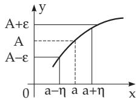
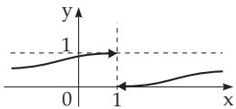

#### 2.1.4 Limits of Functions

##### 2.1.4.1 Definition of the Limit of a Function

The function $y = f ( x )$ has the limit A at $x = a$

$$
\operatorname* { l i m } _ { x \to a } f ( x ) = A \quad { \mathrm { o r } } \quad f ( x ) \to A \quad { \mathrm { f o r } } \quad x \to a ,\tag{2.14}
$$

if as x approaches the value a infinitely closely, the value of $f ( x )$ approaches the value A infinitely closely. The function $f ( x )$ does not have to be defined at $^ { a , }$ and even if defined, it does not matter whether $f ( a )$ is equal to A.

Precise Definition: The limit (2.14) exists, if for any given positive number ε there is a positive number η such that for every $x \neq$ a belonging to the domain and satisfying the inequality

$$
| x - a | < \eta ,\tag{2.15a}
$$

the inequality

$$
| f ( x ) - A | < \varepsilon\tag{2.15b}
$$

holds eventually with the exception of the point a (Fig. 2.7). If a is an endpoint of a connected region, then the inequality $| x - a | < \eta$ is reduced either to $a - \eta < x$ or to $x < a + \eta$ (see also 2.1.4.5).

##### 2.1.4.2 Definition by Limit of Sequences

Figure 2.7

A function $f ( x )$ has the limit A at $x = a$ if for every sequence

$x _ { 1 } , x _ { 2 } , \ldots , x _ { n } , . . .$ . of the values of x from the domain and converging to a (but being not equal to $a )$ , the sequence of the corresponding values of the function $f ( x _ { 1 } ) , f ( x _ { 2 } ) , \ldots , f ( x _ { n } ) , . . .$ . converges to A.

##### 2.1.4.3 Cauchy Condition for Convergence

A necessary and suficient condition for a function $f ( x )$ to have a limit at $x = a$ is that for any two values $x _ { 1 } \neq$ a and $x _ { 2 } \neq a$ belonging to the domain and being close enough to a, the values $f ( x _ { 1 } )$ and $f ( x _ { 2 } )$ are also close enough to each other.

Precise Definition: A necessary and suficient condition for a function $f ( x )$ to have a limit at $x = a$ is that for any given positive number ε there is a positive number $\eta$ such that for arbitrary values $x _ { 1 }$ and $x _ { 2 }$ belonging to the domain and satisfying the inequalities

$$
0 < | x _ { 1 } - a | < \eta \quad \mathrm { a n d } \quad 0 < | x _ { 2 } - a | < \eta ,\tag{2.16a}
$$

the inequality

$$
| f ( x _ { 1 } ) - f ( x _ { 2 } ) | < \varepsilon\tag{2.16b}
$$

holds.

##### 2.1.4.4 Infinity as a Limit of a Function

The symbol

$$
\operatorname* { l i m } _ { x \to a } | f ( x ) | = \infty\tag{2.17}
$$

means that as x approaches a, the absolute value $| f ( x ) |$ does not have an upper bound.

Precise Definition: The equality (2.17) holds if for any given positive number K there is a positive number η such that for any $x \neq a$ from the interval

$$
a - \eta < x < a + \eta\tag{2.18a}
$$

the corresponding value of $| f ( x ) |$ is larger than K:

$$
| f ( x ) | > K .\tag{2.18b}
$$

If all the values of $f ( x )$ in the interval

$$
a - \eta < x < a + \eta\tag{2.18c}
$$

are positive, one writes

$$
\operatorname* { l i m } _ { x \to a } f ( x ) = + \infty ;\tag{2.18d}
$$

if they are negative, one writes

$$
\operatorname* { l i m } _ { x \to a } f ( x ) = - \infty .\tag{2.18e}
$$

##### 2.1.4.5 Left-Hand and Right-Hand Limit of a Function

A function $f ( x )$ has a left-hand limit $A ^ { - }$ at $x = a$ , if as x tends to a from the left, the value f(x) tends to $A ^ { - } ;$

$$
A ^ { - } = \operatorname* { l i m } _ { x  a - 0 } f ( x ) = f ( a - 0 ) .\tag{2.19a}
$$

Similarly, a function has a right-hand limit $A ^ { + }$ if as x tends to a from the right, the value $f ( x )$ tends to $A ^ { + }$

$$
A ^ { + } = \operatorname* { l i m } _ { x \to a + 0 } f ( x ) = f ( a + 0 ) .\tag{2.19b}
$$

The equality lim $f ( x ) = A$ is valid only if the left-hand and x a   
right-hand limits exist, and they are equal:

$$
A ^ { + } = A ^ { - } = A .\tag{2.19c}
$$

The function $f ( x ) = { \frac { 1 } { 1 + e ^ { \frac { 1 } { x - 1 } } } }$ tends to diferent values from

the left and from the right for $x \to 1 ; f ( 1 { - } 0 ) = 1 , f ( 1 { + } 0 ) = 0$ (Fig. 2.8).

Figure 2.8

##### 2.1.4.6 Limit ofa Function as x Tends to Infinity

Case a) A number A is called the limit of a function f(x) as $x \to + \infty$ , and one writes

$$
A = \operatorname* { l i m } _ { x \to + \infty } { f ( x ) }\tag{2.20a}
$$

if for any given positive number ε there is a number $N > 0$ such that for every $x > N$ , the corresponding value f(x) is in the interval $A - \varepsilon < f ( x ) < A + \varepsilon$ . Analogously

$$
A = \operatorname* { l i m } _ { x \to - \infty } f ( x )\tag{2.20b}
$$

is the limit of a function $f ( x )$ as $x \to - \infty$ if for any given positive number ε there is a positive number $N > 0$ such that for any $x < - N$ the corresponding value of $f ( x )$ is in the interval $A - \varepsilon < f ( x ) < A + \varepsilon$

$$
\textbf { A : } \operatorname* { l i m } _ { x  + \infty } \frac { x + 1 } { x } = 1 , \textbf { \equiv B : } \operatorname* { l i m } _ { x  - \infty } \frac { x + 1 } { x } = 1 , \textbf { \equiv C : } \operatorname* { l i m } _ { x  - \infty } e ^ { x } = 0 .
$$

Case b) Assume that for any positive number K, there is a positive number N such that if $x > N$ or $x < - \dot { N }$ then the absolute value of the function is larger then K. In this case one writes

$$
\operatorname* { l i m } _ { x \to + \infty } | f ( x ) | = \infty \quad { \mathrm { o r } } \operatorname* { l i m } _ { x \to - \infty } | f ( x ) | = \infty .\tag{2.20c}
$$

A: $\operatorname* { l i m } _ { x \to + \infty } { \frac { x ^ { 3 } - 1 } { x ^ { 2 } } } = + \infty , \boxed { \mathbf { \cdots } } \boxed { \mathrm { \mathbf { B } : \quad } } \operatorname* { l i m } _ { x \to - \infty } \frac { x ^ { 3 } - 1 } { x ^ { 2 } } = - \infty ,$

C: $\operatorname* { l i m } _ { x \to + \infty } { \frac { 1 - x ^ { 3 } } { x ^ { 2 } } } = - \infty , \mathbf { \equiv \infty } , \mathbf { \equiv \infty } \operatorname* { l i m } _ { x \to - \infty } { \frac { 1 - x ^ { 3 } } { x ^ { 2 } } } = + \infty .$

##### Tends to Infinity

##### 2.1.4.7 Theorems About Limits of Functions

1. Limit of a Constant Function The limit of a constant function is the constant itself:

$$
\operatorname* { l i m } _ { x \to a } A = A .\tag{2.21}
$$

2. Limit of a Sum or a Diference If among a finite number of functions each has a limit, then the limit of their sum or diference is equal to the sum or diference of their limits (if this last expression does not contain $\infty - \infty )$

$$
\operatorname* { l i m } _ { x \to a } \left[ f ( x ) + \varphi ( x ) - \psi ( x ) \right] = \operatorname* { l i m } _ { x \to a } f ( x ) + \operatorname* { l i m } _ { x \to a } \varphi ( x ) - \operatorname* { l i m } _ { x \to a } \psi ( x ) .\tag{2.22}
$$

3. Limit of Products If among a finite number of functions each has a limit, then the limit of their product is equal to the product of their limits (if this last expression does not contain a 0 type):

$$
\operatorname * { l i m } _ { x \to a } \left[ f ( x ) \varphi ( x ) \psi ( x ) \right] = \left[ \operatorname * { l i m } _ { x \to a } f ( x ) \right] \left[ \operatorname * { l i m } _ { x \to a } \varphi ( x ) \right] \left[ \operatorname * { l i m } _ { x \to a } \psi ( x ) \right] .\tag{2.23}
$$

4. Limit of a Quotient The limit of the quotient of two functions is equal to the quotient of their limits, in the case when both limits exist and the limit of the denominator is not equal to zero (and this last expression is not an $\infty / \infty \mathrm { t y p e } )$

$$
\operatorname* { l i m } _ { x \to a } { \frac { f ( x ) } { \varphi ( x ) } } = { \frac { \operatorname* { l i m } _ { x \to a } f ( x ) } { \operatorname* { l i m } _ { x \to a } \varphi ( x ) } } .\tag{2.24}
$$

Also if the denominator is equal to zero, usually one can tell if the limit exists or not, checking the sign of the denominator (the indeterminate form is $0 / 0 )$ . Similarly, one can calculate the limit of a power by taking a suitable power of the limit (if it is not a $0 ^ { 0 } , 1 ^ { \infty }$ , or $\mathrm { \dot { \infty } ^ { 0 } \ t y p e ) }$

5. Pinching If the values of a function $f ( x )$ lie between the values of the functions $\varphi ( x )$ and $\psi ( x )$ i.e., $\varphi ( x ) < f \bar { ( x ) } < \psi ( x )$ , and if $\operatorname* { l i m } _ { x \to a } \varphi ( x ) = { \overset { \cdot } { A } }$ and $\operatorname* { l i m } _ { x \to a } \psi ( x ) = A$ hold, then $f ( x )$ has a limit, too, and

$$
\operatorname* { l i m } _ { x \to a } f ( x ) = A .\tag{2.25}
$$

##### 2.1.4.8 Calculation of Limits

The calculation of the value of a limit can be made by using the 5 described theorems as well as some transformations (see 2.1.4.7).

1. Suitable Transformations

For the calculation of limits the expression is to be transformed into a suitable form. There are several types of recommended transformations in diferent cases; here are three of them as examples.

A: $\operatorname* { l i m } _ { x \to 1 } { \frac { x ^ { 3 } - 1 } { x - 1 } } = \operatorname* { l i m } _ { x \to 1 } \left( x ^ { 2 } + x + 1 \right) = 3 .$

$$
\mathbf { B } \colon \operatorname* { l i m } _ { x \to 0 } { \frac { \sqrt { 1 + x } - 1 } { x } } = \operatorname* { l i m } _ { x \to 0 } { \frac { ( { \sqrt { 1 + x } } - 1 ) ( { \sqrt { 1 + x } } + 1 ) } { x ( { \sqrt { 1 + x } } + 1 ) } } = \operatorname* { l i m } _ { x \to 0 } { \frac { 1 } { \sqrt { 1 + x } + 1 } } = { \frac { 1 } { 2 } } .
$$

C: $\operatorname* { l i m } _ { x \to 0 } { \frac { \sin 2 x } { x } } = \operatorname* { l i m } _ { x \to 0 } { \frac { 2 ( \sin 2 x ) } { 2 x } } = 2 \operatorname* { l i m } _ { 2 x \to 0 } { \frac { \sin 2 x } { 2 x } } = 2$ . Here one can refer to the well-known theorem

$$
\operatorname* { l i m } _ { \alpha \to 0 } { \frac { \sin \alpha } { \alpha } } = 1 \quad { \mathrm { ( s e e ~ ( } } { \mathrm { \bf { u } } } { \mathrm { , ~ } } 2 . 1 . 4 . 9 { \mathrm { , ~ } } { \mathrm { p . ~ } } 5 7 { \mathrm { ) } } { \mathrm { ) } } .
$$

2. Bernoulli-l’Hospital Rule

In the case of indeterminate forms like ${ \frac { 0 } { 0 } } , { \frac { \infty } { \infty } } , 0 \cdot \infty , \infty - \infty , 0 ^ { 0 } , \infty ^ { 0 } , 1 ^ { \infty }$ , one often applies the Bernoulli-l’Hospital rule (usually called l’Hospital rule for short):

Case a) Indeterminate $\mathbf { F o r m s } \frac { \mathbf { 0 } } { \mathbf { 0 } } \mathbf { o r } \frac { \infty } { \infty } ;$ First, use the theorem only after checking if for $f ( x ) = { \frac { \varphi ( x ) } { \psi ( x ) } }$ the following conditions are fulfilled.

Suppose $\operatorname* { l i m } _ { x \to a } \varphi ( x ) = 0$ and $\operatorname* { l i m } _ { x \to a } \psi ( x ) = 0 { \mathrm { ~ o r ~ } } \operatorname* { l i m } _ { x \to a } \varphi ( x ) = \infty$ and lim $\psi ( x ) = \infty$ , and suppose that there x a is an interval containing a such that the functions $\varphi ( x )$ and $\psi ( x )$ are defined and diferentiable in this interval except perhaps at $^ { a , }$ and $\psi ^ { \prime } ( x ) \neq 0$ in this interval, and $\operatorname* { l i m } _ { x \to a } { \frac { \varphi ^ { \prime } ( x ) } { \psi ^ { \prime } ( x ) } }$ exists. Then

$$
\operatorname* { l i m } _ { x \to a } f ( x ) = \operatorname* { l i m } _ { x \to a } { \frac { \varphi ( x ) } { \psi ( x ) } } = \operatorname* { l i m } _ { x \to a } { \frac { \varphi ^ { \prime } ( x ) } { \psi ^ { \prime } ( x ) } } .\tag{2.26}
$$

Remark: If the limit of the ratio of the derivatives does not exist, it does not mean that the original limit does not exist. Maybe it does, but one cannot tell this using l’Hospital’s rule.

If lim $\frac { \varphi ^ { \prime } ( x ) } { \psi ^ { \prime } ( x ) }$ is still an indeterminate form, and the numerator and denominator satisfy the assumptions x a   
of the above theorem, l’Hospital’s rule can be used again.

$$
\operatorname* { l i m } _ { x \to 0 } { \frac { \ln \sin 2 x } { \ln \sin x } } = \operatorname* { l i m } _ { x \to 0 } { \frac { \frac { 2 \cos 2 x } { \sin 2 x } } { \frac { \cos x } { \sin x } } } = \operatorname* { l i m } _ { x \to 0 } { \frac { 2 \tan x } { \tan 2 x } } = \operatorname* { l i m } _ { x \to 0 } { \frac { \frac { 2 } { \cos ^ { 2 } x } } { \frac { 2 } { \cos ^ { 2 } 2 x } } } = \operatorname* { l i m } _ { x \to 0 } { \frac { \cos ^ { 2 } 2 x } { \cos ^ { 2 } x } } = 1 .
$$

Case b) Indeterminate Form 0 : Having $f ( x ) = \varphi ( x ) \psi ( x )$ and $\operatorname* { l i m } _ { x \to a } \varphi ( x ) = 0$ and

$\operatorname* { l i m } _ { x \to a } \psi ( x ) = \infty$ , then in order to use l’Hospital’s rule for $\operatorname* { l i m } _ { x \to a } f ( x )$ it is to be transformed into one of the forms $\operatorname* { l i m } _ { x \to a } { \frac { \varphi ( x ) } { 1 } } { \mathrm { ~ o r ~ } } \operatorname* { l i m } _ { x \to a } { \frac { \psi ( x ) } { 1 } }$ , so it is reduced to an indeterminate form ${ \frac { 0 } { 0 } } \operatorname { o r } { \frac { \infty } { \infty } }$ like in case a).

$$
\operatorname* { l i m } _ { x \to \pi / 2 } ( \pi - 2 x ) \tan x = \operatorname* { l i m } _ { x \to \pi / 2 } { \frac { \pi - 2 x } { \cot x } } = \operatorname* { l i m } _ { x \to \pi / 2 } { \frac { - 2 } { - { \frac { 1 } { \sin ^ { 2 } x } } } } = 2 .
$$

Case c) Indeterminate Form : If $f ( x ) = \varphi ( x ) - \psi ( x )$ and $\operatorname* { l i m } _ { x \to a } \varphi ( x ) = \infty { \mathrm { ~ a n d ~ } } \operatorname* { l i m } _ { x \to a } \psi ( x ) = \infty$ hold, then this expression can be transformed into the form ${ \frac { 0 } { 0 } } \ { \mathrm { o r } } \ { \frac { \infty } { \infty } }$ usually in several diferent ways; for instance as $\varphi - \psi = \left( \frac { 1 } { \psi } - \frac { 1 } { \varphi } \right) \bigg / \frac { 1 } { \varphi \psi }$ . Then it is to proceed as in case a).

$\operatorname* { l i m } _ { x \to 1 } \left( { \frac { x } { x - 1 } } - { \frac { 1 } { \ln x } } \right) = \operatorname* { l i m } _ { x \to 1 } \left( { \frac { x \ln x - x + 1 } { x \ln x - \ln x } } \right) = { \frac { 0 } { 0 } }$ . Applying l’Hospital rule twice yields

$$
\operatorname* { l i m } _ { x \to 1 } \left( { \frac { x \ln x - x + 1 } { x \ln x - \ln x } } \right) = \operatorname* { l i m } _ { x \to 1 } \left( { \frac { \ln x } { \ln x + 1 - { \frac { 1 } { x } } } } \right) = \operatorname* { l i m } _ { x \to 1 } \left( { \frac { \frac { 1 } { x } } { { \frac { 1 } { x } } + { \frac { 1 } { x ^ { 2 } } } } } \right) = { \frac { 1 } { 2 } } .
$$

Case d) Indeterminate Forms $0 ^ { 0 } , \infty ^ { 0 } , 1 ^ { \infty } \colon \mathrm { I f } f ( x ) = \varphi ( x ) ^ { \psi ( x ) }$ and $\operatorname* { l i m } _ { x \to a } \varphi ( x ) = + 0$ and $\operatorname* { l i m } _ { x \to a } \psi ( x ) =$

0 holds, then first the limit A of ln $f ( x ) = \psi ( x ) \ln \varphi ( x )$ , is to be calculated, which has the form $0 \cdot \infty$ (case b)), then $\operatorname* { l i m } _ { x \to a } f ( x ) = e ^ { A }$ holds.

The procedures in the cases $\infty ^ { 0 }$ and $1 ^ { \infty }$ are similar.

$\operatorname* { l i m } _ { x \to + 0 } x ^ { x } = X$ , ln xx = x ln x, lim x ln $x = \operatorname* { l i m } _ { x \to + 0 } { \frac { \ln x } { x ^ { - 1 } } } = \operatorname* { l i m } _ { x \to + 0 } ( - x ) = 0 , { \mathrm { i . e . , } } A = \ln X = 0 ,$ x +0   
so $X = 1$ , and finally $\operatorname* { l i m } _ { x \to + 0 } x ^ { x } = 1$

3. Taylor Expansion

Besides l’Hospital’s rule the expansion of functions of indeterminate form into Taylor series can be applied (see 6.1.4.5, p. 442).

$$
\operatorname* { l i m } _ { x \to 0 } { \frac { x - \sin x } { x ^ { 3 } } } = \operatorname* { l i m } _ { x \to 0 } { \frac { x - \left( x - { \frac { x ^ { 3 } } { 3 ! } } + { \frac { x ^ { 5 } } { 5 ! } } - \cdots \right) } { x ^ { 3 } } } = \operatorname* { l i m } _ { x \to 0 } \left( { \frac { 1 } { 3 ! } } - { \frac { x ^ { 2 } } { 5 ! } } + \cdots \right) = { \frac { 1 } { 6 } } .
$$

##### 2.1.4.9 Order of Magnitude of Functions and Landau Order Symbols

Comparing two functions, often their mutual behavior with respect to a certain argument $x = a$ is to be considered. It is also convenient to compare the order of magnitude of the functions.

1. A function $f ( x )$ tends to infinity at a at a higher order (or faster rate) than a function $g ( x )$ at a, if the quotient $\left| { \frac { f ( x ) } { g ( x ) } } \right|$ and the absolute values of $f ( x )$ exceed any limit as x tends to a.

2. A function $f ( x )$ tends to zero at a at a higher order than a function $g ( x )$ at a, if the absolute values of $f ( x ) , g ( x )$ and the quotient $\frac { f ( x ) } { g ( x ) }$ tends to zero as x tends to a.

3. Two functions $f ( x )$ and $g ( x )$ tend to zero or to infinity at s at the same order of magnitude, if $0 < m < \left| \frac { f ( x ) } { g ( x ) } \right| < M$ holds for the absolute value of their quotient as x tends to a, where M and m are constants.

4. Landau Order Symbols The mutual behavior of two functions at a point $x = a$ can be described by the Landau order symbols $O \left( { } ^ { \cdots } \mathrm { b i g } \left( { } ^ { \cdots } \right) \right)$ , or $o \left( { } ^ { \mathfrak { a } } \mathrm { s m a l l o } ^ { \mathfrak { N } } \right)$ as follows: If $x \to a$ then

$$
f ( x ) = O ( g ( x ) ) \quad { \mathrm { m e a n s ~ t h a t } } \quad \operatorname* { l i m } _ { x \to a } { \frac { f ( x ) } { g ( x ) } } = A \neq 0 , \quad A = { \mathrm { c o n s t } } ,\tag{2.27a}
$$

and

$$
f ( x ) = o ( g ( x ) ) \quad { \mathrm { m e a n s ~ t h a t } } \quad \operatorname* { l i m } _ { x \to a } { \frac { f ( x ) } { g ( x ) } } = 0 ,\tag{2.27b}
$$

where $a = \pm \infty$ is also possible. The Landau order symbols have meaning only by assuming x tends to a given a.

A: sin $x = O ( x )$ for $x \to 0$ , because with f(x) = sin x and $g ( x ) = x$ holds: $\operatorname* { l i m } _ { x \to 0 } { \frac { \sin x } { x } } = 1 \neq 0 , { \mathrm { i . e . } }$ sin x behaves like x in the neighborhood of $x = 0$

B: For $f ( x ) = 1 - \cos x$ and $g ( x ) = \sin { x }$ the function $f ( x )$ vanishes with a higher order than $g ( x )$ $\operatorname* { l i m } _ { x \to 0 } \left| { \frac { f ( x ) } { g ( x ) } } \right| = \operatorname* { l i m } _ { x \to 0 } \left| { \frac { 1 - \cos x } { \sin x } } \right| = 0 , \operatorname { i . e . , } 1 - \cos x = o ( \sin x ) \operatorname { f o r } x \to 0 .$

C: f(x) and $g ( x )$ vanish by the same order for $f ( x ) = 1 - \cos x , g ( x ) = x ^ { 2 }$

$$
\operatorname* { l i m } _ { x \to 0 } \left| { \frac { f ( x ) } { g ( x ) } } \right| = \operatorname* { l i m } _ { x \to 0 } \left| { \frac { 1 - \cos x } { x ^ { 2 } } } \right| = { \frac { 1 } { 2 } } , { \mathrm { i . e . , } } 1 - \cos x = O ( x ^ { 2 } ) { \mathrm { f o r ~ } } x \to 0 .
$$

5. Polynomial The order of magnitude of polynomials at can be expressed by their degree. So the function $f ( x ) = x$ has order 1, a polynomial of degree $n + 1$ has an order higher by one than a polynomial of degree n.

6. Exponential Function The exponential function $e ^ { x }$ tends faster to infinity for $x  \infty$ more quickly to infinity than any high power $x ^ { n }$ (n is a fixed positive number):

$$
\operatorname* { l i m } _ { x \to \infty } \left| { \frac { e ^ { x } } { x ^ { n } } } \right| = \infty .\tag{2.28a}
$$

The proof follows by applying l’Hospital’s rule for a natural number n:

$$
\operatorname* { l i m } _ { x \to \infty } { \frac { e ^ { x } } { x ^ { n } } } = \operatorname* { l i m } _ { x \to \infty } { \frac { e ^ { x } } { n x ^ { n - 1 } } } = \dots = \operatorname* { l i m } _ { x \to \infty } { \frac { e ^ { x } } { n ! } } = \infty .\tag{2.28b}
$$

7. Logarithmic Function The logarithm tends to infinity more slowly than any small positive power $x ^ { \alpha }$ (α is a fixed positive number):

$$
\operatorname* { l i m } _ { x \to \infty } \left| { \frac { \log x } { x ^ { \alpha } } } \right| = 0 .\tag{2.29}
$$

The proof is with the help of l’Hospital’s rule.
