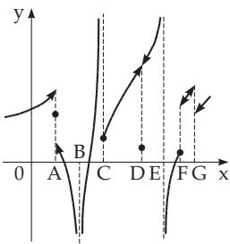
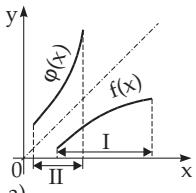
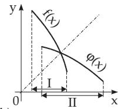

#### 2.1.5 Continuity of a Function

##### 2.1.5.1 Notion of Continuity and Discontinuity

Most functions occurring in practice are continuous, i.e., for small changes of the argument x a continuous function $y ( x )$ changes also only a little. The graphical representation of such a function results in a continuous curve. If the curve is broken at some points, the corresponding function is discontinuous, and the values of the arguments where the breaks are, are the points of discontinuity. Fig. 2.9 shows the curve of a function, which is piecewise continuous. The points of discontinuity are A, B, C, D, E, F and G . The arrow-heads show that the endpoints do not belong to the curve.

##### 2.1.5.2 Definition of Continuity

A function $y = f ( x )$ is called continuous at the point $x = a$ if

Figure 2.9

1. $f ( x )$ is defined at a;

2. the limit $\operatorname* { l i m } _ { x \to a } f ( x )$ exists and is equal to $f ( a )$

This is exactly the case if for an arbitrary $\varepsilon > 0$ there is a $\delta ( \varepsilon ) > 0$ such that

$$
| f ( x ) - f ( a ) | < \varepsilon \quad { \mathrm { f o r ~ e v e r y ~ } } x { \mathrm { ~ w i t h } } \quad | x - a | < \delta\tag{2.30}
$$

holds.

Here also it is to talk about one-sided (left- or right-hand sided) continuity, if instead of $\operatorname* { l i m } _ { x \to a } f ( x ) = f ( a )$ only the one-sided limit $\operatorname * { l i m } _ { x \to a - 0 } f ( x ) \ : ( \mathrm { o r } \ : \operatorname * { l i m } _ { x \to a + 0 } f ( x ) )$ is to be considered and this is equal to the value $f ( a )$

If a function is continuous for every x in a given interval from a to $b ,$ then the function is called continuous in this interval, which can be open, half-open, or closed (see 1.1.1.3, 3., p. 2). If a function is defined and continuous at every point of the numerical axis, it is called continuous everywhere.

A function has a point ofdiscontinuity at $x = a$ , which is an interior point or an endpoint of its domain,

if the function is not defined here, or $f ( a )$ is not equal to the limit $\operatorname* { l i m } _ { x \to a } f ( x )$ , or the limit does not exist. If the function is defined only on one side of $x = a , \mathrm { e . g . , + } \sqrt { x }$ for $x = 0$ and arccos x for $x = 1$ , then it is not a point of discontinuity but it is a termination.

A function $f ( x )$ is called piecewise continuous, if it is continuous at every point of an interval except at a finite number of points, and at these points it has finite jumps.

##### 2.1.5.3 Most Frequent Types of Discontinuities

1. Values of the Function Tend to Infinity

The most frequent discontinuity occurs if the function tends to $\pm \infty$ (points B, C, and E in Fig. 2.9). ${ \textbf { A } } \mathbf { ; } \ f ( x ) = \tan x , \ f \left( { \frac { \pi } { 2 } } - 0 \right) = + \infty , \ f \left( { \frac { \pi } { 2 } } + 0 \right) = - \infty$ . The type of discontinuity (see Fig. 2.34, p. 78) is the same as at E in Fig. 2.9. For the meaning of the symbols $f ( a - 0 ) , f ( a + 0 )$ see 2.1.4.5, p. 54.

B: $f ( x ) = \frac { 1 } { ( x - 1 ) ^ { 2 } } , f ( 1 - 0 ) = + \infty , f ( 1 + 0 ) = + \infty$ . The type of discontinuity is the same as at the point B in Fig. 2.9.

C: $f ( x ) = e ^ { \frac { 1 } { x - 1 } } , f ( 1 - 0 ) = 0 , f ( 1 + 0 ) = \infty$ . The type of discontinuity is the same as at C in Fig. 2.9, with the diference that this function f(x) is not defined at $x = 1$

2. Finite Jump

Passing through $x = a$ the function $f ( x )$ jumps from a finite value to another finite value (like at the points A, F, G in $\mathbf { F i g . 2 . 9 , p . 5 8 } )$ : The value of the function $f ( x )$ for $x = a$ may not be defined here, as at point G; or it can coincide with $f ( a - 0 )$ or with $f ( a + \dot { 0 } )$ (point $F )$ ; or it can be diferent from $f ( a - 0 )$ and $f ( a + 0 )$ (point A).

$$
\mathbf { A } \colon \mathfrak { f } ( x ) = \frac { 1 } { 1 + e ^ { \frac { 1 } { x - 1 } } } , \ \mathfrak { f } ( 1 - 0 ) = 1 , \ \mathfrak { f } ( 1 + 0 ) = 0 \left( \mathbf { F i g . 2 . 8 , p . 5 4 } \right) .
$$

B: $f ( x ) = E ( x ) \ ( { \mathrm { F i g . ~ 2 . 1 c , ~ p . ~ 5 0 } } ) \ f ( n - 0 ) = n - 1 , \ f ( n + 0 ) = n \ ( n { \mathrm { ~ i n t e g e r } } ) .$

$$
\mathbf { C } \colon \ : f ( x ) = \operatorname* { l i m } _ { n \to \infty } \frac { 1 } { 1 + x ^ { 2 n } } , \ : f ( 1 - 0 ) = 1 , \ : f ( 1 + 0 ) = 0 , \ : f ( 1 ) = \frac { 1 } { 2 } .
$$

3. Removable Discontinuity

Assuming that lim f(x) exists, i.e., $f ( a - 0 ) = f ( a + 0 )$ holds, but either the function is not defined x a   
for $x = a$ or there is $f ( a ) \neq \operatorname* { l i m } _ { x  a } f ( x )$ (point D in $\mathbf { F i g . 2 . 9 , \ p . 5 8 } )$ . This type of discontinuity is called removable, because defining $f ( a ) = \operatorname* { l i m } _ { x \to a } f ( x )$ the function becomes continuous here. The procedure consists of adding only one point to the curve, or changing the place only of one point at D. The diferent indeterminate expressions for $x = a$ , which have a finite limit examined by l’Hospital’s rule or with other methods, are examples of removable discontinuities. $f ( x ) = { \frac { { \sqrt { 1 + x } } - 1 } { x } }$ is an undetermined $\frac { 0 } { 0 }$ expression for $x = 0$ , but $\operatorname* { l i m } _ { x \to 0 } f ( x ) = { \frac { 1 } { 2 } } ;$ the function $f ( x ) = \left\{ { \begin{array} { c } { \displaystyle { \frac { \sqrt { 1 + x } } { x } } \mathrm { ~ f o r ~ } x \neq 0 } \\ { \displaystyle { \frac { 1 } { 2 } } \quad \mathrm { ~ f o r ~ } x = 0 } \end{array} } \right.$   
⎩is continuous.

##### 2.1.5.4 Continuity and Discontinuity of Elementary Functions

The elementary functions are continuous on their domains; the points of discontinuity do not belong to their domain. The following theorems hold:

1. Polynomials are continuous everywhere.

2. Rational Functions $\frac { P ( x ) } { Q ( x ) }$ with polynomials P(x) and $Q ( x )$ are continuous everywhere except the points x, where $Q ( x ) = 0 .$ . If at $x = a , Q ( a ) = 0$ and $P ( a ) \neq 0$ , the function tends to $\pm \infty$ on both sides of $a ;$ this point is called a pole. The function also has a pole if $P ( a ) = 0$ , but a is a root of the denominator with higher multiplicity than for the numerator (see 1.6.3.1, 2., p. 43). Otherwise the discontinuity is removable.

3. Irrational Functions Roots of polynomials are continuous for every x in their domain. At the end of the domain they can terminate by a finite value if the radicand changes its sign. Roots of rational functions are discontinuous for such values of x where the radicand is discontinuous.

4. Trigonometric Functions The functions sin x and cos x are continuous everywhere; tan x and sec x have infinite jumps at the points $x = \frac { ( 2 n + 1 ) \pi } { 2 }$ ; the functions cot x and cosec x have infinite jumps at the points $x = n \pi$ (n integer).

5. Inverse Trigonometric Functions The functions arctan x and arccot x are continuous everywhere, arcsin x and arccos x terminate at the end of their domain because of $- 1 \leq x \leq + 1$ , and they are continuous here from one side.

6. Exponential Functions $e ^ { x }$ or $\pmb { a } ^ { x }$ with $a > 0$ They are continuous everywhere.

7. Logarithmic Function log x with Arbitrary Positive Base The function is continuous for all positive x and terminates at $x = 0$ because of $\operatorname* { l i m } _ { x \to + 0 } \log x = - \infty$ by a right-sided limit.

8. Composite Elementary Functions The continuity is to be checked for every point x of every elementary function containing in the composition (see also continuity of composite functions in 2.1.5.5, $2 . , \mathrm { p . 6 1 } )$

Find the points of discontinuity of the function $y \ = \ { \frac { e ^ { \frac { 1 } { x - 2 } } } { x \sin \sqrt [ { 3 } ] { 1 - x } } } .$ . The exponent $\frac { 1 } { x - 2 }$ has an infinite jump at $x = 2 ;$ ; for $x = 2 \mathrm { a l s o } e ^ { \frac { 1 } { x - 2 } }$ has an infinite jump: $\left( e ^ { \frac { 1 } { x - 2 } } \right) _ { x = 2 - 0 } = 0 , \left( e ^ { \frac { 1 } { x - 2 } } \right) _ { x = 2 + 0 } = \infty$ The function y has a finite denominator at $x = 2$ . Consequently, at $x = 2$ there is an infinite jump of the same type as at point C in Fig. 2.9, p. 58.

For $x = 0$ the denominator is also zero, just like for the values of x, for which sin $\sqrt [ 3 ] { 1 - x }$ is equal to zero. These last ones correspond to the roots of the equation ${ \sqrt [ { 3 } ] { 1 - x } } = n \pi$ or $x = 1 - n ^ { 3 } \pi ^ { 3 }$ , where n is an arbitrary integer. The numerator is not equal to zero for these numbers, so at the points $x = 0$ $x = 1 , x = 1 \pm \pi ^ { 3 } , x = 1 \pm 8 \pi ^ { 3 } , x = 1 \pm 2 7 \pi ^ { 3 }$ , . . . the function has the same type of discontinuity as the point E in Fig. 2.9, p. 58.

##### 2.1.5.5 Properties of Continuous Functions

1. Continuity ofSum, Diference, Product and Quotient ofContinuous Functions $\operatorname { I f } f ( x )$ and g(x) are continuous on the interval [a, b], then $f ( x ) \pm g ( x ) , f ( x ) g ( x )$ are also continuous, and if $g ( x ) \neq 0$ on this interval, then $\frac { f ( x ) } { g ( x ) }$ is also continuous.

2. Continuity of Composite Functions $\boldsymbol { y } = f ( \boldsymbol { u } ( \boldsymbol { x } ) )$

$\operatorname { I f } u ( x )$ is continuous at $x = a$ and $f ( u )$ is continuous at $u = u ( a )$ then the composite function $y =$ $f ( u ( x ) )$ is continuous at $x = a$ , and

$$
\operatorname* { l i m } _ { x \to a } f ( u ( x ) ) = f \left( \operatorname* { l i m } _ { x \to a } u ( x ) \right) = f ( u ( a ) )\tag{2.31}
$$

is valid. This means that a continuous function of a continuous function is also continuous.

Remark: The converse sentence is not valid. It is possible that the composite function of discontinuous functions is continuous.

3. Bolzano Theorem

If a function $f ( x )$ is continuous on a finite closed interval $[ a , b ]$ , and $f ( a )$ and $f ( b )$ have diferent signs, then $f ( x )$ has at least one root in this interval, i.e., there exists at least one interior point of this interval c such that:

$$
f ( c ) = 0 \quad { \mathrm { w i t h } } \quad a < c < b .\tag{2.32}
$$

The geometric interpretation of this statement is that the graph of a continuous function can go from one side of the x-axis to the other side only if the curve has an intersection point with the x-axis.

4. Intermediate Value Theorem

If a function $f ( x )$ is continuous on an interval, and it has diferent values A and $B ,$ at the points a and b of this interval, where $a < b , \mathrm { i . e . }$ .,

$$
f ( a ) = A , \quad f ( b ) = B , \quad A \neq B ,\tag{2.33a}
$$

then for any value C between A and B there is at least one point c between a and b such that

$$
f ( c ) = C , \quad ( a < c < b , \quad A < C < B \ \mathrm { ~ o r ~ } \ A > C > B ) .\tag{2.33b}
$$

In other words: The function $f ( x )$ takes every value between A and B on the interval $( a , b )$ at least once. Or: The continuous image of an interval is an interval.

5. Existence of an Inverse Function

If a one-to-one function is continuous on an interval, it is strictly monotone on this interval.

If a function $f ( x )$ is continuous on a connected domain I, and it is strictly monotone increasing or decreasing, then for this $f ( x )$ there also exists a continuous, strictly monotone increasing or decreasing inverse function $\varphi ( x )$ (see also 2.1.3.8, p. 52), which is defined on domain II given by the values of $f ( x )$ (Fig. 2.10).

  
a)

  
b)  
Figure 2.10

Remark: In order to make sure that the inverse function of $f ( x )$ is continuous, $f ( x )$ must be continuous on an interval. Supposing only that the function is strictly monotonic on an interval, and continuous at an interior point c, and $f ( c ) = C$ , then the inverse function exists, but may be not continuous at $C .$

6. Theorem About the Boundedness of a Function

If a function $f ( x )$ is continuous on a finite, closed interval $[ a , b ]$ then it is bounded on this interval, i.e., there exist two numbers m and M such that

$$
m \leq f ( x ) \leq M \quad { \mathrm { f o r } } \quad a \leq x \leq b .\tag{2.34}
$$

7. Weierstrass Theorem

If the function $f ( x )$ is continuous on the finite, closed interval $[ a , b ]$ then $f ( x )$ has an absolute maximum M and an absolute minimum m, i.e., there exists in this interval at least one point c and at least one point d such that for all x with $a \leq x \leq b ;$

$$
m = f ( d ) \leq f ( x ) \leq f ( c ) = M .\tag{2.35}
$$

The diference between the greatest and smallest value of a continuous function is called its variation in the given interval. The notion of variation can be extended to the case when the function does not have any greatest or smallest value.
