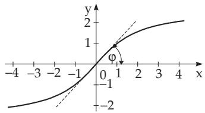
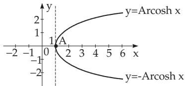
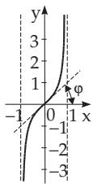
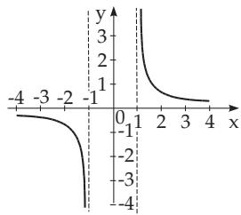

### 2.10 Area Functions

#### 2.10.1 Definitions

The area functions are the inverse functions of the hyperbolic functions, i.e., the inverse hyperbolic functions. The functions sinh x , tanh x, and coth x are strictly monotone, so they have unique inverses without any restriction; the function cosh x has two monotonic intervals so there are to consider two inverse functions. The name area refers to the fact that the geometric definition of the functions is the area of certain hyperbolic sectors (see 3.1.2.2, p. 132).

##### 2.10.1.1 Area Sine

The function $y = \operatorname { A r s i n h } x$

(2.207)

(Fig. 2.53) is an odd, strictly monotone increasing function, with domain and range given in Table 2.8. (2.53) is equivalent to the expression x = sinh y . The origin is the center of symmetry and the inflection point of the curve, where the angle of slope of the tangent line is $\varphi = \frac { \pi } { 4 }$

##### 2.10.1.2 Area Cosine

The functions y = Arcosh x and y = Arcosh x

(2.208)

(Fig. 2.54) or x = cosh y have the domain and range given in Table 2.8; they are defined only for $x \geq 1$ . The function curve starts at the point A(1, 0) with a vertical tangent line and the function increases or decreases strictly monotonically respectively.

  
Figure 2.53

  
Figure 2.54

Table 2.8 Domains and ranges of the area functions
<table><tr><td>Area function</td><td>Domain</td><td>Range</td><td>Hyperbolic function with same meaning</td></tr><tr><td>area sine y = Arsinh x area cosine</td><td> $- \infty < x < \infty$ </td><td> $- \infty < y < \infty$ </td><td> $x = \sinh y$ </td></tr><tr><td> $y = \operatorname { A r c o s h } x$   $y = - \operatorname { A r c o s h } { x }$  area tangent</td><td> $1 \leq x < \infty$ </td><td> $\begin{array} { c } { { 0 \leq y < \infty } } \\ { { - \infty < y \leq 0 } } \end{array}$ </td><td> $x = \cosh y$ </td></tr><tr><td> $y = \operatorname { A r t a n h } x$  area cotangent</td><td> $| x | < 1$ </td><td> $- \infty < y < \infty$ </td><td> $x = \operatorname { t a n h } y$ </td></tr><tr><td> $y = \operatorname { A r c o t h } x$ </td><td> $| x | > 1$ </td><td> $\mathbf { \nabla } \cdot \infty < y < 0$   $0 < y < \infty$ </td><td> $x = \coth y$ </td></tr></table>

  
Figure 2.55  
Figure 2.56

##### 2.10.1.3 Area Tangent

The function $y = \operatorname { A r t a n h } x$

(2.209)

(Fig. 2.55) or $x = \operatorname { t a n h } y$ is an odd function, defined only for $| x | < 1$ , with domain and range given in Table 2.8. The origin is the center of symmetry and also the inflection point of the curve, and here the angle of slope of the tangent line is $\varphi = \frac { \pi } { 4 }$ . The asymptotes are vertical, their equations are $x = \pm 1$

##### 2.10.1.4 Area Cotangent

The function y = Arcoth x

(2.210)

(Fig. 2.56) or $x = \coth y$ is an odd function, defined only for $| x | > 1$ , with domain and range given in Table 2.8. In the inte $\mathrm { r v a l } - \infty < x < - 1$ the function is strictly monotone decreasing from 0 until , in the interval $1 < x < + \infty$ it is strictly monotone decreasing from + to 0. It has three asymptotes: their equations are $y = 0$ and $x = \pm 1$

#### 2.10.2 Determination of Area Functions Using Natural Logarithm

From the definition of hyperbolic functions ((2.166)–(2.171), see 2.9.1, p. 89) follows that the area functions can be expressed with the logarithm function:

$$
\operatorname { A r s i n h } x = \ln \left( x + { \sqrt { x ^ { 2 } + 1 } } \right) ,\tag{2.211}
$$

$$
\operatorname { A r c o s h } x = \ln ( x + { \sqrt { x ^ { 2 } - 1 } } ) = \ln \left( { \frac { 1 } { x - { \sqrt { x ^ { 2 } - 1 } } } } \right) \quad ( x \geq 1 ) ,\tag{2.212}
$$

$$
\mathrm { A r t a n h } x = { \frac { 1 } { 2 } } \ln { \frac { 1 + x } { 1 - x } } \quad ( | x | < 1 ) , ( 2 . 2 1 3 ) \qquad \mathrm { A r c o t h } x = { \frac { 1 } { 2 } } \ln { \frac { x + 1 } { x - 1 } } \quad ( | x | > 1 ) .\tag{2.214}
$$

#### 2.10.3 Relations Between Different Area Functions

$$
\operatorname { A r s i n h } x = ( \operatorname { s i g n } x ) \operatorname { A r c o s h } { \sqrt { x ^ { 2 } + 1 } } = \operatorname { A r t a n h } { \frac { x } { \sqrt { x ^ { 2 } + 1 } } } = \operatorname { A r c o t h } { \frac { \sqrt { x ^ { 2 } + 1 } } { x } }
$$

$$
( | x | < \infty ) ,\tag{2.215}
$$

$$
\operatorname { A r c o s h } x = \operatorname { A r s i n h } { \sqrt { x ^ { 2 } - 1 } } = \operatorname { A r t a n h } { \frac { \sqrt { x ^ { 2 } - 1 } } { x } } = \operatorname { A r c o t h } { \frac { x } { \sqrt { x ^ { 2 } - 1 } } } \qquad ( x \geq 1 ) ,\tag{2.216}
$$

$$
\operatorname { A r t a n h } x = \operatorname { A r s i n h } { \frac { x } { \sqrt { 1 - x ^ { 2 } } } } = \operatorname { A r c o t h } { \frac { 1 } { x } } = ( \operatorname { s i g n } x ) \operatorname { A r c o s h } { \frac { 1 } { \sqrt { 1 - x ^ { 2 } } } } \qquad ( | x | < 1 ) ,\tag{2.217}
$$

$$
\begin{array} { c } { \operatorname { A r c o t h } x = \operatorname { A r t a n h } \displaystyle \frac { 1 } { x } = ( \operatorname { s i g n } x ) \operatorname { A r s i n h } \displaystyle \frac { 1 } { \sqrt { x ^ { 2 } - 1 } } } \\ { = ( \operatorname { s i g n } x ) \operatorname { A r c o s h } \displaystyle \frac { | x | } { \sqrt { x ^ { 2 } - 1 } } } \end{array}
$$

$$
( | x | > 1 ) .\tag{2.218}
$$

#### 2.10.4 Sum and Difference of Area Functions

$$
\operatorname { A r s i n h } x \pm \operatorname { A r s i n h } y = \operatorname { A r s i n h } \left( x { \sqrt { 1 + y ^ { 2 } } } \pm y { \sqrt { 1 + x ^ { 2 } } } \right) ,\tag{2.219}
$$

$$
\operatorname { A r c o s h } x \pm \operatorname { A r c o s h } y = \operatorname { A r c o s h } \left( x y \pm { \sqrt { ( x ^ { 2 } - 1 ) ( y ^ { 2 } - 1 ) } } \right) ,\tag{2.220}
$$

$$
\operatorname { A r t a n h } x \pm \operatorname { A r t a n h } y = \operatorname { A r t a n h } { \frac { x \pm y } { 1 \pm x y } } .\tag{2.221}
$$

#### 2.10.5 Formulas for Negative Arguments

$$
\operatorname { A r s i n h } ( - x ) = - \operatorname { A r s i n h } x ,
$$

(2.222)

$$
\operatorname { A r t a n h } ( - x ) = - \operatorname { A r t a n h } x ,
$$

(2.223)

$$
\operatorname { A r c o t h } ( - x ) = - \operatorname { A r c o t h } x .\tag{2.224}
$$

The functions Arsinh, Artanh and Arcoth are odd functions, and Arcosh (2.212) is not defined for arguments $x < 1$
