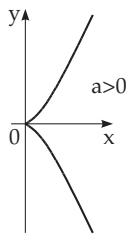
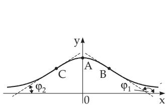
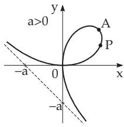
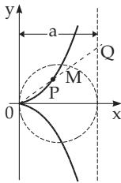
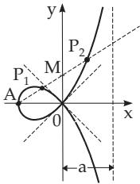

### 2.11 Curves of Order Three (Cubic Curves)

A curve is called an algebraic curve of order n if it can be written in the form of a polynomical equation $F ( x , y ) = 0$ of two variables where the left-hand side is a poynomial expression of degree n.

The cardioid with equation $( x ^ { 2 } + y ^ { 2 } ) ( x ^ { 2 } + y ^ { 2 } - 2 a x ) - a ^ { 2 } y ^ { 2 } = 0 ( a > 0 ) ( \mathrm { s e e } 2 . 1 2 . 2 , \mathrm { p . } 9 8 )$ is a curve of order four. The well-known conic sections (see 3.5.2.11, p. 206) result in curves of order two.

#### 2.11.1 Semicubic Parabola

The equation $y = a x ^ { 3 / 2 } \quad ( a > 0 , \ x \geq 0 )$

(2.225a)

or in parametric form $x = t ^ { 2 } , \quad y = a t ^ { 3 } \quad ( a > 0 , - \infty < t < \infty )$

(2.225b)

gives the semicubic parabola (Fig. 2.57). It has a cuspidal point at the origin, it has no asymptote. The curvature $K = { \frac { 6 a } { \sqrt { x } ( 4 + 9 a ^ { 2 } x ) ^ { 3 / 2 } } }$ takes all the values between and 0. The arclength of the curve

between the origin and the point $P ( x , y )$ is $L = \frac { 1 } { 2 7 a ^ { 2 } } [ ( 4 + 9 a ^ { 2 } x ) ^ { 3 / 2 } - 8 ]$

#### 2.11.2 Witch of Agnesi

The equation

$$
y = \frac { a ^ { 3 } } { a ^ { 2 } + x ^ { 2 } } \quad ( a > 0 , - \infty < x < \infty )\tag{2.226a}
$$

determines the curve represented in Fig. 2.58, the witch of Agnesi. It has an asymptote with the equation $y = 0$ , it has an extreme point at $A ( 0 , a )$ , where the radius of curvature is $r = { \frac { a } { 2 } } .$ The inflection points B and C are at $\left( \pm { \frac { a } { \sqrt { 3 } } } , { \frac { 3 a } { 4 } } \right)$ , where the angles of slope of the tangent lines are tan $\varphi = \mp \frac { 3 \sqrt { 3 } } { 8 }$

  
Figure 2.57

  
Figure 2.58

  
Figure 2.59

The area of the region between the curve and its asymptote is equal to $S = \pi a ^ { 2 }$ . The witch of Agnesi (2.226a) is a special case of the Lorentz or Breit–Wigner curve

$$
y = \frac { a } { b ^ { 2 } + ( x - c ) ^ { 2 } } \quad ( a > 0 , b \neq 0 ) .\tag{2.226b}
$$

The Fourier transform of the damped oscillation is the Lorentz or Breit–Wigner curve (see 15.3.1.4, p. 791).

#### 2.11.3 Cartesian Folium (Folium of Descartes)

The equation $x ^ { 3 } + y ^ { 3 } = 3 a x y \quad ( a > 0 )$ or

(2.227a)

in parametric form

$x = { \frac { 3 a t } { 1 + t ^ { 3 } } } , y = { \frac { 3 a t ^ { 2 } } { 1 + t ^ { 3 } } }$ with

$$
t = \tan \ast P 0 x \quad ( a > 0 , - \infty < t < - 1 \mathrm { ~ a n d } - 1 < t < \infty )\tag{2.227b}
$$

gives the Cartesian folium curve represented in Fig. 2.59. The origin is a double point because the curve passes through it twice, and here both coordinate axes are tangent lines. At the origin the radius of curvature for both branches of the curve is $r = { \frac { 3 a } { 2 } }$ . The equation of the asymptote is $x + y + a = 0$ The vertex A has the coordinates $A \left( { \frac { 3 } { 2 } } a , { \frac { 3 } { 2 } } a \right)$ . The area of the loop is $S _ { 1 } = { \frac { 3 a ^ { 2 } } { 2 } }$ . The area $S _ { 2 }$ between the curve and the asymptote has the same value.

#### 2.11.4 Cissoid

The equation $y ^ { 2 } = \frac { x ^ { 3 } } { a - x } \quad ( a > 0 ) ,$

(2.228a)

or in parametric form $x = { \frac { a t ^ { 2 } } { 1 + t ^ { 2 } } } , y = { \frac { a t ^ { 3 } } { 1 + t ^ { 2 } } }$ with

$$
t = \tan \ast P 0 x \quad ( a > 0 , - \infty < t < \infty )\tag{2.228b}
$$

or with polar coordinates $\rho = { \frac { a \sin ^ { 2 } \varphi } { \cos \varphi } } \quad ( a > 0 )$

(2.228c)

(Fig. 2.60) describes the locus of the points P for which

$$
{ \overline { { 0 P } } } = { \overline { { M Q } } }\tag{2.229}
$$

is valid. Here M is the second intersection point of the line $0 P$ with the drawn circle of radius $\frac { a } { 2 }$ , and Q is the intersection point of the line $0 P$ with the asymptote $x = a$ . The area between the curve and the asymptote is equal to $S = { \frac { 3 } { 4 } } \pi a ^ { 2 }$

  
Figure 2.60

  
Figure 2.61

#### 2.11.5 Strophoide

Strophoide is the locus of the points $P _ { 1 }$ and $P _ { 2 }$ , which are on an arbitrary half-line starting at A (A is on the negative x-axis) and for which the equalities

$$
\overline { { M P } } _ { 1 } = \overline { { M P } } _ { 2 } = \overline { { 0 M } }\tag{2.230}
$$

are valid. Here M is the intersection point with the y-axis (Fig. 2.61). The equation of the strophoide in Cartesian, and in polar coordinates, and in parametric form is:

$$
y ^ { 2 } = x ^ { 2 } \left( \frac { a + x } { a - x } \right) \quad ( a > 0 ) , \qquad \quad ( 2 . 2 3 1 \mathrm { a } ) \qquad \quad \rho = - a \frac { \cos { 2 \varphi } } { \cos { \varphi } } \quad ( a > 0 ) ,\tag{2.231b}
$$

$$
x = a \frac { t ^ { 2 } - 1 } { t ^ { 2 } + 1 } , \quad y = a t \frac { t ^ { 2 } - 1 } { t ^ { 2 } + 1 } \mathrm { ~ w i t h ~ } t = \tan \nwarrow P 0 x \quad ( a > 0 , - \infty < t < \infty ) .\tag{2.231c}
$$

The origin is a double point with tangent lines $y = \pm x$ . The asymptote has the equation $x = a$ . The vertex is $A ( - a , 0 )$ . The area of the loop is $S _ { 1 } = 2 a ^ { 2 } - { \frac { 1 } { 2 } } \pi a ^ { 2 }$ , and the area between the curve and the asymptote is $S _ { 2 } = 2 a ^ { 2 } + { \frac { 1 } { 2 } } \pi a ^ { 2 }$
