### 2.12 Curves of Order Four (Quartics)

#### 2.12.1 Conchoid of Nicomedes

The Conchoid ofNicomedes (Fig. 2.62) is the locus of the points P, for which

$$
\overline { { 0 P } } = \overline { { 0 M } } \pm l\tag{2.232}
$$

holds, where M is the intersection point of the line $\overline { { 0 P _ { 1 } 0 P _ { 2 } } }$ with the asymptote $x = a$ . The $^ { 6 6 } + ^ { 9 9 }$ sign belongs to the right branch of the curve, the $^ { 6 6 } - ^ { 9 9 }$ sign belongs to the left one in relation to the asymptote. The equations for the conchoid ofNicomedes are the following in Cartesian coordinates, in parametric form and in polar coordinates:

$$
( x - a ) ^ { 2 } ( x ^ { 2 } + y ^ { 2 } ) - l ^ { 2 } x ^ { 2 } = 0 \quad ( a > 0 , l > 0 ) ,\tag{2.233a}
$$

$$
\begin{array} { l } { x = a + l \cos \varphi , \quad y = a \tan \varphi + l \sin \varphi } \\ { \quad \ ( a > 0 , \mathrm { r i g h t ~ b r a n c h } ; - \displaystyle \frac { \pi } { 2 } < \varphi < \displaystyle \frac { \pi } { 2 } , \mathrm { l e f t ~ b r a n c h } ; \displaystyle \frac { \pi } { 2 } < \varphi < \displaystyle \frac { 3 \pi } { 2 } ) , } \end{array}\tag{2.233b}
$$

$\rho = \frac { a } { \cos \varphi } \pm l$ (“+” sign: right branch, “ ” sign: left branch,)

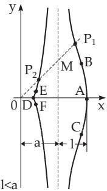

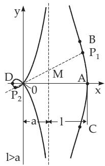

(2.233c)

Figure 2.62  
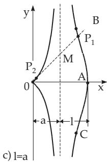

1. Right Branch: The asymptote is $x = a$ . The vertex A is at $( a + l , 0 )$ , the inflection points $B , C$ have as x-coordinate the greatest root of the equation $x ^ { 3 } - 3 a ^ { 2 } x + 2 a ( a ^ { 2 } - l ^ { 2 } ) = 0$ . The area between the right branch and the asymptote is $S = \infty$

2. Left Branch: The asymptote is $x = a$ . The vertex D is at $( a - l , 0 )$ . The origin is a singular point, whose type depends on a and l:

Case a) For $l < a$ it is an isolated point (Fig. 2.62a). The curve has two further inflection points E and F, whose abscissa is the second greatest root of the equation $x ^ { 3 } - 3 a ^ { 2 } x + 2 a ( a ^ { 2 } - l ^ { 2 } ) = { \dot { 0 } }$

Case b) For $l > a$ the origin is a double point (Fig. 2.62b). The curve has a maximum and a minimum value at $x = a - \sqrt [ 3 ] { a l ^ { 2 } }$ . At the origin the slopes of the tangent lines are tan $\alpha = \frac { \pm \sqrt { l ^ { 2 } - a ^ { 2 } } } { a }$ . Here the radius of curvature is $r _ { 0 } = \frac { l \sqrt { l ^ { 2 } - a ^ { 2 } } } { 2 a }$

Case c) For $l = a$ the origin is a cuspidal point (Fig. 2.62c).

#### 2.12.2 General Conchoid

The conchoid of Nicomedes is a special case of the general conchoid. One gets the conchoid of a given curve by elongating the length of the position vector of every point by a given constant segment l. Considering a curve in a polar coordinate system with an equation $\rho = f ( \varphi )$ , then the equation of its conchoid is

$$
\rho = f ( \varphi ) \pm l .\tag{2.234}
$$

So, the conchoid of Nicomedes is the conchoid ofthe line.

#### 2.12.3 Pascal’s Lima¸con

The conchoid of a circle is called the Pascal lima¸con (Fig. 2.63) if in (2.232) the origin is on the perimeter of the circle, which is a further special case of the general conchoid (see 2.12.2, p. 98). The equations in the Cartesian and in the polar coordinate systems and in parametric form are the following (see also (2.246c), p. 105):

$$
( x ^ { 2 } + y ^ { 2 } - a x ) ^ { 2 } = l ^ { 2 } ( x ^ { 2 } + y ^ { 2 } ) \quad ( a > 0 , l > 0 ) ,\tag{2.235a}
$$

$$
\rho = a \cos \varphi + l \quad ( a > 0 , l > 0 ) ,\tag{2.235b}
$$

$$
x = a \cos ^ { 2 } \varphi + l \cos \varphi , \quad y = a \cos \varphi \sin \varphi + l \sin \varphi \quad ( a > 0 , \ l > 0 , \ 0 \leq \varphi < 2 \pi )\tag{2.235c}
$$

with a as the diameter of the circle. The vertices A, B are at $( a \pm l , 0 )$ . The shape of the curve depends on the quantities a and l, as can be seen in Fig. 2.63 and Fig. 2.64.

a) Extreme Points and Inflection Points: For $a > l$ the curve has four extreme points $C , D , E , F ;$ for $a \leq l$ it has two; they are at $\left( \cos \varphi = \frac { - l \pm \sqrt { l ^ { 2 } + 8 a ^ { 2 } } } { 4 a } \right)$ . For $a < l <$ 2a there exist two inflection points G and H at $\left( \cos \varphi = - \frac { 2 a ^ { 2 } + l ^ { 2 } } { 3 a l } \right)$

b) Double Tangent: For $l < 2 a$ , at the points I and K at $\left( - \frac { l ^ { 2 } } { 4 a } , \pm \frac { l \sqrt { 4 a ^ { 2 } - l ^ { 2 } } } { 4 a } \right)$ there is a double tangent.

c) Singular Points: The origin is a singular point: For $a < l$ it is an isolated point, for $a > l$ it is a

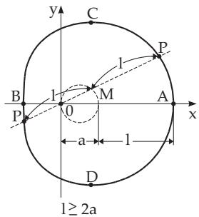  
a)

b)  
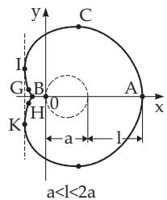

c)  
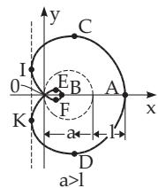  
Figure 2.63

double point and the slopes of the tangent lines are tan $\alpha = \pm \frac { \sqrt { a ^ { 2 } - l ^ { 2 } } } { l }$ , here the radius of curvature is $r _ { 0 } = \frac { 1 } { 2 } \sqrt { a ^ { 2 } - l ^ { 2 } }$

For $a = l$ the origin is a cuspidal point; then the curve is called a cardioid (see also 2.13.3, p. 103). The area of the lima¸con is $S = \frac { \pi a ^ { 2 } } { 2 } + \pi l ^ { 2 }$ , where in the case $a > l ~ ( \mathrm { F i g . 2 . 6 3 c } )$ the area of the inside loop is counted twice.

#### 2.12.4 Cardioid

The cardioid (Fig. 2.64) can be defined in two diferent ways, as:

1. Special case of the Pascal lima¸con with

$$
\overline { { { 0 { \cal P } } } } = \overline { { { 0 { \cal M } } } } \pm a ,\tag{2.236}
$$

where a is the diameter of the circle.

2. Special case of the epicycloid with the same diameter a for the fixed and for the moving circle (see   
2.13.3, p. 103). The equation is

a<c  
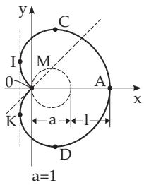  
Figure 2.64

$$
( x ^ { 2 } + y ^ { 2 } ) ^ { 2 } - 2 a x ( x ^ { 2 } + y ^ { 2 } ) = a ^ { 2 } y ^ { 2 } \quad ( a > 0 ) ,\tag{2.237a}
$$

and the parametric form, and the equation in polar coordinates are:

$$
x = a \cos \varphi ( 1 + \cos \varphi ) , \quad y = a \sin \varphi ( 1 + \cos \varphi )
$$

$$
( a > 0 , 0 \leq \varphi < 2 \pi ) ,
$$

$$
\rho = a ( 1 + \cos \varphi ) \quad ( a > 0 ) .\tag{2.237b}
$$

(2.237c)

The origin is a cuspidal point. The vertex A is at $( 2 a , 0 )$ ; extreme points C and D are at cos $\varphi = \frac 1 2$ with coordinates $\left( \frac { 3 } { 4 } a , \pm \frac { 3 \sqrt { 3 } } { 4 } a \right)$ . The area is $S = { \frac { 3 } { 2 } } \pi a ^ { 2 }$ , i.e., six times the area of a circle with diameter a. The length of the curve is $L = 8 a$

#### 2.12.5 Cassinian Curve

The locus of the points P, for which the product of the distances from two fixed points $F _ { 1 }$ and $F _ { 2 }$ with coordinates (c, 0) and $( - c , 0 )$ resp., is equal to a constant $a ^ { 2 } \neq 0$ , is called a Cassinian curve (Fig. 2.65):

$$
{ \overline { { F _ { 1 } P } } } \cdot { \overline { { F _ { 2 } P } } } = a ^ { 2 } .\tag{2.238}
$$

The equations in Cartesian and polar coordinates are:

$$
( x ^ { 2 } + y ^ { 2 } ) ^ { 2 } - 2 c ^ { 2 } ( x ^ { 2 } - y ^ { 2 } ) = a ^ { 4 } - c ^ { 4 } , \quad ( a > 0 , c > 0 ) ,\tag{2.239a}
$$

$$
\rho ^ { 2 } = c ^ { 2 } \cos 2 \varphi \pm { \sqrt { c ^ { 4 } \cos ^ { 2 } 2 \varphi + ( a ^ { 4 } - c ^ { 4 } ) } } \quad ( a > 0 , c > 0 ) .\tag{2.239b}
$$

a)  
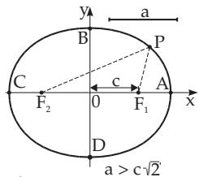

b)  
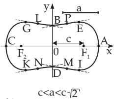

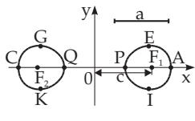  
c)  
Figure 2.65

The shape of the curve depends on the quantities a and c :

Case $a > c { \sqrt { 2 } } { \mathrm { : } }$ : For $a > c { \sqrt { 2 } }$ the curve is an oval whose shape resembles an ellipse (Fig. 2.65a). The intersection points A, C with the x-axis are $( \pm { \sqrt { a ^ { 2 } + c ^ { 2 } } } , 0 )$ , the intersection points B, D with the y-axis are $( 0 , \pm \sqrt { a ^ { 2 } - c ^ { 2 } } )$

Case $a = c { \sqrt { 2 } } ;$ For $a = c { \sqrt { 2 } }$ the curve is of the same type with $A , C \ ( \pm c { \sqrt { 3 } } , 0 )$ and B, $D \ ( 0 , \pm c )$ where the curvature at the points B and D is equal to 0, i.e., there is a narrow contact with the lines $y = \pm c$

Case $c < a < c { \sqrt { 2 } } \colon$ For $c < a < c { \sqrt { 2 } }$ the curve is a pressed oval (Fig. 2.65b). The intersection points with the axes are the same as in the case $a > c { \sqrt { 2 } }$ , also the extreme points B, D, while there are further extreme points E, G, K, I at $\left( \pm { \frac { \sqrt { 4 c ^ { 4 } - a ^ { 4 } } } { 2 c } } , \pm { \frac { a ^ { 2 } } { 2 c } } \right)$ and there are four inflection points P, L,

$$
M , N \mathrm { ~ a t ~ } \left( \pm \sqrt { \frac { 1 } { 2 } ( m - n ) } , \pm \sqrt { \frac { 1 } { 2 } ( m + n ) } \right) \mathrm { ~ w i t h ~ } n = \frac { a ^ { 4 } - c ^ { 4 } } { 3 c ^ { 2 } } \mathrm { ~ a n d ~ } m = \sqrt { \frac { a ^ { 4 } - c ^ { 4 } } { 3 } } .
$$

Case $a = c \mathrm { : }$ For $a = c$ there is the lemniscate.

Case $\textbf { \textit { a } } < \textbf { \textit { c } }$ For $a \ < \ c$ there are two ovals (Fig. 2.65c). The intersection points $A , C$ and $P , Q$ with the x-axis are at $( \pm { \sqrt { a ^ { 2 } + c ^ { 2 } } }$ , 0) and $( \pm { \sqrt { c ^ { 2 } - a ^ { 2 } } } , 0 )$ . The extreme points $E , G , K , I$ are at $\left( \pm { \frac { \sqrt { 4 c ^ { 4 } - a ^ { 4 } } } { 2 c } } , \pm { \frac { a ^ { 2 } } { 2 c } } \right)$ . The radius of curvature is $r = \frac { 2 a ^ { 2 } \rho ^ { 3 } } { c ^ { 4 } - a ^ { 4 } + 3 \rho ^ { 4 } }$ , where $\rho$ satisfies the polar coordinate representation.

#### 2.12.6 Lemniscate

The lemniscate (Fig. 2.66) is the special case $a = c$ of the Cassinian curve satisfying the condition

$$
\overline { { F _ { 1 } P } } \cdot \overline { { F _ { 2 } P } } = \left( \frac { \overline { { F _ { 1 } F _ { 2 } } } } { 2 } \right) ^ { 2 } ,\tag{2.240}
$$

where the fixed points $F _ { 1 } , F _ { 2 }$ are at $( \pm a , 0 )$ . The equation in Cartesian coordinates is

$$
( x ^ { 2 } + y ^ { 2 } ) ^ { 2 } - 2 a ^ { 2 } ( x ^ { 2 } - y ^ { 2 } ) = 0 \quad ( a > 0 )
$$

and in polar coordinates

(2.241a)

$$
\rho = a \sqrt { 2 \cos 2 \varphi } \quad ( a > 0 ) .\tag{2.241b}
$$

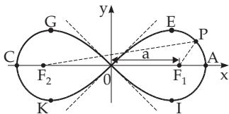

The origin is a double point and an inflection point at the same time, where the tangents are $y = \pm x$

Figure 2.66

The intersection points A and C with the x-axis are at $( \pm a { \sqrt { 2 } } , 0 )$ , the extreme points of the curve $E _ { i }$ $G , K , I$ are at $\left( \pm { \frac { a { \sqrt { 3 } } } { 2 } } , \pm { \frac { a } { 2 } } \right)$ . The polar angle at these points is $\varphi = \pm \frac { \pi } { 6 }$ . The radius of curvature is $r = \frac { 2 a ^ { 2 } } { 3 \rho }$ and the area of every loop is $S = a ^ { 2 }$
