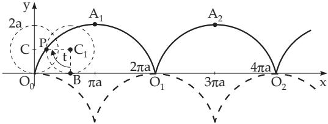
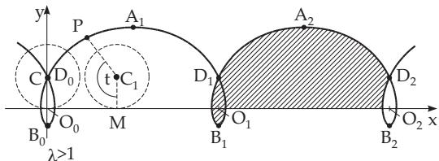
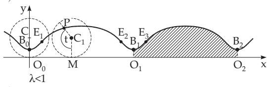
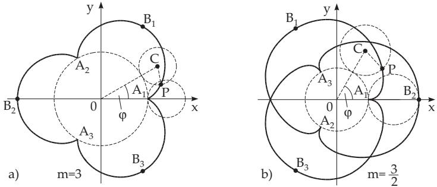
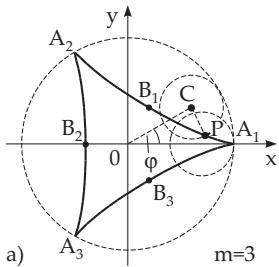
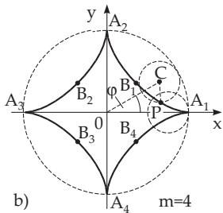
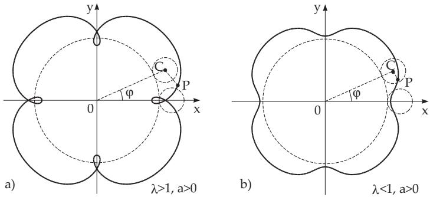
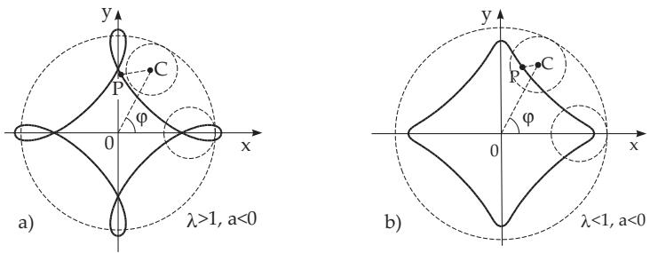

### 2.13 Cycloids

#### 2.13.1 Common (Standard) Cycloid

The cycloid is a curve which is described by a point of the perimeter of a circle while the circle rolls along a line without sliding (Fig. 2.67). The equation of the usual cycloid written in parametric form is the following:

$$
\begin{array} { c } { x = a ( t - \sin t ) , y = a ( 1 - \cos t ) } \\ { \big ( a > 0 , - \infty < t < \infty \big ) , \big ( 2 . 2 4 2 \mathrm { a } \big ) } \end{array}
$$

where a is the radius of the circle and t is the angle <) $P C _ { 1 } B$ in radian measure. In Cartesian coordinates

$$
x + { \sqrt { y ( 2 a - y ) } } = a \operatorname { a r c } _ { k } \cos { \frac { a - y } { a } }
$$

$$
( \ a > 0 , \ k = 0 , \pm 1 , \pm 2 , . . . ) ( 2 . 2 4 2 \mathrm { b } )
$$

holds.

  
Figure 2.67

The curve is periodic with period $\overline { { O _ { 0 } O _ { 1 } } } = 2 \pi a . \mathrm { ~ A t ~ } O _ { 0 } , O _ { 1 } , O _ { 2 } , . . . , O _ { k } = ( 2 k \pi a , 0 )$ there are cusps, the vertices are at $A _ { k + 1 } = ( ( 2 k + 1 ) \pi a , 2 a ~ ( k = 0 , \pm 1 , \pm 2 , . . . ) )$ . The arc length of $O _ { 0 } P$ is $L = 8 a \sin ^ { 2 } ( t / 4 )$ the length of one arch is ${ \cal L } _ { O _ { 0 } A _ { 1 } O _ { 1 } } = 8 a$ . The area of one arch is $S = \widetilde { 3 } \pi a ^ { 2 }$ . The radius of curvature is $r = \ddot { 4 } a \sin { \frac { 1 } { 2 } } t$ , at the vertices $r _ { A } = 4 a$ . The evolute of a cycloid (see 3.6.1.6, p. 254) is a congruent cycloid, which is denoted in Fig. 2.67 by the broken line.

#### 2.13.2 Prolate and Curtate Cycloids or Trochoids

Prolate and curtate cycloids or trochoids are curves described by a point, which is inside or outside of a circle, fixed on a half-line starting from the center of the circle, while the circle rolls along a line without sliding (Fig. 2.68).

The equation of the trochoid in parametric form is

$$
x = a ( t - \lambda \sin t ) ,\tag{2.243a}
$$

$$
y = a ( 1 - \lambda \cos t ) ,\tag{2.243b}
$$

where a is the radius of the circle, t is the angle $\yen  P C _ { 1} M$ , and $\lambda a = \overline { { C _ { 1 } P } }$

The case $\lambda > 1$ gives the prolate cycloid and $\lambda < 1$ the curtate one.

The period of the curve is $\overline { { O _ { 0 } O _ { 1 } } } = \overline { { 2 \pi a } }$ , the maximum points are at $A _ { 1 } , A _ { 2 } , . . . , A _ { k + 1 } = ( ( 2 k + 1 ) \pi a$ , (1+ $\lambda ) a )$ , the minimum points are at $B _ { 0 } , B _ { 1 } , B _ { 2 } , . . . , B _ { k } = ( 2 k \pi a , ( 1 - \lambda ) a ) ( k = 0 , \pm 1 , \pm 2 , . . . )$ . The

prolate cycloid has double points at ${ \cal D } _ { 0 } , { \cal D } _ { 1 } , { \cal D } _ { 2 } , . . . , { \cal D } _ { k } = \bigg [ 2 k \pi a , a \left( 1 - \sqrt { \lambda ^ { 2 } - { t _ { 0 } } ^ { 2 } } \right) \bigg ]$ , where $t _ { 0 }$ is the

a)  
b)  
  
Figure 2.68

smallest positive root of the equation $t =$ λ sin t.

The curtate cycloid has inflection points at $E _ { 1 } , E _ { 2 } , . . . , E _ { k + 1 } =$

$$
\left[ a \left( \mathrm { a r c } _ { k } \cos \lambda - \lambda \sqrt { 1 - \lambda ^ { 2 } } \right) , a \left( 1 - \lambda ^ { 2 } \right) \right] .
$$

The calculation of the length of one $\mathrm { C y - }$ cle can be done by the integral $L \ =$ $a \int _ { 0 } ^ { 2 \pi } { \sqrt { 1 + \lambda ^ { 2 } - 2 \lambda \cos t } } d t$ . The shaded area in Fig. 2.68 is $S = \pi a ^ { 2 } ( 2 + \lambda ^ { 2 } )$

The radius of curvature is $r = a \frac { ( 1 + \lambda ^ { 2 } - 2 \lambda \cos t ) ^ { 3 / 2 } } { \lambda ( \cos t - \lambda ) }$ , which has

the value $r _ { A } = - a \frac { ( 1 + \lambda ) ^ { 2 } } { \lambda }$ at the maxima and the value $r _ { B } = a \frac { ( 1 - \lambda ) ^ { 2 } } { \lambda }$ at the minima.

#### 2.13.3 Epicycloid

A curve is called an epicycloid, if it is described by a point of the perimeter of a circle while this circle rolls along the outside of another circle without sliding (Fig. 2.69). The equation of the epicycloid in parametric form is

$$
x = ( A + a ) \cos \varphi - a \cos \frac { A + a } { a } \varphi , y = ( A + a ) \sin \varphi - a \sin \frac { A + a } { a } \varphi \ ( - \infty < \varphi < \infty ) ,\tag{2.244}
$$

where A is the radius of the fixed circle, a is the radius of the rolling one, and $\varphi$ is the angle $\nless C 0 x$ . The shape of the curve depends on the quotient $m = { \frac { A } { a } }$

For m = 1 one gets the cardioid.

  
Figure 2.69

  
Figure 2.70

Case m integer: For an integer m the curve consists of m identically shaped branches surrounding the fixed curve (Fig. 2.69a). The cusps $A _ { 1 } , A _ { 2 } , \ldots , A _ { m }$ are at $\left( \rho = A , \varphi = { \frac { 2 k \pi } { m } } ( k = 0 , 1 , \ldots , m - 1 ) \right)$ ， the vertices $B _ { 1 } , B _ { 2 } , \ldots , B _ { m }$ are at $\left( \rho = A + 2 a , \quad \varphi = { \frac { 2 \pi } { m } } \left( k + { \frac { 1 } { 2 } } \right) \right)$

Case m a rational fraction: If m is a non-integer rational number, the identically shaped branches follow each other around the fixed circle, overlapping the previous ones, until the moving point P returns back to the starting-point after a finite number of circuits (Fig. 2.69b).

Case m an irrational: For an irrational m the number of round trips is infinite; the point P never returns to the starting-point.

The length of one branch is $L _ { A _ { 1 } B _ { 1 } A _ { 2 } } = { \frac { 8 ( A + a ) } { m } } $ . For an integer m the total length of the closed curve is ${ L _ { \mathrm { t o t a l } } = 8 ( A + a ) }$ . The area of the sector $A _ { 1 } B _ { 1 } A _ { 2 } A _ { 1 }$ (without the sector of the fixed circle) is $S = \pi a ^ { 2 } \left( { \frac { 3 A + 2 a } { A } } \right)$ . The radius of curvature is $r = { \frac { 4 a ( A + a ) } { 2 a + A } } \sin { \frac { A \varphi } { 2 a } }$ , at the vertices $r _ { B } = { \frac { 4 a ( A + a ) } { 2 a + A } }$

#### 2.13.4 Hypocycloid and Astroid

A curve is called a hypocycloid if it is described by a point of the perimeter of a circle, while this circle rolls along the inside of another circle without sliding (Fig. 2.70). The equation of the hypocycloid, the coordinates of the vertices, the cusps, the formulas for the arc-length, the area, and the radius of curvature are similar to the corresponding formulas for the epicycloid, only $^ { 6 6 } { + a ^ { 9 7 } }$ is to be replaced by $^ { 6 6 } - a ^ { * }$ . The number of cusps for integer, rational or irrational m is the same as for the epicycloid (now $m > 1$ holds).

Case m = 2: For $m = 2$ the curve is actually the diameter of the fixed circle.

Case $m = 3 \colon \mathrm { F o r } m = 3$ the hypocycloid has three branches (Fig. 2.70a) with the equation

$$
x = a ( 2 \cos \varphi + \cos 2 \varphi ) , \qquad y = a ( 2 \sin \varphi - \sin 2 \varphi )\tag{2.245a}
$$

and $L _ { \mathrm { t o t a l } } = 1 6 a , S _ { \mathrm { t o t a l } } = 2 \pi a ^ { 2 } .$

Case $m = 4 \colon$ For $m = 4 \ ( { \bf F i g . 2 . 7 0 b } )$ the hypocycloid has four branches, and it is called an astroid (or asteroid). Its equation in Cartesian coordinates and in parametric form is

$$
x ^ { 2 / 3 } + y ^ { 2 / 3 } = A ^ { 2 / 3 } , \quad \quad ( 2 . 2 4 5 \mathrm { b } ) \quad \quad x = A \cos ^ { 3 } \varphi , \quad y = A \sin ^ { 3 } \varphi \quad ( 0 \leq \varphi < \pi )\tag{2.245c}
$$

and $L _ { \mathrm { t o t a l } } = 2 4 a = 6 A , S _ { \mathrm { t o t a l } } = { \frac { 3 } { 8 } } \pi A ^ { 2 } .$

Figure 2.71  
  
Figure 2.72

#### 2.13.5 Prolate and Curtate Epicycloid and Hypocycloid

The prolate and curtate epicycloid and the prolate and curtate hypocycloid, which are also called the epitrochoid and hypotrochoid, are curves (Fig. 2.71 and Fig. 2.72) described by a point, which is inside or outside of a circle, fixed on a half-line starting at the center of the circle, while the circle rolls around

the outside (epitrochoid) or the inside (hypotrochoid) of another circle, without sliding. The equation of the epitrochoid in parametric form is

$$
x = ( A + a ) \cos \varphi - \lambda a \cos \left( \frac { A + a } { a } \varphi \right) , \qquad y = ( A + a ) \sin \varphi - \lambda a \sin \left( \frac { A + a } { a } \varphi \right) ,\tag{2.246a}
$$

where $A$ is the radius of the fixed circle and a is the radius of the rolling one. For the hypocycloid $^ { 6 6 } { + a ^ { 9 7 } }$ is to be replaced by $^ { \circ } - a ^ { \prime \prime }$ . For $\lambda a = \overline { { C P } }$ one of the inequalities $\lambda > 1$ or $\lambda < 1$ is valid, depending on whether the prolate or the curtate curve is considered.

For $A = 2 a$ , and for arbitrary $\lambda \neq 1$ the hypocycloid with equation

$$
x = a ( 1 + \lambda ) \cos \varphi , \quad y = a ( 1 - \lambda ) \sin \varphi \quad ( 0 \leq \varphi < 2 \pi )\tag{2.246b}
$$

describes an ellipse with semi-axes $a ( 1 + \lambda )$ and $a ( 1 - \lambda )$ . For $A = a$ it results in the Pascal lima¸con (see also 2.12.3, p. 98):

$$
x = a ( 2 \cos \varphi - \lambda \cos 2 \varphi ) , \quad y = a ( 2 \sin \varphi - \lambda \sin 2 \varphi ) .\tag{2.246c}
$$

Remark: For the Pascal lima¸con on 2.12.3, p. 98 the quantity denoted by a there is denoted by 2λa here, and the l there is the diameter 2a here. Furthermore the coordinate system is diferent.
