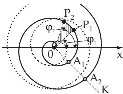
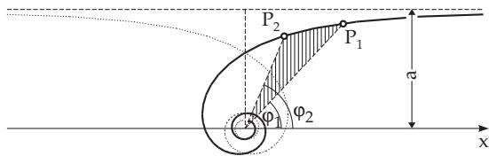
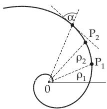
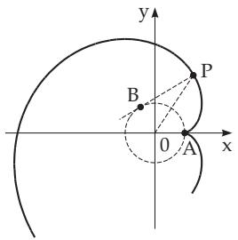
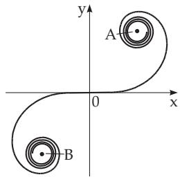

### 2.14 Spirals

#### 2.14.1 Archimedean Spiral

An Archimedean spiral is a curve (Fig. 2.73) described by a point which is moving with constant speed v on a ray, while this ray rotates around the origin at a constant angular velocity ω. The equation of the Archimedean spiral in polar coordinates is

$$
\rho = a | \varphi | , \quad a = \frac { v } { \omega } \quad ( a > 0 , - \infty < \varphi < \infty ) .\tag{2.247}
$$

  
Figure 2.73

  
Figure 2.74

The curve has two branches $( \varphi < 0 , \varphi > 0 )$ in a symmetric position with respect to the y-axis. Every ray 0K intersects the curve at the points $0 , A _ { 1 } , A _ { 2 } , . . . , A _ { n } , . . .$ ; their distance is $\overline { { A _ { i } A _ { i + 1 } } } = 2 \pi a$ . The arclength $\widehat { _ { 0 P } }$ is $L = { \frac { a } { 2 } } \left( \varphi { \sqrt { \varphi ^ { 2 } + 1 } } + \operatorname { A r s i n h } \varphi \right)$ , where for large $\varphi$ the expression $\frac { 2 L } { a \varphi ^ { 2 } }$ tends to 1. The area of the sector $P _ { 1 } 0 P _ { 2 }$ is $S = \frac { a ^ { 2 } } { 6 } ( \varphi _ { 2 } { } ^ { 3 } - \varphi _ { 1 } { } ^ { 3 } )$ . The radius of curvature is $r = a \frac { ( \varphi ^ { 2 } + 1 ) ^ { 3 / 2 } } { \varphi ^ { 2 } + 2 }$ and at the origin $r _ { 0 } = \frac { a } { 2 }$

#### 2.14.2 Hyperbolic Spiral

The equation of the hyperbolic spiral in polar coordinates is

$$
\rho = \frac { a } { \vert \varphi \vert } \left( a > 0 , - \infty < \varphi < 0 , 0 < \varphi < \infty \right) .\tag{2.248}
$$

The curve of the hyperbolic spiral (Fig. 2.74) has two branches $( \varphi \ < \ 0 , \varphi \ > \ 0 )$ in a symmetric position with respect to the y-axis. The line $y = a$ is the asymptote for both branches, and the origin is an asymptotic point. The area of the sector $P _ { 1 } 0 P _ { 2 }$ is $S = \frac { a ^ { 2 } } { 2 } \left( \frac { 1 } { \varphi _ { 1 } } - \frac { 1 } { \varphi _ { 2 } } \right)$ , and $\operatorname * { l i m } _ { \varphi _ { 2 } \to \infty } S = \frac { a ^ { 2 } } { 2 \varphi _ { 1 } }$ is valid. The radius of curvature is $r = \frac { a } { \varphi } \left( \frac { \sqrt { 1 + \varphi ^ { 2 } } } { \varphi } \right) ^ { 3 }$

#### 2.14.3 Logarithmic Spiral

The logarithmic spiral is a curve (Fig. 2.75) which intersects all the rays starting at the origin 0 at the same angle α. The equation of the logarithmic spiral in polar coordinates is

$$
\rho = a e ^ { k \varphi } \quad ( a > 0 , - \infty < \varphi < \infty ) ,\tag{2.249}
$$

where $k ~ = ~ \cot \alpha$ . The origin is the asymptotic point of the curve. The arclength $\overset { \frown } { P _ { 1 } P _ { 2 } }$ is $L \ =$ $\frac { \sqrt { 1 + k ^ { 2 } } } { k } ( \rho _ { 2 } - \rho _ { 1 } )$ , the limit of the arclength $\widehat { _ { 0 P } }$ calculated from the origin is $L _ { 0 } = \frac { \sqrt { 1 + k ^ { 2 } } } { k } \rho .$ The radius of curvature is $r = \sqrt { 1 + k ^ { 2 } } \rho = L _ { 0 } k$

Special case of a circle: For $\alpha = \frac { \pi } { 2 } \mathrm { h o l d s } k = 0$ , and the curve is a circle.

#### 2.14.4 Evolvent of the Circle

The evolvent of the circle is a curve (Fig. 2.76) which is described by the endpoint of a string while rolling it of a circle, and always keeping it tight, so that $\widehat { A B } = \overline { { B P } }$ . The equation of the evolvent ofthe circle is in parametric form

$$
x = a \cos \varphi + a \varphi \sin \varphi , \quad y = a \sin \varphi - a \varphi \cos \varphi ,\tag{2.250}
$$

where a is the radius of the circle, and $\varphi = \sharp B 0 x$ . The curve has two branches in symmetric position with respect to the x-axis. It has a cusp at $A ( a , 0 )$ , and the intersection points with the x-axis are at $x = { \frac { a } { \cos \varphi _ { 0 } } }$ , where $\varphi _ { 0 }$ are the roots of the equation tan $\varphi = \varphi$ . The arclength of $\widehat { A P }$ is ${ \cal L } = \frac { 1 } { 2 } a \varphi ^ { 2 }$ . The radius of curvature is $r = a \varphi = { \sqrt { 2 a L } }$ ; the centre of curvature B is on the circle, i.e., the circle is the evolute of the curve.

  
Figure 2.75

  
Figure 2.76

  
Figure 2.77

#### 2.14.5 Clothoid

The clothoid is a curve (Fig. 2.77) such that at every point the radius of curvature is inversely proportional to the arclength between the origin and the considered point:

$$
r = \frac { a ^ { 2 } } { s } \quad ( a > 0 ) .\tag{2.251a}
$$

The equation of the clothoid in parametric form is

$$
x = a \sqrt { \pi } \int _ { 0 } ^ { t } \cos \frac { \pi t ^ { 2 } } { 2 } d t , \quad y = a \sqrt { \pi } \int _ { 0 } ^ { t } \sin \frac { \pi t ^ { 2 } } { 2 } d t \quad \mathrm { w i t h } \quad t = \frac { s } { a \sqrt { \pi } } , \quad s = \widehat { 0 P } \ .\tag{2.251b}
$$

The integrals cannot be expressed in terms of elementary functions; but for any given value of the parameter $t = t _ { 0 } , t _ { 1 } , . . .$ . it is possible to calculate them by numerical integration (see 19.3, p. 963), so the clothoid can be drawn pointwise. About calculations with a computer see the literature.

The curve is centrosymmetric with respect to the origin, which is also the inflection point. At the inflection point the x-axis is the tangent line. At A and B the curve has asymptotic points with coordinates $\left( + { \frac { a { \sqrt { \pi } } } { 2 } } , + { \frac { a { \sqrt { \pi } } } { 2 } } \right)$ and $\left( - { \frac { a { \sqrt { \pi } } } { 2 } } , - { \frac { a { \sqrt { \pi } } } { 2 } } \right)$ . The clothoid is applied, for instance in road construction,

where the transition between a line and a circular arc is made by a clothoid segment.
