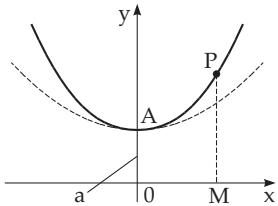
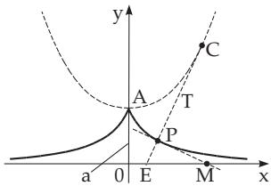

### 2.15 Various Other Curves

#### 2.15.1 Catenary Curve

The catenary curve is a curve wich has the shape of a homogeneous, flexible but inextensible heavy chain hung at both ends (Fig. 2.78) represented by a continuous line. The equation of the catenary curve is

$$
y = a \cosh { \frac { x } { a } } = a { \frac { e ^ { x / a } + e ^ { - x / a } } { 2 } } \quad ( a > 0 ) .\tag{2.252}
$$

The parameter a determines the vertex A at (0, a). The curve is symmetric to the y-axis, and is always higher than the parabola $y = a + { \frac { x ^ { 2 } } { 2 a } }$ , which is represented by the broken line in Fig. 2.78. The arclength of $\widehat { A P }$ is $L = a \sinh { \frac { x } { a } } = a { \frac { e ^ { x / a } - e ^ { - x / a } } { 2 } }$ . The area of the region 0APM has the value $S =$ a $L = a ^ { 2 } \sinh { \frac { x } { a } }$ . The radius of curvature is $r = { \frac { y ^ { 2 } } { a } } = a \cosh ^ { 2 } { \frac { x } { a } } = a + { \frac { L ^ { 2 } } { a } }$

  
Figure 2.78

  
Figure 2.79

The catenary curve is the evolute of the tractrix (see 3.6.1.6, p. 254), so the tractrix is the evolvent (see 3.6.1.6, p. 255) of the catenary curve with vertex A at $( 0 , a )$

#### 2.15.2 Tractrix

The tractrix (the thick line in Fig. 2.79) is a curve such that the length of the segment $\overline { { P M } }$ of the tangent line between the point of contact P and the intersection point with a given straight line, here the x-axis, is a constant a. Fasting one end of an inextensible string of length a to a material point $P$ and dragging the other end along a straight line, here the x-axis, then P draws a tractrix. The equation of the tractrix is

$$
x = a \operatorname { A r c o s h } { \frac { a } { y } } \pm { \sqrt { a ^ { 2 } - y ^ { 2 } } } = a \ln { \frac { a \pm { \sqrt { a ^ { 2 } - y ^ { 2 } } } } { y } } \mp { \sqrt { a ^ { 2 } - y ^ { 2 } } } ( a > 0 , 0 < y \leq a ) .\tag{2.253}
$$

The x-axis is the asymptote. The point A at $( 0 , a )$ is a cusp. The curve is symmetric with respect to the y-axis. The arclength of $A P$ is $L = a \ln { \frac { a } { y } }$ . For increasing arclength L the diference $L - x$ tends to the value $a ( 1 - \ln 2 ) \approx 0 . 3 0 7 a$ , where x is the abscissa of the point P. The radius of curvature is $r = a \cot { \frac { x } { y } }$ . The radius of curvature $\overline { { P C } }$ and the segment ${ \overline { { P E } } } = b$ are inversely proportional: $r b = a ^ { 2 }$ The evolute (see 3.6.1.6, p. 254) of the tractrix, i.e., the geometric locus of the centers of circles of curvature $C ,$ is the catenary curve (2.252), represented by the dotted line in Fig. 2.79.
