### 2.16 Determination of Empirical Curves

#### 2.16.1 Procedure

##### 2.16.1.1 Curve-Shape Comparison

If there are only empirical data for a function $y = f ( x )$ , it is possible to get an approximate formula in two steps. First choose a formula for an approximation which contains free parameters. Then calculate the values of the parameters. If there is no theoretical description for the type of formula, then first choose the approximate formula which is the simplest among the possible functions, comparing their curves with the curve of empirical data. Estimation of similarity by eye can be deceptive. Therefore, after the choice of an approximate formula, and before the determination of the parameters, it is to check whether it is appropriate.

##### 2.16.1.2 Rectification

Supposing there is a definite relation between x and y and in the chosen approximate formula two functions $X = \varphi ( x , y )$ and $Y = \psi ( x , y )$ are introduced such that a linear relation of the form

$$
Y = A X + B\tag{2.254}
$$

holds, where A and B are constant. Calculating the corresponding X and Y values for the given x and y values, and considering their graphical representation, it is easy to check if they are approximately on a straight line, or not. Then it can be decided whether the chosen formula is appropriate.

A: If the approximate formula is $y = { \frac { x } { a x + b } }$ , then substituting $X = x , Y = { \frac { x } { y } }$ , one gets $Y = a X + b$

Another possible substitution is $X = { \frac { 1 } { x } } , Y = { \frac { 1 } { y } }$ . Then $Y = a + b X$ follows.

B: Using semi-logarithmic paper, 2.17.2.1, p. 116.

C: Using double logarithmic paper, 2.17.2.2, p. 117.

In order to decide whether empirical data satisfy a linear relation $Y = A X + B$ or not, one can use linear regression or correlation (see 16.3.4, p. 839). The reduction of a functional relationship to a linear

relation is called rectification. Examples of rectification of some formulas are given in 2.16.2, p. 109, and for an example discussed in detail, see in 2.16, p. 114.

##### 2.16.1.3 Determination of Parameters

The most important and most accurate method of determining the parameters is the least squares method (see 16.3.4.2, p. 841). In several cases, however, even simpler methods can be used with success, for instance the mean value method.

1. Mean Value Method

The mean value method uses the linear dependence of the “rectified” variables X and Y, i.e., $Y =$ $A X + B$ as follows: The conditional equations $Y _ { i } = A X _ { i } + B$ for the given values $Y _ { i } , X _ { i }$ are to be divided into two groups, which have the same size, or approximately the same size. By adding the equations in the groups one gets two equations, from which A and B can be determined. Then replacing X and Y by the original variables x and y again, one gets the connection between x and y, which is what one was looking for.

If not all the parameters are to be determined, one can apply the mean value method again with a rectification by other amounts $\overline { { X } }$ and $\overline { { Y } }$ (see, e.g., 2.16.2.11, p. 113).

Rectification and the mean value method are used above all when certain parameters occur in non-linear relations in an approximate formula, as for instance in (2.267b), (2.267c).

2. Least Squares Method

When certain parameters occur in non-linear relations in the approximation formula, the least squares method usually leads to a non-linearfitting problem. Their solution needs a lot of numerical calculations and also a good initial approximation. These approximations can be determined by the rectification and mean value method.

#### 2.16.2 Useful Empirical Formulas

In this paragraph some of the simplest cases of empirical functional dependence are discussed, and the corresponding graphs are presented. Each figure shows several curves corresponding to diferent parameter values involved in the formula. The influence of the parameters upon the forms of the curves is discussed in the following sections.

For the choice of the appropriate function, usually only that part of the corresponding graph is to be considered, which is used for the reproduction of the empirical data. Therefore, e.g., one should not think that the formula $y = a x ^ { 2 } +$ bx + c is suitable only in the case when the curve of the empirical data have a maximum or minimum.

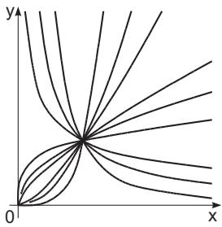  
Figure 2.80

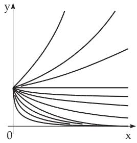  
Figure 2.81

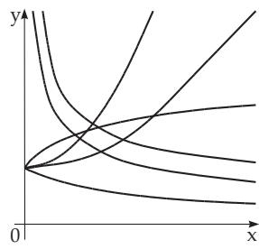  
Figure 2.82

##### 2.16.2.1 Power Functions

1. Type $y = a x ^ { b }$

Typical shapes of curve for diferent values of the exponent b

$$
y = a x ^ { b }\tag{2.255a}
$$

are shown in Fig. 2.80. The curves for diferent values of the exponent are also represented in Figs. 2.15, 2.21, 2.24, 2.25 and Fig. 2.26. The functions are discussed on pages 66, 70 and 71 for the formula (2.44) as a parabola of order $n ,$ formula (2.45) as a reciprocal proportionality and formula (2.50) as a reciprocal power function. The rectification is made by taking the logarithm

$$
X = \log x , \quad Y = \log y : \quad Y = \log a + b X .\tag{2.255b}
$$

2. Type $y = a x ^ { b } + c \colon$

The formula

$$
y = a x ^ { b } + c\tag{2.256a}
$$

produces the same curve as in (2.255a), but it is shifted by c in the direction of y (Fig. 2.82). If b is given, the following rectification can be used:

$$
X = x ^ { b } , \quad Y = y \colon \quad Y = a X + c .\tag{2.256b}
$$

If b is not known first c is to be determined, then the rectification can be done in accordance with

$$
X = \log x , \quad Y = \log ( y - c ) \colon \quad Y = \log a + b x .\tag{2.256c}
$$

In order to determine a first approach of $c ,$ one can choose two arbitrary abscissae $x _ { 1 } , x _ { 2 }$ and a third one, $x _ { 3 } = \sqrt { x _ { 1 } x _ { 2 } }$ as well as the corresponding ordinates y1, y2, y3, so that now

$$
c = { \frac { y _ { 1 } y _ { 2 } - { y _ { 3 } } ^ { 2 } } { y _ { 1 } + y _ { 2 } - 2 y _ { 3 } } }\tag{2.256d}
$$

holds. After having determined a and $b ,$ one can get a corrected $c ,$ namely as the average of the amounts $y - a x ^ { b }$

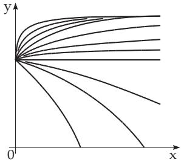  
Figure 2.83

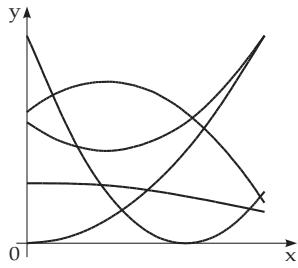  
Figure 2.84

##### 2.16.2.2 Exponential Functions

1. Type $y = a e ^ { b x }$

The characteristic shapes of the curves of the function

$$
y = a e ^ { b x }\tag{2.257a}
$$

are shown in Fig. 2.81. The discussion of the exponential function (2.54) and its graph (Fig. 2.26) is presented in 2.6.1, p. 72. For the rectification one takes

$$
X = x , \quad Y = \log y : \quad Y = \log a + b \log e \cdot X .\tag{2.257b}
$$

2. Type $y = a e ^ { b x } + c$ c:

The formula

$$
y = a e ^ { b x } + c\tag{2.258a}
$$

produce the same curve as (2.257a), but it is shifted by c in the direction of y (Fig. 2.83). Begin with the determination of a first approach $c _ { 1 }$ for c then the rectification by logarithm:

$$
Y = \log ( y - c _ { 1 } ) , \quad X = x { : } \quad Y = \log a + b \log e \cdot X .\tag{2.258b}
$$

In order to determine c as for (2.256d) two arbitrary abscissae $x _ { 1 } , x _ { 2 }$ are to be chosen and $x _ { 3 } = { \frac { x _ { 1 } + x _ { 2 } } { 2 } }$ as well as the corresponding ordinates $y _ { 1 } , y _ { 2 }$ , y to get $c = { \frac { y _ { 1 } y _ { 2 } - { y _ { 3 } } ^ { 2 } } { y _ { 1 } + y _ { 2 } - 2 y _ { 3 } } }$ . After having determined a and b one can get a corrected $c ,$ namely as the average of the amounts $y - a x ^ { b }$

##### 2.16.2.3 Quadratic Polynomial

Possible shapes of curves of the quadratic polynomial

$$
y = a x ^ { 2 } + b x + c\tag{2.259a}
$$

are shown in Fig. 2.84. For the discussion of quadratic polynomials (2.41) and their curves Fig. 2.12 (see 2.3.2, p. 64). Usually the coeficients a, b and c are determined by the least squares method; but in this case also rectification is possible. Choosing an arbitrary point of data $( x _ { 1 } , y _ { 1 } )$ one rectifies

$$
X = x , \quad Y = \frac { y - y _ { 1 } } { x - x _ { 1 } } \colon Y = ( b + a x _ { 1 } ) + a X .\tag{2.259b}
$$

If the given x values form an arithmetical sequence with a diference h, one rectifies

$$
Y = \Delta y , \quad X = x \colon \quad Y = ( b h + a h ^ { 2 } ) + 2 a h X .\tag{2.259c}
$$

In both cases after the determination of a and b from the equation

$$
\sum y = a \sum x ^ { 2 } + b \sum x + n c\tag{2.259d}
$$

c is to be calculated; n is the number of the given x values, for which the sum is calculated.

##### 2.16.2.4 Rational Linear Functions

The rational linear function

$$
y = { \frac { a x + b } { c x + d } }\tag{2.260a}
$$

is discussed in 2.4 with (2.46) and graphical representation Fig. 2.17 (see p. 66). Choosing an arbitrary data point $( x _ { 1 } , y _ { 1 } )$ the rectification is done by the formulas

$$
Y = { \frac { x - x _ { 1 } } { y - y _ { 1 } } } , \quad X = x { : } \quad Y = A + B X .\tag{2.260b}
$$

After determining the values A and B the relation can be written in the form (2.260c). Sometimes instead of (2.260a) the form (2.260d)is suficient:

$$
y = y _ { 1 } + { \frac { x - x _ { 1 } } { A + B x } } , { \mathrm { ~ ( 2 . 2 6 0 c ) } }
$$

$$
y = { \frac { x } { c x + d } } \quad { \mathrm { o r } } \quad y = { \frac { 1 } { c x + d } } .\tag{2.260d}
$$

Then in the first case the rectification can be made by $X = { \frac { 1 } { x } } \operatorname { a n d } Y = { \frac { 1 } { y } } \operatorname { o r } X = x \operatorname { a n d } Y = { \frac { x } { y } }$ and by X = x and $Y = { \frac { 1 } { y } }$ in the second case.

##### 2.16.2.5 Square Root of a Quadratic Polynomial

Several possible shapes of curves of the equation

$$
y ^ { 2 } = a x ^ { 2 } + b x + c\tag{2.261}
$$

are shown in Fig. 2.85. The discussion of the function (2.52) and its graph Fig. 2.23 (see p. 71). If introducing the new variable $Y = y ^ { 2 }$ , the problem can be reduced to the case of the quadratic polynomial in 2.16.2.3, p. 111.

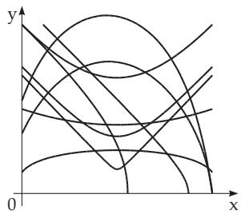  
Figure 2.85

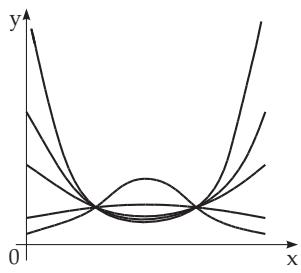  
Figure 2.86

##### 2.16.2.6 General Error Curve

The typical shapes of curves of the functions

$$
y = a e ^ { b x + c x ^ { 2 } } \quad { \mathrm { o r } } \quad \log y = \log a + b x \log e + c x ^ { 2 } \log e\tag{2.262}
$$

are shown in Fig. 2.86. The discussion of the function with equation (2.61) and its graph Fig. 2.31 (see p. 75).

Introducing the new variable $Y = \log y _ { ; }$ the problem is reduced to the case of the quadratic polynomial in 2.16.2.3, p. 111.

##### 2.16.2.7 Curve of Order Three, Type II

The possible shapes of graphs of the function

$$
y = { \frac { 1 } { a x ^ { 2 } + b x + c } } .\tag{2.263}
$$

are represented in Fig. 2.87. The discussion of the function with equation (2.48) and with graphs Fig. 2.19 (see p. 67).

By introducing the new variable $Y = { \frac { 1 } { y } }$ , the problem is reduced to the case of the quadratic polynomia in 2.16.2.3, p. 111.

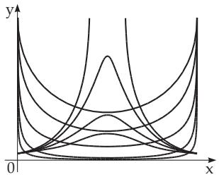  
Figure 2.87

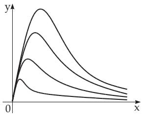  
Figure 2.88

##### 2.16.2.8 Curve of Order Three, Type III

Typical shapes of curves of functions of the type

$$
y = { \frac { x } { a x ^ { 2 } + b x + c } }\tag{2.264}
$$

are represented in Fig. 2.88. The discussion of the function with equation (2.49) and with graphs Fig. 2.20 (see p. 68).

Introducing the new variable $Y = { \frac { x } { y } }$ the problem can be reduced to the case of the quadratic polynomial in 2.16.2.3, p. 111.

##### 2.16.2.9 Curve of Order Three, Type I

Typical shapes of curves of functions of the type

$$
y = a + { \frac { b } { x } } + { \frac { c } { x ^ { 2 } } }\tag{2.265}
$$

are represented in Fig. 2.89. The discussion of the function with equation (2.47) and with graphs Fig. 2.18 (see p. 67).

Introducing the new variable $X = { \frac { 1 } { x } }$ the problem can be reduced to the case of the quadratic polynomial in 2.16.2.3, p. 111.

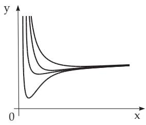  
Figure 2.89

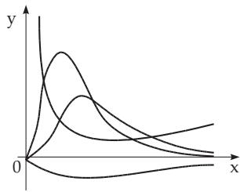  
Figure 2.90

##### 2.16.2.10 Product of Power and Exponential Functions

Typical shapes of curves of functions of the type

$$
y = a x ^ { b } e ^ { c x }\tag{2.266a}
$$

are represented in Fig. 2.90. The discussion of the function with equation (2.62) and with graphs Fig. 2.31 (see p. 75).

If the empirical values of x form an arithmetical sequence with diference h, the rectification follows in accordance with

$$
Y = \Delta \log y , \quad X = \Delta \log x : \quad Y = h c \log e + b X .\tag{2.266b}
$$

Here $\Delta$ log y and $\Delta$ log x denote the diference of two subsequent values of log y and log x respectively. If the x values form a geometric sequence with quotient q, then the rectification follows by

$$
X = x , \quad Y = \Delta \log y : \quad Y = b \log q + c ( q - 1 ) X \log e .\tag{2.266c}
$$

After b and c are determined the logarithm of the given equation is taken, and the value of log a is calculated like in (2.259d).

If the given x values do not form a geometric sequence, but one can choose pairs of two values of x such that their quotient q is the same constant, then the rectification is the same as in the case of a geometric sequence of x values with the substitution $Y = \Delta _ { 1 }$ log y. Here $\Delta _ { 1 }$ log y denotes the diference of the two values of log y whose corresponding x values result in the constant quotient $q$ (see 2.16.2.12, p. 114).

##### 2.16.2.11 Exponential Sum

Typical shapes of curves of the exponential sum

$$
y = a e ^ { b x } + c e ^ { d x }\tag{2.267a}
$$

are represented in Fig. 2.91. The discussion of the function with equation (2.60) and with graphs Fig. 2.29 (see p. 74).

If the values of x form an arithmetical sequence with diference h, and y, y , y are any three consecutive values of the given function, then the rectification is made by

$$
Y = \frac { y _ { 2 } } { y } , \quad X = \frac { y _ { 1 } } { y } ; \quad Y = ( e ^ { b h } + e ^ { d h } ) X - e ^ { b h } \cdot e ^ { d h } .\tag{2.267b}
$$

After b and d are determined, follows again a rectification by

$$
\overline { { Y } } = y e ^ { - d x } , \quad \overline { { X } } = e ^ { ( b - d ) x }    { : } \quad \overline { { Y } } = a \overline { { X } } + c .\tag{2.267c}
$$

##### 2.16.2.12 Numerical Example

Find an empirical formula to describe the relation between x and y for given values in Table 2.9.

Choice of the Approximation Function: Comparing the graph prepared from the given data (Fig. 2.92) with the curves discussed before, one can see that formulas (2.264) or (2.266a) with curves in Fig. 2.88 and Fig. 2.90 can fit the considered case.

Determination of Parameters: Using the formula (2.264) to rectify are $\Delta { \frac { x } { y } }$ and x. The calculation shows, however, the relationship between x and $\Delta { \frac { x } { y } }$ is far from linear. To verify whether the formula (2.266a) is suitable one plots the graph of the relation between $\Delta \log x$ and $\Delta \log y$ for $h = 0 , 1$ in Fig. 2.93, and also between $\Delta _ { 1 }$ log y and x for $q \ : = \ : 2$ in Fig. 2.94. In both cases the points fit a straight line well enough, so the formula $y = a x ^ { b } e ^ { \hat { c } x }$ can be used.

Table 2.9 For the approximate determination of an empirically given function relation
<table><tr><td rowspan=1 colspan=1>x</td><td rowspan=1 colspan=1>y</td><td rowspan=1 colspan=1> $\frac x y$ </td><td rowspan=1 colspan=1> $\Delta { \frac { x } { y } }$ </td><td rowspan=1 colspan=1> $\lg x$ </td><td rowspan=1 colspan=1>lgy</td><td rowspan=1 colspan=1> $\varDelta \log x$ </td><td rowspan=1 colspan=1> $\varDelta \log y$ </td><td rowspan=1 colspan=1> $\varDelta _ { 1 } \log y$ </td><td rowspan=1 colspan=1>Yerr</td></tr><tr><td rowspan=1 colspan=1>0.1</td><td rowspan=1 colspan=1>1.78</td><td rowspan=1 colspan=1>0.056</td><td rowspan=1 colspan=1>0.007</td><td rowspan=1 colspan=1>-1.000</td><td rowspan=1 colspan=1>0.250</td><td rowspan=1 colspan=1>0.301</td><td rowspan=1 colspan=1>0.252</td><td rowspan=1 colspan=1>0.252</td><td rowspan=1 colspan=1>1.78</td></tr><tr><td rowspan=2 colspan=1>0.20.3</td><td rowspan=1 colspan=1>3.18</td><td rowspan=1 colspan=1>0.063</td><td rowspan=1 colspan=1>0.031</td><td rowspan=1 colspan=1>-0.699</td><td rowspan=1 colspan=1>0.502</td><td rowspan=1 colspan=1>0.176</td><td rowspan=1 colspan=1>+0.002</td><td rowspan=1 colspan=1>-0.097</td><td rowspan=1 colspan=1>3.15</td></tr><tr><td rowspan=1 colspan=1>3.19</td><td rowspan=1 colspan=1>0.094</td><td rowspan=1 colspan=1>0.063</td><td rowspan=1 colspan=1>-0.523</td><td rowspan=1 colspan=1>0.504</td><td rowspan=1 colspan=1>0.125</td><td rowspan=1 colspan=1>-0.099</td><td rowspan=1 colspan=1>-0,447</td><td rowspan=1 colspan=1>3.16</td></tr><tr><td rowspan=1 colspan=1>0.4</td><td rowspan=1 colspan=1>2.54</td><td rowspan=1 colspan=1>0.157</td><td rowspan=1 colspan=1>0.125</td><td rowspan=1 colspan=1>-0.398</td><td rowspan=1 colspan=1>0.405</td><td rowspan=1 colspan=1>0.097</td><td rowspan=1 colspan=1>-0.157</td><td rowspan=1 colspan=1>-0.803</td><td rowspan=1 colspan=1>2.52</td></tr><tr><td rowspan=1 colspan=1>0.5</td><td rowspan=1 colspan=1>1.77</td><td rowspan=1 colspan=1>0.282</td><td rowspan=1 colspan=1>0.244</td><td rowspan=1 colspan=1>-0.301</td><td rowspan=1 colspan=1>0.248</td><td rowspan=1 colspan=1>0.079</td><td rowspan=1 colspan=1>-0.191</td><td rowspan=1 colspan=1>-1.134</td><td rowspan=1 colspan=1>1.76</td></tr><tr><td rowspan=3 colspan=1>0.60.70.8</td><td rowspan=3 colspan=1>1.140.690.40</td><td rowspan=1 colspan=1>0.526</td><td rowspan=1 colspan=1>0.488</td><td rowspan=1 colspan=1>-0.222</td><td rowspan=1 colspan=1>0.057</td><td rowspan=1 colspan=1>0.067</td><td rowspan=1 colspan=1>-0.218</td><td rowspan=1 colspan=1>-1.455</td><td rowspan=1 colspan=1>1.14</td></tr><tr><td rowspan=1 colspan=1>1.014</td><td rowspan=1 colspan=1>0.986</td><td rowspan=1 colspan=1>-0.155</td><td rowspan=1 colspan=1>-0.161</td><td rowspan=1 colspan=1>0.058</td><td rowspan=1 colspan=1>-0.237</td><td rowspan=1 colspan=1></td><td rowspan=1 colspan=1>0.70</td></tr><tr><td rowspan=1 colspan=1>2.000</td><td rowspan=1 colspan=1>1.913</td><td rowspan=1 colspan=1>-0.097</td><td rowspan=1 colspan=1>-0.398</td><td rowspan=1 colspan=1>0.051</td><td rowspan=1 colspan=1>-0.240</td><td rowspan=1 colspan=1></td><td rowspan=1 colspan=1>0.41</td></tr><tr><td rowspan=1 colspan=1>0.9</td><td rowspan=1 colspan=1>0.23</td><td rowspan=1 colspan=1>3.913</td><td rowspan=1 colspan=1>3.78</td><td rowspan=1 colspan=1>-0.046</td><td rowspan=1 colspan=1>-0.638</td><td rowspan=1 colspan=1>0.046</td><td rowspan=1 colspan=1>-0.248</td><td rowspan=1 colspan=1></td><td rowspan=1 colspan=1>0.23</td></tr><tr><td rowspan=1 colspan=1>1.0</td><td rowspan=1 colspan=1>0.13</td><td rowspan=1 colspan=1>7.69</td><td rowspan=1 colspan=1>8.02</td><td rowspan=1 colspan=1>0.000</td><td rowspan=1 colspan=1>-0.886</td><td rowspan=1 colspan=1>0.041</td><td rowspan=1 colspan=1>-0.269</td><td rowspan=1 colspan=1></td><td rowspan=1 colspan=1>0.13</td></tr><tr><td rowspan=2 colspan=1>1.11.2</td><td rowspan=1 colspan=1>0.07</td><td rowspan=1 colspan=1>15.71</td><td rowspan=1 colspan=1>14.29</td><td rowspan=1 colspan=1>0.041</td><td rowspan=1 colspan=1>-1.155</td><td rowspan=1 colspan=1>0.038</td><td rowspan=1 colspan=1>-0.243</td><td rowspan=1 colspan=1></td><td rowspan=1 colspan=1>0.07</td></tr><tr><td rowspan=1 colspan=1>0.04</td><td rowspan=1 colspan=1>30.0</td><td rowspan=1 colspan=1></td><td rowspan=1 colspan=1>0.079</td><td rowspan=1 colspan=1>-1.398</td><td rowspan=1 colspan=1></td><td rowspan=1 colspan=1></td><td rowspan=1 colspan=1></td><td rowspan=1 colspan=1>0.04</td></tr></table>

In order to determine the constants $^ { a , }$ b and $c ,$ a linear relation between x and $\Delta _ { 1 }$ log y is to be searched by the method of mean values. Adding the conditional equations $\Delta _ { 1 } \log y = b \log 2 + c x$ log e in groups of three equations each, yields

$$
- 0 . 2 9 2 = 0 . 9 0 3 b + 0 . 2 6 0 6 c , \quad - 3 . 3 9 2 = 0 . 9 0 3 b + 0 . 6 5 1 4 c ,
$$

and from here $b = 1 . 9 6 6$ and $c = - 7 . 9 3 2$ holds. To determine a, the equations of the form log $y =$ log $a + b$ log x + c log $e \cdot x$ are to be added, which yields $- 2 . 6 7 0 = 1 2 \log a - 6 . 5 2 9 - 2 6 . 8 7 ,$ so from log $a = 2 . 5 6 1$ , a = 364 follows. The values of y calculated from the formula $y = 3 6 4 x ^ { 1 , 9 6 6 } e ^ { - 7 . 0 3 2 x }$ are given in the last column of Table 2.9; they are denoted by $y _ { \mathrm { e r r } }$ as an approximation of $y .$ . The error sum of squares is 0.0024.

Using the parameters determined by rectification as initial values for the iterative solution of the non-

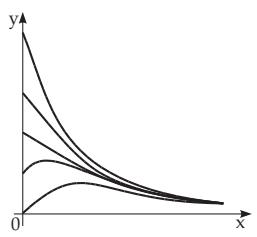

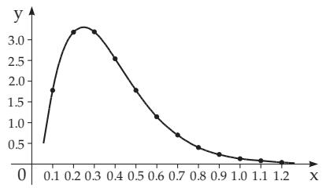  
Figure 2.92

Figure 2.91  
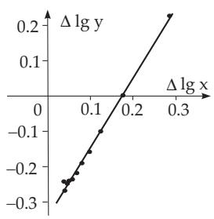  
Figure 2.93

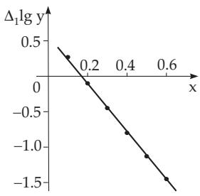  
Figure 2.94  
linear least squares problem (see 19.6.2.4, p. 987)

$$
\sum _ { i = 1 } ^ { 1 2 } [ y _ { i } - a x _ { i } ^ { b } e ^ { c x _ { i } } ] ^ { 2 } = \mathrm { m i n } !
$$

yields $a = 3 9 6 . 6 0 1 9 8 6 , b = 1 . 9 9 8 0 9 8 , c = - 8 . 0 0 0 0 9 1 6$ with the small error sum of squares 0.000 0916.
