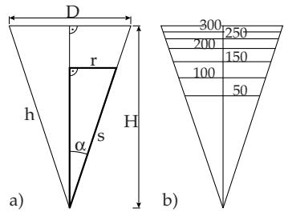
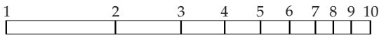
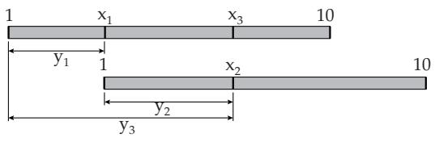
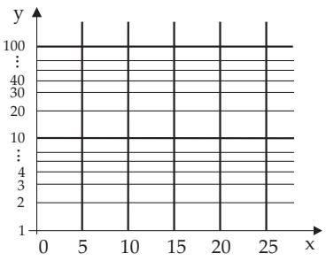
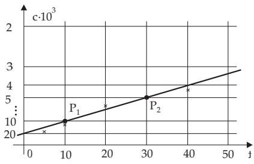

### 2.17 Scales and Graph Paper

#### 2.17.1 Scales

The base of a scale is a function $y = f ( x )$ . The task is to construct a scale from this function so that on a curve, e.g. on a line, the function values of y are to be inserted as the values of the argument x. A scale can be considered as a one-dimensional representation of a table of values.

The scale equation for the function $y = f ( x )$ is:

$$
y = l [ f ( x ) - f ( x _ { 0 } ) ] .\tag{2.268}
$$

The starting point of the scale is fixed at $x _ { 0 }$ . The scale factor l takes into consideration that for a concrete scale there it is only one given scale length.

A Logarithmic Scale: For $l = 1 0$ cm and $x _ { 0 } = 1$ the scale equation is $y = 1 0 [ \lg { \bar { x } } - \lg 1 ] = 1 0 \log x$ (in cm). For the table of values

<table><tr><td rowspan=1 colspan=1>x</td><td rowspan=1 colspan=1>1</td><td rowspan=1 colspan=1>2</td><td rowspan=1 colspan=1>3</td><td rowspan=1 colspan=1>4</td><td rowspan=1 colspan=1>5</td><td rowspan=1 colspan=1>6</td><td rowspan=1 colspan=1>7</td><td rowspan=1 colspan=1>8</td><td rowspan=1 colspan=1>9</td><td rowspan=1 colspan=1>10</td></tr><tr><td rowspan=1 colspan=1>y = lg x</td><td rowspan=1 colspan=1>0</td><td rowspan=1 colspan=1>0.30</td><td rowspan=1 colspan=1>0.48</td><td rowspan=1 colspan=1>0.60</td><td rowspan=1 colspan=1>0.70</td><td rowspan=1 colspan=1>0.78</td><td rowspan=1 colspan=1>0.85</td><td rowspan=1 colspan=1>0.90</td><td rowspan=1 colspan=1>0.95</td><td rowspan=1 colspan=1>1</td></tr></table>

one gets the scale shown in Fig. 2.95.

  
Figure 2.95

B Slide Rule: The most important application of the logarithmic scale, from a historical viewpoint, was the slide rule. Here, for instance, multiplication and division were performed with the help of two identically calibrated logarithmic scales, which can be shifted along each other.

From Fig. 2.96 one can read: $y _ { 3 } = y _ { 1 } + y _ { 2 } , \mathrm { i . e . , } \mathrm { l g } x _ { 3 } = \mathrm { l g } x _ { 1 } + \mathrm { l g } x _ { 2 } = \mathrm { l g } x _ { 1 } x _ { 2 } , \mathrm { h e n c e } x _ { 3 } = x _ { 1 } \cdot x _ { 2 } ; \ y _ { 1 } =$ $y _ { 3 } - y _ { 2 } , \mathrm { i . e . , } \mathrm { l g } x _ { 1 } = \mathrm { l g } x _ { 3 } - \mathrm { l g } x _ { 2 } = \mathrm { l g } { \frac { x _ { 3 } } { x _ { 2 } } } , \mathrm { s o } x _ { 1 } = { \frac { x _ { 3 } } { x _ { 2 } } } .$

C Volume Scale on the lateral surface of a conical shaped funnel: A scale is to be marked on the funnel, so that the volume inside could be read from it. The data of the funnel are: Height $H = 1 5 \mathrm { c m }$ upper diameter D = 10 cm.

Taking in mind Fig. 2.97a gives the scale equation as follows: Volume $V = \frac { 1 } { 3 } r ^ { 2 } \pi h$ , apothem $s =$ $\sqrt { h ^ { 2 } + r ^ { 2 } }$ , tan $\alpha = \frac { r } { h } = \frac { D / 2 } { H } = \frac { 1 } { 3 }$ . From these $h = 3 r , \ s = r \sqrt { 1 0 } , V = \frac { \pi } { ( \sqrt { 1 0 } ) ^ { 3 } }$ follows, so the scale equation is $s = { \frac { \sqrt { 1 0 } } { \sqrt [ 3 ] { \pi } } } { \sqrt [ { 3 } ] { V } } \approx 2 . 1 6 { \sqrt [ 3 ] { V } }$ . The following table of values contains the calibration marks on the funnel as in the figure:

<table><tr><td rowspan=1 colspan=1>V</td><td rowspan=1 colspan=1>0</td><td rowspan=1 colspan=1>50</td><td rowspan=1 colspan=1>100</td><td rowspan=1 colspan=1>150</td><td rowspan=1 colspan=1>200</td><td rowspan=1 colspan=1>250</td><td rowspan=1 colspan=1>300</td><td rowspan=1 colspan=1>350</td></tr><tr><td rowspan=1 colspan=1>S</td><td rowspan=1 colspan=1>0</td><td rowspan=1 colspan=1>7.96</td><td rowspan=1 colspan=1>10.03</td><td rowspan=1 colspan=1>11.48</td><td rowspan=1 colspan=1>12.63</td><td rowspan=1 colspan=1>13.61</td><td rowspan=1 colspan=1>14.46</td><td rowspan=1 colspan=1>15.22</td></tr></table>

  
Figure 2.96  
Figure 2.97

#### 2.17.2 Graph Paper

The most useful graph paper is prepared so that the axes of a right-angle coordinate system are calibrated by the scale equations

$$
x = l _ { 1 } [ g ( u ) - g ( u _ { 0 } ) ] , \quad y = l _ { 2 } [ f ( v ) - f ( v _ { 0 } ) ] .\tag{2.269}
$$

Here $l _ { 1 }$ and $l _ { 2 }$ are the scale factors; u0 and v0 are the initial points of the scale.

##### 2.17.2.1 Semilogarithmic Paper

If the x-axis has an equidistant subdivision, and the y-axis has a logarithmic one, then one talks about semilogarithmic paper or about a semilogarithmic coordinate system.

Scale Equations:

$$
x = l _ { 1 } [ u - u _ { 0 } ] \quad \mathrm { ( l i n e a r \ s c a l e ) } , \quad y = l _ { 2 } [ \mathrm { l g } \ v - \mathrm { l g } \ v _ { 0 } ] \quad \mathrm { ( l o g a r i t h m i c \ s c a l e ) } .\tag{2.270}
$$

The Fig. 2.98 shows an example of semilogarithmic paper.

Representation ofExponential Functions: On semilogarithmic paper the graph of the exponential function

$$
y = \alpha e ^ { \beta x } \quad ( \alpha , \beta \mathrm { c o n s t ) }\tag{2.271a}
$$

is a straight line (see rectification in 2.16.2.2, p. 110). This property can be used in the following way: If the measuring points, introduced on semilogarithmic paper, lie approximately on a line, it can be supposed a relation between the variables as in (2.271a). With this line, estimated by eye, one can determine the approximate values of α and $\beta \colon$ Considering two points $P _ { 1 } ( x _ { 1 } , y _ { 1 } )$ and $\dot { P } _ { 2 } ( \dot { x } _ { 2 } , y _ { 2 } )$ from this line one gets

$$
\beta = { \frac { \ln y _ { 2 } - \ln y _ { 1 } } { x _ { 2 } - x _ { 1 } } } \quad { \mathrm { a n d , e . g . , } } \quad \alpha = y _ { 1 } e ^ { \beta x _ { 1 } } .\tag{2.271b}
$$

  
Figure 2.98

  
Figure 2.99

##### 2.17.2.2 Double Logarithmic Paper

If both axes of a right-angle x, y coordinate system are calibrated with respect to the logarithm function, then one talks about double logarithmic paper or log–log paper or a double logarithmic coordinate system.

Scale Equations: The scale equations are

$$
x = l _ { 1 } [ \lg u - \lg u _ { 0 } ] , \qquad y = l _ { 2 } [ \lg v - \lg v _ { 0 } ] ,\tag{2.272}
$$

where $l _ { 1 } , l _ { 2 }$ are the scale factors and $u _ { 0 } , v _ { 0 }$ are the initial points.

Representation of Power Functions (see 2.5.3, p. 71): Log–log paper has a similar arrangement to semilogarithmic paper, but the x-axis also has a logarithmic subdivision. In this coordinate system the graph of the power function

$$
\begin{array} { r l } { y = \alpha x ^ { \beta } } & { { } ( \alpha , \beta \mathrm { c o n s t } ) } \end{array}\tag{2.273}
$$

is a straight line (see rectification of a power function in 2.16.2.1, p. 109). This property can be used in the same way as in the case of semilogarithmic paper.

##### 2.17.2.3 Graph Paper with a Reciprocal Scale

The subdivisions of the scales on the coordinate axes follow from (2.45) for the function of inverse proportionality (see 2.4.1, p. 66).

Scale Equations:

$$
x = l _ { 1 } [ u - u _ { 0 } ] , \quad y = l _ { 2 } \left[ { \frac { a } { v } } - { \frac { a } { v _ { 0 } } } \right] \quad ( a \mathrm { c o n s t } ) ,\tag{2.274}
$$

where $l _ { 1 }$ and $l _ { 2 }$ are the scale factors, and $u _ { 0 } , v _ { 0 }$ are the starting points.

Concentration in a Chemical Reaction: For a chemical reaction, the concentration denoted by $c = c ( t )$ , has been measured as a function of the time t, giving the following results for c:

<table><tr><td rowspan=1 colspan=1>t/min</td><td rowspan=1 colspan=1>5</td><td rowspan=1 colspan=1>10</td><td rowspan=1 colspan=1>20</td><td rowspan=1 colspan=1>40</td></tr><tr><td rowspan=1 colspan=1>c · 103/mol/1</td><td rowspan=1 colspan=1>15.53</td><td rowspan=1 colspan=1>11.26</td><td rowspan=1 colspan=1>7.27</td><td rowspan=1 colspan=1>4.25</td></tr></table>

It can be supposed that the reaction is of second order, i.e., the relation should be

$$
c ( t ) = { \frac { c _ { 0 } } { 1 + c _ { 0 } k t } } \quad ( c _ { 0 } , k \mathrm { c o n s t } ) .\tag{2.275}
$$

Taking the reciprocal value of both sides, one gets $\frac { 1 } { c } = \frac { 1 } { c _ { 0 } } + k t ,$ , i.e., (2.275) can be represented as a line, if the corresponding graph paper has a reciprocal subdivision on the y-axis and a linear one on the x-axis. The scale equation for the y-axis is, $\mathrm { e . g . , } y = 1 0 \cdot { \frac { 1 } { v } } \mathrm { c m } .$

It is obvious from the corresponding Fig. 2.99 that the measuring points lie approximately on a line, i.e., the supposed relation (2.275) is acceptable.

From these points the approximate values of both parameters k (reaction rate) and $c _ { 0 }$ (initial concentration) can be determined. Choosing two points, e.g., P (10, 10) and $P _ { 2 } ( 3 0 , 5 )$ , one gets:

$$
k = { \frac { 1 / c _ { 1 } - 1 / c _ { 2 } } { t _ { 2 } - t _ { 1 } } } \approx 0 . 0 0 5 , \quad c _ { 0 } \approx 2 0 \cdot 1 0 ^ { - 3 } .
$$

##### 2.17.2.4 Remark

There are several other possibilities for constructing and using graph papers. Although today in most cases there are high-capacity computers to analyze empirical data and measurement results, in everyday laboratory practice, when getting only a few data, graph papers are used quite often to show the functional relations and approximate parameter values needed as initial data for applied numerical methods (see the non-linear least squares method in 19.6.2.4, p. 987).
