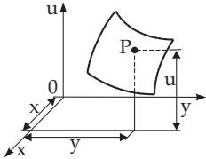
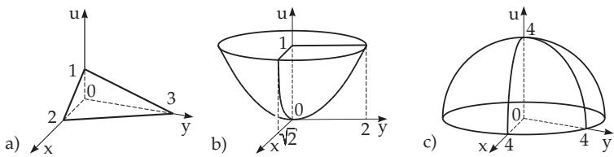
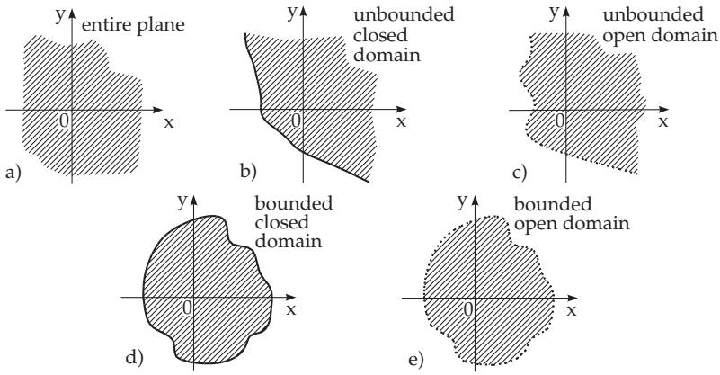
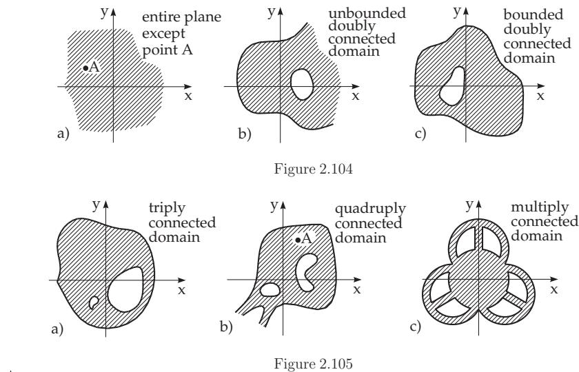
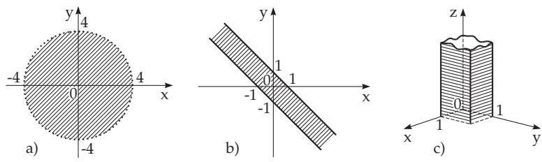
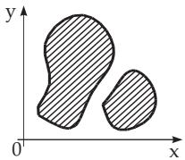
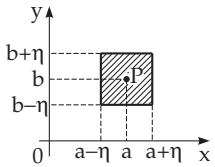

### 2.18 Functions of Several Variables

#### 2.18.1 Definition and Representation

##### 2.18.1.1 Representation of Functions of Several Variables

A variable value u is called a function of n independent variables $x _ { 1 } , x _ { 2 } , \ldots , x _ { n } .$ if for given values of the independent variables, u is a uniquely defined value. Depending on how many variables there are, two, three, or n, one writes

$$
u = f ( x , y ) , \quad u = f ( x , y , z ) , \quad u = f ( x _ { 1 } , x _ { 2 } , \ldots , x _ { n } ) .\tag{2.276}
$$

Substituting given numbers for the n independent variables yields a value system of the variables, which can be considered as a point of the n-dimensional space. The single independent variables are called arguments; sometimes the entire n tuple together is called the argument of the function.

Examples of Values of Functions:

A: $u = f ( x , y ) = x y ^ { 2 }$ has for the value system $x = 2 , y = 3$ the value $f ( 2 , 3 ) = 2 \cdot 3 ^ { 2 } = 1 8 .$

■ $\mathbf { B } \colon u = f ( x , y , z , t ) = x \ln ( y - z t )$ takes for the value system $x = 3 , y = 4 , z = 3 , t = 1$ the value $f ( 3 , 4 , 3 , 1 ) = 3 \ln ( 4 - 3 \cdot 1 ) = 0 .$

##### 2.18.1.2 Geometric Representation of Functions of Several Variables

1. Representation of the Value System of the Variables

The value system of an argument of two variables x and y can be represented as a point of the plane given by Cartesian coordinates x and y. A value system of three variables x, y, z corresponds to a point given by the coordinates x, $y , z$ in a three-dimensional Cartesian coordinate system. Systems of four or more coordinates cannot be represented obviously in our three-dimensional imagination.

Similarly to the three-dimensional case the system of n variables $x _ { 1 } , x _ { 2 } , \ldots , x _ { n }$ is to be considered as a point of the n-dimensional space given by Cartesian coordinates $x _ { 1 } , x _ { 2 } , \ldots , x _ { n }$ . In the above example B, the four variables define a point in four-dimensional space, with coordinates $x = 3 , y = 4 , z = 3$ and $t = 1$

2. Representation of the Function $u \ = \ f ( x , y )$ of Two Variables

a) A function of two independent variables can be represented by a surface in three-dimensional space, similarly to the graph representation of functions of one variable (Fig. 2.100, see also 3.6.3, p. 261). Considering the values of the independent variables of the domain as the first two coordinates, and the value of the function $u = f ( x , y )$ as the third coordinate of a point in a Cartesian coordinate system, these points form a surface in three-dimensional space.

Figure 2.100

Examples of Surfaces of Functions:

A: $u = 1 - \frac { x } { 2 } - \frac { y } { 3 }$ represents a plane (Fig. 2.101a, see also 3.5.3.10, p. 218).

B: $u = { \frac { x ^ { 2 } } { 2 } } + { \frac { y ^ { 2 } } { 4 } }$ represents an elliptic paraboloid (Fig. 2.101b, see also 3.5.3.13, 5., p. 226).

C: $u = \sqrt { 1 6 - x ^ { 2 } - y ^ { 2 } }$ represents a hemisphere with $r = 4 \ ( \mathbf { F i g . 2 . 1 0 1 c } )$

b) The shape of the surface of the function $u = f ( x , y )$ can be pictured with the help of intersection curves, which can be get by intersecting the surface parallel to the coordinate planes. The intersection curves u = const are called level curves.

In Fig. 2.101b,c the level curves are ellipses or concentric circles (not denoted in the figure).

Remark: A function with an argument of three or more variables cannot be represented in threedimensional space. Similarly to surfaces in three-dimensional space also the notion of a hyper surface in n-dimensional space is in use.

  
Figure 2.101

#### 2.18.2 Different Domains in the Plane

##### 2.18.2.1 Domain of a Function

The domain ofdefinition ofa function (or domain of a function) is the set ofthe system ofvalues or points which can be taken by the variables of the argument of the function. The domains defined in this way can be very diferent. Mostly they are bounded or unbounded connected sets ofpoints. Depending on whether the boundary belongs to the domain or not, the domain is closed or open. An open, connected set of points is called a domain. If the boundary belongs to the domain, it is called a closed domain, if it does not, sometimes it is called an open domain.

##### 2.18.2.2 Two-Dimensional Domains

Fig. 2.102 shows the simplest cases of connected sets of points of two variables and their notation. Domains are represented here as the shaded part; closed domains, i.e., domains whose boundary belongs to

them, are bounded by thick curves in the figures; open domains are bounded by dotted curves. Including the entire plane there are only simply connected domains or simply connected regions in Fig. 2.102.

##### 2.18.2.3 Three or Multidimensional Domains

These are handled similarly to the two-dimensional case. It concerns also the distinction between simply and multiply connected domains. Functions of more than three variables will be geometrically represented in the corresponding n-dimensional space.

  
Figure 2.102

##### 2.18.2.4 Methods to Determine a Function

1. Definition by Table of Values Functions of several variables can be defined by a table of values. An example of functions of two independent variables are the tables of values of elliptic integrals (see 21.9, p. 1103). The values of the independent variables are denoted on the top and on the left-hand side of the table. The required value of the function is in the intersection of the corresponding row and column. It is called a table with double entry.

2. Definition by Formulas Functions of several variables can be defined by one or more formulas.

$$
\begin{array}{c} \begin{array} { r } { \mathbf { A } \colon u = x y ^ { 2 } . } \\ { \mathbf { B } \colon u = x \ln ( y - z t ) . } \end{array} \quad \quad \equiv \mathbf { C } \colon u = \left\{ \begin{array} { l r } { x + y f o r x \geq 0 , y \geq 0 , } \\ { x - y f o r x \geq 0 , y < 0 , } \\ { - x + y f o r x < 0 , y \geq 0 , } \\ { - x - y f o r x < 0 , y < 0 . } \end{array} \right.  \end{array}
$$

3. Domain of a Function Given by One Formula In the analysis mostly such functions are considered which are defined by formulas. Here the union of all value systems for which the analytical expression has a meaning is considered to be the domain, i.e., for which the expression has a unique, finite, real value.

Examples for Domains:

A: $u = x ^ { 2 } + y ^ { 2 } ;$ : The domain is the entire plane.

B: $u = \frac { 1 } { \sqrt { 1 6 - x ^ { 2 } - y ^ { 2 } } } ;$ : The domain consists of all value systems x, y, satisfying the inequality

$x ^ { 2 } + y ^ { 2 } < 1 6$ . Geometrically this domain is the interior of the circle in Fig. 2.103a, an open domain.

C: $u = \arcsin ( x + y )$ : The domain consists of all value systems x, y, satisfying the inequality $- 1 \leq$ $x + y \leq + 1$ , i.e., the domain of the function is a closed domain, the stripe between the two parallel lines in Fig. 2.103b.

  
Figure 2.103

D: $u = \arcsin ( 2 x - 1 ) + { \sqrt { 1 - y ^ { 2 } } } + { \sqrt { y } } +$ ln z: The domain consists of the value system x, y, z, satisfying the inequalities $0 \leq x \leq 1 , 0 \leq y \leq 1 , z > 0$ , i.e., it consists of all points of the three dimensional x, y, z space lying above a square with side-length 1 shown in Fig. 2.103c.

  
Figure 2.106

If from the interior of the considered part of the plane a point or a bounded, simply connected point set is missing, as shown in Fig. 2.104, it is called a doubly-connected domain or doubly-connected region. Multiply connected domains are represented in Fig. 2.105. A non-connected region is shown in Fig. 2.106.

2.18.2.5 Various Forms for the Analytical Representation of a Function Functions of several variables can be defined in diferent ways, just as functions of one variable.

1. Explicit Representation

A function is given or defined in an explicit way if its value (the dependent variable) can be expressed by the independent variables:

$$
u = f ( x _ { 1 } , x _ { 2 } , \ldots , x _ { n } ) .\tag{2.277}
$$

2. Implicit Representation

A function is given or defined in an implicit way if the relation between its value and the independent variables is given in the form:

$$
F ( x _ { 1 } , x _ { 2 } , \ldots , x _ { n } , u ) = 0 ,\tag{2.278}
$$

if there is a unique value of u satisfying this equality.

3. Parametric Representation

A function is given in parametric form if the n arguments and the function are defined by n new variables, the parameters, in an explicit way, supposing there is a one-to-one correspondence between the parameters and the arguments. For a two-variable function, for instance

$$
x = \varphi ( r , s ) , \quad y = \psi ( r , s ) , \quad u = \chi ( r , s ) ,\tag{2.279a}
$$

and for a three-variable function

$$
x = \varphi ( r , s , t ) , \quad y = \psi ( r , s , t ) , \quad z = \chi ( r , s , t ) , \quad u = \kappa ( r , s , t )\tag{2.279b}
$$

etc.

4. Homogeneous Functions

A function $f ( x _ { 1 } , x _ { 2 } , \ldots , x _ { n } )$ of several variables is called a homogeneous function if the relation

$$
f ( \lambda x _ { 1 } , \lambda x _ { 2 } , \ldots , \lambda x _ { n } ) = \lambda ^ { m } f ( x _ { 1 } , x _ { 2 } , \ldots , x _ { n } )\tag{2.280}
$$

holds for arbitrary λ. The number m is the degree ofhomogeneity.

A: For $u ( x , y ) = x ^ { 2 } - 3 x y + y ^ { 2 } + x { \sqrt { x y + { \frac { x ^ { 3 } } { y } } } }$ , the degree of homogeneity is $m = 2$

B: For $u ( x , y ) = { \frac { x + z } { 2 x - 3 y } }$ , the degree of homogeneity is $m = 0$

##### 2.18.2.5 Various Forms for the Analytical Representation of a Function

##### 2.18.2.6 Dependence of Functions

1. Special Case of Two Functions

Two functions of two variables $u \ = \ f ( x , y )$ and $v ~ = ~ \varphi ( x , y )$ , with the same domain G, are called dependent functions if one of them can be expressed as a function of the other one $u = F ( v )$ . For every point of the domain G of the functions the identity

$$
f ( x , y ) = F ( \varphi ( x , y ) ) \quad { \mathrm { o r } } \quad \varPhi ( f , \varphi ) = 0\tag{2.281}
$$

holds. If there is no such function $F ( \varphi )$ or $\varPhi ( f , \varphi )$ , one speaks about independent functions.

$u ( x , y ) = ( x ^ { 2 } + y ^ { 2 } ) ^ { 2 } , v = \sqrt { x ^ { 2 } + y ^ { 2 } }$ are defined in the domain $x ^ { 2 } + y ^ { 2 } \ge 0$ , i.e., in the whole $x , y$ plain, and they are dependent, because $u = v ^ { 4 }$ holds.

2. General Case of Several Functions

Similarly to the case of two functions, the m functions $u _ { 1 } , u _ { 2 } , \ldots , u _ { m }$ of n variables $x _ { 1 } , x _ { 2 } , \ldots , x _ { n }$ in their common domain G are called dependent if one of them can be expressed as a function of the others, i.e., if for every point of the domain G the identity

$$
u _ { i } = f ( u _ { 1 } , u _ { 2 } , \ldots , u _ { i - 1 } , u _ { i + 1 } , \ldots , u _ { m } ) \quad { \mathrm { o r } } \quad { \bar { \phi } } ( u _ { 1 } , u _ { 2 } , \ldots , u _ { m } ) = 0\tag{2.282}
$$

is valid. If there is no such functional relationship, they are independent functions.

The functions $u = x _ { 1 } + x _ { 2 } + \cdot \cdot \cdot + x _ { n } , \ v = { x _ { 1 } } ^ { 2 } + { x _ { 2 } } ^ { 2 } + \cdot \cdot \cdot + { x _ { n } } ^ { 2 }$ and $w = x _ { 1 } x _ { 2 } + x _ { 1 } x _ { 3 } + \cdot \cdot \cdot + x _ { 1 } x _ { n } +$ $x _ { 2 } x _ { 3 } + \cdot \cdot \cdot + x _ { n - 1 } x _ { n }$ are dependent because $v = u ^ { 2 } - 2 u$ holds.

3. Analytical Conditions for Independence

Suppose every partial derivative mentioned below exists. Two functions $u = f ( x , y )$ and

$$
\left| { \begin{array} { r r } { { \frac { \partial f } { \partial x } } } & { { \frac { \partial f } { \partial y } } } \\ { { \frac { \partial \varphi } { \partial x } } } & { { \frac { \partial \varphi } { \partial y } } } \end{array} } \right| , { \mathrm { ~ s h o r t ~ } } { \frac { D ( f , \varphi ) } { D ( x , y ) } } { \mathrm { ~ o r ~ } } { \frac { D ( u , v ) } { D ( x , y ) } } ,\tag{2.283a}
$$

$ { \boldsymbol { v } } ~ = ~ \varphi (  { \boldsymbol { { x } } } ,  { \boldsymbol { { y } } } )$ are independent on a domain if their functional determinant or Jacobian determinant is not identically zero here. Analogously, in the case of n functions of n variables $u _ { 1 } = f _ { 1 } ( x _ { 1 } , \ldots , x _ { n } ) , \ldots , u _ { n } =$ $f _ { n } ( x _ { 1 } , \ldots , x _ { n } ) ;$

$$
{ \left| \begin{array} { l l l l } { { \frac { \partial f _ { 1 } } { \partial x _ { 1 } } } } & { { \frac { \partial f _ { 1 } } { \partial x _ { 2 } } } } & { \dots } & { { \frac { \partial f _ { 1 } } { \partial x _ { n } } } } \\ { { \frac { \partial f _ { 2 } } { \partial x _ { 1 } } } } & { { \frac { \partial f _ { 2 } } { \partial x _ { 2 } } } } & { \dots } & { { \frac { \partial f _ { 2 } } { \partial x _ { n } } } } \\ { \vdots } & { \vdots } & { \vdots } & { \vdots } \\ { { \frac { \partial f _ { n } } { \partial x _ { 1 } } } } & { { \frac { \partial f _ { n } } { \partial x _ { 2 } } } } & { \dots } & { { \frac { \partial f _ { n } } { \partial x _ { n } } } } \end{array} \right| } \equiv { \frac { D ( f _ { 1 } , f _ { 2 } , \dots , f _ { n } ) } { D ( x _ { 1 } , x _ { 2 } , \dots , x _ { n } ) } } \neq 0 . ( 2 . 2 8 3 \mathrm { b } )
$$

$$
\left( \begin{array} { c c c c } { \frac { \partial u _ { 1 } } { \partial x _ { 1 } } } & { \frac { \partial u _ { 1 } } { \partial x _ { 2 } } } & { \ldots } & { \frac { \partial u _ { 1 } } { \partial x _ { n } } } \\ { \frac { \partial u _ { 2 } } { \partial x _ { 1 } } } & { \frac { \partial u _ { 2 } } { \partial x _ { 2 } } } & { \ldots } & { \frac { \partial u _ { 2 } } { \partial x _ { n } } } \\ { \vdots } & { \vdots } & { \vdots } & { \vdots } \\ { \frac { \partial u _ { m } } { \partial x _ { 1 } } } & { \frac { \partial u _ { m } } { \partial x _ { 2 } } } & { \ldots } & { \frac { \partial u _ { m } } { \partial x _ { n } } } \end{array} \right) .\tag{2.283c}
$$

If the number m of the functions $u _ { 1 } , u _ { 2 } , \ldots , u _ { m }$ is smaller than the number of variables $x _ { 1 } , x _ { 2 } , \ldots , x _ { n } ,$ these functions are independent if at least one subdeterminant of order m of the matrix (2.283c) is not identically zero:

The number of independent functions is equal to the rank r of the matrix (2.283c) (see 4.1.4, 7., p. 274). Here these functions are independent, whose derivatives are the elements of the non-vanishing determinant of order r. $\mathrm { I f } m > n$ holds, then among the given m functions at most n can be independent.

#### 2.18.3 Limits

##### 2.18.3.1 Definition

A function of two variables $u = f ( x , y )$ has a limit A at $x = a , y = b$ if when x and y are arbitrarily close to a and $b ,$ respectively, then the value of the function $f ( x , y )$ approaches arbitrarily closely the value A. Then one writes:

$$
\operatorname* { l i m } _ { x \to a atop y \to b } f ( x , y ) = A .\tag{2.284}
$$

The function may not be defined at $( a , b )$ , or if it is defined here, may not have the value A.

##### 2.18.3.2 Exact Definition

  
Figure 2.107

A function of two variables $u = f ( x , y )$ has at the point (a, b) a limit

$$
A = \operatorname* { l i m } _ { { x  a } \atop { y  b } } f ( x , y )\tag{2.285a}
$$

if for arbitrary positive ε there is a positive η such that (see Fig. 2.107)

$$
| f ( x , y ) - A | < \varepsilon\tag{2.285b}
$$

holds for every point $( x , y )$ of the square

$$
| x - a | < \eta , \quad | y - b | < \eta .\tag{2.285c}
$$

##### 2.18.3.3 Generalization for Several Variables

a) The notion of limit of a function of several variables can be defined analogously to the case of two variables.

b) The criteria for the existence of a limit of a function of several variables can be obtained by generalization of the criterion for functions of one variable, i.e., by reducing to the limit of a sequence or by applying the Cauchy condition for convergence (see 2.1.4.3, p. 53).

##### 2.18.3.4 Iterated Limit

If for a function of two variables $f ( x , y )$ first the limit for $x \to a$ has been determined, i.e., $\operatorname* { l i m } _ { x \to a } f ( x , y )$ for constant y, then for the function obtained, which is now a function only of $y ,$ one determines the limit for $y  b$ , then the resulting number

$$
B = \operatorname* { l i m } _ { y \to b } \left( \operatorname* { l i m } _ { x \to a } f ( x , y ) \right)\tag{2.286a}
$$

is called an iterated limit. Changing the order of calculations generally yields an other limit:

$$
C = \operatorname* { l i m } _ { x \to a } \left( \operatorname* { l i m } _ { y \to b } f ( x , y ) \right) .\tag{2.286b}
$$

In general $B \neq C$ holds, even if both limits exist.

For the function $f ( x , y ) = { \frac { x ^ { 2 } - y ^ { 2 } + x ^ { 3 } + y ^ { 3 } } { x ^ { 2 } + y ^ { 2 } } }$ for $x  0 , y  0$ one gets the iterated limits $B = - 1$ and $C = + 1$

Remark: If the function $f ( x , y )$ has a limit $A = \operatorname* { l i m } _ { { x  a } \atop { y  b } } f ( x , y )$ , and both B and C exist, then $B = C = A$

is valid. The existence of B and C does not follow from the existence of A. From the equality of the limits $B = C$ the existence of the limit A does not follow.

#### 2.18.4 Continuity

A function of two variables $f ( x , y )$ is continuous at $x = a , y = b$ , i.e., at the point $( a , b )$ , if 1. the point $( a , b )$ belongs to the domain of the function and 2. the limit for $x \to a , y \to b$ exists and is equal to the value, i.e.,

$$
\operatorname* { l i m } _ { x \to a \atop y \to b } f ( x , y ) = f ( a , b ) .\tag{2.287}
$$

Otherwise the function has a discontinuity at $x = a , y = b$ . If a function is defined and continuous at every point of a connected domain, it is called continuous on this domain. Similarly can be defined the continuity of functions of more than two variables.

#### 2.18.5 Properties of Continuous Functions

##### 2.18.5.1 Theorem on Zeros of Bolzano

If a function $f ( x , y )$ is defined and continuous in a connected domain, and at two points $( x _ { 1 } , y _ { 1 } )$ and $( x _ { 2 } , y _ { 2 } )$ of this domain the values have diferent signs, then there exists at least one point $( x _ { 3 } , y _ { 3 } )$ in this domain such that $f ( x , y )$ is equal to zero there:

$$
f ( x _ { 3 } , y _ { 3 } ) = 0 , \quad \mathrm { i f } \quad f ( x _ { 1 } , y _ { 1 } ) > 0 \quad \mathrm { a n d } \quad f ( x _ { 2 } , y _ { 2 } ) < 0 .\tag{2.288}
$$

##### 2.18.5.2 Intermediate Value Theorem

If a function $f ( x , y )$ is defined and continuous in a connected domain, and at two points $( x _ { 1 } , y _ { 1 } )$ and $( x _ { 2 } , y _ { 2 } )$ it has diferent values $A = f ( x _ { 1 } , y _ { 1 } )$ and $B = f ( x _ { 2 } , y _ { 2 } )$ , then for an arbitrary value C between A and B there is at least one point $( x _ { 3 } , y _ { 3 } )$ such that:

$$
f ( x _ { 3 } , y _ { 3 } ) = C , \quad A < C < B \quad { \mathrm { o r } } \quad B < C < A .\tag{2.289}
$$

##### 2.18.5.3 Theorem About the Boundedness of a Function

If a function $f ( x , y )$ is continuous on a bounded and closed domain, it is bounded in this domain, i.e., there are two numbers m and M such that for every point $( x , y )$ in this domain:

$$
m \leq f ( x , y ) \leq M .\tag{2.290}
$$

##### 2.18.5.4 Weierstrass Theorem (About the Existence of Maximum and

If a function $f ( x , y )$ is continuous on a bounded and closed domain, then it takes its maximum and minimum here, i.e., there is at least one point $( x ^ { \prime } , y ^ { \prime } )$ such that all the values $f ( x , y )$ in this domain are less than or equal to the value $f ( x ^ { \prime } , y ^ { \prime } )$ , and there is at least one point $( x ^ { \prime \prime } , y ^ { \prime \prime } )$ such that all the values $f ( x , y )$ in this domain are greater than or equal to $f ( x ^ { \prime \prime } , y ^ { \prime \prime } )$ : For any point $( x , y )$ of this domain

$$
f ( x ^ { \prime } , y ^ { \prime } ) \geq f ( x , y ) \geq f ( x ^ { \prime \prime } , y ^ { \prime \prime } )\tag{2.291}
$$

is valid.

##### Minimum)
