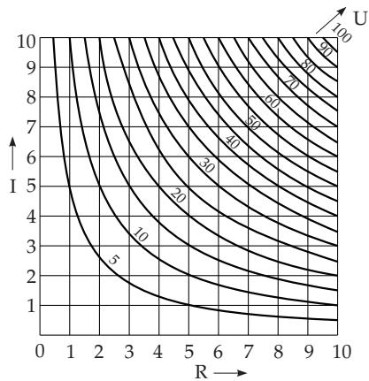
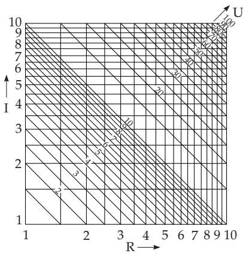
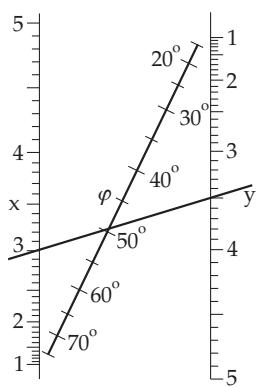
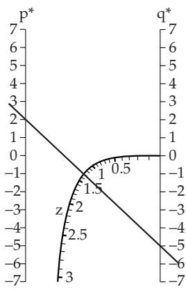

### 2.19 Nomography

#### 2.19.1 Nomograms

Nomograms are graphical representations of a functional correspondence between three or more variables. From the nomogram, the corresponding values of the variables of a given formula – the key formula – in a given domain of the variables can be immediately read directly. Important examples of nomograms are net charts and alignment charts.

Nomograms are still used in laboratories, even in the computer age, for instance to get approximate values or starting guesses for iterations.

#### 2.19.2 Net Charts

To represent a correspondence between the variables x, $y , z { \mathrm { ~ g i v e n } }$ by the equation

$$
F ( x , y , z ) = 0\tag{2.292}
$$

(or in many cases explicitly by $z = f ( x , y ) )$ , the variables can be considered as coordinates in space. The equation (2.292) defines a surface which can be visualized on two-dimensional paper by its level curves (see 2.18.1.2, p. 118). Here, a family of curves is assigned to each variable. These curves form a net: The variables x and y are represented by lines parallel to the axis, the variable z is represented by the family of level curves.

Ohm’s law is $U = R \cdot I ,$ The voltage U can be represented by its level curves depending on two variables. If R and I are chosen as Cartesian coordinates, then the equation U = const for every constant corresponds to a hyperbola (Fig. 2.108). By looking at the figure one can tell the corresponding value of U for every pair of values R and I , and also I corresponding to every R, U, and also R corresponding to every I and U. Of course, the investigation is always to be restricted to the domain which is interpreted: In Fig. 2.108 holds $0 < R < 1 0 , \tilde { 0 } < I < 1 0$ and $0 < U < 1 0 0$

Remarks:

1. By changing the calibration, the nomogram can be used for other domains. If, e.g., in (Fig. 2.108) the domain $0 < I < 1$ should be represented but R should remain the same, then the hyperbolas of U are to be marked by $U / 1 0$

2. By application of scales (see 2.17.1, p. 115) it is possible to transform nomograms with complicated curves into straight-line nomograms. Using uniform scales on the x and y axis, every equation of the form

$$
x \varphi ( z ) + y \psi ( z ) + \chi ( z ) = 0\tag{2.293}
$$

can be represented by a nomogram consisting of straight lines. If function scales $x = f ( z _ { 2 } )$ and $y =$ $g ( z _ { 2 } )$ are used, the equation of the form

$$
f ( z _ { 2 } ) \varphi ( z _ { 1 } ) + g ( z _ { 2 } ) \psi ( z _ { 1 } ) + \chi ( z _ { 1 } ) = 0\tag{2.294}
$$

has a representation for the variables $z _ { 1 } , z _ { 2 }$ and $z _ { 3 }$ as two families of curves parallel to the axis and an arbitrary family of straight lines.

By applying a logarithmic scale (see 2.17.1, p. 115), Ohm’s law can be represented by a straight-line nomogram. Taking the logarithm of $R \cdot I = { \bar { U } }$ gives log $R + \log I = \log { \bar { U } }$ . Substituting x = log R

  
Figure 2.108

  
Figure 2.109  
and y = log I results in $x + y = \log U$ , i.e., a special form of (2.294). The corresponding nomogram is shown in Fig. 2.109.

#### 2.19.3 Alignment Charts

A graphical representation of a relation between three variables $z _ { 1 } , z _ { 2 }$ and $z _ { 3 }$ can be given by assigning a scale (see 2.17.1, p. 115) to each variable. The $z _ { i }$ scale has the equation

$$
x _ { i } = \varphi _ { i } ( z _ { i } ) , y _ { i } = \psi _ { i } ( z _ { i } ) \quad ( i = 1 , 2 , 3 ) .\tag{2.295}
$$

The functions $\varphi _ { i }$ and $\psi _ { i }$ are chosen in such a manner that the values of the three variables $z _ { 1 } , z _ { 2 }$ and $z _ { 3 }$ satisfying the nomogram equation should lie on a straight line. To satisfy this condition, the area of the triangle, given by the points $( x _ { 1 } , y _ { 1 } ) , ( x _ { 2 } , y _ { 2 } )$ and $( x _ { 3 } , y _ { 3 } )$ , must be zero (see (3.301), p. 195), i.e.,

$$
\left| \begin{array} { l } { x _ { 1 } y _ { 1 } 1 } \\ { x _ { 2 } y _ { 2 } 1 } \\ { x _ { 3 } y _ { 3 } 1 } \end{array} \right| = \left| \begin{array} { l } { \varphi _ { 1 } ( z _ { 1 } ) \psi _ { 1 } ( z _ { 1 } ) 1 } \\ { \varphi _ { 2 } ( z _ { 2 } ) \psi _ { 2 } ( z _ { 2 } ) 1 } \\ { \varphi _ { 3 } ( z _ { 3 } ) \psi _ { 3 } ( z _ { 3 } ) 1 } \end{array} \right| = 0\tag{2.296}
$$

must hold. Every relation between three variables $z _ { 1 } , z _ { 2 }$ and $z _ { 3 }$ , which can be transformed into the form (2.296), can be represented by an alignment nomogram .

Next, follows the description of some important special cases of (2.296).

##### 2.19.3.1 Alignment Charts with Three Straight-Line Scales Through a Point

If the zero point is chosen for the common point of the lines having the three scales $z _ { 1 } , z _ { 2 } \ \mathrm { o r } \ z _ { 3 }$ , then (2.296) has the form

$$
\begin{array} { r } { | \varphi _ { 1 } ( z _ { 1 } ) \ m _ { 1 } \varphi _ { 1 } ( z _ { 1 } ) \ 1 | = 0 , } \\ { \varphi _ { 2 } ( z _ { 2 } ) \ m _ { 2 } \varphi _ { 2 } ( z _ { 2 } ) \ 1 \vphantom { \varphi _ { 3 } ( z _ { 3 } ) \ 1 } | = 0 ,  } \\ { \varphi _ { 3 } ( z _ { 3 } ) \ m _ { 3 } \varphi _ { 3 } ( z _ { 3 } ) \ 1 \vphantom { \varphi _ { 3 } ( z _ { 3 } ) \ 1 } | = 0 , } \end{array}\tag{2.297}
$$

since the equation of a line passing through the origin has the equation $y \ = \ m x$ . Evaluating the determinant (2.297), yields

$$
\frac { m _ { 2 } - m _ { 3 } } { \varphi _ { 1 } ( z _ { 1 } ) } + \frac { m _ { 3 } - m _ { 1 } } { \varphi _ { 2 } ( z _ { 2 } ) } + \frac { m _ { 1 } - m _ { 2 } } { \varphi _ { 3 } ( z _ { 3 } ) } = 0\tag{2.298a}
$$

or

$$
{ \frac { C _ { 1 } } { \varphi _ { 1 } ( z _ { 1 } ) } } + { \frac { C _ { 2 } } { \varphi _ { 2 } ( z _ { 2 } ) } } + { \frac { C _ { 3 } } { \varphi _ { 3 } ( z _ { 3 } ) } } = 0 \quad \mathrm { w i t h ~ } \ : C _ { 1 } + C _ { 2 } + C _ { 3 } = 0 .\tag{2.298b}
$$

Here $C _ { 1 } , C _ { 2 }$ and $C _ { 3 }$ are constants.

The equation ${ \frac { 1 } { a } } + { \frac { 1 } { b } } = { \frac { 2 } { f } }$ is a special case of (2.298b) and it is an important relation, for instance in optics or for the parallel connection of resistances. The corresponding alignment nomogram consists of three uniformly scaled lines.

##### 2.19.3.2 Alignment Charts with Two Parallel Inclined Straight-Line Scales and One Inclined Straight-Line Scale

One of the scales is put on the y-axis, the other one on another line parallel to it at a distance d. The third scale is put on a line $y = m x$ . In this case (2.296) has the form

$$
\left| \begin{array} { c } { { 0 \psi _ { 1 } ( z _ { 1 } ) 1 } } \\ { { d \psi _ { 2 } ( z _ { 2 } ) 1 } } \\ { { \varphi _ { 3 } ( z _ { 3 } ) m \varphi _ { 3 } ( z _ { 3 } ) 1 } } \end{array} \right| = 0 .\tag{2.299}
$$

Evaluation of the determinant by the first column yields

$$
d \left( m \varphi _ { 3 } ( z _ { 3 } ) - \psi _ { 1 } ( z _ { 1 } ) \right) + \varphi _ { 3 } ( z _ { 3 } ) \left( \psi _ { 1 } ( z _ { 1 } ) - \psi _ { 2 } ( z _ { 2 } ) \right) = 0 .\tag{2.300a}
$$

Consequently:

$$
\psi _ { 1 } ( z _ { 1 } ) { \frac { \varphi _ { 3 } ( z _ { 3 } ) - d } { \varphi _ { 3 } ( z _ { 3 } ) } } - ( \psi _ { 2 } ( z _ { 2 } ) - m d ) = 0 { \mathrm { ~ o d e r ~ } } f ( z _ { 1 } ) \cdot g ( z _ { 3 } ) - h ( z _ { 2 } ) = 0 .\tag{2.300b}
$$

It is often useful to introduce measure scales $E _ { 1 }$ and $E _ { 2 }$ of the form

$$
E _ { 1 } f ( z _ { 1 } ) \frac { E _ { 2 } } { E _ { 1 } } g ( z _ { 3 } ) - E _ { 2 } h ( z _ { 2 } ) = 0 .\tag{2.300c}
$$

Then, $\varphi _ { 3 } ( z _ { 3 } ) = \cfrac { d } { 1 - \cfrac { E _ { 2 } } { E _ { 1 } } g ( z _ { 3 } ) }$ holds. The relation $E _ { 2 } : E _ { 1 }$ can be chosen so that the third scale is pulled

near a certain point or it is gathered. Substituting $m = 0$ , then $E _ { 2 } h ( z _ { 2 } ) = \psi _ { 2 } ( z _ { 2 } )$ and in this case, the line of the third scale passes through both the starting points of the first and of the second scale. Consequently, these two scales must be placed with a scale division in opposite directions, while the third one will be between them.

The relation between the Cartesian coordinates x and y of a point in the x, y plane and the corresponding angle $\varphi$ in polar coordinates is:

$$
y ^ { 2 } = x ^ { 2 } \tan ^ { 2 } \varphi .\tag{2.301}
$$

The corresponding nomogram is shown in Fig. 2.110. The scale division is the same for the scales of x and y but they are oriented in opposite directions. In order to get a better intersection with the third scale between them, their initial points are shifted by a suitable amount. The intersection points of the third scale with the first or with the second one are marked by $\varphi = 0$ or $\varphi = 9 0 ^ { \circ }$ respectively.

For instance: $x = 3 \ y = 3 . 5 , { \mathrm { g i v e s } } \ \varphi \approx 4 9 . 5 ^ { \circ }$

##### 2.19.3.3 Alignment Charts with Two Parallel Straight Lines and a Curved Scale

If one of the straight-line scales is placed on the y-axis and the other one is placed at a distance d from it, then equation (2.296) has the form

$$
\begin{array} { c } { { \left| \begin{array} { c c } { { 0 } } & { { \psi _ { 1 } ( z _ { 1 } ) } } \end{array} 1 \right| } } \\ { { d } } & { { \psi _ { 2 } ( z _ { 2 } ) } } \end{array} 1 \left| = 0 . \begin{array} { r l } \end{array} \right.\tag{2.302}
$$

  
Figure 2.110  
Figure 2.111

Consequently:

$$
\psi _ { 1 } ( z _ { 1 } ) + \psi _ { 2 } ( z _ { 2 } ) \frac { \varphi _ { 3 } ( z _ { 3 } ) } { d - \varphi _ { 3 } ( z _ { 3 } ) } - d \frac { \psi _ { 3 } ( z _ { 3 } ) } { d - \varphi _ { 3 } ( z _ { 3 } ) } = 0 .\tag{2.303a}
$$

Choosing the scale $E _ { 1 }$ for the first scale and $E _ { 2 }$ for the second one, then (2.303a) is transformed into

$$
E _ { 1 } f ( z _ { 1 } ) + E _ { 2 } g ( z _ { 2 } ) \frac { E _ { 1 } } { E _ { 2 } } h ( z _ { 3 } ) + E _ { 1 } k ( z _ { 3 } ) = 0 ,\tag{2.303b}
$$

where $\psi _ { 1 } ( z _ { 1 } ) = E _ { 1 } f ( z _ { 1 } ) , \psi _ { 2 } ( z _ { 2 } ) = E _ { 2 } g ( z _ { 2 } )$ and

$$
\varphi _ { 3 } ( z _ { 3 } ) = \frac { d E _ { 1 } h ( z _ { 3 } ) } { E _ { 2 } + E _ { 1 } h ( z _ { 3 } ) } \quad \mathrm { a n d } \quad \psi _ { 3 } ( z _ { 3 } ) = - \frac { E _ { 1 } E _ { 2 } k ( z _ { 3 } ) } { E _ { 2 } + E _ { 1 } h ( z _ { 3 } ) }\tag{2.303c}
$$

holds.

The reduced third-degree equation $z ^ { 3 } + p ^ { * } z + q ^ { * } = 0$ (see 1.6.2.3, p. 40) is of the form (2.303b). After the substitutions $\tilde { E _ { 1 } } = \tilde { E _ { 2 } } \tilde { = } 1$ and $f ( z _ { 1 } ) = q ^ { * } , g ( z _ { 2 } ) = p ^ { * } , h ( z _ { 3 } ) = z$ , the formulas to calculate the coordinates of the curved scale are $x = \varphi _ { 3 } ( z ) = { \frac { d \cdot z } { 1 + z } }$ and $y = \psi _ { 3 } ( z ) = - \frac { z ^ { 3 } } { 1 + z }$

In Fig. 2.111 the curved scale is shown only for positive values of z . The negative values one gets by replacing z by z and by the determination of the positive roots from the equation $z ^ { 3 } + p ^ { * } z - \check { q } ^ { * } = \check { 0 }$ The complex roots $u + \mathrm { i } v$ can also be determined by nomograms. Denoting the real root, which always exists, by $z _ { 1 }$ , then the real part of the complex root is $u = - z _ { 1 } / 2$ , and the imaginary part v can be determined from the equation $3 u ^ { 2 } - v ^ { 2 } + p ^ { * } = \frac { 3 } { 4 } z _ { 1 } ^ { 2 } - v ^ { 2 } + p ^ { * } = 0 .$

For instance: $y ^ { 3 } + 2 y - 5 = 0 , { \mathrm { i . e . , } } p ^ { * } = 2 , q ^ { * } = - 5$ One reads $z _ { 1 } \approx 1 . 3$

#### 2.19.4 Net Charts for More Than Three Variables

To construct a chart for formulas containing more than three variables, the expression is to decompose by the help of auxiliary variables into several formulas, each containing only three variables. Here, every auxiliary variable must be contained in exactly two of the new equations. Each of these equations is to be represented by an alignment chart so that the common auxiliary variable has the same scale.
