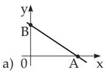
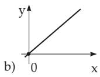
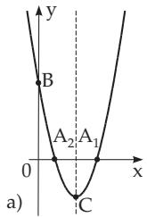
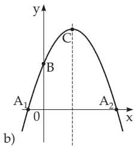
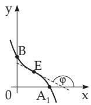
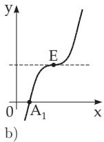
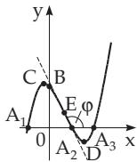
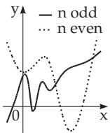
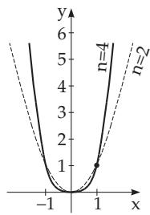
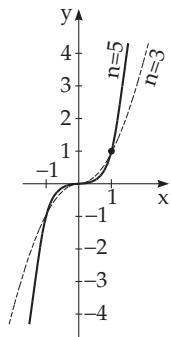

### 2.3 Polynomials

#### 2.3.1 Linear Function

The graph of the linear function

$$
y = a x + b\tag{2.39}
$$

(polynomial of degree 1) is a line (Fig. 2.11a). The proportional factor is denoted by a, the crossing point of the line and the axis of the ordinate by b.

For $a > 0$ the function is monotone increasing, for $a < 0$ it is monotone decreasing; for $a = 0$ it is a

polynomial of degree zero, i.e., it is a constant function. The intercepts are at $A \left( - { \frac { b } { a } } , 0 \right)$ and $B ( 0 , b )$ (for details see 3.5.2.6, 1., p. 195). With b = 0 direct proportionality y = ax; (2.40)

holds, graphically it is a line running through the origin (Fig. 2.11b).

  
Figure 2.11

  
Figure 2.12

#### 2.3.2 Quadratic Polynomial

The polynomial ofsecond degree

$$
y = a x ^ { 2 } + b x + c\tag{2.41}
$$

(quadratic polynomial) defines a parabola with a vertical axis of symmetry at $x = - { \frac { b } { 2 a } } \ ( \mathbf { F i g . 2 . 1 2 } )$ For $a > 0$ the function is first monotone decreasing, it has a minimum, then it is monotone increasing. For $a < 0$ first it is monotone increasing, it has a maximum, then it is monotone decreasing. In the case $b ^ { 2 } - 4 a c > 0$ : The intersection points $A _ { 1 } , A _ { 2 }$ with the x-axis are $\left( { \frac { - b \pm { \sqrt { b ^ { 2 } - 4 a c } } } { 2 a } } , 0 \right)$ , the intersection point B with the y-axis, is at $( 0 , c )$ . In the case $b ^ { 2 } - 4 a c = 0$ there is one intersection point (contact point) with the x-axis. In the case $b ^ { 2 } - 4 a c < 0$ there is no intersection point. The extremum point of the curve is at $C \left( - { \frac { b } { 2 a } } , { \frac { 4 a c - b ^ { 2 } } { 4 a } } \right)$ (for more details about the parabola see 3.5.2.10, p. 204).

  
a)

  
Figure 2.13

  
c)

#### 2.3.3 Cubic Polynomials

The polynomial of third degree

$$
y = a x ^ { 3 } + b x ^ { 2 } + c x + d\tag{2.42}
$$

defines a cubic parabola (Fig. 2.13a,b,c). Both the shape of the curve and the behavior of the function depend on a and the discriminant $\Delta = 3 a c - b ^ { 2 }$ . If $\Delta \geq 0$ holds (Fig. 2.13a,b), then for $a > 0$ the function is monotonically increasing, and for a < 0 it is decreasing. If $\Delta < 0$ the function has exactly one local minimum and one local maximum (Fig. 2.13c). For $a > 0$ the value of the function rises from until the maximum, then falls until the minimum, then it rises again to + ; for $a < 0$ the value of the function falls from + until the minimum, then rises until the maximum, then it falls again to $- \infty$ . The intersection points with the x-axis are at the values of the real roots of (2.42) for $y = 0$ . The function can have one, two (then there is a point where the x-axis is the tangent line of the curve) or three real roots: $A _ { 1 } , A _ { 2 }$ and ${ \dot { A } } _ { 3 }$ . The intersection point with the y-axis is at $B ( 0 , d )$ , the extreme points of the curve C and D, if any, are at $\left( - { \frac { b \pm { \sqrt { - \Delta } } } { 3 a } } , { \frac { d + 2 b ^ { 3 } - 9 a b c \pm ( 6 a c - 2 b ^ { 2 } ) { \sqrt { - \Delta } } } { 2 7 a ^ { 2 } } } \right)$ The inflection point which is also the center of symmetry of the curve is at $E \left( - { \frac { b } { 3 a } } , { \frac { 2 b ^ { 3 } - 9 a b c } { 2 7 a ^ { 2 } } } + d \right)$ At this point the tangent line has the slope tan $\varphi = \left( { \frac { d y } { d x } } \right) _ { E } = { \frac { \Delta } { 3 a } }$

  
a)

  
Figure 2.14  
b)  
Figure 2.15

#### 2.3.4 Polynomials of n-th Degree

The integral rational function of n-th degree

$$
y = a _ { n } x ^ { n } + a _ { n - 1 } x ^ { n - 1 } + \ldots + a _ { 1 } x + a _ { 0 }\tag{2.43}
$$

defines a curve ofn-th degree or n-th order (see 3.5.2.5, p. 195) of parabolic type (Fig. 2.14).

Case 1, n odd: For $a _ { n } > 0$ the value of y changes continuously from to + , and for $a _ { n } < 0$ from + to . The curve can intersect or contact the x-axis up to n times, and there is at least one intersection point (for the solution of an equation of n-th degree see 1.6.3.1, p. 43 and 19.1.2, p. 952). The function (2.43) has none or an even number up to $n - 1$ of extreme values, where minima and maxima occur alternately; the number of inflection points is odd and is between 1 and $n - 2$ . There are no asymptotes or singularities.

Case 2, n even: For $a _ { n } \ > \ 0$ the value of y changes continuously from + through its minimum until + and for $a _ { n } < 0$ from through its maximum until . The curve can intersect or contact the x-axis up to n times, but it is also possible that it never does that. The number of extrema is odd, and maxima and minima alternate; the number of inflection points is even, and it can also be zero. There are no asymptotes or singularities.

Before sketching the graph of a function, it is recommended first to determine the extreme points, the inflection points, the values of the first derivative at these points, then to sketch the tangent lines at these points, and finally to connect these points continuously.

#### 2.3.5 Parabola of n-th Degree

The graph of the function

$$
y = a x ^ { n }\tag{2.44}
$$

where $n > 0$ , integer, is a parabola ofn-th degree, or ofn-th order (Fig. 2.15).

1. Special Case ${ \bf { \Phi } } _ { a } = { \bf { \Phi } } _ { 1 } ;$ The curve $y = x ^ { n }$ goes through the point (0, 0) and (1, 1) and contacts or intersects the x-axis at the origin. For even n the curve is symmetric with respect to the y-axis, and with a minimum at the origin. For odd n the curve is symmetric with respect to the origin, and it has an inflection point there. There is no asymptote.

2. General Case $\begin{array} { r } { \pm \mathbf { 0 } \mathrm { : } } \end{array}$ : The curve of $y = a x ^ { n }$ can be got from the curve of $y = x ^ { n }$ by stretching the ordinates by the factor a . For $a < 0$ the curve $y = | a | x ^ { n }$ is to be reflected with respect to the x-axis.
