### 2.4 Rational Functions

#### 2.4.1 Special Fractional Linear Function (Inverse Proportionality)

The graph of the function

$$
y = { \frac { a } { x } }\tag{2.45}
$$

is an equilateral hyperbola, whose asymptotes are the coordinate axes (Fig. 2.16). The point of discontinuity is at $x = 0$ with $y = \pm \infty$ . If $a > 0$ holds, then the function is strictly monotone decreasing in the interval $( - \infty , 0 )$ with values from $0 \mathrm { t o } - \infty$ and also strictly monotone decreasing in the interval $( 0 , + \infty )$ with values from + to 0 (curve in the first and third quadrants). If $a < 0$ , then the function is increasing in the interval $( - \infty , 0 )$ with values from 0 to + and also increasing in the interval $( 0 , + \infty )$ with values from to 0 (dotted curve in the second and fourth quadrants). The vertices A and B are at $\left( \pm { \sqrt { | a | } } , + { \sqrt { | a | } } \right)$ and $\left( \pm { \sqrt { | a | } } , - { \sqrt { | a | } } \right)$ with the same sign for $a > 0$ and with diferent sign for $a < 0$ . There are no extreme values (for more details about hyperbolas see 3.5.2.9, p. 201).

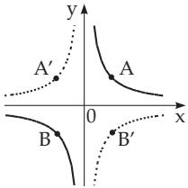  
Figure 2.16

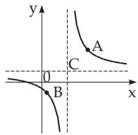  
Figure 2.17

#### 2.4.2 Linear Fractional Function

The graph of the function

$$
y = { \frac { a _ { 1 } x + b _ { 1 } } { a _ { 2 } x + b _ { 2 } } } \quad { \Big ( } a _ { 2 } \neq 0 , \Delta = { \Big | } { a _ { 1 } } b _ { 1 } { \Big | } = a _ { 1 } b _ { 2 } - b _ { 1 } a _ { 2 } \neq 0 { \Big ) }\tag{2.46}
$$

is an equilateral hyperbola, whose asymptotes are parallel to the coordinate axes (Fig. 2.17).

The center is at $C \left( - { \frac { b _ { 2 } } { a _ { 2 } } } , { \frac { a _ { 1 } } { a _ { 2 } } } \right)$ . The parameter a in the equality (2.45) corresponds here to $- \frac { \Delta } { a _ { 2 } ^ { 2 } }$ with $\Delta \ = \ { \frac { \left| a _ { 1 } b _ { 1 } \right| } { \left| a _ { 2 } b _ { 2 } \right| } }$ . The vertices of the hyperbola $A \neq 0$ and B are at $\left( - \frac { b _ { 2 } \pm \sqrt { | \Delta | } } { a _ { 2 } } , \frac { a _ { 1 } + \sqrt { | \Delta | } } { a _ { 2 } } \right)$ and $\left( - \frac { b _ { 2 } \pm \sqrt { | \Delta | } } { a _ { 2 } } , \frac { a _ { 1 } - \sqrt { | \Delta | } } { a _ { 2 } } \right)$ , where for $\Delta < 0$ the same signs are taken, for $\Delta > 0$ the diferent ones. The point of discontinuity is at $x = - { \frac { b _ { 2 } } { a _ { 2 } } }$ . For $\Delta < 0$ the values of the function are decreasing from $\frac { a _ { 1 } } { a _ { 2 } }$ $\mathrm { t o } - \infty$ and from + to $\frac { a _ { 1 } } { a _ { 2 } }$ . For $\Delta > 0$ the values of the function are increasing from $\frac { a _ { 1 } } { a _ { 2 } }$ to + and from to $\frac { a _ { 1 } } { a _ { 2 } }$ . There is no extremum.

#### 2.4.3 Curves of Third Degree,Type I

The graph of the function

$$
y = a + { \frac { b } { x } } + { \frac { c } { x ^ { 2 } } } \quad \left( = { \frac { a x ^ { 2 } + b x + c } { x ^ { 2 } } } \right) \quad ( b \neq 0 , \ c \neq 0 )\tag{2.47}
$$

(Fig. 2.18) is a curve of third degree (type I). It has two asymptotes $x = 0$ and $y = a$ and it has two branches. One of them corresponds to the monotone changing of y while it takes its values between $a \mathrm { ~ a n d } + \infty \mathrm { ~ o r ~ } - \infty ;$ the other branch goes through three characteristic points: the intersection point with the asymptote $y = a$ at $A \left( - { \frac { c } { b } } , a \right)$ , an extreme point at $B \left( - \frac { 2 c } { b } , a - \frac { b ^ { 2 } } { 4 c } \right)$ and an inflection point at $C \left( - \frac { 3 c } { b } , a - \frac { 2 b ^ { 2 } } { 9 c } \right)$ . The positions of the branches depend on the signs of b and $c ,$ and there are four cases (Fig. 2.18). The intersection points D, E with the x-axis, if any, are for $a \ne 0$ at $\left( { \frac { - b \pm { \sqrt { b ^ { 2 } - 4 a c } } } { 2 a } } , 0 \right)$ , for $a = 0 \mathrm { a t } \left( - \frac { c } { b } , a \right)$ ; their number can be two, one (the x-axis is a tangent line) or none, depending on whether $b ^ { 2 } - 4 a c > 0 , = 0 \mathrm { o r } < 0$ holds.

For $b = 0$ the function (2.47) becomes the function $y = a + { \frac { c } { x ^ { 2 } } }$ (see (Fig. 2.21) the reciprocal power), and for $c = 0$ it becomes the homographic function $y = { \frac { a x + b } { x } }$ , as a special case of (2.46).

#### 2.4.4 Curves of Third Degree,Type II

The graph of the function

$$
y = { \frac { 1 } { a x ^ { 2 } + b x + c } } \quad ( a \neq 0 )\tag{2.48}
$$

is a curve ofthird degree (type II) which is symmetric about the vertical line $x = - { \frac { b } { 2 a } }$ and the x-axis is its asymptote (Fig. 2.19), because $\operatorname* { l i m } _ { x \to \pm \infty } y = 0$ . Its shape depends on the signs of a and $\Delta = 4 a c - b ^ { 2 }$ From the two cases $a > 0$ and $a < 0$ only the first one is considered, because reflecting the curve of $y = { \frac { 1 } { ( - a ) x ^ { 2 } - b x - c } }$ with respect to the x-axis one gets the second one.

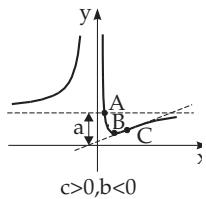  
a)

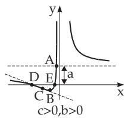

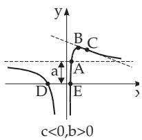  
c)

b)  
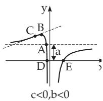  
d)  
Figure 2.18

Case a) $\Delta > 0$ : The function is positive and continuous for arbitrary values of x and it is increasing on the interval $( - \infty , - \frac { b } { 2 a } )$ . Here it takes its maximum, $\frac { 4 a } { \Delta }$ , then it is decreasing again in the interval $( - { \frac { b } { 2 a } } , \infty )$ . The extreme point A of the curve is at $\left( - \frac { b } { 2 a } , \frac { 4 a } { \Delta } \right)$ , the inflection points B and C are at $\left( - \frac { b } { 2 a } \pm \frac { \sqrt { \Delta } } { 2 a \sqrt { 3 } } , \frac { 3 a } { \Delta } \right)$ ; and for the corresponding slopes of the tangent lines (angular coeficients ) we get tan $\varphi = \mp a ^ { 2 } \left( \frac { 3 } { \Delta } \right) ^ { 3 / 2 }$ (Fig. 2.19a).

Case b) $\Delta = 0$ : The function is positive for arbitrary values of $x ,$ its value rises from 0 to $+ \infty ,$ , at $x = - { \frac { b } { 2 a } } = x _ { 0 }$ it has a point of discontinuity (a pole), where $\operatorname* { l i m } _ { x \to x _ { 0 } } y = + \infty$ . Then its value falls from here back to 0 (Fig. 2.19b).

Case c) $\Delta \mathit { \Psi } < 0$ : The value of y rises from 0 to + , at the point of discontinuity it jumps to $- \infty$ and rises to the maximum, then falls back to ; at the other point of discontinuity it jumps to + , then it falls to 0. The extreme point A of the curve is at $\left( - \frac { b } { 2 a } , \frac { 4 a } { \Delta } \right)$ . The points of discontinuity are at $x = { \frac { - b \pm { \sqrt { - \Delta } } } { 2 a } } \ ( \mathbf { F i g . 2 . 1 9 c } )$

#### 2.4.5 Curves of Third Degree,Type III

The graph of the function

$$
y = { \frac { x } { a x ^ { 2 } + b x + c } } \quad ( a \neq 0 , b \neq 0 , c \neq 0 )\tag{2.49}
$$

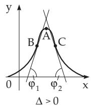  
a)

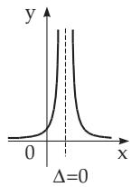  
b)  
Figure 2.19

c)  
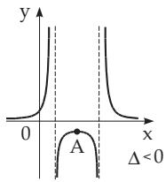

is a curve ofthird degree (type III) which goes through the origin, and has the x-axis (Fig. 2.20) as an asymptote. The behavior of the function depends on the signs of a and of $\Delta = 4 a c - \dot { b } ^ { 2 }$ , and for $\Delta < 0$ also on the signs of the roots α and $\beta$ of the equation $a x ^ { 2 } + b x + c = 0$ , and for $\Delta = 0$ also on the sign of b. From the two cases, $a > 0$ and $a < 0$ , only the first one is considered because reflecting the curve of $y = { \frac { x } { ( - a ) x ^ { 2 } - b x - c } }$ with respect to the x-axis yields the second one.

Case a) $\Delta > 0$ The function is continuous everywhere, its value falls from 0 to the minimum, then rises to the maximum, then falls again to 0.   
The extreme points of the curve, A and $B ,$ are at $\left( \pm { \sqrt { \frac { c } { a } } } , \ { \frac { - b \pm 2 { \sqrt { a c } } } { \Delta } } \right)$ ; there are three inflection points (Fig. 2.20a).

Case b) $\ \Delta = 0 \cdot$ : The behavior of the function depends on the sign of $b ,$ so there are two cases. In both cases there is a point of discontinuity at $x = - { \frac { b } { 2 a } }$ ; both curves have one inflection point.

$\bullet b > 0 \mathrm { : }$ : The value of the function falls from 0 to , the function has a point of discontinuity, then the value of the function rises from to the maximum, then decreases to 0 (Fig. 2.20b ). The extreme point A of the curve is at $A \left( + \sqrt { \frac { c } { a } } , \frac { 1 } { 2 \sqrt { a c } + b } \right)$

$b < 0$ : The value of the function falls from 0 to the minimum, then rises to + , running through the origin, then the function has a point of discontinuity, then the value of the function falls from + to 0 (Fig. 2.20b2). The extreme point A of the curve is at $A \left( - { \sqrt { \frac { c } { a } } } , - { \frac { 1 } { 2 { \sqrt { a c } } - b } } \right)$

Case c) $\Delta \ < \ 0 ;$ The function has two points of discontinuity, at $x = \alpha$ and $x = \beta ;$ its behavior depends on the signs of α and $\beta .$

The signs of α and $\beta$ are diferent: The value of the function falls from 0 to $- \infty$ , jumps up to $+ \infty$ then falls again from + to , running through the origin, then jumps again up to + , then it falls tending to 0 (Fig. 2.20c ). The function has no extremum.

The signs of α and $\beta$ are both negative: The value of the function falls from 0 to $- \infty$ , jumps up to + , from here it goes through a minimum up to + again, jumps down to , then rises to a maximum, then falls tending to $\mathrm { { \bar { 0 } } ( F i g . 2 . 2 0 c _ { 2 } ) }$ .

The extremum points A and B can be calculated with the same formula as in case a) of 2.4.5.

The signs of α and $\beta$ are both positive: The value of the function falls from 0 until the minimum, then rises to + , jumps down to , then it rises to the maximum, then it falls again to , then jumps up to + and then it tends to 0 (Fig. 2.20c ).

The extremum points A and B can be calculated by the same formula as in case a) of 2.4.5.

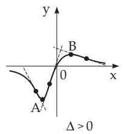  
a)

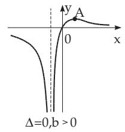  
b1)

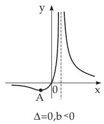  
b2)

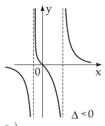  
c1)

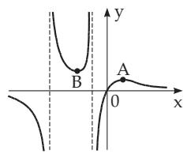  
c2)

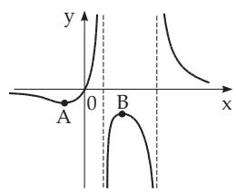  
c3)  
Δ 0, α and β positive  
Figure 2.20

In all three cases the curve has one inflection point.

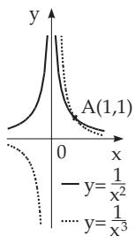  
Figure 2.21

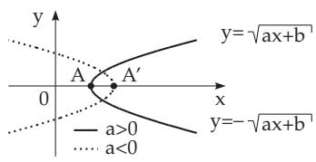  
Figure 2.22

#### 2.4.6 Reciprocal Powers

The graph of the function

$$
y = { \frac { a } { x ^ { n } } } = a x ^ { - n } \quad ( n > 0 , { \mathrm { ~ i n t e g e r } } ; a \neq 0 )\tag{2.50}
$$

is a curve of hyperbolic type with the coordinate axes as asymptotes. The point of discontinuity is at $x = 0$ (Fig. 2.21).

Case a) For $a > 0$ and for even n the value of the function rises from 0 to + , then it falls tending to 0, and it is always positive. For odd n it falls from 0 to , it jumps up $\mathrm { t o } + \infty$ , then it falls tending to 0.

Case b) For $a < 0$ and for even n the value of the function falls from 0 to $- \infty$ , then it tends to 0, and it is always negative. For odd n it rises from 0 up to + , jumps down to , then it tends to 0. The function does not have any extremum. The larger n is, the faster the curve approaches the x-axis, and the slower it approaches the y-axis. For even n the curve is symmetric with respect to the y-axis, for odd n it is center-symmetric and its center of symmetry is the origin. The Fig. 2.21 shows the cases $n = 2$ and $n = 3$ for $a = 1$
