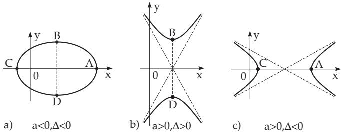
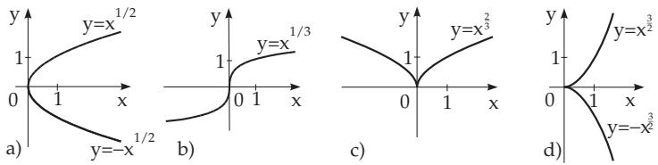
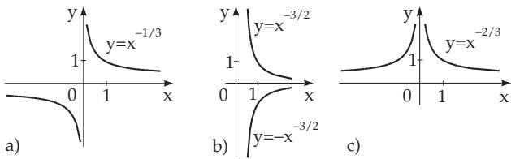

### 2.5 Irrational Functions

#### 2.5.1 Square Root of a Linear Binomial

The union of the curve of the two functions

$$
y = \pm { \sqrt { a x + b } } \quad ( a \neq 0 )\tag{2.51}
$$

is a parabola with the x-axis as the symmetry axis. The vertex A is at $\left( - { \frac { b } { a } } , 0 \right)$ , the semifocal chord (see 3.5.2.10, p. 204) is $p = \frac { a } { 2 }$ . The domain of the function and the shape of the curve depend on the sign of a (Fig. 2.22) (for more details about the parabola see 3.5.2.10, p. 204).

#### 2.5.2 Square Root of a Quadratic Polynomial

The union of the graphs of the two functions

$$
y = \pm { \sqrt { a x ^ { 2 } + b x + c } } \quad ( a \neq 0 , \Delta = 4 a c - b ^ { 2 } \neq 0 )\tag{2.52}
$$

is for $a < 0$ an ellipse, for $a > 0$ a hyperbola (Fig. 2.23). One of the two symmetry axes is the x-axis, the other one is the line $x = - { \frac { b } { 2 a } }$

The vertices $A , C$ and $B , D$ are at $\left( - \frac { b \pm \sqrt { - \Delta } } { 2 a } , 0 \right)$ and $\left( - \frac { b } { 2 a } , \pm \sqrt { \frac { \Delta } { 4 a } } \right)$ , where $\Delta = 4 a c - b ^ { 2 }$

  
Figure 2.23

The domain of the function and the shape of the curve depend on the signs of a and $\Delta$ (Fig. 2.23). For $a < 0$ and $\Delta > 0$ the function has only imaginary values, so no curve exists (for more details about the ellipse and hyperbola see 3.5.2.8, p. 199 and 3.5.2.9, p. 201).

#### 2.5.3 Power Function

The power function

$$
\begin{array} { r l } { y = a x ^ { k } = a x ^ { \pm m / n } } & { { } ( m , n { \mathrm { ~ i n t e g e r , p o s i t i v e , c o p r i m e ) } } } \end{array}\tag{2.53}
$$

is to be discussed for $k > 0$ and for $k \ < \ 0$ (Fig. 2.24, Fig. 2.25). The investigation here can be restricted to the case $a = 1$ , because for $a \neq 1$ the curve difers from the curve of $y = x ^ { k }$ only by a stretching in the direction of the y-axis by a factor a , and for a negative a by a reflection to the x-axis.

  
Figure 2.24

Case a) $k \ > \ 0 , y \ = \ x ^ { m / n } ,$ : The shape of the curve is represented in four characteristic cases depending on the numbers m and n in Fig. 2.24. The curve goes through the points (0, 0) and (1, 1). For $k > 1$ the x-axis is a tangent line of the curve at the origin (Fig. 2.24d), for $k < 1$ the y-axis is a tangent line also at the origin(Fig. 2.24a,b,c). For even n the union of the graph of functions $y = \pm x ^ { k }$ may be considered: it has two branches symmetric to the x-axis $( \mathrm { F i g . 2 . 2 4 a , d ) }$ , for even m the curve is symmetric to the y-axis (Fig. 2.24c). If m and n are both odd, the curve is symmetric with respect to the origin (Fig. 2.24b). So the curves can have a vertex, a cusp or an inflection point at the origin (Fig. 2.24). None of them has any asymptote.

  
Figure 2.25

Case b) $k < 0 , y = x ^ { - m / n } ,$ : The shape of the curve is represented in three characteristic cases depending on m and n in Fig. 2.25. The curve is a hyperbolic type curve, where the asymptotes coincide with the coordinate axes (Fig. 2.25). The point of discontinuity is at $x = 0$ . The greater k is the faster the curve approaches the x-axis, and the slower it approaches the y-axis. The symmetry properties of the curves are the same as above for $k > 0 ;$ ; they depend on whether m and n are even or odd. There is no extreme value.
