### 2.6 Exponential Functions and Logarithmic Functions

#### 2.6.1 Exponential Functions

The function

$$
y = a ^ { x } = e ^ { b x } \quad ( a > 0 , b = \ln a ) ,\tag{2.54}
$$

is called the exponential function and its graphical representation the exponential curve (Fig. 2.26). From (2.54) for $a = e$ follows the function of the natural exponential curve

$$
y = e ^ { x } ,\tag{2.55}
$$

The function has only positive values. Its domain is the interval $( - \infty , + \infty )$ . For $a > 1 , \mathrm { i . e . }$ , for $b > 0 .$ the function is strictly monotone increasing and takes its values from 0 until . For $a < 1 , \mathrm { i . e . }$ ., for $b < 0$ , it is strictly monotone decreasing, its value falls from until 0. The larger b is, the greater is

the speed of growth and decay. The curve goes through the point (0, 1) and approaches asymptotically the x-axis, for $b > 0$ on the right and for $\bar { b } < 0$ on the left, and faster for greater values of b . The function $y = a ^ { - x } = \left( { \frac { 1 } { a } } \right) ^ { * }$ increases for $a < 1$ and decreases for $a > 1$

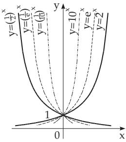  
Figure 2.26

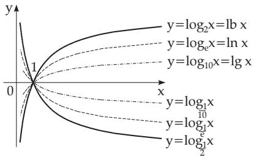  
Figure 2.27

#### 2.6.2 Logarithmic Functions

The function

$$
y = \log _ { a } x ( a > 0 , \ a \neq 1 )\tag{2.56}
$$

gives the logarithmic curve (Fig. 2.27); the curve is the reflection of the exponential curve with respect to the line $y = x$ . From (2.56) for $a = e$ follows the curve of the natural logarithm

$$
y = \ln x .\tag{2.57}
$$

The real logarithmic function is defined only for $x > 0$ . For $a > 1$ it is strictly monotone increasing and takes its values from to + , for $a < 1$ it is strictly monotone decreasing, and takes its values from + to , and the greater ln a is, the faster the growth and decay. The curve goes through the point (1, 0) and approaches asymptotically the y-axis, for $a > 1$ down, for $a < 1$ up, and again faster for larger values of ln a .

#### 2.6.3 Error Curve

The function

$$
y = e ^ { - ( a x ) ^ { 2 } }\tag{2.58}
$$

gives the error curve (Gauss error distribution curve) (Fig. 2.28). Since the function is even, the yaxis is the symmetry axis of the curve and the larger a is, the faster it approaches asymptotically the x-axis. It takes its maximum at zero, and it is equal to one, so the extreme point A of the curve is at

(0, 1), the inflection points of the curve $B , C$ are at $\left( \pm \frac { 1 } { a \sqrt { 2 } } , \frac { 1 } { \sqrt { e } } \right)$

The slopes of the tangent lines are here tan $\varphi = \mp a \sqrt { 2 / e }$

A very important application of the error curve (2.58) is the description of the normal distribution properties of the observational error (see 16.2.4.1, p. 818.):

$$
y = \varphi ( x ) = { \frac { 1 } { \sigma { \sqrt { 2 \pi } } } } \exp \left( - { \frac { x ^ { 2 } } { 2 \sigma ^ { 2 } } } \right) .\tag{2.59}
$$

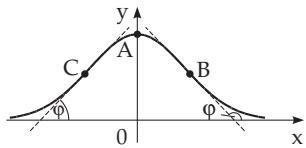  
Figure 2.28

#### 2.6.4 Exponential Sum

The function

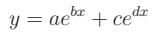

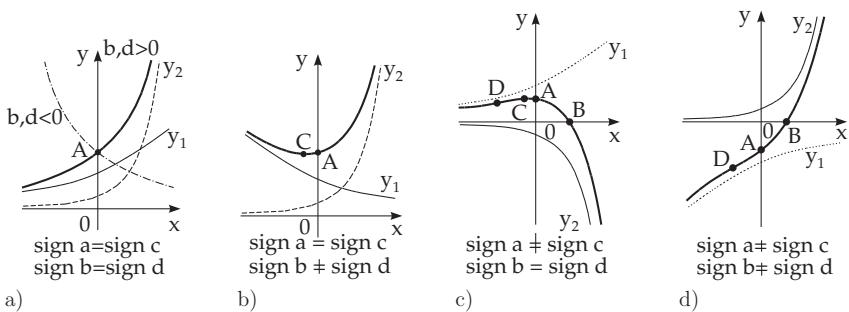  
Figure 2.29

(2.60)

is represented in Fig. 2.29 for the characteristic sign relations. The sum of the functions is got by adding the ordinates of the curves, i.e., the summands are $y _ { 1 } = a e ^ { b x }$ and $y _ { 2 } = c e ^ { d x }$ . The function is continuous. If none of the numbers a, b, c, d is equal to 0, the curve has one of the four forms represented in Fig. 2.29. Depending on the signs of the parameters it is possible, that the graphs are reflected over a coordinate axis.

The intersection points A and B of the curve with the y-axis and with the x-axis are at $( 0 , a + c )$ , and at $\left( \frac { \ln \left( - a / c \right) } { d - b } , 0 \right)$ respectively, the extremum C is at $x = { \frac { 1 } { d - b } } \ln \left( - { \frac { a b } { c d } } \right)$ , and the inflection point D

is at $x = \frac { 1 } { d - b } \ln \left( - \frac { a b ^ { 2 } } { c d ^ { 2 } } \right)$ , in the case when they exist.

Case a) The parameters a and c, and b and d have the same signs: The function does not change its sign, it is strictly monotone; its value is changing from 0 to + or to or it is changing from + or from to 0. There is no inflection point. The asymptote is the x-axis (Fig. 2.29a).

Case b) The parameters a and c have the same sign, b and d have diferent signs: The function does not change its sign and either comes from + and arrives at + and has a minimum or comes from , goes to and has a maximum. There is no inflection point (Fig. 2.29b).

Case c) The parameters a and c have diferent signs, b and d have the same signs: The function has one extremum and it is strictly monotone before and after. It changes its sign once. Its value changes whether from 0 until the extremum, then goes to + or or it comes first from + or , takes the extremum, then approaches 0. The x-axis is an asymptote, the extreme point of the curve is at C and the inflection point at D (Fig. 2.29c).

Case d) The parameters a and c and also b and d have diferent signs: The function is strictly monotone, its value rises from to + or it falls from + to . It has an inflection point D (Fig. 2.29d).

#### 2.6.5 Generalized Error Function

The curve of the function

$$
y = a \exp ( b x + c x ^ { 2 } ) = a \exp \left( - { \frac { b ^ { 2 } } { 4 c ^ { 2 } } } \right) \exp \left( c \left( x + { \frac { b } { 2 c } } \right) ^ { 2 } \right) \quad ( c \neq 0 )\tag{2.61}
$$

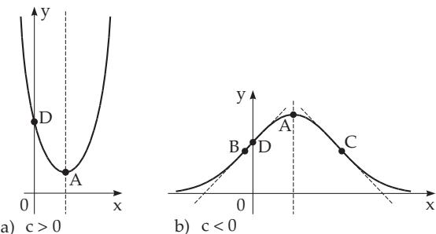  
Figure 2.30

can be considered as the generalization of the error function (2.58); it results in a symmetric curve with respect to the vertical line $x = - { \frac { b } { 2 c } }$ , it has no intersection point with the x-axis, and the intersection point D with the y-axis is at $( 0 , a ) \ ( \mathbf { F i g . 2 . 3 0 a , b } )$

The shape of the curve depends on the signs of a and c. Here only the case $a > 0$ is discussed, because the curve for $a < 0$ is got by reflecting it in the x-axis.

Case a) $c > 0$ : The value of the function falls from + until the minimum, and then rises again to $+ \infty$ . It is always positive. The extreme point A of the curve is at $\left( - { \frac { b } { 2 c } } , a \exp \left( { \frac { b ^ { 2 } } { 4 c } } \right) \right)$ and it corresponds to the minimum of the function; there is no inflection point or asymptote (Fig. 2.30a).

Case b) $c \ < \ 0 :$ : The x-axis is the asymptote. The extreme point A of the curve is at $\left( - { \frac { b } { 2 c } } \right)$   
$a \exp \left( - \frac { b ^ { 2 } } { 4 c } \right) \Biggr )$ and it corresponds to the maximum of the function. The inflection points B and C   
are at   
$\left( { \frac { - b \pm { \sqrt { - 2 c } } } { 2 c } } \right)$ (b2 + 2c) , a exp 4c (Fig 2.30b).

#### 2.6.6 Product of Power and Exponential Functions

$$
y = a x ^ { b } e ^ { c x }\tag{2.62}
$$

is discussed here only in the case $a > 0$ , because in the case $a < 0$ the curve is got by reflecting it in the x-axis. For a non-integer b the function is defined only for $x > 0$ , and for an integer b the shape of the curve for negative x can be deduced also from the following cases (Fig. 2.31).

Fig. 2.31 shows how the curve behaves for arbitrary parameters.

For $b > 0$ the curve passes through the origin. The tangent line at this point for $b > 1$ is the x-axis, for $b = 1$ the line $y = x ,$ for $0 < b < 1$ the y-axis. For $b < 0$ the y-axis is an asymptote. For $c > 0$ the function is increasing and exceeds any value, for $c < 0$ it tends asymptotically to 0. For diferent signs of b and c the function has an extremum at $x = - { \frac { b } { c } }$ (point A on the curve). The curve has either no or one or two inflection points at $x = - { \frac { b \pm { \sqrt { b } } } { c } } { \mathrm { ~ ( p o i n t s ~ } } C$ and D see $\mathbf { F i g . 2 . 3 1 c , e , f , g } )$

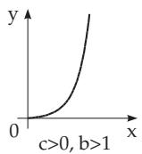  
a)

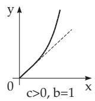  
b)

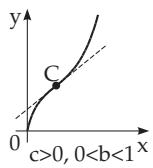

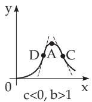

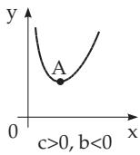  
d)

c)  
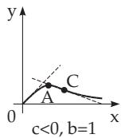  
e)  
f)

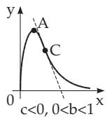  
g)  
Figure 2.31

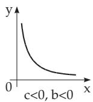  
h)
