### 2.7 Trigonometric Functions (Functions ofAngles)

#### 2.7.1 Basic Notions

##### 2.7.1.1 Definition and Representation

1. Definition

The trigonometric functions are introduced by geometric considerations. So in their definition and also in their arguments degree or radian measure is used (see 3.1.1.5, p. 131).

2. Sine

The standard sine function

$$
y = \sin x
$$

is a continuous curve with period $T = 2 \pi$ (see Fig. 2.32a).

(2.63)

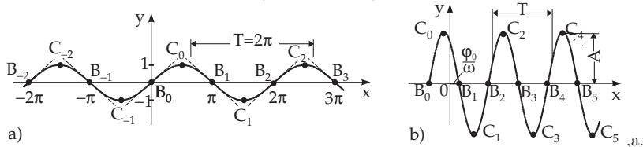  
Figure 2.32

The intersection points $B _ { 0 } , B _ { 1 } , B _ { - 1 } , B _ { 2 } , B _ { - 2 } , . . .$ , with $B _ { k } = ( k \pi , 0 ) ( k = 0 , \pm 1 , \pm 2 , . . . )$ of the standard sine curve and the x-axis are the inflection points of the curve. Here the angle of slope of the tangent line with the x axis is $\pm \frac { \pi } { 4 }$ . The extreme points of the curve are at $C _ { 0 } , C _ { 1 } , C _ { - 1 } , C _ { 2 } , C _ { - 2 } , . .$ . with $C _ { k } = \left( ( k + \textstyle { \frac { 1 } { 2 } } ) \pi , ( - 1 ) ^ { k } \right) ( k = 0 , \pm 1 , \pm 2 , . . . )$ . For every value of the function y there is $- 1 \leq y \leq 1$

The general sine function

$$
y = A \sin ( \omega x + \varphi _ { 0 } )\tag{2.64}
$$

with an amplitude $| { \cal { A } } |$ frequency ω, and phase shift $\varphi _ { 0 }$ is represented in Fig. 2.32b.

Comparing the standard and the general sine curve (Fig. 2.32b) it can be seen that in the general case the curve is stretched in the direction of y by a factor $| A |$ , in the direction of x it is compressed by a factor $\frac { 1 } { \omega }$ , and it is shifted to the left by a segment $\frac { \varphi _ { 0 } } { \omega }$ . The period is $T = \frac { 2 \pi } { \omega }$ . The intersection points with the x-axis are $B _ { k } = \left( \frac { k \pi - \varphi _ { 0 } } { \omega } , 0 \right) ( k = 0 , \pm 1 , \pm 2 , . . . )$ . The extreme points are $C _ { k } =$ $\left( \frac { \left[ \left( k + \frac { 1 } { 2 } \right) \pi - \varphi _ { 0 } \right] } { \omega } , ( - 1 ) ^ { k } A \right) ( k = 0 , \pm 1 , \pm 2 , . . . ) .$

3. Cosine

The standard cosine function

$$
y = \cos x = \sin ( x + \frac { \pi } { 2 } )\tag{2.65}
$$

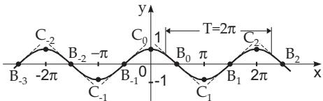

is represented in Fig. 2.33.

The intersection points with the x-axis

Figure 2.33 0

$B _ { 0 } , B _ { 1 } , B _ { 2 } , \ldots , B _ { k } = \left( \left( k + { \frac { 1 } { 2 } } \right) \pi , 0 \right) ( k = 0 , \pm 1 , \pm 2 , \ldots )$ are also the inflection points. The angle of slope of the tangent line is $\pm \frac { \pi } { 4 }$

The extreme points are $C _ { 0 } , C _ { 1 } , . . . , C _ { k } = ( k \pi , ( - 1 ) ^ { k } ) ~ ( k = 0 , \pm 1 , \pm 2 , . . . )$

The general cosine function

$$
y = A \cos ( \omega x + \varphi _ { 0 } )\tag{2.66a}
$$

can be transformed into the form

$$
y = A \sin \left( \omega x + \varphi _ { 0 } + { \frac { \pi } { 2 } } \right) ,\tag{2.66b}
$$

i.e., the general sine function shifted left by $\varphi = \frac { \pi } { 2 }$

4. Tangent

The tangent function

$$
y = \tan x = { \frac { \sin x } { \cos x } }\tag{2.67}
$$

has period $T = \pi$ and the asymptotes are $x = \left( k + { \frac { 1 } { 2 } } \right) \pi ( k = 0 , \pm 1 , \pm 2 , . . . )$ (Fig. 2.34). The function is monotone increasing in the intervals $\left( - { \frac { \pi } { 2 } } + k \pi , + { \frac { \pi } { 2 } } + k \pi \right) ( k = 0 , \pm 1 , \pm 2 , . . . )$ and takes values from to + . The curve has intersection points with the x-axis at $A _ { 0 } , A _ { 1 } , A _ { - 1 } , A _ { 2 } , A _ { - 2 } , . . . ,$ $A _ { k } = ( k \pi , 0 ) ( k = 0 , \pm 1 , \pm 2 , . . . )$ , these points are the inflection points and the angle of slope of the tangent line is $\frac { \pi } { 4 }$

5. Cotangent

The cotangent function

$$
y = \cot x = { \frac { \cos x } { \sin x } } = { \frac { 1 } { \tan x } } = - \tan \left( x + { \frac { \pi } { 2 } } \right)\tag{2.68}
$$

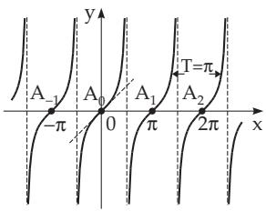  
Figure 2.34

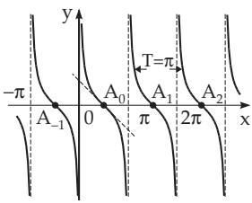  
Figure 2.35

has a graph which is the tangent curve reflected with respect to the x-axis and shifted to the left by $\frac { \pi } { 2 } \left( \mathbf { F i g . 2 . 3 5 } \right)$ . The asymptotes are $x = k \pi ( k = 0 , \pm 1 , \pm 2 , . . . )$ . Between 0 and π the function is monotone decreasing and takes its values from + until ; the function has period $T = \pi$ . The intersection points with the x-axis are at $A _ { 0 } , A _ { 1 } , A _ { - 1 } , A _ { 2 } , A _ { - 2 } , . .$ . with $A _ { k } = \left( \left( k + \frac { 1 } { 2 } \right) \pi , 0 \right)$ (k = $0 , \pm 1 , \pm 2 , \ldots )$ , they are the inflection points of the curve and here the angle of the tangent line is $- { \frac { \pi } { 4 } }$

6. Secant

The secant function

$$
y = \sec x = { \frac { 1 } { \cos x } }\tag{2.69}
$$

has period $T = 2 \pi$ , the asymptotes are $x = \left( k + { \frac { 1 } { 2 } } \right) \pi ( k =$ $0 , \pm 1 , \pm 2 , \ldots )$ ; and obviously $| y | \geq 1$ holds. The extreme points corresponding to the maxima of the function are $A _ { 0 } , A _ { 1 } , A _ { - 1 } , \dotsc$

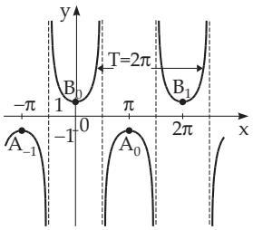  
Figure 2.36

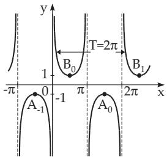  
Figure 2.37

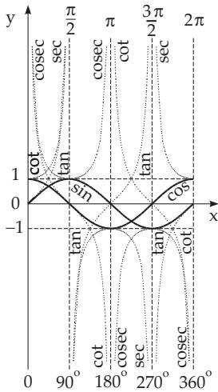  
Figure 2.38

with $A _ { k } = ( ( 2 k + 1 ) \pi , - 1 ) ( k = 0 , \pm 1 , \pm 2 , . . . )$ , the extreme points corresponding to the minima of the function are $B _ { 0 } , B _ { 1 } , B _ { - 1 } ^ { \prime } , \ldots , \mathrm { w i t h } B _ { k } = ( 2 k \pi , + 1 ) ( k = 0 , \pm 1 , \pm 2 , \ldots )$ (Fig. 2.36).

7. Cosecant

The cosecant function

$$
y = \cos e c x = { \frac { 1 } { \sin x } }\tag{2.70}
$$

has a graph which is the graph of the secant shifted to the right by $x \ = \ { \frac { \pi } { 2 } } .$ . The asymptotes are $x = k \pi ( k = 0 , \pm 1 , \pm 2 , . . . )$ . The extreme points corresponding to the maxima of the function are $A _ { 0 } , A _ { 1 } , A _ { - 1 } , . . .$ . with $A _ { k } = \left( { \frac { 4 k + 3 } { 2 } } \pi , - 1 \right) ( k = 0 , \pm 1 , \pm 2 , . . . )$ and the the points corresponding to the minima of the function are $B _ { 0 } , B _ { 1 } , B _ { - 1 } , . . .$ . with $B _ { k } = \left( { \frac { 4 k + 1 } { 2 } } \pi , + 1 \right) ( k = 0 , \pm 1 , \pm 2 , . . . )$ (Fig. 2.37).

##### 2.7.1.2 Range and Behavior of the Functions

1. Angle Domain $0 \leq x \leq 3 6 0 ^ { \circ }$

The six trigonometric functions are represented together in Fig. 2.38 in all the four quadrants for a complete domain of angles from $0 ^ { \circ }$ to $3 6 0 ^ { \circ }$ or for a complete domain of radians from 0 to $2 \pi$

In Table 2.1 there is a review of the domain and the range of these functions. The signs of the functions depend on the quadrant where the argument is taken from, and these are reviewed in Table 2.2.

Table 2.1 Domain and range of trigonometric functions
<table><tr><td rowspan=1 colspan=1>Domain</td><td rowspan=1 colspan=1>Range</td><td rowspan=1 colspan=1>Domain</td><td rowspan=1 colspan=1>Range</td></tr><tr><td rowspan=1 colspan=1> $- \infty < x < \infty$ J</td><td rowspan=1 colspan=1> $- 1 \leq \sin x \leq 1$  $- 1 \leq \cos x \leq 1$ </td><td rowspan=1 colspan=1> $x \neq ( 2 k + 1 ) \frac { \pi } { 2 }$  $x \neq k \pi$  $( k = 0 , \pm 1 , \pm 2 , \ldots )$ </td><td rowspan=1 colspan=1> $- \infty < \tan x < \infty$  $- \infty < \cot x < \infty$ </td></tr></table>

2. Function Values for Some Special Arguments (see Table 2.3)

3. Arbitrary Angle

Since the trigonometric functions are periodic (period $3 6 0 ^ { \circ }$ or 180◦), the determination of their values for an arbitrary argument x can be reduced by the following rules.

Argument $x > 3 6 0 ^ { \circ }$ or $x > 1 8 0 ^ { \circ }$ : If the angle is greater than 360◦ or greater than 180◦, then it is to be reduced for a value α, for which $0 \leq \alpha \leq 3 6 0 ^ { \circ } \mathrm { { o r } } 0 \leq \alpha \leq 1 8 0 ^ { \circ }$ holds, in the following way (n integer):

$$
\sin ( 3 6 0 ^ { \circ } \cdot n + \alpha ) = \sin \alpha ,\tag{2.71}
$$

$$
\cos ( 3 6 0 ^ { \circ } \cdot n + \alpha ) = \cos \alpha ,\tag{2.72}
$$

$$
\tan ( 1 8 0 ^ { \circ } \cdot n + \alpha ) = \tan \alpha ,\tag{2.73}
$$

$$
\cot ( 1 8 0 ^ { \circ } \cdot n + \alpha ) = \cot \alpha .\tag{2.74}
$$

Table 2.2 Signs of trigonometric functions
<table><tr><td>Quadrant</td><td>Angle</td><td>sin</td><td>COS</td><td>tan</td><td>cot</td><td>sec</td><td>csC</td></tr><tr><td>I</td><td>from  $0 ^ { \circ }$  to  $9 0 ^ { \circ }$ </td><td>十</td><td>十</td><td>十</td><td>十</td><td>十</td><td>十</td></tr><tr><td>II</td><td>from  $9 0 ^ { \circ } \mathrm { ~ t o ~ } 1 8 0 ^ { \circ }$ </td><td>十</td><td></td><td>一</td><td></td><td></td><td>十</td></tr><tr><td>III</td><td>from  $1 8 0 ^ { \circ }$  to  $2 7 0 ^ { \circ }$ </td><td>一-</td><td>一-</td><td>十</td><td>十</td><td>--</td><td>1</td></tr><tr><td>IV</td><td>from  $2 7 0 ^ { \circ }$  to  $3 6 0 ^ { \circ }$ </td><td></td><td>十</td><td></td><td></td><td>十</td><td></td></tr></table>

Argument $x < 0 \AA$ : If the argument is negative, then the following formulas reduce the calculations to functions for positive argument:

$$
\sin ( - \alpha ) = - \sin \alpha ,\tag{2.75}
$$

$$
\cos ( - \alpha ) = \cos \alpha ,\tag{2.76}
$$

$$
\tan ( - \alpha ) = - \tan \alpha ,\tag{2.77}
$$

$$
\cot ( - \alpha ) = - \cot \alpha .\tag{2.78}
$$

Table 2.3 Values of trigonometric functions for $0 ^ { \circ } , 3 0 ^ { \circ } , 4 5 ^ { \circ } , 6 0 ^ { \circ }$ and $9 0 ^ { \circ }$
<table><tr><td rowspan=1 colspan=1>Angle</td><td rowspan=1 colspan=1>Radian</td><td rowspan=1 colspan=1>sin</td><td rowspan=1 colspan=1>COS</td><td rowspan=1 colspan=1>tan</td><td rowspan=1 colspan=1>cot</td><td rowspan=1 colspan=1>sec</td><td rowspan=1 colspan=1>CSC</td></tr><tr><td rowspan=1 colspan=1> $\overline { { 0 ^ { \circ } } }$ </td><td rowspan=1 colspan=1>0</td><td rowspan=1 colspan=1>0</td><td rowspan=1 colspan=1>1</td><td rowspan=1 colspan=1>0</td><td rowspan=1 colspan=1> $\mp \infty$ </td><td rowspan=1 colspan=1>1</td><td rowspan=1 colspan=1> $\mp \infty$ </td></tr><tr><td rowspan=1 colspan=1> $3 0 ^ { \circ }$ </td><td rowspan=1 colspan=1> $\frac { 1 } { 6 } \pi$ </td><td rowspan=1 colspan=1> $\frac { 1 } { 2 }$ </td><td rowspan=1 colspan=1> $\frac { \sqrt { 3 } } { 2 }$ </td><td rowspan=1 colspan=1> $\sqrt { 3 }$ 3</td><td rowspan=1 colspan=1> $\sqrt { 3 }$ </td><td rowspan=1 colspan=1> $2 \sqrt { 3 }$ 3</td><td rowspan=1 colspan=1>2</td></tr><tr><td rowspan=1 colspan=1> $4 5 ^ { \circ }$ </td><td rowspan=1 colspan=1> $\frac { 1 } { 4 } \pi$ </td><td rowspan=1 colspan=1> $\sqrt { 2 }$ 2</td><td rowspan=1 colspan=1> $\sqrt { 2 }$ 2</td><td rowspan=1 colspan=1>1</td><td rowspan=1 colspan=1>1</td><td rowspan=1 colspan=1> $\sqrt { 2 }$ </td><td rowspan=1 colspan=1> $\sqrt { 2 }$ </td></tr><tr><td rowspan=1 colspan=1> $6 0 ^ { \circ }$ </td><td rowspan=1 colspan=1> $\frac { 1 } { 3 } \pi$ </td><td rowspan=1 colspan=1> $\sqrt { 3 }$ 2</td><td rowspan=1 colspan=1>12</td><td rowspan=1 colspan=1> $\sqrt { 3 }$ </td><td rowspan=1 colspan=1> $\frac { \sqrt { 3 } } { 3 }$ </td><td rowspan=1 colspan=1>2</td><td rowspan=1 colspan=1> $2 \sqrt { 3 }$ 3</td></tr><tr><td rowspan=1 colspan=1> $9 0 ^ { \circ }$ </td><td rowspan=1 colspan=1> ${ \frac { 1 } { 2 } } \pi$ </td><td rowspan=1 colspan=1>1</td><td rowspan=1 colspan=1>0</td><td rowspan=1 colspan=1> $\pm \infty$ </td><td rowspan=1 colspan=1>0</td><td rowspan=1 colspan=1> $\pm \infty$ </td><td rowspan=1 colspan=1>1</td></tr></table>

Table 2.4 Reduction formulas and quadrant relations of trigonometric functions
<table><tr><td rowspan=1 colspan=1>Function</td><td rowspan=1 colspan=1> $x = 9 0 ^ { \circ } \pm \alpha$ </td><td rowspan=1 colspan=1> $x = 1 8 0 ^ { \circ } \pm \alpha$ </td><td rowspan=1 colspan=1> $x = 2 7 0 ^ { \circ } \pm \alpha$ </td><td rowspan=1 colspan=1> $x = 3 6 0 ^ { \circ } - \alpha$ </td></tr><tr><td rowspan=1 colspan=1>sin x</td><td rowspan=1 colspan=1> $+ \cos \alpha$ </td><td rowspan=1 colspan=1> $\mp \sin \alpha$ </td><td rowspan=1 colspan=1> $- \cos \alpha$ </td><td rowspan=2 colspan=1>− sin α+ cos α</td></tr><tr><td rowspan=1 colspan=1>COS x</td><td rowspan=1 colspan=1> $\mp \sin \alpha$ </td><td rowspan=1 colspan=1> $- \cos \alpha$ </td><td rowspan=1 colspan=1> $\pm \sin \alpha$ </td></tr><tr><td rowspan=1 colspan=1>tan x</td><td rowspan=1 colspan=1> $\mp \cot \alpha$ </td><td rowspan=1 colspan=1> $\pm \tan \alpha$ </td><td rowspan=1 colspan=1> $\mp \cot \alpha$ </td><td rowspan=1 colspan=1>-tan α</td></tr><tr><td rowspan=1 colspan=1>cot x</td><td rowspan=1 colspan=1> $\mp \tan \alpha$ </td><td rowspan=1 colspan=1> $\pm \cot \alpha$ </td><td rowspan=1 colspan=1> $\mp \tan \alpha$ </td><td rowspan=1 colspan=1>− cot α</td></tr></table>

Argument x for $9 0 ^ { \circ } < x < 3 6 0 ^ { \circ } \colon \mathrm { I f ~ } 9 0 ^ { \circ } < x < 3 6 0 ^ { \circ }$ holds, then the arguments are to be reduced for an acute angle α by the reduction formulas given in Table 2.4. The relations between the values of the functions belonging to the arguments which difer from each other by $9 0 ^ { \circ } , 1 8 0 ^ { \circ }$ or $2 7 0 ^ { \circ }$ or which complete each other to $9 0 ^ { \circ }$ , 180◦ or $\bar { 2 7 0 ^ { \circ } }$ are called quadrant relations.

The first and second columns of Table 2.4 give the complementary angle formulas, and the first and third ones give the supplementary angle formulas. Because $x = 9 0 ^ { \circ } - \alpha$ is the complementary angle (see 3.1.1.2, p. 130) of $\alpha ,$ the following relations

$$
\cos \alpha = \sin x = \sin ( 9 0 ^ { \circ } - \alpha ) , \quad ( 2 . 7 9 \mathrm { { a } ) }
$$

$$
\sin \alpha = \cos x = \cos ( 9 0 ^ { \circ } - \alpha )\tag{2.79b}
$$

are called the complementary angle formulas.

For $\alpha + x \ : = \ : 1 8 0 ^ { \circ }$ the relations between the trigonometric functions for supplementary angles (see 3.1.1.2, p. 130)

$$
\sin \alpha = \sin x = \sin ( 1 8 0 ^ { \circ } - \alpha ) , ~ ( 2 . 8 0 { \mathrm { a } } )
$$

$$
- \cos \alpha = \cos x = \cos ( 1 8 0 ^ { \circ } - \alpha )\tag{2.80b}
$$

are called supplementary angle formulas.

Argument x for $\mathbf { 0 ^ { \circ } < x < 9 0 ^ { \circ } }$ : The values of trigonometric functions for acute angles $( 0 ^ { \circ } < x <$ $9 0 ^ { \circ } )$ have been taken formerly from tables, today calculators are used.

$$
\begin{array} { r } { \mathrm { \sin } ( - 1 0 0 0 ^ { \circ } ) = - \sin 1 0 0 0 ^ { \circ } = - \sin ( 3 6 0 ^ { \circ } \cdot 2 + 2 8 0 ^ { \circ } ) = - \sin 2 8 0 ^ { \circ } = + \cos 1 0 ^ { \circ } = + 0 . 9 8 4 8 . } \end{array}
$$

4. Angles in Radian Measure

The arguments given in radian measure, i.e., in units of radians, can be easily converted by formula (3.2) (see 3.1.1.5, p. 131).

#### 2.7.2 Important Formulas for Trigonometric Functions

Remark: Trigonometric functions with complex argument z are discussed in 14.5.2, p. 759.

##### 2.7.2.1 Relations Between the Trigonometric Functions

$$
\sin ^ { 2 } \alpha + \cos ^ { 2 } \alpha = 1 ,\tag{2.81}
$$

$$
\sec ^ { 2 } \alpha - \tan ^ { 2 } \alpha = 1 ,\tag{2.82}
$$

$$
\cos \mathrm { e c } ^ { 2 } \alpha - \cot ^ { 2 } \alpha = 1 ,\tag{2.83}
$$

$$
\sin \alpha \cdot \csc \alpha = 1 ,\tag{2.84}
$$

$$
\cos \alpha \cdot \sec \alpha = 1 ,\tag{2.85}
$$

(2.86)

$$
{ \frac { \sin \alpha } { \cos \alpha } } = \tan \alpha ,\tag{2.87}
$$

$$
{ \frac { \cos \alpha } { \sin \alpha } } = \cot \alpha .\tag{2.88}
$$

Some important relations are summarized in Table 2.5 for $0 < \alpha < \pi / 2$ in order to create an easy survey. For other intervals in Table 2.5 the square roots are always considered with the sign which corresponds to the quadrant where the argument is.

##### 2.7.2.2 Trigonometric Functions of the Sum and Difference of Two Angles (Addition Theorems)

$$
\sin ( \alpha \pm \beta ) = \sin \alpha \cos \beta \pm \cos \alpha \sin \beta , ( 2 . 8 9 )
$$

$$
\cos ( \alpha \pm \beta ) = \cos \alpha \cos \beta \mp \sin \alpha \sin \beta , ( 2 . 9 0 )
$$

$$
\tan ( \alpha \pm \beta ) = { \frac { \tan \alpha \pm \tan \beta } { 1 \mp \tan \alpha \tan \beta } } ,\tag{2.91}
$$

$$
\cot ( \alpha \pm \beta ) = { \frac { \cot \alpha \cot \beta \mp 1 } { \cot \beta \pm \cot \alpha } } ,\tag{2.92}
$$

$$
\begin{array} { r } { \sin ( \alpha + \beta + \gamma ) = \sin \alpha \cos \beta \cos \gamma + \cos \alpha \sin \beta \cos \gamma \quad } \\ { + \cos \alpha \cos \beta \sin \gamma - \sin \alpha \sin \beta \sin \gamma , } \end{array}\tag{2.93}
$$

$$
\begin{array} { c } { \cos ( \alpha + \beta + \gamma ) = \cos \alpha \cos \beta \cos \gamma - \sin \alpha \sin \beta \cos \gamma } \\ { - \sin \alpha \cos \beta \sin \gamma - \cos \alpha \sin \beta \sin \gamma . } \end{array}\tag{2.94}
$$

##### 2.7.2.3 Trigonometric Functions of an Integer Multiple of an Angle

$$
\sin { 2 \alpha } = 2 \sin { \alpha } \cos { \alpha } ,\tag{2.95}
$$

$$
\cos 2 \alpha = \cos ^ { 2 } \alpha - \sin ^ { 2 } \alpha ,\tag{2.97}
$$

$$
\sin 3 \alpha = 3 \sin \alpha - 4 \sin ^ { 3 } \alpha ,\tag{2.96}
$$

$$
\cos 3 \alpha = 4 \cos ^ { 3 } \alpha - 3 \cos \alpha ,\tag{2.98}
$$

$$
\sin { 4 \alpha } = 8 \cos ^ { 3 } { \alpha } \sin { \alpha } - 4 \cos { \alpha } \sin { \alpha } ,\tag{2.99}
$$

$$
\cos { 4 \alpha } = 8 \cos ^ { 4 } { \alpha } - 8 \cos ^ { 2 } { \alpha } + 1 ,\tag{2.100}
$$

$$
\tan 2 \alpha = \frac { 2 \tan \alpha } { 1 - \tan ^ { 2 } \alpha } ,\tag{2.101}
$$

$$
\cot 2 \alpha = { \frac { \cot ^ { 2 } \alpha - 1 } { 2 \cot \alpha } } ,\tag{2.104}
$$

$$
\tan 3 \alpha = \frac { 3 \tan \alpha - \tan ^ { 3 } \alpha } { 1 - 3 \tan ^ { 2 } \alpha } ,\tag{2.102}
$$

$$
\cot 3 \alpha = { \frac { \cot ^ { 3 } \alpha - 3 \cot \alpha } { 3 \cot ^ { 2 } \alpha - 1 } } ,\tag{2.105}
$$

$$
\tan 4 \alpha = { \frac { 4 \tan \alpha - 4 \tan ^ { 3 } \alpha } { 1 - 6 \tan ^ { 2 } \alpha + \tan ^ { 4 } \alpha , } }\tag{2.103}
$$

$$
\cot { 4 \alpha } = { \frac { \cot ^ { 4 } \alpha - 6 \cot ^ { 2 } \alpha + 1 } { 4 \cot ^ { 3 } \alpha - 4 \cot \alpha } } .\tag{2.106}
$$

For larger values of n in order to gain a formula for sin nα and cos nα the de Moivre formula is to be used (see 1.5.3.5, p. 38).

Using the binomial theorem (see 1.1.6.4, p. 12) gives:

$$
\begin{array} { l } { { \cos n \alpha + \mathrm { i } \sin n \alpha = \displaystyle \sum _ { k = 0 } ^ { n } \binom { n } { k } \mathrm { i } ^ { k } \cos ^ { n - k } \alpha \sin ^ { k } \alpha = ( \cos \alpha + \mathrm { i } \sin \alpha ) ^ { n } } } \\ { { \qquad = \cos ^ { n } \alpha + \mathrm { i } n \cos ^ { n - 1 } \alpha \sin \alpha } } \\ { { \qquad - \binom { n } { 2 } \cos ^ { n - 2 } \alpha \sin ^ { 2 } \alpha - \mathrm { i } \binom { n } { 3 } \cos ^ { n - 3 } \alpha \sin ^ { 3 } \alpha + \binom { n } { 4 } \cos ^ { n - 4 } \alpha \sin ^ { 4 } \alpha + \dots . } } \end{array}\tag{2.107}
$$

With this it follows:

$$
\cos n \alpha = \cos ^ { n } \alpha - \left( \frac { n } { 2 } \right) \cos ^ { n - 2 } \alpha \sin ^ { 2 } \alpha + \left( \frac { n } { 4 } \right) \cos ^ { n - 4 } \alpha \sin ^ { 4 } \alpha - \left( \frac { n } { 6 } \right) \cos ^ { n - 6 } \alpha \sin ^ { 6 } \alpha + \dots ,\tag{2.108}
$$

$$
\sin n \alpha = n \cos ^ { n - 1 } \alpha \sin \alpha - { \binom { n } { 3 } } \cos ^ { n - 3 } \alpha \sin ^ { 3 } \alpha + { \binom { n } { 5 } } \cos ^ { n - 5 } \alpha \sin ^ { 5 } \alpha - \dots .\tag{2.109}
$$

Table 2.5 Relations between the trigonometric functions of the same argument in the interva $0 < \alpha < \frac { \pi } { 2 }$
<table><tr><td>α</td><td>sin α</td><td>COS α</td><td>tanα</td><td>cot α</td></tr><tr><td>sin α</td><td rowspan="3"> $\sqrt { 1 - \sin ^ { 2 } \alpha }$   $\frac { \sin \alpha } { \sqrt { 1 - \sin ^ { 2 } \alpha } }$ </td><td rowspan="3"> $\sqrt { 1 - \cos ^ { 2 } \alpha }$ </td><td>tanα  $\overline { { \sqrt { 1 + \tan ^ { 2 } \alpha } } }$ </td><td>1  $\overline { { \sqrt { 1 + \cot ^ { 2 } \alpha } } }$ </td></tr><tr><td>COS α</td><td> $\frac { 1 } { \sqrt { 1 + \tan ^ { 2 } \alpha } }$ </td><td> $\frac { \cot \alpha } { \sqrt { 1 + \cot ^ { 2 } \alpha } }$ </td></tr><tr><td>tanα</td><td> $\frac { \sqrt { 1 - \cos ^ { 2 } \alpha } } { \cos \alpha }$   $\frac { \cos \alpha } { \sqrt { 1 - \cos ^ { 2 } \alpha } }$   $\frac { 1 } { \tan \alpha }$ </td><td> $\frac { 1 } { \cot \alpha }$ </td></tr></table>

##### 2.7.2.4 Trigonometric Functions of Half-Angles

In the following formulas the sign of the square root must be chosen positive or negative, according to the quadrant where the half-angle is.

$$
\sin { \frac { \alpha } { 2 } } = { \sqrt { { \frac { 1 } { 2 } } ( 1 - \cos \alpha ) } } ,\tag{2.110}
$$

$$
\cos { \frac { \alpha } { 2 } } = { \sqrt { { \frac { 1 } { 2 } } ( 1 + \cos \alpha ) } } ,\tag{2.111}
$$

$$
\tan { \frac { \alpha } { 2 } } = { \sqrt { \frac { 1 - \cos \alpha } { 1 + \cos \alpha } } } = { \frac { 1 - \cos \alpha } { \sin \alpha } } = { \frac { \sin \alpha } { 1 + \cos \alpha } } ,\tag{2.112}
$$

$$
\cot { \frac { \alpha } { 2 } } = { \sqrt { \frac { 1 + \cos \alpha } { 1 - \cos \alpha } } } = { \frac { 1 + \cos \alpha } { \sin \alpha } } = { \frac { \sin \alpha } { 1 - \cos \alpha } } .\tag{2.113}
$$

##### 2.7.2.5 Sum and Difference of Two Trigonometric Functions

$$
\sin \alpha + \sin \beta = 2 \sin { \frac { \alpha + \beta } { 2 } } \cos { \frac { \alpha - \beta } { 2 } } , ( 2 . 1 1 4 )
$$

$$
\sin \alpha - \sin \beta = 2 \cos { \frac { \alpha + \beta } { 2 } } \sin { \frac { \alpha - \beta } { 2 } } ,\tag{2.115}
$$

$$
\cos \alpha + \cos \beta = 2 \cos { \frac { \alpha + \beta } { 2 } } \cos { \frac { \alpha - \beta } { 2 } } , ( 2 . 1 1 6 )
$$

$$
\cos \alpha - \cos \beta = - 2 \sin { \frac { \alpha + \beta } { 2 } } \sin { \frac { \alpha - \beta } { 2 } } ,\tag{2.117}
$$

$$
\tan \alpha \pm \tan \beta = { \frac { \sin ( \alpha \pm \beta ) } { \cos \alpha \cos \beta } } ,\tag{2.118}
$$

$$
\cot \alpha \pm \cot \beta = \pm { \frac { \sin ( \alpha \pm \beta ) } { \sin \alpha \sin \beta } } ,\tag{2.119}
$$

$$
\tan \alpha + \cot \beta = { \frac { \cos ( \alpha - \beta ) } { \cos \alpha \sin \beta } } ,\tag{2.120}
$$

$$
\cot \alpha - \tan \beta = { \frac { \cos ( \alpha + \beta ) } { \sin \alpha \cos \beta } } .\tag{2.121}
$$

##### 2.7.2.6 Products of Trigonometric Functions

$$
\sin \alpha \sin \beta = { \frac { 1 } { 2 } } [ \cos ( \alpha - \beta ) - \cos ( \alpha + \beta ) ] ,\tag{2.122}
$$

$$
\cos \alpha \cos \beta = { \frac { 1 } { 2 } } [ \cos ( \alpha - \beta ) + \cos ( \alpha + \beta ) ] ,\tag{2.123}
$$

$$
\sin \alpha \cos \beta = { \frac { 1 } { 2 } } [ \sin ( \alpha - \beta ) + \sin ( \alpha + \beta ) ] ,\tag{2.124}
$$

$$
\begin{array} { c } { { \sin \alpha \sin \beta \sin \gamma = \displaystyle \frac { 1 } { 4 } [ \sin ( \alpha + \beta - \gamma ) + \sin ( \beta + \gamma - \alpha ) } } \\ { { + \sin ( \gamma + \alpha - \beta ) - \sin ( \alpha + \beta + \gamma ) ] , } } \end{array}\tag{2.125}
$$

$$
\begin{array} { c } { { \sin \alpha \cos \beta \cos \gamma = \displaystyle \frac { 1 } { 4 } [ \sin ( \alpha + \beta - \gamma ) - \sin ( \beta + \gamma - \alpha ) } } \\ { { + \sin ( \gamma + \alpha - \beta ) + \sin ( \alpha + \beta + \gamma ) ] , } } \end{array}\tag{2.126}
$$

$$
\displaystyle \sin \alpha \sin \beta \cos \gamma = \frac { 1 } { 4 } [ - \cos ( \alpha + \beta - \gamma ) + \cos ( \beta + \gamma - \alpha )  \\  + \cos ( \gamma + \alpha - \beta ) - \cos ( \alpha + \beta + \gamma ) ] ,\tag{2.127}
$$

$$
\begin{array} { c } { { \cos \alpha \cos \beta \cos \gamma = \displaystyle \frac { 1 } { 4 } [ \cos ( \alpha + \beta - \gamma ) + \cos ( \beta + \gamma - \alpha ) } } \\ { { + \cos ( \gamma + \alpha - \beta ) + \cos ( \alpha + \beta + \gamma ) ] . } } \end{array}\tag{2.128}
$$

##### 2.7.2.7 Powers of Trigonometric Functions

$$
\sin ^ { 2 } \alpha = { \frac { 1 } { 2 } } ( 1 - \cos 2 \alpha ) ,
$$

$$
\left( 2 . 1 2 9 \right)
$$

$$
\cos ^ { 2 } \alpha = \frac { 1 } { 2 } ( 1 + \cos 2 \alpha ) ,\tag{2.130}
$$

$$
\sin ^ { 3 } \alpha = { \frac { 1 } { 4 } } ( 3 \sin \alpha - \sin 3 \alpha ) ,\tag{2.131}
$$

$$
\cos ^ { 3 } \alpha = { \frac { 1 } { 4 } } ( \cos 3 \alpha + 3 \cos \alpha ) ,\tag{2.132}
$$

$$
\sin ^ { 4 } { \alpha } = { \frac { 1 } { 8 } } ( \cos 4 \alpha - 4 \cos 2 \alpha + 3 ) ,\tag{2.133}
$$

$$
\cos ^ { 4 } \alpha = { \frac { 1 } { 8 } } ( \cos 4 \alpha + 4 \cos 2 \alpha + 3 ) .\tag{2.134}
$$

For large values of n sinn α and cosn α , can be expressd by applying the formulas for cos nα and sin nα (see 2.7.2.3, p. 82).

#### 2.7.3 Description of Oscillations

##### 2.7.3.1 Formulation of the Problem

In engineering and physics one often meets quantities depending on time and given in the form

$$
u ( t ) = A \sin ( \omega t + \varphi ) .\tag{2.135}
$$

They are called also sinusoidal quantities. Their dependence on time results in a harmonic oscillation.   
The graphical representation of (2.135) results in a general sine curve, as shown in Fig. 2.39.

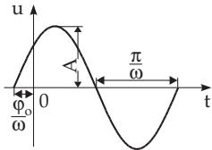  
Figure 2.39

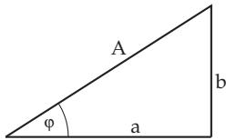  
Figure 2.40

The general sine curve difers from the simple sine curve y = sin x:

a) by the amplitude A, i.e., the greatest distance between its points and the time axis $t ,$

b) by the period $T = \frac { 2 \pi } { \omega }$ , which corresponds to the wavelength (with ω as the frequency ofthe oscillation, which is called the angular or radial frequency in wave theory),

c) by the initial phase or phase shift by the initial angle $\varphi \neq 0$

The quantity u(t) can also be written in the form

$$
u ( t ) = a \sin \omega t + b \cos \omega t .\tag{2.136}
$$

Here for a and $b A = { \sqrt { a ^ { 2 } + b ^ { 2 } } }$ and tan $\varphi = { \frac { b } { a } }$ holds. The quantities a, b, A and $\varphi$ can be represented as sides and angle of a right triangle (Fig. 2.40).

##### 2.7.3.2 Superposition of Oscillations

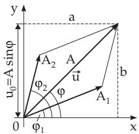

a)

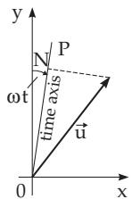  
b)

In the simplest case the superposition of oscillations is the addition oftwo oscillations with the same frequency. It results again in a harmonic oscillation with the same frequency:

$$
{ \begin{array} { r l } & { A _ { 1 } \sin ( \omega t { + } \varphi _ { 1 } ) { + } A _ { 2 } \sin ( \omega t { + } \varphi _ { 2 } ) = A \sin ( \omega t { + } \varphi ) } \\ & { \mathrm { w i t h } } \end{array} }\tag{2.137a}
$$

$$
A = \sqrt { { A _ { 1 } } ^ { 2 } + { A _ { 2 } } ^ { 2 } + 2 A _ { 1 } A _ { 2 } \cos ( \varphi _ { 2 } - \varphi _ { 1 } ) } ,\tag{2.137b}
$$

$$
\tan \varphi = \frac { A _ { 1 } \sin \varphi _ { 1 } + A _ { 2 } \sin \varphi _ { 2 } } { A _ { 1 } \cos \varphi _ { 1 } + A _ { 2 } \cos \varphi _ { 2 } } ,\tag{2.137c}
$$

Figure 2.41

where the quantities A and $\varphi$ can be determined by a vector diagram (Fig. 2.41a).

A linear combination of several sine functions with the same frequency is also possible and yields a general sine function (harmonic oscillation) with the same frequency:

$$
\sum _ { i } c _ { i } A _ { i } \sin ( \omega t + \varphi _ { i } ) = A \sin ( \omega t + \varphi ) .\tag{2.138}
$$

##### 2.7.3.3 Vector Diagram for Oscillations

The general sine function (2.135, 2.136) can be represented easily by the polar coordinates $\rho = A , \varphi$ and by the Cartesian coordinates $x = a , y = b$ (see 3.5.2.1, p. 190) in a plane. The sum of two such quantities then behaves as the sum of two summand vectors (Fig. 2.41a). Similarly the sum of several vectors results in a linear combination of several general sine functions. This representation is called a vector diagram.

The quantity u for a given time t can be determined from the vector diagram with the help of Fig. 2.41b: First the time axis $O P ( t )$ has to be put through the origin O, which rotates clockwise around O by a constant angular velocity $\omega$ . At start $t = 0$ the axes y and t coincide. Then at any time t the projection ON of the vector u onto the time axis is equal to the absolute value of the general sine function $u = A \sin ( \omega t + \varphi )$ . For time $t = 0$ the value $u _ { 0 } = A$ sin $\varphi$ is the projection onto the y-axis (Fig. 2.41b).

##### 2.7.3.4 Damping of Oscillations

The function $u ( t ) = A e ^ { - a t } \sin ( \omega t + \varphi _ { 0 } ) \quad ( a , t > 0 )$

(2.139)

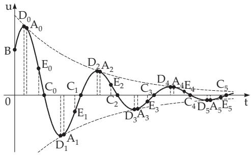  
Figure 2.42

yields the curve of a damped oscillation (Fig. 2.42).

The oscillation proceeds along the t-axis, while the curve asymptotically approaches the t-axis. The sine curve is enclosed by the exponential curves $u ( t ) ~ = ~ \pm A e ^ { - a t }$ , and it contacts them in the points

$$
A _ { 0 } , A _ { 1 } , A _ { 2 } , \ldots , A _ { k } = \left( { \frac { \left( k + { \frac { 1 } { 2 } } \right) \pi - \varphi _ { 0 } } { \omega } } , \right.
$$

$$
( - 1 ) ^ { k } A \exp \left( - a \frac { \left( k + \displaystyle \frac { 1 } { 2 } \right) \pi - \varphi _ { 0 } } { \omega } \right) \mathrm { . }
$$

The intersection points with the coordinate axes are $B = ( 0 , A \sin \varphi _ { 0 } ) , C _ { 0 } , C _ { 1 } , C _ { 2 } , \ldots , C _ { k } =$

$\left( \frac { k \pi - \varphi _ { 0 } } { \omega } , 0 \right)$ . The extrema $D _ { 0 } , D _ { 1 } , D _ { 2 } , . . .$ . are at $t _ { k } = \frac { k \pi - \varphi _ { 0 } + \alpha } { \omega }$ ; and the inflection points $E _ { 0 } , E _ { 1 }$ $E _ { 2 } , . . .$ . are at $t _ { k } = \frac { k \pi - \varphi _ { 0 } + 2 \alpha } { \omega }$ with tan $\alpha = { \frac { \omega } { a } }$

The logarithmic decrement of the damping is $\delta = \ln \left| { \frac { y _ { i } } { y _ { i + 1 } } } \right| = a { \frac { \pi } { \omega } }$ , where $y _ { i }$ and $y _ { i + 1 }$ are the ordinates of two consecutive extrema.
