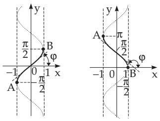
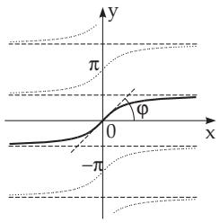
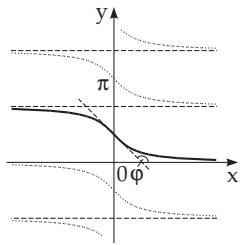
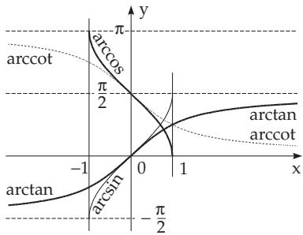

### 2.8 Cyclometric or Inverse Trigonometric Functions

The cyclometric functions or arcus functions are the inverses of the trigonometric functions. For a unequivocal definition the domain of the trigonometric functions is to be decomposed into monotony intervals, to get an inverse function for every monotony interval. So, there are infinitely many such intervals, and for each its inverse is to be defined. In order to distinguish them an index k is to be assigned according to the corresponding interval. Obviously the trigonometric inverse functions are monotony in these intervals.

#### 2.8.1 Definition ofthe Inverse Trigonometric Functions

How to define the inverse trigonometric functions will be shown here for the inverse of the sin function (Fig. 2.43). The usual notation for it is arcsin x . The domain of $y = \sin x$ will be split into monotony

  
Figure 2.44

  
Figure 2.43  
Figure 2.45

  
Figure 2.46

intervals kπ $- \frac { \pi } { 2 } \leq x \leq k \pi + \frac { \pi } { 2 }$ with $k = 0 , \pm 1 , \pm 2 , . . .$ . Reflecting the curve of $y = \sin x$ in the line y = x yields the curve of the inverse function

$$
y = \operatorname { a r c } _ { k } \sin x\tag{2.140a}
$$

with the domains and ranges

$$
- 1 \leq x \leq + 1 \quad { \mathrm { a n d } } \quad k \pi - { \frac { \pi } { 2 } } \leq y \leq k \pi + { \frac { \pi } { 2 } } , \quad { \mathrm { w h e r e } } \quad k = 0 , \pm 1 , \pm 2 , \ldots .\tag{2.140b}
$$

The form $y = \operatorname { a r c } _ { k }$ sin x has the same meaning as $x = \sin y$

Similarly, one can get the other inverse trigonometric functions which are represented in Fig. 2.44– 2.46. The domains and ranges of the inverse functions can be found in Table 2.6.

#### 2.8.2 Reduction to the Principal Value

In their domain the arcus functions have the so-called principal values for $k = 0$ , written usually without an index, g.e., as arcsin $x \equiv \mathrm { a r c _ { 0 } }$ sin x. In Fig. 2.47 the principal values of the inverse functions are presented. The values of the diferent inverses can be calculated from the principal values by the following formulas: arc sin $x = k \pi + ( - 1 ) ^ { k }$ arcsin x. (2.141)

$$
\operatorname { a r c } _ { k } \cos x = { \left\{ \begin{array} { l l } { ( k + 1 ) \pi - \operatorname { a r c c o s } x } & { ( k { \mathrm { ~ o d d } } ) , } \\ { k \pi + \operatorname { a r c c o s } x } & { ( k { \mathrm { ~ e v e n } } ) . } \end{array} \right. }
$$

(2.142)

Figure 2.47

arc tan $x = k \pi + \arctan x$

(2.143)

arc cot x = kπ + arccot x.

(2.144)

A: arcsin 0 = 0 , arc sin $0 = k \pi$

B: arccot $1 = { \frac { \pi } { 4 } } , \operatorname { a r c } _ { k } \cot 1 = { \frac { \pi } { 4 } } + k \pi .$

${ \frac { 1 } { 2 } } = { \frac { \pi } { 3 } }$ 1 π C: arccos , arc cos 2 = + (k + 1)π for odd k, 3 = π + kπ for even k.

Remark: Calculators give the principal values of the trigonometric inverses.

Table 2.6 Domains and ranges of the inverses of trigonometric functions
<table><tr><td>Inverse function</td><td>Domain</td><td>Range</td><td>Trigonometric function with the same meaning</td></tr><tr><td> $\left. \begin{array} { l } { \operatorname { a r c } \operatorname { s i n e } } \\ { y = \operatorname { a r c } _ { k } \sin x } \end{array} \right\}$ </td><td>−1 ≤ x ≤ 1</td><td> $k \pi - { \frac { \pi } { 2 } } \leq y \leq k \pi + { \frac { \pi } { 2 } }$ </td><td>x = sin y</td></tr><tr><td> $\left. \begin{array} { l } { \operatorname { a r c } \operatorname { c o s i n e } } \\ { y = \operatorname { a r c } _ { k } \cos x } \end{array} \right\}$ </td><td> $- 1 \leq x \leq 1$ </td><td>kπ ≤ y ≤ (k + 1)π</td><td>x = cos y</td></tr><tr><td> $\left. \begin{array} { l } { \operatorname { a r c } \operatorname { t a n g e n t } } \\ { y = \operatorname { a r c } _ { k } \tan x } \end{array} \right\}$ </td><td>−∞ &lt; x &lt;∞</td><td> $k \pi - \frac { \pi } { 2 } < y < k \pi + \frac { \pi } { 2 }$ </td><td>x = tan y</td></tr><tr><td> $ \begin{array} { l l } { { \mathrm { a r c ~ c o t a n g e n t } } } &  { \} } \\ { y = \operatorname { a r c } _ { k } \cot x } & { { } } \end{array} \}$ </td><td>−∞&lt;x&lt;∞</td><td>kπ &lt; y &lt; (k + 1)π</td><td>x = cot y</td></tr><tr><td colspan="4"> $k = 0 , \pm 1 , \pm 2 , \ldots .$  For  $k = 0$  one gets the principal value of the inverse functions, which is usually written without an index, e.g., arcsin x ≡ arc0 sin x.</td></tr></table>

#### 2.8.3 Relations Between the Principal Values

$$
\arcsin x = { \frac { \pi } { 2 } } - \operatorname { a r c c o s } x = \arctan { \frac { x } { \sqrt { 1 - x ^ { 2 } } } } = { \left\{ \begin{array} { l l } { - \operatorname { a r c c o s } { \sqrt { 1 - x ^ { 2 } } } } & { ( - 1 \leq x \leq 0 ) , } \\ { \operatorname { a r c c o s } { \sqrt { 1 - x ^ { 2 } } } } & { ( 0 \leq x \leq 1 ) . } \end{array} \right. }\tag{2.145}
$$

$$
\operatorname { a r c c o s } x = { \frac { \pi } { 2 } } - \arcsin x = \operatorname { a r c c o t } { \frac { x } { \sqrt { 1 - x ^ { 2 } } } } = { \left\{ \begin{array} { l l } { \pi - \arcsin { \sqrt { 1 - x ^ { 2 } } } } & { ( \pi - 1 \leq x \leq 0 ) , } \\ { \arcsin { \sqrt { 1 - x ^ { 2 } } } } & { ( 0 \leq x \leq 1 ) . } \end{array} \right. }\tag{2.146}
$$

$$
\arctan x = { \frac { \pi } { 2 } } - \operatorname { a r c c o t } x = \arcsin { \frac { x } { \sqrt { 1 + x ^ { 2 } } } } .\tag{2.147}
$$

$$
\arctan x = { \left\{ \begin{array} { l l l } { \operatorname { a r c c o t } { \frac { 1 } { x } } - \pi } & { ( x < 0 ) } \\ { \operatorname { a r c c o t } { \frac { 1 } { x } } } & { ( x > 0 ) } \end{array} \right. } = { \left\{ \begin{array} { l l l } { - \operatorname { a r c c o s } { \frac { 1 } { \sqrt { 1 + x ^ { 2 } } } } } & { ( x \leq 0 ) , } \\ { \operatorname { a r c c o s } { \frac { 1 } { \sqrt { 1 + x ^ { 2 } } } } } & { ( x \geq 0 ) . } \end{array} \right. }\tag{2.148}
$$

$$
\operatorname { a r c c o t } x = { \frac { \pi } { 2 } } - \arctan x = \operatorname { a r c c o s } { \frac { x } { \sqrt { 1 + x ^ { 2 } } } } .\tag{2.149}
$$

$$
\operatorname { a r c c o t } x = { \left\{ \begin{array} { l l } { \arctan { \frac { 1 } { x } } + \pi } & { ( x < 0 ) } \\ { \arctan { \frac { 1 } { x } } } & { ( x > 0 ) } \end{array} \right. } = { \left\{ \begin{array} { l l } { \pi - \arcsin { \frac { 1 } { \sqrt { 1 + x ^ { 2 } } } } } & { ( x \leq 0 ) , } \\ { \arcsin { \frac { 1 } { \sqrt { 1 + x ^ { 2 } } } } } & { ( x \geq 0 ) . } \end{array} \right. }\tag{2.150}
$$

#### 2.8.4 Formulas for Negative Arguments

$$
\arcsin ( - x ) = - \arcsin x .
$$

(2.151)

$$
\operatorname { a r c c o s } ( - x ) = \pi - \operatorname { a r c c o s } x .\tag{2.153}
$$

$$
\arctan ( - x ) = - \arctan x .
$$

(2.152)

$$
\operatorname { a r c c o t } ( - x ) = \pi - \operatorname { a r c c o t } x .\tag{2.154}
$$

#### 2.8.5 Sum and Difference of arcsin x and arcsin y

$$
\arcsin x + \arcsin y = \arcsin \left( x { \sqrt { 1 - y ^ { 2 } } } + y { \sqrt { 1 - x ^ { 2 } } } \right) \quad ( x y \leq 0 { \mathrm { ~ o r ~ } } x ^ { 2 } + y ^ { 2 } \leq 1 ) ,\tag{2.155a}
$$

$$
= \pi - \arcsin \left( x { \sqrt { 1 - y ^ { 2 } } } + y { \sqrt { 1 - x ^ { 2 } } } \right) \quad ( x > 0 , y > 0 , \ x ^ { 2 } + y ^ { 2 } > 1 ) ,\tag{2.155b}
$$

$$
= - \pi - \arcsin \left( x { \sqrt { 1 - y ^ { 2 } } } + y { \sqrt { 1 - x ^ { 2 } } } \right) \quad ( x < 0 , y < 0 , \ x ^ { 2 } + y ^ { 2 } > 1 ) .\tag{2.155c}
$$

$$
\arcsin x - \arcsin y = \arcsin \left( x { \sqrt { 1 - y ^ { 2 } } } - y { \sqrt { 1 - x ^ { 2 } } } \right) \quad ( x y \geq 0 { \mathrm { ~ o r ~ } } x ^ { 2 } + y ^ { 2 } \leq 1 ) ,\tag{2.156a}
$$

$$
= \pi - \arcsin \left( x { \sqrt { 1 - y ^ { 2 } } } - y { \sqrt { 1 - x ^ { 2 } } } \right) \quad ( x > 0 , y < 0 , \ x ^ { 2 } + y ^ { 2 } > 1 ) ,\tag{2.156b}
$$

$$
= - \pi - \arcsin \left( x { \sqrt { 1 - y ^ { 2 } } } - y { \sqrt { 1 - x ^ { 2 } } } \right) \quad ( x < 0 , y > 0 , \ x ^ { 2 } + y ^ { 2 } > 1 ) .\tag{2.156c}
$$

#### 2.8.6 Sum and Difference of arcos x and arcos y

$$
\operatorname { a r c c o s } x + \operatorname { a r c c o s } y = \operatorname { a r c c o s } \left( x y - { \sqrt { 1 - x ^ { 2 } } } { \sqrt { 1 - y ^ { 2 } } } \right) \quad ( x + y \geq 0 ) ,\tag{2.157a}
$$

$$
= 2 \pi - \operatorname { a r c c o s } \left( x y - { \sqrt { 1 - x ^ { 2 } } } { \sqrt { 1 - y ^ { 2 } } } \right) \quad ( x + y < 0 ) .\tag{2.157b}
$$

$$
\operatorname { a r c c o s } x - \operatorname { a r c c o s } y = - \operatorname { a r c c o s } \left( x y + { \sqrt { 1 - x ^ { 2 } } } { \sqrt { 1 - y ^ { 2 } } } \right) \quad ( x \geq y ) ,\tag{2.158a}
$$

$$
= \operatorname { a r c c o s } \left( x y + { \sqrt { 1 - x ^ { 2 } } } { \sqrt { 1 - y ^ { 2 } } } \right) \quad ( x < y ) .\tag{2.158b}
$$

#### 2.8.7 Sum and Difference of arctan x and arctan y

$$
\arctan { x } + \arctan { y } = \arctan \frac { x + y } { 1 - x y } \quad ( x y < 1 ) ,\tag{2.159a}
$$

$$
= \pi + \arctan { \frac { x + y } { 1 - x y } } \quad ( x > 0 , x y > 1 ) ,\tag{2.159b}
$$

$$
= - \pi + \arctan \frac { x + y } { 1 - x y } \quad ( x < 0 , x y > 1 ) .\tag{2.159c}
$$

$$
\arctan x - \arctan y = \arctan { \frac { x - y } { 1 + x y } } \quad ( x y > - 1 ) ,\tag{2.160a}
$$

$$
= \pi + \arctan { \frac { x - y } { 1 + x y } } \quad ( x > 0 , x y < - 1 ) ,\tag{2.160b}
$$

$$
= - \pi + \arctan \frac { x - y } { 1 + x y } \quad ( x < 0 , x y < - 1 ) .\tag{2.160c}
$$

#### 2.8.8 Special Relations for arcsin x, arccos x, arctan x

$$
2 \arcsin x = \arcsin \left( 2 x { \sqrt { 1 - x ^ { 2 } } } \right) \quad \left( | x | \leq { \frac { 1 } { \sqrt { 2 } } } \right) ,\tag{2.161a}
$$

$$
= \pi - \arcsin \left( 2 x \sqrt { 1 - x ^ { 2 } } \right) \quad \left( \frac { 1 } { \sqrt { 2 } } < x \leq 1 \right) ,\tag{2.161b}
$$

$$
= - \pi - \arcsin \left( 2 x { \sqrt { 1 - x ^ { 2 } } } \right) \quad \left( - 1 \leq x < - { \frac { 1 } { \sqrt { 2 } } } \right) .\tag{2.161c}
$$

$$
2 \operatorname { a r c c o s } x = \operatorname { a r c c o s } ( 2 x ^ { 2 } - 1 ) \quad ( 0 \leq x \leq 1 ) ,\tag{2.162a}
$$

$$
= 2 \pi - \operatorname { a r c c o s } ( 2 x ^ { 2 } - 1 ) \quad ( - 1 \leq x < 0 ) .\tag{2.162b}
$$

$$
2 \arctan x = \arctan { \frac { 2 x } { 1 - x ^ { 2 } } } \quad ( | x | < 1 ) ,\tag{2.163a}
$$

$$
= \pi + \arctan { \frac { 2 x } { 1 - x ^ { 2 } } } \quad ( x > 1 ) ,\tag{2.163b}
$$

$$
= - \pi + \arctan { \frac { 2 x } { 1 - x ^ { 2 } } } \quad ( x < - 1 ) .\tag{2.163c}
$$

$$
\cos ( n \operatorname { a r c c o s } x ) = T _ { n } ( x ) \quad ( n \geq 1 ) ,\tag{2.164}
$$

where $n \geq 1$ can also be a fractional number and $T _ { n } ( x )$ is given by the equation

$$
T _ { n } ( x ) = { \frac { \left( x + { \sqrt { x ^ { 2 } - 1 } } \right) ^ { n } + \left( x - { \sqrt { x ^ { 2 } - 1 } } \right) ^ { n } } { 2 } } .\tag{2.165}
$$

For any integer $n , T _ { n } ( x )$ is a polynomial of x (a Chebyshev polynomial). To study the properties of the Chebyshev polynomials see 19.6.3, p. 988.
