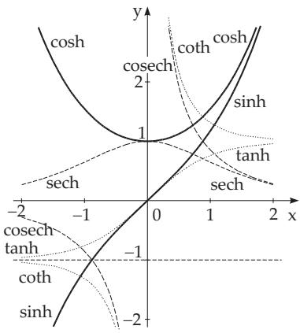
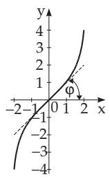
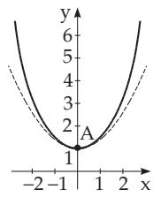
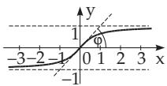
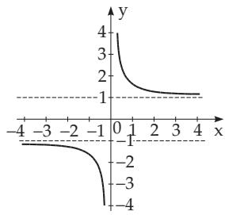

### 2.9 Hyperbolic Functions

#### 2.9.1 Definition of Hyperbolic Functions

Hyperbolic sine, hyperbolic cosine and hyperbolic tangent are defined by the following formulas:

$$
\sinh x = { \frac { e ^ { x } - e ^ { - x } } { 2 } } ,\tag{2.166}
$$

$$
\cosh x = { \frac { e ^ { x } + e ^ { - x } } { 2 } } ,\tag{2.167}
$$

$$
\operatorname { t a n h } x = { \frac { e ^ { x } - e ^ { - x } } { e ^ { x } + e ^ { - x } } } .\tag{2.168}
$$

The geometric definition (see 3.1.2.2, p. 132), is an analogy to the trigonometric functions. The geometric definition (see 3.1.2.2, p. 132), is an analogy to the trigonometric functions.

Hyperbolic cotangent, hyperbolic secant and hyperbolic cosecant are defined as reciprocal values of the above hyperbolic functions:

$$
\coth x = { \frac { 1 } { \operatorname { t a n h } x } } = { \frac { e ^ { x } + e ^ { - x } } { e ^ { x } - e ^ { - x } } } ,\tag{2.169}
$$

$$
\operatorname { s e c h } x = { \frac { 1 } { \cosh x } } = { \frac { 2 } { e ^ { x } + e ^ { - x } } } ,\tag{2.170}
$$

$$
\operatorname { c o s e c h } x = { \frac { 1 } { \sinh x } } = { \frac { 2 } { e ^ { x } - e ^ { - x } } } .\tag{2.171}
$$

The shapes of curves of hyperbolic functions are shown in Fig. 2.48–2.52.

#### 2.9.2 Graphical Representation of the Hyperbolic Functions

##### 2.9.2.1 Hyperbolic Sine

y = sinh x (2.166) is an odd strictly monotone increasing function between and $+ \infty$ (Fig. 2.49). The origin is its symmetry center, the inflection point, and here the angle of slope of the tangent line is $\varphi = \frac { \pi } { 4 }$ . There is no asymptote.

##### 2.9.2.2 Hyperbolic Cosine

y = cosh x (2.167) is an even function, it is strictly monotone decreasing for $x < 0$ from + to 1, and for $x > 0$ it is strictly monotone increasing from 1 until + (Fig. 2.50). The minimum is at $x = 0$

  
Figure 2.48

  
Figure 2.49

  
Figure 2.50

and it is equal to 1 (point A(0, 1)); it has no asymptote. The curve is symmetric with respect to the y-axis and it always stays above the curve of the quadratic parabola $y = 1 + { \frac { x ^ { 2 } } { 2 } }$ (the broken-line curve). Because the function demonstrates a catenary curve, the curve is called the catenoid (see 2.15.1, p. 107).

##### 2.9.2.3 Hyperbolic Tangent

y = tanh x (2.168) is an odd function, for $- \infty < x < + \infty$ strictly monotone increasing from 1 to +1 (Fig. 2.51). The origin is the center of symmetry, and the inflection point, and here the angle of slope of the tangent line is $\varphi = \frac { \pi } { 4 }$ . The asymptotes are the lines $y = \pm 1$

  
Figure 2.51

  
Figure 2.52

##### 2.9.2.4 Hyperbolic Cotangent

y = coth x (2.169) is an odd function which is not continuous at $x = 0 \ ( \mathbf { F i g . 2 . 5 2 } )$ . It is strictly monotone decreasing in the interval $- \infty < x < 0$ and it takes its values from 1 until ; in the interval $0 < x < + \infty$ it is also strictly monotone decreasing with values from + to +1 . It has no

inflection point, no extreme value. The asymptotes are the lines $x = 0$ and $y = \pm 1$

#### 2.9.3 Important Formulas for the Hyperbolic Functions

There are similar relations between the hyperbolic functions as between trigonometric functions. The validity of the following formulas can be shown directly from the definitions of hyperbolic functions, or considering the definitions and relations of these functions also for complex arguments, from (2.199)– (2.206), they can be calculated from the formulas known for trigonometric functions.

##### 2.9.3.1 Hyperbolic Functions of One Variable

$$
\cosh ^ { 2 } x - \sinh ^ { 2 } x = 1 ,
$$

$$
( 2 . 1 7 2 ) \qquad \coth ^ { 2 } x - \cosh ^ { 2 } x = 1 ,\tag{2.173}
$$

$$
\operatorname { s e c h } ^ { 2 } x + \operatorname { t a n h } ^ { 2 } x = 1 ,
$$

$$
( 2 . 1 7 4 ) \qquad \operatorname { t a n h } x \cdot \coth x = 1 ,\tag{2.175}
$$

$$
{ \frac { \sinh x } { \cosh x } } = \operatorname { t a n h } x ,
$$

(2.176)

$$
{ \frac { \cosh x } { \sinh x } } = \coth x .\tag{2.177}
$$

##### 2.9.3.2 Expressing a Hyperbolic Function by Another One with the Same Argument

The corresponding formulas are collected in Table 2.7.

##### 2.9.3.3 Formulas for Negative Arguments

$$
\begin{array} { l } { \sinh ( - x ) = - \sinh x , } \\ { \operatorname { t a n h } ( - x ) = - \operatorname { t a n h } x , } \end{array}\tag{2.178}
$$

$$
\cosh ( - x ) = \cosh x ,\tag{2.179}
$$

$$
\coth ( - x ) = - \coth x .\tag{2.180}
$$

(2.181)

Table 2.7 Relations between two hyperbolic functions with the same arguments for $x > 0$
<table><tr><td></td><td>sinh x</td><td>cosh x</td><td>tanh x</td><td>coth x</td></tr><tr><td>sinh x</td><td></td><td rowspan="3"> $\sqrt { \cosh ^ { 2 } x - 1 }$   $\frac { \sqrt { \cosh ^ { 2 } x - 1 } } { \cosh x }$ </td><td>tanh x  $\overline { { \sqrt { 1 - \operatorname { t a n h } ^ { 2 } x } } }$ </td><td>1  $\sqrt { \coth ^ { 2 } x - 1 }$ </td></tr><tr><td>cosh x</td><td> $\sqrt { \sinh ^ { 2 } x + 1 }$ </td><td>1  $\sqrt { 1 - \operatorname { t a n h } ^ { 2 } x }$ </td><td>coth x  $\sqrt { \coth ^ { 2 } x - 1 }$ </td></tr><tr><td>tanh x</td><td> $\frac { \sinh x } { \sqrt { \sinh ^ { 2 } x + 1 } }$ </td><td></td><td> $\frac { 1 } { \coth x }$ </td></tr><tr><td rowspan="2">coth x</td><td rowspan="2"> $\sqrt { \sinh ^ { 2 } x + 1 }$  sinh x</td><td rowspan="2">cosh x  $\sqrt { \cosh ^ { 2 } x - 1 }$ </td><td rowspan="2"> $\frac { 1 } { \operatorname { t a n h } x }$ </td><td></td></tr><tr><td></td></tr></table>

##### 2.9.3.4 Hyperbolic Functions of the Sum and Difference of Two Arguments (Addition Theorems)

$$
\sinh ( x \pm y ) = \sinh x \cosh y \pm \cosh x \sinh y ,\tag{2.182}
$$

$$
\cosh ( x \pm y ) = \cosh x \cosh y \pm \sinh x \sinh y ,\tag{2.183}
$$

(2.186)

$$
\operatorname { t a n h } ( x \pm y ) = { \frac { \operatorname { t a n h } x \pm \operatorname { t a n h } y } { 1 \pm \operatorname { t a n h } x \operatorname { t a n h } y } } , \quad ( 2 . 1 8 4 ) \coth ( x \pm y ) = { \frac { 1 \pm \coth x \coth y } { \coth x \pm \coth y } } .\tag{2.185}
$$

##### 2.9.3.5 Hyperbolic Functions of Double Arguments

$$
\sinh 2 x = 2 \sinh x \cosh x ,
$$

$$
\operatorname { t a n h } 2 x = \frac { 2 \operatorname { t a n h } x } { 1 + \operatorname { t a n h } ^ { 2 } x } ,\tag{2.188}
$$

$$
\cosh 2 x = \sinh ^ { 2 } x + \cosh ^ { 2 } x ,
$$

(2.187)

$$
\coth 2 x = \frac { 1 + \coth ^ { 2 } x } { 2 \coth x } .\tag{2.189}
$$

##### 2.9.3.6 De Moivre Formula for Hyperbolic Functions

$$
( \cosh x \pm \sinh x ) ^ { n } = \left( e ^ { \pm x } \right) ^ { n } = e ^ { \pm n x } = \cosh n x \pm \sinh n x .\tag{2.190}
$$

##### 2.9.3.7 Hyperbolic Functions of Half-Argument

$$
\sinh { \frac { x } { 2 } } = \pm \sqrt { { \frac { 1 } { 2 } } ( \cosh x - 1 ) } ,
$$

(2.191)

$$
\cosh { \frac { x } { 2 } } = { \sqrt { { \frac { 1 } { 2 } } ( \cosh x + 1 ) } } ,\tag{2.192}
$$

The sign of the square root in (2.191) is positive for $x > 0$ and negative for $x < 0$

$$
\operatorname { t a n h } { \frac { x } { 2 } } = { \frac { \cosh x - 1 } { \sinh x } } = { \frac { \sinh x } { \cosh x + 1 } } , ( 2 . 1 9 3 ) \coth { \frac { x } { 2 } } = { \frac { \sinh x } { \cosh x - 1 } } = { \frac { \cosh x + 1 } { \sinh x } } .\tag{2.194}
$$

##### 2.9.3.8 Sum and Difference of Hyperbolic Functions

$$
\sinh x \pm \sinh y = 2 \sinh \frac { x \pm y } { 2 } \cosh \frac { x \mp y } { 2 } ,\tag{2.195}
$$

$$
\cosh x + \cosh y = 2 \cosh { \frac { x + y } { 2 } } \cosh { \frac { x - y } { 2 } } ,\tag{2.196}
$$

$$
\cosh x - \cosh y = 2 \sinh { \frac { x + y } { 2 } } \sinh { \frac { x - y } { 2 } } ,\tag{2.197}
$$

$$
\operatorname { t a n h } x \pm \operatorname { t a n h } y = { \frac { \sinh ( x \pm y ) } { \cosh x \cosh y } } .\tag{2.198}
$$

##### 2.9.3.9 Relation Between Hyperbolic and Trigonometric Functions with Complex Arguments z

$$
\sin z = - { \mathrm { i } } \sinh { \mathrm { i } } z ,
$$

$$
( 2 . 1 9 9 ) \qquad \sinh { z } = - \mathrm { i } \sin { \mathrm { i } z } ,\tag{2.203}
$$

$$
\cos z = \cosh { \mathrm { i } z } ,
$$

$$
( 2 . 2 0 0 ) \qquad \cosh z = \cos { \mathrm { i } z } ,\tag{2.204}
$$

$$
\tan z = - \mathrm { i } \operatorname { t a n h i } z ,
$$

$$
( 2 . 2 0 1 ) \qquad \operatorname { t a n h } z = - \mathrm { i } \tan { \mathrm { i } z } ,\tag{2.205}
$$

$$
\cot z = { \mathrm { i } } \coth { \mathrm { i } } z ,
$$

$$
( 2 . 2 0 2 ) \qquad \coth z = \mathrm { i } \cot \mathrm { i } z .\tag{2.206}
$$

Every relation between hyperbolic functions, which contains x or ax but not ax+b, can be derived from the corresponding trigonometric relation with the substitution i sinh x for sin α and cosh x for cos α.

$$
\mathbf { A } \colon \cos ^ { 2 } \alpha + \sin ^ { 2 } \alpha = 1 , \cosh ^ { 2 } x + \mathrm { i } ^ { 2 } \sinh ^ { 2 } x = 1 { \mathrm { ~ o r ~ } } \cosh ^ { 2 } x - \sinh ^ { 2 } x = 1 .
$$

B: sin 2α = 2 sin α cos α, i sinh 2x = 2i sinh x cosh x or sinh 2x = 2 sinh x cosh x.
