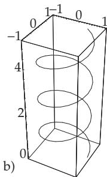

Similarly to the two-dimensional case, three-dimensional graphics can be generated by applying diferent options. The objects can be represented and observed from diferent viewpoints and from diferent perspectives. Also the representation of curved surfaces in three-dimensional space, i.e., the graphical representation of functions of two variables, is possible. Furthermore it is possible to represent curves in three-dimensional space, e.g., if they are given in parametric form. For a detailed description of three-dimensional graphics primitives see [20.5], [20.16]. The introduction of these representations is similar to the two-dimensional case.

20.4.7.1 Graphical Representation of Surfaces

The command Plot3D in its basic form requires the definition of a function of two variables and the domain of these two variables:

$$
\mathtt { P l o t 3 D } [ \mathtt { f } [ x , y ] , \{ x , x _ { a } , x _ { e } \} , \{ y , y _ { a } , y _ { e } \} ]\tag{20.46}
$$

All options have the default setting.

For the function $z = x ^ { 2 } + y ^ { 2 }$ , with the input

$$
I n [ t ] : = \mathbb { P } \mathrm { 1 o t 3 D } [ x ^ { 2 } + y ^ { 2 } , \{ x , - 5 , 5 \} , \{ y , - 5 , 5 \} , \mathbb { P } \mathrm { 1 o t R a n g e } \to \{ 0 , 2 5 \} ]
$$

we get Fig. 20.8a, while Fig. 20.8b is generated by the command

$$
I n [ 2 J : = \mathbb { P } \mathsf { I o t } 3 \mathsf { D } [ ( 1 - \mathbb { S } \mathsf { i n } [ x ] ) ( 2 - \mathsf { C o s } [ 2 \ y ] ) , \{ x , - 2 , 2 \} , \{ y , - 2 , 2 \} ]
$$

For the paraboloid, the option PlotRange is given with the required z values, because the solid is cut at $z = 2 5$

20.4.7.2 Options for 3D Graphics

The number of options for 3D graphics is large. In Table 20.17, only a few are enumerated, where options known from 2D graphics are not included. They can be applied in a similar sense. The option ViewPoint has special importance, by which very diferent observational perspectives can be chosen.

  
Figure 20.8

20.4.7.3 Three-Dimensional Objects in Parametric Representation

Similarly to 2D graphics, three-dimensional objects given in parametric representation can also be represented. With

$$
\mathrm { P a r a m e t r i c P l o t 3 D } [ \{ f _ { x } [ t , u ] , f _ { y } [ t , u ] , f _ { z } [ t , u ] \} , \{ t , t _ { a } , t _ { e } \} , \{ u , u _ { a } , u _ { e } \} ]\tag{20.47}
$$

a parametrically given surface is represented, with

$$
\mathtt { P a r a m e t r i c P l o t 3 D } [ \{ f _ { x } [ t ] , f _ { y } [ t ] , f _ { z } [ t ] \} , \{ t , t _ { a } , t _ { e } \} ]\tag{20.48}
$$

a three-dimensional curve is generated parametrically.

Table 20.17 Options for 3D graphics
<table><tr><td>Boxed ViewPoint</td><td>default setting is True; it draws a three-dimensional frame around the surface HiddenSurface sets the non-transparency of the surface; default setting is True specifies the point  $( x , y , z )$  in space, from where the surface is observed. De- fault values are  $\{ 1 . 3 , - 2 . 4 , 2 \}$ </td></tr></table>


  
Figure 20.9

The objects in Fig. 20.9a and Fig. 20.9b are represented with the commands

$$
\begin{array} { r l } & { T n [ 3 ] : = \mathtt { P a r a m e t r i c P l o t 3 D } [ \{ \mathsf { C o s } [ t ] \mathsf { C o s } [ u ] , \mathsf { S i n } [ t ] \mathsf { C o s } [ u ] , \mathsf { S i n } [ u ] \} , \{ t , 0 , 2 \mathsf { P i } \} } \\ & { \qquad \{ u , - \mathsf { P i } / 2 , \mathsf { P i } / 2 \} ] } \end{array}\tag{20.49a}
$$

$$
I n [ 4 ] : = { \mathrm { P a r a m e t r i c P l o t 3 D } } [ \{ \complement \complement [ t ] , \ S \bot \setminus [ t ] , t / 4 \} , \{ t , 0 , 2 0 \} ]\tag{20.49b}
$$

Mathematica provides further commands by which density, and contour diagrams, bar charts and sector diagrams, and also a combination of diferent types of diagrams, can be generated.

The representation of the Lorenz attractor (see 17.2.4.3, p. 887) can easily be generated by Mathematica.

There is a series of recent developments most of which are not to be shown in a book. One can easily build a GUI (graphical user interface) to utilize interactive properties of the program. Most of the calculations are parallelized automatically, but functions such as Parallelize and ParallelMap provides the user to create his/her own parallel programs. The extremely fast graphic cards can be programmed at a very high level (as opposed to other languages) using such functions as CUDALink, OpenCLFunctionLoad etc. An extremely useful example of dynamic interactivity tool is Manipulate which in the simplest case shows you the parameter dependence of a family of curves. Working in the cloud or using the computer Raspberry Pi (which comes a free Mathematica license) should also not be unmentioned.

21 Tables

21.1 Frequently Used Mathematical Constants

<table><tr><td rowspan=1 colspan=1>πeC</td><td rowspan=1 colspan=1>3,141592654... $2 , 7 1 8 2 8 1 8 2 8 \ldots$  $0 . 5 7 7 2 1 5 6 6 5 \ldots$ </td><td rowspan=1 colspan=1>Ludolf constant $( \pi )$ Euler constant $( e )$ Euler constant (C)</td><td rowspan=1 colspan=1> $1 \%$  $1 \textdegree \_ \_$  $\sqrt { 2 }$ </td><td rowspan=1 colspan=1>0,010,0011,4142136...</td><td rowspan=1 colspan=1>percentper mil</td></tr><tr><td rowspan=1 colspan=1> $\lg e = M$ lg2</td><td rowspan=1 colspan=1> $0 , 4 3 4 2 9 4 4 8 2 \ldots$  $0 { , } 3 0 1 0 3 0 . . .$ </td><td rowspan=1 colspan=1>ln 10 = M−1 = 2,302585093 . . . $\ln 2 = 0 , 6 9 3 1 4 7 2 . . .$ </td><td rowspan=1 colspan=1> $\sqrt { 3 }$  $\sqrt { 1 0 }$ </td><td rowspan=1 colspan=1> $1 , 7 3 2 0 5 0 8 . . .$  $3 , 1 6 2 2 7 7 7 \ldots$ </td><td rowspan=1 colspan=1></td></tr></table>

21.2 Important Natural Constants

This table contains values of constants, recommended in [21.19], [21.20], [21.21]. In parenthesis is given the standard uncertainty of the last two digits. The note (fixed) indicates that this value is fixed by definition.

Fundamental constants   
Avogadro constant $\begin{array} { r l } { \overline { { N _ { \mathrm { A } } } } } & { { } = 6 , 0 2 2 1 4 1 2 9 ( 2 7 ) { \cdot } 1 0 ^ { 2 3 } / \mathrm { m o l } } \end{array}$   
velocity of light in vacuum $\begin{array} { r l r } { c _ { 0 } } & { { } } & { = 2 9 9 7 9 2 4 5 8 \mathrm { m / s } ( \mathrm { f i x e d } ) } \end{array}$   
gravitation constant $\begin{array} { r l } { G } & { { } = 6 , 6 7 3 8 4 ( 8 0 ) { \cdot } 1 0 ^ { - 1 1 } \mathrm { m } ^ { 3 } / ( \mathrm { k g } \mathrm { s } ^ { 2 } ) } \end{array}$   
fundamental electric charge $e$ $= 1 , 6 0 2 1 7 6 5 6 5 ( 3 5 ) { \cdot } 1 0 ^ { - 1 9 } \mathrm { C }$   
fine structure constant $\begin{array} { r l r } { \alpha } & { { } } & { = \mu _ { 0 } c _ { 0 } e ^ { 2 } / ( 2 h ) = 7 , 2 9 7 3 5 2 5 6 9 8 ( 2 4 ) \cdot 1 0 ^ { - 3 } } \end{array}$   
Sommerfeld constant $\begin{array} { r l } { \alpha ^ { - 1 } } & { { } = 1 3 7 , 0 3 5 9 9 9 0 7 4 ( 4 4 ) } \end{array}$   
Planck constant $\begin{array} { r l r } { h } & { { } } & { = 6 { , } 6 2 6 0 6 9 5 7 ( 2 9 ) { \cdot } 1 0 ^ { - 3 4 } \mathrm { J s } = 4 { , } 1 3 5 6 6 7 5 1 6 ( 9 1 ) { \cdot } 1 0 ^ { - 1 5 } \mathrm { e V s } } \end{array}$   
Planck quantum $h / ( 2 \pi )$ $\hbar$ $= 1 , 0 5 4 5 7 1 7 2 \dot { 6 } ( 4 7 ) { \cdot } 1 0 ^ { - 3 4 } \mathrm { J s }$   
$= 6 , 5 8 2 1 1 9 2 8 ( \mathrm { i } 5 ) { \cdot } 1 0 ^ { - 1 6 } \mathrm { e V s }$

```latex
Electromagnetic constants
spec. fund. electric charge $\begin{array} { r l } { - e / m _ { \mathrm { e } } } & { { } = - 1 , 7 5 8 8 2 0 0 8 8 ( 3 9 ) { \cdot } 1 0 ^ { 1 1 } \mathrm { C k g } ^ { - 1 } } \end{array}$
permeability of free space $\begin{array} { r l } { \mu _ { 0 } } & { { } = 4 \pi \cdot 1 0 ^ { - 7 } \mathrm { N / A } ^ { 2 } = 1 2 , 5 6 6 3 7 0 6 1 4 \cdot 1 0 ^ { - 7 } \mathrm { V s / A m \ ( f i x e d ) } } \end{array}$
permittivity of vacuum $\begin{array} { r l r } { \varepsilon _ { 0 } } & { { } } & { = 1 / ( \mu _ { 0 } c _ { 0 } ^ { 2 } ) = 8 , 8 5 4 1 8 7 8 1 7 \cdot 1 0 ^ { - 1 2 } \ \mathrm { A s / V m } \ ( \mathbf { f } \mathbf { x } \mathbf { e } \mathbf { d } ) } \end{array}$
quantum of magnetic flux $\begin{array} { r l } { \varPhi _ { 0 } } & { { } = \dot { h / ( 2 e ) } = 2 , 0 6 7 8 3 3 7 5 8 ( 4 6 ) \cdot 1 0 ^ { - 1 5 } \mathrm { W b } } \end{array}$
Josephson constant $\begin{array} { r l } { K _ { \mathrm { J } } } & { { } = 2 e / h = 4 8 3 5 9 7 , 8 7 0 ( 1 1 ) { \cdot } 1 0 ^ { 9 } \mathrm { H z / V } } \end{array}$
$\mathrm { v . }$ Klitzing constant $\begin{array} { r l } { R _ { \mathrm { K } } } & { { } = h / e ^ { 2 } = 2 5 8 1 2 , 8 0 7 4 4 3 4 ( 8 4 ) \Omega } \end{array}$
quantum of conductance $\begin{array} { r l } { G _ { 0 } } & { { } = 2 e / h = 7 , 7 4 8 0 9 1 7 3 4 6 ( 2 5 ) { \cdot } 1 0 ^ { - 5 } \mathrm { S } } \end{array}$
character. impedance (vacuum) $\begin{array} { r l } { Z _ { 0 } } & { { } = 3 7 6 , 7 3 0 3 1 3 4 6 1 \ \Omega \ ( \mathrm { { f i x e d } } ) } \end{array}$
Faraday constant $\begin{array} { r l } { \dot { F } } & { { } = e N _ { \mathrm { A } } = 9 6 4 8 5 , 3 3 6 5 ( 2 1 ) \mathrm { A } \mathrm { \dot { s } / m o l } } \end{array}$
```

```latex
Constants in physical chemistry, thermodynamics, mechanics
Boltzmann constant $\overline { { k } }$ = $\overline { { R _ { 0 } / N _ { \mathrm { A } } } } = 1 { , } 3 8 0 6 4 8 8 ( 1 3 ) { \cdot } 1 0 ^ { - 2 3 } \mathrm { J / K }$
$= 8 . 6 1 7 3 3 2 4 ( 7 8 ) { \cdot } 1 0 ^ { - 5 } \mathrm { e V / K }$
universal gas constant, molar $\begin{array} { r l } { R _ { 0 } } & { { } = N _ { \mathrm { A } } k = 8 , 3 1 4 4 6 2 1 ( 7 5 ) \mathrm { J / ( m o l ~ K ) } } \end{array}$
molar volume of inert gas $\begin{array} { r l } { V _ { \mathrm { m } _ { 0 } } } & { { } = R _ { 0 } T _ { 0 } / p _ { 0 } = 2 2 , 7 1 0 9 5 3 ( 2 1 ) { \cdot } 1 0 ^ { - 3 } \mathrm { \ ' m } ^ { 3 } / \mathrm { m o l } } \end{array}$
$( T _ { 0 } = 2 7 3 , 1 5 \mathrm { K } , p _ { 0 } = 1 0 0 \mathrm { k P a }$
molar volume of inert gas $\begin{array} { r l } { V _ { \mathrm { m _ { 1 } } } } & { { } = R _ { 0 } T _ { 0 } / p _ { 0 } = 2 2 , 4 1 3 9 6 8 ( 2 0 ) { \cdot } 1 0 ^ { - 3 } \mathrm { m ^ { 3 } / m o l } } \end{array}$
$( T _ { 0 } = 2 7 3 , 1 5 \mathrm { K } , p _ { 1 } = 1 0 \bar { 1 } , 3 2 5 \mathrm { k P a }$
Loschmidt constant $( T _ { 0 } , p _ { 0 } )$ $\begin{array} { r l } { n _ { 0 0 } } & { { } = N _ { \mathrm { A } } / V _ { \mathrm { m 0 } } = 2 , 6 5 1 6 4 6 2 ( 2 4 ) { \cdot } 1 0 ^ { 2 5 } / \mathrm { m ^ { 3 } } } \end{array}$
Loschmidt constant $( T _ { 0 } , p _ { 1 } )$ $\begin{array} { r l } { n _ { 0 1 } } & { { } = N _ { \mathrm { A } } / V _ { \mathrm { m 1 } } ^ { \mathrm { ~ - ~ } } = 2 , 6 8 6 7 8 0 5 ( 2 4 ) \cdot 1 0 ^ { 2 5 } / \mathrm { m ^ { 3 } } } \end{array}$
standard acceleration of gravity (earth, $\begin{array} { r l r } { g _ { \mathrm { n } } } & { { } } & { = 9 , 8 0 6 6 5 \mathrm { m s ^ { - 2 } \ ( f i x e d ) } } \end{array}$
$4 5 ^ { \circ }$ geographic latitude, sea level)
```

<table><tr><td colspan="3">Atomic electron shell and atomic nucleus</td></tr><tr><td>atomic mass unit u</td><td> $m _ { \mathrm { u } }$ </td><td> $= ( 1 0 ^ { - 3 } \mathrm { k g / m o l } ) / N _ { \mathrm { A } } = \textstyle { \frac { 1 } { 1 2 } } m _ { \mathrm { a t o m } } ( ^ { 1 2 } \mathrm { C } )$   $= 1 , 6 6 0 5 3 8 9 2 1 ( 7 3 ) { \cdot } 1 0 ^ { - 2 7 } \ \mathrm { k g }$ </td></tr><tr><td>quantum of circulation (electron) s</td><td></td><td> $= h / ( 2 m _ { \mathrm { e } } ) = 3 , 6 3 6 9 4 7 5 5 2 0 ( 2 4 ) { \cdot } 1 0 ^ { - 4 } \mathrm { m } ^ { 2 } / \mathrm { s }$ </td></tr><tr><td>Bohr radius</td><td> $a _ { 0 }$ </td><td> $= \hbar ^ { 2 } / ( E _ { 0 } ( e ) e ^ { 2 } ) = r _ { e } / \alpha ^ { 2 } = 0 , 5 2 9 1 7 7 2 1 0 9 2 ( 1 7 ) \cdot 1 0 ^ { - 1 0 }$  m</td></tr><tr><td>classical electron radius</td><td></td><td> $\begin{array} { r l r } { r _ { \mathrm { e } } } & { { } } & { = \alpha ^ { 2 } a _ { 0 } = 2 , 8 1 7 9 4 0 3 2 6 7 ( 2 7 ) \cdot 1 0 ^ { - 1 5 } \mathrm { m } } \end{array}$ </td></tr><tr><td>Thomson cross-section</td><td></td><td> $\begin{array} { r l r } { \sigma _ { 0 } } & { { } } & { = 8 \pi r _ { \mathrm { e } } ^ { 2 } / 3 = 0 , 6 6 5 2 4 5 8 7 \dot { 3 } 4 ( 1 3 ) \cdot 1 0 ^ { - 2 8 } \mathrm { m ^ { 2 } } } \end{array}$ </td></tr><tr><td>Bohr magneton</td><td> $\mu _ { \mathrm { B } }$ </td><td> $= e \hbar / ( 2 m _ { e } ) = 9 2 7 , 4 0 0 9 6 8 ( 2 0 ) { \cdot } 1 0 ^ { - 2 6 } \mathrm { J / T }$   $= 5 { , } 7 8 8 3 8 1 8 0 6 6 ( 3 8 ) { \cdot } 1 0 ^ { - 5 } \mathrm { e V / T }$ </td></tr><tr><td>nuclear magneton</td><td> $\mu _ { \mathrm { k } }$ </td><td> $= e \hbar / ( 2 m _ { p } ) = 5 , 0 5 0 7 8 3 5 3 ( \mathrm { 1 1 } ) { \cdot } 1 0 ^ { - 2 7 } \mathrm { J / T }$ </td></tr><tr><td>nuclear radius</td><td> $R$ </td><td> $= 3 . 1 5 2 4 5 1 2 6 0 5 ( 2 2 ) { \cdot } 1 0 ^ { - 8 } \mathrm { e V / T }$   $= r _ { 0 } A ^ { 1 / 3 } ; r _ { 0 } = ( 1 , 2 \dots 1 , 4 ) \mathrm { f m } ; 1 \le A \le 2 5 0 \mathrm { : }$ </td></tr><tr><td>rest energy</td><td></td><td> $9 \mathrm { f m } \geq R \geq r _ { 0 }$ </td></tr><tr><td>atomic mass unit</td><td></td><td> $\begin{array} { r l } { E _ { 0 } ( u ) } & { { } = 9 3 1 , 4 9 4 0 6 1 ( \mathrm { 2 1 } ) \mathrm { M e V } } \end{array}$ </td></tr><tr><td>electron</td><td></td><td> $\begin{array} { r l } { E _ { 0 } ( e ) } & { { } = 0 , 5 1 0 9 9 8 9 2 8 ( \mathrm { 1 1 } ) \mathrm { M e V } } \end{array}$ </td></tr><tr><td>proton</td><td></td><td> $\begin{array} { r l } { E _ { 0 } ( p ) } & { { } = 9 3 8 , 2 7 2 0 4 6 ( \mathrm { 2 1 } ) \mathrm { M e V } } \end{array}$ </td></tr><tr><td>neutron</td><td></td><td> $\begin{array} { r l } { E _ { 0 } ( \bar { n } ) } & { { } = 9 3 9 , 5 6 5 3 7 9 ( 2 1 ) \mathrm { M e V } } \end{array}$ </td></tr><tr><td>rest mass</td><td></td><td></td></tr><tr><td>electron</td><td></td><td> $\begin{array} { r l r } { m _ { \mathrm { e } } } & { { } } & { = 9 , 1 0 9 3 8 2 9 1 ( 4 0 ) \cdot 1 0 ^ { - 3 1 } \mathrm { k g } = 5 , 4 8 5 7 9 9 0 9 4 6 ( 2 2 ) \cdot 1 0 ^ { - 4 } \mathrm { u } } \end{array}$ </td></tr><tr><td>proton</td><td> $m _ { \mathrm { p } }$ </td><td> $= 1 . 6 7 2 6 2 1 7 1 ( 2 9 ) \cdot 1 0 ^ { - 2 7 } \mathrm { k g } = 1 8 3 6 , 1 5 2 6 7 2 6 1 ( 8 5 ) m _ { \mathrm { e } }$   $1 , 0 0 7 2 7 6 4 6 6 8 1 2 ( 9 0 ) \mathrm { ~ u ~ }$ </td></tr><tr><td>neutron</td><td> $m _ { \mathrm { n } }$ </td><td> $1 , 6 7 4 9 2 7 3 5 1 ( 7 4 ) \cdot 1 0 ^ { - 2 7 } \mathrm { k g } = 1 8 3 8 , 6 8 3 6 5 9 8 ( 1 3 ) m _ { \mathrm { e } }$ </td></tr><tr><td>magnetic moment</td><td></td><td> $= 1 , 0 0 8 6 6 4 9 1 5 6 0 ( 5 5 ) \mathrm { ~ u ~ }$ </td></tr><tr><td>electron</td><td> $\mu _ { \mathrm { e } }$ </td><td> $- 1 , 0 0 1 1 5 9 6 5 2 1 8 5 9 ( 4 1 ) \mu _ { \mathrm { B } }$   $= - 9 2 8 , 4 7 6 4 1 2 ( 8 0 ) { \cdot } 1 0 ^ { - 2 6 } \ \mathrm { J / T }$ </td></tr><tr><td>proton</td><td> $\mu _ { \mathrm { p } }$ </td><td> $= + 2 , 7 9 2 8 4 7 3 5 6 ( 2 3 ) \mu _ { \mathrm { k } } = \mathrm { { i } } , 4 1 0 6 0 6 7 1 ( 1 2 ) { \cdot } 1 0 ^ { - 2 6 } \mathrm { { J } / T }$ </td></tr><tr><td>neutron</td><td> $\mu _ { \mathrm { n } }$ </td><td> $= - 1 , 9 1 3 0 4 2 7 2 ( 4 5 ) \mu _ { \mathrm { k } } = 0 , 9 6 6 2 3 6 4 7 ( 2 3 ) { \cdot } 1 0 ^ { - 2 6 } \mathrm { J / T }$ </td></tr></table>

21.3 Metric Prefixes

<table><tr><td rowspan=1 colspan=1>Prefix</td><td rowspan=1 colspan=1>Factor</td><td rowspan=1 colspan=1>Abbrevation</td><td rowspan=1 colspan=1>Prefix</td><td rowspan=1 colspan=1>Factor</td><td rowspan=1 colspan=1>Abbrevation</td></tr><tr><td rowspan=1 colspan=1>Yocto</td><td rowspan=1 colspan=1> $1 0 ^ { - 2 4 }$ </td><td rowspan=1 colspan=1>y</td><td rowspan=1 colspan=1>Deka</td><td rowspan=1 colspan=1> $1 0 ^ { 1 }$ </td><td rowspan=1 colspan=1>da</td></tr><tr><td rowspan=1 colspan=1>Zepto</td><td rowspan=1 colspan=1> $1 0 ^ { - 2 1 }$ </td><td rowspan=1 colspan=1>Z</td><td rowspan=1 colspan=1>Hekto</td><td rowspan=1 colspan=1> $1 0 ^ { 2 }$ </td><td rowspan=1 colspan=1>h</td></tr><tr><td rowspan=1 colspan=1>Atto</td><td rowspan=1 colspan=1> $1 0 ^ { - 1 8 }$ </td><td rowspan=1 colspan=1>a</td><td rowspan=1 colspan=1>Kilo</td><td rowspan=1 colspan=1> $1 0 ^ { 3 }$ </td><td rowspan=1 colspan=1>k</td></tr><tr><td rowspan=3 colspan=1>FemtoPicoNano</td><td rowspan=1 colspan=1> $1 0 ^ { - 1 5 }$ </td><td rowspan=1 colspan=1>f</td><td rowspan=1 colspan=1>Mega</td><td rowspan=1 colspan=1> $1 0 ^ { 6 }$ </td><td rowspan=1 colspan=1>M</td></tr><tr><td rowspan=2 colspan=1> $1 0 ^ { - 1 2 }$  $1 0 ^ { - 9 }$ </td><td rowspan=2 colspan=1>pn</td><td rowspan=1 colspan=1>Giga</td><td rowspan=2 colspan=1> $1 0 ^ { 9 }$  $1 0 ^ { 1 2 }$ </td><td rowspan=3 colspan=1>GTP</td></tr><tr><td rowspan=1 colspan=1>Tera</td></tr><tr><td rowspan=1 colspan=1>Mikro</td><td rowspan=1 colspan=1> $1 0 ^ { - 6 }$ </td><td rowspan=1 colspan=1>µ</td><td rowspan=1 colspan=1>Peta</td><td rowspan=1 colspan=1> $1 0 ^ { 1 5 }$ </td></tr><tr><td rowspan=1 colspan=1>Milli</td><td rowspan=1 colspan=1> $1 0 ^ { - 3 }$ </td><td rowspan=1 colspan=1>m</td><td rowspan=1 colspan=1>Exa</td><td rowspan=1 colspan=1> $1 0 ^ { 1 8 }$ </td><td rowspan=1 colspan=1>E</td></tr><tr><td rowspan=1 colspan=1>Zenti</td><td rowspan=1 colspan=1> $1 0 ^ { - 2 }$ </td><td rowspan=1 colspan=1>C</td><td rowspan=1 colspan=1>Zetta</td><td rowspan=1 colspan=1> $1 0 ^ { 2 1 }$ </td><td rowspan=1 colspan=1>Z</td></tr><tr><td rowspan=1 colspan=1>Dezi</td><td rowspan=1 colspan=1> $1 0 ^ { - 1 }$ </td><td rowspan=1 colspan=1>d</td><td rowspan=1 colspan=1>Yotta</td><td rowspan=1 colspan=1> $1 0 ^ { 2 4 }$ </td><td rowspan=1 colspan=1>Y</td></tr></table>

10<sup>3</sup> = 1000. 10−<sup>3</sup> = 0, 001. 10<sup>3</sup> m = 1 km 1 μm = 10−<sup>6</sup> m. 1 nm = 10−<sup>9</sup> m.  
Remark: The metric system is built up by adding prefixes which are the same for every kind of measure. These prefixes should be used in steps of powers with base 10 and exponent 3: milli-, micro-, nano-; ruther than in the smaller steps hecto-, deca-, deci-. The British system, unlike the metric one, is not built up in 10’s e. g.: $1 1 \mathrm { b } = 1 6 \mathrm { o z } = 7 0 0 0$ grains.

21.4 International System ofPhysical Units (SI Units)

Further information about physical units see [21.8], [21.4], [21.15].
<table><tr><td colspan="4">SI Base Units</td></tr><tr><td>length time mass thermodynamic temperature electric current</td><td>m S kg K A</td><td>meter second kilogram kelvin</td><td></td></tr><tr><td>amount of substance luminous intensity Additional SI Units</td><td>mol cd</td><td> $( 1 \dot { \mathrm { m o l } } = \mathrm { N _ { A } }$  candela</td><td>particles,  $\mathrm { N _ { A } }$  = AVOGADRO-constant)</td></tr><tr><td colspan="4">plain angle</td></tr><tr><td>solid angle</td><td>rad sr</td><td>radian steradian</td><td> $\alpha = l / r , 1 \mathrm { r a d } = 1 \mathrm { m } / 1 \mathrm { m }$   $\Omega = \dot { S } / r ^ { 2 } , 1 \mathrm { s r } = 1 \mathrm { m } ^ { 2 } / 1 \mathrm { m } ^ { 2 }$ </td></tr><tr><td colspan="4">Examples of SI derived units with special names and symbols</td></tr><tr><td>frequency force pressure, tension energy, work,</td><td>Hz N Pa</td><td>Hertz Newton Pascal</td><td> $1 \mathrm { H e r t z } = 1 / \mathrm { s }$   $1 \mathrm { N } = 1 \mathrm { k g } \mathrm { { \dot { m } } / \mathrm { s ^ { 2 } } }$   $1 \mathrm { P a } = 1 \mathrm { \tilde { N } } / \mathrm { \tilde { m } ^ { 2 } } = 1 \mathrm { k g } / ( \mathrm { m s ^ { 2 } } )$ </td></tr><tr><td>quantity of heat power electric charge</td><td>kWh W C</td><td>kilowatt hour Watt Coulomb</td><td> $1 \mathrm { J } = 1 \mathrm { N } \mathrm { \dot { m } = 1 \mathrm { k g } m ^ { 2 } / \dot { s } ^ { 2 } }$   $1 \mathrm { k W h } = 3 , 6 { \cdot } 1 0 ^ { 6 } \mathrm { \bar { J } }$   $1 \mathrm { W } = 1 \mathrm { N } \mathrm { m } / \mathrm { s } = 1 \mathrm { J } / \mathrm { s } = 1 \mathrm { k g } \mathrm { m } ^ { 2 } / \mathrm { s } ^ { 3 }$ </td></tr><tr><td>electric voltage electric capacitance</td><td>V F</td><td>Volt</td><td> $1 \mathrm { C } = 1 \mathrm { A s }$   $1 \mathrm { V } = 1 \mathrm { W } / \mathrm { A } = 1 \mathrm { k g } \mathrm { m } ^ { 2 } / ( \mathrm { A s } ^ { 3 } )$ </td></tr><tr><td>electric resistance</td><td>Ω</td><td>Farad Ohm</td><td> $1 \mathrm { F } = 1 \mathrm { C } / \mathrm { V } = 1 \mathrm { A } ^ { 2 } \mathrm { s } ^ { 2 } / \mathrm { J } = 1 \mathrm { A } ^ { 2 } \mathrm { s } ^ { 4 } / ( \mathrm { k g } \mathrm { m } ^ { 2 } )$   $1 \Omega = 1 \mathrm { V } / \mathrm { A } = 1 \mathrm { k g } \mathrm { m } ^ { \dot { 2 } } / ( \mathrm { A } ^ { 2 } \mathrm { s } ^ { 3 } )$ </td></tr><tr><td>electric conductance</td><td>S</td><td></td><td></td></tr><tr><td></td><td></td><td>Siemens</td><td> $1 \mathrm { S } = 1 / \dot { \Omega } = 1 \mathrm { A } ^ { 2 } \mathrm { s } ^ { 3 } / ( \dot { \mathrm { k g } } \mathrm { m } ^ { 2 } )$ </td></tr><tr><td>magnetic flux</td><td>Wb</td><td>Weber</td><td> $1 \mathrm { W b } \stackrel { \cdot } { = } 1 \mathrm { V s } = 1 \mathrm { k g } \mathrm { m } ^ { 2 } / ( \mathrm { A s } ^ { 2 } )$ </td></tr><tr><td></td><td></td><td></td><td></td></tr><tr><td>magnetic flux density</td><td>T</td><td>Tesla</td><td> $1 \mathrm { T } = 1 \mathrm { W b } / \mathrm { m } ^ { 2 } = 1 \mathrm { k g } / ( \mathrm { A s } ^ { 2 } )$ </td></tr><tr><td>inductance</td><td>H</td><td>Henry</td><td> $1 \mathrm { H } = 1 \mathrm { W b } / \mathrm { A } = 1 \mathrm { k g } \mathrm { \tilde { m } } ^ { 2 } / ( \mathrm { A } ^ { 2 } \mathrm { s } ^ { 2 } )$ </td></tr><tr><td></td><td></td><td></td><td></td></tr><tr><td>luminous flux</td><td>lm</td><td>Lumen</td><td> $1 \ln = 1 { \mathrm { c d } } \operatorname { s r }$ </td></tr><tr><td>illuminance</td><td>lx</td><td>Lux</td><td> $\mathrm { 1 ~ l x = 1 \ : c d \ : s r / m ^ { 2 } }$ </td></tr></table>

<table><tr><td rowspan=1 colspan=6>Further derived SI units without special names</td></tr><tr><td rowspan=1 colspan=3>speed, velocity</td><td rowspan=1 colspan=1> $\mathrm { m } / \mathrm { s }$ </td><td rowspan=7 colspan=1>accelerationangular accelerationangular momentummoment of inertiaenergyvolumeparticle number densitymagnetic fieldstrengthspecific heat capacityenthalpy</td><td rowspan=7 colspan=1> $\overline { { \mathrm { m } / \mathrm { s } ^ { 2 } } }$  $\mathrm { r a d / s ^ { 2 } }$  $\mathrm { k g } \mathrm { { \dot { m } } ^ { 2 } / s }$  $\mathrm { k g } \mathrm { m } ^ { 2 }$  $\ddot { \mathrm { W } } { \mathrm { s } }$  $\mathrm { m ^ { 3 } }$  $\mathrm { m ^ { - 3 } }$  $\mathrm { A } / \mathrm { m }$  $\mathrm { J / ( K k g ) }$ J</td></tr><tr><td rowspan=1 colspan=3>angular velocity</td><td rowspan=2 colspan=1> $\mathrm { r a d / s }$  $\mathrm { k g } \mathrm { m } / \mathrm { s }$ </td></tr><tr><td rowspan=1 colspan=3>momentum</td></tr><tr><td rowspan=1 colspan=2>torque</td><td rowspan=1 colspan=2>torqueaction</td><td rowspan=1 colspan=1> $\mathrm { N m }$  $\mathrm { J } _ { \mathrm { S } }$ </td></tr><tr><td rowspan=2 colspan=3>area</td><td rowspan=2 colspan=1> $\mathrm { m ^ { 2 } }$  $\mathrm { k g / m ^ { 3 } }$ </td></tr><tr><td rowspan=1 colspan=1>density</td></tr><tr><td rowspan=1 colspan=3>electric fieldstrengthheat capacityentropy</td><td rowspan=1 colspan=1>ieldstrength</td><td rowspan=1 colspan=1> $\mathrm { V / m }$  $\mathrm { J } / \mathrm { K }$  $\mathrm { J } / \mathrm { K }$ </td></tr></table>

<table><tr><td rowspan=1 colspan=4>Further derived SI units with special names and symbols</td></tr><tr><td rowspan=1 colspan=1>activitydose equivalentabsorbed dose</td><td rowspan=1 colspan=1>Bq $\operatorname { S v }$  $\mathrm { G y }$ </td><td rowspan=1 colspan=1>BecquerelSievertGray</td><td rowspan=1 colspan=1> $\overline { { \mathrm { B q } = 1 \mathrm { s } ^ { - 1 } } }$  $\mathrm { S v } = \mathrm { J } \mathrm { k g } ^ { - 1 }$  $\mathrm { G y = J \ k g ^ { - 1 } }$ </td></tr></table>

<table><tr><td colspan="4">Some units outside the SI accepted for use with the SI</td></tr><tr><td>area</td><td>ar</td><td> $\mathrm { A r }$ </td><td> $\overline { { 1 \mathrm { a r } = 1 0 0 \mathrm { m } ^ { 2 } } }$ </td></tr><tr><td>area</td><td>b</td><td>barn</td><td> $1 \mathrm { b a r n } = 1 0 ^ { - 2 8 } \mathrm { m } ^ { 2 }$ </td></tr><tr><td>volume</td><td>1</td><td>litre</td><td> $\mathrm { 1 1 = 1 0 ^ { - 3 } m ^ { 3 } }$ </td></tr><tr><td>velocity</td><td> $\mathrm { { k m / h } }$ </td><td></td><td> $\mathrm { 1 k m / h = 0 { , } 2 7 7 7 7 8 m / s }$ </td></tr><tr><td>mass</td><td>u</td><td>unified atomic mass unit</td><td> $1 \mathrm { u } = 1 , 6 6 0 5 6 5 5 \cdot 1 0 ^ { - 2 7 } \mathrm { k g }$ </td></tr><tr><td>energy</td><td>t  $\mathrm { e V }$ </td><td>metric ton electronvolt</td><td> $\mathrm { 1 t = 1 0 0 0 k g }$   $1 \mathrm { e V } = 1 , 6 0 \tilde { 2 } 1 7 6 5 6 5 ( 3 5 )$ </td></tr><tr><td></td><td></td><td></td><td> $\cdot 1 0 ^ { - 1 9 } \mathrm { { N m } }$ </td></tr><tr><td>focal power pressure</td><td>dpt bar</td><td>diopter Bar</td><td> $1 \mathrm { d p t } = 1 / \mathrm { m }$   $1 \mathrm { b a r } = 1 \dot { 0 } ^ { 5 } \mathrm { P a }$ </td></tr><tr><td>plain angle</td><td>mmHg</td><td>mmHg column (Torr)</td><td> $\mathrm { 1 m m H g = 1 3 3 , 3 2 2 P a }$ </td></tr><tr><td></td><td>grad minute second</td><td> $1 ^ { \circ } = \bar { \pi } / 1 8 0 \mathrm { r a d }$   $1 ^ { \prime } = ( 1 / 6 0 ) ^ { \circ } = \pi / 1 0 8 0 0 { \mathrm { r a d } }$   $1 ^ { \prime \prime } = ( 1 / 6 0 ) ^ { \prime } = \pi / 6 4 8 0 0 0 { \mathrm { r a d } }$ </td><td> $1 ^ { \circ } = 0 , \bar { 0 1 } 7 4 5 3 2 9 3 \dots { \mathrm { r a d } }$   $\mathrm { 1 ^ { \prime } = 0 0 0 2 9 0 8 8 8 \dots \mathrm { r a d } }$   $1 ^ { \prime \prime } = 0 0 0 0 0 4 8 4 8 \ldots { \mathrm { r a d } }$ </td></tr><tr><td rowspan="5">time</td><td>min</td><td>minute</td><td> $1 \mathrm { { m i n } = 6 0 \mathrm { { s } } }$ </td></tr><tr><td>h</td><td>hour</td><td> $1 \mathrm { { h } = 3 , 6 { \cdot } 1 0 ^ { 3 } \mathrm { { s } } }$ </td></tr><tr><td>d</td><td>day</td><td> $1 \mathrm { d } = 8 { , } 6 4 { \cdot } 1 0 ^ { 4 } \mathrm { s }$ </td></tr><tr><td>a</td><td></td><td></td></tr><tr><td></td><td>year</td><td> $1 { \mathrm { a } } = 3 6 5 { \mathrm { d } } = 8 7 6 0 { \mathrm { h } }$ </td></tr><tr><td colspan="4">Some units outside the SI currently accepted for use with the SI</td></tr><tr><td>length</td><td>ua</td><td></td><td> $\overline { { 1 \mathrm { A E } = 1 4 9 , 5 9 7 8 7 0 { \cdot } 1 0 ^ { 9 } \mathrm { m } } }$ </td></tr><tr><td rowspan="10"></td><td> $\mathrm { p c }$ </td><td>astronomical unit</td><td> $\mathrm { 1 p c = 3 0 , 8 5 7 { \cdot } 1 0 ^ { 1 5 } m }$ </td></tr><tr><td> $\mathrm { l y }$ </td><td>parsec</td><td></td></tr><tr><td></td><td>light year</td><td> $\mathrm { 1 \dot { L } j = 9 , 4 6 0 4 4 7 6 3 { \cdot } 1 0 ^ { 1 5 } m }$ </td></tr><tr><td>Å</td><td>Ångstrøm</td><td> $1 \textup { \AA } = 1 0 ^ { - 1 0 } \mathrm { m }$ </td></tr><tr><td>sm</td><td>nautical (intern.) mile</td><td> $\mathrm { 1 s m = 1 8 5 2 m }$ </td></tr><tr><td>bbl</td><td>U.S. barrel petroleum</td><td> $\mathrm { 1 b b l = 0 , 1 5 8 9 8 8 m ^ { 3 } }$ </td></tr><tr><td>gon</td><td>gon</td><td> $1 ^ { \mathrm { g } } = 0 , 5 \pi \cdot 1 0 ^ { - 2 } \mathrm { r a d }$ </td></tr><tr><td></td><td>gon minute</td><td> $1 ^ { \mathrm { c } } = 0 , 5 \pi \cdot 1 0 ^ { - 4 } \mathrm { r a d }$ </td></tr><tr><td></td><td>gon second</td><td> $1 ^ { \mathrm { c c } } = 0 , 5 \pi \cdot 1 0 ^ { - 6 } \mathrm { r a d }$ </td></tr><tr><td>kn</td><td>knot</td><td> $1 \ \mathrm { k n } = \mathrm { 1 s m / h } = 0 { , } 5 1 4 4 \mathrm { m / s }$ </td></tr><tr><td>velocity energy</td><td>cal</td><td>calory</td><td> $1 \mathrm { c a l } = 4 , 1 \dot { 8 } 6 8 \mathrm { J }$ </td></tr><tr><td></td><td></td><td></td><td> $1 \mathrm { \ a t m = 1 , 0 1 3 2 5 { \cdot } 1 0 ^ { 5 } P a }$ </td></tr><tr><td>pressure</td><td>atm</td><td>standard atmosphere</td><td></td></tr><tr><td>activity</td><td>Ci</td><td>Curie</td><td> $1 \mathrm { C i } = 3 , 7 \cdot 1 0 ^ { 1 0 } \mathrm { B q }$ </td></tr></table>

$$
\mathrm { P a = 1 N m ^ { - 2 } = 1 0 ^ { - 5 } b a r = 7 , 5 2 \cdot 1 0 ^ { - 3 } T o r r = 9 , 8 6 9 2 3 \cdot 1 0 ^ { - 6 } a t m ; }
$$

1 atm = 760 Torr = 101325 Pa ; 1 Torr = 133,32 Pa = 1mmHg ; 1 bar = 0,987 atm = 760,06 Torr .   
About units accepted only in some EU states see [21.15].

21.5 Important Series Expansions
