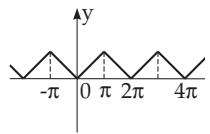
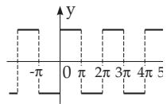
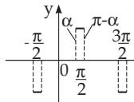
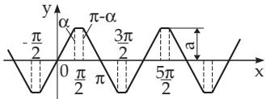
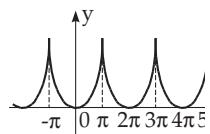
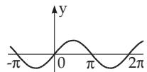
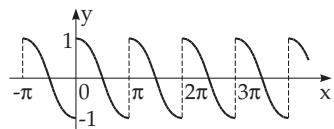
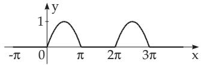

<table><tr><td>Function</td><td>Series Expansion</td><td>Convergence Region</td></tr><tr><td> $( a \pm x ) ^ { m }$ </td><td>Algebraic Functions Binomial Series  $a ^ { m } \left( 1 \pm \frac { x } { a } \right) ^ { m }$  After transforming to the form one gets the following series:</td><td> $| x | \le a$   $\begin{array} { c } { \operatorname { f o r } m > 0 } \\ { \left| x \right| < a } \end{array}$   $\mathrm { f o r } m < 0$ </td></tr><tr><td> $( 1 \pm x ) ^ { m }$ </td><td>Binomial Series with Positive Exponents  $1 \pm m x + { \frac { m ( m - 1 ) } { 2 ! } } x ^ { 2 } \pm { \frac { m ( m - 1 ) ( m - 2 ) } { 3 ! } } x ^ { 3 } + \cdot \cdot \cdot$ </td><td></td></tr><tr><td> $( m > 0 )$ </td><td> $+ \ ( \pm 1 ) ^ { n } \frac { m ( m - 1 ) \ldots ( m - n + 1 ) } { n ! } x ^ { n } + \cdot \cdot \cdot$ </td><td> $| x | \le 1$ </td></tr><tr><td>(1 ± x)1</td><td> $1 \pm { \frac { 1 } { 4 } } x - { \frac { 1 \cdot 3 } { 4 \cdot 8 } } x ^ { 2 } \pm { \frac { 1 \cdot 3 \cdot 7 } { 4 \cdot 8 \cdot 1 2 } } x ^ { 3 } - { \frac { 1 \cdot 3 \cdot 7 \cdot 1 1 } { 4 \cdot 8 \cdot 1 2 \cdot 1 6 } } x ^ { 4 } \pm \cdot \cdot \cdot$ </td><td> $| x | \le 1$ </td></tr><tr><td>(1 ± x)−</td><td> $1 \pm { \frac { 1 } { 3 } } x - { \frac { 1 \cdot 2 } { 3 \cdot 6 } } x ^ { 2 } \pm { \frac { 1 \cdot 2 \cdot 5 } { 3 \cdot 6 \cdot 9 } } x ^ { 3 } - { \frac { 1 \cdot 2 \cdot 5 \cdot 8 } { 3 \cdot 6 \cdot 9 \cdot 1 2 } } x ^ { 4 } \pm \cdot \cdot \cdot$ </td><td>|x| ≤ 1</td></tr><tr><td> $( 1 \pm x ) ^ { \frac { 1 } { 2 } }$ </td><td> $1 \pm { \frac { 1 } { 2 } } x - { \frac { 1 \cdot 1 } { 2 \cdot 4 } } x ^ { 2 } \pm { \frac { 1 \cdot 1 \cdot 3 } { 2 \cdot 4 \cdot 6 } } x ^ { 3 } - { \frac { 1 \cdot 1 \cdot 3 \cdot 5 } { 2 \cdot 4 \cdot 6 \cdot 8 } } x ^ { 4 } \pm \cdot \cdot \cdot$ </td><td>|x| ≤ 1</td></tr><tr><td> $( 1 \pm x ) ^ { \frac { 3 } { 2 } }$ </td><td> $1 \pm { \frac { 3 } { 2 } } x + { \frac { 3 \cdot 1 } { 2 \cdot 4 } } x ^ { 2 } \mp { \frac { 3 \cdot 1 \cdot 1 } { 2 \cdot 4 \cdot 6 } } x ^ { 3 } + { \frac { 3 \cdot 1 \cdot 1 \cdot 3 } { 2 \cdot 4 \cdot 6 \cdot 8 } } x ^ { 4 } \mp \cdot \cdot \cdot$ </td><td> $| x | \le 1$ </td></tr><tr><td> $( 1 \pm x ) ^ { \frac { 5 } { 2 } }$ </td><td> $1 \pm { \frac { 5 } { 2 } } x + { \frac { 5 \cdot 3 } { 2 \cdot 4 } } x ^ { 2 } \pm { \frac { 5 \cdot 3 \cdot 1 } { 2 \cdot 4 \cdot 6 } } x ^ { 3 } - { \frac { 5 \cdot 3 \cdot 1 \cdot 1 } { 2 \cdot 4 \cdot 6 \cdot 8 } } x ^ { 4 } \mp \cdot \cdot \cdot$ </td><td> $| x | \le 1$ </td></tr><tr><td> $( 1 \pm x ) ^ { - m }$ </td><td>Binomial Series with Negative Exponents  $1 \mp m x + \frac { m ( m + 1 ) } { 2 ! } x ^ { 2 } \mp \frac { m ( m + 1 ) ( m + 2 ) } { 3 ! } x ^ { 3 } + \cdot \cdot \cdot$ </td><td></td></tr><tr><td>(m &gt; 0)</td><td> $+ \ ( \mp 1 ) ^ { n } \frac { m ( m + 1 ) \ldots ( m + n - 1 ) } { n ! } x ^ { n } + \cdot \cdot \cdot$ </td><td> $| x | < 1$ </td></tr><tr><td>(1 ± x)−1</td><td> $1 \mp { \frac { 1 } { 4 } } x + { \frac { 1 \cdot 5 } { 4 \cdot 8 } } x ^ { 2 } \mp { \frac { 1 \cdot 5 \cdot 9 } { 4 \cdot 8 \cdot 1 2 } } x ^ { 3 } + { \frac { 1 \cdot 5 \cdot 9 \cdot 1 3 } { 4 \cdot 8 \cdot 1 2 \cdot 1 6 } } x ^ { 4 } \mp \cdot \cdot \cdot$ </td><td>|x| &lt; 1</td></tr><tr><td>(1 ± x)−1</td><td> $1 \mp { \frac { 1 } { 3 } } x + { \frac { 1 \cdot 4 } { 3 \cdot 6 } } x ^ { 2 } \mp { \frac { 1 \cdot 4 \cdot 7 } { 3 \cdot 6 \cdot 9 } } x ^ { 3 } + { \frac { 1 \cdot 4 \cdot 7 \cdot 1 0 } { 3 \cdot 6 \cdot 9 \cdot 1 2 } } x ^ { 4 } \mp \cdot \cdot \cdot$ </td><td>|x| &lt; 1</td></tr><tr><td>(1 ± x)−</td><td> $1 \mp { \frac { 1 } { 2 } } x + { \frac { 1 \cdot 3 } { 2 \cdot 4 } } x ^ { 2 } \mp { \frac { 1 \cdot 3 \cdot 5 } { 2 \cdot 4 \cdot 6 } } x ^ { 3 } + { \frac { 1 \cdot 3 \cdot 5 \cdot 7 } { 2 \cdot 4 \cdot 6 \cdot 8 } } x ^ { 4 } \mp \cdot \cdot \cdot$ </td><td>|x| &lt; 1</td></tr><tr><td>(1 ± x)−1</td><td> $1 \mp x + x ^ { 2 } \mp x ^ { 3 } + x ^ { 4 } \mp \cdot \cdot \cdot$ </td><td>|x| &lt; 1</td></tr><tr><td>(1 ± x)− 2</td><td> $1 \mp { \frac { 3 } { 2 } } x + { \frac { 3 \cdot 5 } { 2 \cdot 4 } } x ^ { 2 } \mp { \frac { 3 \cdot 5 \cdot 7 } { 2 \cdot 4 \cdot 6 } } x ^ { 3 } + { \frac { 3 \cdot 5 \cdot 7 \cdot 9 } { 2 \cdot 4 \cdot 6 \cdot 8 } } x ^ { 4 } \mp \cdot \cdot \cdot$ </td><td>|x| &lt; 1</td></tr><tr><td></td><td></td><td></td></tr><tr><td></td><td></td><td>|x| &lt; 1</td></tr><tr><td></td><td></td><td></td></tr><tr><td></td><td></td><td></td></tr><tr><td></td><td></td><td></td></tr><tr><td> $( 1 \pm x ) ^ { - 2 }$ </td><td></td><td></td></tr><tr><td></td><td></td><td></td></tr><tr><td></td><td></td><td></td></tr><tr><td></td><td> $1 \mp 2 x + 3 x ^ { 2 } \mp 4 x ^ { 3 } + 5 x ^ { 4 } \mp \cdot \cdot \cdot$ </td><td></td></tr><tr><td></td><td></td><td></td></tr><tr><td></td><td></td><td></td></tr><tr><td></td><td></td><td></td></tr><tr><td></td><td></td><td></td></tr><tr><td></td><td></td><td></td></tr><tr><td></td><td></td><td></td></tr><tr><td></td><td></td><td></td></tr><tr><td></td><td></td><td></td></tr><tr><td></td><td></td><td></td></tr><tr><td></td><td></td><td></td></tr><tr><td></td><td></td><td></td></tr><tr><td></td><td></td><td></td></tr><tr><td></td><td></td><td></td></tr><tr><td></td><td></td><td></td></tr><tr><td></td><td></td><td></td></tr><tr><td></td><td></td><td></td></tr><tr><td></td><td></td><td></td></tr><tr><td></td><td></td><td></td></tr><tr><td></td><td></td><td></td></tr><tr><td></td><td></td><td></td></tr><tr><td></td><td></td><td></td></tr><tr><td></td><td></td><td></td></tr><tr><td></td><td></td><td></td></tr><tr><td></td><td></td><td></td></tr><tr><td></td><td></td><td></td></tr><tr><td></td><td></td><td></td></tr><tr><td></td><td></td><td></td></tr><tr><td></td><td></td><td></td></tr><tr><td></td><td></td><td></td></tr><tr><td></td><td></td><td></td></tr></table>

<table><tr><td>Function</td><td>Series Expansion</td><td></td><td>Convergence Region</td></tr><tr><td> $( 1 \pm x ) ^ { - \frac { 5 } { 2 } }$ </td><td></td><td> $1 \mp { \frac { 5 } { 2 } } x + { \frac { 5 \cdot 7 } { 2 \cdot 4 } } x ^ { 2 } \mp { \frac { 5 \cdot 7 \cdot 9 } { 2 \cdot 4 \cdot 6 } } x ^ { 3 } + { \frac { 5 \cdot 7 \cdot 9 \cdot 1 1 } { 2 \cdot 4 \cdot 6 \cdot 8 } } x ^ { 4 } \mp \cdots$ </td><td> $| x | < 1$ </td></tr><tr><td> $( 1 \pm x ) ^ { - 3 }$ </td><td></td><td> $1 \mp { \frac { 1 } { 1 \cdot 2 } } ( 2 \cdot 3 x \mp 3 \cdot 4 x ^ { 2 } + 4 \cdot 5 x ^ { 3 } \mp 5 \cdot 6 x ^ { 4 } + \cdot \cdot \cdot )$ </td><td> $| x | < 1$ </td></tr><tr><td> $( 1 \pm x ) ^ { - 4 }$   $( 1 \pm x ) ^ { - 5 }$ </td><td></td><td> $1 \mp { \frac { 1 } { 1 \cdot 2 \cdot 3 } } ( 2 \cdot 3 \cdot 4 x \mp 3 \cdot 4 \cdot 5 x ^ { 2 }$   $+ 4 \cdot 5 \cdot 6 x ^ { 3 } \mp 5 \cdot 6 \cdot 7 x ^ { 4 } + \cdot \cdot \cdot )$   $1 \mp { \frac { 1 } { 1 \cdot 2 \cdot 3 \cdot 4 } } ( 2 \cdot 3 \cdot 4 \cdot 5 x \mp 3 \cdot 4 \cdot 5 \cdot 6 x ^ { 2 }$ </td><td> $| x | < 1$ </td></tr><tr><td></td><td></td><td> $+ 4 \cdot 5 \cdot 6 \cdot 7 x ^ { 3 } \mp 5 \cdot 6 \cdot 7 \cdot 8 x ^ { 4 } + \cdot \cdot \cdot )$ </td><td> $| x | < 1$ </td></tr><tr><td>sin x  $\sin ( x + a )$ </td><td></td><td>Trigonometric Functions  $x - { \frac { x ^ { 3 } } { 3 ! } } + { \frac { x ^ { 5 } } { 5 ! } } - \cdots + ( - 1 ) ^ { n } { \frac { x ^ { 2 n + 1 } } { ( 2 n + 1 ) ! } } \pm \cdots$ </td><td> $| x | < \infty$ </td></tr><tr><td></td><td></td><td> $\sin a + x \cos a - { \frac { x ^ { 2 } \sin a } { 2 ! } } - { \frac { x ^ { 3 } \cos a } { 3 ! } }$   $+ { \frac { x ^ { 4 } \sin a } { 4 ! } } + \cdots + { \frac { x ^ { n } \sin \left( a + { \frac { n \pi } { 2 } } \right) } { n ! } } \cdot \cdot \cdot$ </td><td> $| x | < \infty$ </td></tr><tr><td>COS x  $\cos ( x + a )$ </td><td></td><td> $1 - { \frac { x ^ { 2 } } { 2 ! } } + { \frac { x ^ { 4 } } { 4 ! } } - { \frac { x ^ { 6 } } { 6 ! } } + \cdot \cdot \cdot + ( - 1 ) ^ { n } { \frac { x ^ { 2 n } } { ( 2 n ) ! } } \pm$ </td><td> $| x | < \infty$ </td></tr><tr><td></td><td></td><td> $\cos a - x \sin a - { \frac { x ^ { 2 } \cos a } { 2 ! } } + { \frac { x ^ { 3 } \sin a } { 3 ! } }$   $+ { \frac { x ^ { 4 } \cos a } { 4 ! } } - \cdot \cdot \cdot + { \frac { x ^ { n } \cos \left( a + { \frac { n \pi } { 2 } } \right) } { n ! } } \pm \cdot \cdot \cdot$ </td><td> $| x | < \infty$ </td></tr><tr><td>tan x</td><td></td><td> $x + { \frac { 1 } { 3 } } x ^ { 3 } + { \frac { 2 } { 1 5 } } x ^ { 5 } + { \frac { 1 7 } { 3 1 5 } } x ^ { 7 } + { \frac { 6 2 } { 2 8 3 5 } } x ^ { 9 } + \cdots$   $+ \frac { 2 ^ { 2 n } ( 2 ^ { 2 n } - 1 ) B _ { n } } { ( 2 n ) ! } x ^ { 2 n - 1 } + \cdot \cdot \cdot$ </td><td> $| x | < \frac \pi 2$ </td></tr><tr><td>cot x</td><td> ${ \frac { 1 } { x } } - \left[ { \frac { x } { 3 } } + { \frac { x ^ { 3 } } { 4 5 } } + { \frac { 2 x ^ { 5 } } { 9 4 5 } } + { \frac { x ^ { 7 } } { 4 7 2 5 } } + \cdots \right.$ </td><td> $+ { \frac { 2 ^ { 2 n } B _ { n } } { ( 2 n ) ! } } x ^ { 2 n - 1 } + \cdot \cdot \cdot \Biggr ]$ </td><td> $0 < | x | < \pi$ </td></tr><tr><td>sec x</td><td></td><td> $1 + { \frac { 1 } { 2 } } x ^ { 2 } + { \frac { 5 } { 2 4 } } x ^ { 4 } + { \frac { 6 1 } { 7 2 0 } } x ^ { 6 } + { \frac { 2 7 7 } { 8 0 6 4 } } x ^ { 8 } + \cdot \cdot \cdot$   $+ { \frac { E _ { n } } { ( 2 n ) ! } } x ^ { 2 n } + \cdots$ </td><td> $| x | < \frac \pi 2$ </td></tr></table>

<table><tr><td>Function</td><td colspan="2">Series Expansion</td><td></td><td>Convergence Region</td><td></td></tr><tr><td>cosec x</td><td></td><td></td><td> ${ \frac { 1 } { x } } + { \frac { 1 } { 6 } } x + { \frac { 7 } { 3 6 0 } } x ^ { 3 } + { \frac { 3 1 } { 1 5 1 2 0 } } x ^ { 5 } + { \frac { 1 2 7 } { 6 0 4 8 0 0 } } x ^ { 7 } + \cdots$  2(22n−1 − 1) X Bnx2n−1 (2n)!</td><td></td><td> $0 < | x | < \pi$ </td></tr><tr><td> $e ^ { x }$ </td><td></td><td></td><td>Exponential Functions  $1 + { \frac { x } { 1 ! } } + { \frac { x ^ { 2 } } { 2 ! } } + { \frac { x ^ { 3 } } { 3 ! } } + \cdots + { \frac { x ^ { n } } { n ! } } + \cdots$ </td><td></td><td> $| x | < \infty$ </td></tr><tr><td> $a ^ { x } = e ^ { x \ln a }$ </td><td></td><td></td><td> $1 + { \frac { x \ln a } { 1 ! } } + { \frac { ( x \ln a ) ^ { 2 } } { 2 ! } } + { \frac { ( x \ln a ) ^ { 3 } } { 3 ! } } + \cdots + { \frac { ( x \ln a ) ^ { n } } { n ! } } + \cdot \cdot \cdot$ </td><td></td><td> $| x | < \infty$ </td></tr><tr><td> $\frac { x } { e ^ { x } - 1 }$ </td><td></td><td></td><td> $1 - { \frac { x } { 2 } } + { \frac { B _ { 1 } x ^ { 2 } } { 2 ! } } - { \frac { B _ { 2 } x ^ { 4 } } { 4 ! } } + { \frac { B _ { 3 } x ^ { 6 } } { 6 ! } } - \cdot \cdot \cdot$ </td><td> $+ ( - 1 ) ^ { n + 1 } { \frac { B _ { n } x ^ { 2 n } } { ( 2 n ) ! } } \pm \cdot \cdot \cdot$ </td><td> $| x | < 2 \pi$ </td></tr><tr><td></td><td></td><td></td><td>Logarithmic Functions</td><td></td><td></td></tr><tr><td>ln x</td><td>2</td><td></td><td> $[ { \frac { x - 1 } { x + 1 } } + { \frac { ( x - 1 ) ^ { 3 } } { 3 ( x + 1 ) ^ { 3 } } } + { \frac { ( x - 1 ) ^ { 5 } } { 5 ( x + 1 ) ^ { 5 } } } + \cdot \cdot \cdot$ </td><td> $+ { \frac { ( x - 1 ) ^ { 2 n + 1 } } { ( 2 n + 1 ) ( x + 1 ) ^ { 2 n + 1 } } } + \cdot \cdot \cdot \Biggr ]$ </td><td> $x > 0$ </td></tr><tr><td>ln x</td><td></td><td></td><td> $( x - 1 ) - { \frac { ( x - 1 ) ^ { 2 } } { 2 } } + { \frac { ( x - 1 ) ^ { 3 } } { 3 } } - { \frac { ( x - 1 ) ^ { 4 } } { 4 } } + \cdot \cdot \cdot$ </td><td> $+ ( - 1 ) ^ { n + 1 } { \frac { ( x - 1 ) ^ { n } } { n } } \pm \cdot \cdot \cdot$ </td><td> $0 < x \le 2$ </td></tr><tr><td>ln x</td><td></td><td></td><td></td><td> ${ \frac { x - 1 } { x } } + { \frac { ( x - 1 ) ^ { 2 } } { 2 x ^ { 2 } } } + { \frac { ( x - 1 ) ^ { 3 } } { 3 x ^ { 3 } } } + \cdots + { \frac { ( x - 1 ) ^ { n } } { n x ^ { n } } } + \cdots$ </td><td> $x > { \frac { 1 } { 2 } }$ </td></tr><tr><td> $\ln { \left( 1 + x \right) }$ </td><td></td><td></td><td> $x - { \frac { x ^ { 2 } } { 2 } } + { \frac { x ^ { 3 } } { 3 } } - { \frac { x ^ { 4 } } { 4 } } + \cdots + ( - 1 ) ^ { n + 1 } { \frac { x ^ { n } } { n } } \pm \cdot \cdot \cdot$ </td><td></td><td> $- 1 < x \leq 1$ </td></tr><tr><td>ln (1 − x)</td><td></td><td></td><td></td><td> $- \left[ x + { \frac { x ^ { 2 } } { 2 } } + { \frac { x ^ { 3 } } { 3 } } + { \frac { x ^ { 4 } } { 4 } } + { \frac { x ^ { 5 } } { 5 } } + \cdots + { \frac { x ^ { n } } { n } } + \cdots \right]$ </td><td> $- 1 \leq x < 1$ </td></tr><tr><td></td><td></td><td></td><td></td><td> $2 \left[ x + { \frac { x ^ { 3 } } { 3 } } + { \frac { x ^ { 5 } } { 5 } } + { \frac { x ^ { 7 } } { 7 } } + \cdots + { \frac { x ^ { 2 n + 1 } } { 2 n + 1 } } + \cdots \right]$ </td><td></td></tr><tr><td> $\ln \left( { \frac { 1 + x } { 1 - x } } \right)$ </td><td></td><td></td><td></td><td></td><td> $| x | < 1$ </td></tr></table>

<table><tr><td>Function</td><td></td><td>Series Expansion</td><td></td><td>Convergence Region</td></tr><tr><td> $\ln \left( { \frac { x + 1 } { x - 1 } } \right)$  =2 Arcoth x</td><td></td><td></td><td> $2 \left[ { \frac { 1 } { x } } + { \frac { 1 } { 3 x ^ { 3 } } } + { \frac { 1 } { 5 x ^ { 5 } } } + { \frac { 1 } { 7 x ^ { 7 } } } + \cdots + { \frac { 1 } { ( 2 n + 1 ) x ^ { 2 n + 1 } } } + \cdots \right]$ </td><td> $| x | > 1$ </td></tr><tr><td>ln |sin x|</td><td></td><td></td><td> $\ln | x | - { \frac { x ^ { 2 } } { 6 } } - { \frac { x ^ { 4 } } { 1 8 0 } } - { \frac { x ^ { 6 } } { 2 8 3 5 } } - \cdots - { \frac { 2 ^ { 2 n - 1 } B _ { n } x ^ { 2 n } } { n ( 2 n ) ! } } - \cdot \cdot \cdot$ </td><td> $0 < | x | < \pi$ </td></tr><tr><td>ln cos x</td><td> $- { \frac { x ^ { 2 } } { 2 } } - { \frac { x ^ { 4 } } { 1 2 } } - { \frac { x ^ { 6 } } { 4 5 } } - { \frac { 1 7 x ^ { 8 } } { 2 5 2 0 } } - \cdot \cdot \cdot$ </td><td></td><td> $- { \frac { 2 ^ { 2 n - 1 } ( 2 ^ { 2 n } - 1 ) B _ { n } x ^ { 2 n } } { n ( 2 n ) ! } } - \cdot \cdot \cdot$ </td><td> $| x | < { \frac { \pi } { 2 } }$ </td></tr><tr><td>ln |tan x|</td><td></td><td> $\ln | x | + { \frac { 1 } { 3 } } x ^ { 2 } + { \frac { 7 } { 9 0 } } x ^ { 4 } + { \frac { 6 2 } { 2 8 3 5 } } x ^ { 6 } + \cdot \cdot \cdot$ </td><td> $+ \frac { 2 ^ { 2 n } ( 2 ^ { 2 n - 1 } - 1 ) B _ { n } } { n ( 2 n ) ! } x ^ { 2 n } + \cdot \cdot \cdot$ </td><td> $0 < | x | < { \frac { \pi } { 2 } }$ </td></tr><tr><td>arcsin x</td><td></td><td> $x + { \frac { x ^ { 3 } } { 2 \cdot 3 } } + { \frac { 1 \cdot 3 x ^ { 5 } } { 2 \cdot 4 \cdot 5 } } + { \frac { 1 \cdot 3 \cdot 5 x ^ { 7 } } { 2 \cdot 4 \cdot 6 \cdot 7 } } + \cdot \cdot \cdot$ </td><td> $+ { \frac { 1 \cdot 3 \cdot 5 \cdot \cdot \cdot ( 2 n - 1 ) x ^ { 2 n + 1 } } { 2 \cdot 4 \cdot 6 \cdot \cdot \cdot ( 2 n ) ( 2 n + 1 ) } } + \cdot \cdot \cdot$ </td><td> $| x | < 1$ </td></tr><tr><td>arccos x</td><td></td><td></td><td> ${ \frac { \pi } { 2 } } - [ x + { \frac { x ^ { 3 } } { 2 \cdot 3 } } + { \frac { 1 \cdot 3 x ^ { 5 } } { 2 \cdot 4 \cdot 5 } } + { \frac { 1 \cdot 3 \cdot 5 x ^ { 7 } } { 2 \cdot 4 \cdot 6 \cdot 7 } } + \cdot \cdot \cdot$   $+ \frac { 1 \cdot 3 \cdot 5 \cdot \cdot \cdot ( 2 n - 1 ) x ^ { 2 n + 1 } } { 2 \cdot 4 \cdot 6 \cdot \cdot \cdot ( 2 n ) ( 2 n + 1 ) } + \cdot \cdot \cdot$ </td><td> $| x | < 1$ </td></tr><tr><td>arctan x</td><td></td><td></td><td> $x - { \frac { x ^ { 3 } } { 3 } } + { \frac { x ^ { 5 } } { 5 } } - { \frac { x ^ { 7 } } { 7 } } + \cdots + ( - 1 ) ^ { n } { \frac { x ^ { 2 n + 1 } } { 2 n + 1 } } \pm \cdots$ </td><td> $| x | < 1$ </td></tr><tr><td>arctan x</td><td></td><td></td><td> $\pm { \frac { \pi } { 2 } } - { \frac { 1 } { x } } + { \frac { 1 } { 3 x ^ { 3 } } } - { \frac { 1 } { 5 x ^ { 5 } } } + { \frac { 1 } { 7 x ^ { 7 } } } - \cdot \cdot \cdot$ </td><td></td></tr><tr><td>arccot x</td><td></td><td> ${ \frac { \pi } { 2 } } - \left[ x - { \frac { x ^ { 3 } } { 3 } } + { \frac { x ^ { 5 } } { 5 } } - { \frac { x ^ { 7 } } { 7 } } + \cdots + ( - 1 ) ^ { n } { \frac { x ^ { 2 n + 1 } } { 2 n + 1 } } \pm \cdots \right]$ </td><td> $+ ( - 1 ) ^ { n + 1 } { \frac { 1 } { ( 2 n + 1 ) x ^ { 2 n + 1 } } } \pm \cdot \cdot \cdot$ </td><td> $| x | > 1$   $| x | < 1$ </td></tr></table>

<table><tr><td>Function</td><td colspan="6">Series Expansion</td></tr><tr><td>sinh x cosh x</td><td></td><td></td><td> $1 + { \frac { x ^ { 2 } } { 2 ! } } + { \frac { x ^ { 4 } } { 4 ! } } + { \frac { x ^ { 6 } } { 6 ! } } + \cdot \cdot \cdot + { \frac { x ^ { 2 n } } { ( 2 n ) ! } } + \cdot \cdot \cdot$ </td><td>Hyperbolic Functions  $x + { \frac { x ^ { 3 } } { 3 ! } } + { \frac { x ^ { 5 } } { 5 ! } } + { \frac { x ^ { 7 } } { 7 ! } } + \cdots + { \frac { x ^ { 2 n + 1 } } { ( 2 n + 1 ) ! } } + \cdots$ </td><td></td><td>Region  $| x | < \infty$   $| x | < \infty$ </td></tr><tr><td>tanh x</td><td></td><td></td><td></td><td> $x - { \frac { 1 } { 3 } } x ^ { 3 } + { \frac { 2 } { 1 5 } } x ^ { 5 } - { \frac { 1 7 } { 3 1 5 } } x ^ { 7 } + { \frac { 6 2 } { 2 8 3 5 } } x ^ { 9 } - \cdots$ </td><td> $+ \frac { ( - 1 ) ^ { n + 1 } 2 ^ { 2 n } ( 2 ^ { 2 n } - 1 ) } { ( 2 n ) ! } B _ { n } x ^ { 2 n - 1 } \pm \cdot \cdot \cdot$ </td><td> $| x | < { \frac { \pi } { 2 } }$ </td></tr><tr><td>coth x</td><td></td><td></td><td></td><td> ${ \frac { 1 } { x } } + { \frac { x } { 3 } } - { \frac { x ^ { 3 } } { 4 5 } } + { \frac { 2 x ^ { 5 } } { 9 4 5 } } - { \frac { x ^ { 7 } } { 4 7 2 5 } } + \cdots$ </td><td> $+ \frac { ( - 1 ) ^ { n + 1 } 2 ^ { 2 n } } { ( 2 n ) ! } B _ { n } x ^ { 2 n - 1 } \pm \cdot \cdot \cdot$ </td><td> $0 < | x | < \pi$ </td></tr><tr><td>sech x</td><td></td><td></td><td></td><td> $1 - { \frac { 1 } { 2 ! } } x ^ { 2 } + { \frac { 5 } { 4 ! } } x ^ { 4 } - { \frac { 6 1 } { 6 ! } } x ^ { 6 } + { \frac { 1 3 8 5 } { 8 ! } } x ^ { 8 } - \cdot \cdot \cdot$ </td><td></td><td></td></tr><tr><td>cosech x</td><td></td><td> ${ \frac { 1 } { x } } - { \frac { x } { 6 } } + { \frac { 7 x ^ { 3 } } { 3 6 0 } } - { \frac { 3 1 x ^ { 5 } } { 1 5 1 2 0 } } +$ </td><td></td><td></td><td> $+ { \frac { ( - 1 ) ^ { n } } { ( 2 n ) ! } } E _ { n } x ^ { 2 n } \pm \cdot \cdot \cdot$ </td><td> $| x | < { \frac { \pi } { 2 } }$ </td></tr><tr><td>Arsinh x</td><td></td><td></td><td></td><td>Area Functions</td><td> $+ \frac { 2 ( - 1 ) ^ { n } ( 2 ^ { 2 n - 1 } - 1 ) } { ( 2 n ) ! } B _ { n } x ^ { 2 n - 1 } + \cdot \cdot \cdot$   $x - { \frac { 1 } { 2 \cdot 3 } } x ^ { 3 } + { \frac { 1 \cdot 3 } { 2 \cdot 4 \cdot 5 } } x ^ { 5 } - { \frac { 1 \cdot 3 \cdot 5 } { 2 \cdot 4 \cdot 6 \cdot 7 } } x ^ { 7 } + \cdot \cdot \cdot$ </td><td> $0 < | x | < \pi$ </td></tr><tr><td>Arcosh x</td><td></td><td></td><td></td><td></td><td> $+ ( - 1 ) ^ { n } \cdot { \frac { 1 \cdot 3 \cdot 5 \cdot \cdot \cdot ( 2 n - 1 ) } { 2 \cdot 4 \cdot 6 \cdot \cdot \cdot 2 n ( 2 n + 1 ) } } x ^ { 2 n + 1 } \pm \cdot \cdot \cdot$   $\pm [ \ln ( 2 x ) - { \frac { 1 } { 2 \cdot 2 x ^ { 2 } } } - { \frac { 1 \cdot 3 } { 2 \cdot 4 \cdot 4 x ^ { 4 } } } - { \frac { 1 \cdot 3 \cdot 5 } { 2 \cdot 4 \cdot 6 x ^ { 6 } } } - \cdots \cdot$ </td><td> $| x | < 1$  x &gt; 1</td></tr><tr><td>Artanh x</td><td></td><td></td><td></td><td></td><td> $x + { \frac { x ^ { 3 } } { 3 } } + { \frac { x ^ { 5 } } { 5 } } + { \frac { x ^ { 7 } } { 7 } } + \cdots + { \frac { x ^ { 2 n + 1 } } { 2 n + 1 } } + \cdots$ </td><td> $| x | < 1$ </td></tr><tr><td></td><td></td><td></td><td></td><td></td><td></td><td></td></tr><tr><td>Arcoth x</td><td></td><td></td><td></td><td></td><td> ${ \frac { 1 } { x } } + { \frac { 1 } { 3 x ^ { 3 } } } + { \frac { 1 } { 5 x ^ { 5 } } } + { \frac { 1 } { 7 x ^ { 7 } } } + \cdots + { \frac { 1 } { ( 2 n + 1 ) x ^ { 2 n + 1 } } } + \cdots$ </td><td> $| x | > 1$ </td></tr></table>

21.6 Fourier Series

1. y = x for 0< $x < 2 \pi$

$$
y = \pi - 2 \left( { \frac { \sin x } { 1 } } + { \frac { \sin 2 x } { 2 } } + { \frac { \sin 3 x } { 3 } } + \cdots \right)
$$

2. $y = x \mathrm { f o r } 0 { \le } x \le \pi$

y = 2π x for $\pi < x \le 2 \pi$

$$
y = { \frac { \pi } { 2 } } - { \frac { 4 } { \pi } } \left( \cos x + { \frac { \cos 3 x } { 3 ^ { 2 } } } + { \frac { \cos 5 x } { 5 ^ { 2 } } } + \cdots \right)
$$

3. $y = x { \mathrm { ~ f o r ~ } } - \pi < x < \pi$

$$
y = 2 \left( { \frac { \sin x } { 1 } } - { \frac { \sin 2 x } { 2 } } + { \frac { \sin 3 x } { 3 } } - \cdots \right)
$$

4. $y = x { \mathrm { ~ f o r - } } { \frac { \pi } { 2 } } \leq x \leq { \frac { \pi } { 2 } }$

$$
y = \pi - x \mathrm { f o r } \frac { \pi } { 2 } \leq x \leq \frac { 3 \pi } { 2 }
$$

$$
y = { \frac { 4 } { \pi } } \left( \sin x - { \frac { \sin 3 x } { 3 ^ { 2 } } } + { \frac { \sin 5 x } { 5 ^ { 2 } } } - \cdots \right)
$$

5. $y = a \mathrm { f o r } 0 < x < \pi$

y = a for $\pi < x < 2 \pi$

$$
y = { \frac { 4 a } { \pi } } \left( \sin x + { \frac { \sin 3 x } { 3 } } + { \frac { \sin 5 x } { 5 } } + \cdots \right)
$$

6. $y = 0$ for $0 \leq x < \alpha$ and for $\pi - \alpha < x \leq \pi + \alpha \mathrm { a n d } 2 \pi - \alpha < x \leq 2 \pi$

y = a for $\alpha < x < \pi - \alpha$

y = a for π + α < x 2π α

$$
y = { \frac { 4 a } { \pi } } \left( \cos \alpha \sin x + { \frac { 1 } { 3 } } \cos 3 \alpha \sin 3 x \right.
$$

15 cos 5α sin 5x + · · ·

7. $y = { \frac { a x } { \alpha } } { \mathrm { ~ f o r } } - a \leq x \leq a$

$$
y = a \mathrm { f o r } \alpha \leq x \leq \pi - \alpha
$$

$$
y = { \frac { a ( \pi - x ) } { \alpha } } \operatorname { f o r } \pi - \alpha \leq x \leq \pi + \alpha
$$

$$
y = { \frac { 4 } { \pi } } { \frac { a } { \alpha } } \left( \sin \alpha \sin x + { \frac { 1 } { 3 ^ { 2 } } } \sin 3 \alpha \sin 3 x \right.
$$

$$
y = - a { \mathrm { ~ f o r ~ } } \pi + \alpha \leq x \leq 2 \pi - \alpha
$$

$$
+ { \frac { 1 } { 5 ^ { 2 } } } \sin 5 \alpha \sin 5 x + \cdot \cdot \cdot \cdot )
$$

Especially, for $\alpha = \frac { \pi } { 3 }$ holds: y = 6√3a sin x 12 sin 5x + 12 sin 7x − 1112 sin 11x + · · · π2

8. $y = x ^ { 2 }$ for $- \pi \leq x \leq \pi$

$$
y = { \frac { \pi ^ { 2 } } { 3 } } - 4 \left( { \frac { \cos x } { 1 } } - { \frac { \cos 2 x } { 2 ^ { 2 } } } + { \frac { \cos 3 x } { 3 ^ { 2 } } } - \cdot \cdot \cdot \right)
$$

9. $y = x ( \pi - x ) { \mathrm { ~ f o r ~ } } 0 \leq x \leq \pi$

$$
y = { \frac { \pi ^ { 2 } } { 6 } } - \left( { \frac { \cos 2 x } { 1 ^ { 2 } } } + { \frac { \cos 4 x } { 2 ^ { 2 } } } + { \frac { \cos 6 x } { 3 ^ { 2 } } } + \cdots \right)
$$

10. $y = x ( \pi - x ) { \mathrm { ~ f o r ~ } } 0 \leq x \leq \pi$

$$
y = ( \pi - x ) ( 2 \pi - x ) \ \mathrm { f o r } \ \pi \leq x \leq 2 \pi
$$

$$
y = { \frac { 8 } { \pi } } \left( \sin x + { \frac { 1 } { 3 ^ { 3 } } } \sin 3 x + { \frac { 1 } { 5 ^ { 3 } } } \sin 5 x + \cdots \right)
$$

11. $y = \sin x$ for $0 \leq x \leq \pi$

$$
y = { \frac { 2 } { \pi } } - { \frac { 4 } { \pi } } \left( { \frac { \cos 2 x } { 1 \cdot 3 } } + { \frac { \cos 4 x } { 3 \cdot 5 } } + { \frac { \cos 6 x } { 5 \cdot 7 } } + \cdots \right)
$$

12. $y = \cos x$ for $0 < x < \pi$

$$
y = { \frac { 4 } { \pi } } \left( { \frac { 2 \sin 2 x } { 1 \cdot 3 } } + { \frac { 4 \sin 4 x } { 3 \cdot 5 } } + { \frac { 6 \sin 6 x } { 5 \cdot 7 } } + \cdots \right)
$$

13. $y = \sin x$ for $0 \leq x \leq \pi$

y = 0 for $\pi \leq x \leq 2 \pi$

$$
\begin{array} { r } { y = { \frac { 1 } { \pi } } + { \frac { 1 } { 2 } } \sin x - { \frac { 2 } { \pi } } \left( { \frac { \cos 2 x } { 1 \cdot 3 } } + { \frac { \cos 4 x } { 3 \cdot 5 } } \right. } \\ { \left. + { \frac { \cos 6 x } { 5 \cdot 7 } } + \cdot \cdot \cdot \right) } \end{array}
$$

14. $y = \cos u x { \mathrm { ~ f o r ~ } } - \pi \leq x \leq \pi$

$$
y = { \frac { 2 u \sin u \pi } { \pi } } \left[ { \frac { 1 } { 2 u ^ { 2 } } } - { \frac { \cos x } { u ^ { 2 } - 1 } } + { \frac { \cos 2 x } { u ^ { 2 } - 4 } } - { \frac { \cos 3 x } { u ^ { 2 } - 9 } } + \cdot \cdot \cdot \right]
$$

(u arbitrary, but not integer number)

15. $y = \sin u x { \mathrm { ~ f o r ~ } } - \pi < x < \pi$

$$
y = { \frac { 2 \sin u \pi } { \pi } } \left( { \frac { \sin x } { 1 - u ^ { 2 } } } - { \frac { 2 \sin 2 x } { 4 - u ^ { 2 } } } + { \frac { 3 \sin 3 x } { 9 - u ^ { 2 } } } + \cdot \cdot \cdot \right)
$$

(u arbitrary, but not integer number)

16. $y = x \cos x { \mathrm { f o r } } - \pi < x < \pi$

$$
y = - { \frac { 1 } { 2 } } \sin x + { \frac { 4 \sin 2 x } { 2 ^ { 2 } - 1 } } - { \frac { 6 \sin 3 x } { 3 ^ { 2 } - 1 } } + { \frac { 8 \sin 4 x } { 4 ^ { 2 } - 1 } } - \cdots
$$

17. $y = - \ln \left( 2 \sin { \frac { x } { 2 } } \right) { \mathrm { f o r ~ } } 0 < x \leq \pi$

$$
y = \cos x + { \frac { 1 } { 2 } } \cos 2 x + { \frac { 1 } { 3 } } \cos 3 x + \cdot \cdot \cdot
$$

18. $y = \ln \left( 2 \cos { \frac { x } { 2 } } \right) { \mathrm { f o r ~ } } 0 \leq x < \pi$

$$
y = \cos x - { \frac { 1 } { 2 } } \cos 2 x + { \frac { 1 } { 3 } } \cos 3 x - \cdot \cdot \cdot
$$

19. $y = { \frac { 1 } { 2 } } \ln \cot { \frac { x } { 2 } } \mathrm { f o r } 0 < x < \pi$

$$
y = \cos x + { \frac { 1 } { 3 } } \cos 3 x + { \frac { 1 } { 5 } } \cos 5 x + \cdot \cdot \cdot
$$

21.7 Indefinite Integrals

(For instructions on using these tables see 8.1.1.2, 2., p. 482).

21.7.1 Integral Rational Functions

21.7.1.1 Integrals with $X = a x + b$

$$
\boxed { \mathrm { N o t a t i o n } ; X = a x + b }
$$

1. $\int X ^ { n } d x = { \frac { 1 } { a ( n + 1 ) } } X ^ { n + 1 } \qquad ( n \neq - 1 ) ;$

$$
( \mathrm { f o r } n = - 1 \quad \mathrm { s e e } \mathrm { N o } . 2 ) .
$$

2. $\int { \frac { d x } { X } } = { \frac { 1 } { a } } \ln X .$

3. $\int x X ^ { n } d x = { \frac { 1 } { a ^ { 2 } ( n + 2 ) } } X ^ { n + 2 } - { \frac { b } { a ^ { 2 } ( n + 1 ) } } X ^ { n + 1 }$

$$
( n \neq - 1 , \neq - 2 ) ; \qquad ( \mathrm { f o r } \ n = - 1 , = - 2 \quad \mathrm { s e e } \ N o . \ 5 \ \mathrm { u n d } \ 6 ) .
$$

$$
4 . \int x ^ { m } X ^ { n } d x = { \frac { 1 } { a ^ { m + 1 } } } \int ( X - b ) ^ { m } X ^ { n } d X \qquad ( n \neq - 1 , \neq - 2 , \ldots , \neq - m ) .
$$

The integral is used for $m < n$ or for integer m and fractional $n ;$ in these cases $( X - b ) ^ { m }$ is expanded by the binomial theorem (see 1.1.6.4, p. 12).

5 $\int { \frac { x d x } { X } } = { \frac { x } { a } } - { \frac { b } { a ^ { 2 } } } \ln X .$

6. $\int { \frac { x d x } { X ^ { 2 } } } = { \frac { b } { a ^ { 2 } X } } + { \frac { 1 } { a ^ { 2 } } } \ln X .$

7. $\int { \frac { x d x } { X ^ { 3 } } } = { \frac { 1 } { a ^ { 2 } } } \left( - { \frac { 1 } { X } } + { \frac { b } { 2 X ^ { 2 } } } \right)$

$$
8 . \ \int { \frac { x d x } { X ^ { n } } } = { \frac { 1 } { a ^ { 2 } } } \left( { \frac { - 1 } { ( n - 2 ) X ^ { n - 2 } } } + { \frac { b } { ( n - 1 ) X ^ { n - 1 } } } \right) \qquad ( n \neq 1 , \neq 2 ) .
$$

$$
9 . \int { \frac { x ^ { 2 } d x } { X } } = { \frac { 1 } { a ^ { 3 } } } \left( { \frac { 1 } { 2 } } X ^ { 2 } - 2 b X + b ^ { 2 } \ln X \right)
$$

$$
{ \bf 1 0 } . \int { \frac { x ^ { 2 } d x } { X ^ { 2 } } } = { \frac { 1 } { a ^ { 3 } } } \left( X - 2 b \ln X - { \frac { b ^ { 2 } } { X } } \right) .
$$

$$
{ \bf 1 1 . } \ \int { \frac { x ^ { 2 } d x } { X ^ { 3 } } } = { \frac { 1 } { a ^ { 3 } } } \left( \ln X + { \frac { 2 b } { X } } - { \frac { b ^ { 2 } } { 2 X ^ { 2 } } } \right) .
$$

$$
1 2 . \ \int { \frac { x ^ { 2 } d x } { X ^ { n } } } = { \frac { 1 } { a ^ { 3 } } } \left[ { \frac { - 1 } { ( n - 3 ) X ^ { n - 3 } } } + { \frac { 2 b } { ( n - 2 ) X ^ { n - 2 } } } - { \frac { b ^ { 2 } } { ( n - 1 ) X ^ { n - 1 } } } \right] \qquad ( n \neq 1 , \neq 2 , \neq 3 ) .
$$

$$
1 3 . \ \int { \frac { x ^ { 3 } d x } { X } } = { \frac { 1 } { a ^ { 4 } } } \left( { \frac { X ^ { 3 } } { 3 } } - { \frac { 3 b X ^ { 2 } } { 2 } } + 3 b ^ { 2 } X - b ^ { 3 } \ln X \right) .
$$

14. $\int { \frac { x ^ { 3 } d x } { X ^ { 2 } } } = { \frac { 1 } { a ^ { 4 } } } \left( { \frac { X ^ { 2 } } { 2 } } - 3 b X + 3 b ^ { 2 } \ln X + { \frac { b ^ { 3 } } { X } } \right)$

15. $\int { \frac { x ^ { 3 } d x } { X ^ { 3 } } } = { \frac { 1 } { a ^ { 4 } } } \left( X - 3 b \ln X - { \frac { 3 b ^ { 2 } } { X } } + { \frac { b ^ { 3 } } { 2 X ^ { 2 } } } \right)$

16. $\int { \frac { x ^ { 3 } d x } { X ^ { 4 } } } = { \frac { 1 } { a ^ { 4 } } } \left( \ln X + { \frac { 3 b } { X } } - { \frac { 3 b ^ { 2 } } { 2 X ^ { 2 } } } + { \frac { b ^ { 3 } } { 3 X ^ { 3 } } } \right)$

$$
\int { \frac { x ^ { 3 } d x } { X ^ { n } } } = { \frac { 1 } { a ^ { 4 } } } \left[ { \frac { - 1 } { ( n - 4 ) X ^ { n - 4 } } } + { \frac { 3 b } { ( n - 3 ) X ^ { n - 3 } } } - { \frac { 3 b ^ { 2 } } { ( n - 2 ) X ^ { n - 2 } } } + { \frac { b ^ { 3 } } { ( n - 1 ) X ^ { n - 1 } } } \right]
$$

$$
( n \neq 1 , \neq 2 , \neq 3 , \neq 4 ) .
$$

18. $\int { \frac { d x } { x X } } = - { \frac { 1 } { b } } \ln { \frac { X } { x } } .$

19. $\int { \frac { d x } { x X ^ { 2 } } } = - { \frac { 1 } { b ^ { 2 } } } \left( \ln { \frac { X } { x } } + { \frac { a x } { X } } \right)$

20. $\int { \frac { d x } { x X ^ { 3 } } } = - { \frac { 1 } { b ^ { 3 } } } \left( \ln { \frac { X } { x } } + { \frac { 2 a x } { X } } - { \frac { a ^ { 2 } x ^ { 2 } } { 2 X ^ { 2 } } } \right)$

21. $\int { \frac { d x } { x X ^ { n } } } = - { \frac { 1 } { b ^ { n } } } \left[ \ln { \frac { X } { x } } - \sum _ { i = 1 } ^ { n - 1 } { \binom { n - 1 } { i } } { \frac { ( - a ) ^ { i } x ^ { i } } { i X ^ { i } } } \right] \qquad ( n \geq 1 ) .$

22. $\int { \frac { d x } { x ^ { 2 } X } } = - { \frac { 1 } { b x } } + { \frac { a } { b ^ { 2 } } } \ln { \frac { X } { x } } .$

23. $\int { \frac { d x } { x ^ { 2 } X ^ { 2 } } } = - a \left[ { \frac { 1 } { b ^ { 2 } X } } + { \frac { 1 } { a b ^ { 2 } x } } - { \frac { 2 } { b ^ { 3 } } } \ln { \frac { X } { x } } \right] .$

24. $\int { \frac { d x } { x ^ { 2 } X ^ { 3 } } } = - a \left[ { \frac { 1 } { 2 b ^ { 2 } X ^ { 2 } } } + { \frac { 2 } { b ^ { 3 } X } } + { \frac { 1 } { a b ^ { 3 } x } } - { \frac { 3 } { b ^ { 4 } } } \ln { \frac { X } { x } } \right] .$

dx 1 n n ( a)ixi−1 X na ln X 25. + (n  2). x2Xn bn+1 i=2 i (i 1)Xi−1 x x

26. $\int { \frac { d x } { x ^ { 3 } X } } = - { \frac { 1 } { b ^ { 3 } } } \left[ a ^ { 2 } \ln { \frac { X } { x } } - { \frac { 2 a X } { x } } + { \frac { X ^ { 2 } } { 2 x ^ { 2 } } } \right] ,$

$$
\int { \frac { d x } { x ^ { 3 } X ^ { 2 } } } = - { \frac { 1 } { b ^ { 4 } } } \left[ 3 a ^ { 2 } \ln { \frac { X } { x } } + { \frac { a ^ { 3 } x } { X } } + { \frac { X ^ { 2 } } { 2 x ^ { 2 } } } - { \frac { 3 a X } { x } } \right] .
$$

dx 1 6a2 ln X + 4a3x a4x2 + X2 4aX 28. = x3X3 b5 X 2X2 2x2 . x x

$$
\int { \frac { d x } { x ^ { 3 } X ^ { n } } } = - { \frac { 1 } { b ^ { n + 2 } } } \bigg [ - \sum _ { i = 3 } ^ { n + 1 } \binom { n + 1 } { i } { \frac { ( - a ) ^ { i } x ^ { i - 2 } } { ( i - 2 ) X ^ { i - 2 } } } + { \frac { a ^ { 2 } X ^ { 2 } } { 2 x ^ { 2 } } } - { \frac { ( n + 1 ) a X } { x } } \bigg ]
$$

$$
+ \frac { n ( n + 1 ) a ^ { 2 } } { 2 } \ln \frac { X } { x } \biggr ] \qquad ( n \geq 3 ) .
$$

30. $\int { \frac { d x } { x ^ { m } X ^ { n } } } = - { \frac { 1 } { b ^ { m + n - 1 } } } \sum _ { i = 0 } ^ { m + n - 2 } { \binom { m + n - 2 } { i } } { \frac { X ^ { m - i - 1 } ( - a ) ^ { i } } { ( m - i - 1 ) x ^ { m - i - 1 } } } .$

If the denominators of the terms behind the sum vanish, then such terms should be replaced by

$$
