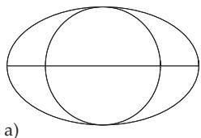
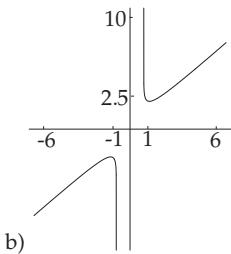
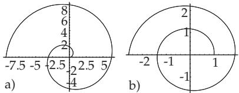

### 2. Functions

The diferentiation of a given function can be performed in a simplified manner with the operator D.   
With D[f[x], x], the derivative of the function f at the argument x will be determined.

D belongs to a group of diferential operations, which are enumerated in Table 20.12.

Table 20.12 Operations of diferentiation
<table><tr><td> $\overline { { \mathbb { D } [ f [ x ] , \{ x , n \} ] } }$   ${ \tt D } [ f , \{ x _ { 1 } , n _ { 1 } \} , \{ x _ { 2 } , n _ { 2 } \} , \cdot \cdot \cdot ]$  Dt[f]</td><td>yields the n-th derivative of function  $f ( x )$  with respect to x multiple derivatives,  $n _ { i } { \mathrm { - } } \mathrm { t h }$  derivative with respect to  $x _ { i }$   $( i = 1 , 2 , \cdots )$  the complete differential of the function f  $\textstyle { \frac { d f } { d x } }$ </td></tr><tr><td>the complete differential</td></tr></table>

A : In[1] : = D[Sqrt[x3 Exp[4x] Sin[x]], x]

$$
\mathcal { O } u t [ \mathcal { I } ] = \frac { \mathrm { E } ^ { 4 x } x ^ { 3 } \mathsf { C o s } [ x ] + 3 \mathrm { E } ^ { 4 x } x ^ { 2 } \mathsf { S i n } [ \mathbf { x } ] + 4 \mathrm { E } ^ { 4 x } x ^ { 3 } \mathsf { S i n } [ x ] } { 2 \sqrt { \mathrm { E } ^ { 4 x } x ^ { 3 } \mathsf { S i n } [ x ] } }
$$

$$
\mathbf { B } : \thinspace T n [ t ] : = \mathbb { D } [ ( 2 x + 1 ) ^ { 3 x } , x ] \longrightarrow \thinspace O u t [ t ] \thinspace = ( 1 + 2 x ) ^ { 3 x } \left( { \frac { 6 x } { 1 + 2 x } } + 3 \mathrm { L o g } \left[ 1 + 2 \mathbf { x } \right] \right)
$$

The command Dt results in the complete derivative or complete diferential.

$$
\equiv \mathrm { \bf ~ C } : \ : T n [ 1 ] : = \mathrm { D t } [ x ^ { 3 } + y ^ { 3 } ] \ : \longrightarrow \ : \ : O u t \ : [ 1 ] = 3 x ^ { 2 } \mathrm { D t } [ x ] + 3 y ^ { 2 } \mathrm { D t } [ y ]
$$

$$
\equiv \mathrm { ~ D : ~ } T n [ 1 ] : = \mathrm { D t } [ x ^ { 3 } + y ^ { 3 } , x ] \longrightarrow { \cal O } u t [ t ] = 3 x ^ { 2 } + 3 y ^ { 2 } \mathrm { D t } [ y , x ]
$$

In this last example, Mathematica supposes $y$ to be a function of $x ,$ which is not known, so it writes the second part of the derivative in a symbolic way. The preferable forms of writing are: $\mathsf { D } [ x [ t ^ { 3 } ] + y [ t ] ^ { 3 } , t ]$ and $\mathsf { D } [ x ^ { \hat { 3 } } + y [ x ] ^ { 3 } , x ]$ showing explicitly the independent variables.

If Mathematica finds a symbolic function while calculating a derivative, it leaves it in this general form, and expresses its derivative by $f ^ { \prime } { } .$

$$
| \textbf { E } \colon { \bar { I } } n [ t ] : = \mathbb { D } [ x \mathbf { \Delta } \mathbf { f } [ x ] ^ { 3 } , x ] \ \longrightarrow \ { \cal O } u t { \bar { } } { \bar { I } } { \bar { I } } = \mathbf { f } [ x ] ^ { 3 } + 3 x \mathbf { f } [ x ] ^ { 2 } \mathbf { f } ^ { \prime } [ x ]
$$

Mathematica knows the rules for diferentiation of products and quotients, it knows the chain rule, and it can apply these rules formally:

$$
{ \bf I } \ { \bf F } : \ T n [ { \boldsymbol { \imath } } { \boldsymbol { \jmath } } : = { \mathbb { D } } [ { \bf f } [ { \bf u } [ { \boldsymbol { x } } ] ] , \ x ] \ \longrightarrow \ { \boldsymbol { \cal O } } u t [ { \boldsymbol { \imath } } { \boldsymbol { \jmath } } ] = { \bf f ^ { \prime } } [ { \bf u } [ { \boldsymbol { x } } ] ] \ { \bf u ^ { \prime } } [ { \boldsymbol { x } } ]
$$

G : $I n [ { \boldsymbol { \mathit { 1 } } } ] : = \mathrm { D } [ \mathrm { u } [ { \boldsymbol { x } } ] / \mathbf { v } [ { \boldsymbol { x } } ] , { \boldsymbol { x } } ] \ \longrightarrow \ { \boldsymbol { \mathit { 0 u t } } } [ { \boldsymbol { \mathit { 1 } } } ] = { \frac { \mathrm { u } ^ { \prime } [ { \boldsymbol { x } } ] } { \mathrm { v } [ { \boldsymbol { x } } ] } } - { \frac { \mathrm { u } [ { \boldsymbol { x } } ] \ \mathrm { v } ^ { \prime } [ { \boldsymbol { x } } ] } { \mathrm { v } [ { \boldsymbol { x } } ] ^ { 2 } } }$

20.3.4.2 Indefinite Integrals

With the command Integrate $[ f , x ]$ , Mathematica tries to determine the indefinite integral $\int f ( x ) d x$

If Mathematica knows the integral, it gives it without the integration constant. Mathematica supposes that every expression not containing the integration variable does not depend on it.

In general, Mathematica finds an indefinite integral, if there exists one which can be expressed in closed form by elementary functions, such as rational functions, exponential and logarithmic functions, trigonometric and their inverse functions, etc. If Mathematica cannot find the integral, then it returns the original input. Mathematica knows some special functions which are defined by non-elementary integrals, such as the elliptic functions, and some others.

To demonstrate the possibilities of Mathematica, some examples will be shown, which are discussed in 8.1, p. 480f.

1. Integration of Rational Functions

(see also 8.1.3.3, p. 485f.)

$$
\mathbf { A } : I n [ { 1 } ] : = { \mathrm { I n t e g r a t e } } [ ( 2 x + 3 ) / ( x ^ { 3 } + x ^ { 2 } - 2 x ) , x ]
$$

$$
o u t [ 1 ] = \frac { 5 } { 3 } \mathrm { L o g } [ - 1 + x ] - \frac { 3 \mathrm { L o g } [ x ] } { 2 } - \frac { 1 } { 6 } \mathrm { L o g } [ 2 + x ]
$$

B : In[1] : = Integrate $[ ( x ^ { 3 } + 1 ) / ( x ( x - 1 ) ^ { 3 } ) ,$ , x]

$$
O u t [ 1 ] = - \frac { 1 } { ( - 1 + x ) ^ { 2 } } - \frac { 1 } { - 1 + x } + 2 \mathsf { L o g } [ - 1 + x ] - \mathsf { L o g } [ x ]\tag{20.35}
$$

On the monitor can be seen in the left corner of the next cell a plus sign. Clicking on it one may choose either the free-from input or the Wolfram-Alpha query. If one types the integral into one of these then there is given the possibility to have a look at all the details of the process of integration.

2. Integration of Trigonometric Functions

(see also 8.1.5, p. 491f.)

A: The example A in 8.1.5.2, p. 492, with the integral $\int \sin ^ { 2 } x \cos ^ { 5 }$ x dx is calculated (substitution is done by the program automatically, if needed):

$$
I n [ 1 ] : = { \mathrm { I n t e g r a t e } } [ { \mathrm { S i n } } [ x ] ^ { 2 } { \mathrm { C o s } } [ x ] ^ { 5 } , x ]
$$

$$
O u t [ 1 ] = \frac { 5 \mathrm { { S i n } [ \it { x } ] } } { 6 4 } - \frac { 1 } { 1 9 2 } \mathrm { { S i n } [ 3 \it { x } ] } - \frac { 3 } { 3 2 0 } \mathrm { { S i n } [ 5 \it { x } ] } - \frac { 1 } { 4 4 8 } \mathrm { { S i n } [ 7 \it { x } ] }
$$

B: The example B in 8.1.5.2, p. 492, with the integral $\int { \frac { \sin x } { \sqrt { \cos x } } }$ dx is calculated:

$$
{ \cal I } n [ t ] : = \mathrm { I n t e g r a t e } [ \mathrm { S i n } [ x ] / \mathrm { S q r t } [ \mathrm { C o s } [ x ] ] , x ] \longrightarrow { \cal O } u t [ t ] = - 2 \sqrt { \mathrm { C o s } [ x ] } .
$$

Remark: In the case of non-elementary integrals Mathematica may do nothing.

$$
\ln [ 1 ] : = \int x ^ { x } \mathrm { { d } x \longrightarrow \partial } { a } t [ 1 ] = \int \mathrm { { x } ^ { x } \mathrm { { d } x \mathrm { \Omega } } }
$$

20.3.4.3 Definite Integrals and Multiple Integrals

1. Definite Integrals

With the command Integrate $[ f , \{ x , x _ { a } , x _ { e } \} ]$ , Mathematica can evaluate the definite integral of the function $f ( x )$ with a lower limit $x _ { a }$ and upper limit $x _ { e }$

$$
\mathrm { ~ A : } \ T n [ { \cal I } ] : = \mathrm { I n t e g r a t e } [ \mathrm { E x p } [ - x ^ { 2 } ] , \left\{ x , 0 , \mathrm { I n f i n i t y } \right\} ] \longrightarrow \ { \cal O } u t [ t { \cal I } = \frac { \sqrt { \pi } } { 2 } ] .
$$

(see Table 21.8, p. 1098, No. 25 for $a = 1 )$

B: If the input is

$$
I n [ 1 ] : = \mathrm { I n t e g r a t e } [ \frac { 1 } { x ^ { 2 } } , \{ x , - 1 , 1 \} ] \qquad \mathrm { o n e ~ g e t s }
$$

$$
O u t ( { \it 1 } \bar { { z } } \mathrm { { / } } \bar { { z } } \mathrm { { / } } \bar { { z } } \mathrm { { / } } \bar { { z } } \mathrm { { / } } \bar { { z } } \mathrm { { / } } \bar { { z } } \mathrm { { / } } \bar { { z } } \mathrm { { / } } \bar { { z } } \mathrm { { / } } \bar { { z } } \mathrm { { / } } \bar { { z } } \mathrm { { / } } \bar { { z } } \mathrm { { / } } \bar { { z } } \mathrm { { / } } \bar { { z } } \mathrm { { / } } \bar { { z } } \mathrm { { / } } \bar { { z } } \mathrm { { / } } \bar { { z } } \mathrm { { / } } \bar { { z } } \mathrm { { / } } \bar { { z } } \mathrm { { / } } \bar { { z } } \mathrm { { / } } \bar { { z } } \mathrm { { / } } \bar { { z } } \mathrm { { / } } \bar { { z } } \mathrm { { / } } \bar { { z } } \mathrm { { / } } \bar { { z } } \mathrm { { / } } \bar { { z } } \mathrm { { / } } \bar { { z } } \mathrm { { / } } \bar { { z } } \mathrm { { / } } \bar { { z } } \mathrm { { / } } \bar { { z } } \mathrm { { / } } \bar { { z } } \mathrm { { / } } \bar { { z } } \mathrm { { / } } \bar { { z } } \mathrm { { / } } \bar { { z } } \mathrm { { / } } \bar { { z } } \mathrm { { / } } \bar { { z } } \mathrm { { / } } \bar { { z } } \mathrm { { / } } \bar { { z } } \mathrm { { / } } \bar { { z } } \mathrm { { / } } \bar { { z } } \mathrm { { / } } \bar { { z } } \mathrm { { / } } \bar { { z } } \mathrm { { / } } \bar { { z } } \mathrm { { / } } \bar { { z } } \mathrm { { / } } \bar { { z } } \mathrm { { / } } \bar { { z } } \mathrm { { / } } \bar { { z } }
$$

In the calculation of definite integrals one should be careful. If the properties of the integrand are not known, then it is recommended to ask for a graphical representation of the function in the considered domain before integration.

2. Multiple Integrals

Definite double integrals can be called by the command

$$
\mathtt { I n t e g r a t e } [ \mathbf { f } \left[ x , y \right] , \left\{ x , x _ { a } , x _ { e } \right\} , \left\{ y , y _ { a } , y _ { e } \right\} ]\tag{20.36}
$$

The evaluation is performed from right to left, so, first the integration is evaluated with respect to y. The limits $y _ { a }$ and $y _ { e }$ can be functions of $x ,$ which are substituted into the primitive function. Then the integral is evaluated with respect to x.

For the integral A, which calculates the area between a parabola and a line intersecting it twice, in 8.4.1.2, p. 524, one gets

$$
\bar { I n } [ I ] : = \mathrm { { I n t e g r a t e } } [ x ~ y ^ { 2 } , \{ x , 0 , 2 \} , \{ y , x ^ { 2 } , 2 x \} ] \longrightarrow \ O u t [ I ] = \frac { 3 2 } { 5 } .
$$

Also in this case, it is important to be careful with the discontinuities of the integrand. The domain of integration can also be specified with inequalities: Integrate[Boole $[ x ^ { 2 } + y ^ { 2 } \leq \tilde { 1 } , \{ x , - 1 , 1 \} , \{ y , - 1 , 1 \} ] ]$ gives π.

20.3.4.4 Solution ofDiferential Equations

Mathematica can handle ordinary diferential equations symbolically if the solution can be given in closed form. In this case, Mathematica gives the solution in general. The commands discussed here are listed in Table 20.13.

The solutions (see 9.1, p. 540) are represented as general solutions with the arbitrary constants $C [ i ]$ Initial values and boundary conditions can be introduced in the part of the list which contains the equation or equations. In this case a special solution is returned. As examples, two diferential equations are solved here from 9.1.1.2, p. 542.

$$
I n [ \boldsymbol { \boldsymbol { \mathit { 1 } } } \boldsymbol { \mathit { 1 } } ] : = \mathrm { D S o l v e } [ \boldsymbol { \boldsymbol { y } } ^ { \prime } [ \boldsymbol { \boldsymbol { x } } ] - \boldsymbol { y } [ \boldsymbol { \boldsymbol { x } } ] \ \mathrm { T a n } [ \boldsymbol { \boldsymbol { x } } ] = = \mathrm { C o s } [ \boldsymbol { \boldsymbol { x } } ] , \boldsymbol { y } , \boldsymbol { x } ]
$$

A: The solution of the diferential equation $y ^ { \prime } ( x ) - y ( x )$ tan $x = \cos x $ is to be determined.

Mathematica solves this equation, and gives the solution as a pure function with the integrations constant C[1].

Table 20.13 Commands to solve diferential equations
<table><tr><td> $\overline { { \mathsf { D S o l v e } [ d e q , y [ x ] , x ] } }$ </td><td>solves the differential equation for  $y [ x ]$  (if it is possible);  $y [ x ]$  may be given in implicit form</td></tr><tr><td> $\mathtt { D S o l v e } [ d e q , y , x ]$ </td><td>gives the solution of the differential equation in the form of a</td></tr><tr><td> $\mathtt { D S o l v e } [ \{ d e q _ { 1 } , d e q _ { 2 } , \ldots \} , y , x ]$ </td><td>pure function solves a system of ordinary differential equations</td></tr></table>

$$
{ \cal O } u t ( t { \cal J } = \{ \{ y  \mathrm { { \cal { F } } u n c t i o n } [ { \bf x } , { \cal { C } } [ 1 ] \mathrm { { \cal ~ S e c } } [ { \bf x } ] + \mathrm { { \cal { S } } e c } [ { \bf x } ] ( \frac { x } { 2 } + \frac { 1 } { 4 } \mathrm { { \cal { S } } i n } [ 2 { \bf { x } } ] ) ] \} \} \} _ { \mathrm { { \cal { H } } } } ^ { \mathrm { { } } } ) .
$$

If it is required to get the solution value $y [ x ]$ , then Mathematica gives

$$
T n [ 2 { \cal { I } } : = y [ x ] / \cdot \stackrel { \triangledown } { \boldsymbol { \mathcal { I } } } 0 1 \longrightarrow \left. O u t \right. [ 2 { \cal { J } } = \left\{ \mathrm { C } [ 1 ] \mathrm { S e c } [ x ] + \mathrm { S e c } [ x ] \left( \frac { x } { 2 } + \frac { 1 } { 4 } \mathrm { S i n } [ 2 x ] \right) \right\}
$$

One also could make the substitution for other quantities, e.g., for $y ^ { \prime } [ x ] \mathrm { o r } y [ 1 ]$ . The advantage of using pure functions is obvious here.

B: The solution of the diferential equation $y ^ { \prime } ( x ) x ( x - y ( x ) ) + y ^ { 2 } ( x ) = 0 { \mathrm { ~ ( s e e ~ } } 9 . 1 . 1 . 2 , \mathbf { 2 . } , \mathbf { p . } 5 4 2 { \mathrm { ) } }$ is to be determined.

$$
I n [ { \cal { 1 } } ] : = \mathrm { D S o l v e } [ y ^ { \prime } [ x ] ~ x ( x - y [ x ] ) + y [ x ] ^ { \wedge } 2 = = 0 , y [ x ] , x ]
$$

$$
0 u t [ 1 ] = \left\{ \left\{ y [ x ] \ \longrightarrow \ - \mathrm { x } \mathrm { P r o d u c t L o g } [ - \frac { E ^ { - \mathrm { C } [ 1 ] } } { x } ] \right\} \right\}
$$

Here ProductLog[z] gives the principal solution for w in $z = w e ^ { w }$ . The solution of this diferentia equation was given in implicit form (see 9.1.1.2, 2., p. 542)

If Mathematica cannot solve a diferential equation it returns the input without any comment. In such cases, or also, if the symbolic solution is too complicated, the solutions can be found by numerical solutions (see 19.8.4.2, 5., p. 1018). Also in the case of symbolic solutions of diferential equations, like in the evaluation of indefinite integrals, the eficiency of Mathematica should not be overestimated. If the result cannot be expressed as an algebraic expression of elementary functions, the only way is to find a numerical solution.

Remark: Mathematica can solve some partial diferential equations both symbolically and numerically, as well, even on complicated multidimensional domains.

20.4 Graphics with Mathematica

By providing routines for graphical representation of mathematical relations such as the graphs of functions, space curves, and surfaces in three-dimensional space, modern computer algebra systems provide extensive possibilities for combining and manipulating formulas, especially in analysis, vector calculus, and diferential geometry, and they provide immeasurable help in engineering designing. Graphics is a special strength of Mathematica.

20.4.1 Basic Elements ofGraphics

Mathematica builds graphical objects from built-in graphics primitives. These are objects such as points (Point), lines (Line) and polygons (Polygon) and properties of these objects such as thickness and color.

Mathematica has several options to specify the environment for graphics and how the graphical objects should be represented.

With the command Graphics[list], where list is a list of graphics primitives, Mathematica is called to generate a graphic from the listed objects. The object list can follow a list of options about the appearance of the representation.

With the input

$$
\begin{array} { r } { I n [ t ] : = g = \mathtt { G r a p h i c s } [ \{ \mathtt { L i n e } [ \{ \{ 0 , 0 \} , \{ 5 , 5 \} , \{ 1 0 , 3 \} \} ] , \mathtt { C i r c l e } [ \{ 5 , 5 \} , 4 ] , } \end{array}\tag{20.37a}
$$

$$
\mathtt { T e x t } [ \mathtt { S t y l e } [ \mathrm { ^ { \circ } E x a m p l e ^ { \gamma } } , \mathrm { ^ { \circ } H e l v e t i c a ^ { \gamma } } , \mathrm { B o l d } , \mathrm { 2 5 } ] , \{ 5 , 6 \} ] \} , \mathtt { A s p e c t R a t i o - > A u t o m a t i c } ]\tag{20.37b}
$$

a graphic is built from the following elements:

  
Figure 20.1

a) Broken line of two line segments starting at the point (0, 0) through the point (5, 5) to the point (10, 3).

b) Circle with the center at (5, 5) and radius 4.

c) Text with the content “Example”, written in Helvetica font, boldface (the text appears centered with respect to the reference point (5, 6)). With the call Show[g], Mathematica displays the figure (Fig. 20.1).

Certain options might be previously specified. Here the option AspectRatio is set to Automatic.

By default Mathematica makes the ratio of the height to the width of the graph 1 : GoldenRatio (see e.g. 3.5.2.3,3., p. 194). It corresponds to a relation between the extension in the x direction to the one in $1 : 1 / 1 . 6 1 8 = 1 : 0 . 6 1 8$ . With this option the circle would be deformed into an ellipse. The value of the option Automatic ensures that the representation is not deformed.

20.4.2 Graphics Primitives

Mathematica provides the two-dimensional graphic objects enumerated in Table 20.14.

Besides these objects Mathematica provides further primitives to control the appearance of the representation, the graphics commands. They specify how graphic objects should be represented. The commands are listed in Table 20.15.

There is a wide scale of colors to choose from but their definitions are not discussed here.

Table 20.14 Two-dimensional graphic objects  
Point[ x, y ] point at position x, y   
$\mathtt { L i n e } [ \{ { \hat { x } } _ { 1 } , y _ { 1 }  \hat { \} } , \{ x _ { 2 } , y _ { 2 } \} , . . . \} ]$ broken line through the given points   
Rectangle $[ \{ x _ { l u } , y _ { l u } \} , \{ x _ { r o } , \bar { y _ { r o } } \} ]$ shaded rectangle with the given coordinates left-down, right-up   
$\mathtt { P o l y g o n } [ \{ \{ x _ { 1 } , y _ { 1 } \} , \{ x _ { 2 } , y _ { 2 } \} , . . . \} ]$ shaded polygon with the given vertices   
$\mathtt { C i r c l e } [ \{ x , y \} , r ]$ circle with radius r around the center x, y   
$\mathtt { C i r c l e [ \{ \xi , y \} , \vec { r _ { \cdot } } \{ \alpha _ { 1 } , \alpha _ { 2 } \} ] }$ circular arc with the given angles as limits   
$\mathtt { C i r c l e } [ \{ x , y \} , \{ a , b \} ]$ ellipse with half-axes a and b   
$\mathtt { C i r c l e } [ \{ x , y \} , \{ a , b \} , \{ \alpha _ { 1 } , \alpha _ { 2 } \} ]$ elliptic arc   
$\mathtt { D i s k } [ \{ { \overset { . } { x } } , y \} , { \overset { . } { r } } ] , \mathtt { D i s k } [ \{ x , y \} , \{ { \overset { . } { a } } , b \} ]$ shaded circle or ellipse   
$\operatorname { T e x t } [ i e x t , \overbrace { \{ x , y \} } ]$ writes text centered to the point x, y

Table 20.15 Graphics commands
<table><tr><td>PointSize[a]</td><td>a dot is drawn with radius a as a fraction of the total picture</td></tr><tr><td>AbsolutePointSize[b]</td><td>denotes the absolute radius b of the dot (measured in American pt (0.3515 mm))</td></tr><tr><td>Thickness[a]</td><td>draws lines with relative thickness a</td></tr><tr><td>AbsoluteThickness[b]</td><td>draws lines with absolute thickness b (also in pt)</td></tr><tr><td>Dashing  $\left\{ a _ { 1 } , a _ { 2 } , a _ { 3 } , . . . \right\} ]$ </td><td>draws a line as a sequence of stripes with the given length (in</td></tr><tr><td>AbsoluteDashing  $\left. b _ { 1 } , b _ { 2 } , \ldots \right. ]$ </td><td>relative measure)</td></tr><tr><td></td><td>the same as the previous one but in absolute measure</td></tr><tr><td>GrayLevel[p]</td><td>specifies the level of shade  $( p = 0$  is for black, p = 1 is for white)</td></tr></table>

20.4.3 Graphical Options

Mathematica provides several graphical options which have an influence on the appearance of the entire picture. Table 20.16 gives a selection of the most important commands. For a detailed explanation, see [20.16].

Table 20.16 Some graphical options  
AspectRatio > w sets the ratio w of hei ht and width. determines   
w from the absolute coordinates; the default setting is   
w = 1 : GoldenRatio   
Axes > True draws coordinate axes   
Axes > False does not draw coordinate axes   
Axes > True, False shows only the x-axis   
Frame > True shows frames   
GridLines > Automatic shows grid lines   
AxesLabel $ \{ x _ { s y m b o l } , y _ { s y m b o l } \}$ denotes axes with the given symbols   
Ticks > Automatic denotes scalin marks automaticall with the can be   
suppressed   
$\mathrm { T i c k s }  \{ \{ x _ { 1 } , x _ { 2 } , . . . \} , \{ y _ { 1 } , y _ { 2 } , . . . \} \}$ scaling marks are placed at the given nodes

20.4.4 Syntax ofGraphical Representation

20.4.4.1 Building Graphic Objects

If a graphic object is to be built from primitives, then first a list of the corresponding objects with their global definition should be given in the form

$$
\{ o b j e c t _ { 1 } , o b j e c t _ { 2 } , . . . \} ,\tag{20.38a}
$$

where the objects themselves can be lists of graphic objects. Let object1 be, e.g.,

$$
I n [ t ] : = o 1 = \{ \mathrm { C i r c l e } [ \{ 5 , 5 \} , \{ 5 , 3 \} ] , \mathrm { L i n e } [ \{ \{ 0 , 5 \} , \{ 1 0 , 5 \} \} ] \}
$$

and corresponding to it

$$
I n [ 2 ] : = o 2 = \{ { \tt C i r c l e } [ \{ 5 , 5 \} , 3 ] \}
$$

as in Fig.20.1. If a graphic object, e.g., o2, is to be provided with certain graphical commands, then it should be written into one list with the corresponding command

$$
I n [ 3 ] : = o 3 = \{ \mathrm { T h i c k n e s s } [ 0 . 0 1 ] , o 2 \}
$$

This command is valid for all objects in the corresponding braces, and also for nested ones, but not for the objects outside of the braces of the list.

From the generated objects two diferent graphic lists are defined:

$$
I n [ 4 ] : = g 1 = { \mathrm { G r a p h i c s } } [ \{ o 1 , o 2 \} ] ; g 2 = { \mathrm { G r a p h i c s } } [ \{ o 1 , o 3 \} ]
$$

which difers only in the second object by the thickness of the circle. The call

$$
\mathtt { S h o w } [ g 1 ] \ \mathrm { ~ a n d ~ } \ \mathtt { S h o w } [ g 2 , \mathtt { A x e s } \ \to \ \mathtt { T r u e } ]\tag{20.38b}
$$

givs the pictures represented in Fig. 20.2.

In the call of the picture in Fig. 20.2b, the option Axes > True was activated. This results in the representation of the axes with marks on them chosen by Mathematica and with the corresponding scaling.

20.4.4.2 Graphical Representation of Functions

Mathematica has special commands for the graphical representation of functions. With

$$
\mathbb { P } 1 \mathrm { o t } [ \mathbf { f } \left[ x \right] , \left\{ x , x _ { m i n } , x _ { m a x } \right\} ]\tag{20.39}
$$

the function f is represented graphically in the domain between $x = x _ { m i n }$ and $x = x _ { m a x }$ . Mathematica produces a function table by internal algorithms and reproduces the graphics following from this table by graphics primitives.

  
Figure 20.2

  
Figure 20.3

If the function $x \mapsto$ sin 2x is to be graphically represented in the domain between 2π and 2π, then the input is

$$
I n [ 1 ] : = \mathrm { P l o t } [ \mathrm { S i n } [ 2 x ] , \{ x , - \mathrm { 2 P i } , \mathrm { 2 P i } \} ] .
$$

Mathematica produces the curve shown in Fig. 20.3.

It is obvious that Mathematica uses certain default graphical options in the representation as mentioned in 20.4.1, p. 1045. So, the axes are automatically drawn, they are scaled and denoted by the corresponding x and y values. In this example, the influence of the default AspectRatio can be seen. The ratio of the total width to the total height is 1 : 0.618.

With the command InputForm[%] the whole representation of the graphic objects can be shown. For the previous example one gets:

Graphics[ , , Directive[Opacity[1.], RGBColor[0.368417, 0.506779, 0.709798],

AbsoluteThickness[1.6]], Line[ -6.283185050723043, 2.5645654335783057\*−7 ,

..., 6.283185050723043, -2.5645654335783057\*−7 ], DisplayFunction -> Identity,

AspectRatio -> GoldenRatio(−1), Axes -> True, True , AxesLabel -> None, None ,

AxesOrigin -> 0, 0 , DisplayFunction :> Identity,

Frame -> False, False , False, False , FrameLabel -> None, None ,

None, None , FrameTicks -> Automatic, Automatic , Automatic, Automatic ,

GridLines -> None, None , GridLinesStyle -> Directive[GrayLevel[0.5, 0.4]],

Method -> "DefaultBoundaryStyle" -> Automatic, "ScalingFunctions" -> None ,

PlotRange -> -2\*Pi, 2\*Pi , -0.9999996654606427, 0.9999993654113022 ,

PlotRangeClipping -> True, PlotRangePadding -> Scaled[0.02], Scaled[0.02] ,

Scaled[0.05], Scaled[0.05] , Ticks -> Automatic, Automatic ]

Consequently, the graphic object consists of a few sublists. The first one contains the graphics primitive Line (slightly modified), with which the internal algorithm connects the calculated points of the curve by lines. The second sublist contains the options needed by the given graphic. These are the default options. If the picture is to be altered at certain positions, then the new settings in the Plot command must be set after the main input. With

$$
I n [ 2 ] : = { \mathrm { P l o t } } [ { \mathrm { S i n } } [ 2 x ] , \{ x , - 2 { \mathrm { P i } } , 2 { \mathrm { P i } } \} , { \mathrm { A s p e c t R a t i o - } } 1 ]\tag{20.40}
$$

the representation would be done with equal length of axes x and y.

It is possible to give several options at the same time after each other.With the input

$$
\mathrm { P l o t } [ \{ f _ { 1 } [ x ] , f _ { 2 } [ x ] , \ldots \} , \{ x , x _ { m i n } , x _ { m a x } \} ]\tag{20.41}
$$

several functions are shown in the same graphic. With the command

Show[plot, options]

(20.42)

an earlier picture can be renewed with other options.With

$$
\mathtt { S h o w } [ \mathtt { G r a p h i c s A r r a y } [ l i s t ] ] ,\tag{20.43}
$$

(with list as lists of graphic objects) pictures can be placed next to each other, under each other, or they can be arranged in matrix form.

20.4.5 Two-Dimensional Curves

A series of curves from the chapter on functions and their representations (see 2.1, p. 48f.) is shown as examples.

20.4.5.1 Exponential Functions

A family of curves with several exponential functions (see 2.6.1, p. 72) is generated by Mathematica (Fig. 20.4a) with the following input:

$$
I n [ 1 ] : = \mathbf { f } [ x _ { - } ] : = 2 ^ { \wedge } x ; \mathbf { g } [ x _ { - } ] : = 1 0 ^ { \wedge } x ;
$$

$$
I n [ 2 J : = \mathtt { h } [ x _ { - } ] : = ( 1 / 2 ) ^ { \wedge } x ; \mathtt { j } [ x _ { - } ] : = ( 1 / \mathtt { E } ) ^ { \wedge } x ; \mathtt { k } [ x _ { - } ] : = ( 1 / 1 0 ) ^ { \wedge } x ;
$$

These are the definitions of the considered functions. There is no need to define the function $e ^ { x }$ , since it is built into Mathematica. In the second step the following graphics are generated:

$$
I n [ 3 J : = p 1 = \mathbb { P } ] \circ \mathbf { 1 } [ \{ \mathbf { f } [ x ] , \mathbf { h } [ x ] \} , \{ x , - 4 , 4 \} , P l o t S t y l e \sim \mathbb { D } \mathrm { a s h i n g } [ \{ 0 . 0 1 , 0 . 0 2 \} ] ]
$$

$$
I n [ 4 ] : = p 2 = \mathrm { P l o t } [ \{ \mathrm { E x p } [ x ] , \mathrm { j } [ x ] \} , \{ x , - 4 , 4 \} ]
$$

$$
T n [ S ] : = p 3 = \mathbb { P } { \mathrm { 1 o t } } \big [ \{ \mathbf { g } [ x ] , \mathbf { k } [ x ] \} , \{ x , - 4 , 4 \} , \mathbb { P } { \mathrm { 1 o t } } \mathbb { S } \mathbf { t } \mathbf { y } { \mathrm { 1 e } } \to \mathbb { D } { \mathrm { a s h i n g } } \big [ \{ 0 . 0 0 5 , 0 . 0 2 , 0 . 0 1 , 0 . 0 2 \} \big ] \big ]
$$

The whole picture (Fig. 20.4a) can be obtained by:

$$
\begin{array} { r } { I n [ 6 7 : = { \mathrm { S h o w } } [ \{ p 1 , p 2 , p 3 \} , { \mathrm { P l o t R a n g e } }  \{ 0 , 1 8 \} , { \mathrm { A s p e c t R a t i o } }  1 . 2 ] } \end{array}
$$

The question of how to write text on the curves is not discussed here. This is possible with the graphics primitive Text.

  
a)

  
Figure 20.4

20.4.5.2 Function y = x + Arcoth x

Considering the properties of the function Arcoth x discussed in 2.10, p. 93, the function $y = x +$ Arcoth x can be graphically represented in the following way:

$$
I n [ 1 ] : = f 1 = \mathrm { P l o t } [ x + \mathrm { A r c C o t h } [ x ] , \{ x , 1 . 0 0 0 0 0 0 0 0 0 0 5 , 7 \} ]
$$

$$
I n [ 2 J : = f 2 = { \mathsf { P l o t } } [ x + { \mathsf { A r c C o t h } } [ x ] , \{ x , - 7 , - 1 . 0 0 0 0 0 0 0 0 0 0 5 \} ]
$$

$$
I n [ 3 ] : = { \mathrm { S h o w } } [ \{ f 1 , f 2 \} , { \mathrm { P l o t R a n g e } } \to \{ - 1 0 , 1 0 \} , { \mathrm { A s p e c t R a t i o } } \to 1 . 2 , { \mathrm { T i c k s } } \to { \mathrm { V o l o t R a t i o } } { \mathrm { R a t i o } } ] { \mathrm { } } ,
$$

$$
\{ \{ \{ - 6 , - 6 \} , \{ - 1 , - 1 \} , \{ 1 , 1 \} , \{ 6 , 6 \} \} , \{ \{ 2 . 5 , 2 . 5 \} , \{ 1 0 , 1 0 \} \} \} , \mathtt { A x e s o r i g i n - > 0 , 0 } \}
$$

The high precision of the x values in the close neighborhood of 1 and 1 was chosen to get suficiently large function values for the required domain of y. The result is shown in Fig. 20.4b.

(20.44a)

20.4.5.3 Bessel Functions (see 9.1.2.6, 2., p. 562)

With the calls

In[1] := bj0 = Plot[ BesselJ[0, z], BesselJ[2, z], Bessel ${ \cal J } [ 4 , z ] \} ] , \{ z , 0 , 1 0 \}$ , PlotLabel >

$$
I n [ 2 ] : = b j 1 = \mathtt { P l o t } [ \{ \mathtt { B e s s e l J } [ 1 , z ]\tag{20.44b}
$$

the graphics of the Bessel function $J _ { n } ( z )$ for $n = 0 , 2 .$ 4 and $n = 1 , 3 ,$ 5 are generated, which are then represented by the call

$$
I n [ 3 ] : = { \mathrm { G r a p h i c s R o w } } [ \{ b j 0 , b j 1 \} ] ]
$$

next to each other in Fig. 20.5.

b)  
  
Figure 20.5

20.4.6 Parametric Representation ofCurves

Mathematica has a special graphics command, with which curves given in parametric form can be graphically represented. This command is:

$$
\mathtt { P a r a m e t r i c P l o t } [ \{ f _ { x } ( t ) , f _ { y } ( t ) \} , \{ t , t _ { 1 } , t _ { 2 } \} ] .\tag{20.45}
$$

It provides the possibility of showing several curves in one graphic. A list of several curves must be given in the command. With the option AspectRatio > Automatic, Mathematica shows the curves in their natural forms.

The parametric curves in Fig. 20.6 are the Archimedean spiral (see 2.14.1, p. 105) and the logarithmic spiral (see 2.14.3, p. 106). They are represented with the input

In[1] := ParametricPlot[ t Cos[t], t Sin[t] , t, 0, 3Pi , AspectRatio > Automatic] and

$$
\begin{array} { r l } & { I n [ 2 \bar { \jmath } : = \mathrm { P a r a m e t r i c P l o t } [ \{ \mathrm { E x p } [ 0 . 1 t ] \mathrm { C o s } [ t ] , \mathrm { E x p } [ 0 . 1 t ] \mathrm { S i n } [ t ] \} , \{ t , 0 , 3 \mathrm { P i } \} , } \\ & { \quad \quad \quad \mathrm { A s p e c t R a t i o - > \mathrm { A u t o m a t i c } } ] } \end{array}
$$

With

In[3] := ParametricPlot[ t 2 Sin[t], 1 2 Cos[t] , t, Pi, 11Pi , AspectRatio > 0.3] a trochoid (see 2.13.2, p. 102) is generated (Fig. 20.7).

  
Figure 20.6

  
Figure 20.7

20.4.7 Representation ofSurfaces and Space Curves

Mathematica provides the possibility of representing three-dimensional graphics primitives.

#### 本节续页

- [（续2）](<22 Bibliography - 2. Functions-2.md>)
- [（续3）](<22 Bibliography - 2. Functions-3.md>)
- [（续4）](<22 Bibliography - 2. Functions-4.md>)
- [（续5）](<22 Bibliography - 2. Functions-5.md>)
- [（续6）](<22 Bibliography - 2. Functions-6.md>)
- [（续7）](<22 Bibliography - 2. Functions-7.md>)
- [（续8）](<22 Bibliography - 2. Functions-8.md>)
- [（续9）](<22 Bibliography - 2. Functions-9.md>)
- [（续10）](<22 Bibliography - 2. Functions-10.md>)
- [（续11）](<22 Bibliography - 2. Functions-11.md>)
- [（续12）](<22 Bibliography - 2. Functions-12.md>)
- [（续13）](<22 Bibliography - 2. Functions-13.md>)
- [（续14）](<22 Bibliography - 2. Functions-14.md>)
- [（续15）](<22 Bibliography - 2. Functions-15.md>)
