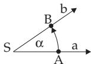
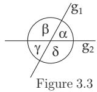
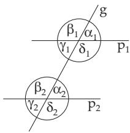

#### 3.1.1 Basic Notations

##### 3.1.1.1 Point, Line, Ray, Segment

1. Point and Line

Points and straight lines are not defined in today’s mathematics. The relations between them are determined only by axioms. The line is graphically imaginable as a trace of a point moving in a plane along the shortest route between two diferent points without changing its direction.

A point is the intersection of two lines.

2. Closed Half-Line or Ray, and Segment

A ray is the set of points of a line which are exactly on one side of a given point O, including this point O. A ray is imaginable as the trace of a point which starts at O and moves along the line without changing its direction, like a beam of light after its emission until it is not led out of its way.

A segment AB is the set of points of a line lying between two given points A and B of this line, including the points A and B. The segment is the shortest connection between the two points A and B in a

plane. The direction class of a segment is denoted by an arrowhead $\stackrel { \longrightarrow } { A B }$ , or its direction starts at the first mentioned point A, and ends at the second B.

3. Parallel and Orthogonal Lines

Parallel lines run in the same direction; they have no common points, i.e., they do not move of and do not approach each other, and they do not have any intersection point. The parallelism of two lines g and g is denoted by $g | | g ^ { \prime }$

Orthogonal lines form a right angle at their intersection, i.e., they are perpendicular to each other.   
Orthogonality and parallelism are mutual positions of two lines.

##### 3.1.1.2 Angle

  
Figure 3.1

1. Notion of Angle

An angle is defined by two rays a and b starting at the same point S, so they can be transformed into each other by a rotation (Fig. 3.1). If A is a point on the ray a and B is on the ray b, then the angle in the direction given in Fig. 3.1 is denoted by the symbols $( a , b )$ or by <) $A \check { S } B .$ , or by a Greek letter. The point S is called the vertex, the rays a and b are called sides or legs of the angle.

In mathematics, an angle is called positive or negative depending on the rotation being counterclockwise or clockwise respectively. It is important to distinguish the angle <) ASB from the angle <) BSA. Actually, $\sharp A S B = \dot { - } \mathbin { \vrule B S A } \ ( 0 \leq \dot { \ast } A S B \leq 1 8 0 ^ { \circ } )$ and <) $A S B = \stackrel { \smile } { 3 } 6 0 ^ { \circ } - \ngeq B S A ~ ( 1 8 0 ^ { \circ } \leq \pounds X B \leq$ 360◦) holds.

Remark: In geodesy the positive direction of rotation is defined by the clockwise direction (see 3.2.2.1, p. 144).

2. Names of Angles

Angles have diferent names according to the diferent positions of their legs. The names given in Table 3.1 are used for angles α in the interval $0 \leq \alpha \leq 3 \bar { 6 } 0 ^ { \circ }$ (see also Fig. 3.2).

<table><tr><td rowspan=1 colspan=1>Names of angles</td><td rowspan=1 colspan=1>Degree</td><td rowspan=1 colspan=1>Radian</td><td rowspan=1 colspan=1>[Names of angles</td><td rowspan=1 colspan=1>Degree</td><td rowspan=1 colspan=1>Radian</td></tr><tr><td rowspan=1 colspan=1>round (full) angle</td><td rowspan=1 colspan=1> $\boxed { \alpha ^ { \circ } = 3 6 0 ^ { \circ } }$ </td><td rowspan=1 colspan=1> $\overline { { \alpha = 2 \pi } }$ </td><td rowspan=1 colspan=1>right angle</td><td rowspan=1 colspan=1> $\overline { { { \alpha } ^ { \circ } = 9 0 ^ { \circ } } }$ </td><td rowspan=1 colspan=1> $\overline { { \alpha = \pi / 2 } }$ </td></tr><tr><td rowspan=1 colspan=1>convex angle</td><td rowspan=1 colspan=1> $\boxed { \alpha ^ { \circ } > 1 8 0 ^ { \circ } }$ </td><td rowspan=1 colspan=1> $\overline { { \pi < \alpha < 2 \pi } }$ </td><td rowspan=1 colspan=1>acute angle</td><td rowspan=1 colspan=1> $0 ^ { \circ } < \alpha ^ { \circ } < 9 0 ^ { \circ }$ </td><td rowspan=1 colspan=1> $\overline { { 0 ^ { \circ } < \alpha < \pi / 2 } }$ </td></tr><tr><td rowspan=1 colspan=1>straight angle</td><td rowspan=1 colspan=1> $\overline { { \alpha = 1 8 0 ^ { \circ } } }$ </td><td rowspan=1 colspan=1> $\alpha = \pi$ </td><td rowspan=1 colspan=1>obtuse angle</td><td rowspan=1 colspan=1> $\boxed { 9 0 ^ { \circ } < \alpha < 1 8 0 ^ { \circ } }$ </td><td rowspan=1 colspan=1> $\overline { { \pi / 2 < \alpha < \pi } }$ </td></tr></table>

Table 3.1 Names of angles in degree and radian measure  
Figure 3.2

##### 3.1.1.3 Angle Between Two Intersecting Lines

At the intersection point of two lines $g _ { 1 } , g _ { 2 }$ there are four angles $\alpha , \beta , \gamma , \delta$ (Fig. 3.3). There are to be distinguished adjacent angles, vertex angles, complementary angles, and supplementary angles.

1. Adjacent Angles are neighboring angles at the intersection point of two lines with a common vertex S, and with a common leg; both noncommon legs are on the same line, they are rays starting from S but in opposite directions, so adjacent angles sum to 180◦.

In Fig. 3.3 the pairs $( \alpha , \beta ) , ( \beta , \gamma ) , ( \gamma , \delta )$ and $( \alpha , \delta )$ are adjacent angles. 2. Vertex Angles are the angles at the intersection point of two lines, opposite to each other, having the same vertex S but no common leg, and being equal. They sum to $1 8 \bar { 0 } ^ { \circ }$ by the same adjacent angle.

In Fig. 3.3 (α, γ) and $( \beta , \delta )$ are vertex angles.

3. Complementary Angles are two angles summing to 90◦.

4. Supplementary Angles are two angles summing to 180◦.

In Fig. 3.3 the pairs of angles (α, β) or (γ, δ) are supplementary angles.

##### 3.1.1.4 Pairs of Angles with Intersecting Parallels

Intersecting two parallel lines $p _ { 1 } , p _ { 2 }$ by a third one g yields eight angles (Fig. 3.4). Besides the adjacent and vertex angles with the same vertex S , alternate angles, opposite angles, and corresponding (exterior–interior) angles are to be distinguished with diferent vertices.

Figure 3.4

1. Alternate Angles have the same size. They are on the opposite sides of the intersecting line g and of the parallel lines $p _ { 1 } , p _ { 2 }$ . The legs of alternate angles are in pairs oppositely oriented.

In $\mathrm { F i g . 3 . 4 , e . g . , } ( \alpha _ { 1 } , \gamma _ { 2 } ) , ( \beta _ { 1 } , \delta _ { 2 } ) , ( \gamma _ { 1 } , \alpha _ { 2 } ) , ( \delta _ { 1 } , \beta _ { 2 } )$ are alternate angles.

2. Corresponding or Exterior–Interior Angles have the same size. They are on the same sides of the intersecting line g and of the parallel lines $p _ { 1 } , p _ { 2 }$ . The legs of corresponding angles are oriented in pairs in the same direction.

In Fig. 3.4 the pairs of angles $( \alpha _ { 1 } , \alpha _ { 2 } ) , ( \beta _ { 1 } , \beta _ { 2 } ) , ( \gamma _ { 1 } , \gamma _ { 2 } )$ , and $( \delta _ { 1 } , \delta _ { 2 } )$ are corresponding angles.

3. Opposite Angles are on the same side of the intersecting line g but on diferent sides of the parallel lines $p _ { 1 } , p _ { 2 }$ . They sum to $1 8 0 ^ { \circ }$ . One pair of legs has the same orientation, the other one is oppositely oriented.

In Fig. 3.4, e.g., the pairs of angles $( \alpha _ { 1 } , \delta _ { 2 } ) , ( \beta _ { 1 } , \gamma _ { 2 } ) , ( \gamma _ { 1 } , \beta _ { 2 } )$ , and $( \delta _ { 1 } , \alpha _ { 2 } )$ are opposite angles.

0.007611:0.000291 = 26 + 0.000025

##### 3.1.1.5 Angles Measured in Degrees and in Radians

In geometry, the measurement of angles is based on the division of the full angle into 360 equal parts or 360◦ (degrees). This is called measure in degrees. Further division of degrees is not a decimal one, it is sexagesimal: $1 ^ { \circ } = 6 0 ^ { \prime }$ (minute, or sexagesimal minute), $1 ^ { \prime } = 6 0 ^ { \prime \prime }$ (second, or sexagesimal second). For grade measure see 3.2.2.2, p. 146 and the remark below.

Besides measure in degrees the radian measure is used to define the size of an angle. The size of the central angle α of an arbitrary circle (Fig. 3.5a) is given as the ratio of the corresponding arc-length l and the radius of the circle r:

$$
\alpha = { \frac { l } { r } } .\tag{3.1}
$$

$$
1 { \mathrm { ~ r a d } } = 5 7 ^ { \circ } 1 7 ^ { \prime } 4 4 . 8 ^ { \prime \prime } = 5 7 . 2 9 5 8 ^ { \circ } ,
$$

$$
\begin{array} { r l } { 1 ^ { \circ } } & { { } = 0 . 0 1 7 4 5 3 \mathrm { r a d } , } \end{array}
$$

The unit ofradian measure is the radian (rad), i.e., the central angle belonging to an arc with arclength l equal to the radius r. In the table you will find approximate conversion values.

$$
\begin{array} { r l r } { 1 ^ { \prime } } & { { } } & { = 0 . 0 0 0 2 9 1 \ \mathrm { r a d } , } \end{array}
$$

$$
\begin{array} { r l } { 1 ^ { \prime \prime } } & { { } = 0 . 0 0 0 0 0 5 \mathrm { r a d } . } \end{array}
$$

If the measure of the angle is $\alpha ^ { \circ }$ in degrees and α in radian measure, then for conversion

$$
\alpha ^ { \circ } = \varrho \alpha = 1 8 0 ^ { \circ } \frac { \alpha } { \pi } , \qquad \alpha = \frac { \alpha ^ { \circ } } { \varrho } = \frac { \pi } { 1 8 0 ^ { \circ } } \alpha ^ { \circ } \quad \mathrm { w i t h } \quad \varrho = \frac { 1 8 0 ^ { \circ } } { \pi } .\tag{3.2}
$$

holds. In particular: $3 6 0 ^ { \circ } = 2 \pi , 1 8 0 ^ { \circ } = \pi , 9 0 ^ { \circ } = \pi / 2 , 2 7 0 ^ { \circ } = 3 \pi / 2 .$ , etc. Formulas (3.2) refer to decimal fractions and the following examples show how to make calculations with minutes and seconds.

A: Conversion of an angle given in degrees into radian measure:

52◦ 37 23 = 52 0.017453 + 37 0.000291 + 23 0.000005 = 0.918447 rad .

B: Conversion of an angle given in radians into degrees:

$$
5 . 6 4 5 \mathrm { r a d } = 3 2 3 \cdot 0 . 0 1 7 4 5 3 ^ { \circ } + 2 6 \cdot 0 . 0 0 0 2 9 1 + 5 \cdot 0 . 0 0 0 0 0 5 = 3 2 3 ^ { \circ } 2 6 ^ { \prime } 0 5 ^ { \prime \prime } .
$$

The result is getting from:

$$
5 . 6 4 5 : 0 . 0 1 7 4 5 3 = 3 2 3 + 0 . 0 0 7 6 1 1
$$

$$
0 . 0 0 0 0 2 5 : 0 . 0 0 0 0 0 5 = 5 .
$$

The notation rad is usually omitted if it is obvious from the text that the number refers to the radian measure of an angle (see also p. 1055).

Remark: In geodesy a full angle is divided into 400 equal parts, called grades. This is called measure in grades. A right angle is 100 gon. A gon is divided into 1000 mgon.

On calculators the notation DEG is used for degree, GRAD for grade, and RAD for radian. For conversion between the diferent measures see Table 3.5, p. 146.
