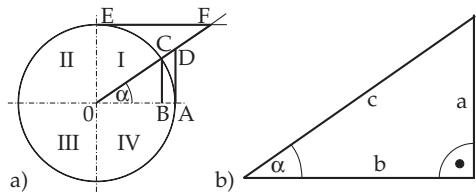
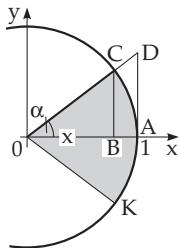
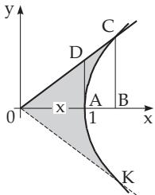

#### 3.1.2 Geometrical Definition of Circular and Hyperbolic Functions

##### 3.1.2.1 Definition of Circular or Trigonometric Functions

1. Definition by the Unit Circle The trigonometric functions of an angle α are defined for both the unit circle with radius R = 1 and the acute angles of a right-angled triangle (Fig. 3.5a,b) with the help of the adjacent side b, opposite side $^ { a , }$ and hypotenuse c. In the unit circle the measurement of an angle is made between a fixed radius OA (with length 1) and a moving radius $\overline { { O C } }$ counterclockwise (positive direction):

  
Figure 3.5

sine : $\sin \alpha = { \overline { { B C } } } = { \frac { a } { c } } ,$

(3.3)

$$
\cos i n e : \qquad \cos \alpha = { \overline { { O B } } } = { \frac { b } { c } } ,\tag{3.4}
$$

tangent : $\tan \alpha = { \overline { { A D } } } = { \frac { a } { b } } .$

(3.5)

$$
c o t a n g e n t : \quad \cot \alpha = { \overline { { E F } } } = { \frac { b } { a } } ,\tag{3.6}
$$

secant : $\sec \alpha = { \overline { { O D } } } = { \frac { c } { b } }$

(3.7)

$$
\cos e c a n t : \csc \alpha = { \overline { { O F } } } = { \frac { c } { a } } .\tag{3.8}
$$

2. Signs of Trigonometric Functions

Depending in which quadrant of the unit circle (Fig. 3.5a) the moving radius $\overline { { O C } }$ is, the functions have well-defined signs which can be taken from Table 2.2 (see p. 79).

3. Definition of Trigonometric Functions by Area of Circular Sectors

The functions sin α, cos α, tan α, cot α are defined by the segments BC, OB, AD of the unit circle with R = 1 (Fig. 3.6), where the argument is the central angle $\dot { \alpha } = \acute { \ast } A O C$ For this definition one could use also the area x of the sector COK, which is denoted in Fig. 3.6 by the shaded area. With the central angle 2α measured in radians, one gets $x = \frac { 1 } { 2 } R ^ { 2 } 2 \alpha = \alpha$ for the area with $R = 1$ Therefore, one has the same equations for sin $x = { \overline { { B C } } }$ , cos $x = { \overline { { O B } } }$ , tan $\overset { \cdot } { x } = \overset { \cdot } { A D }$ as in (3.3, 3.4, 3.5).

  
Figure 3.6

  
Figure 3.7

##### 3.1.2.2 Definitions of the Hyperbolic Functions

In analogy with the definition of the trigonometric functions in (3.3), (3.4), (3.5) now instead of the area of a sector of the unit circle with the equation $x ^ { 2 } + y ^ { 2 } = 1$ here the corresponding area of the sector of the hyperbola is used with the equation $\dot { x } ^ { 2 } - y ^ { 2 } = 1$ (only the right branch in Fig. 3.7). Denoting by x the area of COK, the shaded area in Fig. 3.7, the defining equations of the hyperbolic functions are:

$$
\sinh x = { \overline { { B C } } } ,\tag{3.9}
$$

$$
\cosh x = \overline { { O B } } , \qquad ( 3 . 1 0 )
$$

$$
\operatorname { t a n h } x = { \overline { { A D } } } .\tag{3.11}
$$

Calculating the area x by integration and expressing the results in terms of ${ \overline { { B C } } } , { \overline { { O B } } }$ , and $\overline { { A D } }$ yields

$$
x = \ln ( \overline { { { B C } } } + \sqrt { \overline { { { B C } } } ^ { 2 } + 1 } ) = \ln ( \overline { { { O B } } } + \sqrt { \overline { { { O B } } } ^ { 2 } - 1 } ) = \frac { 1 } { 2 } \ln \frac { 1 + \overline { { { A D } } } } { 1 - \overline { { { A D } } } } ,\tag{3.12}
$$

and so, from now on, the hyperbolic functions can be expressed in terms of exponential functions:

$$
\overline { { B C } } = \frac { e ^ { x } - e ^ { - x } } { 2 } = \sinh x , \qquad \mathrm { ( 3 . 1 3 a ) }
$$

$$
{ \overline { { O B } } } = { \frac { e ^ { x } + e ^ { - x } } { 2 } } = \cosh x ,\tag{3.13b}
$$

$$
{ \overline { { A D } } } = { \frac { e ^ { x } - e ^ { - x } } { e ^ { x } + e ^ { - x } } } = \operatorname { t a n h } x .\tag{3.13c}
$$

These equations represent the most popular definition of the hyperbolic functions.
