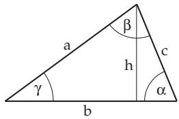
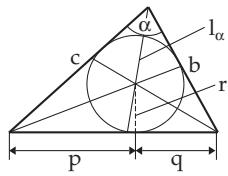
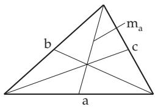
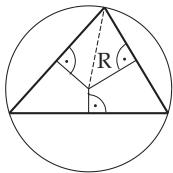
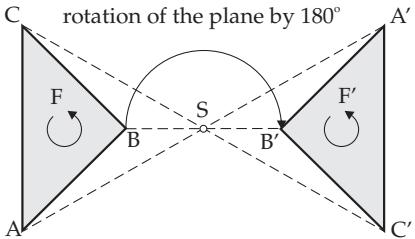
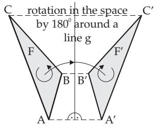
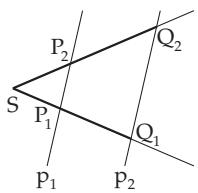
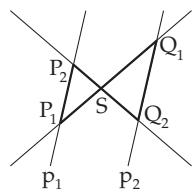

#### 3.1.3 Plane Triangles

##### 3.1.3.1 Statements about Plane Triangles

1. The Sum of Two Sides of a plane triangle is greater than the third one (Fig. 3.8):

$$
b + c > a\tag{3.14}
$$

2. The Sum of the Angles of a plane triangle is $\alpha + \beta + \gamma = 1 8 0 ^ { \circ } .$

(3.15)

3. Unique Determination of Triangles A triangle is uniquely determined by the following data: by three sides or

by two sides and the angle between them or

by one side and the two angles on it.

If two sides and the angle opposite one of them are given, then they define two, one or no triangle (see the third basic problem in Table 3.4, p. 145).

  
Figure 3.8

  
Figure 3.9

  
Figure 3.10

4. Median of a Triangle is a line connecting a vertex of the triangle with the midpoint of the opposite side. The medians of the triangle intersect each other at one point, at the center of gravity of the triangle (Fig. 3.10), which divides them in the ratio 2 : 1 counting from the vertex.

5. Bisector of a Triangle is a line which divides one of the interior angles into two equal parts.   
The bisectors intersect each other at one point.

6. Incircle is the circle inscribed in a triangle, i.e., all the sides are tangents of the circle. Its center is the intersection point of the bisectors (Fig. 3.9). The radius of the inscribed circle is called the apothem or the short radius.

7. Circumcircle is the circle drawn around a triangle, i.e., passing through the vertices of the triangle (Fig. 3.11). Its center is the intersection point of the three right bisectors of the triangle.

8. Altitude of a Triangle is the perpendicular line that starts at a vertex and is perpendicular to the opposite side. The altitudes intersect each other at one point, the orthocenter.

9. Isosceles Triangle In an isosceles triangle two sides have equal length. The altitude, median, and bisector of the third side coincide. For a triangle the equality of any two of these sides is enough to make it isosceles.

  
Figure 3.11

10. Equilateral Triangle In an equilateral triangle with $a = b = c$ the centers of the incircle and the circumcircle, the center of gravity, and the orthocenter coincide.

11. Median is a line connecting two midpoints of sides of a triangle; it is parallel to the third side and has the half of length as that side.

12. Right-Angled Triangle is a triangle that has a right angle (an angle of 90◦) (Fig. 3.31, see p. 142).

##### 3.1.3.2 Symmetry

1. Central Symmetry

A plane figure is called center symmetric if by a rotation of the plane by $1 8 0 ^ { \circ }$ around the central point or the center of symmetry S it exactly covers itself (Fig. 3.12). Because the size and shape of the figure do not change during this transformation, it is called a congruent mapping. Also the sense class or orientation class of the plane figure remains the same (Fig. 3.12). Because of the same sense class such figures are called directly congruent.

The orientation ofa figure means the traverse of the boundary of a figure in a direction: positive direction, hence counterclockwise, negative direction, hence clockwise (Fig. 3.12, Fig. 3.13).

  
Figure 3.12

  
Figure 3.13

2. Axial Symmetry

A plane figure is called axially symmetric if the corresponding points cover each other after a rotation in space by 180◦ around a line g (Fig. 3.13). The corresponding points have the same distance from the axis g, the axis of symmetry. The orientation of the figure is reversed for axial symmetry with respect to the line g. Therefore, such figures are called indirectly congruent. This transformation is called a reflection in g. Because the size and the shape of the figures do not change, it is also called a indirect congruent mapping. The orientation class of the plane figure is reversed under this transformation (Fig. 3.13).

Remark: For space figures hold the analogous statements.

3. Congruent Triangles, Congruence Theorems

a) Congruence: Plane figures are called congruent if their size and shape coincide. Congruent figures can be transformed into a position of superimposition by the following three transformations, by translation, rotation, and reflection, and combinations of these.

It is to distinguish between directly congruent figures and indirectly congruent figures. Directly congruent figures can be transformed into a covering position by translation and rotation. Because the indirectly congruent figures have a reversed sense class, an axially symmetric transformation with respect to a line is also needed to transform them into a covering position.

Axially symmetric figures are indirectly congruent. To transform them into each other all three transformations are needed.

b) Laws of Congruence for Triangles: Two triangles are congruent if they coincide for:

three sides (SSS) or

two sides and the angle between them (SAS), or

one side and the interior angles on this side (ASA), or

two sides and the interior angle being opposite to the longer one (SSA).

4. Similar Triangles, Similarity Theorems

Plane figures are called similar if they have the same shape without having the same size. For similar figures there is a one-to-one mapping between their points such that every angle in one figure is the same as the corresponding angle in the other figure. An equivalent definition is the following: In similar figures the length of segments corresponding to each other are proportional.

a) Similarity of figures requires either the equality of all the corresponding angles or the equality of the ratio of all corresponding segments.

b) Area The areas ofsimilar plane figures are proportional to the square of the ratio of corresponding linear elements such as sides, altitudes, diagonals, etc.

c) Laws of Similarity For triangles the following laws of similarity hold. Triangles are similar if they coincide for:

two ratios of sides,

two interior angles,

the ratio of two sides and the interior angle between them,

the ratio of two sides and the interior angle opposite of the longer one.

Because in the laws of similarity only the equality of ratios of sides is required and not the equality of length of sides, therefore the laws of similarity require less than the corresponding laws of congruence.

5. Intercept Theorems

The intercept theorems are a consequence of the laws of similarity of a triangle.

1. First Intercept Theorem If two rays starting at the same point S are intersected by two parallels $p _ { 1 } , p _ { 2 }$ , then the segments of one of the rays (Fig. 3.14a) have the same ratio as the correspond ing segments on the other one:

$$
\left| \frac { \overline { { S P _ { 1 } } } } { \overline { { S Q _ { 1 } } } } \right| = \left| \frac { \overline { { S P _ { 2 } } } } { \overline { { S Q _ { 2 } } } } \right| .\tag{3.16}
$$

Consequently, every segment on one of the rays is proportional to the corresponding segment on the other ray.

b)

Figure 3.14

2. Second Intercept Theorem If two rays starting at the same point $S$ are intersected by two parallels $p _ { 1 } , p _ { 2 }$ , then the segments of the parallels have the same ratio as the corresponding segments on the rays (Fig. 3.14a):

$$
\left| \frac { \overline { { S P _ { 1 } } } } { \overline { { S Q _ { 1 } } } } \right| = \left| \frac { \overline { { P _ { 1 } P _ { 2 } } } } { \overline { { Q _ { 1 } Q _ { 2 } } } } \right| \quad \mathrm { o r } \quad \left| \frac { \overline { { S P _ { 2 } } } } { \overline { { S Q _ { 2 } } } } \right| = \left| \frac { \overline { { P _ { 1 } P _ { 2 } } } } { \overline { { Q _ { 1 } Q _ { 2 } } } } \right| .\tag{3.17}
$$

The intercept theorems are also valid in the case of intersecting lines at the point $S ,$ if the point S is between the parallels (Fig. 3.14b).
