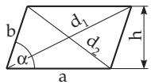
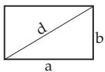
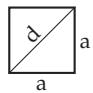
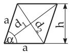
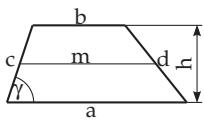
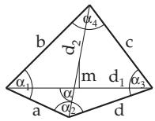
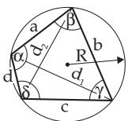
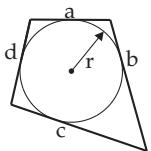

#### 3.1.4 Plane Quadrangles

##### 3.1.4.1 Parallelogram

A quadrangle is called a parallelogram (Fig. 3.15) if it has the following properties:

the sides opposite to each other have the same length,

the sides opposite to each other are parallel,

the diagonals intersect each other at their midpoints,

the angles opposite to each other are equal.

Supposing only one of the previous properties for a quadrangle, or supposing the equality and the parallelism of one pair of opposite sides, then all the other properties follow from it. The relations between diagonals, sides, and area are the following:

$$
d _ { 1 } ^ { 2 } + d _ { 2 } ^ { 2 } = 2 ( a ^ { 2 } + b ^ { 2 } ) ,\tag{3.18}
$$

$$
h = b \sin \alpha ,\tag{3.19}
$$

$$
S = a h .\tag{3.20}
$$

  
Figure 3.15

  
Figure 3.16  
Figure 3.17

##### 3.1.4.2 Rectangle and Square

A parallelogram is a rectangle (Fig. 3.16), if it has:

only right angles, or

the diagonals have the same length.

Only one of these properties is enough, because either of them follows from the other. It is suficient to show that one angle of the parallelogram is a right angle, then all the angles are right angles. If a quadrangle has four right angles, it is a rectangle.

The perimeter U and the area $S$ of a rectangle are:

$$
U = 2 ( a + b ) ,
$$

(3.21a)

$$
S = a b .\tag{3.21b}
$$

If $a = b$ holds (Fig. 3.17), the rectangle is called a square, and the following formulas

$$
d = a { \sqrt { 2 } } \approx 1 . 4 1 4 a ,
$$

(3.22)

$$
a = d { \frac { \sqrt { 2 } } { 2 } } \approx 0 . 7 0 7 d ,
$$

(3.23)

$$
S = a ^ { 2 } = { \frac { d ^ { 2 } } { 2 } } .\tag{3.24}
$$

##### 3.1.4.3 Rhombus

A rhombus (Fig. 3.18) is a parallelogram in which

all the sides have the same length, or

the diagonals are perpendicular to each other, or

the diagonals are bisectors of the angles of the parallelogram.

Any of the previous properties is enough alone; all the others follow from it. For the rhombus

$$
d _ { 1 } = 2 a \cos { \frac { \alpha } { 2 } } ,
$$

(3.25)

$$
d _ { 2 } = 2 a \sin { \frac { \alpha } { 2 } } ,
$$

(3.26)

$$
d _ { 1 } ^ { 2 } + d _ { 2 } ^ { 2 } = 4 a ^ { 2 } .\tag{3.27}
$$

$$
S = a h = a ^ { 2 } \sin \alpha = { \frac { d _ { 1 } d _ { 2 } } { 2 } } .\tag{3.28}
$$

##### 3.1.4.4 Trapezoid

A quadrangle is called trapezoid if it has two parallel sides (Fig. 3.19). The parallel sides are called bases. With the notation a and b for the bases, h for the altitude and m for the median ofthe trapezoid which connects the midpoints of the two non-parallel sides

$$
m = { \frac { a + b } { 2 } } ,
$$

(3.29)

$$
S = { \frac { ( a + b ) h } { 2 } } = m h ,
$$

(3.30)

$$
h _ { S } = \frac { h ( a + 2 b ) } { 3 ( a + b ) } .\tag{3.31}
$$

The centroid is on the connecting segment of the midpoints of the parallel basis a and $b ,$ at a distance $h _ { S }$ (3.31) from the base a. For the calculation of the coordinates of the centroid by integration see 8.2.2.3, p. 506.

For an isosceles trapezoid with $d = c$

$$
S = ( a - c \cos \gamma ) c \sin \gamma = ( b + c \cos \gamma ) c \sin \gamma .\tag{3.32}
$$

  
Figure 3.18

  
Figure 3.19

  
Figure 3.20

##### 3.1.4.5 General Quadrangle

A closed plane figure bounded by four straight line segments is called a general quadrangle. If the diagonals lie fully inside the quadrangle, it is convex, otherwise concave. The general quadrangle is

divisible by two diagonals $d _ { 1 } , d _ { 2 }$ in two triangles (Fig. 3.20). Therefore, in every quadrangle the sum of the interior angles is $2 \cdot 1 8 0 ^ { \circ } = 3 6 0 ^ { \circ }$

$$
\sum _ { i = 1 } ^ { 4 } \alpha _ { i } = 3 6 0 ^ { \circ } .\tag{3.33}
$$

The length of the segment m connecting the midpoints of the diagonals (Fig. 3.20) is given by

$$
a ^ { 2 } + b ^ { 2 } + c ^ { 2 } + d ^ { 2 } = d _ { 1 } ^ { 2 } + d _ { 2 } ^ { 2 } + 4 m ^ { 2 } .\tag{3.34}
$$

The area of the general quadrangle is

$$
S = { \frac { 1 } { 2 } } d _ { 1 } d _ { 2 } \sin \alpha .\tag{3.35}
$$

##### 3.1.4.6 Inscribed Quadrangle

A quadrangle which can be circumscribed by a circumcircle is called an inscribed quadrangle (Fig. 3.21a) and its sides are chords of this circle. A quadrangle is an inscribed quadrangle if and only if the sums of its opposite angles are 180◦:

$$
\alpha + \gamma = \beta + \delta = 1 8 0 ^ { \circ } .\tag{3.36}
$$

Ptolemy’s theorem is valid for the insribed quadrangle:

$$
a c + b d = d _ { 1 } d _ { 2 } .\tag{3.37}
$$

  
b)

The radius of the circumcircle of an inscribed quadrangle is

$$
R = { \frac { 1 } { 4 S } } { \sqrt { ( a b + c d ) ( a c + b d ) ( a d + c b ) } } .
$$

The diagonals can be calculated by the formulas

(3.38)

$$
d _ { 1 } = { \sqrt { \frac { ( a c + b d ) ( a b + c d ) } { a d + b c } } } ,\tag{3.39a}
$$

Figure 3.21

$$
d _ { 2 } = { \sqrt { \frac { ( a c + b d ) ( a d + b c ) } { a b + c d } } } .\tag{3.39b}
$$

The area can be expressed in terms of the half-perimeter of the quadrangle $s = { \frac { 1 } { 2 } } ( a + b + c + d )$

$$
S = { \sqrt { ( s - a ) ( s - b ) ( s - c ) ( s - d ) } } .\tag{3.40}
$$

If the inscribed quadrangle is also a circumscribing quadrangle (see Fig. 3.21 and 3.1.4.7), then

$$
S = { \sqrt { a b c d } } .\tag{3.41}
$$

##### 3.1.4.7 Circumscribing Quadrangle

If a quadrangle has an inscribed circle (Fig. 3.21b), then it is called a circumscribing quadrangle, and the sides are tangents to the circle. A quadrangle has an inscribed circle if and only if the sum of the lengths of the opposite sides are equal, and this sum is also equal to the half-perimeter s:

$$
s = { \frac { 1 } { 2 } } ( a + b + c + d ) = a + c = b + d .\tag{3.42}
$$

The area of the circumscribing quadrangle is

$$
S = ( a + c ) r = ( b + d ) r ,\tag{3.43}
$$

where r is the radius of the inscribed circle.
