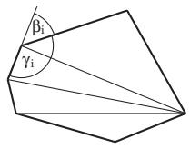
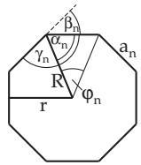
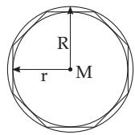
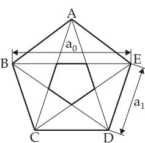

#### 3.1.5 Polygons in the Plane

##### 3.1.5.1 General Polygon

A closed plane figure bounded by straight-line segments as its sides, can be decomposed into $n - 2$ triangles (Fig. 3.22). The sums of the exterior angles $\beta _ { i }$ , and of the interior angles $\gamma _ { i }$ , and the number of diagonals D are

$$
\sum _ { i = 1 } ^ { n } \beta _ { i } = 3 6 0 ^ { \circ } , \quad ( 3 . 4 4 )
$$

$$
\sum _ { i = 1 } ^ { n } \gamma _ { i } = 1 8 0 ^ { \circ } ( n - 2 ) ,\tag{3.45}
$$

$$
D = { \frac { n ( n - 3 ) } { 2 } } .\tag{3.46}
$$

  
Figure 3.22  
a)

  
b)  
Figure 3.23

##### 3.1.5.2 Regular Convex Polygons

Regular convex polygons (Fig. 3.23) have n equal sides and n equal angles. The intersection point of the mid-perpendiculars of the sides is the center M of the inscribed and of the circumscribed circle with radii r and ${ \dot { R } } ,$ respectively. The sides of these polygons are tangents to the inscribed circle and chords of the the circumcircle. They form a circumscribing polygon or tangent polygon for the inscribed circle and a inscribed polygon in the circumcircle. The decomposition of a regular convex n gon (regular convex polygon) results in n isosceles congruent triangles around the center M.

Central Angle

$$
\varphi _ { n } = \frac { 3 6 0 ^ { \circ } } { n }
$$

$$
{ \mathrm { B a s e ~ A n g l e } } \qquad \alpha _ { n } = \left( 1 - { \frac { 2 } { n } } \right) \cdot 9 0 ^ { \circ } .\tag{3.48}
$$

Exterior Angle $\beta _ { n } = \frac { 3 6 0 ^ { \circ } } { n }$ . (3.49)

$$
\mathrm { I n t e r i o r ~ A n g l e } \quad \gamma _ { n } = 1 8 0 ^ { \circ } - \beta _ { n } .\tag{3.50}
$$

Circumcircle Radius

$$
R = \frac { a _ { n } } { 2 \sin \frac { 1 8 0 ^ { \circ } } { n } } , \quad R ^ { 2 } = r ^ { 2 } + \frac { 1 } { 4 } a _ { n } ^ { 2 } .\tag{3.51}
$$

Inscribed Circle Radius

$$
r = { \frac { a _ { n } } { 2 } } \cot { \frac { 1 8 0 ^ { \circ } } { n } } = R \cos { \frac { 1 8 0 ^ { \circ } } { n } } .\tag{3.52}
$$

$$
\mathrm { S i d e ~ L e n g t h ~ } a _ { n } = 2 \sqrt { R ^ { 2 } - r ^ { 2 } } = 2 R \sin \frac { \varphi _ { n } } { 2 } = 2 r \tan \frac { \varphi _ { n } } { 2 } . ( 3 . 5 3 ) \mathrm { P e r i m e t e r ~ } U = n a _ { n } .\tag{3.54}
$$

Side Length of the 2n gon

$$
a _ { 2 n } = R \sqrt { 2 - 2 \sqrt { 1 - \left( \frac { a _ { n } } { 2 R } \right) ^ { 2 } } } , \quad a _ { n } = a _ { 2 n } \sqrt { 4 - \left( \frac { a _ { 2 n } ^ { 2 } } { R ^ { 2 } } \right) } .\tag{3.55}
$$

Area of the n gon

$$
S _ { n } = { \frac { 1 } { 2 } } n a _ { n } r = n r ^ { 2 } \tan { \frac { \varphi _ { n } } { 2 } } = { \frac { 1 } { 2 } } n R ^ { 2 } \sin \varphi _ { n } = { \frac { 1 } { 4 } } n a _ { n } ^ { 2 } \cot { \frac { \varphi _ { n } } { 2 } } .\tag{3.56}
$$

Area of the 2n gon

$$
S _ { 2 n } = \frac { n R ^ { 2 } } { \sqrt { 2 } } \sqrt { 1 - \sqrt { \frac { 4 S _ { n } ^ { 2 } } { n ^ { 2 } R ^ { 4 } } } } , \quad S _ { n } = S _ { 2 n } \sqrt { 1 - \frac { S _ { 2 n } ^ { 2 } } { n ^ { 2 } R ^ { 4 } } } .\tag{3.57}
$$

##### 3.1.5.3 Some Regular Convex Polygons

The properties of some regular convex polygons are collected in Table 3.2.

The pentagon and the pentagram deserve special attention since it is presumed that Hippasos of Metapontum (ca. 450 BC) recognized irrational numbers by the properties of these polygons (see 1.1.1.2, p. 2). A discussion follows in the example:

The diagonals of a regular pentagon (Fig. 3.24) form an inscribed pentagram. Its sides enclose a regular pentagon again. In a regular pentagon, the proportion of a diagonal and a side is equal to the proportion of a side and the (diagonal minus side): a0 $: a _ { 1 } = a _ { 1 } : ( a _ { 0 } - a _ { 1 } ) = a _ { 1 } : a _ { 2 }$ where $a _ { 2 } = a _ { 0 } - a _ { 1 }$

Considering smaller and smaller nested pentagons with $a _ { 3 } = a _ { 1 } - a _ { 2 } , a _ { 4 } =$ $a _ { 2 } \ : - \ : a _ { 3 } , . . .$ . and $a _ { 2 } < a _ { 1 } , a _ { 3 } < a _ { 2 } , a _ { 4 } < a _ { 3 } \ldots .$ yields $a _ { 0 } : a _ { 1 } = a _ { 1 } : a _ { 2 } =$ $a _ { 2 } : a _ { 3 } = a _ { 3 } : a _ { 4 } = \cdots$ . The Euclidean algorithm for $a _ { 0 }$ and $a _ { 1 }$ never breaks of, since $a _ { 0 } = 1 \cdot a _ { 1 } + a _ { 2 } , a _ { 1 } = 1 \cdot a _ { 2 } + a _ { 3 } , a _ { 2 } = 1 \cdot a _ { 3 } + a _ { 4 } , \ldots$ , hence $q _ { n } = 1$ . The side $a _ { 1 }$ and diagonal $a _ { 0 }$ of the regular pentagon are incommensurable. The continued fraction determined by $a _ { 0 } : a _ { 1 }$ is identical to the golden section in B, 1.1.1.4, 3., p. 4, i.e., it results in an irrational number.

  
Figure 3.24
