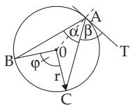
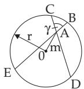
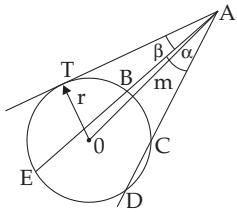
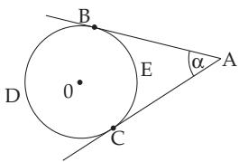
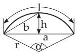
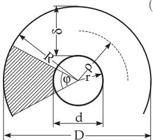

#### 3.1.6 The Circle and Related Shapes

##### 3.1.6.1 Circle

The circle is the locus of the points in a plane which are at the same given distance from a given point, the center of the circle. The distance itself, and also the line segment connecting the center with any point of the circle, is called the radius. The circumference or periphery ofthe circle encloses the area of the circle. A line segment connecting two points of the circle is called a chord. A line passing through two points of a circle is called a secant. Lines having exactly one common point with the circle are called tangent lines or tangents of the circle.

Chord Theorem (Fig. 3.26) AC AD = AB AE = r2 m2.

(3.58)

Secant Theorem (Fig. 3.27) AB AE = AC AD = m2 r2.

(3.59)

$$
\mathrm { S e c a n t - T a n g e n t ~ T h e o r e m ~ ( F i g . ~ 3 . 2 7 ) } \quad \overline { { A T } } ^ { 2 } = \overline { { A B } } \cdot \overline { { A E } } = \overline { { A C } } \cdot \overline { { A D } } = m ^ { 2 } - r ^ { 2 } .\tag{3.60}
$$

Perimeter

$$
U = 2 \pi r \approx 6 , 2 8 3 r , \quad U = \pi d \approx 3 , 1 4 2 d , \quad U = 2 { \sqrt { \pi S } } \approx 3 , 5 4 5 { \sqrt { S } } .\tag{3.61}
$$

  
Figure 3.25

  
Figure 3.26

  
Figure 3.27

Table 3.2 Properties of some regular polygons
<table><tr><td rowspan=1 colspan=1></td><td rowspan=1 colspan=1> $a _ { n }$ </td><td rowspan=1 colspan=1>R</td><td rowspan=1 colspan=1> $r$ </td><td rowspan=1 colspan=1> $S _ { n }$ </td></tr><tr><td rowspan=1 colspan=1> $3 \mathrm { g o n }$ </td><td rowspan=1 colspan=1> $a _ { 3 } = R { \sqrt { 3 } } = 2 r { \sqrt { 3 } }$ </td><td rowspan=1 colspan=1> $= { \frac { a _ { 3 } } { 3 } } { \sqrt { 3 } } = 2 r = { \frac { 2 } { 3 } } h \ { \bigg | } = { \<eq>h = { \frac { a _ { 3 } } { 2 } } { \sqrt { 3 } } = { \frac { 3 } { 2 } } R$ </td><td rowspan=1 colspan=1>frac { a _ { 3 } } { 6 } } { \sqrt { 3 } } = { \frac { R } { 2 } } = { \frac { 1 } { 3 } } h</eq></td><td rowspan=1 colspan=1> $= \frac { a _ { 3 } ^ { 2 } } { 4 } \sqrt { 3 } = \frac { 3 R ^ { 2 } } { 4 } \sqrt { 3 }$  $= 3 r ^ { 2 } \sqrt { 3 }$ </td></tr><tr><td rowspan=1 colspan=1> $5 \mathrm { g o n }$ </td><td rowspan=1 colspan=1> $a _ { 5 } = { \frac { R } { 2 } } { \sqrt { 1 0 - 2 { \sqrt { 5 } } } }$  $= 2 r \sqrt { 5 - 2 \sqrt { 5 } }$ </td><td rowspan=1 colspan=1> $= { \frac { a _ { 5 } } { 1 0 } } { \sqrt { 5 0 + 1 0 { \sqrt { 5 } } } }$  $= r ( { \sqrt { 5 } } - 1 )$ </td><td rowspan=1 colspan=1> $= { \frac { a _ { 5 } } { 1 0 } } { \sqrt { 2 5 + 1 0 { \sqrt { 5 } } } }$  $= { \frac { R } { 4 } } ( { \sqrt { 5 } } + 1 )$ </td><td rowspan=1 colspan=1> $= { \frac { a _ { 5 } ^ { 2 } } { 4 } } { \sqrt { 2 5 + 1 0 { \sqrt { 5 } } } }$  $= { \frac { 5 R ^ { 2 } } { 8 } } { \sqrt { 1 0 + 2 { \sqrt { 5 } } } }$  $= 5 r ^ { 2 } { \sqrt { 5 - 2 { \sqrt { 5 } } } }$ </td></tr><tr><td rowspan=1 colspan=1> $6 ~ \mathrm { g o n }$ </td><td rowspan=1 colspan=1> $a _ { 6 } = { \frac { 2 } { 3 } } r { \sqrt { 3 } }$ </td><td rowspan=1 colspan=1> $= { \frac { 2 } { 3 } } r { \sqrt { 3 } }$ </td><td rowspan=1 colspan=1> $= { \frac { R } { 2 } } { \sqrt { 3 } }$ </td><td rowspan=1 colspan=1> $= { \frac { 3 a _ { 6 } ^ { 2 } } { 2 } } { \sqrt { 3 } } = { \frac { 3 R ^ { 2 } } { 2 } } { \sqrt { 3 } }$  $= 2 r ^ { 2 } \sqrt { 3 }$ </td></tr><tr><td rowspan=1 colspan=1> $8 \mathrm { g o n }$ </td><td rowspan=1 colspan=1> $a _ { 8 } = R { \sqrt { 2 - { \sqrt { 2 } } } }$  $= 2 r ( \sqrt { 2 } - 1 )$ </td><td rowspan=1 colspan=1> $= \frac { a _ { 8 } } { 2 } \sqrt { 4 + 2 \sqrt { 2 } }$  $= r { \sqrt { 4 - 2 { \sqrt { 2 } } } }$ </td><td rowspan=1 colspan=1>二 $= { \frac { a _ { 8 } } { 2 } } ( { \sqrt { 2 } } + 1 )$  $= { \frac { R } { 2 } } { \sqrt { 2 + { \sqrt { 2 } } } }$ </td><td rowspan=1 colspan=1> $= 2 a _ { 8 } ^ { 2 } ( \sqrt { 2 } + 1 )$  $= 2 R ^ { 2 } \sqrt { 2 }$  $= 8 r ^ { 2 } ( \sqrt { 2 } - 1 )$ </td></tr><tr><td rowspan=1 colspan=1> $1 0 \ \mathrm { g o n }$ </td><td rowspan=1 colspan=1> $a _ { 1 0 } = \frac { R } { 2 } ( \sqrt { 5 } - 1 )$  $= { \frac { 2 r } { 5 } } { \sqrt { 2 5 - 1 0 { \sqrt { 5 } } } }$ </td><td rowspan=1 colspan=1> $= { \frac { a _ { 1 0 } } { 2 } } ( { \sqrt { 5 } } + 1 )$  $= { \frac { r } { 5 } } { \sqrt { 5 0 - 1 0 { \sqrt { 5 } } } }$ </td><td rowspan=1 colspan=1>二 $\frac { a _ { 1 0 } } { 2 } \sqrt { 5 + 2 \sqrt { 5 } }$  $= { \frac { R } { 4 } } { \sqrt { 1 0 + 2 { \sqrt { 5 } } } }$ </td><td rowspan=1 colspan=1> $= \frac { 5 a _ { 1 0 } ^ { 2 } } { 2 } \sqrt { 5 + 2 \sqrt { 5 } }$ 11 $= { \frac { 5 R ^ { 2 } } { 4 } } { \sqrt { 1 0 - 2 { \sqrt { 5 } } } }$  $= 2 r ^ { 2 } { \sqrt { 2 5 - 1 0 { \sqrt { 5 } } } }$ </td></tr></table>

Area $S = \pi r ^ { 2 } \approx 3 , 1 4 2 r ^ { 2 } , \quad S = \frac { \pi d ^ { 2 } } { 4 } \approx 0 , 7 8 5 d ^ { 2 } , \quad S = \frac { U d } { 4 } .$

(3.62)

Radius $r = { \frac { U } { 2 \pi } } \approx 0 . 1 5 9 U .$ (3.63) Diameter $d = 2 r = 2 { \sqrt { \frac { S } { \pi } } } \approx 1 . 1 2 8 { \sqrt { S } } .$

(3.64)

For the following formulas with angles see the definition of the angle in 3.1.1.2, p. 129.

Angle of Circumference (Fig. 3.25)

$$
\alpha = { \frac { 1 } { 2 } } \widehat { B C } = { \frac { 1 } { 2 } } \ast B 0 C = { \frac { 1 } { 2 } } \varphi .\tag{3.65a}
$$

A Special Case is the Theorem of Thales (see p. 142) $\varphi = 1 8 0 ^ { \circ } , { \mathrm { i . e , ~ } } \alpha = 9 0 ^ { \circ }$

(3.65b)

Angle Between a Chord and a Tangent (Fig. 3.25) $\beta = { \frac { 1 } { 2 } } \ { \widehat { A C } } { = } { \frac { 1 } { 2 } } \ X C 0 A .$

(3.66)

Interior Angle (Fig. 3.26)

$$
\gamma = \frac { 1 } { 2 } ( \widehat { C B } + \widehat { E D } ) = \frac { 1 } { 2 } ( \ast B 0 C + \ast E 0 D ) .\tag{3.67}
$$

$$
\alpha = \frac { 1 } { 2 } ( \widehat { D E } - \widehat { B C } ) = \frac { 1 } { 2 } ( \ast E 0 C - \ast C 0 B ) .
$$

Exterior Angle (Fig. 3.27)

(3.68)

Angle Between Secant and Tangent (Fig. 3.27) $\beta = \frac { 1 } { 2 } ( \widehat { T E } - \widehat { T B } ) = \frac { 1 } { 2 } ( \ast T 0 E - \ast B 0 T )$ .(3.69)

Inscribed Angle (Fig. 3.28), D and E are arbitrary points on the arcs to the left and to the right.

$$
\begin{array} { c } { { \alpha = \displaystyle \frac { 1 } { 2 } ( B \widehat { D } C - C \widehat { E } B ) = \displaystyle \frac { 1 } { 2 } ( \ast B 0 C - \ast C 0 B ) } } \\ { { = \displaystyle \frac { 1 } { 2 } ( 3 6 0 ^ { \circ } - \ast C 0 B - \ast C 0 B ) = 1 8 0 ^ { \circ } - \ast C 0 B . } } \end{array}\tag{3.70}
$$

##### 3.1.6.2 Circular Segment and Circular Sector

Defining quantities: Radius r and central angle α (Fig. 3.29). The amounts to determine are:

Chord

$$
a = 2 { \sqrt { 2 h r - h ^ { 2 } } } = 2 r \sin { \frac { \alpha } { 2 } } .\tag{3.71}
$$

Central Angle

$$
\alpha = 2 \arcsin { \frac { a } { 2 r } } \quad ( \alpha { \mathrm { ~ m e a s u r e d ~ i n ~ d e g r e e s } } ) .\tag{3.72}
$$

Height of the Circular Segment $h = r - { \sqrt { r ^ { 2 } - { \frac { a ^ { 2 } } { 4 } } } } = r \left( 1 - \cos { \frac { \alpha } { 2 } } \right) = { \frac { a } { 2 } } \tan { \frac { \alpha } { 4 } } .$

(3.73)

Arc Length $l = \frac { 2 \pi r \alpha } { 3 6 0 } \approx 0 . 0 1$ 745rα (α in radian measure)

(3.74a)

$$
l \approx { \frac { 8 b - a } { 3 } } \quad { \mathrm { o r } } \quad l \approx { \sqrt { a ^ { 2 } + { \frac { 1 6 } { 3 } } h ^ { 2 } } } .\tag{3.74b}
$$

  
Figure 3.28

  
Figure 3.29

  
Figure 3.30

Area of the Sector

$$
S = { \frac { \pi r ^ { 2 } \alpha } { 3 6 0 } } \approx 0 . 0 0 8 7 3 r ^ { 2 } \alpha .\tag{3.75}
$$

Area of Circular Segment $S = \frac { r ^ { 2 } } { 2 } \left( \frac { \pi \alpha } { 1 8 0 } - \sin \alpha \right) = \frac { 1 } { 2 } [ l r - a ( r - h ) ] , \quad S \approx \frac { h } { 1 5 } ( 6 a + 8 b ) .$

(3.76)

##### 3.1.6.3 Annulus

Defining quantities of an annulus: Exterior radius $R ,$ interior radius r and central angle ϕ (Fig. 3.30).

Exterior Diameter D = 2 R. (3.77) Interior Diameter d = 2 r.

(3.78)

Mean Radius

$$
\rho = { \frac { R + r } { 2 } } . \qquad \mathrm { ( 3 . 7 9 ) } \quad \mathbf { B r e a d t h ~ o f ~ t h e ~ A n n u l u s } \qquad \delta = R - r .\tag{3.80}
$$

Area of the Annulus $S = \pi ( R ^ { 2 } - r ^ { 2 } ) = \frac { \pi } { 4 } ( D ^ { 2 } - d ^ { 2 } ) = 2 \pi \rho \delta .$

(3.81)

Area of an Annulus Sector for a Central Angle $\varphi$ (shaded area in Fig. 3.30)

$$
S _ { \varphi } = { \frac { \varphi \pi } { 3 6 0 } } \left( R ^ { 2 } - r ^ { 2 } \right) = { \frac { \varphi \pi } { 1 4 4 0 } } \left( D ^ { 2 } - d ^ { 2 } \right) = { \frac { \varphi \pi } { 1 8 0 } } \rho \delta \ { \mathrm { ~ ( } \varphi \mathrm { i n ~ r a d i a n ~ m e a s u r e ) } } .\tag{3.82}
$$
