### 3.2 Plane Trigonometry

#### 3.2.1 Triangles

##### 3.2.1.1 Calculations in Right-Angled Triangles in the Plane

1. Basic Formulas

Notation (Fig. 3.31):

c hypotenuse; a, b other sides, or legs of the right angle; α and $\beta$ the angles opposite to the sides a and b respectively; h altitude; p, q hypotenuse segments; S area.

Sum of Angles $\alpha + \beta + \gamma = 1 8 0 ^ { 0 } \mathrm { w i t h } \gamma = 9 0 ^ { \circ } ;$

(3.83)

Calculation of Sides

$$
a = c \sin \alpha = c \cos \beta
$$

$$
= b \tan \alpha = b \cot \beta ,\tag{3.84}
$$

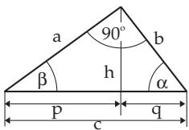

Pythagoras Theorem

$$
a ^ { 2 } + b ^ { 2 } = c ^ { 2 } .\tag{3.85}
$$

Figure 3.31

Thales Theorem The vertex angles of all triangles in a semicircle with hypotenuse as the base are right angles, i.e., all angles at circumference in this semicircle are right angles (see Fig. 3.32 and (3.65b), p. 140).

Euclidean Theorems $\begin{array} { r } { h ^ { 2 } = p q , \quad a ^ { 2 } = p c , \quad b ^ { 2 } = q c , } \end{array}$

(3.86)

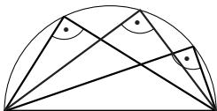

Area

$$
S = { \frac { a b } { 2 } } = { \frac { a ^ { 2 } } { 2 } } \tan \beta = { \frac { c ^ { 2 } } { 4 } } \sin 2 \beta .\tag{3.87}
$$

Figure 3.32

2. Calculation of Sides and Angles of a Right-Angled Triangle in the Plane

In a right-angled triangle among the six defining quantities (three angles $\alpha , \beta , \gamma$ and the sides opposite to them $a , b , c ,$ which are not all independent, of course), one angle, in Fig. 3.31 the angle γ , is given as 90◦.

A plane triangle can be determined by three defining quantities but these cannot be given arbitrarily (see 3.1.3.1, p. 133). So, in the case of a right-angled triangle only two more quantities can be given. The remaining three quantities can be determined from Table 3.3 and (3.15) and (3.83).

Table 3.3 Defining quantities of a right-angled triangle in the plane
<table><tr><td rowspan=1 colspan=1>Given</td><td rowspan=1 colspan=3>Calculation of the other quantities</td></tr><tr><td rowspan=1 colspan=1>e.g. a, α</td><td rowspan=1 colspan=1> $\beta = 9 0 ^ { \circ }$ -α</td><td rowspan=1 colspan=1>b = a cot α</td><td rowspan=1 colspan=1> $c = \frac { a } { \sin \alpha }$ </td></tr><tr><td rowspan=1 colspan=1>e.g. b, α</td><td rowspan=1 colspan=1> $\beta = 9 0 ^ { \circ } - \alpha$ </td><td rowspan=1 colspan=1>a = b tan α</td><td rowspan=1 colspan=1> $c = \frac { b } { \cos \alpha }$ </td></tr><tr><td rowspan=1 colspan=1>e.g. c, α</td><td rowspan=1 colspan=1> $\beta = 9 0 ^ { \circ } - \alpha$ </td><td rowspan=1 colspan=1> $a = c \sin \alpha$ </td><td rowspan=1 colspan=1> $b = c \cos \alpha$ </td></tr><tr><td rowspan=1 colspan=1>e.g. a, b</td><td rowspan=1 colspan=1> $\frac { a } { b } = \tan \alpha$ </td><td rowspan=1 colspan=1> $c = \frac { a } { \sin \alpha }$ </td><td rowspan=1 colspan=1> $\beta = 9 0 ^ { \circ } - \alpha$ </td></tr></table>

##### 3.2.1.2 Calculations in General (Oblique) Triangles in the Plane

1. Basic Formulas

Notation (Fig. 3.33): a, b, c sides; $\alpha , \beta , \gamma$ the angles opposite to them; S area; R radius of the circumcircle; r radius of the incircle; $s = { \frac { a + b + c } { 2 } }$ half of the perimeter.

Cyclic Permutation

Because an oblique triangle has no distinguishing side or angle, from every formula containing the

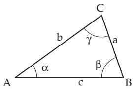

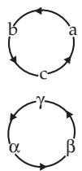

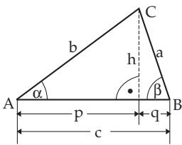  
Figure 3.33  
Figure 3.34  
Figure 3.35

sides and angles it is possible to get two further formulas by cyclic permutation the sides and angles according to Fig. 3.34.

From ${ \frac { a } { b } } = { \frac { \sin \alpha } { \sin \beta } }$ (sine law) one gets by cyclic permutation: ${ \frac { b } { c } } = { \frac { \sin \beta } { \sin \gamma } } , \quad { \frac { c } { a } } = { \frac { \sin \gamma } { \sin \alpha } } .$

Sine Law

$$
{ \frac { a } { \sin \alpha } } = { \frac { b } { \sin \beta } } = { \frac { c } { \sin \gamma } } = 2 R .\tag{3.88}
$$

Projection Rule (see Fig. 3.35) c = a cos β + b cos α .

(3.89)

Cosine Law or Pythagoras Theorem in General Triangles $c ^ { 2 } = a ^ { 2 } + b ^ { 2 } - 2 a b \cos \gamma$ Mollweide Equations

(3.90)

$$
( a + b ) \sin \frac { \gamma } { 2 } = c \cos \left( \frac { \alpha - \beta } { 2 } \right) , \qquad ( 3 . 9 1 a ) \qquad ( a - b ) \cos \frac { \gamma } { 2 } = c \sin \left( \frac { \alpha - \beta } { 2 } \right) .\tag{3.91b}
$$

Tangent Law

$$
{ \frac { a + b } { a - b } } = { \frac { \tan { \frac { \alpha + \beta } { 2 } } } { \tan { \frac { \alpha - \beta } { 2 } } } } .\tag{3.92}
$$

Half-Angle Formulas tan ${ \frac { \alpha } { 2 } } = { \sqrt { \frac { \left( s - b \right) \left( s - c \right) } { s \left( s - a \right) } } }$

(3.93)

Tangent Formula tan $\alpha = { \frac { a \sin \beta } { c - a \cos \beta } } = { \frac { a \sin \gamma } { b - a \cos \gamma } }$

(3.94)

Additional Relations

$$
\sin { \frac { \alpha } { 2 } } = { \sqrt { \frac { ( s - b ) ( s - c ) } { b c } } } ,
$$

$$
\cos { \frac { \alpha } { 2 } } = { \sqrt { \frac { s ( s - a ) } { b c } } } .\tag{3.95b}
$$

Height Corresponding to the Side a

$$
h _ { a } = b \sin \gamma = c \sin \beta .\tag{3.96}
$$

Median of the Side a

$$
m _ { a } = \frac { 1 } { 2 } \sqrt { b ^ { 2 } + c ^ { 2 } + 2 b c \cos \alpha } .\tag{3.97}
$$

$$
l _ { \alpha } = \frac { 2 b c \cos \frac { \alpha } { 2 } } { b + c } .
$$

Bisector of the Angle α

(3.98)

Radius of the Circumcircle $R = { \frac { a } { 2 \sin \alpha } } = { \frac { b } { 2 \sin \beta } } = { \frac { c } { 2 \sin \gamma } } .$

(3.99)

$$
r = { \sqrt { \frac { ( s - a ) ( s - b ) ( s - c ) } { s } } } = s \tan { \frac { \alpha } { 2 } } \tan { \frac { \beta } { 2 } } \tan { \frac { \gamma } { 2 } }\tag{3.100}
$$

$$
= 4 R \sin { \frac { \alpha } { 2 } } \sin { \frac { \beta } { 2 } } \sin { \frac { \gamma } { 2 } } .\tag{3.101}
$$

Area $S = { \frac { 1 } { 2 } } a b$ sin $\gamma = 2 R ^ { 2 }$ sin α sin β sin $\gamma = r s = \sqrt { s ( s - a ) ( s - b ) ( s - c ) }$

(3.102)

The formula $S = { \sqrt { s ( s - a ) ( s - b ) ( s - c ) } }$ is called Heron’s formula.

2. Calculation of Sides, Angles, and Area in General Triangles

According to the congruence theorems (see 3.1.3.2, p. 134) a triangle is determined by three independent quantities, among which there must be at least one side.

From here follow the four so-called basic problems. If from the six defining quantities (three angles $\alpha , \beta , \gamma$ and the sides opposite to them $a , b , c )$ three independent quantities are given, one can calculate the remaining three with the equations in Table 3.4, p. 145.

In contrast to spherical trigonometry (see the second basic problem, Table 3.9, p. 172) in a plane triangle there is no way to get any side only from the angles.

#### 3.2.2 Geodesic Applications

##### 3.2.2.1 Geodesic Coordinates

In geometry usually right-handed coordinate systems are used to determine points in plane or space (Fig. 3.170). In contrast with this, in geodesy left-handed coordinate systems are in use.

1. Geodesic Rectangular Coordinates

In a plane left-handed rectangular coordinate system (Fig. 3.37) the x-axis of abscissae is shown upward, the y-axis of ordinates is shown to the right. A point P has coordinates $y _ { P } , x _ { P }$ . The orientation of the x-axis follows from practical reasons. When measuring long distances, for which mostly the Soldner- or the Gauss-Krueger coordinate systems are in use (see 3.4.1.2, p. 162), the positive x-axis points to grid North, the y-axis oriented to the right points to East. The enumeration of the quadrants follows a clockwise direction in contrast with the usual practice in geometry (Fig. 3.37, Fig. 3.38).

If besides the position of a point in the plane also its altitude is to be considered, one can use a threedimensional left-handed rectangular coordinate system $( y , x , z )$ , where the z-axis points to the zenith (Fig. 3.36).

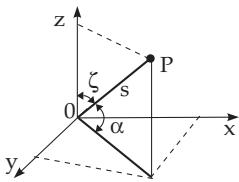  
Figure 3.36

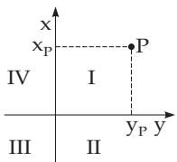  
Figure 3.37

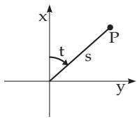  
Figure 3.38

2. Geodesic Polar Coordinates

In the left-handed plane polar coordinate system of geodesy (Fig. 3.38) a point P is given by the directional (azimuthal) angle t between the axis of abscissae and the line segment s, and by the length of the line segment s between the point and the origin (called the pole). In geodesy the positive orientation of an angle is the clockwise direction.

To determine the altitude the zenith distance $\zeta$ can be used or the vertical angle respectively the angle oftilt α. In Fig. 3.36 is shown that in a three-dimensional rectangular left-handed coordinate system (see also left and right-handed coordinate systems 3.5.3.1, 2., p. 209), the zenith distance is measured between the zenith axis z and the line segment s, the angle of tilt between the line segment s and its perpendicular projection on the y, x plane.

Table 3.4 Defining quantities of a general triangle, basic problems
<table><tr><td rowspan=1 colspan=1>Given</td><td rowspan=1 colspan=1>Formulas for calculating the other quantities</td></tr><tr><td rowspan=1 colspan=1>1. 1 side and 2angles $( a , \alpha , \beta )$ </td><td rowspan=1 colspan=1> $\gamma = 1 8 0 ^ { \circ } - \alpha - \beta , \ : \ : \ : \ : \ : \ : \ : \ : b = \frac { a \sin \beta } { \sin \alpha } ;$  $c = \frac { a \sin \gamma } { \sin \alpha } , \qquad S = \frac { 1 } { 2 } a b \sin \gamma .$ </td></tr><tr><td rowspan=1 colspan=1>2. 2 sides and theangle betweenthem $( a , b , \gamma )$ </td><td rowspan=1 colspan=1>tan ${ \frac { \alpha - \beta } { 2 } } = { \frac { a - b } { a + b } } \cot { \frac { \gamma } { 2 } } , \quad { \frac { \alpha + \beta } { 2 } } = 9 0 ^ { \circ } - { \frac { 1 } { 2 } } \gamma ;$ α and $\beta$ come from $\alpha + \beta$ and $\alpha - \beta ,$  $c = { \frac { a \sin \gamma } { \sin \alpha } } , \qquad S = { \frac { 1 } { 2 } } a b \sin \gamma .$ </td></tr><tr><td rowspan=1 colspan=1>3. 2 sides and theangle oppositeone of them $( a , b , \alpha )$ </td><td rowspan=2 colspan=1> $\sin \beta = { \frac { b \sin \alpha } { a } } .$  $\mathrm { I f } \ a \geq b$ holds, then $\beta < 9 0 ^ { \circ }$ and is uniquely determined. If $a < b$ holds, the following cases occur:1. $\beta$ has two values for b sin $\alpha < a ( \beta _ { 2 } = 1 8 0 ^ { \circ } - \beta _ { 1 } )$ 2. $\beta$ has exactly one value $( 9 0 ^ { \circ } )$ for b sin $\alpha = a ,$ 3. For bsin $\alpha > a$ there is no such triangle. $\gamma = 1 8 0 ^ { \circ } - ( \alpha + \beta ) , c = \frac { a \sin \gamma } { \sin \alpha } , S = \frac { 1 } { 2 } a b \sin \gamma .$  $r = { \sqrt { \frac { ( s - a ) ( s - b ) ( s - c ) } { s } } } ,$  $\tan { \frac { \alpha } { 2 } } = { \frac { r } { s - a } } , \tan { \frac { \beta } { 2 } } = { \frac { r } { s - b } } , \tan { \frac { \gamma } { 2 } } = { \frac { r } { s - c } } ,$  $S = r s = { \sqrt { s ( s - a ) ( s - b ) ( s - c ) } } .$ </td></tr><tr><td rowspan=1 colspan=1>4. 3 ${ \mathrm { s i d e s } } \left( a , b , c \right)$ </td></tr></table>

3. Scale

In cartography the scale factor M is the ratio of a segment $s _ { K 1 }$ in a coordinate system $K _ { 1 }$ with respect to the corresponding segment $s _ { K 2 }$ in another coordinate system $K _ { 2 }$

1. Conversion of Segments With m as a modulus or scale and N as an index for the nature and K as the index of the map holds:

$$
M = 1 : m = s _ { K } : s _ { N } .\tag{3.103a}
$$

For two segments $s _ { K 1 } , s _ { K 2 }$ with diferent moduli $m _ { 1 }$ , m yields:

$$
s _ { K 1 } : s _ { K 2 } = m _ { 2 } : m _ { 1 } .\tag{3.103b}
$$

2. Conversion of Areas If the areas are calculated according to the formulas $F _ { K } = a _ { K } b _ { K } , \ F _ { N } =$ $a _ { N } b _ { N }$ , then:

$$
F _ { N } = F _ { K } m ^ { 2 } .\tag{3.104a}
$$

For two areas $F _ { 1 } , F _ { 2 }$ with diferent moduli $m _ { 1 } , m _ { 2 }$

$$
F _ { K 1 } : F _ { K 2 } = m _ { 2 } ^ { 2 } : m _ { 1 } ^ { 2 } .\tag{3.104b}
$$

##### 3.2.2.2 Angles in Geodesy

1. Grade or Gon Division

In geodesy, in contrast to mathematics (see 3.1.1.5, p. 131) the gon measure is in use as a unit for angles. The perigon or full angle corresponds here to 400 grade or gon. The conversion between degrees and gons can be performed by the formulas in Table 3.5:

Table 3.5 Grade and Gon Division

$$
\begin{array} { r l r l }  \boxed { \begin{array} { l l l l l l } { 1 \mathrm { ~ F u l l ~ a n g l e } } & { = 3 6 0 ^ { \circ } } & { = 2 \pi \mathrm { ~ r a d } } & { = 4 0 0 \mathrm { g o n } } & \\ { 1 \mathrm { ~ r i g h t ~ a n g l e } } & { = 9 0 ^ { \circ } } & { = \frac { \pi } { 2 } \mathrm { r a d } } & { = 1 0 0 \mathrm { g o n } } & \\ { 1 \mathrm { g o n } } & { = \frac { \pi } { 2 0 0 } \mathrm { r a d } } & { = 1 0 0 0 \mathrm { m g o n } } & \end{array} } \end{array}
$$

2. Directional Angle

The directional angle t at a point P gives the direction of an oriented line segment with respect to a line passing through the point P parallel to the x-axis (see point A and the directional angle $t _ { A B }$ in Fig. 3.39). Because the measuring of angles in geodesy is made in a clockwise direction (Fig. 3.37, Fig. 3.38), the quadrants are enumerated in the opposite order to the right-handed Cartesian coordinate system of plane trigonometry (Table 3.6). The formulas of plane trigonometry are valid without change.

Table 3.6 Directional angle in a segment with correct sign for arctan
<table><tr><td rowspan=1 colspan=1>Quadrant</td><td rowspan=1 colspan=1>I</td><td rowspan=1 colspan=1>II</td><td rowspan=1 colspan=1>III</td><td rowspan=1 colspan=1>IV</td></tr><tr><td rowspan=1 colspan=1>Sign of numerator</td><td rowspan=1 colspan=1>+</td><td rowspan=1 colspan=1>一</td><td rowspan=1 colspan=1>一</td><td rowspan=1 colspan=1>+</td></tr><tr><td rowspan=1 colspan=1> $\Delta y$  $\Delta x$ </td><td rowspan=1 colspan=1> $\tan > 0$ </td><td rowspan=1 colspan=1> $\tan < 0$ </td><td rowspan=1 colspan=1> $\tan > 0$ </td><td rowspan=1 colspan=1> $\tan < 0$ </td></tr><tr><td rowspan=1 colspan=1>Directional angle t</td><td rowspan=1 colspan=1> $t _ { 0 } \ \mathrm { g o n }$ </td><td rowspan=1 colspan=1> $t _ { 0 } + 2 0 0 \ \mathrm { g o n }$ </td><td rowspan=1 colspan=1> $t _ { 0 } + 2 0 0 \ \mathrm { g o n }$ </td><td rowspan=1 colspan=1> $t _ { 0 } + 4 0 0 \ \mathrm { g o n }$ </td></tr></table>

3. Coordinate Transformations

1. Calculation ofPolar Coordinates from Rectangular Coordinates For two points $A ( y _ { A } , x _ { A } )$ and $B ( y _ { B } , x _ { B } )$ in a rectangular coordinate system (Fig. 3.39) with the segment $s _ { A B }$ oriented from A to B and the directional angles $t _ { A B } , t _ { B A }$ the following formulas are valid:

$$
{ \frac { y _ { B } - y _ { A } } { x _ { B } - x _ { A } } } = { \frac { \Delta y _ { A B } } { \Delta x _ { A B } } } ,\tag{3.105a}
$$

$$
s _ { A B } = \sqrt { \Delta y _ { A B } ^ { 2 } + \Delta x _ { A B } ^ { 2 } } ,\tag{3.105b}
$$

$$
\tan t _ { A B } = { \frac { \Delta y _ { A B } } { \Delta x _ { A B } } } ,\tag{3.105c}
$$

$$
t _ { B A } = t _ { A B } \pm 2 0 0 \mathrm { g o n } .\tag{3.105d}
$$

The quadrant of the angle t depends on the signs of $\Delta y _ { A B }$ and $\Delta x _ { A B }$ . If using a calculator $\frac { \Delta y } { \Delta x }$ is punched in with the correct signs for $\Delta y$ and $\Delta x ,$ then one gets an angle $t _ { 0 }$ by pressing the arctan button to which is to add the gon-value given in Table 3.6 according to the corresponding quadrant. 2. Calculation of Rectangular Coordinates from Distances and Angles In a rectangular coordinate system are to determine the coordinates of a point C by measuring in a local polar system (Fig. 3.40).

Given: $y _ { A } , x _ { A } ; y _ { B } , x _ { B }$ . Measured: $\alpha , s _ { B C }$ . Find: $y _ { C } , x _ { C }$ Solution:

$$
\tan t _ { A B } = { \frac { \Delta y _ { A B } } { \Delta x _ { A B } } } ,\tag{3.106a}
$$

$$
t _ { B C } = t _ { A B } + \alpha \pm 2 0 0 \mathrm { g o n } ,\tag{3.106b}
$$

$$
y _ { C } = y _ { B } + s _ { B C } \sin t _ { B C } ,\tag{3.106c}
$$

$$
x _ { C } = x _ { B } + s _ { B C } \cos t _ { B C } .\tag{3.106d}
$$

If also $s _ { A B }$ is measured, then the diference between the locally measured distance and the distance computed from the coordinates can be considered by multiplying with the scale factor q, where q must be very close to 1:

$$
q = { \frac { \mathrm { c a l c u l a t e d ~ d i s t a n c e } } { \mathrm { m e a s u r e d ~ d i s t a n c e } } } = { \frac { \sqrt { \Delta y _ { A B } ^ { 2 } + \Delta x _ { A B } ^ { 2 } } } { s _ { A B } } } ,\tag{3.107a}
$$

$$
y _ { C } = y _ { B } + s _ { B C } q \sin t _ { B C } , \qquad \mathrm { ( 3 . 1 0 7 b ) }
$$

$$
x _ { C } = x _ { B } + s _ { B C } q \cos t _ { B C } .\tag{3.107c}
$$

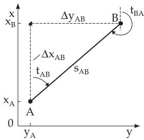  
Figure 3.39

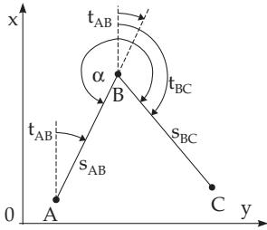  
Figure 3.40

3. Coordinate Transformation Between Two Rectangular Coordinate Systems In order to locate a given point on a country-map the local system $y ^ { \prime } , x ^ { \prime }$ is to be transformed into the system $y ,$ x of coordinates of the map (Fig. 3.41). The system $y ^ { \prime } { \mathrm { . } }$ $x ^ { \prime }$ is rotated into $y _ { \mathrm { { i } } }$ x by an angle $\varphi$ and is translated parallel by $y _ { 0 } , x _ { 0 }$ . The directional angles in the system $y ^ { \prime } , x ^ { \prime }$ are denoted by $\vartheta .$ . The coordinates of A and $B$ are given in both systems and the coordinates of a point $C$ in the $x ^ { \prime } , y ^ { \prime } { \mathrm { - s y s t e m } }$ . The transformation is given by the following relations:

$$
s _ { A B } = \sqrt { \Delta y _ { A B } ^ { 2 } + \Delta x _ { A B } ^ { 2 } } \mathrm { , ( 3 . 1 0 8 a ) }
$$

$$
s _ { A B } ^ { \prime } = \sqrt { \Delta y _ { A B } ^ { \prime 2 } + \Delta x _ { A B } ^ { \prime 2 } } ,\tag{3.108b}
$$

$$
q = \frac { s _ { A B } } { s _ { A B } ^ { \prime } } ,\tag{3.108c}
$$

$$
\varphi = t _ { A B } - \vartheta _ { A B } ,\tag{3.108d}
$$

$$
\tan t _ { A B } = { \frac { \Delta y _ { A B } } { \Delta x _ { A B } } } ,\tag{3.108e}
$$

$$
\tan \vartheta _ { A B } = \frac { \Delta y _ { A B } ^ { \prime } } { \Delta x _ { A B } ^ { \prime } } ,\tag{3.108f}
$$

$$
y _ { 0 } = y _ { A } - q x _ { A } \sin \varphi - q y _ { A } \cos \varphi , \quad ( 3 . 1 0 8 \mathrm { g } )
$$

$$
x _ { 0 } = x _ { A } + q y _ { A } \sin \varphi - q x _ { A } \cos \varphi ,\tag{3.108h}
$$

$$
y _ { C } = y _ { A } + q \sin \varphi ( x _ { C } ^ { \prime } - x _ { A } ^ { \prime } ) + q \cos \varphi ( y _ { C } ^ { \prime } - y _ { A } ^ { \prime } ) ,\tag{3.108i}
$$

$$
x _ { C } = x _ { A } + q \cos { \varphi ( x _ { C } ^ { \prime } - x _ { A } ^ { \prime } ) } - q \sin { \varphi ( y _ { C } ^ { \prime } - y _ { A } ^ { \prime } ) } .\tag{3.108j}
$$

Remark: The following two formulas can be used as a check.

$$
y _ { C } = y _ { A } + q s _ { A C } ^ { \prime } \sin ( \varphi + \vartheta _ { A C } ) , \quad ( 3 . 1 0 8 \mathrm { k } )
$$

$$
x _ { C } = x _ { A } + q s _ { A C } ^ { \prime } \cos ( \varphi + \vartheta _ { A C } ) .\tag{3.108l}
$$

If the segment AB is on the $x ^ { \prime } .$ -axis, the formulas reduce to

$$
a = \frac { \Delta y _ { A B } } { y _ { B } ^ { \prime } } = q \sin \varphi ,\tag{3.109a}
$$

$$
b = { \frac { \Delta x _ { A B } } { x _ { B } ^ { \prime } } } = q \cos \varphi ,\tag{3.109b}
$$

$$
y _ { C } = y _ { A } + a x _ { C } ^ { \prime } + b y _ { C } ^ { \prime } ,\tag{3.109c}
$$

$$
x _ { C } = x _ { A } + b x _ { C } ^ { \prime } - a y _ { C } ^ { \prime } ,\tag{3.109d}
$$

$$
y _ { C } ^ { \prime } = \Delta y _ { A C } b - \Delta x _ { A C } a ,\tag{3.109e}
$$

$$
x _ { C } ^ { \prime } = \Delta x _ { A C } b + \Delta y _ { A C } a .\tag{3.109f}
$$

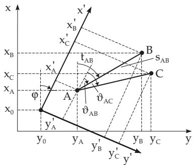  
Figure 3.41

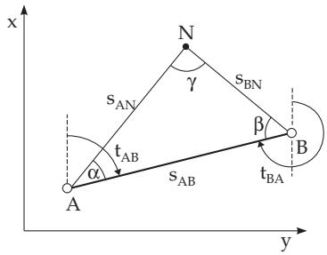  
Figure 3.42

##### 3.2.2.3 Applications in Surveying

The determination of the coordinates of a point N to be fixed by triangulation is a frequent measuring problem in geodesy. The methods of solving it are intersection, three-point resection, arc intersection, free stationing and traversing. The last two methods are not discussed here.

1. Intersection

1. Intersection of Two Oriented Lines or first fundamental problem oftriangulation: To determine a point N by two given points A and B with the help of a triangle ABN (Fig. 3.42).

Given: $y _ { A } , x _ { A } ; y _ { B } , x _ { B }$ . Measured: $\alpha , \beta ,$ , if it is possible also $\gamma \ : \mathrm { o r } \ : \gamma = 2 0 0 \ : \mathrm { g o n } - \alpha - \beta$ . Find: $y _ { N } , x _ { N }$ Solution:

$$
\tan t _ { A B } = { \frac { \Delta y _ { A B } } { \Delta x _ { A B } } } , ( 3 . 1 1 0 \mathrm { a } ) ~ s _ { A B } = { \sqrt { \Delta y _ { A B } ^ { 2 } + \Delta x _ { A B } ^ { 2 } } } = | \Delta y _ { A B } \sin t _ { A B } | + | \Delta x _ { A B } \cos t _ { A B } |\tag{,(3.110b}
$$

$$
s _ { B N } = s _ { A B } \frac { \sin \alpha } { \sin \gamma } = s _ { A B } \frac { \sin \alpha } { \sin \left( \alpha + \beta \right) } ,\tag{3.110c}
$$

$$
s _ { A N } = s _ { A B } \frac { \sin \beta } { \sin \gamma } = s _ { A B } \frac { \sin \beta } { \sin \left( \alpha + \beta \right) } ,\tag{3.110d}
$$

$$
t _ { A N } = t _ { A B } - \alpha ,\tag{3.110e}
$$

$$
t _ { B N } = t _ { B A } + \beta = t _ { A B } + \beta \pm 2 0 0 \mathrm { g o n } ,\tag{3.110f}
$$

$$
y _ { N } = y _ { A } + s _ { A N } \sin t _ { A N } = y _ { B } + s _ { B N } \sin t _ { B N } ,\tag{3.110g}
$$

$$
y _ { N } = x _ { A } + s _ { A N } \cos t _ { A N } = x _ { B } + s _ { B N } \cos t _ { B N } .\tag{3.110h}
$$

2. Intersection Problem for Non-Visible B If the point B cannot be seen from A, the directional angles $t _ { A N }$ and $t _ { B N }$ are to be determined with respect to reference directions to other visible points D and E whose coordinates are known (Fig. 3.43).

Given: $y _ { A } , x _ { A } ; y _ { B } , x _ { B } ; y _ { D } , x _ { D } ; y _ { E } , x _ { E }$ . Measured: δ in $A , \varepsilon$ in B, and if it is possible, also γ . Find: $y _ { N } , x _ { N }$

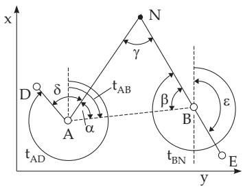

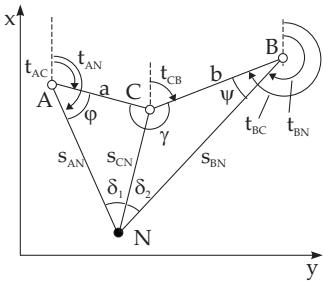  
Figure 3.43  
Figure 3.44

Solution: Reducing to the first fundamental problem, calculating tan $t _ { A B }$ , according to (3.110b) yields:

$$
\tan t _ { A D } = { \frac { \Delta y _ { A D } } { \Delta x _ { A D } } } ,\tag{3.111a}
$$

$$
\tan t _ { B E } = \frac { \Delta y _ { E B } } { \Delta x _ { E B } } ,\tag{3.111b}
$$

$$
t _ { A N } = t _ { A D } + \delta ,\tag{3.111c}
$$

$$
t _ { B N } = t _ { B E } + \varepsilon ,\tag{3.111d}
$$

$$
\alpha = t _ { A B } - t _ { A N } ,\tag{3.111e}
$$

$$
\beta = t _ { B N } - t _ { B A } ,\tag{3.111f}
$$

$$
\tan t _ { A N } = { \frac { \Delta y _ { N A } } { \Delta x _ { N A } } } ,\tag{3.111g}
$$

$$
\tan t _ { B N } = \frac { \Delta y _ { N B } } { \Delta x _ { N B } } ,\tag{3.111h}
$$

$$
x _ { N } = \frac { \Delta y _ { B A } + x _ { A } \tan t _ { A N } - x _ { B } \tan t _ { B N } } { \tan t _ { A N } - \tan t _ { B N } } ,\tag{3.111i}
$$

$$
y _ { N } = y _ { B } + ( x _ { N } - x _ { B } ) \tan t _ { B N } .\tag{3.111j}
$$

2. Three-Point Resection

1. Snellius Problem of Three-Point Resection or to determine a point N by three given points   
A, B, C; also called the second fundamental problem oftriangulation (Fig. 3.44):   
Given: $y _ { A } , x _ { A } ; y _ { B } , x _ { B } ; y _ { C } , x _ { C }$ . Measured: $\delta _ { 1 } , \delta _ { 2 }$ in $N$ . Find: $y _ { N } , x _ { N }$   
Solution:

$$
\tan t _ { A C } = { \frac { \Delta y _ { A C } } { \Delta x _ { A C } } } ,\tag{3.112a}
$$

$$
\tan t _ { B C } = { \frac { \Delta y _ { B C } } { \Delta x _ { B C } } } ,\tag{3.112b}
$$

$$
a = \frac { \Delta y _ { A C } } { \sin t _ { A C } } = \frac { \Delta x _ { A C } } { \cos t _ { A C } } ,\tag{3.112c}
$$

$$
b = \frac { \Delta y _ { B C } } { \sin t _ { B C } } = \frac { \Delta x _ { B C } } { \cos t _ { B C } } ,\tag{3.112d}
$$

$$
\gamma = t _ { C A } - t _ { C B } = t _ { A C } - t _ { B C } ,\tag{3.112e}
$$

$$
{ \frac { \varphi + \psi } { 2 } } = 1 8 0 ^ { 0 } - { \frac { \gamma + \delta _ { 1 } + \delta _ { 2 } } { 2 } } ,\tag{3.112f}
$$

The equality (3.112f) is a first condition to determine $\varphi$ and ψ . A second condition one gets from (2.114) and (2.115), p. 83:

$$
{ \frac { \sin \varphi + \sin \psi } { \sin \varphi - \sin \psi } } = \tan { \frac { \varphi + \psi } { 2 } } \cdot \cot { \frac { \varphi - \psi } { 2 } } .\tag{3.112g}
$$

With the sine law (3.88) follows

$$
{ \frac { \sin \varphi } { \sin \delta _ { 1 } } } = { \frac { s _ { C N } } { a } } , \quad { \frac { \sin \psi } { \sin \delta _ { 2 } } } = { \frac { s _ { C N } } { b } } ,\tag{3.112h}
$$

putting into (3.112g) gives

$$
\tan { \frac { \varphi - \psi } { 2 } } = \tan { \frac { \varphi + \psi } { 2 } } \cdot { \frac { \sin \varphi - \sin \psi } { \sin \varphi + \sin \psi } } = \tan { \frac { \varphi + \psi } { 2 } } \cdot { \frac { b \sin \delta _ { 1 } - a \sin \delta _ { 2 } } { b \sin \delta _ { 1 } + a \sin \delta _ { 2 } } } .\tag{3.112i}
$$

From (3.112i) one gets ${ \frac { \varphi - \psi } { 2 } } $ and together with (3.112f)

$$
\varphi = { \frac { \varphi + \psi } { 2 } } + { \frac { \varphi - \psi } { 2 } } , \quad \psi = { \frac { \varphi + \psi } { 2 } } - { \frac { \varphi - \psi } { 2 } } .\tag{3.112j}
$$

From here one can determine the following line segments and points:

$$
s _ { A N } = \frac { a } { \sin \delta _ { 1 } } \sin ( \delta _ { 1 } + \varphi ) , \mathrm { ( 3 . 1 1 2 k ) }
$$

$$
s _ { B N } = \frac { b } { \sin \delta _ { 2 } } \sin ( \delta _ { 2 } + \psi ) ,\tag{3.112l}
$$

$$
s _ { C N } = { \frac { a } { \sin \delta _ { 1 } } } \sin \varphi = { \frac { b } { \sin \delta _ { 2 } } } \sin \psi , ( 3 . 1 1 2 \mathrm { m } )
$$

$$
x _ { N } = x _ { A } + s _ { A N } \cos t _ { A N } = x _ { B } + s _ { B N } \cos t _ { B N } ,\tag{3.112n}
$$

$$
y _ { N } = y _ { A } + s _ { A N } \sin t _ { A N } = y _ { B } + s _ { B N } \sin t _ { B N } .\tag{3.112o}
$$

2. Three-Point Resection by Cassini

Given: $y _ { A } , x _ { A } ; y _ { B } , x _ { B } ; y _ { C } , x _ { C }$ . Measured: $\delta _ { 1 } , \delta _ { 2 }$ in N. Find: $y _ { N } , x _ { N }$

For this method two reference points P and $Q$ are to be used, which are on the reference circles passing through $A , C , P$ and $B , C , Q$ so that both are on a line containing N (Fig. 3.45). The centers of the circles $H _ { 1 }$ and $H _ { 2 }$ are at the intersection points of the mid perpendicular of $\overline { { A C } }$ and of $\overline { { B C } }$ with the segments $P C$ and $Q C$ . The angles $\delta _ { 1 } , \delta _ { 2 }$ measured at N appear also at $P$ and $Q$ as angles of circumference.

Solution:

$$
y _ { P } = y _ { A } + \left( x _ { C } - x _ { A } \right) \cot \delta _ { 1 } ,\tag{3.113a}
$$

$$
x _ { P } = x _ { A } + \left( y _ { C } - y _ { A } \right) \cot \delta _ { 1 } ,\tag{3.113b}
$$

$$
y _ { Q } = y _ { B } + \left( x _ { B } - x _ { C } \right) \cot \delta _ { 2 } ,\tag{3.113c}
$$

$$
x _ { Q } = x _ { B } + ( y _ { B } - y _ { C } ) \cot \delta _ { 2 } ,\tag{3.113d}
$$

$$
\cot t _ { P Q } = \frac { \Delta y _ { P Q } } { \Delta x _ { P Q } } ,\tag{3.113e}
$$

$$
x _ { N } = x _ { P } + { \frac { y _ { C } - y _ { P } + \left( x _ { C } - x _ { P } \right) \cot t _ { P Q } } { \tan t _ { P Q } + \cot t _ { P Q } } } ,\tag{3.113f}
$$

$$
y _ { N } = y _ { P } + ( x _ { N } - x _ { P } ) \tan t _ { P Q } \qquad ( \tan t _ { P Q } < \cot t _ { P Q } ) ,\tag{3.113g}
$$

$$
y _ { N } = y _ { C } - ( x _ { N } - x _ { C } ) \cot t _ { P Q } \qquad ( \cot t _ { P Q } < \tan t _ { P Q } ) ,\tag{3.113h}
$$

Dangerous Circle: When choosing the points it is to be ensured that they do not lie on one circle, because then there is no solution; one talks about a so-called dangerous circle. The closer the points are near to the dangerous circle, the less gets the accuracy of the method.

3. Arc Intersection

With this method a so-called new point N is to be determined as intersection point of two arcs around two points A and $B$ with known coordinates and with measured radii $s _ { A N }$ and $s _ { B N }$ (Fig. 3.46). The unknown line segment $s _ { A B }$ is calculated and the angles are to be calculated from the now already known three sides of the triangle $A B N$

A second solution – not discussed here – starts from the decomposition of the general triangle into two

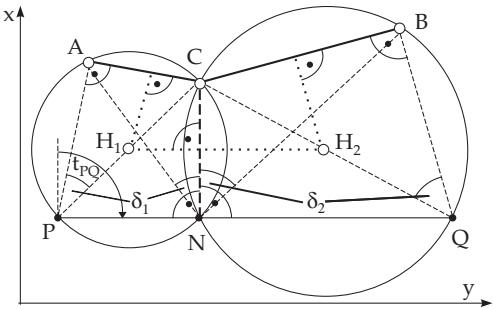

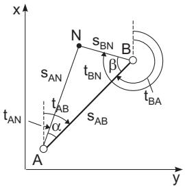  
Figure 3.45  
Figure 3.46

right-angled triangles.

Given: $y _ { A } , x _ { A } : y _ { B } , x _ { B }$ . Measured: $s _ { A N } ; s _ { B N }$ . Find: $s _ { A B } , y _ { N } , x _ { N }$ Solution:

$$
s _ { A B } = \sqrt { \Delta y _ { A B } ^ { 2 } + \Delta x _ { A B } ^ { 2 } } ,\tag{3.114a}
$$

$$
\tan t _ { A B } = { \frac { \Delta y _ { A B } } { \Delta x _ { A B } } } ,\tag{3.114b}
$$

$$
t _ { B A } = t _ { A B } + 2 0 0 \mathrm { g o n } ,\tag{3.114c}
$$

$$
\cos \alpha = \frac { s _ { A N } ^ { 2 } + s _ { A B } ^ { 2 } - s _ { B N } ^ { 2 } } { 2 s _ { A N } s _ { A B } } ,\tag{3.114d}
$$

$$
\cos \beta = \frac { s _ { B N } ^ { 2 } + s _ { A B } ^ { 2 } - s _ { A N } ^ { 2 } } { 2 s _ { B N } s _ { A B } } ,\tag{3.114e}
$$

$$
t _ { A N } = t _ { A B } - \alpha ,\tag{3.114f}
$$

$$
t _ { B N } = t _ { B A } - \beta ,\tag{3.114g}
$$

$$
y _ { N } = y _ { A } + s _ { A N } \sin t _ { A N } ,\tag{3.114h}
$$

$$
x _ { N } = x _ { A } + s _ { A N } \cos t _ { A N } ,\tag{3.114i}
$$

$$
y _ { N } = y _ { B } + s _ { B N } \sin t _ { B N } ,\tag{3.114j}
$$

$$
x _ { N } = x _ { B } + s _ { B N } \cos t _ { B N } .\tag{3.114k}
$$
